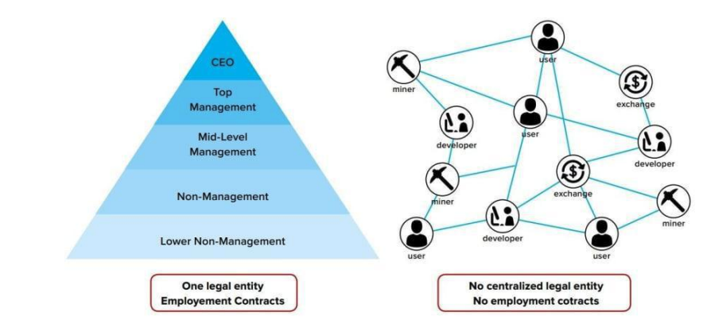
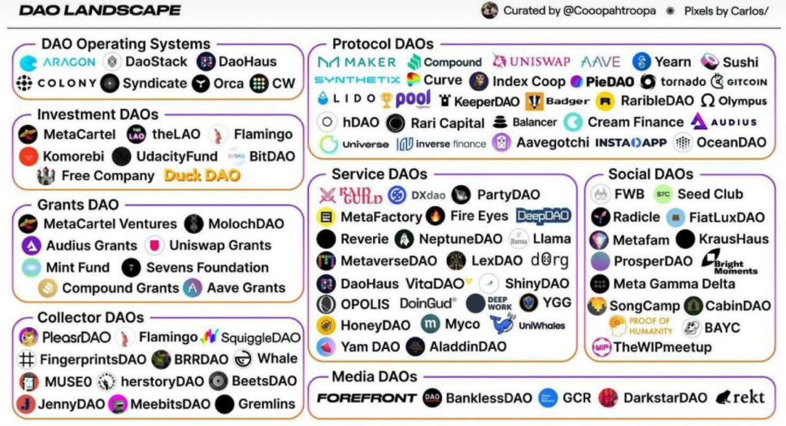

# HOPOT 火锅
## 火锅简介(V0.1)
“基于结合曲线，火锅为正常个体提供了一种公平的方式参与 DAO，实现共同目标"
## 摘要
火锅，一个多链原生 DAO 发布平台，将普通公众链接到一个 DAO，一种新兴的创造性的组织生产力的方法。DAO:分权自治组织(decentralized autonomous organization)是指在没有独裁主义和垄断的情况下，人们可以投资、投票、赚钱的地方。区块链由于其透明和健壮的特性，在将个体绑定到一个组中扮演着重要的角色。

不同的个体可以通过写在区块链上的预设规则相互信任: 一个智能合约。在火锅平台，非技术背景的人可以通过预设的规则无缝地、毫不费力地启动新的 DAO 或加入现有的 DAO。

这些规则主要包括项目目标(例如:比如把人送上火星)，象征性的经济和投票权。由于以下优点，我们指导人们使用绑定曲线产品(BCO)的Token经济部分。

首先，它是一种特殊的自动做市商(AMMs)，即自动构建市场、操作流动性和指令。其次，它将价格定位为供需透明的函数。最后，排除了传统的单簿式集中做市商造成的波动。它确保产品的价格是有价值的，而且只值人们愿意为它支付的金额。

结合区块链和键合曲线，显示了火锅之间建立桥梁的潜力，没有离线信任但只有链上信任的个体。

## 1. 介绍了火锅
### 1.1《盗梦空间》
当秋天和冬天来临的时候，我们的脑海中会突然出现一种美食——火锅。和一群亲密的家人或朋友一起吃一顿温暖、舒适、社交的饭。另外，因为所有的食物都是在餐桌上做的，所以这是一顿简单的饭。中国火锅是一种互动的用餐方式，食客们围坐在桌子中央的一锅沸腾的汤周围，汤里放着各种各样的原料——肉、海鲜、蔬菜、豆腐和淀粉——薄片或薄片小块快速烹饪。食客可以在沸腾的液体中加入任何他们喜欢的东西。然后，他们可以用铁丝勺从锅里取出煮熟的食物，用不同的蘸酱调味。

从火锅里继承了这个想法，很多人会把不同的食物倒入汤里，填饱肚子，DAO 显示了一个类似的模式:不同的人抛出各种资源作为成分，组成一个丰富多彩的组织，以满足他们共同的梦想。

### 1.2 动力
然而，由于信息和技术细节的蓬勃发展，对于一个普通人来说，潜入区块链世界的野生丛林并不容易。因此，我们试图降低普通人进入 DAO 区块链世界的门槛，保持数学级的健壮性。

一个去中心化、开源的 DAO 启动平台可以作为实现这一目标的合适中间件。这个平台本身是由多链智能合约、一个 web 界面、SDK 和针对不同目标 DAO 的各种工具箱(记住，火锅平台本身也是一个DAO)组成的。最值得注意的是每个决定都是由社区自己选择和监督的，这触及了民主的核心:人人平等。

### 1.3 约定
1. 本文中的货币或货币不是指任何主权货币，而是指加密货币，包括ETH、USDT、DOT、DAI等。
2. 以美元计价的价格仅用于计量单位。
3. 税收意味着买入曲线和耗尽曲线之间的汇率差异部分。
4. DAO本身和火锅平台都可以征税(0.5%)。

## 2. DAO
- 2.1.什么是 DAO?

	DAO “分散式自治组织”，是由社区领导的实体，没有中央权威。它是完全自治和透明的: 智能合约奠定了基本规则，执行商定的决策，在任何时候，提案、投票，甚至代码本身都可以公开审计。最终，DAO 完全由其个体成员管理，这些成员共同对项目的未来做出关键决策，如技术升级和资金分配。
	
	
	
	一般来说，社区成员创建关于协议未来操作的提案，然后聚集在一起对每个提案进行投票。然后，通过智能合约中实例化的规则接受并执行达到某种预定义级别的共识的提议。在这个框架下，大公司中常见的层次结构让位于社区协作。DAO 的每个成员都在某种程度上监督协议。这个框架的优雅之处在于激励机制的一致性。也就是说，个人的最大利益是直截了当地投票，只批准对自己本身最有利的提案。健康、健壮的协议将获得更多的使用，进而增加每个 DAO 成员所拥有的 Token 的价值。
- 2.2 DAO 是如何工作的?
	
	DAO 的规则是由社区成员组成的核心团队通过使用智能合约建立的。这些智能合约为 DAO 的操作提供了基础框架。它们是高度可见的、可验证的和可公开审计的，因此任何潜在成员都可以完全理解协议的每一步是如何运作的。
	
	一旦这些规则正式写入区块链，下一步就是融资: DAO 需要弄清楚如何获得资助和如何赋予治理。这通常通过发行 token 来实现，协议通过发行 token 来筹集资金填满 DAO 库。作为对其法令的回报，token 持有者被赋予特定的投票权，通常与他们的持有量成比例。

	一旦资金到位，DAO 就可以部署了。在这一点上，一旦代码被推入生产环境中，除了通过成员投票达成共识外，它再也不能通过任何其他方式进行更改。

	也就是说，没有专门的机构可以修改 DAO 的规则;这完全由 token 持有者社区来决定。
- 2.3如何参与?

	一旦你找到了感兴趣的项目，有几种不同的方式可以直接参与。我们认为重要的是要注意并非所有 DAO 都具有相同的目的，因此第一步是确定每个 DAO 的核心功能。对于专注于技术治理的 dao，重要的是了解向 token 持有人授予了什么样的投票权，以及有什么样的提议处于危险之中。
	
	在一些情况下，例如 Uniswap , token 持有者可以在他们之间收取的部分费用来投票决定如何分配协议。而在 Compound 等其他协议中，token 持有者可以就分配这些协议费用进行投票，针对 bug 修复和系统升级。这种方法还允许自由职业者和那些对项目感兴趣的人能够通过 DAO 资助项目(DAO 经常在他们的 Discord 服务器上发布这类特殊项目)加入临时项目，并获得工作报酬。

	对于其他 dao，重点不是协议的技术方面的治理，而是资金池和分配。例如，SharkDAO 的存在主要是为了促进个人 token 持有者的资金池，作为获取罕见的 nft 的一种手段，否则对普通人来说太昂贵了(在这种情况下，目标是获取可以卖到 25万美元以上的NFT。)这种方法为个人利用集体资产池的力量提供了新的机会。

	这里的一个关键要点是 DAO 内部的透明性。每个提案的细节都很容易获得，投票历史被连续记录，甚至特定Token持有者的投票记录也可以被观察到。dao 经常呼吁社区通过赠款资助的项目构建有趣的想法，具有企业家头脑的个人可以自由地提交建议，以帮助领导协议的未来开发。

DAO参与的级别各不相同。你可以选择切换到治理 token 并关注 Snapshot 投票; 你可以加入 DAO 的 Discord 并承担实际的项目，以补偿你的贡献; 您甚至可以通过在会议上建立网络来投资感兴趣的 dao。你可以选择你想要参与的程度。因此，当协议成功时，Token 持有者也会成功

- 2.4 DAO 生态

	如今，有 100 多名 dao 管理着超过 100 亿美元的资产。
	
		

	- 2.4.1 DAO Operating Systems

		dao 的第一章是用于创建 dao 的操作系统。这些项目为社区提供了不同的模板、框架和工具来共享资源并启动他们的第一个 DAO。它们通常提供智能合约和接口以促进去中心化社区的链上行动。DAO 操作系统使任何有一定技术能力的人都可以轻松地开始一个 DAO。
	- 2.4.2 Grants DAOs

		dao 的第一个实际用例是授予。社区捐赠资金并使用 DAO 投票决定如何以治理提案的形式将资金分配给不同的贡献者。赠款 DAOs 的治理最初是通过不可转让的股份进行的，这意味着参与在很大程度上是由社会资本驱动的，而不是财务回报。赠款 dao 表明，利基社区在资本配置方面比正式机构更灵活。
	- 2.4.3 Protocol DAOs 
	
		协议 daos 将权力从核心团队转移到社区手中，为项目创造一种向市场发行可替换Token的新方式。而第一章 DAOs 具有不可转让的股份，协议 DAOs 是第一个发行具有二级市场价值的可转让 ERC20 Token。这些 Token 通常用于治理协议，这意味着Token 持有者拥有提议、投票和实现网络底层机制更改的唯一权力。

		项目通常会投票决定如何分发 Token，从而为流动性挖掘、收益、公平发行和介于两者之间的一切打开了大门。协议 dao 为任何网络提供了一个框架，以发布(希望)由其社区拥有和操作的 Token 。
	- 2.4.4 investment DAOs

		随着协议 dao 为世界带来了新的 Token ，团体联合起来投资于它们似乎是合乎逻辑的。在进行了很长一段时间的非营利性 dao 之后，投资俱乐部改变了策略，让会员专注于创造回报。虽然这些 DAO 比授权 DAO 具有更多的法律限制，但它们表明，任何个人团体都可以聚集在一起，以较低的进入门槛投资更多的资金。投资 dao 允许成员聚集资金并在项目的早期阶段进行投资。
	- 2.4.5 Service DAOs

		随着世界上出现这么多 Token，项目需要人才。服务 DAO 是人才分配器，使用链上凭证从一个 DAO 到另一个 DAO 漏斗和分配资源。服务 dao 为开放互联网工作的个人创建了去中心化的工作组——本质上充当加密原生人才机构。
		
		从法律到创意，从治理到市场营销，从开发到资金管理，服务 dao 创建了渠道来雇佣 web3 雇佣兵。工作通常会得到ERC20 Token的奖励——为网络创造的价值提供所有权。服务 dao 探索工作的未来以及加密原生世界中的就业情况。
	- 2.4.6 Social DAOs

		成为 DAO 的成员意味着什么? 在一个以投机为主的行业中，社交 dao 关注的是社交资本而不是金融资本。社交 dao 是群聊的自然演变，在群聊中，朋友变成了同事。社交媒体把每个人都变成了媒体公司，而社交 dao 则把每个群组聊天变成了数字业务。他们挑战了成为社区一份子的意义，并提供了成为社区一份子的方法，数字原生部落。社交 dao 表明，加密货币不仅仅是快速赚钱，互联网是遇到有相似兴趣的人的最佳场所。
	- 2.4.7 Collector DAOs

		NFT。你听说过他们,而且有一段时间，你无法忽视他们。在主流采用的背景下，收藏家 dao 出现并收集它们。策展人群体是特定艺术家、平台或系列作品背后的粘合剂，帮助他们建立更高价值。收藏家 dao 寻求策划哪些 nft 具有长期价值。
	- 2.4.8 Media DAOs

		在一个信息可以在全球范围内获取的时代，对传播信息的叙述的所有权也应该是可以获得的。媒体 dao 将这种权力还给了那些消费内容的人。它们分解了作者、主播和读者参与发布内容的方式。无论是激励贡献的媒体挖掘项目，还是让哪个话题成为头版头条的管理，媒体 dao 都将消费变成了双向街道。媒体 dao 共享一个渠道的开放议程，以传播意识和新闻。
- 2.5 有一些 dao 需要检查
	- DAOhaus

		DAOhaus是一个用于发布和运行 dao 的无代码平台。它由社区拥有和经营。如果您有兴趣创建自己的 DAO 或探索这个充满活力的领域，请不要再看了。
	- MakerDAO

		如果您想为引入世界上第一个无偏性稳定货币 DAI 的协议做出贡献，您可以通过对 Maker 协议的更改进行投票来参与治理
	- RaidGuild:
	
		这个基于服务的 DAO 起源于 MetaCartel 网络并深深扎根于 Web3 世界。如果你想为公会贡献自己的开发、营销或设计技能，他们会寻找高素质人才继续消灭产品困难。
	- Proof Of Humanity:

		这个人类的抗密码登记系统使用社会验证和 Kleros 的法庭来分发通用基本收入(UBI)Token给链上被验证的人类。如果你想加入正义革命，从这个民主的 DAO 开始。
	- Opolis:

		这个成员所有的数字就业合作社为独立工作者提供福利和共享服务。如果你对未来的工作充满激情，想要对未来的工作发表自己的看法，请加入这里
	- BanklessDAO:

		有兴趣通过内容传播 Web3 词汇和教育大众吗?您可能会对这个以媒体为中心的 DAO 感兴趣。
	- MolochDAO:
	
		此 OG DAO 授予赠款，以推进以太坊生态系统。

## 3.为什么我们需要键合曲线?
加密生态系统为过时的商业模式带来了无数创新和颠覆。区块链的去中心化特性允许新的市场参与者以以前未探索过的方式与现有企业竞争。

这是通过创新的融资方式实现的，只有通过区块链和加密货币领域的进步才成为可能。区块链领域最近的一个重大进展是在自动定价的粘着曲线中形成。

债券曲线产品(bond Curves Offerings，简称 BCOs)允许项目有效、公平、可靠地将Token分发给项目使用者，项目采用者以透明的方式为新的商业风险投资提供资金和投机
### 3.1什么是债券曲线
债券曲线建立在经济学中一个最基本的概念之上:价格是供给和需求的函数。这条经得住考验的经济法，是对一句更熟悉的格言的复杂研究:一项资产的价值，只取决于有人愿意为它支付的价格。每个卖方都需要一个交易对手来购买，而每个买方都需要与愿意出售的人相匹配。随着越来越多的参与者希望购买一项资产，卖方希望以更高的利率获得补偿，因为该资产目前在市场上有更大的需求。

在出售资产时，情况也正好相反。随着越来越多的资产可供出售，价格将会下降，这反映了市场需求的下降。在任何时间点，资产的价格反映了市场参与者之间的均衡状态，即哪些愿意出售资产的人和哪些愿意购买资产的人。

传统上，流程由一个集中的实体监督;在撮合市场参与者和确保流动性的同时，监督进入的买卖订单的人。债券曲线提供了一种创新的解决方案，因为它们不需要中央实体的监督来创建、监督和执行市场对这种均衡的追求。

与依赖第三方实体来创建市场和调解交易不同，“绑定曲线” 依赖于一种名为 “自动造市商” (Automatic market Maker)的智能合约中的数学功能。
### 3.2 什么是自动做市商?
传统的资产交换依赖于一个订单簿来记录市场参与者愿意为他们想要购买或出售的资产支付或获得什么。订单簿提供了市场流动性的清晰记录并允许交易所提供买方愿意出价和卖方愿意出价之间的接近(价差)。

自动做市商的不同之处在于，买方或卖方不需要依赖交易对手来执行订单簿上的交易。从本质上讲，网络参与者在他们交易订单的另一端就是合约本身。该合约铸造或创建新的Token，在燃烧或销毁已售出的 token 时将其放入购买订单的流通中，从而将其从流通中消除。

用于创建市场、管理流动性和执行订单的数学公式是债券曲线的核心。这种对可审计数学公式透明度的基本依赖，创造了以前没有实现的新的市场机会。		
### 3.3 Bonding Curve的主要优点是什么?
债券曲线确保每一个新铸造的Token(出售给市场中的买方)，比以前的Token更贵。因为每个Token的价格是由曲线/公式本身定义的，每个市场参与者都确切知道每个Token在任何给定时间的成本。

由于Token在曲线的最低部分价格最低，早期投资者有价格优势。与后来进入市场的人相比，早期买家有相当大的上行潜力，因为当供应不足时，价格也会最低。

与传统资产定价机制相比，债券定价曲线最根本的优势在于，资产定价在所有阶段都是透明的、明确的和不可改变的。市场能够通过明确的规则达到共识的均衡，不需要第三方的干预。

此外，这种筹资方法解决了许多导致首次Token发行(ICO)模型中欺诈和挪用的低效问题。启动报价不是由项目创始人任意设定的。所有的Token在任何时候都有账户。Token的分发是自动的和可配置的
### 3.4 治理如何?
更重要的是，大多数粘合曲线支持一个分散的自治组织，确保参与者在项目的治理和战略方向中有发言权和影响力。

除了早期参与者通过更广泛的市场采用项目用例获得投资收益之外，他们还能够在构建市场需要的解决方案的社区中扮演积极的角色。
### 3.5 BCO 背后的项目有什么好处?
最终，债券曲线公司能够通过提取一小部分已投入市场的担保资金来为项目融资。不同的项目采用不同的机制将这些投资商业化。一些项目在传统的订单簿中通常可以找到买入价和卖出价之间的差异。

该金额在启动时在合同中定义，并由所有网络参与者进行审核。 其他项目对 token 和其他资产(如ETH或稳定币)之间的转换收取费用。目前市场上另一种流行的方法是在每笔交易中收取一小部分费用。
### 3.6 BCO 如何发布?
不管这个公式采用什么方法，大多数 BCOs 都需要向合约注入一定程度的初始流动性。最初的启动将通过在合约内创建一个供交易员使用的初步流动性水平来支持随后的参与者。

项目通常通过一种称为初始债券曲线发行 (IBCO) 的机制启动，在此期间，来自早期投资者的流动性汇集在一起，并立即注入到合同中，以制造第一批代币，通常以折扣价。但由于数学公式的可编程性质，启动的可能性是巨大的，通常是量身定制，以满足每个独特的项目的需求和目标。
### 3.7结论
债券曲线产品提供了一种可行的融资结构，解决了传统方法的许多低效之处。有了更大的透明度和持续的流动性，项目团队和他们的投资者能够更有效地定价和融资。
## 4. 治理
在公共领域的治理中，需要通过投票来决定资金的使用，从而决定哪些项目得到优先资助和关注。随着 DeFi 和 NFT 社区规模的巨大增长，如何管理去中心化的协议变得更加重要。

现在和未来几年，这些社区面临的最直接的挑战之一是治理——管理集体决策的行为，以优化资金和运营。然而，治理需要大量的协调成本，这是由于需要有网络参与者参与对每一个决定的投票。

在新型的去中心化网络中，这些协调成本可以从根本上降低，在这种网络中，智能合约使参与者能够合作治理。这些新的网络被称为 dao——人们聚集在一起，有一致的动机和共同的利益，没有一个领导者或单一的故障点，几乎完全靠代码运行。

许多新的协议正在利用这种结构建立，迄今为止，大部分活动都在基于开放金融的系统中，但也有越来越多的活动在文化网络中购买和交易艺术品和其他收藏品。

在许多方面，dao 可以被视为投资银行、公司和社交俱乐部的混合体，它们通过加密承诺拼凑在一起。
### 4.1 Snapshot
#### 4.1.1 什么是 Snapshot?
Snapshot 是一个项目可以创建提案，让人们对使用加密货币进行投票的地方。在行业中，这个过程被称为“投票信号”。传统上，使用加密货币投票通常会产生处理货币从一个钱包到另一个钱包移动的费用。但在 Snapshot 上，这种情况不会发生，这要归功于称为 IPFS 的去中心化存储网络的巧妙使用。

由于 Snapshot 不使用“链上”验证，任何投票基本上都是免费的。对于希望使用区块链技术查询受众想法的 dao 来说，这是一个流行的工具。
#### 4.1.2 如何使用 Snapshot?
对于希望使用快照的 dao，它们需要在以太坊命名服务 (Ethereal Naming Service，简称 ENS)上有一个现有的配置文件。

一旦他们有了这些信息，他们就会在 ENS 网站上添加一个记录，以便在该地址查看选票。与此同时，用户需要一个带有所需加密货币的钱包地址才能参加投票。

例如，在 Decrypt 的 Snapshot 页面上，在钱包中持有我们的一个 nft 的用户(如 MetaMask )将有资格投票。

用户只需将他们的钱包连接到 Snapshot 的网站，就可以对网站上的任何公开提案进行投票。
#### 4.1.3 为什么火锅使用 Snapshot 作为投票工具?
传统上，加密货币项目必须自己创建基础设施来进行这类投票或使用其他不去中心化的方法。这些方法都很耗时，而且可能会被那些不把项目的最大利益放在心上的党派所接管，从而扭曲选票。

Snapshot 的不同之处在于，它允许项目寻找持有自己选择的加密货币的最忠诚成员，并让他们做出决定。它通过不将事务发送到区块链来实现这一点。
### 4.2 投票模型
#### 4.2.1 传统的投票模式
通常有两种投票方式:“一人一票”和“一美元一票”。

- `one person, one vote`

	一个人一票的本质是无论你多么在乎一件事，你只能投它一票。
- `one dollar, one vote`

	一美元一票是一种用货币(或代币)投票的方式。这样才有在乎的人更多关于一个问题可以贡献更多(如果你有足够的钱/Token)。
	
#### 4.2.2 二次投票
如果我们想要同时考虑人们对不同问题的关注程度，并完全避免“用钱买影响力”的困境呢? 

二次投票的规则是:

- 如果第一次投票面值为 1，第二次投票面值为 2，第 N 次投票面值为 N，投 N 票的代价为1+2+…+N。
- 如果你想让一个项目获得更多的奖金，更经济的方式是让更多的人为 DAOS 的提案投票。
- 如果提案 A 从 10 个人那里总共得到 10 张选票，而提案 B 从 1 个人那里总共得到 10 张选票，那么提案 A 将获得比提案 B 高得多的奖金.				

### 4.3 Discord
#### 4.3.1 Discord 是什么?
Discord 是一个交流平台，类似于 Slack，它允许成员通过聊天、语音和视频进行交流。Discord 是许多 web3 组织进行内部讨论和与社区互动的首选工具。
#### 4.3.2它是如何工作的?
Discord 允许基于用户角色的多种分层权限，并支持各种各样的“机器人”，它们可以“插入”以获得额外的功能。公共的 Discord 服务器允许任何人加入，而私人的 Discord 服务器需要邀请才能加入。
### 4.4 Gnosis Safe
Gnosis Safe 是一款智能合约钱包，允许用户安全地存储以太币和 ERC20 token并与去中心化的 web 交互。

它的核心是一个多重签名的钱包。这意味着用户需要通过他们的 Dapp 应用程序和 Gnosis 安全验证器(浏览器扩展)确认交易。

我们正在努力在不久的将来增加额外的身份验证选项。大多数去中心化钱包使用以太坊上外部拥有的账户(EOAs)。

eoa 完全由私钥控制——它是介于用户和完全控制钱包之间的唯一东西。

这意味着如果您的私钥丢失或泄露，您的资金就不再安全。

Gnosis Safe 是不同的。与使用EOA不同，Gnosis Safe 完全使用智能合约进行操作，智能合约定义了访问控制权限并启用了更复杂的安全特性。
## 5. 目标用户
### 5.1 专用项目
当人们凝视着银河系时，他们可能会想是否可以飞到火星去度假。的确，以一个人的能力听起来是不可能的。不过，你可以通过申请获得有关火锅的资金和技术知识。我们相信“人越多越好”的口号。人类可以通过很多人来实现比一只猴子能做的事情更重要的事。
### 5.2 Media Dao
想象一下，你最喜欢的一部电视剧因为独立制作公司的破产而停止了新剧集的发布，你感到很恼火。你无法独立完成，因为你的财务预算非常庞大。传统上，你不能做任何事情除了在 bbs 上喃喃自语。

然而，你现在可以在火锅上创建一个 Media DAO 并聚集那些有同样愿望的人群。其目的是制作公共媒体内容，让任何人都能参与到媒体创作中。

内容生产的激励计划通常是设定的，社区的方向是由去中心化的治理决定的。作为回报，你可以观看新版本，如果新版本被一些商业流媒体传播，甚至还能获得红利。
### 5.3 民权组织
lgbtq、BLM 等起义的社会运动展现了人民的力量。然而，这些团体缺乏持续不断地发出自己的声音。火锅可以通过激励把这些人凝聚成一个更强大的群体。
### 5.4 粉丝流量经济
通过火锅，你可以将你的粉丝引向你自己的 DAO 并在不受平台影响的情况下获得奖励。例如，推广和销售任何你认为与你的广播有关的东西。如果您没有 DAO，您也可以通过联属营销来推广其他 DAO。

更重要的是，你的粉丝在给小费后可以得到代币兑换。这意味着他们也成为你的一部分，可以分享你日益增长的影响力的兴趣。你可以把这个过程看作是你影响的一个小规模的首次公开募股和金融证券化。
### 5.5 投资
由于个人投资者基本没有直接投资一级市场的资金规模，无法参与前期项目投资，投资 DAO 的出现解决了这一问题。尽管这些投资 dao 比赠款 dao 有更多的法律限制，

任何一群人都可以聚集在一起，以更低的进入门槛投入更多的资金，一个人拥有的钱少但钱多，更多的资金就会有更高的发言权和优先权，从而带来更高的资本回报。

投资 DAO 体现了以社区为导向的成员结构并以传统风险投资基金模式无法比拟的方式提供了基本的参与灵活性。

投资于 dao 允许成员集中资金并在项目中投资
### 5.6 传统的公司
管理的原罪源于人类世界经过两百多年的工业革命，由“个人手工业、家庭小作坊”向“工业化机器批量生产”转变的必然结果。整个工业化过程离不开泰勒科学管理的“控制主义”。以精神为主轴的管理风格。两百年来，为了“效率和可控性”，大多数公司倾向于追求标准化、程序化和制度化。最后，他们也给人编程，去除人的大脑，人的思想，人的因素。

火锅为这些公司提供了一个更灵活的框架来协调人员和资金。DAO 可以通过遵循建议来扁平化公司。把人当作人来对待，每个人都是有思想、有尊严的个体，没有人能控制谁或者谁必须依赖谁。因为平等，每个人都有一个更整体的视角，可以思考如何创造个人价值来支持一个网络。

因为他们可以自由连接和自主响应，每个人都可以更快地响应市场变化，有更强的适应生存能力。远离前线的老板将不再是决策中心。

- 在过去，如果一个节点坏了，整个链就会坏。
- 现在，即使一个节点被移除，一个组织也不会被摧毁。

## 6. 火锅平台去中心化存储
火锅网站本身作为接口将存储在 IPFS 和 IPNS 中，而不是传统的 HTTPs 框架。
### 6.1 HTTPs 的问题
HTTPs 鼓励高度集中的 Web。网络的初衷是去中心化。然而，它已经变得越来越集中，今天越来越多的人依赖于少数几个网站的服务。

HTTPs 成为了一个脆弱的、高度集中化的、无效的、过度依赖于主干的协议。像美国国家安全局这样的机构现在只需要在几个地点拦截通讯进行监视。政府很容易阻止网站访问这些高度集中的资源。这也使通信暴露在 DDoS 攻击的相当大的风险中。

网络去中心化降低了极少数有影响力组织的可扩展性。它增加了所有站点的自由度和独立性，同时也降低了由于服务器中断而导致的数据丢失风险。
### 6.2 ipfs
IPFS 不要求每个节点存储发布到 IPFS 的所有内容。相反，每个节点只存储它想要的数据。如果每个节点承载少量数据，那么所有数据累积起来就比任何集中式 HTTP 提供了更多的空间、带宽和可用性。

分布式网络将很快成为全球最快、最可用和最大的数据存储。没有人可以关闭所有节点，所以数据不会丢失。从其他 IPFS 节点复制和存储网站很容易。它所需要的只是一个命令和网站的散列，而 IPFS 将完成其余所有工作。
### 6.3 IPNS
IPFS 哈希表示不可变的数据，这意味着在不引起哈希变化的情况下不能更改它们。这是一件好事，因为它鼓励数据的持久性，但我们仍然需要一种方法来找到最新的 IPFS 散列来表示您的网站。

IPFS 通过一个特殊的特性 IPNS 来实现这一点。IPNS 允许用户使用私钥附加一个引用到 IPFS 哈希和一个公钥哈希(简称pubkeyhash)，以代表您的网站的最新版本。

如果用户使用过比特币，你可能对这个很熟悉;比特币地址也是一个 pubkeyhash。如果这个链接不起作用，也不用担心。能够更改pubkeyhash 指向的内容，但 pubkeyhash 永远保持不变。这样就解决了网站的更新问题。

接下来，确保这些站点的位置是人类可读的，所有问题都解决了。IPFS/IPNS 哈希是一些又大又难看的字符串，不容易记住。因此，IPFS 允许用户使用现有的域名系统 (DNS) 提供到 IPFS/IPNS 内容的人类可读的链接。

它允许用户通过将哈希插入到命名服务器的 TXT 记录中来实现这一点。在未来，IPFS 计划支持 Namecoin，理论上可以用来创建一个完全分散的分布式网络，而不需要对整个环境进行集中控制。

没有 ICANN，没有中央服务器，没有“权威”证书，也没有瓶颈。
### 6.4 IPFS HTTP 网关:新旧 Web 之间的桥梁
IPFS 可以通过 HTTP 网关实现从 HTTP 到 IPFS 的转换，在浏览器完全实现 IPFS 之前，当前的 web 浏览器都可以访问 IPFS。用户很快就可以切换到 IPFS 来完成网站的存储、分发和服务。

到目前为止，IPFS 仍处于实验阶段。Neocities 将在网站更新时发布 IPFS 的每日哈希值。这个散列将指向网站的最新版本，并且可以通过 IPFS HTTP 网关访问。

由于 IPFS 散列随每次更新而改变，这也为所有网站提供了存档的历史记录。从长远来看，如果一切顺利，Neocities 希望使用 IPFS 存储他们所有的网站并为每个网站发布 IPNS 密钥。这将允许用户独立于 Neocities 发布内容。

如果构建得当，即使 Neocities 不再存在，用户仍然可以更新他们的网站。通过有效地消除网站对 Neocities 中央服务器的依赖，这种集中控制环境将被永久破坏。		

## 7. 附录
我们需要 dao 作为缓冲层来缓解社会的社会原因
### 7.1 原子论(社会)
社会原子化是指一般社会关系的异化，个体的孤独、交往状态的无序、道德的无序、人际解体是由人类社会中最重要的社会联系机制的中介组织的解体或缺失所引起的——一种异化和社会失范的全面社会危机。

一般来说，社会原子化危机发生在社会剧烈转型时期。社会原子化并不意味着社会没有连接和零社会融合,但是社会在一定范围内,其社会联系机制较弱,社会融合的程度很低,有一种危险,政府直接面对人,导致局部,一定程度的社会失能。整个社会陷入了“所有人反对所有人”的融合危机。

这与迪尔凯姆对他所关注的“无序运动”和随后的“个人崇拜”的描述一致: “我们想要揭露的失能状态，已经在经济世界中造成了一幅极其暗淡的画面，各种冲突和混乱经常产生。既然我们不能约束目前相互争斗的各种力量，也不能提供使人们低头的约束，他们就会突破。所有的边界继续相互对抗，相互防范，相互削弱。

当然，强者会在与弱者的对抗中占据上风，使后者屈从于强者的意志。但是这个被征服的人民，虽然暂时受到武力统治，却不认同它，所以这种状态肯定不会带来和平与安宁的气氛。用暴力达成的休战永远是暂时的。它不能安抚任何一方。人的热情只取决于他们。如果所有的权威都丧失了，那么就只剩下强者的丛林法则，而战争无论是潜伏的还是热战都将成为人类不可避免的灾祸。

在他看来,社会原子化是一个危机起源于社会分工的逐步发展和个人主义的崛起后进入现代化,它很可能导致整个社会道德困境,即强已经无处可去弱和欺凌。

教育已经成为国家培养合格公民的特权;家庭而不是个人也拥有财产权，家庭的概念在不断被修正，父权制逐渐失去价值;

婚姻更多地被视为一种民事契约，传统的伦理道德正面临崩溃的危险。

社会、道德危机的根源即在社会物质密度和精神密度同时增加的基础上产生的社会分工，并没有伴随着新的社会联系形式。社会新的关系尚未建立

- 马克斯·韦伯也注意到：

	社会原子化伴随着人类工具合理化，特别是当国家主导的工业化建立在一个强大的官僚组织基础上时，它成为一个吞噬和疏远人的可怕的“笼子”。在原子化社会中，官僚主义具有很强的专制倾向。当个人从社会的富裕中抽离后，他变得孤独，无处可去，被无所不能的力量所支配。韦伯实际上思考了个体在被重新组织进现代社会体系后的命运。他认为，以官僚为核心的现代社会使人与人之间的联系变得单一，官僚本身可能有被专制势力支配的危险。

- 卡尔·马克思对此的表述更加经典:

	生产力的不断变革，一切社会关系的不断动荡，永远的不稳定和变化，这就是资产阶级时代区别于以往任何时代的地方。一切固定的古代关系和适当的、受人尊敬的观念和意见都被消灭了。新建立的关系在修复之前就已经过时了。一切固定的东西都消散了;一切神圣的东西都被亵渎了。他们必须以清醒的眼光看待自己的生活位置和相互关系。”

在生产领域，通过将工人分割成原子——形成工业公民——并将劳工的利益与资本的利益联系起来，霸权主义政权削弱了劳工对抗雇主的能力，也削弱了他们应对雇主侵略的能力。

- 鲍德里亚的“消费社会理论”进一步描述了原子化社会中的“符号崇拜”。

	与传统经济学中的“需求先验论”不同，原子化的个体消费者在消费中不再是 “自发的、自主的、终极的”，而是被动的、受控的。市场经济通过象征商品的逻辑来支配一切。它不仅支配着劳动过程和物质产品而且还支配着价值取向、人际关系，甚至个体的性幻想和冲动，最终使真实的个体存在内化于象征性的“消费者”之中。在这种象征经济的组合和设计中，个人的存在似乎被取消了。

	“消费者从来没有面对过自己的需求就像他从来没有面对过自己一样，人性的需求是异化的。” 不同的关系符号代表着不同的关系概念，不同的关系概念包含着不同的符号拥有者在地位、身份、权力、品味、个性等方面的差异。欣赏优美的古典音乐，出入五星级酒店，更多的是表达一种明显的社会差异，而不是个人需求。
	
- 托克维尔对原子化的美国的描述更为直率:

	“标榜地位平等的个人主义是一种自私自利的感觉，它将每个公民与他的同胞、亲戚和朋友隔离开来。因此，在每个公民建立了自己的小社会后，他们就不会关心大社会，让它自己发展。个人主义首先会使公共道德的源泉枯竭，从而不可避免地带来混乱和暴政。当每个公民变得越来越无能为力，最终无法单独维护自己的自由，更无法团结他的同胞保护自由，那么，随着平等的扩大，暴政必将加剧。”

- 因此，Tocqueville Great 强调公民的“结社”自由具有深远的价值:

	“三权分立使  `国家的公共目的` 成为公民个人生活不可分割的一部分……结社自由、言论自由和三权分立是行动的保障，也是防止那种践踏人类尊严的有毒官僚统治的手段。”
	
综上所述，社会原子化的影响是多方面的:

中间组织缺失导致的社会失败:人与群体之间的社会联系薄弱，社会关系松弛，而作为社会凝聚力源泉的家庭和亲属关系的下降，以及信任的不断下降，这些都是大分裂的特征，而极端个人主义对社会的一种纯粹工具性的理解已经成为对个人和公共世界的异化，成为社会思想的主导趋势:

任何成熟、文明的社会都是建立在一些基本的、真实的社会联系的基础上的。最重要的环节应该是初级社会群体及其相应的组织群体。在国家和个人之间。

原子化的社会破坏了上述基本联系，使个人直接面对国家，组织能力差的政府和社会会导致社会松散。这种现象的危险在于弱势群体的利益得不到保障，政府的惠民政策失去了下游的渠道和规范，社会结构“碎片化”:

- 集体意识是社会控制的基础，其迅速瓦解必然导致严重的社会失能。
- 集体意识的衰落无疑会导致社会陷入道德真空，社会成员失去社会凝聚力，游离于意识领域。
- 当社会变得原子化时，各种社会约束被宣布要解除。
- 一个分裂的社会，其成员发现越来越难以将自己与政治社会作为一个共同体联系起来。
- 这种认同的缺乏可能反映了一种自利的观念，即社会最终被视为纯粹的工具。
- 对于一个支离破碎的社会的成员来说，越来越难以将他们的政治社会视为一个社区，因为他们认为社会纯粹是工具性的。

### 7.2旧政权与伟大革命
#### 7.2.1为什么会爆发革命
托克维尔在研究历史资料后发现，在大革命爆发前夕，法国正处于罕见的繁荣和发展之中，这与曾经根深蒂固的“压迫和贫困导致了革命”的认识不同。

托克维尔对这种繁荣的解释是，法国政府是坚定的，但不是独裁的

只起到维持秩序的作用。

法国人民是开明自由的，每个人都可以按照自己的意愿创造和保留财富。在18世纪的法国，自由、繁荣、前景光明的时候，革命怎么可能爆发呢?

但有趣的是，革命爆发的第一个地方正好在巴黎附近，这是最进步的地区，个人corvée在革命之前很久就被废除了，而且饱受诟病的兵役税比其他地方更轻。远离巴黎的偏远地区，corvée很重，军税也很不公平，是革命斗争时间最长的地区。

## 参考
- [HOTPOT_Whitepaper](https://hotpot.network/HOTPOT_Whitepaper.pdf)
- lgbtq

	lgbtq，网络流行语，中‌‌‌‌‌‌‌‌‌‌文又名“彩虹族”、“彩虹族群”、“性少数者”等，一般指女同性恋者（lesbian）、男同性恋者（gay）、双性向者（bisexual）、跨性别者（transgender）与酷儿（queer）。
- BLM(blm black lives matter)

	黑命贵

		