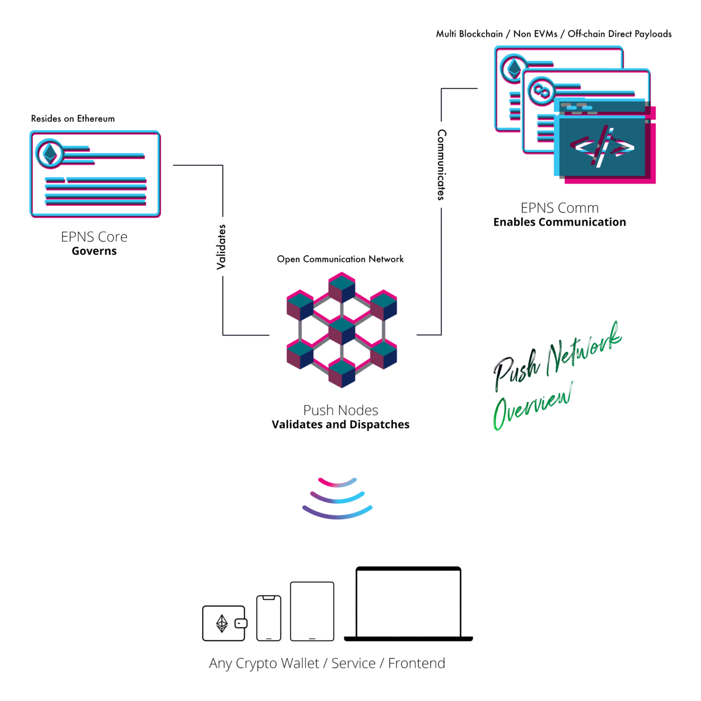
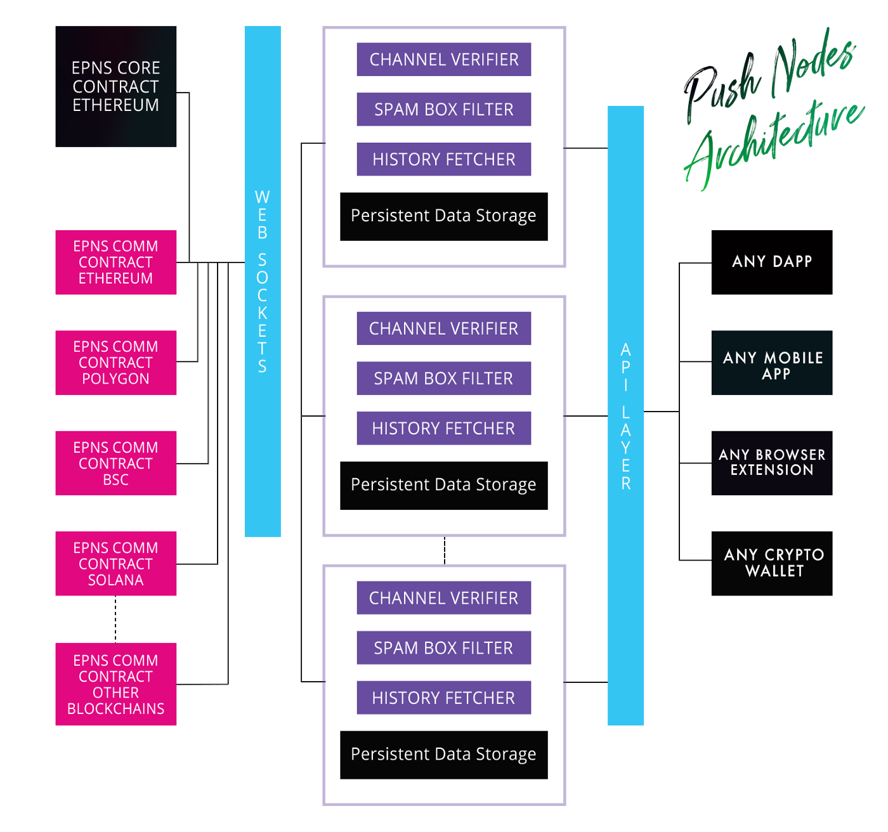
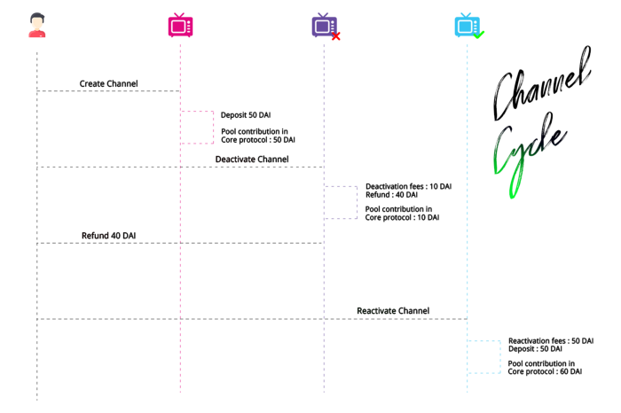
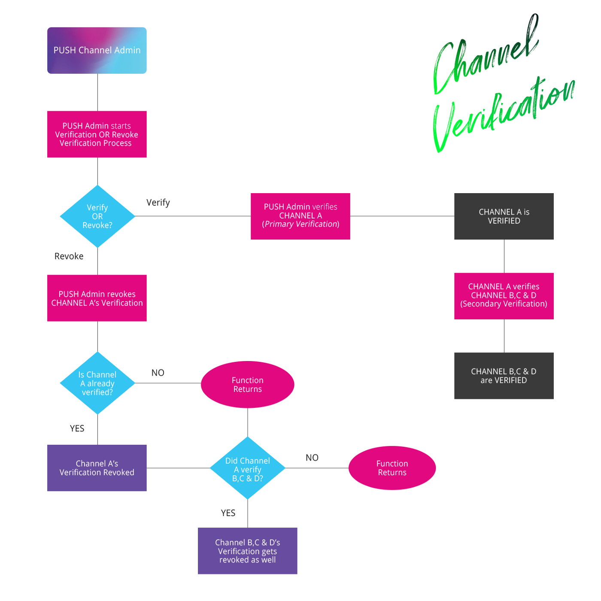

# [Push Nodes P2P — Web3 的通信方式！](https://medium.com/ethereum-push-notification-service/push-nodes-p2p-web3s-way-to-communicate-6a473577d173)
	Q3 路线图跟进，沟通与通知的 L1 来了！
## EPNS 协议概述/回顾
我们最近发布了一篇文章，[概述了整个 EPNS 协议](https://medium.com/ethereum-push-notification-service/roadmap-q3-audited-epns-push-protocol-v1-is-here-f4560dfe550c)。

总而言之，EPNS 协议是一组(两组)智能合约实现的 

- 1、EPNS Core Protocol
- 2、通过 EPNS Communicator Protocol 智能合约和 SDK 进行通信

理解 EPNS 协议的两个组件合约至关重要，因为推送节点与它们交互以实现去中心化通信——也就是 Web3 的缺失部分。我们将在下面简要介绍它们，但建议阅读[全文](https://medium.com/ethereum-push-notification-service/roadmap-q3-audited-epns-push-protocol-v1-is-here-f4560dfe550c)。

### EPNS Core Protocol（治理智能合约）
核心协议（EPNSCore.sol），顾名思义，是主要的智能合约，因为它处理一些最关键的功能，如通道创建、治理、通道状态更改以及资金和激励机制等等。但需要注意的是，EPNS Core 智能合约只会部署在以太坊区块链上，不会部署在任何其他链上。

在任何人可以发送通知之前，他们必须首先在 EPNS Core 上作为 Channels 激活。需要注意的是，EPNS 核心仅驻留在以太坊区块链上。EPNS Core 处理大部分治理和渠道相关任务，包括：

- Channels 创建
- Channels 修改
- Channels 封锁/删除
- Channels 验证
- 代币持有者之间的费用管理等

### EPNS Communicator Protocol 
与 EPNS Core 智能合约不同，Communicator Protocol (EPNSComm.sol) 旨在部署在多个链上。EPNS Communicator 协议比较简单。EPNS Communicator，顾名思义，是实际通信发生的层。Communicator 协议相对简单得多，处理的任务包括：

- 选择接收通知
- 发送通知
- 将 Notifs 的职责委托给其他钱包
- 验证多链 Channels 创建等

注意

	EPNS Communicator 驻留在多个区块链上，EVM 和非 EVM 兼容。除了可作为智能合约使用外，EPNS Communicator SDK 还可以将通知 payload 直接发送到推送节点以及启用链下交易。
EPNS Communicator 确保链上和链下通知都可以发送到您的钱包地址，无论服务选择从什么发送它们。换句话说，无论它们来自智能合约、dapp 还是后端的逻辑，通知都会让你知道。

### 推送节点概述
多链因此，如果合约部署在多个链上并且治理发生在以太坊上，那么一切如何协同工作

推送节点是网络的核心部分，它使 Web3 通知的区块链能够工作。从本质上讲，它们是未来任何人都可以通过 staking 和 slashing 运行的验证者。推送节点具有三个关键任务：

- 监听

	推送节点监听每个区块链上的 EPNS Communicator 智能合约。除此之外，它们还支持通过来自后端或 dApp 的 API 调用进行链下或直接通信。这种链上和链下通信监听使 EPNS 能够支持几乎任何 Web3 服务……即：智能合约、dApp、后端或直接 payload ！
- 验证和治理

	由 EPNS 通信器层驱动的通信需要验证（检查通道是否存在、是否发送垃圾邮件、是否经过跨链验证等），这通过 EPNS 核心层发生，该层包含启用治理和验证通道的存在。
- 承认网络/调度

	最后，推送节点承认这些与网络中的钱包地址相关联的通知，然后可以被任何加密前端/钱包利用以显示它们。这些节点中还存在调度功能，以允许在 Web2 应用程序中显示 Web3 通知的桥接，以防钱包/前端/软件想要启用它而不是处理直接套接字连接。
	
推送节点以及上述功能已经在测试环境中运行。我们计划在主网之后分散推送节点。

让我们简要地看一下推送节点的一些关键功能，以及有效载荷和调度的多链构造是如何工作的

- 历史提取器（同步/索引）

	同步 EPNS Core 和 EPNS Communicator 以前的历史是该模块的关键功能之一。它确保数据的复制，这是推送节点的核心功能之一，除了确保快速验证，因为它索引 EPNS Core 数据（包括Channels）。
- Web 套接字（接收）

	推送节点的主要工作是在接收端启用 wss 套接字，即：EPNS Comm 智能合约（链上）和来自后端/dapp（链下）端的直接 payload ，作为监听和更新持久数据存储的状态。Web 套接字连接和启用路由的路由器确保了此功能。
 - 验证和准入（验证器）

	无论是直接接收的还是来自 EPNS Communicator 智能合约的 payload，都会触发多个验证阶段，概述如下

	- 验证 payload 真实性

		推送节点检查任何传入 payload 的 Channels 地址（或委托人地址），以确保 payload 是真实的，并将丢弃任何不适合场景的 payload 
	- 推断 payload 和接收者

		下一步是推断从身份获取实际 payload 的数据，其中包括查看 payload 的存储位置（在撰写本文时，支持 IPFS 和智能合约字节），扩展在收件人列表（整个 payload、子集或单个）等上获取收件人列表以及实际 payload。
	- 映射到收件人收件箱/垃圾邮件箱

		验证的下一步需要根据已通过历史提取器或 EPNS Comm 智能合约记录的用户选择，将各个收件人的这些 payload 映射到他们的收件箱或垃圾邮件箱或通过推送节点本身的直接选择加入。
- 通过 Web Sockets 调度（调度）

	另一方面，网络套接字连接确保任何加密前端/钱包都可以直接监听推送节点并使用它来显示针对用户钱包地址的通知/通信。
- 通过 Web3 到 Web2 桥的调度（调度）

	本地运行且不会跨推送节点同步的可选功能是将这些通知从 Web3 传输到 Web2 应用程序/扩展的能力。例如：将通知发送到 iOS / Android 上的移动应用程序。

	该桥的工作方式是具有将钱包地址映射到特定第三方应用程序的设备 ID 以及应用程序推送证书的集中凭证的本地功能。如果此模块处于活动状态，则该推送节点不仅同步和验证数据，还负责将通知推送到 web2 应用程序或扩展程序。
- 前进之路

	上面列出的所有这些功能和其他关键数据都存在并且正在运行，这就是你们如何获得我们都想要的 web3 通知😃（尽管在受控环境中运行）。

	简而言之，这里的计划是创建一个节点集群，这些节点将相互通信并保持数据同步，并围绕这一层创建去中心化。

	我们将围绕它创建奖励（通过质押）和惩罚（通过削减）博弈论，这将确保这些节点的积极参与和真正的去中心化，因为我们进一步同步并准备好我们的推送节点以开放给用户自由运行上。
- 关于以太坊推送通知服务

	EPNS 正在为 Web3 生态系统构建世界上第一个开放通信层，首先是为以太坊，然后是 L2s 和其他区块链。该协议使任何智能合约、dApp 或传统服务器能够以与平台无关的方式发送与用户钱包地址相关的通知（即：可以在任何加密钱包、移动应用程序、扩展程序或 dApp 上集成和显示通知） 
	
## 用户激励转型
使用协议 V1，我们转向区块链不可知行为，该架构还意味着用户偏好和通知验证落在网络（推送节点）上，而不是以太坊智能合约。

有了这个新的视野，我们了解到我们的

- 抵押（通过服务）
- 借贷（通过协议）
- 利息（给用户）将是复杂的（如果不是不可能的话）设计多链。

考虑到这一点，我们将收入转向 Push Token 持有者，该令牌在我们于 [2021 年 4 月推出](https://etherscan.io/token/0xf418588522d5dd018b425e472991e52ebbeeeeee#readContract)时已经内置了时间权重，我们将利用它来计算利息并分配给 Push 持有者。

注意：根据 [Chainsafe](https://twitter.com/ChainSafeth/status/1452640644397248520) 所做的审计，此功能仍需要一些工作，一旦我们消除了叮当声，我们将很快通过更新引入此功能。

话虽如此，我们仍然保留 EPNS 通信合约的权重计算公式，并将探索不同链上用户的激励措施，因为我们在它们上启动。

## EPNS 核心协议
- 由一个 .EPNS 核心协议上的 Channel 创建

	Channels 的创建以及存储有关 Channels 的所有必要细节仅由以太坊区块链上的 EPNS Core 协议处理。

	协议中 Channels 的 4 种不同状态非常重要,协议中的每个 Channels 在给定时间可能具有以下任何一种状态：

	- 非活动状态

		非活动状态仅表示在 EPNS 核心协议上尚未将特定地址激活为 Channels。
	- 激活状态

		一旦为特定的以太坊地址创建了 Channels ，它就会被标记为已激活。激活的 Channels 能够发送通知以及使用协议中可用的所有其他 Channels 相关功能。
	- 停用状态

		每个活动 Channels 都有权在协议中停用自己并停止向用户提供服务。特定 Channels 的停用只能由 Channels 所有者完成。Channels 停用不是永久性操作，因为 Channels 所有者可以随时选择重新激活他们的 Channels 并且可以从停用状态返回到活动状态，稍后会详细介绍。
	- 阻塞状态

		每个激活或停用的 Channels 都可以发送到阻塞状态。阻塞特定通道是一种永久性操作，因为一旦阻塞，Channels 就不能再次在 EPNS 核心协议上重新激活自己。

	虽然根据当前的协议设计，只有推送 Channels 管理员可以阻止 Channels，但这种权力最终将转移到链上治理。

###  EPNS Core 上的 Channels 创建过程
请记住 EPNS 核心每个 Channels 都必须在以太坊本身上创建。协议中的整个 Channels 创建过程可以通过将其分解为 4 个主要步骤来很好地理解：

- 检查点

	在启动通道创建过程之前， Channels 地址必须经过一些关键的检查点，以确保其有效。例如，需要检查的一些重要因素是

	- a 在 Channels 创建过程开始之前，Channels 不得处于活动状态。
	- b 永远不应允许已经处于阻塞状态的 Channels 再次创建 Channels。
	- C 为创建 Channels 而存入的 DAI 数量必须高于最低阈值等
- Channels 创建费押金

	在 EPNS Core 上创建 Channels 需要至少 50 DAI 的 Channels 创建费。为了创建 Channels，Channels 所有者必须存入至少 50 DAI 或更多。

	Channels 所有者在创建 Channels 时转移的 DAI 数量直接存入 Aave 的借贷池以在 aDAI 中产生利息。
- 存储命令式 Channels 数据

	一旦正确处理了存入的金额，Channels 的池贡献、状态、权重、Channels 创建块数以及协议中的 Channels 总数等重要细节都会更新并存储在链。
- 订阅重要 Channels

	根据协议的当前架构，正在创建的新 Channels 必须在创建时订阅 3 个重要 Channels：

	- a . EPNS 警报 Channels
	- b. 推送 Channels 管理员
	- c. Channels 所有者也必须订阅自己的 Channels。

	一旦上述所有步骤都成功完成，Channels 的状态就会被激活并准备好开始发送通知🔔。

### Channels 状态周期
如前所述，一个 Channels 在协议中可以有 4 种状态，即

- 非活动
- 激活
- 停用
- 阻塞

现在我们已经对 Channels 的激活状态有了更好的了解，接下来了解 Channels 的去激活、重新激活和阻塞。

- Channels 停用

	当前处于活动状态的 Channels 可以使用协议的 `deactivateChannel()` 函数选择停用自己 。请务必注意，Channels 只能由 Channels 所有者停用。

	当 Channels 被停用时，会扣除少量 10 DAI 作为 Channels 停用费用。但最初在创建 Channels 时存入的剩余 DAI 金额将以 PUSH 代币的形式退还给 Channels 所有者。

	如前所述，停用 Channels 不是永久性操作，因为 Channels 所有者可以随时选择重新激活其 Channels 。此外有趣的是，一旦 Channels 重新激活，Channels 停用费用将添加回 Channels 的池贡献帐户。
- Channels 重新激活

	任何停用的 Channels 都可以随时通过调用 EPNS 核心协议的 `reactivateChannel()` 函数来重新激活。Channels 的重新激活只能由 Channels 所有者完成。`reactivateChannel()` 函数基本上将 Channels 的状态从停用状态更改为激活状态。

		请务必注意，在重新激活其 Channels 时，Channels 所有者必须存入至少 50 DAI 或更多的总和才能完成重新激活过程。

	好了，现在是时候了解 Channels 激活、停用和重新激活费用的整个工作机制了。
	
	
	
	1. 创建一个新 Channels
		- 最低 Channels 创建费用 = 50 DAI
		- 存入 50 DAI 以创建一个新 Channels
		- Channel 在 Core 协议中的 Pool 贡献为 50 DAI
	2. 停用频道(退还同等 PUSH)
		- 频道停用费 = 10 DAI
		- 扣除 10 DAI，退还 40 DAI
		- 频道在 Core 协议中的矿池贡献现在为 10 DAI
	3. 重新激活的 Channels
		- 最低重新激活费用 = 50 DAI
		- 您存入 50 DAI，用于 Channels 重新激活
		- 您的 Channels 在核心协议中的池贡献现在是 60 DAI（重新激活费（50）+ 之前的停用费（10））
- 阻塞通道

	顾名思义，阻塞 Channels 将 Channels 状态从 Active 变为 Blocked 状态。

	由于阻塞一个 Channels 是一个永久的动作，一旦阻塞一个 Channels 就不能再回到激活状态。每当触发协议中的 `blockChannel()` 函数时，就可以阻塞 Channels。此功能目前只能由推送 Channels 管理员激活，其他 Channels 所有者无法触发此功能。

	一旦 Channels 被阻塞，它就不再是协议的一部分，因此协议中的 Channels 总数也会减少。

	最重要的是与协议中的 Channels 停用过程不同，阻止 Channels 不会将任何金额退还给该 Channels 的所有者。

### 频道验证功能
EPNS 核心合约还包括一个新的 Channels 验证功能，允许 Channels 拥有验证标签。

Channel 的验证标签有其自身的意义:

- 一方面，经过验证的 Channels 提高了用户对 Channels 及其通知的可靠性
- 同时它也在用户界面上获得了相对更好的位置。

#### 了解 Channels 验证程序
EPNS 核心协议中的 Channels 可以具有主验证标签或辅助验证标签。

- 主验证标签

	由推送 Channels 管理员直接验证的 Channels ，具有主验证标签的 Channels。所有已验证的主要 Channels 都有权验证其他未验证的 Channels。
- 次要验证标签

	已由其他主要已验证 Channels 验证而非直接由推送 Channels 管理员验证的 Channels 具有次要验证标签。

#### 撤销验证标签
该协议还允许在特定情况下撤销任何特定 Channels 的验证标签。任何 Channels 都可以未经 Channels 的实际验证者或推送 Channels 管理员的验证。

- 取消验证主验证频道

	主验证 Channels 的验证标签只能由推送 Channels 管理员撤销。但是，这里需要注意的一个重要部分是，一旦具有主要验证标签的特定目标 Channels 未被验证，则由该目标 Channels 验证的所有那些 Channels 的辅助验证标签也将被撤销。

	例如：

	1. Push Channel Admin 验证 Channel A - (主验证)
	2. Channels A 验证 Channels B、C 和 D (次要验证)
	3. 推送 Channels 管理员撤销 Channels A 的验证
	4. Channels B、C 和 D 也未经验证

	快速浏览下面的信息图将有助于有效地理解核心智能合约中的验证程序。
	
	
- 取消辅助验证的 Channels

	具有辅助验证标签的 Channels 可以由 
	
	- Channels 的实际验证者
	- 推送 Channels 管理员本身

	取消验证。由于具有二级验证标签的 Channels 无法验证其他 Channels，因此他们撤销验证标签不会影响任何其他 Channels 的验证标签。

## EPNS 通讯器协议
### 一个发送通知
`sendNotification ()` 是 EPNS Communicator 协议中最重要的功能之一。虽然较旧的 EPNS 协议具有更简单的 `sendNotification` 功能，但 EPNS Communicator 扩展了此功能的边界。

与之前版本的协议不同，现在发送通知不仅针对 Channels 所有者本身，还有更多内容。

根据 Communicator 协议的当前架构，可以有 4 个主要参与者可以发送通知：

1.  Channels 所有者

	不用说，特定 Channels 的所有者绝对可以向他们的订阅者发送通知。
2. EPNS 警报器

	这些是来自推送 Channels 管理员的通知，主要针对每个用户。
3. 代表通知发送者

	这是一项新功能，允许任何地址代表 Channels 向其订阅者发送通知。但是，通知必须得到 Channels 的允许才能这样做。稍后再谈。
4. 向自己发送通知

	是的，EPNS Communicator 允许任何地址向自己发送通知。但要注意，该地址仅将通知发送给他们自己。换句话说，只要通知的接收者是呼叫者本人，任何地址都可以触发通知。

#### 了解委托通知
简而言之，委托通知是一种功能，允许 Channels 所有者将他们发送通知的权力委托给他们选择的任何钱包地址或多个地址。

这种发送委托通知的机制在为 Channels 提供增值服务方面非常有效。它还确保了可被 EPNS 或任何其他第三方基础设施用来代表 Channels 发送链上通知的机制的可用性。

为了使 Channels 所有者能够验证特定地址以代表 Channels 发送通知，Communicator 协议本身中有两个称为 

- `addDelegate()` 
- `removeDelagate()`

的特定函数。

Channels 所有者可以触发上述功能，以允许或删除一个地址作为有效的通知发送者。但一旦允许，特定地址可以代表 Channels 向订阅者发送通知。

### 元交易
不可否认的是，为以太坊区块链上的每笔交易支付汽油费仍然是最艰巨的任务之一。如果您的钱包中并不总是准备好一些 ETH，那么您可能会比较难以与以太坊区块链上的协议进行交互，因为您需要支付 gas 费用。

与 EPNS Communicator 协议的交互也需要 gas，但不用担心我们已经为您提供了保障。

EPNS Communicator 协议支持元交易，换句话说，支持无气体交易。简而言之该协议允许您与其功能进行交互，而无需实际支付任何 Gas 费用。

- 真正需要做的只是用你的密钥签署你想放在区块链上的交易。
	- 此操作实际上并不需要任何 gas 费用，因为您实际上并没有与链上协议进行交互，而只是签署了交易。
- 然后，运营商将通过支付一些 gas 费用将签署的交易提交到区块链上。
- 在区块链上提交交易后，通信协议会验证您的签名以确保它是有效的签名交易并代表您执行所需的功能。

该协议目前允许以下功能的元交易：

- 订阅（）
- 取消订阅（）
- 发送通知（）

### 订阅频道
协议中的 `subscribe()` 函数允许用户订阅任何处于激活状态的 Channels。

虽然订阅函数可以由任何地址调用，但调用者必须传递一个他们想要订阅的有效 Channels 地址作为此函数的输入。

一旦调用了 `subscribe()` 函数，它就会执行以下操作：

- 检查点
	- 一旦函数被调用，推送节点验证作为输入传递的 Channels 地址是否是处于活动状态的有效 Channels。
	- 如果 Channels 是有效的，则通信者合约确保函数的调用者（订阅者）必须尚未订阅 Channels。
		- 如果用户已经是频道的订阅者，则交易将被还原。
- 用户激活

	`subscribe ()` 函数还包括一个命令式过程，其中第一次尝试订阅任何特定 Channels 的全新用户首先被激活并添加到协议中。在此步骤中，该特定 Communicator 合同中的总用户数也会增加。
- 订阅频道

	一旦成功通过检查点，用户将被添加为给定 Channels 地址的有效订阅者
- 用户信息存储

	作为此功能的最后一步，所有与用户相关的重要信息都存储在协议中。在这一步，用户的 `subscribed_Count`，即单个用户订阅的 Channels 总数也增加了。
	
###  取消订阅频道
正如名字已经暗示的那样，协议中的 `unsubscribe()` 函数非常简单。

它允许用户取消订阅特定 Channels ，前提是该函数的调用者之前已经订阅了该 Channels。`unsubscribe()` 函数通过将用户删除为给定 Channels 的订阅者并减少用户的总 `subscribed_Count` 来更新协议中的用户状态。

### 关于以太坊推送通知服务
EPNS 正在为 Web3 生态系统构建世界上第一个开放通信层，首先是为以太坊，然后是 L2s 和其他区块链。该协议使任何智能合约、dApp 或传统服务器能够以与平台无关的方式发送与用户钱包地址相关的通知（即：可以在任何加密钱包、移动应用程序、扩展程序或 dApp 上集成和显示通知） .

## 参考
[经过审核的 EPNS 推送协议 V1 就在这里！](https://medium.com/ethereum-push-notification-service/roadmap-q3-audited-epns-push-protocol-v1-is-here-f4560dfe550c)

	