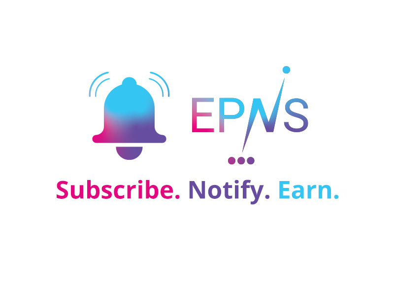
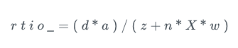
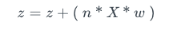
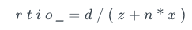
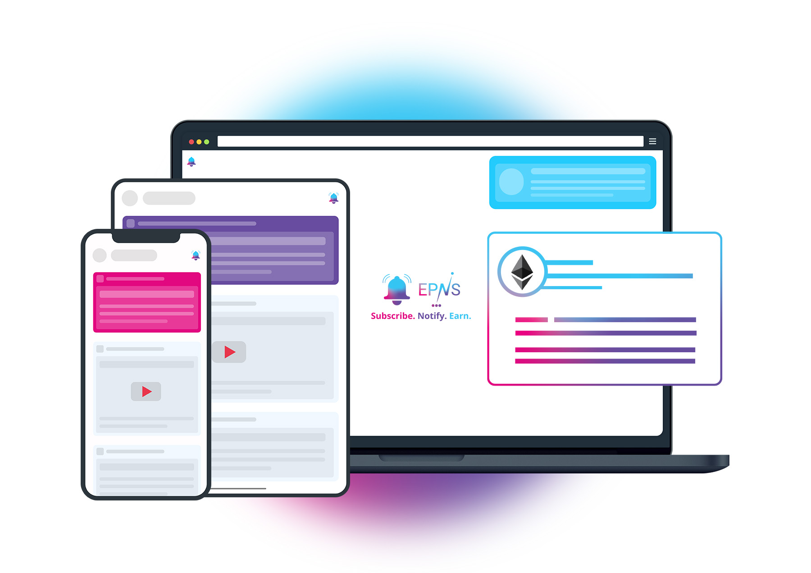
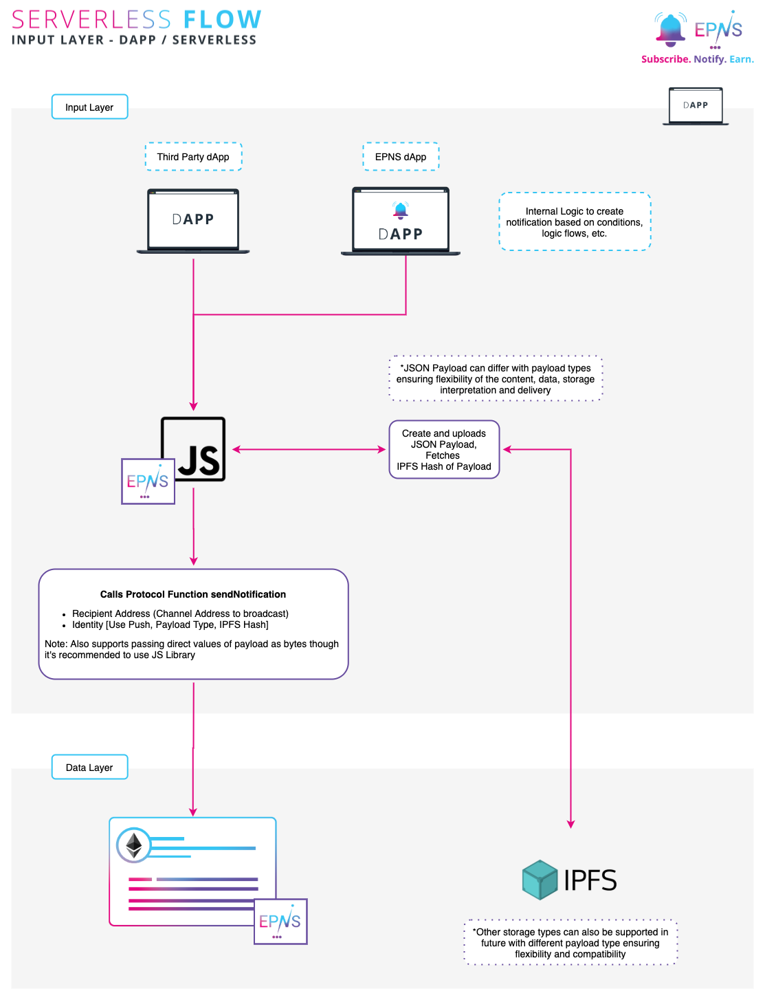
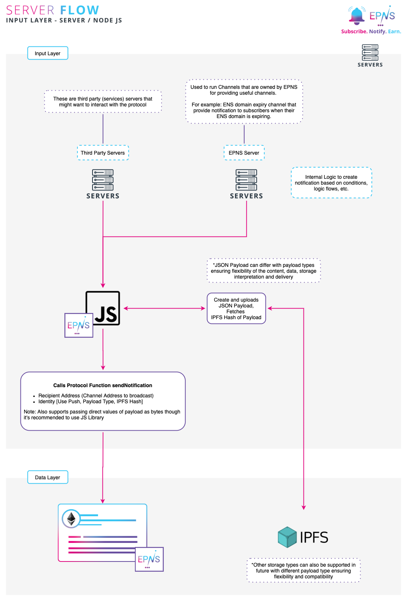
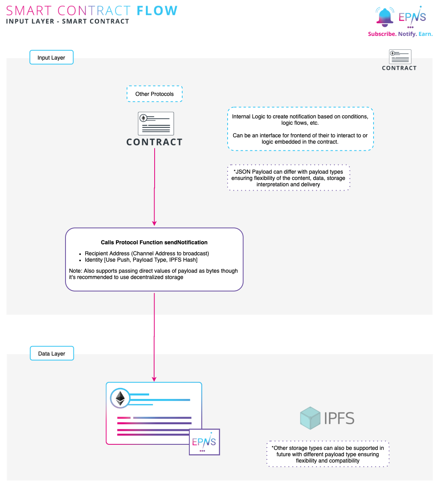

# [以太坊推送通知服务 (EPNS)-白皮书](https://whitepaper.epns.io/references-section/references)
	白皮书有些信息过时了，因为之前是按照以太坊单独链来说的，现在转向多链兼容。

一种去中心化的通知协议，使用户（钱包地址）能够通过积极参与接收通知并获得代币激励。
## 抽象的
该文引入了一种去中心化通知协议，使钱包地址能够以与平台无关的方式从去中心化和集中式运营商处接收通知。 它还探索和描述了协议/平台的理论和技术方面，以及协议用来确保激励生态系统中的优秀参与者的博弈论。
## 介绍
区块链空间正在以极快的速度增长，预计在用户、服务和收入方面将继续呈指数增长. 尽管区块链技术的这种增长和扩大使用，服务（dApp、服务、智能合约）仍然缺乏与用户的真正和有机的沟通媒介，有时会被Twitter、Telegram 或电子邮件等替代沟通媒介所代替从而破坏了web 3.0 的目的。

但更常见的是 dApp、智能合约或服务假设用户会来找他们。这种方法与 2003 年初的互联网时代非常相似，在该时代，用户被期望执行一项操作，稍后再回来检查这些操作的结果（Gmail、Orkut 等）。

虽然这对于早期的互联网时代和 web 2.0 来说是可以的，但现在传统服务并非如此。事实上，没有 web 2.0 服务真的希望用户现在就来找他们，相反，他们会联系用户，告知他们某些重要事件或用户需要采取的任何进一步行动。

现代推送通知在这一转变中发挥了至关重要的作用，现在已成为所有 Web 2.0 的支柱服务

但是，对于 web 3.0 来说仍然不存在可以通知用户（钱包地址）重要更新、事件、动作等的通知机制。这种有缺陷的机制已经导致了痛点和副作用： 

- 完全错过重要事件或用户操作要求（在 dEx 上完成交易，在 DeFi 协议上发出清算警报等）。
- 区块链域名到期必须在推特上发布，希望宽限域的用户可以阅读它。
- 协议遭到破坏意味着通过 Twitter 和 Telegram 发送信息，希望该协议的用户意识到这些漏洞。

这是采用中的一个主要问题，随着服务在区块链上的不断增长，问题将更加严重。

本文描述了这些问题的解决方案，旨在通过引入分散式通知协议来提供 Web 3.0 基础设施的缺失部分。该协议将使用户能够接收通知，完全控制他们收到的通知，并使用户能够从这些通知中接收和积累代币激励。

### 协议/产品流程
EPNS 使用以下流程来确保以平台无关和分散的方式存储、广播和发送通知。

通知像 JSON Payload 一样被存储和处理，当通知到达它们时，它会根据不同运营商的规则进行转换。JSON Payload 可以根据 Payload 类型而有所不同，这确保了内容、数据、存储解释和交付的灵活性。这有助于创建通知的不同规则和内容解释（例如：携带图像、号召性用语、实时视频等）。

该协议允许用户直接控制他们从哪些服务获得通知；它对服务施加了规则，包括对用户的垃圾邮件保护，限制他们将钱包添加为订阅者的能力等。该协议激励接收通知的用户。

这种数据的链上抽象可以将信息传递给集中式和分散式运营商，通知被视为更像是社交信息流（例如 Twitter），而不是短暂的信息（尽管也存在这样做的方法）。

它还支持从单一事实来源检索规则、激励、设置和配置，并且不依赖于单点故障。

将 JSON Payload 存储在去中心化存储上并将其指针/哈希存储在链上日志上，可以优化成本。尽管该协议还允许将整个 Payload 存储在链上，以供打算这样做的服务使用。

这可以通过将这些机制的一部分移动到第 2 层 (L2) 来进一步优化。

	抽象链上的数据层（直接或间接）确保通知与平台无关，并且在分散的媒体上也可用（例如，dApp、可能不想信任中心事实的钱包）。
### 基本定义
白皮书的其余部分使用以下定义来指代某些角色。
#### EPNS 相关
角色|描述
---|---
Service|任何希望发送通知的 dApp/智能合约/集中式服务等。
Channel|任何已在协议上激活自身并因此可以向其订阅者发送通知的服务。
Subscriber|订阅特定频道的用户。
Users|存在于协议注册表中的任何用户。
Stake Pool|当服务将自己激活为 Channel 时收取的质押费用池。
Token Incentives Pool|权益池产生的代币激励意味着以有利于早期订阅者的加权比率在频道订阅者之间分配。
Fee Pool|协议在某些动作期间赚取的费用，即发送通知时的小额费用、部分罚款等。
Incentive Reserve|尚未移动到用户钱包并仍然存在并映射到协议中的用户的用户令牌激励。
Ecosystem Development Pool (EDP) |用于激励集成 EPNS 协议的用户钱包/基础设施服务的费用池的一部分
Integration Upfront Reward Pool (IURP)|费用池的一部分被分配为集成 EPNS 协议的即时赏金
#### 其他概念
角色|描述
---|---
IPFS|星际文件系统 ( IPFS ) 是一种协议和点对点网络，用于在分布式文件系统中存储和共享数据。​​​
JSON Payload|JavaScript 对象表示法在整个生态系统中用于存储用于前端消费的数据。

	除非明确提及，否则在本白皮书的上下文中，合同所有者、服务、渠道或用户等术语始终指匿名的钱包地址。
	
## 规格
EPNS 本质上是一个通知协议。我们将通知视为传达不同类型、携带不同实用程序并根据其用例执行不同任务的信息的手段。为了实现这一点，我们为每个通知 Payload 分配了一个 Payload 类型，该类型定义了它们携带的数据和存储介质的某些特征。

除了通知 Payload 的灵活性之外，我们还看到在频道及其订阅者之间建立的规则也会对其效用和用例产生影响。

记住上述类比，推出以下规范以确保规范和 Payload 确定通知的用例，而不是将它们视为普通的标准。

我们看到通过这种方法打开的一些用例是：

- 允许用户接收具有不同内容类型的通知（图像、号召性用语、视频等）。
- 允许未来的内容或 Payload 不同并被不同地解释。
- 使 Payload 存储的解释变得灵活，因为更改 Payload 类型可以指示存储介质（链上、IPFS、其他存储解决方案）。
- 允许服务创建任何用户都可以订阅的频道。
- 允许 channel 将用户批准为订阅者并围绕他们创建业务案例。
- 允许 channel 和用户在他们之间共享信息之前相互批准。

### 通道 Payload 规格
创建通道需要将包含通道信息的 JSON Payload 发送到去中心化存储。这个 JSON Payload 被上传到去中心化存储解决方案（撰写本文时为 IPFS），该解决方案在链上发出，以确保可以从所述去中心化存储构造通道元数据。

	我们的 dApp 或任何前端解决方案都可以轻松上传 Payload 。虽然直接存在智能合约上执行此操作的规定（使用预填充的 IPFS 哈希），但建议在前端执行此操作，因为它是一次性过程。
- 通道 JSON 负载

	参数|描述
	---|---
	name|您的频道名称（建议限制：40 个字符）
	info|您的频道的简短描述（建议限制：240 个字符）
	url|您频道的网站（建议限制：160 个字符）
	icon|Base64 编码图像（推荐限制 128x128）
	
	如
	
			{
		  "name": "ENS (Ethereum Name Service)",
		  "info": "ENS offers a secure & decentralised way to address resources both on and off the blockchain using simple, human-readable names.",
		  "url": "https://ens.domains/",
		  "icon": "data:image/png;base64,iVBORw0KGgoAAAANSUhEUgAAAIAAAACACAIAAABMXPacAAAACXBIWXMAAAsTAAALEwEAmpwYAAAGvmlUWHRYTUw6Y29tLmFkb2JlLnhtcAAAAAAAPD94cGFja2V0IGJlZ2luPSLvu78iIGlkPSJXNU0wTXBDZWhpSHpyZVN6TlRjemtjOWQiPz4gPHg6eG1wbWV0YSB4bWxuczp4PSJhZG9iZTpuczptZXRhLyIgeDp4bXB0az0iQWRvYmUgWE1QIENvcmUgNS42LWMxNDAgNzkuMTYwNDUxLCAyMDE3LzA1LzA2LTAxOjA4OjIxICAgICAgICAiPiA8cmRmOlJERiB4bWxuczpyZGY9Imh0dHA6Ly93d3cudzMub3JnLzE5OTkvMDIvMjItcmRmLXN5bnRheC1ucyMiPiA8cmRmOkRlc2NyaXB0aW9uIHJkZjphYm91dD0iIiB4bWxuczp4bXA9Imh0dHA6Ly9ucy5hZG9iZS5jb20veGFwLzEuMC8iIHhtbG5zOmRjPSJodHRwOi8vcHVybC5vcmcvZGMvZWxlbWVudHMvMS4xLyIgeG1sbnM6cGhvdG9zaG9wPSJodHRwOi8vbnMuYWRvYmUuY29tL3Bob3Rvc2hvcC8xLjAvIiB4bWxuczp4bXBNTT0iaHR0cDovL25zLmFkb2JlLmNvbS94YXAvMS4wL21tLyIgeG1sbnM6c3RFdnQ9Imh0dHA6Ly9ucy5hZG9iZS5jb20veGFwLzEuMC9zVHlwZS9SZXNvdXJjZUV2ZW50IyIgeG1wOkNyZWF0b3JUb29sPSJBZG9iZSBQaG90b3Nob3AgQ0MgKE1hY2ludG9zaCkiIHhtcDpDcmVhdGVEYXRlPSIyMDIwLTA1LTEzVDE2OjM5OjMyKzA1OjMwIiB4bXA6TW9kaWZ5RGF0ZT0iMjAyMC0wNS0xNlQxMToxNzoyNyswNTozMCIgeG1wOk1ldGFkYXRhRGF0ZT0iMjAyMC0wNS0xNlQxMToxNzoyNyswNTozMCIgZGM6Zm9ybWF0PSJpbWFnZS9wbmciIHBob3Rvc2hvcDpDb2xvck1vZGU9IjMiIHBob3Rvc2hvcDpJQ0NQcm9maWxlPSJzUkdCIElFQzYxOTY2LTIuMSIgeG1wTU06SW5zdGFuY2VJRD0ieG1wLmlpZDo2NDU3OTU0OC1hMjdjLTQ0N2ItYjFhMi1iZjYyYjg2ZDYwMjYiIHhtcE1NOkRvY3VtZW50SUQ9ImFkb2JlOmRvY2lkOnBob3Rvc2hvcDoxMjk2ZDhkZi02OWNjLWJmNGQtOGEzNy1hNjU0MDk0N2RmOWEiIHhtcE1NOk9yaWdpbmFsRG9jdW1lbnRJRD0ieG1wLmRpZDo5NGIxNmJhYy04NzAxLTQ3ZjAtOGExZi1kYjlkN2JkMzAwMmYiPiA8eG1wTU06SGlzdG9yeT4gPHJkZjpTZXE+IDxyZGY6bGkgc3RFdnQ6YWN0aW9uPSJjcmVhdGVkIiBzdEV2dDppbnN0YW5jZUlEPSJ4bXAuaWlkOjk0YjE2YmFjLTg3MDEtNDdmMC04YTFmLWRiOWQ3YmQzMDAyZiIgc3RFdnQ6d2hlbj0iMjAyMC0wNS0xM1QxNjozOTozMiswNTozMCIgc3RFdnQ6c29mdHdhcmVBZ2VudD0iQWRvYmUgUGhvdG9zaG9wIENDIChNYWNpbnRvc2gpIi8+IDxyZGY6bGkgc3RFdnQ6YWN0aW9uPSJzYXZlZCIgc3RFdnQ6aW5zdGFuY2VJRD0ieG1wLmlpZDpkOGJhZGNmNi02YzRiLTQ2YzgtYjhjYi05YjUwMDMwYzNmYzMiIHN0RXZ0OndoZW49IjIwMjAtMDUtMTZUMTE6MTc6MTIrMDU6MzAiIHN0RXZ0OnNvZnR3YXJlQWdlbnQ9IkFkb2JlIFBob3Rvc2hvcCBDQyAoTWFjaW50b3NoKSIgc3RFdnQ6Y2hhbmdlZD0iLyIvPiA8cmRmOmxpIHN0RXZ0OmFjdGlvbj0ic2F2ZWQiIHN0RXZ0Omluc3RhbmNlSUQ9InhtcC5paWQ6NjQ1Nzk1NDgtYTI3Yy00NDdiLWIxYTItYmY2MmI4NmQ2MDI2IiBzdEV2dDp3aGVuPSIyMDIwLTA1LTE2VDExOjE3OjI3KzA1OjMwIiBzdEV2dDpzb2Z0d2FyZUFnZW50PSJBZG9iZSBQaG90b3Nob3AgQ0MgKE1hY2ludG9zaCkiIHN0RXZ0OmNoYW5nZWQ9Ii8iLz4gPC9yZGY6U2VxPiA8L3htcE1NOkhpc3Rvcnk+IDwvcmRmOkRlc2NyaXB0aW9uPiA8L3JkZjpSREY+IDwveDp4bXBtZXRhPiA8P3hwYWNrZXQgZW5kPSJyIj8+da2UygAAGzVJREFUeNrtfXmQnOV55+95v6OvuaWR0DlCBxJCIITuQfjAMcQuEnyA184mWxsn5RBvjCtZV2W3amtrU5WqvbLJro+sYxbXxsGxd7kCBhYwPgAJgSxARhKg+xhpdM09fX/f+/z2j+/rY4SMkZgZ9Yh5a6qrp7tnuvv5Pff1CUlMn8t3zDQJpgGYBmD6TAMwDcD0mQZgGoCpdVTjO1PakZ6qAOzfx2yWVQCOHuHg4DQAk3LKZTz7NAcH0dQk8XcwaG6R7dt49PA0ABN8Tp/C//2hnj6NdevF1H32GTOw6no89ph9+eUppo/cKfRZX93JX+zQckn+2RfEcc5/dmGXbO6WnzzHvrPo3oKODpkGYNzO4AC3bUPPMQ1C3LRWZl914Zdt2Gh6T+qB/ezvx9p1sur6KfDVpPGTcXv38NVfsFCk4zCVMp+9yyRT7wIVHnlYw4AEliw1m7ulqWnaBlzqyWXx42f54gsahEynWQ5k7Tp5F+oDaO/A+g1iFakUDx7g4/+kBw9MS8AlnUMHueNlDg6xqRlGkMth3jxzx2+/J83+xOPsPamZDAtFsVZWrpQNmySRmAbgPTuaO17hm3toDCN+D0OGgbnz06Zz1nv6D0NDeOQhFdBPwFpms2bWLNncLfPmTwPw605vL7Zv09Nn2NxEx5Ho042OYPWNpnvLRTg2e3bjhee1uVlFBEAhD0BWr5Hz/NdpAOoOuXMnXn+NAFMpAjG5i0Wk0/LZu83F6pCnfsSeHs1UjLANmcvJvPmmews6O2UagDFnoJ/btrKnh+k0XVfqQGF21Nz6cbN8+UX/z+FhPPKQkvT92n/L58XzZe1aWX2jTANQURdvYOdOLZWYTkPGkIX5nMxfYD55xyUSa+8evPC8zWRojNTZGJZKcvVi032ztLR8sAOx7CheeomHD6nvI5M5/9kwhBjZuOnSWfW6VTh2zPQc1/p/7vviujx6RPvOyboNsmKFfEAl4MAB/uIVDg8x00wj76QCR0bMmrWyefP7ItDwMB55WKn0/ZpdAQBBMQ9rsXyF2bhZUqkPEgClEna8zDf3quMgmRpLl8opFphpMp/9nPG99x9L44Wf26ZmnI+ygBajWcyYKZs2m66uDwYAJ09i+zaePatNdY7m+cyvHM2Zj98my5aNj3546gn2HK95ROe9W74goNywWtatF9e9cgEgsXMHd71OCtO/gvGrSYhFV5vbPzFu2nl4CI88pAA9/8IvsJbZrMyda7q3yOzZVyIAfX3YtlVP9DCToePKu5A2DGFD+fRdpqNjPD/A7t188XltfqciqnN5C3lxHLlpnay5Sa4oAHbt4i92MixrJgMjQgJyYf4nMDqCdevNho3jT4IoR5TOvNtrggCFAhYtMt1bpK1t6gMwPILnX+DhwzaZZNIXIyJgTPwLUbhQQHOL3HW3mQhdPDiIRx9SMfTe1bArkc8jnZJ1683K6yYWgIlNi+x+U//xwXDfAZtK0/NAUJUECMbcft43V9oQGzZMlCVsb8fa9aaQx7uznRE0Z1Au84Xn9blnmctNQQkIAjzzM921R5OuNqVhRIyICAUwIgKIwIhgrCXOZrF4ibnt9onVv489yjNnNJ3+tbSBWoxm0d4hGzfJksUyZSRgNIfv/h99aWeYTlk/KZZiCSWVohAlCZDQseCHIXxfNmyYcLW75RYYkTD8tU4bRNDSgtEsn3mOL7zEIJgKAIzmcN8P7eGecnsbIVDSEkpUMAAhShAgJVJDJEjk81h9o7S1T7j7MWOmrLlJcrlf19FFQEBBMo1kUl/7pT7yFPsGGxuAcoD7HgyP9watzbCArdDdkkoqyfgWShBUQAkRFAuYOdOsXjNJzt+atTJnjikU3o34Y8jkSEsLz/Tpg0/q/iNsXACe+Hn45iHb1kJLsQqrUMJqjERVCCpIQAkSoaVVbNwkrjNJ4Y8x2HKLiIi1v4L1CQoodXiIZNIIQz7xM+4+0JAAnDyrz+0I25utBSw1onio9SpIahggoj4VmsvJkqVO16JJzQHMmo0bbpBcruKSjbG+dWBEMEisjlIpeD6f3mZ3H2o4APjzVzWbh3EQKqxKhIESSq2IgqoipETaiYAS5QBeQtZvwOSftetlZqcp5i8gAlX2p4CIfwAokEwg4fGprfr28UYCIFuU195mOmktxZI20jyqFeWjVmEBC1akAVapRDZr1qyZjJjzncd10d0thFHLev3DOvaPJUIqDwoUSCTEc/nkdp4dbBgAdu3T42dDx2VIWkUYk17qMVAVq1CqkqqwxGgOnbPkpjWXrSQyfwFWrJBsruKPAVJxfqpgxJAItPogmUoitPrYdhaDxgBg7xEGVlVglTUJIEOKVagikgwlrEr8lGWosmXLBRo9J/Ns2CStbVIsnO//VFV/7cGKHNCAgkwSvf189vUGAECVB06GCV+sIiRCRUhaMtQ4DrCk1RoqlrDg0CiWX2MWd13m4ngyiY0bJQxEFYIx7B/zu8Sap6KUSAghEGnN4PXD+mbP5QbgzCB6+0KIDWPuhlWESiVrFI8wAKKYoFBEMmU+fHNDtCYsXSZLrzG53PnsX7XDEanq2R9CCoyBZ/jc7ktXROMEwJDkA4fQUDVUhgpLhJSwKhAVFWSVVsUqh7Ny8wanvbVR+nM2bpZ0WsplXoD9q79W2D+yFNFPOil9o9y2j5MKQLmM7GjtLYdzmitREdE9Vj6WGsZxAC1ZtcZKDmVl3hzZvK6BWvibm7FuvSkWDVnH+FX/p479EbO/QOLHMwnuOMKB7CQCcOAAh4drvxbLLJTVssrvsS8UET3USPVLJBnlkIGaT97qOg3Wmn3dKizsknyhon/Guv+o0/6sExEAroNsCdsPTxYApRIO7mOmqca/VhkoQzK0FfaP1U7sFIVkJSTWviGsWSnLFjXiBEt3txiDMKywP2L2r1dHEETsz4pwQCTjY08vh4uTAsCRwzx7Fp5XU0GeKxAJlTUJUEaqP9TY/wlJqxwtSFOzc8dHG3QuYcYMrFljcnmQNYprJTqmCKWWumDVMRV4Doby+OXJSQHgwAFAxIY1Fs6kjOtJKWSgMaeHcRBQs8aqCJUDo7j9FrejtXEHQ9aukVmzTL44lv2lliGKshSUGgDRr77Lvb1UTjAA586h96QmfJbqxK2zBQlXQ1sVgkjnVO9ohEf/CJYsNL+xoaHH5xwHN28WQqzWRV5CROwvMRT17B/dJlycHMHh/gkG4NABWotikYNDNaznzWRbBkoDILQMasoHoY2kQUsBy+p84RN+fZ9sY56Fc3HtNTKarzF4JS1R8T7rHKRqutQYlELs7+MEAhAE6OlBMgmrGBysvVM6IVfPSRQCgUAhsQ2IRQEhoYreQbnlJmfloqkxPdq9TlpapVCqZCOicrYQY3NENREBCCQ9Hh3ERWmhiwPgRA8GB+i6TCTQd66elHLtfBZKEMAIAKnonzgeHsqzrcX9vdsdTJGTTmHzGlMKoRoVTFGLv6SWF6pZAgEErsG5PM7kJgyAkyeppDFiDPr7OThQl9Ja4bVkTGij2hEquoihIrB6blS+8HGvo2UqDeavWobFC0yuJEDkd5J1Oud8GwBEmYnREk4MTQwAYYjTp+gnYkuVz+HEidqz1y+S5fOckUI0koWo88QqLfT0kFy/1Lvz5qm3l+LDa8VxEWjM80TFF6rDoGYnBCIIladynBAABvqRzUYaBiJwXR4/VnsnEdy2zssWTLXXQAQiUgxYUvdP7kyIyJQDYGY71l9nRovCqIVD6khfVyyrD5uTPgaDiZGAc+dYLKKau/d9nD7FM6drL/jUZnfJXHc4zyqpjfDUgLmz271h8dSjfnQ2rZJZMyRXGpOZqLF/nVNEAQxE0J9FaCcAgJERgHXEdRCEfPutmhBkkvj8R/zBnANqJAHDecyb4d17p48pe1wHH10jFsZyjAFgneapyYHAAKMljAQTAECpCM8f08yUSuHQIa3flHT3Le6KBe7AqIiA5MCouecOv71JMJXP0rlYuQgjhdi5qEXFUgsCxmTuHBQnQgLy+bhgVB80lkrY9VrtkYSHP/hNf7RoSD0zJN3X+Xfd4mDqn4/cIJm0FC1Zn5CoiwDiKg0AA8sJAMBalMsXaOrPZHDwgJ7qrT3yWxvd7pX+iT4YY/7sM4l3GYOZQqctgy0rJVuSSkwwVvOghgoEAVEadwCCAOXgArMlxoDQ7du1XjX98R3+qSHvU93eqkVXAvXjQGcpFnZKtlRzhPgOZzT2RInyREhAGOoFniCSSfSe4p69tcfWXWP+/HPe737MxxV0jMFtq4XGRGRgnQ04Ly4LiUDHGwBGnbRjKF8ZtHAkmcKrr2v9IMOf351YfNWVtpS0ayZWd2G4OCY7XZ+WiO5HrQjjb4TlQtSnAQDP50iWr7yquNLPx66VliYphKz5P+cVBkAlAk4AABxLfVSoH5WKMmm+eYC9p69wAFpS+MhyyQYmLpmNjcsqLqnouAMgQjH1tbhqpTTyzGhckty6Q6/4C0JsWoTFnRgtV0gv9V4pCaHBBebf3icAjiNRF0NMX4FG1I9ZgApJpXj8lP7yrSsQged3h2eGajmuT6wUOhJyrAqSMcWZcQcAjlvBNe7TY03rIeoSkGQSL+/iaO6Kon7/iP7RN8qPbKulF67uwJr5MlSOvZAx7B9lKt9z1e8iAPDdOuoLibhFQOu4wE9gOKcvXlnW+Js/CrK58iNbg8FsTbhvX4aWlBRD4TtyEsaB54y3BBgD14tHKqK+MAopUZJWUMvNsinDvYd57NQVooheP6SPbgtWzNOT5+x9T9WEoC2Fjy5B1krVI6GIAgq4DpLueAMAwPOhBCPqg4j2nIiwjvqEGAcQ+9Od1CtADMi/frhkYD3PzGqzD28tHzpV+1ZbFsq8VmRDVtt4IaIQz0HGmwAAEqkIANSojzrqC2nipoFUkifO2VfenPJC8IOf2x1vlztbVVWSvuSK9v6na0LgGmzpkgKjyeeIFLSAUWlxJkICPJRtpTUViNvEagGIEIAhhTAmk+K2PbZ/ZApT/+ywfufZ8sxWFZjI3Z7dxmdeDfYcqwnB+qswt1WKWnHVKdagI412fwIAyGQIQbVFYExRIs6NRNGJAPBc5Mv86a4pLATf+H/B2Wy5tbnSC0T4LsqB/YfnytXX+A5u6ETOGgIKClBUzMngvZdfLwKAtnaTSsEqNPZ/xlLfRO0bsVioSHOae47ZPcemJAY7j/CJ14O5HVQj8CAOAFiVmU3ctjc8eqYmBDfMlJSPkHHvkAoWpC/ijS4GgFY4Hiyl3uuqRINjqB9HC0Y8V597w5aCKUZ9q/ybp4uea72EiENxIC7EBQS+h4ER/dkvawB0tWBhK0oQAgHR7GN528QA0NyE9naxKlorREStMoxdI6mbqjVQIJXguWH9ye4p5g/9YIfddSKc0Uo4hq6BQ0QYeIAj6RR27Avrkw2LW6VgASBPzG+SucmJAQBA50yUAqLqdFZNgtRGdiigqbrGaEpx+0H2DEwZ6p8a1vu3l2e1qnENHRgH4gocwKE4gINMSg+fCk/VfaOrW+D7CBVF4Pr2i3u7iwNgzmxxPLHKOmZnRO4xHQMxPATEdYW0T7wWTpXLtn5razhYCJpSgANxQBdwRJzoluLC8zlcNvt7a19nfhNaPMkTrQms6ZhIAObPkbY2CTROBCmoJtZIlYRElJmoKCUDBTIJHjqnWw9MAeq/clyf3h9c1QY6Eqkd4yCiu3EErsCBm5BsqXz8XM2ytXvoSHJIcW0rZiUmEgDfw4I5UiiLRiSu/HVEfY3tMONhkoqpEINMgj9+y/bnGloIQuXXXyom3ND3hS7gAg4YqyChW7HGDozHM6N1fynoyCA02HTxS9kvump4zdVwPbGKOBKuuUMEoCaqXUr9kD8FCQ/Zsn1iT0MD8P3ddk9f2NEEGohBpPHFAQzgwDgCR2AEjiRSTrY8hnRlKwtSckMbJhyA+bNl/lWSL0tlYAo1UxwXImJ3OGqViZ5SQWuSr/WEr/U0qEd0cpTfe6Pc2URxwcj1NBADGEhkDBxEEgADx5OSSr0jFAo2zcIljJ5cSt38+mUIFcp6e1ultdQ1CrDiKUU1CkkYffxNzZcbUQ6+tSsYLodNCaER4wgqFDcVOagJhBuJRe1bKNHp85ZZl/K+lwLAikVm7uyoX7VibKNk3JgBtuqvpImFIJPE2ax9/K2GE4KXevXHx8KrIuXjgEbEwBiySvS6O9Gt59e4vahY1445yckCwAg2rXLKKpZRBFDh9IpSimtDcc0AldINVKQ9ya3HdF9fAwlBYPnNN0opN/Q8oStwxBjQETpiDOCQhpEoVGWiTKYTtY2bKQdLWi6xBe0SW3euXSjXdJnRkomFwNRTuXK/Sv26KMFxYBg+uNeGDSMGDxy0bw/bjhRoINH2gSj+MoisrnFqD8IAjoRgZ5PWOUGXfi69d+rWG8VxWbKV5KiMWWx0XnZIEd+qoDnJo4P2yQMNgcDxrD5wsDw7reJI5O1UbS9cwFAM6Ig4EEMawEBF001+10xvXD7ApQMwu00+vNoZKRpb73GaSnGmLhSgIDIDFCpIMW0JffpQeLwBqgXf3m+zgU25YB31I9dTROCIuCJG6EAcEYdwGQKtaV02Sy4zAABuudZcM98MFSuej4lUUB31pZorBSWKHIQCzxWl/uObAS6rLXjhrP3p6fKcNGmknvdZ8T5hQEHkktIIHDEO8jSLOp2udlx+AADc3e10tDgjpUqZLN6IK3V9MoxzFbU2Fqigxde9ffaZY5dNEZUU//NgOeWEjiviwJhY0ccRQGRyY6cIMCIOxQhE8pSNXd54td2/XwCaEvjcRkNjsuVokJM1e1Arn0V1G6koKFAII60+Hz0UnM5fFingPxwLD2XtjATinErlp+p6RtQXAxNLg4hBGWhvcj42fiNv49DA3DVTPr/RFK3kokx11QzUBmuptcdjmVBB0tVCoA/st5NP/iM5/KCnPMtXGgORyMDGtDaRwgEijVQVBQNx2F82Wxa5C8dv2cj4/KMbFpjf2eQUrIxUOia14hpp3DtU80S11tFl2nzuPBP+rHeyheDvjtuiatKNNXt0XQkYouoCVe8IJPJBXRQsvYT87qrxvLjBuCF500LzxW7P8dzBEqLN7xVrjKhjqU4jxR0UKhAjTY7+8FDQX5o8DH7SZ5/vK8/2ScfAQAwhIgYwElldmLEmwYExsNBT1r1nbWJZu2lEAACsmmu+8iFndrtzOi+WlEjziFTb5xWVPDagInF+wsNgwf79wUmyxgWL+06EGWMdR6KJIohEvB/BIMKqBEQqCAYKPVZ07rrG+xcrxvnaHuM8xDK3Re7tdrcs8QbKMlKCQIg4CotXPSKqaFabJ2gFM5O69XT5xTOTgcH/7g2O5sN2L16/JxKpGmEEQ+T7G8CQhmLgGBStngjczy9P/Pt13rh/nom6hMn2HvvYPu3P2/YkxUBFFJVeUohWqB/tiYfRoUDSSe+/rfNavAmc6ztU4Jf2FJpoPXPeMrJKY6VGvwuVIEXZV5KAzpeuSf7LpRMybztRY1ybFzhfu9m9cZ7XVzb5EECtk1cr8QGi8pmhhWnxcKYQfvdwOKHs/+2TYaiacGoNNags2YhvDWiEQsdAiZ6SWdCW+PrG1ARRH5NwGatnjurjB20+CNsTCjFWqr4QEGcm4iWEIXnGOv/uOn/TjAlhi2cG7F8cKs5zNF7QzcqkGyGIZhwqe7GUg2Xm6H1qnvevFjtNEymUk3Eht2OjfODtYG+ftvnqu2JrEwaMvNLKYnIOhmhNe//jRq/JHefvnLP4/bdKQ8Vymxv3FVfpDqlRXwi17C3LnLR7zyLvtlkTPuY/SVfSI/nQYX38SCi0rX5UsGQcK5haWQ3gibJ8ckHiq4vH2dn45ong+73lhV68oBtSG7CS6h1lNuQQ3Y/O8L56tTs7MRlT5pN6Mc+9g/zewfDAoO1MWMeBikSrkDR2TCHCQHGO7l9c628cP3d7f4H3vFVsQegbqVwlIDa/qLQT0+rZ0KQ994vzvc9dNXn7LSb7crb5kA8c0WdPlH1oiw8bVc3iVDYJgbA/QEfG/9tVXmacFNGfHiy/NlSe7ZL1GbTK9zZkQXE2NOvbvK92+Usn98rOkz3MnnblS8ucP13lN6e9kyVRxl0U1bqxhbR7PJYP7jsxPmHBk/325YGg0xlLfcSLRwTssxgR5w+7Et9Y4S2d9OtqX7ZLmveVeP9hu/VcmJawyYOtuqcAwDJwjs5/Wp7Y+P7SXiMhv/h2abQYtLrCd7BeoDwVyIpW/9757pqmy7NYQS5vy+aTp+wDx4ORwM50SSOVtkYBOBDqjEziO9f6GefSFdHfnAgf7C0u8KhjRyYMORCiaJxPzU788RyTdi7bVhe57D2zxwr89tFwR3/Q4WrShRXRSrbueCifmZP62oJLNIlv5fnlt4ttCDxTa+IxgFX2Bpif8e+Z597afpn3SUljNC3zgZP6/RNl0na4SmOsAEBAPUfvr5YlNl3SwtF795d3D5c6PVS1vwFHQozAubXD/cp8b5Z/+dcZSeN0je/O8lvHgz3D5dmeuo6xgAEGQ52RTty/3L9Yj+ixfv2PhwoLPAsxsd9PPROaZt/9g7neZzobZZGaNFTbflF5X6998Ezga9jhgiJCHg/krjnJry24iNBsMOQX3yoVSkGLKwQMWLA4p2Zjm//VBe7VyQba4yUNODfx4rD92xPh0Www16NrJFCepfOflyZvfs8e0X/tCR49VVrgkSIg+6xAzO/N9X9/jtNoO+ykMQdXBgJ+82T4TF/QzLDdk74Q7Sn//uV+83tQRLtz/Mq+YjtC30hZeTqUla3+vfPd1ZlG3OAljTw59KO+8H/1hgOlcI5jT4TOb12V/LcLf40iIvjlfeW3R4LZLvstisb9zCz/njkm5TTo+kBp8NGtnhK/fiLYNhC0wmbF+cslyQ+/q+P48Dn9q6OFuSY8ZZ2FGe/L89wPtTX04lKZCrNz/P4Z/V5v+WwxvDrjfndlos29sDLpC/iHbxX7CwFd9zdmeH8yz53pNfrezCmx2FD++Wznvy9Pbmr3dwzb/3LsV859f+dk8EY2bE96X+tK/IdFXuNTf6pIQHxC5d+dsn99IvzLRc4XZp9fH98+or+zt/zbM8yfdXldiSmzMHYqARCd5/rDb58L/81cb13dTpjTZf7RvvKH2sy/XuBOrWXJUw8AAIeL+vxA+OlOr80TAJb4p7PltJFPdHpT7rtMSQAAEMhZNjkCICRKyowzJfdUT1UArphjpkkwDcA0ANNnGoBpAKbPNAAfyPP/AZ2xJUGOr8uWAAAAAElFTkSuQmCC"
		}

 Payload 的哈希/指针被记录在链上
		
### 通知 Payload 规范
发送到协议的每个通知本质上是 JSON Payload、字节数据或 JSON Payload 的哈希/指针。该协议通过为每个通知分配 Payload 类型来区分 Payload 内容和它所在的存储介质。
	
	JSON Payload 可能因 Payload 类型而异，以确保内容、数据、存储解释和交付的灵活性。
- 通知 JSON Payload

	参数|描述
	---|---
	notification|[必填] 表示通常在平台（手机、平板、网页等）的主屏幕上传递的通知，频道的图标会自动添加到通知来源的轮廓。
	title|[必需] 屏幕上显示的消息的标题，这与数据 json不同，因为转换 Payload 时的标题可能与显示的标题不同。例如，秘密通知标题始终转换为表示 Channel 已向您发送秘密通知。
	body|[必需] 屏幕上显示的消息正文，这与数据 json不同，因为转换 Payload 时的标题可能与显示的标题不同。例如，秘密通知正文总是转换为请打开 dApp / 应用程序以查看您的通知。
	data|[可选] 此处显示的数据字段为用户构成了可视的 feedBox 。它指示 Payload 将携带的数据字段。这允许通知根据平台前端（即应用程序、dApp、钱包等）上定义的 Payload 类型和内容进行转换。
	type|[必需] 每个 Payload 都有一个类型，它告诉数据应该如何解释，这种类型也反映在协议函数调用上。
	secret|某些 Payload 类型需要 [可选] 才能解密数据。
	asub|[可选] 是提要项目中显示的主题。
	amsg|[可选] 是提要项中显示的消息，具有富文本格式。
	acta|[可选] 是该提要项目的号召性用语。
	aimg|[可选]为Feed项中显示的图片，该字段还可以承载其他媒体链接。
	atime|[可选] 应显示通知的纪元时间，如果存在，前端应尊重此字段并延迟通知，直到达到时间表。如果时间早于当前时间，则将通知视为立即发送并显示。
	recipients|[可选] 当提供适当的有效负载类型时，允许将通知传递给该频道的许多订阅者（但不是所有订阅者）。

		如果payload中没有携带数据（或者只携带atime ），则认为通知不重要，因此会在用户的前端feedBox中持续存在（或外观）。
- Payload 类型

	以下是一些已经定义的 Payload 类型。EPNS 的通知负载类型是无限可扩展并提供了广泛的可能性，包括
	
	- 多因素身份验证
	- 支付
	- 黑名单地址（Multi-sig 合约作为通道，交易所作为订阅者）等。

	在 JSON 负载中定义的数据他们进位用于解释和扩展该功能。
- 直接协议 Payload（类型 0）

	直接 Payload 是用于直接发送到协议的特殊 Payload，分隔符+分隔主题和消息，这是它携带的唯一两个字段。

		类型+标题+正文
	始终建议使用其他 Payload 进行 dApp 或服务器交互。当绝对必要时，应谨慎使用此 Payload。这里的“类型”是一个特殊的字段与身份中的类型不同。
	
	始终建议与 EPNS JS 库接口以抽象出这些细节。
- 广播 Payload（类型 1）

	广播通知发送给频道的所有订阅者，在这种情况下，通知 Payload 未加密。

		{
		  "notification": {
		    "title": "在屏幕上显示消息标题 (50 个字符)",
		    "body": "在屏幕上显示预期消息 (180 个字符)"
		  },
		  "data": {
		    "type": "1",
		    "secret": "",
		    "asub": "[可选] 应用内显示的消息主题 (80 个字符)",
		    "amsg": "[可选] 应用内显示的预期消息 (500 个字符)",
		    "acta": "[可选] 在应用内解析的 cta 链接",
		    "aimg": "[可选] 在应用内显示的图片 url 或 youtube url",
		    "atime": "[可选] 显示或发送通知的纪元时间"
		  }
		}
- 秘密 Payload(类型 2)

	秘密通知旨在传递给信道的一个用户，这些是使用 ECC(椭圆曲线密码术)[4]和AES(高级加密标准)[5]加密。由信道使用任何他们喜欢的方法生成的秘密应该保持在15个字符或更少，这个秘密(普通版本)使用AES加密字段: 
	
	- asub
	- amsg
	- acta
	- aimg

	在AES中使用ECC的基本原理是确保 Payload 不会过度膨胀。
	
		{
		  "notification": {
		    "title": "在屏幕上显示消息标题 (50 个字符)",
		    "body": "在屏幕上显示预期消息 (180 个字符)"
		  },
		  "data": {
		    "type": "2",
		    "secret": "不超过15个字符, 使用预期收件人的加密公钥匙",
		    "asub": "使用 AES 加密| [可选] 应用内显示的消息主题 (80 个字符)",
		    "amsg": "使用 AES 加密| [可选]应用内显示的预期消息 (500 个字符)",
		    "acta": "使用 AES 加密 | [可选] 在应用内解析的 cta 链接",
		    "aimg": "使用 AES 加密 | [可选]在应用内显示的图片 url ",
		    "atime": "[可选] 通知的纪元时间"
		  }
		}

	为什么不直接使用 ECC?ECC 会增加密文的长度，从而增加将要交付的 Payload。使用带有 AES 的 ECC 确保 Payload 长度保持在可管理的水平，并允许通道在通知中发送更多信息，同时仍然保持最佳加密实践。
	
	关于使用公钥-私钥加密或其派生的讨论仍在进行。即使我们决定对机密消息采用上述加密方法，我们将来也可以创建一种以不同方式提供加密/解密的有效负载类型。
- 例(示例通知负载(普通))

		{
		  "notification": {
		    "title": "在屏幕上显示消息标题 (50 个字符)",
		    "body": "在屏幕上显示预期消息 (180 个字符)"
		  },
		  "data": {
		    "type": "2",
		    "secret": "vBGK71PFl7mzWob",
		    "asub": "The Great Renewal: Your ENS Domain has expired and someone is about to get them",
		    "amsg": "[d:ENS] domains from 2017 that have expired.\n\nGo check your [b:@ensdomains] right now and renew your accounts.",
		    "acta": "https://ens.domains/",
		    "aimg": "https://i.ibb.co/WKNVN9y/enssamplemsgimg.jpg",
		    "atime": "1595083821"
		  }
		}
	建议使用 EPNS JS 库来轻松派生加密 Payload ，它可以与我们的协议进行对话，也可以获取所需的公钥。
- 例(示例通知负载(加密))

		{
		  "notification": {
		    "title": "在屏幕上显示消息标题 (50 个字符)",
		    "body": "在屏幕上显示预期消息 (180 个字符)"
		  },
		  "data": {
		    "type": "2",
		    "secret": "e291826a995ab03b0dd69c360f3deb3803e130dc7d3bd94f1016494bc1fad4f4b816524f8cbdd068f0caf94a1cec682ab75755327e4410267721e44f83d73a56e88b911051eb0a2f2ee1ffef5f2cf5419cbc81895cd7d290b70060ef80b727fd52",
		    "asub": "U2FsdGVkX181J09umWprAgmLOaDyZXojQjLPlJ31G0LDgXHBgnNsFEOKgjqhKJ2vWaPP5Xmt8sIQLmB3YYkjQO1LhrV7sr0FDlwqjLhSimxmI1EnjOdEHyiE1RO7LV0O",
		    "amsg": "U2FsdGVkX18J7Myet9yljBLtNMpqz86qWgmjrK/9WyP+LD9OVerohkl5jc791UOlU6cV4UFVhdwJHyQSMYNNDPOaJMhxlLF2tL7LIBDeGqPA2AlgWqe2qbF1JC+zjIgBR/+IUfbr0+gz4JUBydK3d1dJGPFYliQTqD7EOjv38No=",
		    "acta": "U2FsdGVkX188zXRR3URQR2xedjftDOHD5E3k+ggKe+8F6MxW86464rl6y1ZhX3jY",
		    "aimg": "U2FsdGVkX188AaU187LFzqaibpfoOXb+XkCNbsLpV29CrQOVjC9BfWpxwGXE9Er7OdJ63yblqFYCaqNoGAHCOg==",
		    "atime": "1595083821"
		  }
		}
- 定向 Payload(3型)

	目标通知发送到通道的单个订阅者，在这种情况下，通知 Payload 不加密
	
		{
		  "notification": {
		    "title": "在屏幕上显示消息标题 (50 个字符)",
		    "body": "在屏幕上显示预期消息 (180 个字符)"
		  },
		  "data": {
		    "type": "3",
		    "secret": "",
		    "asub": "[可选] 应用内显示的消息主题 (80 个字符)",
		    "amsg": "[可选] 应用内显示的预期消息 (500 个字符)",
		    "acta": "[可选] 在应用内解析的 cta 链接",
		    "aimg": "[可选] 在应用内显示的图片 url 或 youtube url",
		    "atime": "[可选] 显示或发送通知的纪元时间"
		  }
		}
		
### 扩展未来 Payload
下面的 Payload 正在讨论中，并形成了一个例子，说明了 Payload 规范是如何不断扩展的，可以包括更多的信息作为通知。

- 多目标 Payload (x型)

	多目标通知将发送给通道的多个订阅者，在这种情况下，通知 Payload 没有加密。支持的用户总数为 TBA。
	
		{
		  "notification": {
		    "title": "在屏幕上显示消息标题 (50 个字符)",
		    "body": "在屏幕上显示预期消息 (180 个字符)"
		  },
		  "data": {
		    "type": "4",
		    "secret": "",
		    "asub": "[可选] 应用内显示的消息主题 (80 个字符)",
		    "amsg": "[可选] 应用内显示的预期消息 (500 个字符)",
		    "acta": "[可选] 在应用内解析的 cta 链接",
		    "aimg": "[可选] 在应用内显示的图片 url 或 youtube url",
		    "atime": "[可选] 显示或发送通知的纪元时间"
		  },
		  "recipients": {
		    [0xAb...],
		    ...
		    [0xEb...]
		  }
		}
- 黑名单 Payload (类型x)

	黑名单 Payload 是未来的向前 Payload ，仅用于演示 Payload 数据和类型如何定义 Payload 将携带的信息。
	
		{
		  "data": {
		    "type": "5",
		    "blacklist": {
		      address1,
		      address2,
		      ....
		      address100
		    }
		  }
		}
	对 Payload 类型的支持留给第三方前端/基础设施服务来实现。然而，附带的 EPNS 产品将实现所有 Payload 类型，这些类型在社区讨论后被正式接受。		
	
## EPNS 协议
### 介绍
以太坊推送通知服务协议将在以太坊区块链上提供并标准化区块链上的通知可以操作的方式。

	未来，该协议还可以通过探索将合约和服务桥接或迁移到特定区块链来支持其他区块链。
### 主要用例和功能
#### 用户

协议中涉及的任何实体（钱包）（合约所有者、Channels 或普通用户）都被称为协议的用户。用户可以通过将自己激活为 Channels 来成为 Channels，也可以成为一个或多个频道的订阅者并开始接收代币奖励。		
	
- 用户注册表
	- 概念

		用户注册表在协议中维护以执行各种任务，例如停止 Channels 再次添加（在用户取消订阅后），如果他们的公钥在注册表中，他们拥有 Channels、订阅了哪些 Channels 以及要到达的映射这些 Channels 等。
	- 链上存储的关键数据
		- 如果用户已经在生态系统中
		- 如果他们的公钥已经在注册表中
		- 他们是否拥有 Channels
		- 他们订阅的 Channels
		- 他们已列入灰名单的 Channels
	
- 公钥注册表
	- 概念
	
		加密通知通常使用基于公钥或其派生的算法。为了促进这一点，EPNS 协议维护了所有进入生态系统的用户的公钥注册表。这是通过使用带有公钥注册表的镜像功能来创建 Channels 和订阅来完成的，该功能允许协议发出钱包的公钥（或者如果它已经存在则跳过）。

			由于任何钱包的公钥都可以导出，即使他们完成了一次交易，我们认为这些信息是安全的，不会侵犯隐私。
		用户的公钥注册表是完全可选的，并且该协议具有完全跳过此过程但具有所需功能的替代方法。注册表有助于前端快速轮询并找到钱包的密钥，并在必要时使用它来加密通知。
​​​
#### Channels
- 概念
	
	任何在协议上激活自己以发送通知的用户都称为 Channel 。权益池中的 Channels 权益费用，累积的代币激励将按加权比例分配给订阅者。
- Channels 类型

	该协议允许服务选择他们想要创建的 Channels 类型。这不仅支持通过通知传递信息，还支持其他几个业务用例。 
	
	- 开放 Channels

		默认 Channels ，该 Channels 由服务创建，旨在为任何用户开放订阅，不受任何限制。本 Channels 也可以通过向用户支付少量费用来间接订阅用户。
	- 封闭 Channels

		一个服务可以选择创建一个封闭的 Channels ，这个 Channels 不能被用户直接订阅。相反，Channels 需要通过向用户支付少量费用来间接添加用户。
	- 互通 Channels
		
		服务可以选择创建一个相互 Channels ，这需要用户直接订阅它，但只有在频道批准后才能确认订阅。

			这不是一个确定的列表，我们将来可能会根据需要添加更多类型的频道。
- Channels 注册
	- 概念
		
		 Channels 注册表在协议中维护，以执行各种任务，例如携带权重和索引以从公共权益池中获得公平份额的代币激励、映射订阅者数量、调整垃圾邮件评级等。
	- 链上存储的关键数据
		- Channels 类型
		- Channels 状态
		- 权益池贡献
		- 创建 Channels 的时间（块号）
		- 其订户的映射
		- 映射订阅者的关键数据点，以从 Channels 的衍生代币激励中计算其公平份额
	- 特殊 Channels

		协议中有两个由合约所有者拥有和控制的特殊 Channels。这些频道很特别，因为：

		- 他们不向订阅者提供任何代币激励。
		- 它们是协议中唯一不向订阅者付费的自动选择加入Channels（在未经他们同意的情况下添加它们）。

		特殊 Channels是
		
		- EPNS Channels
		
			该 Channels 是协议所有用户的自动订阅频道。Channels 的目的是向订阅者发送极其重要的事件或警报。自动订阅时，用户可以取消订阅该 Channels，并且像所有其他 Channels 一样，将失去再次间接添加该用户的权限。
		- EPNS 警报 Channels

			该 Channels 是协议所有其他 Channels 的自动订阅 Channels。该 Channels 的目的是向协议的其他 Channels 发送更新、警报。自动订阅时，用户可以取消 Channels 该频道，并且像所有其他 Channels 一样，将失去再次间接添加该用户的权限。
-  Channels 激活和停用
	- 概念

		服务需要在协议上激活自己作为一个时间步骤，然后才能向订阅者发送通知。当在协议上激活服务时，它们被称为 Channel 。

		该 Channels 还需要以 50 DAI 或更高的 DAI 质押费用，这用于创建质押池，该质押池反过来与其他 DeFi 协议交互以获得代币激励。然后，这些代币激励以加权方式分配给该服务的所有订户，优先考虑最早的订户而不是后来的订户。
			
			服务（钱包）和它创建的 Channels 之间总是存在 1:1 的映射关系。
	- 博弈论和用户激励

		为了确保所有生态系统用户的适当参与，应用以下博弈论来激励系统中的每个用户成为生态系统中的好参与者。
		
		- 合约所有者

			不能代表 Channels 发送通知，除非 Channels 所有者将控制权作为链上事件委托给它。
		- 服务

			需要存入50 DAI 或更高的质押费用来激活自己，这确保了认真的用户参与 Channels 创建。
		- Channels 权益

			进入 Channels 的组合权益池，并开始使用以下方式累积代币激励 （在撰写本文时，将来可以用类似的 DeFi 协议代替）。
		-  Channels 所有者

			将能够决定其愿意提供的 Channels 权益水平，因为最终归因于该 Channels 权益的所有代币激励都将分配给他们的用户，优先考虑最早的订阅者，并且可以退还，拥有更高的权益激励更多用户订阅 Channels。
		
			- 该 Channels 可以由 Channels 所有者停用并处以 20 DAI 的罚款，这确保了不良行为者无法滥用系统，因为每次重复都会产生金钱损失，小到足以让认真的用户不必担心，而是充当对恶意用户的进一步威慑。
				- 停用后， Channels 无法发送通知其在权益池中的比例减少到 10 DAI ，因此，Channels 的代币激励池的比例也相应减少。Channels 继续将其公平份额的代币激励分配给该 Channels 的所有现有订阅者，尽管该 Channels 失去了添加更多用户的能力。
				- 剩余的罚款（10 DAI ）进入费用池。

		质押费用有一个上限，以确保服务不会批准无限量的转账费用（撰写本文时为 250k DAI）。这主要是为了避免上述问题，并且不应该真正影响协议的任何功能或用户体验。
罚金费、质押费在进入主网之前可以进行调整。主网之后，只能通过协议的投票机制进行调整。
- 从权益池中为 Channels 获得公平份额的代币激励
	- 概念

		质押池是一个包含来自所有 Channels 的所有质押费用的池。有两个重要概念需要牢记，以便为单个 Channels 获得公平的代币激励份额。
	
		- 一旦 Channels 被激活，质押费用就开始积累代币激励，这意味着 Channels 的公平份额需要考虑自通道被激活以来的时间以确保公平竞争。这是通过记录激活 Channels 的块号来实现的。
		- 质押费用是动态的并且可以从一个 Channels 到另一个 Channels 有所不同，即 Channels 根据他们的博弈论和他们制定的激励计划来决定金额。考虑到这一点，在创建新 Channels 时记录 Channels 的权重和所有 Channels 的聚合权重。
	- 问题陈述

		我们需要推导出一个公式，该公式为我们提供了 Channels 产生的代币激励的比率，以便它可以在订阅者之间分配，与他们加入 Channels 和之前加入的订阅者数量成比例。
虽然这可以通过递归所有 Channels、获得它们在池中的份额、导出它们的权重和起始块号来解决。随着更多 Channels 继续在协议上被激活，这将是低效的。
	- 解决方案

		我们将以线性方式处理公式，而不是递归。我们知道，每次添加一个 Channels 时，之前的 Channels 数、它们的块号等都可以视为一个常数，因为它们的值不会向前改变。

		例如，如果 Channels  x 在块 y 处添加，那么在块 y 之前的 Channels 计数将永远不会改变，我们在添加 Channels  x 之前所拥有的差异也不会改变。我们利用它来形成我们自己的比率计算，它不是基于递归而是基于添加或删除 Channels 时发生的聚合。 Channels 的不同权重也映射到一个聚合权重变量，这有助于我们确定为 Channels 获得公平份额的代币激励所需的总和。  
		
		综上所述，我们可以从当前区块的权益池中获得通道公平份额的代币激励的公式可以写成：

		- 计算公平份额代币激励比率的公式
		
			
		- 计算历史常数 (z) 的公式

			每当添加、停用通道或质押费用发生变化时都会发生

			


		参数|解释
		---|---
		d|当前区块号与上次修改通道的区块号与质押费用的差异。
		a| Channels 的实际权重，用 Channels 的质押费除以最低质押费来衡量。
		z| Channels 的历史常数，每当 Channels 数量发生变化或 Channels 的赌注费用发生变化时计算。
		n|协议中存在的 Channels 数的先前计数。
		X|最新块号和最后修改的块号之间的差值。最后修改的区块号是每当添加、停用 Channels 或更改任何 Channels 的费用时。
		w|所有 Channels 的平均权重，每当添加、停用或更改任何 Channels 的新 Channels 时，平均值被归一化/平均。
- 更新 Channels
	- 只要 Channels 的订阅者数量等于 1，就可以更新 Channels，这意味着 Channels 所有者是 Channels 的唯一订阅者。
	- 一旦新订阅者加入 Channels ，Channels 就会变得不可变，以避免 Channels 上的不断变化（即使是单个订阅者）。向费用池收取 10 DAI 的费用。

	罚款费用可以在未来进入主网之前进行调整。主网后，只能通过协议的投票机制进行调整。
- 垃圾邮件评级和限制

	该协议使用博弈论和激励措施来确保 Channels 对用户保持有用。但是，尽管施加了激励和惩罚，但 Channels 可能会成为不良行为者。这可能发生在各种情况下，其中一些可能是：

	- 热门 Channels 被其他人购买，目的是宣传广告。
	- Channels 私钥被泄露。

	这些边缘情况由协议通过引入垃圾邮件评级和发送通知限制的概念来处理，这是通过以下方式完成的：

	- Channels 始终以中立位置（0.5）的垃圾邮件分数开始，该评级可以趋向于 0（正面位置，好演员）或 1（负面位置，坏演员）。
	- 每当添加新用户时，分数都会调整为向正位置 (0) 移动，这也由生态系统中的用户总数加权。
	- 每当用户退订并指示垃圾邮件时，分数就会调整为向负位置 (1) 移动，该评级将根据 Channels 订阅者总数进行加权。
	- 随着块数的增加（即时间增加），分数缓慢地向正位置 (0) 移动，但考虑到垃圾邮件分数与垃圾邮件分数降低的速度有关，即垃圾邮件评级越高，完成的分钟调整就越多走向积极的立场。
	- 当垃圾邮件分数开始达到或超过0.8时，通知的数量开始限制为一个 Channels 作为二次函数。

	该功能预计将发生重大变化，因为它仍在开发中。垃圾邮件分数限制可以在将来进入主网之前进行调整。主网之后，只能通过协议的投票机制进行调整。

- 订户
- 订阅 Channels
	- 用户直接操作订阅
		- 博弈论和用户激励
	- 派生赋予 Channels 订阅者的加权代币激励
	- 间接订阅操作（按 Channels 委托订阅用户）
		- 博弈论和用户激励
- 订阅 Channels

	订阅者是订阅一个或多个 Channels 的任何用户。一个 Channels 也可以是其他 Channels 的订阅者。此外， Channels 不能向不是其 Channels 订阅者的用户发送通知，以确保用户完全控制哪些 Channels 可以或不能向他们发送通知。

	尽管通过 Channels 委派订阅的方式为用户（订阅者）提供了更大的激励，以确保双赢并满足 Channels 的需求。

		一旦 Channels 被激活，Channels 所有者将始终是 Channels 的第一个订阅者，无法从他们自己的 Channels 中删除 Channels 所有者（订阅者）。

	- 订阅频道
		- 概念
		
			服务受益于与用户建立真正的沟通 Channels ，用户受益于接收包含对他们有用的信息的通知，这本身就是一个很大的激励。

			然而，去中心化网络也引入了自身的一些限制，需要通过去中心化的激励措施来抵消这些限制，以确保无缝适应和比传统服务更多的好处。一般协议和 EPNS 的常见不便之处，尤其是当用户需要执行订阅操作时，可以总结如下：

			- 用户需要在区块链上进行交易来专门订阅或取消订阅一个或多个 Channels ，这导致了一个激励问题，即为什么用户在大多数情况下会花费 gas？
			- 用户可以通过 Channels 以委托方式添加（尽管只有一次），虽然有时需要此功能以确保向后兼容性和处理不同的用例，但也会导致在未经用户同意的情况下添加用户的问题。我们能做些什么来缓解痛点？

			为了解决这些问题，我们为用户构建了在接收通知的同时接收代币激励的方法。收入旨在为代表用户（订阅他们的 Channels）所做的间接行动带来更多回报。[订阅部分非常关注博弈论](https://whitepaper.epns.io/references-section/references)的双赢方面，以及协议如何通过平衡激励措施来缓解用户的痛点。
	- 用户直接操作订阅
		- 概念

			用户可以选择通过链上事件直接订阅 Channels，这使服务能够向用户发送通知，Channels 受益于与订户的互动，而订户受益于通过通知接收有用信息并获得代币奖励也来自他们。
		- 博弈论和用户激励

			为了确保用户被激励进行链上交易（尽管可以忽略不计），我们应用了以下博弈论：
			
			- [由于 Channels 的权益池产生的](https://whitepaper.epns.io/protocol-specs-section/epns-protocol/channels/channel-activation-deactivation)代币激励以加权方式分配给 Channels 的订阅者。
			- 这意味着最早的订阅者比晚于他们的订阅者获得了更高份额的 Channels 收到的代币激励。
			- 用户继续从他们订阅的 Channels 累积代币激励，直到他们取消订阅，在这种情况下，他们从该 Channels 累积的部分代币激励将自动发送到协议上的激励储备。
			- 用户还可以随时撤回所有代币奖励，而无需从任何 Channels 退订。
	- 推导 Channels 订阅者的加权累积代币激励
		- 概念

			代币激励池是一个包含所有权益池（Channels）产生的利益的池。要得出 Channels 订阅者的加权累积代币激励，需要牢记两点重要的事情：
			
			- 代币激励池包含所有 Channels 生成的所有代币，这意味着我们需要首先找到归属于特定 Channels 的代币激励的比例。我们已经介绍了如何[从权益池中为 Channels 获取公平份额的代币激励](https://whitepaper.epns.io/protocol-specs-section/epns-protocol/channels/deriving-fair-share-of-token-incentives-for-a-channel-from-stake-pool)。
			- 接下来需要计算赋予频道特定订阅者的加权代币激励，这是必要的，因为较早加入的订阅者将收到更多通知，因此作为交换，他们有权在频道的代币激励属性中获得比后来加入的订阅者。
		- 问题陈述

			需要推导出一个公式，该公式可以为提供特定 Channels 订阅者的确切累积代币激励。代币激励比率的订阅者份额需要加权有利于早期订阅。

			虽然这可以通过递归所有订阅者、获取他们的加入时间（块号）并应用简单的比率公式来解决。这将是低效的，因为更多的订阅者将导致更高的低效率。
		- 解决方案

			我们将以线性方式处理公式，而不是递归。我们知道每次添加订阅者时，之前的订阅者数量、他们的区块号等都可以被视为一个常数，因为它们的值在未来不会改变。

			例如，如果 `订阅者k` 被添加到 `块 b` 中，那么 `块 b` 之前的 `订阅者` 数量永远不会改变，我们在 `订阅者k` 之前的差异也不会改变。我们利用它来形成我们自己的比率计算，它不是基于递归，而是基于每当添加或删除订阅者时发生的聚合。  

			综上所述，我们可以从当前区块的权益池中获得通道公平份额的代币激励的公式可以写成：
		- 计算加权用户比率的公式
	
			
		- 计算历史常数 (z) 的公式
	
			每当添加、停用订阅者或质押费用发生变化时都会发生
			
			
	
		参数|解释
		---|---
		d|当前块号与上次删除或添加订阅者的块号的差异。
		z|频道的历史常数，每当订阅者数量发生变化时计算。
		n|频道中存在的订阅者数量的先前计数。
		X|当前块号和最后修改的块号之间的差异，最后修改的块号是每当添加或删除订阅者时。
	- 间接订阅操作（按 Channels 委托订阅用户）
		- 概念

			间接订阅操作为 Channels 提供了一种订阅用户的方式，因此无需用户的明确许可即可向他们发送通知。虽然这个动作本质上是突兀的并且打开了滥用协议，但是我们也看到了它的用例：
			
			- 当 Channels 无法接触到用户时
			- 当用户未添加到协议或 Channels 中但通知很重要时（例如：ENS 域到期或安全漏洞）
			- 对于封闭的 Channels 及其业务用例（例如，进行多因素身份验证的通知不应对用户的任何操作开放）

			鉴于这是必要的，我们确实在协议中规定了从 Channels 向用户发起订阅。由于如果滥用此操作会对用户产生更大的影响，因此我们为间接订阅操作设置了以下规则和更高的激励措施。
		- 博弈论和用户激励
		
			间接订阅操作对 Channels 施加以下规则和条件：
			
			- 间接订阅只能发生一次，如果用户取消订阅，则无法将其添加回来。
			- 用户可以随意设置和更改 Channels 应向他们支付的间接订阅费用。
			- Channels 需要向用户支付上述指定金额，然后才能发生间接订阅，这直接进入用户激励储备。
			- 如果用户未设置间接费用金额，则仍需要支付默认金额 0.1 DAI 才能进行间接订阅。
			- 还收取少量费用（撰写本文时为 0.2%），该费用将发送到费用池。

			间接费用可以在将来进入主网之前进行调整。主网之后，只能通过协议的投票机制进行调整。
	- 退订 Channels
		- 概念

			Channels 无法控制其订阅者的退订操作。尽管订阅者可以指出他们是否取消订阅，因为
			
			- 他们不想再收到来自 Channels 的通知，在这种情况下， Channels 垃圾邮件分数不受影响。
			- 但如果订阅者表示由于垃圾邮件而取消订阅，则 Channels 的垃圾邮件分数会受到影响，如 [Channels](https://whitepaper.epns.io/protocol-specs-section/epns-protocol/channels/spam-rating-and-throttling)中所述。	
- 发送通知
	- 概念

		EPNS 是一种去中心化的通知协议，它抽象了数据层，以便能够向去中心化和集中式运营商发送通知。
		
		- 发送通知需要支付小额费用，以 `$ETH` （或`$DAI` ）收费，费用由治理模型控制。
		- 我们确实知道通知需要从去中心化的运营商传递到中心化的运营商，最后传递到需要基础设施和业务模型来维护它的中心化平台，并将业务模型留给协议之上的基础设施服务。
		- 我们正在运行我们自己的基础设施，以确保尽早采用并将通知传送到集中式运营商（iOS、Android、Chrome、Firefox，未来还会有更多），有关此的更多信息和产品套件的范围在[EPNS产品](https://whitepaper.epns.io/protocol-specs-section/the-epns-product)部分进行了解释。

		该协议对发出的通知收取小额费用。由此产生的费用进入协议的费用池。

		费用池被分成一定的比例，然后根据治理博弈论和投票进行相应的共享，以激励协议参与。
	- 通知的协议接口
		- 概念

			所有 payload 都以 JSON 格式上传到分散存储解决方案（或者在某些特殊的未来情况下，甚至是集中式存储解决方案）中。EPNS JS 库与以太坊推送通知服务协议接口并调用：

				sendNotification(address _recipient, bytes _identity)

		Parameter |子参数|描述
		---|---|---
		`_recipient`|-|与 payload 类型不同，广播和特殊的多 payload 通知将 channels 地址作为接收地址。
		`_identity`|-|身份字段由以下参数和分隔符组成
		​-|payloadtype|Payload 类型不仅表示通知的内容，还表示存储的存储实现。
		-|payloadhash|表示可以获取payload数据的payload的hash。

		分隔符+用于将字段连接在一起，这样做是为了优化写入链上的 payload 。示例 _identity
		
			2+QmcdzjicUnxv8ASKKSgEEYjhK7symwxqDG4BeCS82rdNBk
		始终建议与 `EPNS JS 库接口`以抽象出这些细节。

		协议的这一特性将在未来不断发展以进一步优化。
	- 通知委托
		- 概念

			该 Channels 还可以选择委托从协议中的另一个钱包地址或多个钱包地址发送通知。如果委托存在，则该钱包可以代表该 Channels 在协议上发送通知。Channels 所有者可以随时撤销委托。

			这对于为 Channels 提供增值服务以及拥有可供 EPNS 基础设施或其他第三方基础设施用于代表 Channels 在链上发送通知的机制非常有用。
- 从协议中索取代币激励
	- 索取代币奖励

		该协议为用户提供了基于他们的一些直接或间接行为来获得代币激励的方法。其中包括来自以下方面的激励措施：
		
		- 通过他们的直接行动订阅 Channels（获得代币奖励）。
		- Channels 间接订阅（Channels 向用户支付默认的小奖励或用户设置的奖励期望）。
		
		这些代币激励在协议中映射到用户，用户可以随时自由索取这些激励。代币激励被生成并保存为，供用户自动为他们生成代币激励。当用户撤回它们时，它们将转换为协议令牌。
	
随着更多协议功能的构建，主要用例可能会在未来发生变化或调整。

## EPNS 产品
### 问题陈述
EPNS 通知协议实现了博弈论、DeFi 激励，并能够以与平台无关的方式发送去中心化推送通知。它旨在与第三方钱包集成，以便通知最终可以到达并在区块链上实现网络效应。

尽管如此，它确实遭受了经典的鸡和蛋问题！也就是说，对于实现协议的 dApp 或服务，他们希望将通知传递给他们的用户并在采用它发送通知之前看到其价值，除非他们采用它，否则用户钱包将很难花费集成协议和前端以接收通知的时间。 
### 解决方案
为了促进协议的采用并为服务提供价值，我们还将构建 EPNS 的产品套件。

- 移动应用

	用于将通知从分散式协议传递到集中式 EPNS Infra 到集中式平台（iOS 和 Android）。
- dApp

	允许从 Web 浏览器接收通知，还可以将通知从协议传递到分散的运营商。
- EPNS Infra（推送服务）

	允许将通知从分散式协议传送到集中式解决方案（iOS、Android、Web 等）。还使第三方 dApp、服务和协议能够开始体验通知影响，因为通知是在整个协议/产品生命周期之后交付的。
- Showrunners 表演者

	这些是我们创建和运营的 channels ，目的是造福社区，让用户来看看为什么推送通知会改变传统世界。我们将运行的 showrunner 的几个例子是：

	- 钱包加密运动追踪器
	- ENS 域名到期
	- 复合清算警报 
	- EthGas 异常价格警​​报器
	- 加密价格追踪器
- JS 库

	大大减少了第三方 dApp、服务器所需的集成时间。

我们认为这些产品能够为协议带来即时增值，并有助于提高认识并最终推动协议的采用。

## dApp / 服务器 / 智能合约的集成流程
协议可以集成到 dApp、服务器或智能合约流程中的一些方法旨在将开发人员的麻烦降至最低，因此，解释了通过各种架构连接到协议的推荐方法。

- 在 dApp / 服务器 / 智能合约上创建 Channels

	Channels 的创建是一次性过程，因此建议从 EPNS dApp、EPNS JS 库或您选择的自定义 JS 库中进行。[此处描述了有关 Channels payload 规范的信息](https://whitepaper.epns.io/protocol-specs-section/specifications/channel-payload-specs)

	通过智能合约直接连接到协议以创建 Channels 也可以通过调用它来完成

	- 具有公钥注册功能
	
			createChannelWithFeesAndPublicKey(ChannelType _channelType, bytes calldata _identity, bytes calldata _publickey) external
	- 无公钥注册功能
	
			createChannelWithFees(ChannelType _channelType, bytes calldata _identity)
	
	参数|子参数|描述
	---|---|---
	`_channelType`||要创建的频道类型
	`_identity`|_身份|身份字段由以下参数和分隔符组成。
	​​​-|`payloadtype`|Payload 类型不仅表示通知的内容，还表示存储的存储实现。
	​​​-|`payloadhash`|表示可以获取payload数据的payload的hash。
	`_publickey`||以字节为单位传递钱包的公钥
	
	
	channles 类型|描述
	---|---
	0|无息，协议预留信息通道
	1|保留特殊利益协议 选择推广渠道
	2|有息，公开渠道
	3|有息，互通渠道
	
	
	payload 类型|描述
	---|---
	1|用字母 Qm 表示 IPFS 上的存储，恰好与 IPFS 使用的算法（SHA-256）和长度（32 字节）相对应。
	
	分隔符+用于将字段连接在一起，这样做是为了优化写入链上的 payload。
	
	- 示例 `_identity` 
	
			1+QmXSuc8iVsNFtsqrFvgHWpa6tJXFLoq2QEWYu2aS6KF8ux
	- 示例 `_publickey` 
	
			0x187c0568118be8032ece2499135d16a69b1da955125185c195a900d45eed0a325f2a7bf3ce6eb01375011db55d3a311fd84c2a17d0476edf8c6290f36ed28
	
	始终建议与 `EPNS JS 库` 接口以抽象出这些细节。
	
	协议的这一特性可能会在未来进一步优化。
- 从 dApp / Serverless 发送通知
	- dApp / 无服务器集成工作流程

		
	- 通过 dApp 发送通知
		- 使用您的内部逻辑来确定您想要发送什么通知（即提醒用户有关某些智能合约事件、用户操作、钱包中的移动、播客或来自您的帖子等）。
		- 使用我们的 JS 库或您要作为通知发送的 JSON payload 形成 JSON payload。请检查支持的 payload 类型及其要求。
		- 使用 EPNS JS 库与协议交互。
- 从服务器发送通知
	- 服务器集成工作流程

		EPNS 允许以多种方式将协议集成到您的服务中。以下流程显示了您的服务器如何集成并向协议发送通知。

		
	- 通过服务器发送通知	
		- 使用您的内部逻辑来确定您想要发送什么通知（即提醒用户有关某些智能合约事件、用户操作、钱包中的移动、播客或来自您的帖子等）。
		- 使用我们的 JS 库或您要作为通知发送的 JSON payload 。请检查支持的 payload 类型及其要求。
		- 使用 EPNS JS 库与协议交互。
- 从智能合约发送通知
	- 智能合约工作流程

		EPNS 允许以多种方式将协议集成到您的服务中。以下流程显示了您的服务器如何集成并向协议发送通知。
		
		
	- 通过智能合约发送通知
		- 使用您的内部逻辑来确定您想要发送什么通知（即提醒用户有关某些智能合约事件、用户操作等）。
		- 这可以通过在您的协议中编写内部逻辑来完成或者更好的是拥有一个您可以从外部调用的函数，该函数可以与我们的协议交互
		- 请检查支持的 payload 类型及其要求。
		- 将内容的哈希值或字节数据传递给 EPNS 协议
- [推送节点介绍](https://medium.com/ethereum-push-notification-service/push-nodes-p2p-web3s-way-to-communicate-6a473577d173)

## 未来特征与研究
正在研究以下未来功能

- 为 IPFS 探索 IPNS (DNS) 作为在用户之间形成去中心化通信系统的一种手段
- IPNS 是 IPFS 上的一个静态文件，它指向您在 IPFS 上托管的网站
- 我们正在研究如何使用它来潜在地形成多个在用户之间启用的通信点
- 这可能会带来令人兴奋的可能性，例如，在 IPFS 上拥有一个聊天线程，该线程本身携带先前的哈希 (cid) 并且 IPNS 不断更新最新的哈希作为指向该聊天的指针。
- 也可以探索这一点，以让位于可能的去中心化视频消息传递和其他令人兴奋的突破。

由于这处于研究阶段，一旦我们在这方面进行了 PoC，我们将更新论文。

## 治理
协议代币 (  `$PUSH` ) 旨在激励 EPNS 协议的持续采用周期。这是通过激励和惩罚来奖励或鼓励所有参与的用户来确保激励来实现的，他们的持续参与被认为是协议的发展和采用以及实现成为 web3 通知标准的愿景所必需的。

- EPNS 用户

	类别|描述
	---|---|
	服务供应商|任何想要发送通知的 dApp/协议/服务。这些被设想为直接服务所有者（如 AAVE、Compound、Cryptokitties 等）或可以代表这些服务构建的第三方供应商。
	用户|想要接收通知的人，因为这对他们有利。
	钱包/基础设施服务|建立在协议之上的钱包/其他基础设施,使用户能够通过他们的集中式或分散式解决方案（移动应用程序、Web 浏览器、用户钱包（如 metamask、trust 等））接收通知。包括进行交付的 EPNS 基础设施。
	代币持有者|持有代币并定义上述 3 名玩家之间规则的人
### 使用与设计
EPNS 协议 ( `$PUSH` )的本机数字加密保护实用程序令牌是 EPNS 协议的协议/代码中指定的属性功能的可转移表示，旨在在生态系统的运作中发挥重要作用。 EPNS 协议，仅用作网络上的主要实用代币。

`$PUSH` 是一种不可退款的功能性实用代币，将用作 EPNS 协议参与者之间的交换媒介。引入 `$PUSH` 的目的是在生态系统内通过 EPNS 协议进行交互的参与者之间提供一种方便、安全的支付和结算模式。

- 它不是
	- 不打算成为公众接受的交换媒介（或部分公众）作为商品或服务的付款或债务的清偿；
	- 它也不是设计或打算被任何人用作支付并非由发行人专门提供的任何商品或服务的付款。
	- `$PUSH` 不以任何方式代表公司、分销商、其各自的关联公司或任何其他公司、企业或企业的任何股权、参与、权利、所有权或利益
	- `$PUSH` 也不会赋予代币持有人任何费用、股息、收入、利润或投资回报的承诺，并且无意构成新加坡或任何相关司法管辖区的证券。
- 它可以
	- `$PUSH` 只能在 EPNS 协议上使用，并且 `$PUSH` 的所有权不包含任何明示或暗示的权利，除了使用 `$PUSH` 作为启用 EPNS 协议的使用和交互的手段的权利。
	- `$PUSH` 还提供经济激励措施，用于鼓励用户贡献和维护 EPNS 协议上的生态系统，从而创建一个双赢的系统，每个参与者的努力都会得到公平的补偿。`$PUSH` 是 EPNS 协议不可或缺的组成部分，因为没有 `$PUSH`，用户就没有动力在 EPNS 协议上花费资源参与活动或为整个生态系统的利益提供服务。EPNS 协议的用户或未积极参与的 `$PUSH` 持有者将不会获得任何 `$PUSH` 奖励。
	- `$PUSH` 代币用于控制 EPNS 协议的各种核心功能，允许用户对协议的功能进行投票。为免生疑问，投票权仅限于对 EPNS 协议的功能进行投票；投票权并不赋予 `$PUSH` 持有人对公司、分销商或其各自关联公司或其资产的运营和管理的投票权，并且不构成上述任何实体的任何股权。例如，协议费用在 EPNS 协议中以 `$ETH` 或 `$DAI收取`，但 `$PUSH` 代币持有者可以投票更改这些费用参数。

从 EPNS 协议使用中收取的所有费用构成了费用池，并将按以下比例分配：

- 30%的费用池形成生态系统开发池,生态系统开发池 (EDP) 细分
	- x%​用于集成合作伙伴池
	- y%​为未来整合奖励池
	- 其中​x %​ + ​y% ​= ​100 %​的EDP

协议代币的主要决策和使用是

- 协议费用
	- 定义服务提供商每次通知支付的小额费用。
	- ​定义每月/每年的订阅费用。
	- 定义服务提供商在未经用户明确同意的情况下添加钱包地址时收取的间接订阅费用百分比。
	- 定义更新服务名称、图标、url 等的罚款费用。
- 治理
	- 配置垃圾邮件节流索引
	- 通过治理提案调整生态系统开发池中各种集成合作伙伴池的百分比分配。
	- ​通过治理提案调整未来整合奖励池从生态系统开发池中的百分比分配。
	- 质押和投票
		- ​代币持有者可以通过质押一定比例的代币来创建和移动提案以进行投票。这些代币被锁定，只有在 30 天的锁定期后才有资格提取，以确保认真的用户执行此类功能。
- 流动性挖矿
	- ​服务提供商将在未来几年内因增加他们在生态系统中的活动而获得我们的代币奖励，更多的奖励将用于更多的订阅者数量和发送的通知。这将创建一个新的服务提供商子部分（即：供应商），即不隶属于官方服务但创建渠道以利用代币奖励提供优质内容的第三方开发人员。
	- ​为了鼓励更多用户对提案进行投票并实现进一步的去中心化，投票将产生治理代币方面的奖励。
- 用户激励
	- 用户将能够根据他们在 EPNS 协议中的一些直接或间接行为获得代币激励，例如直接订阅频道或被频道间接订阅（频道向用户支付默认的小奖励，或个人用户设定的奖励期望）。
- 注意
	- ​当用户撤回他们的代币激励时，应计的 aDAI 被交换为协议的治理代币并给予他们。

`$PUSH` 的旨在被消费/利用，这就是 `$PUSH` 代币销售的目标。事实上，如果所有 `$PUSH` 持有者都只是持有他们的 `$PUSH` 并且什么都不做，那么开发 EPNS 协议的项目将会失败。特别要强调的是，`$PUSH`： 

- (a) 没有任何有形或有形表现，也没有任何内在价值（也没有任何人对其价值做出任何陈述或作出任何承诺）；
- (b) 不可退还且不能兑换现金（或任何其他虚拟货币的等值价值）或公司、经销商或其任何关联公司的任何付款义务；
- (c) 不代表或授予代币持有人任何形式关于公司、分销商（或其任何关联公司）或其收入或资产的任何权利，包括但不限于获得未来股息、收入、股份、所有权或股权、股份或证券的任何权利、任何投票、分配、赎回、清算、所有权（包括所有形式的知识产权或许可权）、接收账户的权利，财务报表或其他财务数据、请求或参加股东会议的权利、提名董事的权利、或其他财务或法律权利或同等权利、或知识产权或任何其他形式的参与或与 EPNS 相关的权利协议、公司、经销商和/或其服务提供商；
- (d) 无意代表差价合同或任何其他合同下的任何权利，其目的或假定目的是确保利润或避免损失；
- (e) 无意代表货币（包括电子货币）、证券、商品、债券、债务工具、集体投资计划中的单位或任何其他类型的金融工具或投资；
- (f) 不是对公司、经销商或其任何关联公司的贷款，并非旨在代表公司、经销商或其任何关联公司所欠的债务，并且不存在盈利预期；
- (g) 不向代币持有人提供公司、分销商或其任何关联公司的任何所有权或其他权益。分销商或其任何关联公司，无意代表公司、分销商或其任何关联公司所欠的债务，并且没有盈利预期；

代币销售中的出资将由代币销售后的分销商（或其各自的关联公司）持有，并且出资者在代币销售后对这些出资或该实体的资产没有经济或法律权利或实益权益。

如果二级市场或交易 `$PUSH` 的交易所确实发展，它将完全独立于公司、分销商、`$PUSH` 的销售和 EPNS 协议运行和运营。公司和分销商都不会创建此类二级市场，也不会任何实体充当 `$PUSH` 的交易所。

	代币的设计和使用仍在讨论中，可能会导致设计上的进一步调整。当我们从草稿进入最终版本时，文档规范将冻结。
​​​
### ​​​博弈论
治理博弈论的设计考虑到了 EPNS 生态系统的所有参与用户。协议拥有的用户越多，服务就越多，从而导致费用池和奖励的增加，从而对代币效用产生直接影响，因为代币与协议增长有着内在的联系，是其上发生的所有活动的关键交换媒介。

- 博弈论
	- 服务提供商

		已经被激励发送通知，因为它使它们与 web2 体验相提并论，并且与平台无关和激励通知，我们甚至可以继续说 EPNS 改进了当前的 web2/集中式通知游戏。这部分也将是第三方开发商的供应商，他们将创建渠道以利用流动性挖矿。
	- 用户

		会受到激励，因为他们希望在 web 3 上接收与支付、DeFi、游戏或服务相关的通知。从传统服务 (web 2) 可以看出，通知的猖獗使用来推动正在发挥作用的参与，并且已经成为我们日常生活的一部分。用户还可以从通知和通用交付中获得代币激励。
	- 钱包/基础设施服务
		- 激励现有的钱包/服务继续执行，以确保它们从集成合作伙伴池中永久分享。
		- 未来的钱包被激励与不断增长的EDP奖励池集成，因为随着更多费用流入协议（随着越来越多的通知被发送），它会随着时间的推移而变得更高。这会激励未来的钱包考虑与协议集成以获得此奖励，并推动提案在集成合作伙伴池中拥有永久份额。
		- 注意：集成反过来又会促使更多用户使用该协议，从而驱动更多服务，从而增加费用池，从而再次启动未来钱包集成的循环。
	- 代币持有者被激励保持和通过最佳提案，并以尽可能最佳的价格保持核心功能费用的竞争力，因为他们获得了最大的所有参与用户，因为它推动了协议的实用性和协议的使用，因此得到了适当的激励。

示例：​更多的用户意味着更多的服务想要整合，这推动了费用池中的费用（进而整合合作伙伴池和奖励池），这鼓励更多的钱包支持确保生态系统中有更多用户的协议. 我们看到网络效应首先在较小的钱包上发挥作用，然后随着 EDP 资金开始增加，由于上述情况导致更大的钱包考虑整合，从而再次开始循环。

## 风险
您承认并同意购买 `$PUSH` 、持有 `$PUSH` 和使用 `$PUSH` 参与 EPNS 协议存在许多风险。在最坏的情况下，这可能导致已购买的全部或部分 `$PUSH` 丢失。如果您决定购买 `$PUSH`，即表示您明确承认、接受并承担以下风险：

- 不确定的法规和执法行动

	在许多司法管辖区，`$PUSH` 和分布式账本技术的监管状况尚不清楚或未解决。对虚拟货币的监管已成为全球主要国家监管的首要目标。无法预测监管机构如何、何时或是否会针对此类技术及其应用（包括 `$PUSH `和/或 EPNS 协议）应用现有法规或制定新法规。监管行动可能以各种方式对 `$PUSH` 和/或 EPNS 协议产生负面影响。如果监管行动或法律或法规的变更使在该司法管辖区的经营成为非法，公司、经销商（或其各自的关联公司）可以停止在该司法管辖区的经营，或在商业上不希望获得在该司法管辖区运营所需的监管批准。在咨询了广泛的法律顾问并不断分析虚拟货币的发展和法律结构后，将对 `$PUSH` 的销售采取谨慎的态度。因此，对于代币发售，为了尽可能规避相关法律风险，发售策略可能会不断调整。对于代币销售，公司和分销商正在与 Bayfront Law LLC 的专业区块链部门合作。销售策略可能会不断调整，尽可能规避相关法律风险。对于代币销售，公司和分销商正在与 Bayfront Law LLC 的专业区块链部门合作。销售策略可能会不断调整，尽可能规避相关法律风险。对于代币销售，公司和分销商正在与 Bayfront Law LLC 的专业区块链部门合作。
- 信息披露不充分

	截至本协议发布之日，EPNS 协议仍处于开发阶段，其设计理念、共识机制、算法、代码等技术细节和参数可能会不断更新和变化。尽管本白皮书包含与 EPNS 协议相关的最新信息，但并不绝对完整，EPNS 团队仍可能会不时调整和更新。EPNS 团队没有能力和义务让 `$PUSH` 持有者了解有关开发 EPNS 协议的项目的每一个细节（包括开发进度和预期里程碑），因此信息披露不足是不可避免的和合理的。
- 竞争对手

	各类去中心化应用和网络快速涌现，行业竞争日益激烈。有可能建立替代网络，利用相同或类似的代码和协议底层 `$PUSH` 和/或 EPNS 协议，并尝试重新创建类似的设施。EPNS 协议可能需要与这些替代网络竞争，这可能会对 `$PUSH` 和/或 EPNS 协议产生负面影响。
- 人才流失

	EPNS 协议的发展在很大程度上取决于现有技术团队和专家顾问的持续合作，他们在各自领域具有丰富的知识和经验。任何成员的流失都可能对 EPNS 协议或其未来发展产生不利影响。此外，团队内部的稳定性和凝聚力对于 EPNS 协议的整体开发至关重要。可能会发生团队内部冲突和/或核心人员离职，从而对未来的项目产生负面影响。
- 开发失败

	EPNS 协议的开发存在无法按计划执行或实施的风险，原因有多种，包括但不限于任何数字资产、虚拟货币或美元的价格下跌 PUSH、不可预见的技术困难和活动发展资金短缺。
- 安全弱点

	黑客或其他恶意团体或组织可能会尝试以多种方式干扰 `$PUSH` 和/或 EPNS 协议，包括但不限于恶意软件攻击、拒绝服务攻击、基于共识的攻击、Sybil 攻击、smurfing 和欺骗。此外，第三方或公司成员、分销商或其各自的关联公司可能有意或无意地将弱点引入 `$PUSH` 和/或 EPNS 协议的核心基础设施，这可能会对 `$PUSH` 和/ 或 EPNS 协议。此外，密码学和安全创新的未来是高度不可预测的，密码学的进步或技术进步（包括但不限于量子计算的发展），
- 其他

	风经销商无法预料。此类风险可能进一步体现为上述风险的意外变化或组合。在购买 `$PUSH` 之前，您应该对公司、分销商、他们各自的关联公司和 EPNS 团队进行全面的尽职调查，并了解 EPNS 协议的总体框架、使命和愿景。

## 参考
- [1] 区块链增长预测：[https://www.marketsandmarkets.com/Market-Reports/blockchain-technology-market-90100890.html](https://www.marketsandmarkets.com/Market-Reports/blockchain-technology-market-90100890.html)
- [2] 推送通知的影响：[https://blog.e-goi.com/infographic-push-notification/](https://blog.e-goi.com/infographic-push-notification/)
- [3] IPFS 维基：[https://en.wikipedia.org/wiki/InterPlanetary_File_System](https://en.wikipedia.org/wiki/InterPlanetary_File_System)
- [4] 椭圆曲线密码学：[https://en.wikipedia.org/wiki/Elliptic-curve_cryptography](https://en.wikipedia.org/wiki/Elliptic-curve_cryptography)
- [5] 高级加密标准：[https://en.wikipedia.org/wiki/Advanced_Encryption_Standard](https://en.wikipedia.org/wiki/Advanced_Encryption_Standard)
- [6] 博弈论与信任：[https://ncase.me/trust/](https://ncase.me/trust/)
- [7] IPNS：[https://docs.ipfs.io/concepts/ipns/](https://docs.ipfs.io/concepts/ipns/)

​​​
​​​

			
​​​

					

​​​	

分散  去中心化
频道/通道 Channel