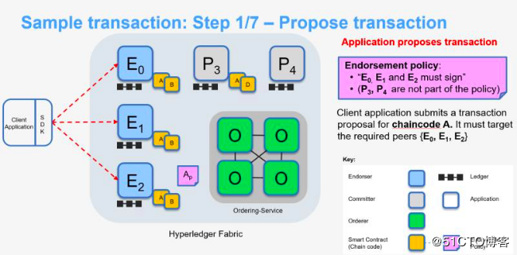
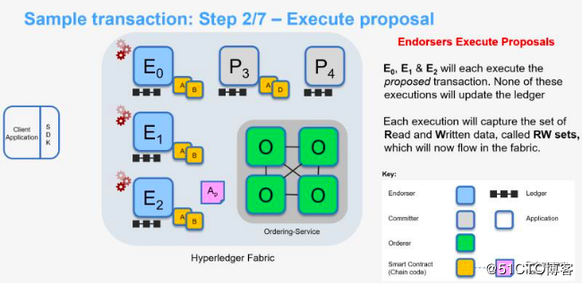
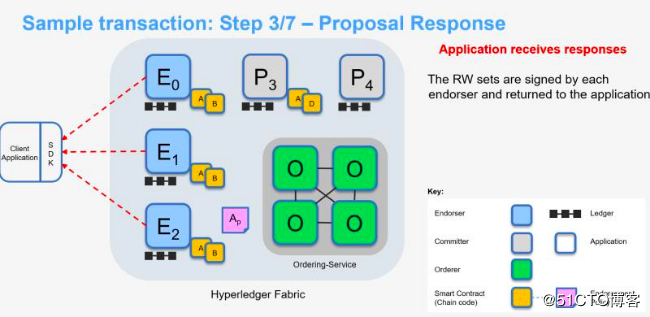
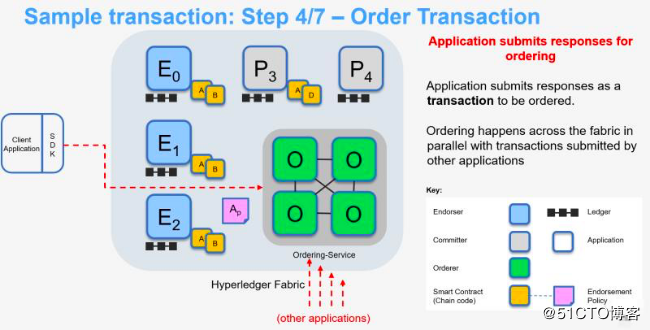
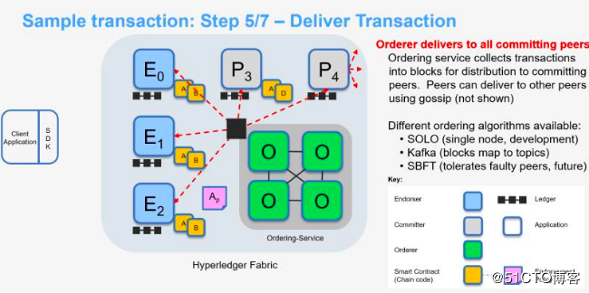
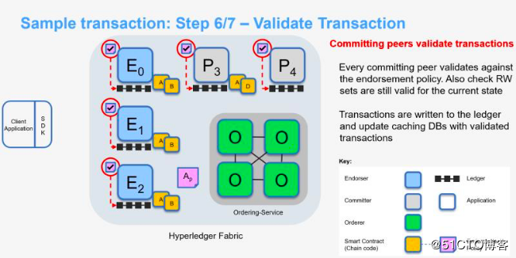
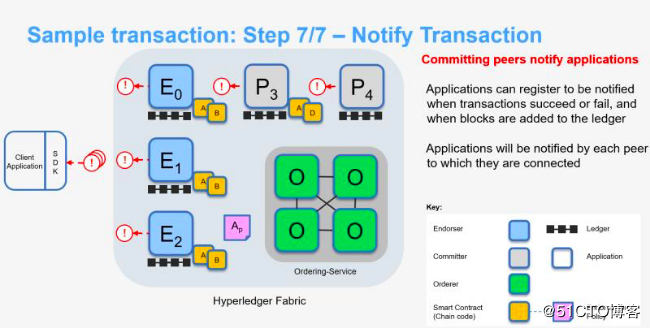
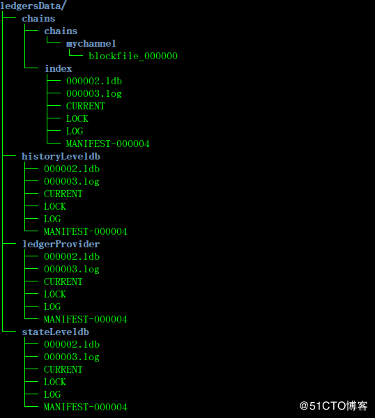
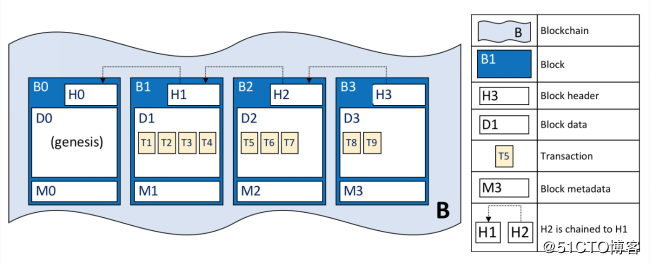
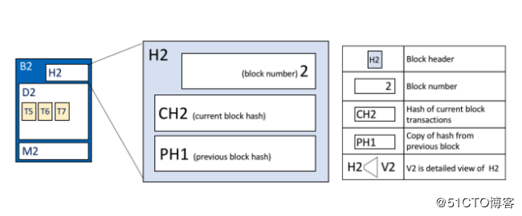

# Fabric 账本存储 4
## Fabric 账本简介
Fabric 里的数据以分布式账本的形式存储。账本由一系列有顺序和防篡改的记录组成，记录包含着数据的全部状态改变。账本中的数据项以键值对的形式存放，账本中所有的键值对构成了账本的状态，也称为世界状态（World State）。 

每个通道中有唯一的账本，由通道中所有成员共同维护着账本，每个记账节点上都保存了所属通道的账本的一个副本，因而是分布式账本。对账本的访问需要通过链码实现对账本键值对的增加、删除、更新和查询等的操作。

账本由区块链和状态数据库两部分组成。

- 区块链(数据)

	它是一组不可更改的有序的区块（数据块），记录着全部交易的日志。每个区块中包含若干个交易的数据，不同区块所包含的交易数量可以不同。区块之间用哈希链（Hashed-link）关联(每个区块头包含该区块所有交易的哈希值以及上一个区块头的哈希值)。链式结构可以确保每个区块的数据不可更改以及每个区块之间的顺序关系不可更改。因此，区块链的区块只可以添加在链的尾部。
- 状态数据库(索引)

	它记录了账本中所有键值对的当前值，相当于对当前账本的交易日志做了索引。链码执行交易的时候需要读取账本的当前状态，从状态数据库可以迅速获取键值的最新状态。如果没有状态数据库，要获得某个键值时，需要遍历整个区块链中和该键值相关的交易，效率非常低，因此，读取状态数据库可以认为是快速定位和访问某个键值的方法。另外，当状态数据库出现故障的时候，可以通过遍历账本重新生成。

当一个区块附加到区块链尾部的时候，如果区块中的有效交易修改了键值对，则会在状态数据库中作相应的更新，确保区块链和状态数据库始终保持一致。

区块链的数据块以文件形式保存在各个节点中。状态数据库可以是各种键值数据库，Fabric 缺省使用 LevelDB ，也支持 CouchDB 的选项。CouchDB 除了支持键值数据外，也支持 JSON 格式的文档模型等

## Fabric 交易流程
### 第一步 发送交易提案请求

客户端首先构建交易提案，交易提案的作用是调用通道中的链码来读取或者写入账本的数据。客户端使用 Fabric SDK 创建交易提案，并使用用户的私钥对交易提案进行签名。

Fabric SDK 作用有两个

- 一个是将交易提案封装成符合 gRPC 协议的 Protobuf 格式的消息
- 一个是对创建的交易提案进行签名

客户端打包完交易提案后，将交易提案提交给通道中的背书节点。背书节点的背书策略定义了哪些背书节点签名背书后交易才能有效，客户端根据背书策略选择相应的背书节点，并向相应背书节点提交交易提案。

### 第二步 执行交易提案

背书节点收到交易提案后，使用 MSP 模块验证签名并确定请求者是否被合理授权进行交易提案的操作（使用每个 channel 对应的 ACL 进行验证），背书节点以交易提案凭证为输入，基于当前状态的数据库执行来生成交易结果(执行交易提案)，结果输出包括反馈值、读取集和写入集。此时，账本并未进行更新。

- 校验交易
	- 首先校验交易的签名是否合法
	- 然后根据签名者的身份，确认其是否具有权限进行相关交易
	- 背书节点还需要检查交易提案的格式是否正确以及是否已经提交过（防止重放）
- 执行提案

	在所有合法性校验通过后，背书节点按照交易提案调用链码模拟执行交易。
	
	链码执行时
	
	- 读取的数据（键值对）是背书节点中本地的状态数据库，链码读取过的数据回被归总到读集（Read Set）；
	- 链码对状态数据库的写操作并不会对账本做改变，所有的写操作将归总到一个写入集（Write Set）中记录下来。读集和写集将在确认节点中用于确定交易是否最终写入账本。

### 第三步 返回提案结果

背书节点会将背书节点输出、背书节点签名、是否背书声明作为交易提案反馈回传给客户端的 SDK。

- 返回客户端
	
	在链码执行完成后，背书节点把链码模拟执行后得到的读写集（Read-Write Set）等信息签名后发回给客户端。此时，交易信息只在客户端和单个背书节点之间达成共识，并没有完成全网共识，各个客户端的交易顺序没有确定，可能存在双花问题，所以不是一个有效交易。同时，客户端需要收到大多数背书节点的验证回复后，才算验证成功，具体的背书策略由智能合约代码控制，可以由开发者自由配置。

### 第四步 提交交易到排序服务
	

客户端在收到签名背书后，检查背书节点的签名，并比较不同背书节点的结果是否一致。

- 如果交易提案是`查询`账本的请求，则客户端无需提交交易给排序节点。
- 如果交易提案是`更新`账本的请求，客户端在收集到满足背书策略的签名背书后，把背书节点返回的读写集、所有背书节点的签名和通道(channel)号发给排序服务节点。

### 第五步 实施交易

排序服务节点在收到各个节点发来的交易后，并不检查交易的全部内容，而是：

- 按照交易中的通道号对交易分类排序
- 然后把相同通道的交易批量打包成区块。(排序服务的共识算法以组件化形式插入 Fabric 网络，即开发者可以自由选择合适的共识算法。)
- 排序服务节点将为特定通道生成的区块广播给通道中所有组织的主导节点。
	- 区块的广播有两种触发条件
		- 一种是当通道的交易数量达到某个预设的阈值
		- 另一种是在交易数量没有超过阈值但距离上次广播的时间超过某个特定阈值，也可触发广播数据块。
		
		两种方式相结合，使得经过排序的交易及时生成区块并广播给通道的 Peer 节点（记账节点）。

排序服务节点只是决定交易处理的顺序，并不对交易的合法性进行校验，也不负责维护账本信息，只有记账节点才有账本写入权限。

### 第六步 交易验证

记账节点收到排序服务节点发来的区块后，逐笔检查区块中的交易。

- 先检查交易的合法性以及该交易是否曾经出现过。
- 然后调用校验系统链码（VSCC，Validation System Chaincode）检验交易的签名背书是否合法，以及背书的数量是否满足背书策略的要求。
- 记账节点对交易进行多版本并发控制（MVCC）检查，即校验交易的读集（Read Set）是否和当前账本中的版本一致（即没有变化）。
	- 如果没有改变，说明交易写集（Write Set）中对数据的修改有效，把该交易标注为有效，交易的写集更新到状态数据库中。
	- 如果当前账本的数据和读集版本不一致，则该交易被标注为无效，不更新状态数据库。区块中的交易数据在标注成有效或无效后封装成区块写入账本的区块链中。

### 第七步 通知交易

客户端会收到每一个连接的记账节点的通知。

### 总结

区块链的账本由 Peer 节点(包含背书节点和记账节点)维护，并不是由排序服务集群维护。所以，只有 Peer 节点包含完整的区块链信息，而排序服务集群只负责对交易进行排序，只保留处理过程中的一部分区块链信息。

Hyperledger Fabric 网络中的节点是一个逻辑的概念，并不一定是一个台物理设备，但对于生产环境，为了系统架构的解耦，提高扩展性以及通过主机隔离提高安全性，`Peer节点不能和排序服务节点部署在一台机器上，而背书节点和记账节点可以部署在同一台机器上`。 背书节点校验客户端的签名，然后执行智能合约代码模拟交易。交易处理完成后，对交易信息签名，返回给客户端。客户端收到签名后的交易信息后，发给排序服务节点排序。排序服务节点将交易信息排序打包成区块后，广播发给记账节点，写入区块链中。

## Fabric 账本存储原理
### 1 Fabric 账本存储原理
Fabric 区块链网络中，每个通道都有其账本，每个 Peer 节点都保存着其所加入通道的账本，Peer 节点的账本包含如下数据：

- 账本编号，用于快速查询存在哪些账本
- 账本数据，用于区块数据存储
- 区块索引，用于快速查询区块／交易
- 状态数据，用于最新的世界状态数据
- 历史数据：跟踪键的历史

Fabric 的 Peer 节点账本中有四种数据库

- blkstorage（block 文件块存储）
	
	账本数据库基于文件系统，将区块存储在文件块中，然后在区块索引 LevelDB 中存储区块交易对应的文件块及其偏移，即将区块索引 LevelDB 作为账本数据库的索引。目前支持的区块索引有：
	
	- 区块编号
	- 区块哈希
	- 交易ID
	- 区块交易编号
- statedb（状态数据库）

	状态数据库存储的是所有曾经在交易中出现的键值对的最新值。调用链码执行交易可以改变状态数据，为了高效的执行链码调用，所有数据的最新值都被存放在状态数据库中；状态数据库是有序交易日志的快照，任何时候都可以根据交易日志重新生成状态数据库；状态数据库会在 Peer 节点启动的时候自动恢复或重构。未完备前，本 Peer 节点不会接受新的交易；状态数据库可以使用 LevelDB 或者 CouchDB，CouchDB 能够存储任意的二进制数据，支持富文本查询。
- historydb（历史数据库）

	历史状态数据库用于查询某个 key 的历史修改记录，历史状态数据库并不存储 key 具体的值，而只记录在某个区块的某个交易里，某 key 变动了一次。后续需要查询的时候，根据变动历史去查询实际变动的值。
- idStore（ledgerID 记录账本id的数据库）

	ledgerID 数据库存储 chainID，用于快速查询节点存在哪些账本。

对于单链的 Peer 节点账本（不包含ledgerID数据库）结构如下：

### 2 Peer账本结构
ledgersData 是 Peer 节点账本的根目录，Peer 节点的账本存储在 Peer 节点容器的 `/var/hyperledger/production/ledgersData` 目录下，通过命令行可以进入 Peer 节点容器进行查看，命令如下：

	docker exec -it peer0.org1.example.com bash
Peer 节点的本地账本结构如下：

- chains
	- chains
	
		目录下的 mychannel 目录 channel 的名称，Fabric 支持多通道的机制，而通道之间的账本是隔离的，每个通道都有自己的账本空间。
	- index
	
		目录包含 levelDB 数据库文件，存储区块索引数据库，使用 leveldb 实现
- historyLeveldb

	目录存储智能合约中写入的 key 的历史记录的索引地址，使用 leveldb 实现。
- ledgerProvider

	目录存储当前节点所包含 channel 的信息（已经创建的 channel id 和正在创建中的 channel id），使用leveldb实现。
- stateLeveldb

	目录存储智能合约写入的数据，可选择使用 leveldb 或 couchDB
	
### 3 账本数据
账本数据以二进制文件的形式存储的，每个账本数据存储在不同的目录下。账本数据的所有操作都通过区块文件管理器实现。区块文件管理器创建的文件以blockfile_为前缀，6位数字为后缀，后缀必须是从小到大连续的数字，中间不能有缺失，因此账本最大可以持有1000000个文件块。默认的区块文件块大小的上限是64M（目前硬编码在代码中）。账本数据的结构如下：

- B代表区块链账本数据
	- B0为创世区块
		- 区块头H0
		- 区块数据D0（创世区块里不包含交易数据）
		- 区块元数据M0
	- 区块B1
		- 区块头H1
			- 前一个区块B0的加密hash
			- 本身区块的加密hash

### 4 区块结构(B2)
 

- 区块头(H2)

	区块头（Block Header）包含三部分

	1. 区块数（Block Number）
	
		一个从 0（创世区块）开始的整数，并且对于附加到区块链的每个新块增加1
	- 当前区块hash（Current Block Hash）

		当前区块中包含的所有交易的 hash
	- 前一区块hash（Previous Block Hash）

		前一个区块的 hash
- 区块数据(D2)

	区块数据（Block Data）包含一组交易，交易在区块创建时写入
- 区块元数据(M2)

	区块元数据（Block Matadata）包含
	
	- 区块创建时间
	- 写入客户端的证书
	- 公钥和签名

### 5 交易结构(T1)
	

- 交易头(H4)

	交易头中包含了一些重要的交易元数据，例如链码的名称、版本
- 签名(S4)

	签名包含由客户端创建的加密签名，由客户端的私钥生成，用于检查交易有没有被篡改
- 交易提案(P4)

	交易提案包含由客户端生成的交易请求参数
- 交易提案返回(R4)

	交易提案返回包含由背书节点返回的模拟执行结果（读写集RWset）
- 背书(E4)

	背书包含交易的背书，一个返回对应多个背书

### 6 区块索引
区块索引用于快速定位区块,索引键可以是区块高度、区块哈希、交易哈希。Fabric 提供了多种区块索引的方式，以便能快速找到区块。索引的内容是文件位置指针（File Location Pointer）。文件位置指针由三个部分组成：

- 所在文件的编号（fileSuffixNum）
- 文件内的偏移量（offset）
- 区块占用的字节数（bytesLength）

## 参考
[Fabric账本存储](https://blog.51cto.com/9291927/2316594)