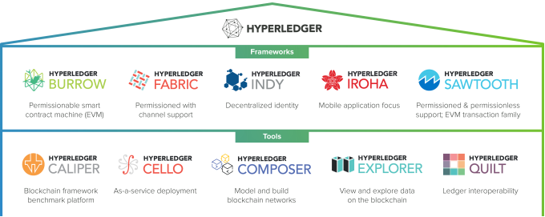
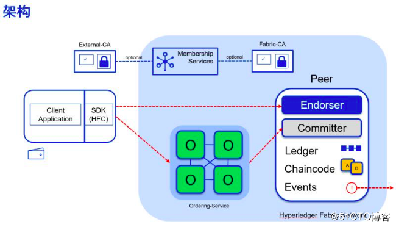
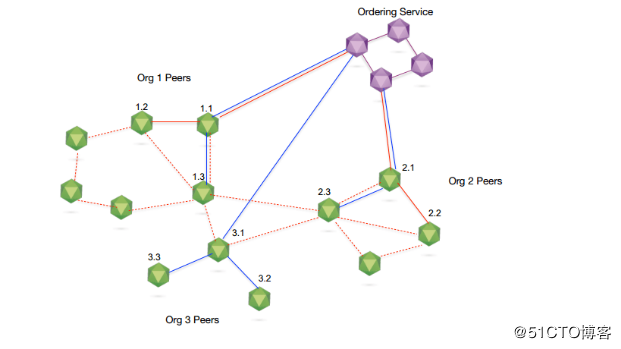
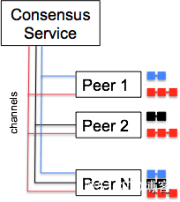
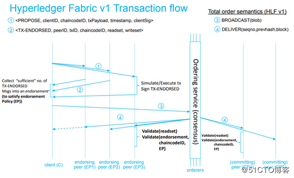

# Hyperledger Fabric
## 简介
Hyperledger（超级账本）是 Linux 基金会于2015年发起的推进区块链数字技术和交易验证的开源项目，目标是让成员共同合作，共建开放平台，满足来自多个不同行业各种用户案例，并简化业务流程。由于点对点网络的特性，分布式账本技术是完全共享、透明和去中心化的，故非常适合于在金融行业的应用，以及其它的例如制造、银行、保险、物联网等行业。通过创建分布式账本的`公开标准`，实现虚拟和数字形式的价值交换，例如资产合约、能源交易、结婚证书、能够安全和高效低成本的进行追踪和交易。

Hyperledger 是一个联合项目，超级账本由面向不同目的和场景的子项目构成，包括10个项目

- 区块链框架类项目5个：
	- Fabric
	- Sawtooth
	- Iroha
	- Burrow
	- Indy
- 区块链工具类项目5个：
	- Cello
	- Composer
	- Explorer
	- Caliper
	- Quilt

Hyperledger 的所有项目都遵守 Apache v2 许可，并约定共同遵守如下的基本原则：

- 重视模块化设计：包括交易、合同、一致性、身份、存储等技术场景。
- 重视代码可读性：保障新功能和模块都可以很容易添加和扩展。
- 可持续的演化路线：随着需求的深入和更多的应用场景，不断增加和演化新的项目。

Apache v2 许可协议是商业友好的知名开源协议，鼓励代码共享，尊重原作者的著作权，允许对代码进行修改和再发布(作为开源或商业软件)。
Hyperledger 社区目前拥有超过 200 家全球知名企业和机构(大部分均为各自行业的领导者)会员，其中包括40多家来自中国本土的企业，包括Onchain、三一重工、万达科技、华为、百度、腾讯等。

以比特币为代表的数字货币提供了区块链技术应用的原型，以太坊为代表的智能合约平台延伸了区块链技术的功能，Hyperledger 则通过进一步引入权限控制和安全保障，开拓了区块链技术的全新领域。Hyperledger 首次将区块链技术引入到分布式联盟账本的应用场景，为未来基于区块链技术打造高效率的商业网络打下了坚实的基础。

Hyperledger 项目的出现，实际上宣布区块链技术已经不仅局限在单一应用场景中，也不仅局限在完全开放的公有链模式下，区块链技术已经正式被主流企业市场认可并在实践中采用。同时，Hyperledger 中提出和实现了许多创新的设计和理念，包括完备的权限和审查管理、细粒度隐私保护以及可拔插、可扩展的实现框架，对于区块链相关技术和产业的发展都将产生深远的影响。

- [Hyperledger 官网](https://www.hyperledger.org/)
- [Hyperledger源码托管](https://github.com/hyperledger)
- [Hyperledger中文文档1](https://github.com/HyperledgerCN/hyperledgerDocs)
- [Hyperledger中文文档2](https://hyperledgercn.github.io/hyperledgerDocs/)

## Hyperledger社区组织结构(忽略)
[忽略内容](https://blog.51cto.com/9291927/2306906)
## Hyperledger开发工具
[忽略内容](https://blog.51cto.com/9291927/2306906)

- Linux Foundation ID(sso)
- Jira任务和进度管理(任务和bug管理器)
- Gerrit代码仓库和Review管理(代码库)
- RocketChat在线沟通(sms)

# Fabric 入门
通过入门课程，可以启动一个最简单的 fabric 网络，但是注意这里只包含排序节点、peer 节点、tools三个类型的服务，没有背书？还是已经包含在 peer 节点中？

[忽略内容](https://blog.51cto.com/9291927/2307159)
# HyperLeger Fabric 架构
## HyperLeger Fabric 逻辑架构
### 1 逻辑架构简介

Fabric 逻辑架构根据不同角度进行划分

- 上层基于应用程序角度进行设计
	- SDK
	- API
	- 事件
	
	通过SDK、API、事件来对底层区块链进行操作
	
	- 身份管理
	- 账本管理
	- 交易管理
	- 智能合约的部署和调用
- 下层基于底层区块链进行设计，对外提供
	- 成员管理服务
	- 共识服务
	- 链码服务
	- 安全和密码服务
	
Fabric 为应用开发提供了标准的 gRPC 接口，在 API 的基础上封装了不同语言的 SDK，包括 Go、NODE.JS、Java、Python 等，开发人员可以利用 SDK 开发基于区块链的应用；同时，`区块链的强一致性要求各个节点之间达成共识需要较长的执行时间`，应用程序也是采用异步通信的模式进行开发的，事件模块可以在触发区块事件或者链码事件的时候执行预先定义的回调函数。

Fabric 通过将各个部分分离成不同的模块，做到可插拔性、灵活扩展性。

### 上层应用层逻辑架构
- 身份管理(PKI)

	联盟链考虑到商业应用对安全、隐私、监管、审计、性能的需求，提高准入门槛，成员必须被许可才能加入网络。Fabric 是目前为止在设计上最贴近联盟链思想的区块链。联盟链考虑到商业应用对安全、隐私、监管、审计、性能的需求，提高准入门槛，成员必须被许可才能加入网络。Fabric 成员管理服务为整个区块链网络提供身份管理、隐私、保密和可审计的服务。成员管理服务通过公钥基础设施 PKI 和去中心化共识机制使得非许可的区块链变成许可制的区块链。
	
	Fabric 区块链中，采用数字证书机制负责对网络中的成员身份进行管理，CA 节点实现了 PKI 服务。
	
	- PKI（Public Key Infrastructure）是综合多种密码学手段来实现安全可靠传递消息和身份确认的一个框架和规范。通常，PKI包括三部分：
		- CA（Certification Authority）负责证书的颁发和作废，接收来自RA的请求
		- RA（Registration Authority）负责对用户身份进行验证，校验数据合法性，负责登记，审核通过则发给CA
		- 证书数据库，用于存放证书，一般采用 LDAP 目录服务，标准格式采用X.500系列

	CA 是 PKI 体系最核心的组件，主要完成对公钥的管理。密钥有两种类型：用于签名和用于加解密，对应称为签名密钥对和加密密钥对。 用户基于 PKI 体系要申请一个证书，一般可以由 CA 来生成证书和私钥，也可以自己生成公钥和私钥，然后由 CA 来对公钥进行签发。
- 账本管理

	授权的用户是可以查询账本数据的，可以通过多种方式查询，包括：

	- 根据区块号查询区块
	- 根据区块哈希查询区块
	- 根据交易号查询区块
	- 根据交易号查询交易
	- 根据通道名称查询区块链信息
- 交易管理

	账本数据只能通过交易执行才能更新，应用程序通过交易管理提交提案(Proposal)，在获取到足够数量交易背书(Endorsement)后，再给排序服务节点提交交易，排序服务将批量交易打包生成区块。SDK提供接口，利用用户证书本地生成交易号，背书节点和记账节点都会校验是否存在重复交易。
- 智能合约

	Fabric 的智能合约（Smart Contract）称为链码（ChainCode），是一段代码，用于处理网络成员所同意的业务逻辑。Fabric 的链码和底层账本是分开的，升级链码时并不需要迁移账本数据到新链码当中，真正实现了逻辑与数据的分离。
	
Fabric 通过智能合约实现了可编程的账本，通过链码执行提交的交易，实现基于区块链的智能合约业务逻辑。只有智能合约才能更新账本数据，其它模块不能直接修改状态数据。

链码可采用 Go、Java、Node.js 语言编写。链码被编译成一个独立的应用程序，Fabric 用 Docker 容器来运行链码，容器里的 base 镜像都是经过签名验证的安全镜像，包括 OS 层和开发链码的语言、runtime 和 SDK 层。一旦链码容器被启动，就会通过 gRPC 与启动链码的 Peer 节点连接。

### 底层逻辑架构
- 成员服务管理

	MSP（Member Service Provider）成员服务模块对成员管理进行了抽象，提供包括会员注册，身份保护、内容保密、交易审计等功能，可以使用可插拔的 Fabric-CA 模块或第三方的 CA 来代替
- 共识服务

	共识服务负责节点间共识管理、账本的分布式计算、账本的存储及节点间的 P2P 协议功能的实现，是区块链的核心组成部分，为区块链的主体功能提供了底层技术支撑
- 链码服务

	链码服务为智能合约实现提供了一系列接口，并为链码的安装、运行、部署提供了环境。智能合约的实现依赖于安全的执行环境，确保安全的执行过程和用户数据的隔离。Fabric 采用 Docker 管理普通的链码，提供安全的沙箱环境和镜像文件仓库，可支持多种语言的链码。
- 安全和密码服务

	安全问题是企业级区块链关心的问题，Hyperledger Fabric 专门定义了一个 BCCSP（BlockChain Cryptographic Service Provider）模块，实现密钥生成、哈希运算、签名验签、加密解密等基础功能。
	
### Fabric 逻辑架构的特点
Fabric 采用模块化架构设计，利用通用的功能模块和接口。模块化的方法带来了可扩展性、灵活性等优势，会减少模块修改、升级带来的影响，能很好的利用微服务实现区块链应用系统的开发和部署。

- 模块插件化

	Fabric 很多功能模块（如CA模块、共识算法、状态数据库存储、ESCC、VSCC、BCCSP等）都是可插拔的。Fabric 提供的通用接口和默认实现可以满足大多数的业务需求，同时功能模块也可以根据需求进行扩展，集成到 Fabric 区块链网络系统中。
- 充分利用容器技术

	Fabric 中不仅节点使用容器作为运行环境，链码也默认运行在安全的容器中。应用程序或者外部系统不能直接操作链码，必须通过背书节点提供的接口转发给链码来执行。容器给链码运行提供安全沙箱环境，把链码的环境和背书节点的环境隔离开，链码存在安全问题也不会影响到背书节点。
- 可扩展性

	Fabric1.x 版本对节点的角色进行了不同的拆分
	
	- 有主节点(Leader)
	- 背书节点(Endorser)
	- 记账节点(Committer)
	- 排序服务节点(Orderer)等

	不同角色的节点有不同的功能。节点可以加入不同的通道中，链码可以运行在不同的背书节点上，可以更好的提升并行执行的效率和吞吐量。
- 安全性

	Fabric 提供授权访问的区块链网络，节点共同维护成员信息，只有 MSP(Member Service Provide) 模块验证、授权的终端用户才能使用区块链网络的功能。多链和多通道的设计容易实现数据隔离，也提供了应用程序和链码之间的安全通道，实现了隐私保护。

## Fabric 网络架构
### 1 Fabric 网络架构简介		
Fabric 网络是通过组织来划分的，每个组织内都包含承担不同功能的 Peer 节点，每个 Peer 节点又可以担任多种角色。所有的组织共用一个统一的 Orderer 排序服务集群。基于 Fabric 区块链网络的设计时需要考虑组织之间的业务关系以及内部每个模块之间的联系，统一进行规划。

Fabric网络包含

- 客户端节点

	客户端或应用程序代表由终端用户操作的实体，必须连接到某一个 Peer 节点或者排序服务节点上与区块链网络进行通信。
	
	- 客户端向背书节点（Endorser Peer）提交交易提案(Proposal)
	- 背书节点返回背书信息给客户端
	- 当收集到足够背书后，向排序服务节点广播交易
	- 排序节点进行排序，生成区块
	
	客户端的主要作用是与 Fabric 区块链交互，实现对区块链的操作。区块链操作分为管理类和链码类的两种
	
	- 管理类操作

		包括启停节点和配置网络等；
	- 链码类操作主要是链码的生命周期管理，如安装、实例化以及调用链码。

	最常用的客户端是命令行客户端（CLI），此外是使用 Fabric SDK 开发的应用客户端
- CA 节点

	CA 节点主要给 Fabric 网络中的成员提供基于数字证书的身份信息，可以生成或取消成员的证书（certificate）。CA 节点是 Fabric 网络的证书颁发节点(Certificate Authority)，服务由两个模块组成
	
	- 服务器(fabric-ca-server)
	- 客户端(fabric-ca-client)
	
	CA 节点接收客户端的注册申请，返回注册密码用于登录，以便获取证书。在区块链网络上所有的操作都会验证用户的身份。

	CA 节点是可选的，也可以用其它成熟的第三方CA颁发证书。
- Peer 节点

	Fabric 区块链网络中的每个组织可以拥有一到多个 Peer 节点。每个 Peer 节点必定是一个记账节点，除记账节点外，也可以担任其它一到多种角色，即某个 Peer 节点可以同时是记账节点和背书节点，也可以同时是记账节点、背书节点、主节点，锚节点。角色分别为：
	
	- Endorser Peer（背书节点）

		背书(Endorsement)是指特定 Peer 节点执行交易并向生成交易提案( proposal )的客户端应用程序返回YES/NO响应的过程。
		
		部分 Peer 节点会执行交易并对结果进行签名背书，充当背书节点的角色 。背书节点是动态的角色，是与具体链码绑定的。每个链码在实例化的时候都会设置背书策略(Endorsement policy)，指定哪些节点对交易背书才有效。
		
		也只有在应用程序向节点发起交易背书请求时才成为背书节点，其它时候是普通的记账节点，只负责验证交易并记账。
	- Leader Peer（主节点）

		主节点负责和 Orderer 排序服务节点通信，它可以从排序服务节点处获取最新的区块并在组织内部同步。可以强制设置，也可以选举产生。	
	- Committer Peer（记账节点）
		- 首先负责验证从排序服务节点接收到的区块里的交易
		- 然后将区块提交（写入/追加）到其通道账本的副本
		- 记账节点还将每个块中的每个交易标记为有效或无效
	- Anchor Peer（锚节点）

		在一个通道上可以被所有其它 Peer 节点发现的 Peer 节点，通道上的每个成员都有一个或多个 Anchor Peer (多个Anchor Peer来防止单点故障)，允许属于不同成员的 Peer 节点发现通道上的所有现有 Peer 节点
- Orderer 节点

	排序服务节点接收包含背书签名的交易，对未打包的交易进行排序生成区块，广播给 Peer 节点。它提供的是原子广播，保证同一个链上的所有节点接收到相同的消息，并且有相同的逻辑顺序。

	排序服务独立于 Peer 进程存在并且以先来先服务的方式对 Fabric 网络上的所有通道进行排序交易。排序服务旨在支持超出现有的 SOLO 和 Kafka 的可插拔实现。它是整个网络的公共绑定，包含绑定到每个成员的加密身份材料。

	排序服务节点按照一定规则确定交易顺序后，发给各个记账节点，把交易持久化到区块链的账本中。排序服务节点支持互相隔离的多个通道，使得交易只发送给相关的记账节点。

### 总结整体架构
每个组织通常拥有自己的客户端、Peer节点和CA节点，并且可以根据需要创建一个或多个不同的类型节点。Orderer 节点不属于某个组织的实体，属于组织共同维护的节点。

## Fabric 多链多通道设计
### 1 通道简介
商业应用的一个重要的需求是私密交易，为此 Fabric 设计了通道（Channel）来提供成员之间的隐私保护。通道是部分网络成员之间拥有独立的通信渠道，在通道中发送的交易只有属于通道的成员才可见，因此通道可以看作是 Fabric 的网络中部分成员的私有通信子网。

通道由排序服务管理。在创建通道的时候，需要定义通道的成员和组织、锚节点（anchor peer）和排序服务节点，一条与通道对应的区块链会同时生成，用于记录账本的交易，通道的初始配置信息记录创世区块中，可以通过增加一个新的配置区块来更改通道的配置信息。

每个组织可以有多个节点加入同一个通道，组织内的节点中可以指定一个锚节点或多个锚节点（增强系统可靠性，避免单点故障）。组织的锚节点代表本组织与其它组织的节点交互，从而发现通道中的所有节点。另外，同一组织的节点会选举或指定主导节点（leading peer），主导节点负责接收从排序服务发来的区块，然后转发给本组织的其它节点。主导节点可以通过特定的算法选出，可以保证在节点数量不断变动的情况下仍能维持整个网络的稳定性。

在 Fabric 网络中，可能同时存在多条彼此隔离的通道，每条通道包含一条私有的区块链和一个私有账本，通道中可以实例化一个或多个链码，以操作区块链上的数据。
### 2 Fabric多链多通道设计
Fabric 1.x 版本支持多链和多通道。Fabric 的一条区块链是包含 Peer 节点、账本、排序服务的逻辑结构，将参与者与数据（包含链码）进行隔离，满足不同业务场景下的不同的人访问不同数据的基本要求。

通道是共识服务提供的一种通讯机制，基于发布-订阅关系，将 Peer 节点和排序节点根据某个 Topic 连接在一起，形成一个具有保密性的通讯链路（虚拟），实现业务隔离的要求。

排序服务提供了 Peer 节点订阅的主题（如发布-订阅消息队列），每个主题是一个通道。Peer 节点可以订阅多个通道，并且只能访问自己所订阅通道上的交易，因此一个 Peer 节点可以通过接入多个通道参与到多条链中。

目前通道分为系统通道（System Channel）和应用通道（Application Channel）。排序服务通过系统通道来管理应用通道，用户的交易信息通过应用通道传递。

排序服务工作有2个

- 排序服务节点负责管理通道
- 同时排序服务节点还负责对通道中的交易进行排序

在通道中一般包含有若干成员（组织），若两个网络实体的背书能够追溯到同一个根CA，则认为这两个实体属于同一组织。此外，通道中的每个组织都会有一个或以上的锚节点，锚节点负责与其它组织交换共享账本的数据。

创建通道的时候定义了成员，只有通过成员 MSP 验证的实体，才能够加入到通道并访问通道的数据。

排序服务支持多通道，提供了通向客户端和 Peer 节点的共享通信通道，提供了包含交易的消息广播服务（broadcast和deliver）。

- 客户端可以通过通道向连接到通道的所有 peer 节点广播（broadcast）消息
- 还可以向连接到通道的所有节点投递(deliver) 消息

多通道使得 Peer 节点可以基于应用访问控制策略来订阅任意数量的通道，应用程序根据业务逻辑决定将交易发送到1个或多个通道。

上图共识服务与（P1、PN）、（P1、P2、PN）、（P2、PN）组成三个相互独立的通道，加入到不同通道的 Peer 节点能够维护各个通道对应的账本和状态。不同通道对应现实世界中不同业务场景下的参与方，如银行、保险公司、物流企业、生产企业等实体结构。

### 3 通道的配置
通道的配置信息都被打包到一个区块中，并存放在通道的共享账本中，成为通道的配置区块，配置区块除了配置信息外不包含其它交易信息。通道可以使用配置区块来更新配置，因此在账本中每新添加一个配置区块，通道就按照最新配置区块的定义来修改配置。通道账本的首个区块一定是配置区块，也称为创世区块（Genesis Block）。
### 4 通道管理命令
通道的 CLI 客户端可以使用命令对通道进行管理。

- peer channel create

	用于创建通道，主要参数有 `-c, -f, -o` 分别用于指定通道 ID, configtx 的路径和 orderer 的地址
- peer channel fetch

	抓取通道中的特定区块，通过 `-c` 和 `-f` 参数来指定通道 ID 和 orderer 地址
- peer channel join

	加入通道，通过 `-b` 参数指定初始区块
- peer channel list

	列出 peer 加入的通道
- peer channel update

	签名并且发送 configtx 以升级通道配置，需要通过 `-c, -f, -o` 参数分别指定通道 ID, configtx 的路径以及排序节点的地址。
### 5 动态修改通道配置
在通道创建后，通道相关的配置以区块的形式存在于通道的账本中。如果需要修改通道的配置，可通过生成新的配置区块去更新。修改通道配置的步骤如下：

- 通过 SDK 或 CLI 获得最新的配置区块
- 编辑配置区块
- 计算配置更新量
- 为配置区块添加配置更新量
- SDK 或 CLI 签名并发送配置区块

若新的配置区块通过验证，则通道配置以最新配置区块为准

## 交易流程简介
### 1 交易简介
Fabric 区块链的交易分两种，部署交易和调用交易。
部署交易把链码部署到 Peer 节点上并准备好被调用，当一个部署交易成功执行时，链码就被部署到各个背书节点上。
调用交易是客户端应用程序通过 Fabric 提供的 API 调用先前已部署好的某个链码的某个函数执行交易，并相应地读取和写入 KV 数据库，返回是否成功或者失败。

### 2 交易流程简介
Fabric v1.0的交易流程如下

区块链的账本由 Peer 节点维护，并不是由排序服务集群维护。所以，只有 Peer 节点（背书节点和记账节点）包含完整的区块链信息，而排序服务集群只负责对交易进行排序，只保留处理过程中的一部分区块链信息。Fabric 网络中的节点是一个逻辑的概念，并不一定是一个台物理设备，但对于生产环境，为了系统架构的解耦，提高扩展性以及通过主机隔离提高安全性，Peer 节点不能和排序服务节点部署在一台机器上，而背书节点和记账节点可以部署在同一台机器上。背书节点校验客户端的签名，然后执行智能合约代码模拟交易。交易处理完成后，对交易信息签名，返回给客户端。客户端收到签名后的交易信息后，发给排序服务节点排序。排序服务节点将交易信息排序打包成区块后，广播发给确认节点，写入区块链中。

### 3 客户端构造交易提案
### 4 背书节点模拟执行交易
### 5 客户端把交易发送到排序服务节点
### 6 共识排序，生成新区块
### 7 交易校验

以上 3-7 都是交易过程，参考 

## 参考
[HyperLeger Fabric开发（一）——HyperLeger简介](https://blog.51cto.com/9291927/2306906)

