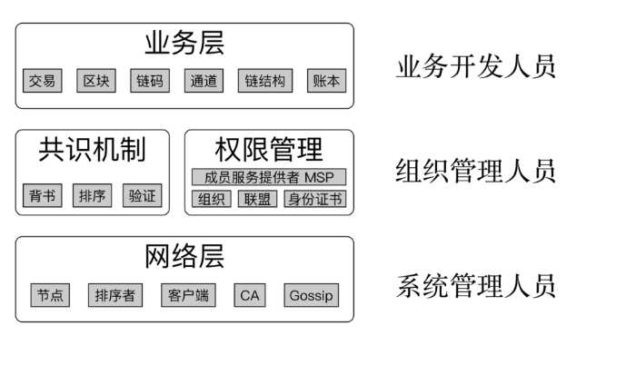
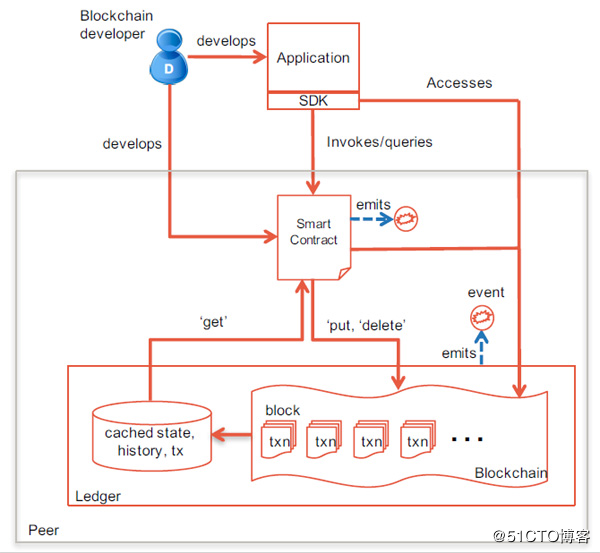
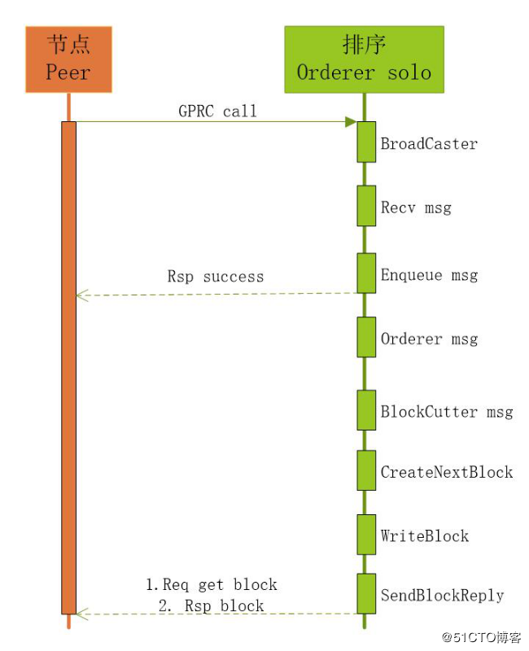

# Hyperledger Fabric
## 简介
Hyperledger（超级账本）是 Linux 基金会于2015年发起的推进区块链数字技术和交易验证的开源项目，目标是让成员共同合作，共建开放平台，满足来自多个不同行业各种用户案例，并简化业务流程。由于点对点网络的特性，分布式账本技术是完全共享、透明和去中心化的，故非常适合于在金融行业的应用，以及其它的例如制造、银行、保险、物联网等行业。通过创建分布式账本的`公开标准`，实现虚拟和数字形式的价值交换，例如资产合约、能源交易、结婚证书、能够安全和高效低成本的进行追踪和交易。

Hyperledger 是一个联合项目，超级账本由面向不同目的和场景的子项目构成，包括10个项目

- 区块链框架类项目5个：
	- Fabric
	- Sawtooth
	- Iroha
	- Burrow
	- Indy
- 区块链工具类项目5个：
	- Cello
	- Composer
	- Explorer
	- Caliper
	- Quilt

Hyperledger 的所有项目都遵守 Apache v2 许可，并约定共同遵守如下的基本原则：

- 重视模块化设计：包括交易、合同、一致性、身份、存储等技术场景。
- 重视代码可读性：保障新功能和模块都可以很容易添加和扩展。
- 可持续的演化路线：随着需求的深入和更多的应用场景，不断增加和演化新的项目。

Apache v2 许可协议是商业友好的知名开源协议，鼓励代码共享，尊重原作者的著作权，允许对代码进行修改和再发布(作为开源或商业软件)。
Hyperledger 社区目前拥有超过 200 家全球知名企业和机构(大部分均为各自行业的领导者)会员，其中包括40多家来自中国本土的企业，包括Onchain、三一重工、万达科技、华为、百度、腾讯等。

以比特币为代表的数字货币提供了区块链技术应用的原型，以太坊为代表的智能合约平台延伸了区块链技术的功能，Hyperledger 则通过进一步引入权限控制和安全保障，开拓了区块链技术的全新领域。Hyperledger 首次将区块链技术引入到分布式联盟账本的应用场景，为未来基于区块链技术打造高效率的商业网络打下了坚实的基础。

Hyperledger 项目的出现，实际上宣布区块链技术已经不仅局限在单一应用场景中，也不仅局限在完全开放的公有链模式下，区块链技术已经正式被主流企业市场认可并在实践中采用。同时，Hyperledger 中提出和实现了许多创新的设计和理念，包括完备的权限和审查管理、细粒度隐私保护以及可拔插、可扩展的实现框架，对于区块链相关技术和产业的发展都将产生深远的影响。

## Hyperledger社区组织结构(忽略)
[忽略内容](https://blog.51cto.com/9291927/2306906)
## Hyperledger开发工具
[忽略内容](https://blog.51cto.com/9291927/2306906)

- Linux Foundation ID(sso)
- Jira任务和进度管理(任务和bug管理器)
- Gerrit代码仓库和Review管理(代码库)
- RocketChat在线沟通(sms)

# Fabric 入门
通过入门课程，可以启动一个最简单的 fabric 网络，但是注意这里只包含排序节点、peer 节点、tools三个类型的服务，没有背书？还是已经包含在 peer 节点中？

[忽略内容](https://blog.51cto.com/9291927/2307159)
# HyperLeger Fabric 架构
## HyperLeger Fabric 逻辑架构
### 1 逻辑架构简介

Fabric 逻辑架构根据不同角度进行划分

- 上层基于应用程序角度进行设计
	- SDK
	- API
	- 事件
	
	通过SDK、API、事件来对底层区块链进行操作
	
	- 身份管理
	- 账本管理
	- 交易管理
	- 智能合约的部署和调用
- 下层基于底层区块链进行设计，对外提供
	- 成员管理服务
	- 共识服务
	- 链码服务
	- 安全和密码服务
	
Fabric 为应用开发提供了标准的 gRPC 接口，在 API 的基础上封装了不同语言的 SDK，包括 Go、NODE.JS、Java、Python 等，开发人员可以利用 SDK 开发基于区块链的应用；同时，`区块链的强一致性要求各个节点之间达成共识需要较长的执行时间`，应用程序也是采用异步通信的模式进行开发的，事件模块可以在触发区块事件或者链码事件的时候执行预先定义的回调函数。

Fabric 通过将各个部分分离成不同的模块，做到可插拔性、灵活扩展性。

### 上层应用层逻辑架构
- 身份管理(PKI)

	联盟链考虑到商业应用对安全、隐私、监管、审计、性能的需求，提高准入门槛，成员必须被许可才能加入网络。Fabric 是目前为止在设计上最贴近联盟链思想的区块链。联盟链考虑到商业应用对安全、隐私、监管、审计、性能的需求，提高准入门槛，成员必须被许可才能加入网络。Fabric 成员管理服务为整个区块链网络提供身份管理、隐私、保密和可审计的服务。成员管理服务通过公钥基础设施 PKI 和去中心化共识机制使得非许可的区块链变成许可制的区块链。
	
	Fabric 区块链中，采用数字证书机制负责对网络中的成员身份进行管理，CA 节点实现了 PKI 服务。
	
	- PKI（Public Key Infrastructure）是综合多种密码学手段来实现安全可靠传递消息和身份确认的一个框架和规范。通常，PKI包括三部分：
		- CA（Certification Authority）负责证书的颁发和作废，接收来自RA的请求
		- RA（Registration Authority）负责对用户身份进行验证，校验数据合法性，负责登记，审核通过则发给CA
		- 证书数据库，用于存放证书，一般采用 LDAP 目录服务，标准格式采用X.500系列

	CA 是 PKI 体系最核心的组件，主要完成对公钥的管理。密钥有两种类型：用于签名和用于加解密，对应称为签名密钥对和加密密钥对。 用户基于 PKI 体系要申请一个证书，一般可以由 CA 来生成证书和私钥，也可以自己生成公钥和私钥，然后由 CA 来对公钥进行签发。
- 账本管理

	授权的用户是可以查询账本数据的，可以通过多种方式查询，包括：

	- 根据区块号查询区块
	- 根据区块哈希查询区块
	- 根据交易号查询区块
	- 根据交易号查询交易
	- 根据通道名称查询区块链信息
- 交易管理

	账本数据只能通过交易执行才能更新，应用程序通过交易管理提交提案(Proposal)，在获取到足够数量交易背书(Endorsement)后，再给排序服务节点提交交易，排序服务将批量交易打包生成区块。SDK提供接口，利用用户证书本地生成交易号，背书节点和记账节点都会校验是否存在重复交易。
- 智能合约

	Fabric 的智能合约（Smart Contract）称为链码（ChainCode），是一段代码，用于处理网络成员所同意的业务逻辑。Fabric 的链码和底层账本是分开的，升级链码时并不需要迁移账本数据到新链码当中，真正实现了逻辑与数据的分离。
	
Fabric 通过智能合约实现了可编程的账本，通过链码执行提交的交易，实现基于区块链的智能合约业务逻辑。只有智能合约才能更新账本数据，其它模块不能直接修改状态数据。

链码可采用 Go、Java、Node.js 语言编写。链码被编译成一个独立的应用程序，Fabric 用 Docker 容器来运行链码，容器里的 base 镜像都是经过签名验证的安全镜像，包括 OS 层和开发链码的语言、runtime 和 SDK 层。一旦链码容器被启动，就会通过 gRPC 与启动链码的 Peer 节点连接。

### 底层逻辑架构
- 成员服务管理

	MSP（Member Service Provider）成员服务模块对成员管理进行了抽象，提供包括会员注册，身份保护、内容保密、交易审计等功能，可以使用可插拔的 Fabric-CA 模块或第三方的 CA 来代替
- 共识服务

	共识服务负责节点间共识管理、账本的分布式计算、账本的存储及节点间的 P2P 协议功能的实现，是区块链的核心组成部分，为区块链的主体功能提供了底层技术支撑
- 链码服务

	链码服务为智能合约实现提供了一系列接口，并为链码的安装、运行、部署提供了环境。智能合约的实现依赖于安全的执行环境，确保安全的执行过程和用户数据的隔离。Fabric 采用 Docker 管理普通的链码，提供安全的沙箱环境和镜像文件仓库，可支持多种语言的链码。
- 安全和密码服务

	安全问题是企业级区块链关心的问题，Hyperledger Fabric 专门定义了一个 BCCSP（BlockChain Cryptographic Service Provider）模块，实现密钥生成、哈希运算、签名验签、加密解密等基础功能。
	
### Fabric 逻辑架构的特点
Fabric 采用模块化架构设计，利用通用的功能模块和接口。模块化的方法带来了可扩展性、灵活性等优势，会减少模块修改、升级带来的影响，能很好的利用微服务实现区块链应用系统的开发和部署。

- 模块插件化

	Fabric 很多功能模块（如CA模块、共识算法、状态数据库存储、ESCC、VSCC、BCCSP等）都是可插拔的。Fabric 提供的通用接口和默认实现可以满足大多数的业务需求，同时功能模块也可以根据需求进行扩展，集成到 Fabric 区块链网络系统中。
- 充分利用容器技术

	Fabric 中不仅节点使用容器作为运行环境，链码也默认运行在安全的容器中。应用程序或者外部系统不能直接操作链码，必须通过背书节点提供的接口转发给链码来执行。容器给链码运行提供安全沙箱环境，把链码的环境和背书节点的环境隔离开，链码存在安全问题也不会影响到背书节点。
- 可扩展性

	Fabric1.x 版本对节点的角色进行了不同的拆分
	
	- 有主节点(Leader)
	- 背书节点(Endorser)
	- 记账节点(Committer)
	- 排序服务节点(Orderer)等

	不同角色的节点有不同的功能。节点可以加入不同的通道中，链码可以运行在不同的背书节点上，可以更好的提升并行执行的效率和吞吐量。
- 安全性

	Fabric 提供授权访问的区块链网络，节点共同维护成员信息，只有 MSP(Member Service Provide) 模块验证、授权的终端用户才能使用区块链网络的功能。多链和多通道的设计容易实现数据隔离，也提供了应用程序和链码之间的安全通道，实现了隐私保护。

## Fabric 网络架构
### 1 Fabric 网络架构简介		
Fabric 网络是通过组织来划分的，每个组织内都包含承担不同功能的 Peer 节点，每个 Peer 节点又可以担任多种角色。所有的组织共用一个统一的 Orderer 排序服务集群。基于 Fabric 区块链网络的设计时需要考虑组织之间的业务关系以及内部每个模块之间的联系，统一进行规划。

Fabric网络包含

- 客户端节点

	客户端或应用程序代表由终端用户操作的实体，必须连接到某一个 Peer 节点或者排序服务节点上与区块链网络进行通信。
	
	- 客户端向背书节点（Endorser Peer）提交交易提案(Proposal)
	- 背书节点返回背书信息给客户端
	- 当收集到足够背书后，向排序服务节点广播交易
	- 排序节点进行排序，生成区块
	
	客户端的主要作用是与 Fabric 区块链交互，实现对区块链的操作。区块链操作分为管理类和链码类的两种
	
	- 管理类操作

		包括启停节点和配置网络等；
	- 链码类操作主要是链码的生命周期管理，如安装、实例化以及调用链码。

	最常用的客户端是命令行客户端（CLI），此外是使用 Fabric SDK 开发的应用客户端
- CA 节点

	CA 节点主要给 Fabric 网络中的成员提供基于数字证书的身份信息，可以生成或取消成员的证书（certificate）。CA 节点是 Fabric 网络的证书颁发节点(Certificate Authority)，服务由两个模块组成
	
	- 服务器(fabric-ca-server)
	- 客户端(fabric-ca-client)
	
	CA 节点接收客户端的注册申请，返回注册密码用于登录，以便获取证书。在区块链网络上所有的操作都会验证用户的身份。

	CA 节点是可选的，也可以用其它成熟的第三方CA颁发证书。
- Peer 节点

	Fabric 区块链网络中的每个组织可以拥有一到多个 Peer 节点。每个 Peer 节点必定是一个记账节点，除记账节点外，也可以担任其它一到多种角色，即某个 Peer 节点可以同时是记账节点和背书节点，也可以同时是记账节点、背书节点、主节点，锚节点。角色分别为：
	
	- Endorser Peer（背书节点）

		背书(Endorsement)是指特定 Peer 节点执行交易并向生成交易提案( proposal )的客户端应用程序返回YES/NO响应的过程。
		
		部分 Peer 节点会执行交易并对结果进行签名背书，充当背书节点的角色 。背书节点是动态的角色，是与具体链码绑定的。每个链码在实例化的时候都会设置背书策略(Endorsement policy)，指定哪些节点对交易背书才有效。
		
		也只有在应用程序向节点发起交易背书请求时才成为背书节点，其它时候是普通的记账节点，只负责验证交易并记账。
	- Leader Peer（主节点）

		主节点负责和 Orderer 排序服务节点通信，它可以从排序服务节点处获取最新的区块并在组织内部同步。可以强制设置，也可以选举产生。	
	- Committer Peer（记账节点）
		- 首先负责验证从排序服务节点接收到的区块里的交易
		- 然后将区块提交（写入/追加）到其通道账本的副本
		- 记账节点还将每个块中的每个交易标记为有效或无效
	- Anchor Peer（锚节点）

		在一个通道上可以被所有其它 Peer 节点发现的 Peer 节点，通道上的每个成员都有一个或多个 Anchor Peer (多个Anchor Peer来防止单点故障)，允许属于不同成员的 Peer 节点发现通道上的所有现有 Peer 节点
- Orderer 节点

	排序服务节点接收包含背书签名的交易，对未打包的交易进行排序生成区块，广播给 Peer 节点。它提供的是原子广播，保证同一个链上的所有节点接收到相同的消息，并且有相同的逻辑顺序。

	排序服务独立于 Peer 进程存在并且以先来先服务的方式对 Fabric 网络上的所有通道进行排序交易。排序服务旨在支持超出现有的 SOLO 和 Kafka 的可插拔实现。它是整个网络的公共绑定，包含绑定到每个成员的加密身份材料。

	排序服务节点按照一定规则确定交易顺序后，发给各个记账节点，把交易持久化到区块链的账本中。排序服务节点支持互相隔离的多个通道，使得交易只发送给相关的记账节点。

### 总结整体架构
每个组织通常拥有自己的客户端、Peer节点和CA节点，并且可以根据需要创建一个或多个不同的类型节点。Orderer 节点不属于某个组织的实体，属于组织共同维护的节点。

## Fabric 多链多通道设计
### 1 通道简介
商业应用的一个重要的需求是私密交易，为此 Fabric 设计了通道（Channel）来提供成员之间的隐私保护。通道是部分网络成员之间拥有独立的通信渠道，在通道中发送的交易只有属于通道的成员才可见，因此通道可以看作是 Fabric 的网络中部分成员的私有通信子网。

通道由排序服务管理。在创建通道的时候，需要定义通道的成员和组织、锚节点（anchor peer）和排序服务节点，一条与通道对应的区块链会同时生成，用于记录账本的交易，通道的初始配置信息记录创世区块中，可以通过增加一个新的配置区块来更改通道的配置信息。

每个组织可以有多个节点加入同一个通道，组织内的节点中可以指定一个锚节点或多个锚节点（增强系统可靠性，避免单点故障）。组织的锚节点代表本组织与其它组织的节点交互，从而发现通道中的所有节点。另外，同一组织的节点会选举或指定主导节点（leading peer），主导节点负责接收从排序服务发来的区块，然后转发给本组织的其它节点。主导节点可以通过特定的算法选出，可以保证在节点数量不断变动的情况下仍能维持整个网络的稳定性。

在 Fabric 网络中，可能同时存在多条彼此隔离的通道，每条通道包含一条私有的区块链和一个私有账本，通道中可以实例化一个或多个链码，以操作区块链上的数据。

### 2 Fabric多链多通道设计
Fabric 1.x 版本支持多链和多通道。Fabric 的一条区块链是包含 Peer 节点、账本、排序服务的逻辑结构，将参与者与数据（包含链码）进行隔离，满足不同业务场景下的不同的人访问不同数据的基本要求。

通道是共识服务提供的一种通讯机制，基于发布-订阅关系，将 Peer 节点和排序节点根据某个 Topic 连接在一起，形成一个具有保密性的通讯链路（虚拟），实现业务隔离的要求。

排序服务提供了 Peer 节点订阅的主题（如发布-订阅消息队列），每个主题是一个通道。Peer 节点可以订阅多个通道，并且只能访问自己所订阅通道上的交易，因此一个 Peer 节点可以通过接入多个通道参与到多条链中。

目前通道分为系统通道（System Channel）和应用通道（Application Channel）。排序服务通过系统通道来管理应用通道，用户的交易信息通过应用通道传递。

排序服务工作有2个

- 排序服务节点负责管理通道
- 同时排序服务节点还负责对通道中的交易进行排序

在通道中一般包含有若干成员（组织），若两个网络实体的背书能够追溯到同一个根CA，则认为这两个实体属于同一组织。此外，通道中的每个组织都会有一个或以上的锚节点，锚节点负责与其它组织交换共享账本的数据。

创建通道的时候定义了成员，只有通过成员 MSP 验证的实体，才能够加入到通道并访问通道的数据。

排序服务支持多通道，提供了通向客户端和 Peer 节点的共享通信通道，提供了包含交易的消息广播服务（broadcast和deliver）。

- 客户端可以通过通道向连接到通道的所有 peer 节点广播（broadcast）消息
- 还可以向连接到通道的所有节点投递(deliver) 消息

多通道使得 Peer 节点可以基于应用访问控制策略来订阅任意数量的通道，应用程序根据业务逻辑决定将交易发送到1个或多个通道。

上图共识服务与（P1、PN）、（P1、P2、PN）、（P2、PN）组成三个相互独立的通道，加入到不同通道的 Peer 节点能够维护各个通道对应的账本和状态。不同通道对应现实世界中不同业务场景下的参与方，如银行、保险公司、物流企业、生产企业等实体结构。

### 3 通道的配置
通道的配置信息都被打包到一个区块中，并存放在通道的共享账本中，成为通道的配置区块，配置区块除了配置信息外不包含其它交易信息。通道可以使用配置区块来更新配置，因此在账本中每新添加一个配置区块，通道就按照最新配置区块的定义来修改配置。通道账本的首个区块一定是配置区块，也称为创世区块（Genesis Block）。
### 4 通道管理命令
通道的 CLI 客户端可以使用命令对通道进行管理。

- peer channel create

	用于创建通道，主要参数有 `-c, -f, -o` 分别用于指定通道 ID, configtx 的路径和 orderer 的地址
- peer channel fetch

	抓取通道中的特定区块，通过 `-c` 和 `-f` 参数来指定通道 ID 和 orderer 地址
- peer channel join

	加入通道，通过 `-b` 参数指定初始区块
- peer channel list

	列出 peer 加入的通道
- peer channel update

	签名并且发送 configtx 以升级通道配置，需要通过 `-c, -f, -o` 参数分别指定通道 ID, configtx 的路径以及排序节点的地址。
### 5 动态修改通道配置
在通道创建后，通道相关的配置以区块的形式存在于通道的账本中。如果需要修改通道的配置，可通过生成新的配置区块去更新。修改通道配置的步骤如下：

- 通过 SDK 或 CLI 获得最新的配置区块
- 编辑配置区块
- 计算配置更新量
- 为配置区块添加配置更新量
- SDK 或 CLI 签名并发送配置区块

若新的配置区块通过验证，则通道配置以最新配置区块为准

## 交易流程简介
### 1 交易简介
Fabric 区块链的交易分两种，部署交易和调用交易。
部署交易把链码部署到 Peer 节点上并准备好被调用，当一个部署交易成功执行时，链码就被部署到各个背书节点上。
调用交易是客户端应用程序通过 Fabric 提供的 API 调用先前已部署好的某个链码的某个函数执行交易，并相应地读取和写入 KV 数据库，返回是否成功或者失败。

### 2 交易流程简介
Fabric v1.0的交易流程如下

区块链的账本由 Peer 节点维护，并不是由排序服务集群维护。所以，只有 Peer 节点（背书节点和记账节点）包含完整的区块链信息，而排序服务集群只负责对交易进行排序，只保留处理过程中的一部分区块链信息。Fabric 网络中的节点是一个逻辑的概念，并不一定是一个台物理设备，但对于生产环境，为了系统架构的解耦，提高扩展性以及通过主机隔离提高安全性，Peer 节点不能和排序服务节点部署在一台机器上，而背书节点和记账节点可以部署在同一台机器上。背书节点校验客户端的签名，然后执行智能合约代码模拟交易。交易处理完成后，对交易信息签名，返回给客户端。客户端收到签名后的交易信息后，发给排序服务节点排序。排序服务节点将交易信息排序打包成区块后，广播发给确认节点，写入区块链中。

### 3 客户端构造交易提案
### 4 背书节点模拟执行交易
### 5 客户端把交易发送到排序服务节点
### 6 共识排序，生成新区块
### 7 交易校验

以上 3-7 都是交易过程，参考本文`账本存储章节-交易流程`

## 账本简介
Fabric 使用建立在 HTTP/2 上的 P2P 协议来管理分布式账本，采取可插拔的方式来根据具体需求来设置共识协议，比如PBFT，Raft，PoW 和 PoS 等。

Fabric 网络的数据以分布式账本的形式存储。账本由一系列有顺序和防篡改的记录组成，记录包含着数据的全部状态改变。账本中的数据项以键值对的形式存放，账本中所有的键值对构成了账本的状态，称为世界状态（World State）。

每个通道中有一个唯一的账本，通道的账本由通道中所有成员共同维护，每个记账节点上都保存该通道账本的一个副本，因而是分布式账本。对账本的访问需要通过链码实现对账本键值对的增加、删除、更新和查询等操作。

账本由区块链和状态数据库两部分组成。

- 区块链

	它是一组不可更改的有序的区块（数据块），记录着全部交易的日志。每个区块中包含若干个交易的数据，不同区块所包含的交易数量可以不同。区块之间用哈希链（Hashed-link）关联：每个区块头包含本区块所有交易的哈希值，以及上一个区块头的哈希值。链式结构可以确保每个区块的数据不可更改，以及每个区块之间的顺序关系不可更改。因此，区块链的区块只可以添加在链的尾部。
	
- 状态数据库

	它记录了账本中所有键值对的当前值，相当于对当前账本的交易日志做了索引。链码执行交易的时候需要读取账本的当前状态，从状态数据库可以迅速获取键值的最新状态。

	如果没有状态数据库，要获得某个键值时，需要遍历整个区块链中和该键值相关的交易，效率差，因此，读取状态数据库可以认为是快速定位和访问某个键值的方法。另外，当状态数据库出现故障的时候，可以通过遍历账本重新生成。

	当一个区块附加到区块链尾部的时候，如果区块中的有效交易修改了键值对，则会在状态数据库中作相应的更新，确保区块链和状态数据库始终保持一致。

	区块链的数据块以文件形式保存在各个节点中。状态数据库可以是各种键值数据库，Fabric 缺省使用 LevelDB ，同时支持 CouchDB 选项。CouchDB 除了支持键值数据外，也支持JSON格式的文档模型，能够做复杂的查询。

### 账本架构图

### 架构图简介(具体解释查看`账本存储章节-账本存储原理`)
包含两个存储主体

- 文件系统(不可变)

	`transaction log` 交易日志(区块)存储在文件系统中，通过将交易日志格式进行数学耦合性的规约，形成了区块链。注意，该存储方式已存在的数据因为数据格式问题，不可变更。只能通过在结尾增加数据来做数据变更这一条路。
- LEVELDB(可变)

	图中包含3个库，状态库、历史库、区块索引库
	
	- state database

		状态库，记录最后写入状态的k/v值，勇于交易的模拟。支持三种查询
		
		- key 查询
		- key 综合查询
		- key 分段查询
	- key history index

		跟踪1个key的历史
	- 区块索引(block index)

		负责建立区块和交易日志的索引，用于快速定位区块,包含三种索引
		
		- 区块 hash 对应查询索引
		- 区块号码对应查询索引
		- 交易 id 对应查询的索引	
 
## Fabric 开发流程
### 1 开发简介

Fabric 联盟链的开发人员主要分为三类：

- 底层开发者负责系统部署与维护
- 组织管理者负责证书、MSP权限管理、共识机制等
- 业务开发者负责编写链码、创建维护通道、执行交易等

### 2 流程

Fabric 区块链开发流程主要包括智能合约编写，通过 SDK 调用智能合约，订阅各类事件。开发者创建客户端应用和链码，`链码被部署到区块链网络的背书节点上`。通过链码来操作账本，当客户端调用一个交易时，实际上是在调用链码中的一个实现业务逻辑的函数方法，并对账本进行 `get, put, delete` 操作。客户端应用提供用户交互界面，并提交交易到区块链网络上

## Fabric 共识过程(排序共识)
### 1 Fabric 共识过程
Fabric 区块链的网络节点本质上是互相复制的状态机，节点之间需要保持相同的账本状态。为了实现分布式节点的一致性，各个节点需要通过共识过程，对账本状态的变化达成一致性的认同。Fabric区块链的共识过程包括3个阶段

- 背书

	在背书（endorsement）阶段中，背书节点对客户端发来的交易提案进行合法性校验，然后模拟执行链码得到交易结果，最后根据设定的背书逻辑判断是否支持该交易提案。如果背书逻辑决定支持交易提案，会把交易提案签名后发回给客户端。

	客户端通常需要根据链码的背书策略，向一个或者多个成员的背书节点发出背书请求。背书策略会定义需要哪些节点背书交易才有效，例如需要5个成员的背书节点中至少3个同意；或者某个特殊身份的成员支持等。客户端只有在收集足够多的背书节点的交易提案签名，交易才能被视为有效
- 排序

	排序（ordering）阶段就是由排序服务对交易进行排序，确定交易之间的时序关系。排序服务把一段时间内收到的交易进行排序，然后把排序后的批量交易打包成数据块（区块），再把区块广播给通道中的成员。采用排序共识方式，各个成员收到的是一组发生顺序相同的交易，从而保证了所有节点的数据一致性。
	
	Fabric 1.0 中的排序服务支持可插拔的架构，除了提供的 SOLO 和 Kafka 模式外，用户可以添加第三方的排序服务。
	
	- SOLO 是单机模式，仅适合开发测试中使用。
	- Kafka 模式是基于 Kafka 开源的分布式数据流平台，具有高扩展性和容错能力，适合用在生产系统。Kafka 模式只提供了 CFT 类型的容错能力，即仅可对节点的一般故障失效容错，缺乏对节点故意作恶的行为进行容错的能力。

	排序服务是共识机制中重要的一环，所有交易都要通过排序服务的排序才可以达成全网共识，因此排序服务要避免成为网络上的性能瓶颈。
- 校验

	校验（Validation）阶段是确认节点对排序后的交易进行一系列的检验，包括交易数据的完整性检查、是否重复交易、背书签名是否符合背书策略的要求、交易的读写集是否符合多版本并发控制 MVCC（Multiversion Concurrency Control）的校验等。当交易通过了所有校验后，将被标注为合法并写入账本中。因为所有的确认节点都按照相同的顺序检验交易，并且把合法的交易依次写入账本中，因此不同确认节点的状态能够始终保持一致。

### 1 Fabric共识机制
#### Fabric 共识模式
在所有 Peer 节点中，交易信息必须按照一致的顺序写入账本（区块链的一致性基本原则）。

例如，比特币通过 POW 机制竞争记账权，由最先完成数学难题的节点获取记账权并生成区块，决定本区块中的信息顺序，并广播给全网所有节点，以此来达成账本的共识。

而 Hyperledger Fabric 采用了更加灵活、高效的共识算法，以适应企业场景下对高 TPS 的要求。目前，Hyperledger Fabric 有三种交易排序算法：Solo、Kafka、SBFT。

- Solo

	只有一个排序服务节点负责接收交易信息并排序，是最简单的一种排序算法，一般用于开发测试环境中。Solo 共识模式属于中心化的处理方式，不支持拜占庭容错。
- Kafka

	Kafka 是 Apache 的一个开源项目，主要提供分布式的消息处理／分发服务，每个 Kafka 集群由多个服务节点组成。Hyperledger Fabric 利用 Kafka 对交易信息进行排序处理，提供高吞吐、低延时的处理能力，并且在集群内部支持节点故障容错，但不支持拜占庭容错。
- SBFT

	简单拜占庭算法，支持拜占庭容错的可靠排序算法，包括容忍节点故障以及一定数量的恶意节点。目前，Hyperledger Fabric 社区正在开发 SBFT 算法。	

#### Solo 共识模式	
Solo共识模式指网络环境中只有一个排序节点，从 Peer 节点发送来的消息由一个排序节点进行排序和产生区块；由于排序服务只有一个排序节点为所有Peer节点服务，没有高可用性和可扩展性，不适合用于生产环境，通常用于开发和测试环境。Solo共识模式调用时序图如下：

调用过程说明：

- leader Peer 节点通过 gPRC 连接排序服务，连接成功后，发送交易信息
- 排序服务通过 Recv 接口，监听 Peer 节点发送过来的信息，收到信息后进行数据区块处理
- 排序服务根据收到的消息生成数据区块，通过掉用 peer 将尝试将区块通过 peer 写入账本（Ledger）中，返回处理信息。
- leader Peer 节点通过 deliver 接口，获取排序服务生成的区块数据,并分发给 记账 Peer 节点
- 记账 Peer 节点验证后将区块写入自己的交易日志(链)

#### Kafka 共识模式

共识集群由多个排序服务节点(OSN)和一个 Kafka 集群组成。排序节点之间不直接通信，仅仅与 Kafka 集群通信,在排序节点的实现里，通道(Channel)在 Kafka 中是以主题 topic 的形式隔离。每个排序节点内部，针对每个通道都会建立与 Kafka 集群对应 topic 的生产者及消费者。生产者将排序节点收到的交易发送到 Kafka 集群进行排序，在生产的同时，消费者也同步消费排序后的交易。

# Fabric 账本存储
## Fabric 账本简介
Fabric 里的数据以分布式账本的形式存储。账本由一系列有顺序和防篡改的记录组成，记录包含着数据的全部状态改变。账本中的数据项以键值对的形式存放，账本中所有的键值对构成了账本的状态，也称为世界状态（World State）。 

每个通道中有唯一的账本，由通道中所有成员共同维护着账本，每个记账节点上都保存了所属通道的账本的一个副本，因而是分布式账本。对账本的访问需要通过链码实现对账本键值对的增加、删除、更新和查询等的操作。

账本由区块链和状态数据库两部分组成。

- 区块链(数据)

	它是一组不可更改的有序的区块（数据块），记录着全部交易的日志。每个区块中包含若干个交易的数据，不同区块所包含的交易数量可以不同。区块之间用哈希链（Hashed-link）关联(每个区块头包含该区块所有交易的哈希值以及上一个区块头的哈希值)。链式结构可以确保每个区块的数据不可更改以及每个区块之间的顺序关系不可更改。因此，区块链的区块只可以添加在链的尾部。
- 状态数据库(索引)

	它记录了账本中所有键值对的当前值，相当于对当前账本的交易日志做了索引。链码执行交易的时候需要读取账本的当前状态，从状态数据库可以迅速获取键值的最新状态。如果没有状态数据库，要获得某个键值时，需要遍历整个区块链中和该键值相关的交易，效率非常低，因此，读取状态数据库可以认为是快速定位和访问某个键值的方法。另外，当状态数据库出现故障的时候，可以通过遍历账本重新生成。

当一个区块附加到区块链尾部的时候，如果区块中的有效交易修改了键值对，则会在状态数据库中作相应的更新，确保区块链和状态数据库始终保持一致。

区块链的数据块以文件形式保存在各个节点中。状态数据库可以是各种键值数据库，Fabric 缺省使用 LevelDB ，也支持 CouchDB 的选项。CouchDB 除了支持键值数据外，也支持 JSON 格式的文档模型等

## Fabric 交易流程
### 第一步 发送交易提案请求

客户端首先构建交易提案，交易提案的作用是调用通道中的链码来读取或者写入账本的数据。客户端使用 Fabric SDK 创建交易提案，并使用用户的私钥对交易提案进行签名。

Fabric SDK 作用有两个

- 一个是将交易提案封装成符合 gRPC 协议的 Protobuf 格式的消息
- 一个是对创建的交易提案进行签名

客户端打包完交易提案后，将交易提案提交给通道中的背书节点。背书节点的背书策略定义了哪些背书节点签名背书后交易才能有效，客户端根据背书策略选择相应的背书节点，并向相应背书节点提交交易提案。

### 第二步 执行交易提案

背书节点收到交易提案后，使用 MSP 模块验证签名并确定请求者是否被合理授权进行交易提案的操作（使用每个 channel 对应的 ACL 进行验证），背书节点以交易提案凭证为输入，基于当前状态的数据库执行来生成交易结果(执行交易提案)，结果输出包括反馈值、读取集和写入集。此时，账本并未进行更新。

- 校验交易
	- 首先校验交易的签名是否合法
	- 然后根据签名者的身份，确认其是否具有权限进行相关交易
	- 背书节点还需要检查交易提案的格式是否正确以及是否已经提交过（防止重放）
- 执行提案

	在所有合法性校验通过后，背书节点按照交易提案调用链码模拟执行交易。
	
	链码执行时
	
	- 读取的数据（键值对）是背书节点中本地的状态数据库，链码读取过的数据回被归总到读集（Read Set）；
	- 链码对状态数据库的写操作并不会对账本做改变，所有的写操作将归总到一个写入集（Write Set）中记录下来。读集和写集将在确认节点中用于确定交易是否最终写入账本。

### 第三步 返回提案结果

背书节点会将背书节点输出、背书节点签名、是否背书声明作为交易提案反馈回传给客户端的 SDK。

- 返回客户端
	
	在链码执行完成后，背书节点把链码模拟执行后得到的读写集（Read-Write Set）等信息签名后发回给客户端。此时，交易信息只在客户端和单个背书节点之间达成共识，并没有完成全网共识，各个客户端的交易顺序没有确定，可能存在双花问题，所以不是一个有效交易。同时，客户端需要收到大多数背书节点的验证回复后，才算验证成功，具体的背书策略由智能合约代码控制，可以由开发者自由配置。

### 第四步 提交交易到排序服务
	

客户端在收到签名背书后，检查背书节点的签名，并比较不同背书节点的结果是否一致。

- 如果交易提案是`查询`账本的请求，则客户端无需提交交易给排序节点。
- 如果交易提案是`更新`账本的请求，客户端在收集到满足背书策略的签名背书后，把背书节点返回的读写集、所有背书节点的签名和通道(channel)号发给排序服务节点。

### 第五步 实施交易

排序服务节点在收到各个节点发来的交易后，并不检查交易的全部内容，而是：

- 按照交易中的通道号对交易分类排序
- 然后把相同通道的交易批量打包成区块。(排序服务的共识算法以组件化形式插入 Fabric 网络，即开发者可以自由选择合适的共识算法。)
- 排序服务节点将为特定通道生成的区块广播给通道中所有组织的主导节点。
	- 区块的广播有两种触发条件
		- 一种是当通道的交易数量达到某个预设的阈值
		- 另一种是在交易数量没有超过阈值但距离上次广播的时间超过某个特定阈值，也可触发广播数据块。
		
		两种方式相结合，使得经过排序的交易及时生成区块并广播给通道的 Peer 节点（记账节点）。

排序服务节点只是决定交易处理的顺序，并不对交易的合法性进行校验，也不负责维护账本信息，只有记账节点才有账本写入权限。

### 第六步 交易验证

记账节点收到排序服务节点发来的区块后，逐笔检查区块中的交易。

- 先检查交易的合法性以及该交易是否曾经出现过。
- 然后调用校验系统链码（VSCC，Validation System Chaincode）检验交易的签名背书是否合法，以及背书的数量是否满足背书策略的要求。
- 记账节点对交易进行多版本并发控制（MVCC）检查，即校验交易的读集（Read Set）是否和当前账本中的版本一致（即没有变化）。
	- 如果没有改变，说明交易写集（Write Set）中对数据的修改有效，把该交易标注为有效，交易的写集更新到状态数据库中。
	- 如果当前账本的数据和读集版本不一致，则该交易被标注为无效，不更新状态数据库。区块中的交易数据在标注成有效或无效后封装成区块写入账本的区块链中。

### 第七步 通知交易

客户端会收到每一个连接的记账节点的通知。

### 总结

区块链的账本由 Peer 节点(包含背书节点和记账节点)维护，并不是由排序服务集群维护。所以，只有 Peer 节点包含完整的区块链信息，而排序服务集群只负责对交易进行排序，只保留处理过程中的一部分区块链信息。

Hyperledger Fabric 网络中的节点是一个逻辑的概念，并不一定是一个台物理设备，但对于生产环境，为了系统架构的解耦，提高扩展性以及通过主机隔离提高安全性，`Peer节点不能和排序服务节点部署在一台机器上，而背书节点和记账节点可以部署在同一台机器上`。 背书节点校验客户端的签名，然后执行智能合约代码模拟交易。交易处理完成后，对交易信息签名，返回给客户端。客户端收到签名后的交易信息后，发给排序服务节点排序。排序服务节点将交易信息排序打包成区块后，广播发给记账节点，写入区块链中。

## Fabric 账本存储原理
### 1 Fabric 账本存储原理
Fabric 区块链网络中，每个通道都有其账本，每个 Peer 节点都保存着其所加入通道的账本，Peer 节点的账本包含如下数据：

- 账本编号，用于快速查询存在哪些账本
- 账本数据，用于区块数据存储
- 区块索引，用于快速查询区块／交易
- 状态数据，用于最新的世界状态数据
- 历史数据：跟踪键的历史

Fabric 的 Peer 节点账本中有四种数据库

- blkstorage（block 文件块存储）
	
	账本数据库基于文件系统，将区块存储在文件块中，然后在区块索引 LevelDB 中存储区块交易对应的文件块及其偏移，即将区块索引 LevelDB 作为账本数据库的索引。目前支持的区块索引有：
	
	- 区块编号
	- 区块哈希
	- 交易ID
	- 区块交易编号
- statedb（状态数据库）

	状态数据库存储的是所有曾经在交易中出现的键值对的最新值。调用链码执行交易可以改变状态数据，为了高效的执行链码调用，所有数据的最新值都被存放在状态数据库中；状态数据库是有序交易日志的快照，任何时候都可以根据交易日志重新生成状态数据库；状态数据库会在 Peer 节点启动的时候自动恢复或重构。未完备前，本 Peer 节点不会接受新的交易；状态数据库可以使用 LevelDB 或者 CouchDB，CouchDB 能够存储任意的二进制数据，支持富文本查询。
- historydb（历史数据库）

	历史状态数据库用于查询某个 key 的历史修改记录，历史状态数据库并不存储 key 具体的值，而只记录在某个区块的某个交易里，某 key 变动了一次。后续需要查询的时候，根据变动历史去查询实际变动的值。
- idStore（ledgerID 记录账本id的数据库）

	ledgerID 数据库存储 chainID，用于快速查询节点存在哪些账本。

对于单链的 Peer 节点账本（不包含ledgerID数据库）结构如下：

### 2 Peer账本结构
ledgersData 是 Peer 节点账本的根目录，Peer 节点的账本存储在 Peer 节点容器的 `/var/hyperledger/production/ledgersData` 目录下，通过命令行可以进入 Peer 节点容器进行查看，命令如下：

	docker exec -it peer0.org1.example.com bash
Peer 节点的本地账本结构如下：

- chains
	- chains
	
		目录下的 mychannel 目录 channel 的名称，Fabric 支持多通道的机制，而通道之间的账本是隔离的，每个通道都有自己的账本空间。
	- index
	
		目录包含 levelDB 数据库文件，存储区块索引数据库，使用 leveldb 实现
- historyLeveldb

	目录存储智能合约中写入的 key 的历史记录的索引地址，使用 leveldb 实现。
- ledgerProvider

	目录存储当前节点所包含 channel 的信息（已经创建的 channel id 和正在创建中的 channel id），使用leveldb实现。
- stateLeveldb

	目录存储智能合约写入的数据，可选择使用 leveldb 或 couchDB
	
### 3 账本数据
账本数据以二进制文件的形式存储的，每个账本数据存储在不同的目录下。账本数据的所有操作都通过区块文件管理器实现。区块文件管理器创建的文件以blockfile_为前缀，6位数字为后缀，后缀必须是从小到大连续的数字，中间不能有缺失，因此账本最大可以持有1000000个文件块。默认的区块文件块大小的上限是64M（目前硬编码在代码中）。账本数据的结构如下：

- B代表区块链账本数据
	- B0为创世区块
		- 区块头H0
		- 区块数据D0（创世区块里不包含交易数据）
		- 区块元数据M0
	- 区块B1
		- 区块头H1
			- 前一个区块B0的加密hash
			- 本身区块的加密hash

### 4 区块结构(B2)
 

- 区块头(H2)

	区块头（Block Header）包含三部分

	1. 区块数（Block Number）
	
		一个从 0（创世区块）开始的整数，并且对于附加到区块链的每个新块增加1
	- 当前区块hash（Current Block Hash）

		当前区块中包含的所有交易的 hash
	- 前一区块hash（Previous Block Hash）

		前一个区块的 hash
- 区块数据(D2)

	区块数据（Block Data）包含一组交易，交易在区块创建时写入
- 区块元数据(M2)

	区块元数据（Block Matadata）包含
	
	- 区块创建时间
	- 写入客户端的证书
	- 公钥和签名

### 5 交易结构(T1)
	

- 交易头(H4)

	交易头中包含了一些重要的交易元数据，例如链码的名称、版本
- 签名(S4)

	签名包含由客户端创建的加密签名，由客户端的私钥生成，用于检查交易有没有被篡改
- 交易提案(P4)

	交易提案包含由客户端生成的交易请求参数
- 交易提案返回(R4)

	交易提案返回包含由背书节点返回的模拟执行结果（读写集RWset）
- 背书(E4)

	背书包含交易的背书，一个返回对应多个背书

### 6 区块索引
区块索引用于快速定位区块,索引键可以是区块高度、区块哈希、交易哈希。Fabric 提供了多种区块索引的方式，以便能快速找到区块。索引的内容是文件位置指针（File Location Pointer）。文件位置指针由三个部分组成：

- 所在文件的编号（fileSuffixNum）
- 文件内的偏移量（offset）
- 区块占用的字节数（bytesLength）

# Fabric智能合约 ChainCode
## 一 链码（Chaincode）简介
### 1 链码简介
在 Fabric 中，智能合约也称为链码（chaincode），分为用户链码和系统链码。

- 系统链码

	用来实现系统层面的功能，包括系统的配置，用户链码的部署、升级，用户交易的签名和验证策略等；
- 用户链码

	用于实现用户的应用功能，开发者编写链码应用程序并将其部署到区块链网络上，终端用户通过与背书网络节点交互的客户端应用程序调用链码。

链码被编译成一个独立的应用程序，运行于隔离的 Docker 容器中，在链码部署的时候会自动生成链码的 Docker 镜像。

链码是访问账本的基本方法，一般是用 Go 等高级语言编写的、实现规定接口的代码。上层应用可以通过调用链码来初始化和管理账本的状态。只要有适当的权限，链码之间也可以互相调用。它是一段由 Go 语言编写（支持其它编程语言，如 Java，NodeJS）并能实现预定义接口的程序。链码通过容器与背书节点的运行互相隔离。链码可通过客户端提交的交易对账本状态初始化并进行管理。

链码通常处理由网络中的成员一致认可的业务逻辑。链码创建的（账本）状态是与其它链码互相隔离的，因而不能被其它链码直接访问。如果在相同的 Fabric 网络中，链码在获取相应许可后可以调用其它链码来访问它的账本。

链码被部署在 Fabric 网络节点上，运行在 Docker 容器中，并通过 gRPC 协议与相应的 Peer 节点进行交互，以操作分布式账本中的数据。
### 2 链码的背书策略
背书策略是背书节点如何决策交易是否合法的条件。链码实例化时可指定背书策略，当记账节点接收到交易时，会获知相关链码信息，然后检查链码的背书策略，判断交易是否满足背书策略，若满足则标注交易为合法。

背书策略可分为主体 `Principal(P)` 和阈值` Threshold(T)` 两部分，具体如下：

- A(Principal) 指定由哪些成员进行背书
- B(Threshold) 接受两个输入，分别为阈值 T 和若干个 P 的集合 n，只要交易中包含了 n 中 t 个成员的背书则认为交易合法。

背书策略可以指定某几个组织内的任意成员身份进行背书，或者要求至少有一个管理员身份进行背书等等。如例:

- `T(1, ‘A’, ‘B’)`

	则需要 A，B 中任意成员背书
- `T(1, ‘A’, T(2, ‘B’, ‘C’))`

	则需要A成员背书或B，C成员同时背书

目前客户端已经实现对背书策略的支持，可以通过 `-P` 来指定背书策略，结合 `AND、OR` 来组合成员，完成成员身份（admin、member）的集合。例

- `-P OR ( 'Org1.admin' , AND ('Org2.member' , 'Org3.member') )`

	背书策略指定要么 Org1 的 admin 进行背书，或者 Org2 和 Org3 的成员同时进行背书，才满足背书策略

### 3 系统链码
系统链码与用户链码有相同的编程模型，但系统链码运行在 Peer 节点，用户链码则运行在容器中并进行隔离。因此，系统链码内置为 Peer 节点的可执行文件中，不遵循用户链码的生命周期管理，用户链码的安装、实例化、升级不适用于系统链码。

系统链码用于减少 Peer 节点与用户链码进行 gRPC 通信的开销，同时权衡管理的灵活性。系统链码只能通过 Peer 节点的二进制文件升级，必须通过一组固定的参数进行注册，但不具有背书策略。

 Fabric 系统链码实现了一系列系统功能，以便系统集成人员能够根据需求对其进行修改与替换，常见系统链码如下：

- 生命周期系统链码（LSCC ）：生命周期管理
- 配置系统链码（CSCC）：在 Peer 节点上的通道配置
- 查询系统链码（QSCC）：提供账本的查询 API，例如获取区块以及交易
- 背书系统链码（ESCC）：通过对交易提案响应进行签名来处理背书过程
- 验证系统链码（VSCC）：处理交易验证，包括检查背书策略以及多进程并发控制

因为系统链码在主交易执行的路径中，所以在修改或者替换系统链码（LSCC、ESCC、VSCC）时必须注意，防止影响链工作。VSCC 在将区块提交至账本前，所有在通道的 Peer 节点会计算相同的验证以避免账本分歧（不确定性）。如果 VSCC 被改变或者替换，需要特别小心。

## 链码功能
Peer 节点主要功能是调用链码执行交易和记账，其中交易执行由背书节点的链码负责，记账功能由记账节点负责。

链码与 Peer 节点的交互过程如下

- 链码通过 gRPC 与背书 Peer 节点交互
- 当背书 Peer 节点收到客户端的交易提案请求后，会发送一个链码消息对象（包含交易提案信息、调用者信息）给对应的链码。
- 链码调用 Invoke 方法，通过发送获取数据（GetState）和写入数据（PutState）消息，向 Peer 节点获取账本状态信息和发送预提交状态。
- 链码发送模拟执行结果给背书 Peer 节点，背书 Peer节点对交易提案和模拟执行结果进行背书签名

## 链码管理
### 1 用户链码生命周期
Fabric 提供了 `package，install，instantiate` 和 `upgrade` 4个命令管理用户链码生命周期

	

- `package`

	在 `install` 安装用户链码前，可以通过 `package` 打包并签名生成打包文件，然后在通过 `install` 安装
-  `install` 

	将打包好的用户链码安装
- `instantiate`

	通过 `invoke、query` 调用链码和查询链码(实例化链码)
- `upgrade`

	如果需要升级链码，则需要先 `install` 安装新版本的链码后再通过 `upgrade` 升级链码

链码在成功 `install` 以及 `instantiate` 后，链码处于运行状态，能够通过 `Invoke` 方法来处理交易，后续能够对链码进行升级。 Fabric API 允许与区块链网络中的各个节点  `Peer，Order，MSP` 进行交互，同时也允许在背书节点上 `package、install、instantiate` 以及 `upgrade` 用户链码。CLI 可以直接访问 Fabric API。
Fabric SDK 抽象了 Fabric API 的细节，以辅助应用程序开发，当然也能用于管理用户链码生命周期

### 2 打包用户链码
用户链码包由三个部分组成

- 由 `ChaincodeDeploymentSpec(CDS)`  格式定义的链码。CDS 根据代码及其它属性（如名称与版本）定义链码包
- 一个可选的实例化策略，能够被用作背书的策略进行描述
- 拥有链码的实体的一组签名

	链码的签名主要目的如下
		
	- `建立`链码的所有权
	- 允许`验证`链码包中的内容
	- 允许`检测`链码包是否被篡改

		通道上的链码的实例化交易的创建者(用户)能够被链码的实例化策略验证。

链码打包的方法由两种

- 一种是打包单个所有者持有的链码
- 一种是打包被多个所有者所拥有的链码，需要初始化创建一个被签名的链码包（SignedCDS），然后将其按顺序的传递给其它所有者进行签名

	创建一个被签名的链码包的命令如下：

		peer chaincode package -n sacc -p chaincodedev/chaincode/sacc -v 0 -s -S -i "AND('OrgA.admin')" ccpack.out
	
		-s 创建一个能被多个所有者签名的链码包，而不是简单的创建一个原始的CDS。一旦 -s 被指定，如果其它所有者想要签名 CDS，则 -S 选项必须被指定。否则，将会创建一个 SignedCDS，除 CDS 外仅仅包括实例化策略
		-S 使用被在 core.yaml 文件中定义的 localMspid 属性的值标识的 MSP 对链码包进行签名，-S 是可选的，如果创建了一个没有签名的链码包，不能被其它所有者使用 signpackage 命令进行签名
		-i 可选的，允许为链码指定实例化策略。实例化策略与背书策略有相同的格式，指定哪些身份能够实例化链码。
			本例中仅 OrgA 的 admin 能够实例化链码。如果没有实例化策略被指定，将会使用默认的策略，仅允许拥有 Peer 的 MSP 的管理员身份实例化链码

### 3 签名用户链码
在创建阶段就被签名的链码包能够交给其它所有者进行检查与签名，支持带外对链码进行签名。`ChaincodeDeploymentSpec` 可以选择由所有者集合进行签名，从而创建一个 `SignedChaincodeDeploymentSpec(SignedCDS)`。SignedCDS 包括3个部分：

- CDS 包括源代码，链码的名称与版本号
- 链码的实例化策略，表示为背书策略
- 链码所有者的列表，由背书策略定义

当在某些通道上实例化链码时，背书策略是在带外确定的，用于提供合适的 MSP 主体。如果没指定实例化策略，则默认的策略就是通道的任何 MSP 管理员。

每一个链码的所有者通过将 SignedCDS 与链码所有者的身份（例如证书）组合并签署组合结果来背书 `ChaincodeDeploymentSpec`。

一个链码的所有者能够对自己所创建的签名过的链码包进行签名，需要使用如下命令：

	peer chaincode signpackage ccpack.out signedccpack.out

- `ccpack.out、signedccpack.out` 分别是输入与输出包
- `signedccpack.out` 包括一个对链码包附加的签名（通过local msp进行的签名）

### 4 安装用户链码
安装交易将链码的源代码打包成 `ChaincodeDeploymentSpec（CDS）` 的规定的格式，然后安装到通道中的背书节点上。当安装的链码包只包含一个 `ChaincodeDeploymentSpec` 时，将使用默认初始化策略并包括一个空的所有者列表。

`链码应该仅仅被安装在链码所有者成员的背书节点上`，用于实现链码对于网络中其它成员在逻辑上是隔离的。没有链码的 Peer 节点，不能成为链码交易的背书者，不能执行链码，但作为记账节点仍然能够验证与提交交易到账本上。

安装链码会发送一个 `SignedProposal` 到生命周期系统链码(LSCC) ,使用 CLI 安装 sacc 链码的命令如下：

	peer chaincode install -n sacc -v 1.0 -p sacc

	-n 指定链码实例名称
	-v 指定链码的版本
	-p 指定链码所在路径，必须在 GOPATH 路径下

CLI 内部创建 sacc 的 `SignedChaincodeDeploymentSpec`，然后将其发送给本地 Peer 节点，Peer 节点会调用 LSCC 上的安装方法。为了在 Peer 节点上安装链码，`SignedProposal` 的签名必须来自于 Peer 节点的本地 MSP 管理员之一

### 5 实例化链码
实例化调用生命周期系统链码 LSCC 用于创建及初始化通道上的链码。链码能够被绑定到任意数量的通道，以及在每个通道上单独的操作。无论链码安装及实例化到多少个通道上，每个通道的状态都是隔离的。

实例化的创建者必须满足包含在 `SignedCDS` 内链码的实例化策略，而且还必须是通道的写入者（作为通道创建的一部分被配置）。可以防止部署链码的流氓实体或者欺骗者在未被绑定的通道上执行链码。

默认的实例化策略是任意的通道 MSP 的管理员，因此链码实例化交易的创建者必须是通道管理员之一。当交易提案到达背书节点后，背书节点会根据实例化策略验证创建者的签名。在提交实例化交易到账本前，在交易验证时再一次完成该操作。

实例化交易同样设置了通道上的链码的背书策略 。背书策略描述了交易被通道上成员接受的认证要求。例子：使用 CLI 去实例化 sacc 的链码并初始化状态为 user1 与 0，命令如下：
	
	peer chaincode instantiate -n sacc -v 1.0 -c '{"Args":["user1","0"]}' -P "OR ('Org1.member','Org2.member')"
	
	-n 链码实例名称
	-v 链码的版本
	-c 链码的调用参数
	-P 链码的背书策略
背书策略表示，org1.member 或者 org2.member 必须对调用使用 sacc 的交易进行签名，以保障交易是有效。在成功实例化后，通道的链码进入激活状态，可以处理任意的交易提案。交易到达背书节点时，会同时被处理。

### 6 调用链码
调用链码

	peer chaincode invoke -o orderer.example.com:7050 --tls $CORE_PEER_TLS_ENABLED --cafile $ORDERER_CA -C mychannel -n sacc -c '{"Args":["invoke","user1","user2","10"]}'
查询链码

	peer chaincode query -C mychannel -n sacc -c '{"Args":["query","user1"]}'

### 7 升级链码
链码的升级通过改变其版本号（作为 SignedCDS 的一部分）。SignedCDS 另外的部分，如所有者及实例化策略都是可选的。然而，链码的名称必须是一致的，否则会被当做另外一个新的链码。

在升级前，必须将新版本的链码安装到有需求的背书节点上。升级也是一种交易，会把新版本的链码绑定到通道中。升级只能在一个时间点对一个通道产生影响，其它通道仍然运行旧版本的链码。由于可能存在多个版本的链码同时存在，升级过程不会自动删除老版本，用户必须手动操作删除

升级与实例化 transaction 有一点不同的是

通过现有的 chaincode 实例化策略检查升级 transaction，而不是用新的策略检查。这是为了确保只有当前实例化策略中指定的成员能够升级 chaincode。

在升级期间，链码的 Init 函数也会被调用，执行有关升级的数据或者使用数据重新进行初始化，在升级链码的期间避免对状态进行重置

安装新版本的链码

	peer chaincode install -n sacc -v 1 -p path/to/my/chaincode/v1
upgrade升级链码

	peer chaincode upgrade -n sacc -v 1 -c '{"Args":["d", "e", "f"]}' -C mychannel

# Fabric链码开发
## 一 链码开发模式
### 1 链码开发模式简介
Fabric 的链码开发调试比较繁琐。在不使用链码开发模式的情况下，链码不能在本地测试，必须部署到 docker。在 `install` 和 `instantiate` 后，背书 Peer 节点会在新的容器中启动链码。但只能通过 `docker logs` 查看链码日志，通过打印日志的方式进行链码调试。如果对链码进行了修改，需要重新开始上述流程。

为了简化 Fabric 链码开发的调试过程，Fabric 引入了链码开发模式。通常情况下，链码由 Peer 节点启动和维护，但在链码开发模式下，链码由用户构建和启动。链码开发模式用于链码开发阶段中链码的编码、构建、运行、调试等链码生命周期阶段的快速转换。使用链码开发模式，启动 Peer 节点仍然需要安装、初始化链码，但只需要执行一次，并且链码可以运行在本地(比如直接在IDE启动)，可以使用IDE的调试功能。如果对链码进行了修改，直接在IDE中编译运行就能在 Peer 节点看到修改后的链码。要使用链码开发模式，首先修改运行 Peer 节点容器的启动命令，添加 `--peer-chaincodedev` 参数，例如在 `docker-compose.yaml` 中：

	command:peer node start --peer-chaincodedev=true
指定宿主机端口与Peer节点容器端口的映射：

	ports: 
    		- 7052:7052
宿主机端口是在本地启动链码连接 Peer 节点时使用的端口。Fabric 1.1 使用 7052 端口,1.0版本，使用 7051 端口，可以通过修改 `core.yaml` 文件修改默认端口。进入 cli 容器，安装、实例化链码：

	peer chaincode install -n 链码名 -v 1 -p xxx.com/xxxapp
	peer chaincode instantiate -o orderer.example.com:7050 -C mychannel -n 链码名 -v 版本号 -c '{"Args":[""]}' -P "OR ('Org1MSP.member','Org2MSP.member')"
背书策略使用 `-P` 参数指定
如果在 IDE 中直接运行链码，需要先配置两个环境变量

	CORE_PEER_ADDRESS=127.0.0.1:7052 CORE_CHAINCODE_ID_NAME=链码名:版本号
### 2 链码开发环境部署
[fabric-sample 项目](https://github.com/hyperledger/fabric-samples)提供了 Fabric 开发的多个实例，其中一个提供了链码开发 Fabric 网络环境，即 `chaincode-docker-devmode` 实例。

进入 `chaincode-docker-devmode` 目录

	cd fabric-samples/chaincode-docker-devmode
启动 Fabric 链码开发网络环境

	docker-compose -f docker-compose-simple.yaml up -d
`docker-compose-simple.yaml` 文件在 chaincode 容器中指定了链码代码注入目录为 `./../chaincode`，用于指定开发者的开发目录。

### 3 编译链码
进入链码容器

	docker exec -it chaincode bash
此时进入链码容器的工作目录，工作目录中存放了开发者开发的链码,编译链码

	cd [链码目录]
	go build -o [可执行文件]
部署链码

	CORE_PEER_ADDRESS=peer:[端口号] CORE_CHAINCODE_ID_NAME=[链码实例]:0 ./[可执行文件]
退出链码容器

	exit

### 4 测试链码
进入客户端 cli 容器 

	docker exec -it cli bash
安装链码

	cd ..
	peer chaincode install -p [链码可执行文件的所在目录路径]　-n [链码实例]　-v [版本号]
实例化链码

	peer chaincode instantiate -n [链码实例] -v [版本号] -c '{"Args":["函数","参数","参数"]}' -C [通道]
调用链码

	peer chaincode invoke -n [链码实例] -c '{"Args":["函数", "参数", "参数"]}' -C [通道]
### 5 测试新链码
如果要测试新开发的链码，需要将新开发的链码目录添加到 chaincode 子目录下，并重新启动 `chaincode-docker-devmode` 网络。

## 二 链码的结构
### 1 链码API
每个链码程序都必须实现链码接口 ，接口中的方法会在响应传来的交易时被调用。

- `Init` 方法会在链码接收到 `instantiate`（实例化）或者 `upgrade` (升级)交易时被调用，执行必要的初始化操作，包括初始化应用的状态
- `Invoke` 方法会在响应调用交易时被调用以执行交易

链码在开发过程中需要实现链码接口，交易的类型决定了哪个接口函数将会被调用，如 `instantiate` 和 `upgrade` 类型会调用链码的 `Init` 接口，而 `invoke` 类型的交易则调用链码的 Invoke 接口。链码的接口定义如下：

	type Chaincode interface {
	   Init(stub ChaincodeStubInterface) pb.Response
	   Invoke(stub ChaincodeStubInterface) pb.Response
	}
`shim.ChaincodeStubInterface` 接口用于访问及修改账本，并实现链码之间的互相调用，为编写链码的业务逻辑提供了大量实用的方法。

### 2 链码的基本结构
使用 Go 语言开发链码需要定义一个 `struct`，然后在 `struct` 上定义 `Init` 和 `Invoke` 两个函数，定义 `main` 函数作为链码的启动入口。`Init` 和 `Invoke` 都有传入参数 `stub shim.ChaincodeStubInterface`，为编写链码的业务逻辑提供大量实用方法。

链码的结构必要如下

	package main
	
	//引入必要的包
	import(
	"github.com/hyperledger/fabric/core/chaincode/shim"
	pb"github.com/hyperledger/fabric/protos/peer"
	)
	
	//声明一个结构体
	type SimpleChaincode struct {}
	
	//为结构体添加Init方法
	func (t *SimpleChaincode) Init(stub shim.ChaincodeStubInterface) pb.Response{
	  //在该方法中实现链码初始化或升级时的处理逻辑
	  //编写时可灵活使用stub中的API
	}
	
	//为结构体添加Invoke方法
	func (t *SimpleChaincode) Invoke(stub shim.ChaincodeStubInterface) pb.Response{
	  //在该方法中实现链码运行中被调用或查询时的处理逻辑
	  //编写时可灵活使用stub中的API
	}
	
	//主函数，需要调用shim.Start（ ）方法
	func main() {
	  err:=shim.Start(new(SimpleChaincode))
	  if err != nil {
	     fmt.Printf("Error starting Simple chaincode: %s", err)
	    }
	}

## 三 shim.ChaincodeStubInterface 接口
### 1 获得调用的参数
- `GetArgs() [][]byte`

	以 byte 数组的数组的形式获得传入的参数列表
- `GetStringArgs() []string`

	以字符串数组的形式获得传入的参数列表
- `GetFunctionAndParameters() (string, []string)`

	将字符串数组的参数分为两部分，数组第一个字是 Function，剩下的都是 Parameter
- `GetArgsSlice() ([]byte, error)`

	以byte切片的形式获得参数列表
- `function, args := stub.GetFunctionAndParameters()`

### 2 增删改查 State DB
链码开发的核心业务逻辑就是对 `State Database` 的增删改查

	PutState(key string, value []byte) error 
State DB 是一个 Key Value 数据库，增加和修改数据是统一的操作，如果指定的 Key 在数据库中已经存在，那么是修改操作，如果 Key 不存在，那么是插入操作。Key 是一个字符串，Value 是一个对象经过 JSON 序列化后的字符串

	type Student struct {
	   Id int
	   Name string
	}
	func (t *SimpleChaincode) testStateOp(stub shim.ChaincodeStubInterface, args []string) pb.Response{
	   student1:=Student{1,"Devin Zeng"}
	   key:="Student:"+strconv.Itoa(student1.Id)//Key格式为 Student:{Id}
	   studentJsonBytes, err := json.Marshal(student1)//Json序列号
	   if err != nil {
	      return shim.Error(err.Error())
	   }
	   err= stub.PutState(key,studentJsonBytes)
	   if(err!=nil){
	      return shim.Error(err.Error())
	   }
	   return shim.Success([]byte("Saved Student!"))
	}

	DelState(key string) error
根据Key删除State DB的数据。如果根据Key找不到对应的数据，删除失败

	err= stub.DelState(key)
	if err != nil {
	   return shim.Error("Failed to delete Student from DB, key is: "+key)
	}

				
## 参考
- [HyperLeger Fabric开发（一）——HyperLeger简介](https://blog.51cto.com/9291927/2306906)
- [HyperLeger Fabric开发（二）——HyperLeger Fabric入门](https://blog.51cto.com/9291927/2307159)
- [HyperLeger Fabric开发（三）——HyperLeger Fabric架构](https://blog.51cto.com/9291927/2315587)
- [HyperLeger Fabric开发（四）——HyperLeger Fabric共识机制](https://blog.51cto.com/9291927/2316045)
- [HyperLeger Fabric开发（五）——HyperLeger Fabric账本存储](https://blog.51cto.com/9291927/2316594)
- [HyperLeger Fabric开发（六）——HyperLeger Fabric智能合约（ChainCode）](https://blog.51cto.com/9291927/2318326)
- [HyperLeger Fabric开发（七）——HyperLeger Fabric链码开发](https://blog.51cto.com/9291927/2318328)
- [Hyperledger 官网](https://www.hyperledger.org/)
- [Hyperledger源码托管](https://github.com/hyperledger)
- [Hyperledger中文文档1](https://github.com/HyperledgerCN/hyperledgerDocs)
- [Hyperledger中文文档2](https://hyperledgercn.github.io/hyperledgerDocs/)