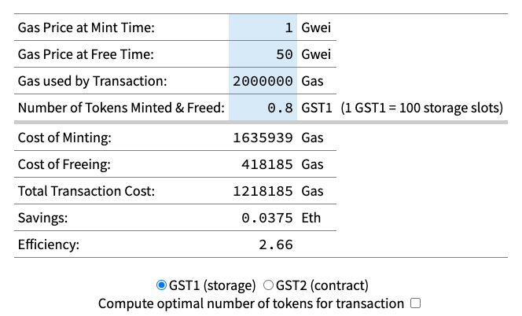
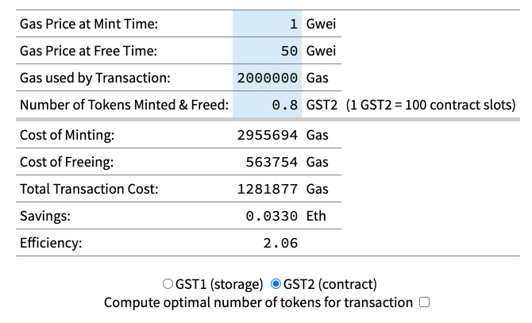
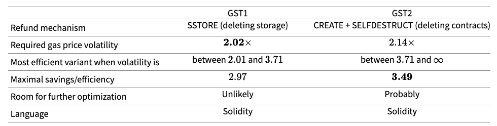
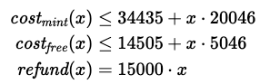
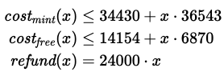
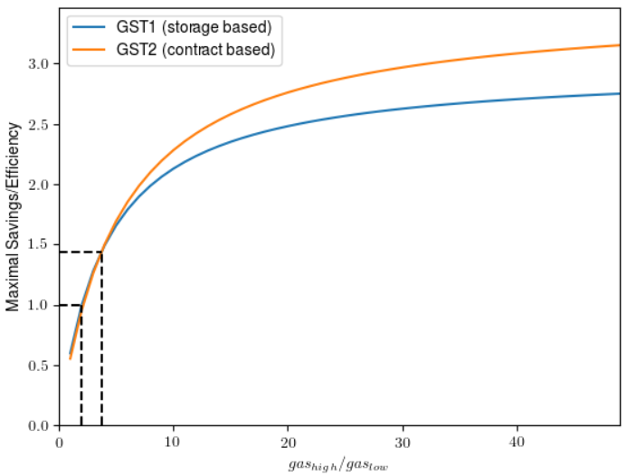

# Gastoken
GasToken 是一种新的、尖端的以太坊合约,它允许用户在以太坊网络上标记 gas，在便宜的时候存储 gas，在昂贵的时候使用/部署这种 gas。

使用 GasToken 可以补贴交易的高油价，以完成从去中心化交易所套利到早期购买 ICO 的所有事情。GasToken 也是以太坊网络上第一个允许用户直接买卖天然气的合约，实现天然气的长期 “银行化”，帮助用户免受天然气价格上涨的影响。

## GasToken 是如何起源的？
GasToken 最初创建于 2017 年 9 月，当时我们正在调查两个问题：

- 抢先交易对易受其影响的去中心化交易所有什么影响
- 区块链资源应该如何进行理想的定价

GasToken 的大部分预发布供应是由 GasToken 的上级组织 The Initiative for Cryptocurrencies and Contracts 创建的。IC3 持有用于研究和网络使用的 GasToken 供应，并在研究项目中积极使用 GasToken。以上 GasToken 作者在发布时均未持有任何个人 GasToken。GasToken 是总部位于芝加哥项目 IC3 的更广泛计划的一部分用于研究加密商品。

我们认为，从经济上讲，所有区块链都可以看作是一组以数字资源（计算、网络带宽和延迟、存储）为后盾的虚拟资源（区块空间、UTXO 空间）和物理成本（权力）的双面市场。 空间和资本）。因此，芝加哥项目旨在了解如何为这些资源定价、错误定价的后果以及可以围绕这些资源创建用于价格发现的新一代金融工具等问题。

这包括对比特币区块和 UTXO 空间以及以太坊状态和区块空间的基于预言机和协议内期货的研究，以及对涵盖网络资源的潜在工具的严格研究。它还包括对 GasToken 等有趣技术的探索，这只是由于以太坊等区块链上基于分布式信任的加密经济机制的怪癖才成为可能。[芝加哥项目是一个学术项目](https://github.com/projectchicago)，旨在发布出版物、博客文章和代码，以促进对分散资源定价的更好理解。

## 什么是 Gas？
Gas 是以太坊网络中的基本资源。网络上的每笔交易都必须包含一些 gas，每笔交易支付给矿工的费用与交易消耗的 gas 成正比。GasToken 允许交易完成相同的工作量并支付更少的 gas，从而节省矿工费用和成本，并允许用户在不支付相应更高费用的情况下投标更高的 gas 价格。在符合条件的交易中使用 GasToken，可以在以太坊网络上省钱

## 为什么？
以太坊的汽油价格很难预测；在非高峰时段，它们可以便宜到 1 gwei 或更少，而一些交易需要支付数百 gwei 才能购买那个高回报的 ICO 或在任何其他玩家之前在 EtherDelta 上下订单。需要快速挖矿或首次挖矿的用户经常参与激烈的竞价战。在竞价战中，使用 GasToken 提供了巨大的优势，让您在花费更少的 gas 的情况下执行相同的交易。

使这种影响更加复杂的是，以太坊区块开始[填满](https://www.etherchain.org/charts/averageBlockUtilization)，使得区块空间越来越令人垂涎。

## 如何？
GasToken 的工作原理是利用以太坊中的存储退款。为了鼓励合约删除存储变量（所有节点都必须永久存储！），当存储元素被删除时，以太坊提供退款。这笔退款最多可以支付合约交易使用的 gas 的一半（简单发送不符合退款条件，因为它们已经使用了最低数量的 gas；但是，批量发送到合约可以从 GasToken 中受益）。

GasToken 的工作方式很简单：

- 当 gas 价格较低时，您创建（或mint) GasToken 代币,将数据保存到 GasToken 合约的存储中
- 当 gas 价格高时（在 ICO 期间，在高峰时段，无论如何），你花费（或free）GasToken 代币，将它们发送回 GasToken 合约进行销毁，释放在早期步骤中保存的数据。
- 这笔新交易现在可以获得退款，因此执行起来比不使用 GasToken 的同一交易便宜得多。

银行低价存、高价释放的一般机制之前已经提出对于矿工（遇到非完整区块的矿工有动机用存储填充交易来填充它）。GasToken 通过引入一种对存储的气体进行标记的简单方法，将这一想法扩展到所有以太坊用户（不仅仅是矿工）。GasToken 符合 ERC20 代币标准，因此允许用户之间自由交换 gas 代币。

GasToken 实际上有两种版本：

- 一种使用存储来储存 gas
- 另一种通过创建合约来储存 gas。

后者利用了删除整个合约时获得的 gas 退款。两种 GasToken 变体具有不同的效率配置文件，用户应选择更适合其用例的变体（参见：[GST1 与 GST2](https://gastoken.io/#comparison)）。

这是一个简单而强大的想法。以这种方式使用 GasToken，每笔合约交易支付的费用比以太坊网络上的任何其他人都少。

## 燃气节省计算器
这个简单的计算器可以帮助使用 GasToken。插入一些数字来表示薄荷时间的（低）gas 成本和空闲时间的（高）gas 成本。指定应该从 GasToken 节省中受益的交易的 gas 成本，并检查您可以节省多少！请注意，我们令牌的粒度以 0.01 GST1/GST2 为增量。

- GST1(storage)
	
	
- GST2(contract)

	 

## 使用 GasToken
您可以通过将此 abi 插入任何以太坊合约接口（[myetherwallet](https://myetherwallet.com/)、 Mist 、[Solidity](https://myetherwallet.com/)）来使用 GasToken 。

GST1 在 ENS 的 gst1.gastokenio.eth 上注册，部署在

[0x88d60255F917e3eb94eaE199d827DAd837fac4cB](https://etherscan.io/token/0x88d60255f917e3eb94eae199d827dad837fac4cb)

GST2 在 ENS 的 gst2.gastokenio.eth 上注册，部署在

[0x0000000000b3F879cb30FE243b4Dfee438691c04](https://etherscan.io/token/0x0000000000b3F879cb30FE243b4Dfee438691c04)。

- 创建代币（banking gas），请调用 mint 函数。
- 获得退款（deploying banked gas），请调用免费功能。

这就是它的全部内容，其余的是标准的 ERC20。

我们提供了可用于对以太坊网络上产生 GasToken 一些示例代码在[这里](https://github.com/projectchicago/gastoken/tree/master/miner)。下面我们还展示了一个简单的代码片段，用于说明如何在昂贵的交易中释放代币和使用退款。 

	我们的代码都没有经过安全审计，我们不建议在没有广泛评估的情况下将资金托付给它。
	
	pragma solidity ^0.4.18;

	contract Gastoken {
	    function free(uint256 value) public returns (bool success);
	    function freeUpTo(uint256 value) public returns (uint256 freed);
	    function freeFrom(address from, uint256 value) public returns (bool success);
	    function freeFromUpTo(address from, uint256 value) public returns (uint256 freed);
	}
	
	contract Example {
	
	    // This function consumes a lot of gas
	    function expensiveStuff() private pure {
	        /* lots of expensive stuff */
	    }
	
	    /*
	     * Frees `free' tokens from the Gastoken at address `gas_token'.
	     * The freed tokens belong to this Example contract. The gas refund can pay
	     * for up to half of the gas cost of the total transaction in which this 
	     * call occurs.
	     */
	    function burnGasAndFree(address gas_token, uint256 free) public {
	        require(Gastoken(gas_token).free(free));
	        expensiveStuff();
	    }
	
	    /*
	     * Frees `free' tokens from the Gastoken at address `gas_token'.
	     * The freed tokens belong to the sender. The sender must have previously 
	     * allowed this Example contract to free up to `free' tokens on its behalf
	     * (i.e., `allowance(msg.sender, this)' should be at least `free').
	     * The gas refund can pay for up to half of the gas cost of the total 
	     * transaction in which this call occurs.
	     */
	    function burnGasAndFreeFrom(address gas_token, uint256 free) public {
	        require(Gastoken(gas_token).freeFrom(msg.sender, free));
	        expensiveStuff();
	    }
	}
## GST1 与 GST2 不同
GasToken 的两个版本（GST1 和 GST2）有何不同？下面我们比较最显着的特征。有关如何获得这些值的更多详细信息，请参见 下一节。

天然气价格波动率是高天然气价格和低天然气价格之间的比率（例如，如果价格从 1 gwei 到 100 gwei，波动率为 100×）。效率是用于铸币和免费代币的以太币数量与通过 gas 退款节省的以太币数量之间的比率。

 

由于 我们在处理 GasToken 时发现 Solidity [编译器中的错误](https://github.com/ethereum/solidity/issues/2999)，在极少数情况下，释放 GST2 令牌可能不会产生 gas 退款。幸运的是，有一个简单的解决方法：当你使用 `call free`、`freeFrom`、`freeUpTo` 或者 `freeFromUpTo` 释放 n 个token时，确保调用至少有 
	
	25710+n⋅(1148+5722+150)
的可用气体。 

[此示例合约](https://github.com/projectchicago/gastoken/blob/master/contract/gst2_free_example.sol)说明了如何检查此条件是否成立。GST2 源代码中的注释包含更多详细信息。

## 细节
一个明显的问题是用户何时在自己的交易中使用 GasToken 是有效的。忍受我们这里的一点数学。如果您只是想看结果请[使用计算器](https://gastoken.io/#calculator)。

编写永久的区块链状态需要花费大量的 gas。例如，

- SSTORE 当向存储写入非零值时，指令当前需要 20000 gas
- 擦除存储（通过用零覆盖它）需要额外支付 5000 gas
- 但也提供 15000 gas 的退款

假设我们在 gas 价格低的时候获取并在 gas 价格高时兑换代币以获得退款

我们存储字的总费用是：

	20000/gas(low)+5000/gas(high)
 收到退款

	15000/gas(high)
	
我们可以期待任何时候节省 

	gas(high) > 2* gas(low)

.也就是说，如果天然气价格在低使用期和高使用期之间至少翻倍，则可以有效地使用存储退款。此外，在最好的情况下，我们可以预期节省/效率高达 3 倍。也就是说，如果我们假设创建 GasToken 是“免费的”（或 gas(low) 远远低于 gas(high)，那么我们基本上是在付 
5000 gas 得到 15000 gas 作为回报。

基于合同的退款的动态原则。创建一个新合约需要花费 32000 gas，而 CALL 接下来的合约需要 `SELFDESTRUCT` 花费 700+5000 gas 并退款 24000。因此，当

	gas(high) > 1.75* gas(low)
并且最大可能的节省/效率是 4.2倍。这忽略了一些固有的隐藏成本（例如创建合约的每字节支付 200 gas），因此实际上这个数字要低一些。

事实上，我们的 GasToken 代币实现并没有完全达到这些理论上的最佳数字，因为还有一些额外的工作要做来跟踪要创建和删除的合约的存储词或地址。关于我们如何优化基于合约的 GasToken 变体的 gas 成本的一些[细节](https://gastoken.io/#GST2)。幸运的是，许多发生的成本大多是独立的在单笔交易中铸造或赎回的代币数量。也就是说，我们在单次交易中创建或释放的代币越多，我们就越接近最佳 gas 退款。请记住，gas 退款最多只能支付交易 gas 成本的一半，因此只有在我们计划开始花费大量 gas 时，释放更多代币才值得。

对于这两种 GasToken 变体，我们可以给出非常严格的铸造和释放成本的线性上限 X Token 。

- 对于基于存储的 GasToken (GST1)，最多为交易 gas 成本的一半

	 

	成本大致分解如下。
	
	- 在铸造代币时，我们支付交易基本费用（24000 gas），并且为了记账目的更新两个存储字（大约 10000 gas，假设我们的余额不为零）。写入合约存储的每个字大约需要额外花费 20000 gas。
	- 在释放代币时，我们将从我们希望节省 gas 费用的交易中调用我们的 GasToken 代币。所以我们在这里忽略基本费用。对于大量释放的存储字 X，我们接近 

		- `cost(铸币费用) ≈ x * 20046`
		- `cost(释放费用) ≈ x* 5046`

		这非常接近理论最优（我们可能会在任何时候开始节省交易费用） 

			gas(high) ≥ 2.02* gas(low)
		和	
			
			`cost(x) ≈ x* 5046`
		，并接近节省 
			
			15000/5046=2.97
		
		当以极不稳定的 gas 价格释放大量存储字时。

- 对于基于合约的 GasToken (GST2)，最多为交易 gas 成本的一半

	 	
	
	成本大致分解如下。
	
	这个变体有更多的开销，主要是由于计算要创建/删除的合约的地址。大批量创建和删除 token 时，这个 token 可以高效

		gas(high) ≥ 2.14* gas(low)
 	这比我们使用存储版本得到的略差。但是，节省的成本可能高达

		24000/6870=3.49
	在这种情况下，由于删除合同时获得的退款更高。当气体变化变得足够大时（当 gas(high) 超过 3.71 倍或 更高时)，基于合同的变体实际上变得更加可行。上述基于合约的方案的上限也不是很严格，因此在实践中，我们最终可能会比我们预期的节省更多！

	
	
	该图显示了随着 gas 价格波动的增加（假设我们释放了大量代币），使用任一 GasToken 变体可以实现的最大可能节省/效率。有一个小的制度（在虚线之间），其中存储方案具有正效率并且优于合同方案。对于大的波动，基于合约的方案总是更好。 

## GST2 优化
在 mint(x) 调用时，GasToken 的 GST2 变体创建 X 子合同。子合约的代码应该尽可能小，因为调用 `CREATE`. 每个子合约实现以下简单功能：

	  if (msg.sender == GST2.address) {
	  	SELFDESTRUCT(msg.sender);
	  }
需要进行地址检查以确保只有 GasToken 合约才能删除这些子合约。我们提出的最简洁的 EVM 代码是

	PUSH15 0xb3f879cb30fe243b4dfee438691c04
	            CALLER
	            XOR
	            PC
	            JUMPI
	            CALLER
	            SELFDESTRUCT	
我们的 GST2 GasToken 地址 [0x0000000000b3F879cb30FE243b4Dfee438691c04](https://etherscan.io/token/0x0000000000b3F879cb30FE243b4Dfee438691c04) 是硬编码的。请注意，此地址非常短（只有 15 个非零字节而不是 20 个）。我们故意在这样的地址生成我们的 GasToken 合约，以便在创建合约时节省一些 gas。上面的子合约使用了 22 字节的代码，因此成本大约为 

	32000+22⋅200=36400 要创建的gas（调用的额外开销mint只有大约150gas）。
如果我们可以使用 0x0GasToken 的地址，我们可以为每个创建的合约节省 3000 左右的 gas！

### 我们如何创建这么短的地址？
- 以太坊新创建的合同的地址被定义为 `KECCAK256(RLP_ENCODE([addr, nonce]))` 
	-  `RLP_ENCODE` 是以太坊的 [RLP 编码](https://github.com/ethereum/wiki/wiki/RLP)，并且 `KECCAK256` 是使用的标准散列函数。
	- 其中 `addr` 是父合同或帐户的地址，
	- `nonce` 是获取在每个合同创建递增的计数器

为了在短地址创建合约，

- 我们迭代公钥值和小的随机数，直到找到一个有效的对。
- 然后，我们使用该公钥创建了一个帐户，并生成了一些合约以获取 `nonce`正确的值。

请注意，要获得散列前导零字节，你需要通过  2的8k次方平均对或在我们的例子中大约有 1 万亿对。幸运的是，此搜索可以离线/离线执行，并且只需执行一次。GasToken GST2 现已部署，不用担心！

顺便说一句，我们最近意识到以太坊名称服务注册器合约部署在地址 [0x314159265dd8dbb310642f98f50c066173c1259b](https://etherscan.io/token/0x314159265dd8dbb310642f98f50c066173c1259b) 上，其中前导 4.5 字节编码 π。 如果您知道以太坊中更“稀有”的地址（即具有超过 5 个字节的可识别模式），请告诉我们！

最后，在发布代币时，我们的 GasToken 合约必须找出创建子代的地址（将这些地址保存在存储中会很昂贵，因此我们会即时重新计算它们）。这需要 `RLP_ENCODE([addr, nonce])` 在 Solidity 中实现该功能。我们目前的实施成本约为 `500-1000 gas`，价值 `nonce` 高达数十亿。这可能会得到改进，更高效的 `RLP` 实现可能会导致稍微更好的 `GasToken` 变体。

## 问题
- 你的合同安全吗？

	也许。

	我们是一个由经验丰富的 Solidity 开发人员组成的团队，他们对以太坊虚拟机有着深入的了解。我们已经盯着代码看了很长时间，没有看到任何明显的漏洞。我们的合同经过了全面测试，包括单元测试和实时网络部署。话虽如此，没有或将要委托进行独立审计。我们鼓励您阅读代码并自行决定它是否安全；这很简单！

	我们免费提供此软件。没有保修。我们对 GasToken 智能合约中的错误、漏洞或任何其他技术缺陷不承担任何责任。使用它们后果自负。
	
- 您的合同是投资工具/证券/金融产品吗？

	不。我们绝对不承诺关于 GasToken 的任何市场属性的任何回报、利润或其他实质性陈述。GasToken 不基于任何货币、资产或其他金融产品。GasToken 不代表共享企业，我们鼓励我们的用户期待其开发者的 0 进一步努力。不可能使用任何形式的货币、数字或其他方式直接获得 GasToken。

	此外，由于开发人员是活跃的以太坊研究人员，GasToken 利用了平台非最终经济模型的机制细节，GasToken 的开发人员极有可能会倡导对网络进行更改，从而使 GasToken 无法使用、不可赎回、不可替代和/或毫无价值，所以用户要当心。
- 这对网络不好吗？

	当然有一些明显的负面影响。例如，正如对这种套利的原始分析所指出的那样，GasToken 确实对共享的网络存储公地施加了大量的外部性。我们认为，这个问题比退款机制中的缺陷更为根本：鉴于其市场价值，区块链网络中的存储、网络和其他基于公共资源的资源可能被严重低估。这意味着对这些资源的任何价格发现机制，包括 GasToken，都有可能大幅增加这些资源的成本，给生态系统参与者带来负面的用户体验。

	此外，GasToken 也不是一个完美高效的机制。GasToken 的广泛使用可能会浪费大量的区块空间，推高 Gas 价格，进而推高 GasToken 的使用，这有可能成为一个正反馈循环。在这种循环的严重情况下，GasToken 的作者很可能会主张取消合约清算或存储清算退款，从而消除 GasToken 的市场价值。

	然而，GasToken 也是网络的一项积极技术，它为用户提供 Gas 银行服务，并相应地提供一种帮助 Gas 价格发现的机制。GasToken 还可以帮助用户和企业抵御网络天然气价格上涨的影响，确保他们即使在敌对的天然气市场中也能够执行预期的交易。在比特币中，这种技术可能会改善许多依赖于区块链的服务的用户体验。

	GasToken 可以被视为以太坊 gas 模型中的一种经济利用。虽然我们不认为这是零日漏洞（自 2015 年以来就已经知道基本套利模式）或信息安全漏洞，但我们已采取措施负责任地通知以太坊基金会我们研究此问题的意图以及我们在区块链上的行动提前几个月发布此版本。
- 这对矿工来说不是坏事吗？

	执行包含大量 gas 退款的交易的矿工可能只获得相同交易费用的一半而无需退款。尽管如此，GasToken 也有助于稳定天然气价格，从而减少矿工奖励的可变性。
- [Metropolis / EIP87 / whatever] 不会使这个方案无效吗？

	以太坊社区完全有可能在某个时候决定以一种使 GasToken 无法运行的方式改变共识规则。我们对任何此类事件不承担任何责任。

	EIP87 提出了一个区块链租金的概念，其中合约必须不断地支付费用来保存价值。保留 gas 退款的租金提案仍然与 GasToken 兼容。例如，如果支付的短期存储租金低于以较低成本从银行 gas 中获得的效率收益，则 GasToken 仍然有用（因此，任何时候都存在不可预测的高波动 gas 市场）。

	此外，即使采用不可退还的仓储租赁方案，也应保留取消空合同的激励措施。为合同本身引入租赁计划可能是有害的（即，如果不支付租金，没有仓储的合同就会消失），因此 GST2 或它的某些变体可能仍然有用。
- [分片/PoS/等离子/其他] 不会使这个方案无效吗？

	部分。即使以太坊设法将区块链有效地扩展到承诺的较低交易价格，gas 价格的波动也是可能的，而 GasToken 很有用。话虽如此，如果网络继续扩展并保持低油价，长期持有 GasToken 在经济上显然是不可行的。此外，由于上述扩展策略对以太坊资源模型的更改可能会直接导致 GasToken 无法操作或无利可图，例如通过更改 GasToken 所利用的退款规则。
- 以太坊经典呢？

	当然，我们支持以太坊的所有衍生品。我们的 GST1 和 GST2 合约分别部署在 ETC 上的 [0x88d60255F917e3eb94eaE199d827DAd837fac4cB ](http://gastracker.io/contract/0x88d60255F917e3eb94eaE199d827DAd837fac4cB)和[0x0000000000b3F879cb30FE243b4Dfee438691c04](http://gastracker.io/contract/0x0000000000b3F879cb30FE243b4Dfee438691c04)。

	部署在经典以太坊的GST2合同包含了一些细微的差别，在以太坊的版本相比，现场（我们增加了对密实度的编译器的bug修复描述 上面，还有一些额外的制衡的mint功能）。我们部署的确切代码可以在[这里](https://github.com/projectchicago/gastoken/blob/master/contract/GST2_ETC.sol)找到。
	              		
## 参考
- [gastoken](https://gastoken.io/)
- [gastoken](https://github.com/projectchicago/gastoken)