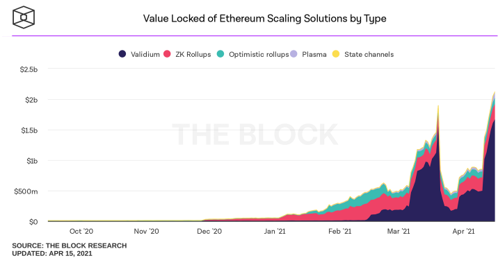

# 可以在第 2 层上做的 7 件事
Optimism、ZK-Rollups、Starkware……有越来越多的第 2 层选项可以帮助您在不牺牲以太坊基础层的安全保证的情况下实现无银行化。

已经有数十亿美元锁定在以太坊 L2 上，并且他们每天都被加密货币本地人使用，他们获得更快的交易、更便宜的费用并节省了大量的汽油。

	提醒一下：就像这个新领域的一切一样，现在还为时过早。在这些解决方案面向全世界推广之前，需要做很多工作。
现在是我们开始探索第 2 层的时候了——它就在这里，而且显示出前景。

[Dharma](https://bankless.cc/dharma) 完全重新设计的钱包。一键从[美元到 DeFi](https://bankless.cc/dharma)。从您的美国银行账户直接存款到 14% 收益率。只需轻轻一按！获取佛法应用程序！

## 正题
以太坊是全球开放应用的首要基础设施。不幸的是，由于以太坊的独特权衡，在高需求时期使用不断发展的网络可能既昂贵又缓慢——毕竟只有这么多的块空间可供使用。 

也就是说，以太坊最终将通过 Eth2 在基础层上进行扩展，这将大大提高其交易吞吐量。好消息是我们不必等待 Eth2 扩展。

直接的答案是第 2 层 (L2) 扩展解决方案。 

第 2 层解决方案建立在以太坊之上（链下以减轻主链上的拥堵），但直接依赖于以太坊的安全性和最终性来提供近乎即时且价格合理的以太坊交易——即转账、交易或抵押代币等。 

这些 L2 系统也不仅仅是理论化的。多个 L2 解决方案已经上线，现在似乎每天都有新的 L2 项目和集成出现。在撰写本文时，有超过 3 亿美元的加密货币由两个统治 L2 模型保护：

- ZK Rollups
- Optimistic Rollups

L2 扩展解决方案的时代已经到来，而且才刚刚开始。如果您是先锋类型，那么现在是尝试我们今天可用的一些最佳 L2 可能性的绝佳时机。所以你可能会问：目前有哪些顶级 L2 服务？

## 第一件事 使用 Aave 在多边形上借贷 
今年早些时候，Matic 一个围绕 Matic Plasma 链和 Matic PoS 侧链开创性工作的扩展项目——[更名为 Polygon](https://polygontech.medium.com/matic-network-becomes-polygon-ethereums-internet-of-blockchains-expands-mission-and-tech-scope-364932c02cd0)，作为成为“以太坊区块链互联网”的支点的一部分。

作为品牌重塑的一部分，团队现在将采用乐观汇总、ZK 汇总等。 

不久之后，流行的 DeFi 借贷协议 Aave 宣布了 New Frontiers，该活动将使该项目采用一系列扩展解决方案，以便其用户可以享受选择。在同一份公告中，Aave 透露，扩容活动的[第一次整合](https://medium.com/aave/exploring-new-frontiers-with-aave-59563ddd2405)将是与 Polygon 的 PoS 侧链。 

重要的是要强调这个侧链不像大多数 L2 那样直接继承以太坊的安全保证，但它确实提供了类似 L2 的吞吐量能力。从 New Frontier 活动来看，Aave 和 Polygon 很有可能在未来的汇总集成方面进一步协调。 

与此同时，您可以在 Polygon 侧链上廉价地处理您的 Aave 借贷。

- 首先，[确保 Polygon 网络已添加到您的 MetaMask 钱包](https://docs.matic.network/docs/develop/metamask/config-matic)
- 然后前往 [Aave](https://app.aave.com/markets) 并单击“Polygon”市场选项卡以查看可用的市场机会。 

## 第二件事 交易去中心化永续合约
[dYdX](https://trade.dydx.exchange/r/bankless) 是一个去中心化交易所，简称 DEX，通过在以太坊上提供去中心化保证金、现货和永续合约交易而闻名。 

不过，交易者希望尽可能快速且经济地进行交易。幸运的是，dYdX 刚刚宣布推出由 StarkWare 的 StarkEx 可扩展性引擎提供的 [L2 永久交易](https://dydx.exchange/blog/public)。 

StarkEx 非常强大且灵活，能够通过 ZK 汇总支持链上数据可用性或通过 Validium 支持链下数据。无论你想如何切片，引擎都将围绕 dYdX 永续交易的用户体验提升到一个新的水平。已经存在于 DEX 的 L2 集成中的永久产品包括：

- ETH-USD
- BTC-USD
- LINK-USD
- Unit-USD
- AAVE-USD

因此，如果衍生品适合您，请考虑前往 dYdX 的 Perpetuals 仪表板。在那里，您可以轻松地存入 DEX 的 L2 系统并开始交易！

- [dYdX 如何交易](https://newsletter.banklesshq.com/p/how-to-trade-on-the-dydx-rollup)  
- [dYdX 扩展 Defi](https://shows.banklesshq.com/p/sotn-41-scaling-defi-with-dydx-and)

## 第三件事 获得 [SNX Staking](https://synthetix.exchange/#/) 奖励 
Synthetix 是 DeFi 的领先衍生品项目。如果资产存在，无论是在任何区块链上还是在现实世界中，都可以通过 Synthetix 作为链上合成物进行交易。 

这个强大协议的核心是质押，用户将 Synthetix 的原生代币 (SNX) 提供给协议以获取抵押品。作为这项服务的交换，SNX 质押者可以获得通货膨胀的 SNX 奖励以及交易费用。这是 SNX 背后的核心激励！

很酷的东西？您现在可以在 L2 上处理您的 SNX 质押！2021 年初，SNX 质押在 Optimism 团队同名的 Optimistic Ethereum (OΞ) L2 上上线，顾名思义，它以乐观汇总技术为基础。 

如果这种新颖的质押方式激起了您的兴趣，您可以使用官方 Synthetix 质押[仪表板](https://staking.synthetix.io/)通过 OΞ 迁移和质押您的 SNX 。Synthetix 和 OΞ 还为时尚早——交易合成器和其他核心协议功能仍然需要集成。

此外，他们面临大约 7 天的停顿期。换句话说，不要存入任何您等不及一周才能访问的东西！

现在还为时过早，但成为 DeFi 狂野西部的先驱是值得的！

- [在第二层上构建 Defi](https://shows.banklesshq.com/p/-building-defi-on-layer-2-synthetix)

## 第四件事 Yield Farm LRC 奖励 
自去年夏天这种现象出现以来，产量农业一直在 DeFi 中风靡一时。想法？您提供流动性，从而帮助引导年轻项目以换取代币奖励（即收益）

然而，当事情变得拥挤时，以太坊上的产量农业可能会很昂贵。所有的批准、存款、抵押和取款交易都可以快速加起来！

一个典型的例子是 Loopring 公司目前的 L2 产量农场。Loopring 是一种由 ZK-Rollup 技术提供支持的交换和支付协议，该项目的构建者创建了 Loopring Exchange，为用户提供具有 L2 优势的自动化做市商 (AMM) 体验。

由于 AMM 依赖流动性才能蓬勃发展，Loopring 目前持有[流动性挖矿轮次](https://loopring.org/#/post/loopring-l2-liquidity-mining-round-5)以吸引流动性提供者。Loopring LP 的任何人都可以相应地获得以项目的原生代币 LRC 计价的奖励。 

如果您对 L2 扩展的未来大肆宣传，并认为 Loopring 可以在未来发挥重要作用，那么这些 LRC 农场肯定是值得考虑的。您可以首先导航到 [Loopring](https://loopring.org/#/)，存入他们的 L2 钱包，然后将资产存入您选择的池中！

- [如何在 Loopring 上避免 gas 费](https://newsletter.banklesshq.com/p/how-to-avoid-gas-fees-with-loopring)
- [如何使用 Loopring Pay 即时付款](https://www.youtube.com/watch?v=mxn693L6_Ak)
- [与 Loopring 的 Matthew Finestone 进行无银行 AMA](https://www.youtube.com/watch?v=izvGYMZH2AM)

## 第五件事 在 DeversiFi 上交易 DeFi 代币
在 StarkWare 的 StarkEx 可扩展性引擎的支持下，[DeversiFi](https://www.deversifi.com/) 是一个高效、一站式的去中心化交易所，提供一系列服务，包括去中心化限价订单、场外交易和免费转账。

这自然使 dapp 非常适合交易流行的 DeFi 代币，如 UNI、MKR 和 AAVE。

当然，前面提到的 Loopring AMM 也可以用来交易 DeFi 代币，所以这不仅仅是 DeversiFi 的领域。

高级交易者可能会喜欢 DeversiFi，因为它提供了比标准 AMM 更多的交易功能，因此如果您正在寻找以交易为中心的 L2 应用程序，这当然值得探索。 
## 第六件事 在 Gitcoin 上向以太坊项目捐款 
通过开源软件 (OSS) 构建者的辛勤工作，我们对以太坊和 DeFi 的了解和喜爱如此之多。这就是为什么加密经济中的一颗冉冉升起的新星是 Gitcoin，这个平台让 OSS 创作者比以往任何时候都更容易在以太坊、DeFi 等领域获得报酬。 

Gitcoin 以其 Gitcoin Grants 轮次而闻名，其中项目众包筹款并从二次融资 (QF) 和匹配捐赠中受益。然而值得注意的是，项目可以随时通过 Gitcoin 接收捐赠，而令人敬畏的是该平台最近集成了对 zkSync 的支持，因此用户可以随时通过 L2 捐赠进行储蓄。 

这个过程很简单。将一个或多个项目添加到您的购物车，去结帐，然后选择 “使用 zkSync 结帐” 选项。此时，您将被带到一个仪表板，您可以在其中将资金存入  L2。从那里，您可以在支持以太坊生态系统的同时享受巨大的天然气节省。

不出所料，该功能已经证明非常受欢迎。例如，在最新的 Gitcoin Grants 第 9 轮中，超过 80% 的捐赠都是由 zkSync 促成的

-  [NFT 在 Gitcoin Grants 第 9 轮中大放异彩](https://metaversal.banklesshq.com/p/nfts-shine-in-gr9)

## 第七件事 在 Superfluid 上流钱
Superfluid 是一种资金流协议。它让任何人都可以打开一个实时汇款的支付流。该协议利用了两种不同的扩展解决方案

- xDAI
- Polygon

因此用户可以根据您喜欢的风格进行选择。

如果您曾经梦想过 DAO 可以处理多个传入的价值流并用这些流的一部分或 NFT 奖励他们的贡献者，这些流或 NFT 代表音乐权利，每秒钟向 NFT 持有者支付版税，那么 Superfluid 就是它的应用程序.

Superfluid 的酷炫之处在于流不会被锁定。他们仍然可以在帐户之间自由移动！

您可以根据需要对流进行切片和切块——这意味着如果您收到令牌流，您可以选择任意数量将其转发给另一个接收者，接收者也可以。这有效地创建了一个相互关联的钱包网络，实时交换价值！ 

它是可编程货币 2.0 和实时金融的诞生以及加密原住民一直梦寐以求的应用程序。并且只有因为第 2 层才有可能！

- [如何创建流](https://newsletter.banklesshq.com/p/how-to-stream-money)

## 结论
L2 活动的黄金时代才刚刚开始。随着顶级 L2 解决方案继续快速创新、迭代并提供项目想要使用的强大且可行的解决方案，生态系统将从这里进一步发展。

zkSync 团队刚刚发布了[zkPorter](https://twitter.com/zksync/status/1381955843428605958)，这是一个前所未有的扩展系统，在未来几年内很有可能成为以太坊生态系统中首选的扩展架构。

你还有一些主要的以太坊应用程序，比如 Uniswap，它们现在随时都在推出他们的旗舰 L2 集成。

再加上所有可用性解决方案，如 Connext 的 Vector，它可以作为以太坊及其所有 L2 的连接器中心，很明显，扩展问题很快就会成为过去。 

以太坊正在扩展，并且今天正在这样做。

