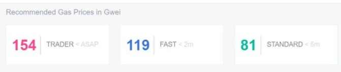
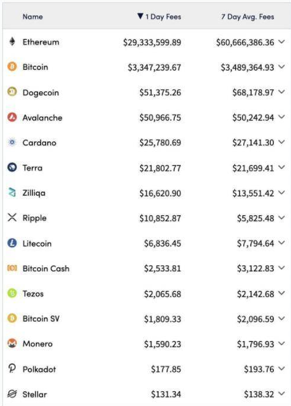
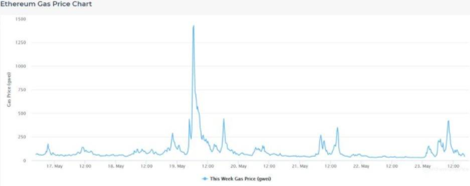

# 以太坊手续费太高怎么办？这 6 种策略教你如何节省 Gas
## 以太坊 Gas
Gas 是以太坊的一个基本组件。简单地说，它是用户为在以太坊网络上执行活动时需要支付的 ETH 数量。

从更技术的层面上来说，Gas 是一种计量单位，用于追踪以太坊上执行特定操作的计算成本，这些操作包括发送 ETH、交易 DeFi 代币、铸造 NFT 或部署智能合约等等。Gas 费用在帮助以太坊有效运行方面发挥了重要作用，因为 ETH 交易 TPS 极度有限，使用 Gas 费可以防止垃圾交易(交易攻击)，并作为报酬支付给保护以太坊网络的矿工 (随着 Eth2 的合并，矿工很快将由 ETH 质押者取代)。

Gas 是以太坊上获取去中心化计算的方式，它也是使这种计算成为可能的部分原因。

Gas 以 Gwei 计价

	1 Gwei = 0.000000001 ETH(小数点后 8 个 0)。

如果你听到有人说「现在的 Gas 是 50」，他的意思是，如果当下你想要在以太坊上成功地完成一笔交易，预期的 Gas 价格是 50 Gwei(也即 1 单位 Gas 的价格是 50 Gwei，也即 0.00000005 ETH)。

但这并不意味着你可以简单地用 50 乘以 0.000000001 ETH 来计算你要支付的 Gas 费。这就是以太坊的 Gas Limit 开始起作用的时候了。

撰文时以太坊的 Gas Limit (即 Gas 限制) 是 1500 万 Gas，这是单个以太坊区块中可以使用多少 Gas 数量的上限 (也即是说，单个以太坊区块中包含的所有交易的 Gas 量加起来不能超过 1500 万)。

对于不同类型的单笔交易也有一个 Gas Limit，比如一笔基本的 ETH 转账的 Gas Limit 是 21000 Gas(当然，其他更加复杂的操作 所需的 Gas 量要更多)。

因此，要计算某个以太坊操作所要支付的 Gas 费用，我们只需要将这笔交易的 Gas Limit 乘以当前每个 Gas 的价格即可。

比如，如果当前每个单位的 Gas 价格是 50 Gwei，而一笔简单的 ETH 转账的 Gas Limit 是 21000 个 Gas，那么这笔交易的 Gas 费用 = 21000 * 50 * 0.000000001 ETH =0.00105 ETH。

## 最近 Gas 为什么这么贵？
用户必须支付 ETH(Gas 费) 才能使用以太坊的计算力和存储空间。随着 DeFi 和 NFTs 的兴起，以太坊变得越来越有价值，因为最近对区块空间的需求激增，交易数量也是激增

	5 月 18 日各大区块链网络过去 24 小时的交易费 (第二列) 和过去 7 天的平均日交易费 (第三列)

其结果是，Gas 价格飙升到了疯狂的水平。 因为以太坊的交易 tps 有限，无法同时处理所有申请交易，所以 Gas 价格是由需求决定的，这是一个类似于拍卖的过程的结果，在这个过程中，用户根据自己的意愿「出价」(即设置 Gas 费用)，然后矿工根据用户的出价高低对交易进行排序和打包进区块中。

因此，支付更高的 Gas 费可以让你有更大的机会使你的交易被快速处理，所以在大量用户试图同时获取以太坊区块空间的时，Gas 价格会随着人们提高「出价」(以使自己的交易尽快被处理)而上涨。

以太坊区块现在一直是满块！这是人们对区块空间需求增长的结果。

按区块空间收费的系统是使 [ETH 具有类似商品属性行为的原因](https://twitter.com/RyanSAdams/status/1325791168802729984)

ETH 的价值正确模型是

1. 货币资产（用于存储价值时）
2. 商品（用于支付区块时） 
3. 资本资产（当抵押时） 物质转移到 gas, liquid, & solid 

ETH 转向货币、商品和资本

## 如何在以太坊上节省 Gas 费用？
使用以太坊和尝试一下以太坊应用层上面的 Dapps (去中心化应用)，也许是你现在可以做的最富有成效的事情。

然而，由于最近以太坊的需求如此之高，Gas 费用很昂贵，很多人都被高昂的价格吓跑了。

那好消息是以太坊目前正在构建并向扩展性解决方案过渡，所以昂贵的 Gas 价格并不是什么无限期的担忧。但是在以太坊仍处于当前的过渡期之际，高昂的 Gas 费用是一个当务之急。

此外，现在有一系列的策略和技术可以大大减少你的 Gas 支出。只要做一些研究和工作，那么当你想要使用以太坊网络时，你便可以快速学会明智地支付 Gas，不再花费过多的 ETH。

### 方法1 优化交易时间
根据以太坊链上发生的事情的不同，以及世界不同地区的人们醒来和活跃的时间不同，以太坊的 Gas 价格在日内可能会出现大幅波动。

	5 月 17 日至 23 日的以太坊 Gas 价格日内波动情况，可以看出以太坊的 Gas 价格在日内波动很大

因此，在某些时候，平均而言 Gas 价格通常较低。如果你对这些时间进行盘点，并将它们作为交易时间，这将是降低 Gas 费用的一个很好的开始。那么，什么时候是交易的最佳时间？

一般来说，Gas 价格在工作日比较高，在周六和周日比较低，所以一个简单的办法就是在周末开始批量处理你的交易。

 Paxful 最近的一份[报告](https://paxful.com/blog/ethereum-gas-price-explained/)给出了如下结论：

 ***(以太坊网络) 最繁忙的时间，也因此是 (Gas 费用) 最昂贵的时间，是从早上 8 点到下午 1 点 (美国东部标准时间)。这并不奇怪，因为欧洲人和美国人在这段时间都是完全清醒的，而且都在工作。相比之下，(以太坊网络) 最不忙的时间是午夜到凌晨 4 点 (美国东部标准时间)——这段时间美国人正在睡觉，欧洲人刚开始一天的工作，而亚洲人正在结束他们一天的工作。***

所以就是这样——日内在这些 (以太坊网络不繁忙的) 时间窗口期进行交易，你的 Gas 费用就很有机会比在其他时间更低

### 方法2 使用以太坊扩容解决方案进行交易
以太坊的扩容解决方案生态系统还处于早期阶段，但一些已经上线的项目令人印象深刻，而且每天都在改进。你可以使用这些解决方案享受即时和超便宜的以太坊交易！

在这个领域

- 有 `Layer2` 解决方案，它们在继承以太坊所有安全性保证的同时，提供其自身超高效的基础设施。比如
	- 基于 Optimistic Rollups 
	- ZK-Rollups 的项目
- 还有侧链，这些侧链实际上是独立的高效区块链，但专门连接和迎合以太坊网络。比如 

	- Polygon 的 PoS 链 
	- xDAI
	
在这些以太坊扩容解决方案中，你可能只会偶尔与以太坊主链交互，而是在 L2s 网络或者跨链环境中以支付得起的费用处理你的大部分加密货币活动。因此，现在是一个让你自己熟悉这些扩容解决方案的时候，虽然这些事情仍然处于早期阶段。

上个月，我写了一篇关于《你可以在 Layer 2 上做的 7 件事》的文章。如果你想深入研究，这篇文章绝对是一个很好的起点。这篇文章中介绍的活动包括：

- 通过 Polygon 在 Aave 进行借贷
- 通过 StarkEx 在 dYdX 交易永续合约
- 通过 StarkEx 在 DeversiFi 交易 DeFi 代币
- 通过 Optimism 网络赚取 SNX 质押奖励
- 通过 ZK-Rollups 在 Loopring 进行流动性挖矿
- 通过 zkSync 在 GitCoin 上进行捐款

上面提及的 Polygon、StarkEx、Optimism、ZK-rollups 和 zkSync 都是以太坊扩容解决方案

### 方法3 使用 Gas tokens
简言之，你可以在 Gas 价格低时铸造 Gas tokens，然后在 Gas 价格高时赎回，此时你可以获得一笔 ETH 退款，从而帮你补偿 Gas 费用。

Gas tokens 之所以有效，是因为以太坊的存储退款( storage refund) 机制，该机制会向删除存储变量的以太坊用户退款。这鼓励人们不让以太坊的状态膨胀。(注：以太坊上为了鼓励用户更有效地在区块链上储存数据，当你从区块链上面移除资料时，会提供退款)

因此，有了 Gas tokens，你可以在 Gas 价格较低时获取以太坊的状态快照，然后在 Gas 价格较高时解锁该状态，以获得一笔 ETH 退款。瞧！这就能实现更便宜的交易。

但 Gas tokens 实际上会阻塞以太坊的状态大小，导致低效的 Gas 定价，所以它们似乎将在未来几年被淘汰，你需要记住这一点。在此期间，它们可以降低你的 Gas 费用，所以现在不要排斥它们！

例如，一个受欢迎的 Gas token 项目是 GasToken.io。

该项目有两个略有不同的 Gas token 实现，即 GST1 和 GST2，但它们的工作原理相似。要使用这些 token 中的任何一个，你只需在 EtherScan 上导航到它们的「Contract」页面，并调用「Mint」(铸造) 和「Free」(释放) 函数。当你释放这些 tokens 的时候，你将会获得一笔 ETH 退款，这笔退款可用于补偿你的 Gas 费用！

### 方法4 使用那些最小化 Gas 费用的 Dapps
以太坊上的一些 Dapps (去中心化应用) 明确提供了 Gas 最小化的产品。

比如

- Yearn 的 V2 机枪池 (vaults) 
-  Keeper DAO 

会自动对用户的交易进行批处理，这样一来，用户无需挨个地手动支付 Gas 费用，而是可以一起支付 Gas 费用，这大大降低了每个用户支付的 Gas 费用。

另一个可以考虑使用的项目是 Balancer V2 交易协议。Balancer V2 版本使得 Balancer 现在成为了一个单一的大金库 (Vault)，这个 Vault 将保存和管理所有不同 Balancer 流动性池中的资产，这使得现在通过 Balancer 进行交易的 Gas 费用更加便宜！

使用这些显著最小化 Gas 费用的 Dapps 是节省 Gas 费用的最简单方法之一。你只需要知道哪些应用是最省 Gas 的！

### 方法5 通过 DeFi Saver 来为交易制定策略
你是否可以测试和模拟交易，而不实际执行交易，这样你就可以在支付 Gas 费用之前，了解和调整你要支付多少 Gas 费用了？

嗯，通过 DeFi Saver 全新的 Recipe Creator 及其 Simulation Mode (模拟模式) 就可以！详情 [参见](https://medium.com/defi-saver/introducing-the-defi-saver-recipe-creator-34d4c26630c)。

以下是这个过程的工作原理。你可以使用 Recipe Creator 来排列你想要的任何类型的以太坊活动，然后运行 Simulation Mode (模拟模式) 来测试这些活动，而无需支付任何 Gas 费用。

这个系统并不是一种直接节省 Gas 的方法，但它是一种调整交易的方法，有助于降低 Gas 费用

### 6 使用那些退还部分 Gas 费用的应用
以太坊上的项目知道其用户现在正忍受高昂 Gas 费用带来的痛苦。因此，一些以太坊项目正在向其用户退还部分 Gas 费用，从而弥补这种痛苦。

其中的两个项目便是 

- [Balancer](https://bankless.cc/balancer) 

	Balancer 推出了一项计划，通过 Balancer 进行交易的用户，对于一些特定的交易对，用户将获得 BAL (该项目的治理代币) 作为退还部分 Gas 费用的方式。这意味着，如果你想要进行 DeFi 交易，可以考虑通过 Balancer 来进行，因为你仅通过使用这个协议进行交易就能获得不错的 BAL 代币。
- [Furucombo](https://furucombo.app/)

	DeFi 聚合器项目 Furucombo，目前该项目正在运行一个 Gas 补偿计划，对使用该协议的用户奖励 COMBO 代币。[详情见](https://medium.com/furucombo/combo-mining-season-3-5e5f248923b2)

虽然这些是全新的计划，但到目前为止，对于各个协议来说每个计划都很成功。如果将来有更多协议采用类似的计划，也就没什么好惊讶的了！

# 总结
高昂的 Gas 价格不是一个永恒的问题。随着 Layer 2 扩展解决方案和 Eth2 的到来，Gas 价格将在未来一年大幅下降。

然而，我们目前确实必须应对高昂的 Gas 价格。所以下次你必须进行以太坊交易时，不要盲目地交易。检查一下现在是什么时间，或者你是否可以通过某个扩容解决方案来进行相同的交易，等等。通过加强对 Gas 使用方式的了解，你现在可以节省大量的 ETH！

## 参考
[6 ways to save on Ethereum gas fees](https://newsletter.banklesshq.com/p/6-ways-to-save-on-ethereum-gas-fees)