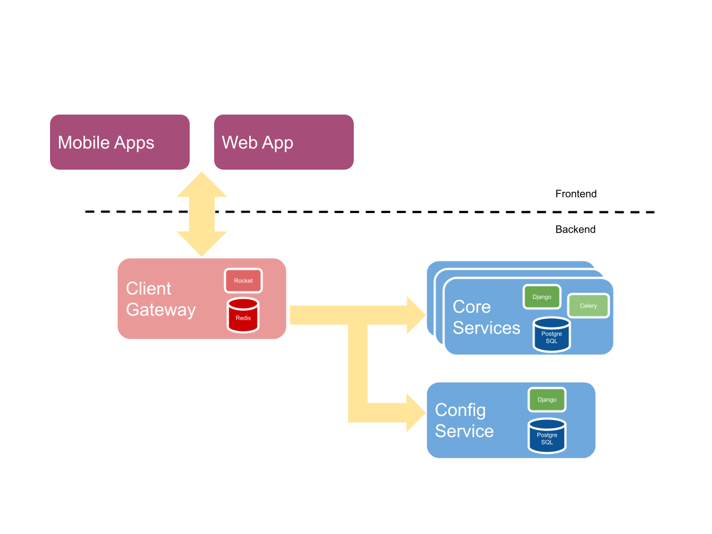
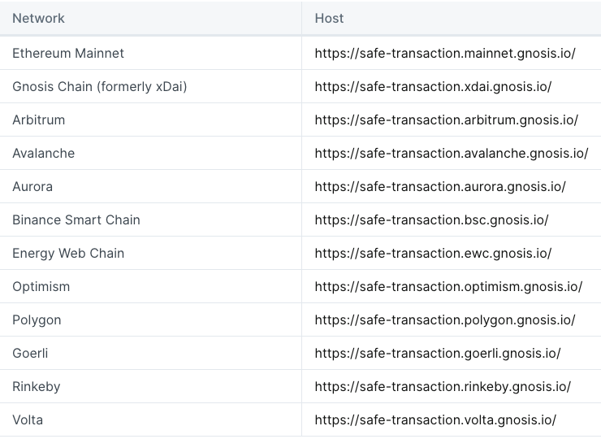

# Gnosis Safe 手册
## 介绍
您需要了解的关于智能账户的所有信息，以及如何开始使用和构建智能账户。
### 什么是智能账户(Smart Account)？
智能账户是一个完全可定制的银行账户。如果你想到你的常规银行账户或加密账户，它使用密钥来签署交易。这意味着任何拥有密钥（密码、私钥）的人都可以签署任何内容并批准从您的帐户中汇款。

	注意：智能账户也称为智能合约账户，而使用密钥签署交易的加密账户也称为外部拥有账户（EOA）或签名账户。
- 这意味着如果有人获得了您的用户名和密码，他们就可以拿走您所有的钱。
- 这也意味着，如果您忘记了密码，那么您必须使用普通银行账户进行冗长的密码重置过程，如果是加密账户，您的钱将永远消失

使用智能账户，它是完全可定制的，因此您可以创建您想要的任何类型的规则。您可以创建的最常见的规则类型是多签名者帐户。

例如，不是只有一个密码（或私钥）控制您的帐户，您可以让多人完成它。

- 您可以添加 3 个您信任的其他人（或公司！）作为您帐户的签名者。然后如果你想发送任何交易，至少有 2 个交易必须批准。
- 另一个常见的规则是设置支出限额。您可以设置一个限额，允许您提取 100 美元以下的金额，而无需其他人的批准。但是，对于更大的金额，您可能需要另外 2 个人签署并批准交易。

当您将帐户的概念从简单地使用密码或私钥来批准交易的东西更改为完全可从头开始自定义的东西时，可能性是无穷无尽的。本指南将向您展示一些可能性并为您提供使这些可能性成为现实的资源。

### 如何阅读本指南
本指南分为三个主要部分：学习、构建、发现。

- 了解智能账户的工作原理。
- 使用智能帐户构建很酷的东西。
- 通过智能账户发现其他人正在构建和使用的内容

我们建议

- 从 Learn 章开始并查看那里的一些教程以了解有关智能账户如何工作的更多信息。
- 然后，前往“Discover 探索”部分，获取有关智能账户可能实现的事物类型的一些想法和灵感。
- 然后，完成其中一个构建教程并制作一个使用智能账户的应用程序。

可以按照[生态系统图](https://viewer.diagrams.net/index.html?tags=%7B%7D&target=blank&highlight=0000ff&edit=_blank&layers=1&nav=1&page-id=atRejJyS5DeNAtDboIeV&title=Safe%20Diagrams.drawio#Uhttps%3A%2F%2Fdrive.google.com%2Fuc%3Fid%3D1WcTgdHoQttJ0K_fV8mDg-RmDZRYGe3D-%26export%3Ddownload)为示例

### 开始
生态系统图涵盖了很多工具。如果您想更简单地介绍 Safe，请从以下步骤开始：

- 用户
	- 了解什么是智能账户
	- 使用 Web 界面创建safe
		- 在您的safe中设置支出限额
	- 使用安全的应用程序
	- 查看其他人如何使用 Safe
- 开发者
	- 了解外部账户与智能合约账户
	- 从 [safe-cli](https://github.com/5afe/safe-cli) 命令行创建 Safe
	- 使用 [core-sdk](https://github.com/safe-global/safe-core-sdk) 创建 [safe](https://github.com/safe-global/safe-core-sdk/tree/main/packages/safe-core-sdk#getting-started)
	- 从 [safe hackathon 手册和获胜者列表](https://gnosis-safe.notion.site/Safe-Hackathon-Success-Guide-53d2fb3c29424b58b1c4407519a54930) 了解为什么要构建 safe

### 联系我们方法
- [Discord](https://chat.safe.global/)
- [推文](https://twitter.com/safe)
- [提出 gnosis-safe 问题](https://ethereum.stackexchange.com/questions/tagged/gnosis-safe)
- [safe Github](https://github.com/safe-global)

### 进一步阅读
- [警卫文档](https://docs.gnosis-safe.io/contracts/guards)
- [core-sdk 文档](https://docs.gnosis-safe.io/build/sdks/core-sdk)
- [模块文档](https://docs.gnosis-safe.io/build/sdks/core-sdk)

## 学习手册
### 为什么要建立在 Safe(safe) 之上？
您可能想要考虑在 Safe 的智能合约帐户标准之上构建您的应用程序的几个关键原因。总的来说在 Safe 之上构建您的应用程序可以提供一系列好处，包括

- 增强的安全性
- 改进的用户体验
- 以及更大的灵活性
- 和集成度

多重签名控制只是冰山一角，Safe 账户为新形式的保管、所有权和身份解锁了广泛的可能性。

智能合约账户可以实现新的托管形式

- 高安全性

	Safe 的多重签名功能允许您定义所有者帐户列表和确认交易所需的帐户数量阈值。一旦所有者帐户的阈值确认了交易，就可以执行安全交易。所有者可以是 EOA 或其他智能合约帐户。
- 高级执行逻辑

	可以使用不同的`安全库合约`来执行复杂的交易。一个非常常见的例子是`批量交易`，其中多个简单的以太坊交易被组合在一起并立即执行。这意味着用户不必按顺序签署多个交易，而只需签署一个批量交易。
- 高级访问管理

	您可以将`安全模块`添加到您的 safe 中。从而可以实现更细粒度的访问管理。例如，
	
	- 可以定义一个只能用于在特定情况下`恢复对 Safe 的访问的模块`。
	- 一个流行的版本是`社会恢复模块`。
	- 一个不同的例子是`许可模块`，它允许 safe 的所有者授予有限的执行权限，例如对外部帐户的每日限制。
- Token 回调支持

	许多新 Token 需要钱包合约来实现回调。ERC721 和 ERC1155 等 Token 标准允许合约对通过这些接收 Token 立即做出反应，甚至可以完全拒绝转移。
- 无以太账户

	Safe 的另一个核心功能是 Token 支付。通常，以太坊交易需要 ETH 支付交易费用（“gas”）。使用 Safe，用户可以使用多种受支持的 ERC20 Token 支付交易费用。这是通过接受这些 Token 并将交易提交到区块链的交易中继服务实现的，因此以 ETH 支付汽油费。使用相同的功能，可以实现无以太交易，其中第 3 方通过相同的中继服务代表 Gnosis Safe 支付交易费用。

#### 采用
Safe 智能合约被大量使用并存储了大量的以太币和其他Token。我们一直通过 [Dune Analytics](https://www.duneanalytics.com/)基于链上数据创建以下仪表板：......

- 一般 [用法](https://explore.duneanalytics.com/dashboard/gnosis-safe_2) 概述
- 按类型划分
- 设置

#### 支持的网络
Safe 智能合约的规范版本部署到以下网络：

- Ethereum Mainnet (Etherscan 在[这里](https://etherscan.io/accounts/label/gnosis-safe)提供了一个很好的概述)
- Ethereum Testnets: Rinkeby, Kovan, Ropsten, Görli
- Gnosis Chain (以前的 xDai)
- Arbitrum
- Aurora
- Avalanche
- Binance Smart Chain
- Energy Web Chain
- Energy Web Chain Testnet: Volta
- Optimism
- Polygon

合约地址在所有这些网络上都匹配。完整列表可以在 [safe-deployments](https://github.com/gnosis/safe-deployments) Github 上的存储库（例如 [1.3.0](https://github.com/gnosis/safe-deployments/tree/main/src/assets/v1.3.0)).

要在另一个基于 EVM 的链上部署安全合约版本 1.3.0，请按照 [safe-contracts 合约库说明](https://github.com/gnosis/safe-contracts/blob/v1.3.0/README.md#custom-networks). 请注意：该链需要完全兼容，即支持 Safe 合约使用的所有操作码。

为了运行 [Safe Web interface](https://docs.gnosis.io/safe/docs/contracts_other_evm/gnosis-safe.io/app/) [(code)](https://github.com/gnosis/safe-react/)，您还需要运行后端服务，尤其是 [safe-client-gateway](https://github.com/gnosis/safe-client-gateway/)和[safe transaction service](https://github.com/gnosis/safe-transaction-service)包括一个跟踪节点（见[服务架构](https://docs.gnosis-safe.io/learn/infrastructure/service-architecture)).

Safe 团队没有能力为所有基于 EVM 的网络启动和维护完整的前端和后端支持。所有 Safe 相关的源代码都是开源的。我们鼓励每个人将 [部署规范版本](https://github.com/gnosis/safe-contracts/blob/v1.3.0/README.md#custom-networks)的 safe 合约到他们各自的网络，并自己运行所需的后端和前端部分。

要将 [safe-deployments 库](https://github.com/gnosis/safe-deployments) 添加到另一个受支持的网络，请按照 [合约说明](https://github.com/gnosis/safe-contracts/blob/v1.3.0/README.md#deployments) 步骤进行.

如有任何问题，请使用[邮件](safe@gnosis.io)告诉我们或联入我们的[Discord](https://chat.safe.global/).

#### EOA 与智能合约账户
外部拥有账户 (EOA) 和智能合约账户有什么区别？

EOA 由单个私钥控制，而安全帐户由代码控制。

- EOAs

	迄今为止，大多数在以太坊和其他 EVM 网络上创建的账户都属于外部拥有账户类别。简称 EOA 是使用传统密钥对的帐户。也就是说它们包含一个可用于进行交易和签署消息的私钥。如果您可以访问该私钥，您就可以完全控制该帐户。大多数流行的钱包，如 Metamask 或 imToken 都是简单的 EOA，甚至 Ledger Nano 或 Trezor 等硬件钱包也是基于 EOA。这意味着只有您的私钥——单点故障——会阻止您和您的资金丢失。
- 智能合约账户

	另一种类型的以太坊账户是智能合约账户。与 EOA 一样，每个智能合约账户都有一个唯一的公共以太坊地址，并且不可能通过查看以太坊地址将它们与 EOA 区分开来。智能合约账户也可以接收资金并进行类似 EOA 的交易。通常，关键区别在于没有使用单个私钥来验证交易。相反，账户如何完成交易背后的逻辑是在智能合约代码中定义的。智能合约是在以太坊区块链上运行并在满足特定条件时执行的程序。它们在合约账户中的功能意味着与 EOA 相比，此类账户可以，例如，实施访问权限，指定由谁、如何以及在什么条件下可以执行交易
- 多重签名钱包

	多重签名钱包是需要多方确认交易才能执行的合约账户。这些各方，每个都由一个唯一的以太坊账户地址代表，在智能合约中被定义为多重签名钱包所有者。只有当预定数量的这些所有者确认交易时，交易才会被执行。因此与私钥控制账户相关的单点故障被消除；丢失或泄露私钥将不再​​自动导致帐户控制的所有资金丢失。
与需要多个密钥才能执行交易的安全帐户相比，传统钱包方案中单个私钥控制帐户访问
- 不同存储方案的比较
	- EOA 与多签钱包比较

		
	- 与传统多签钱包、软 EOA 钱包、硬 EOA 钱包、中心化交易所方案比较
		- 多签
		- DeFI 集成
		- 隐私
		- 收藏品NFT
		- 免 Gas 签名
		- 开源
		- 正规验证 

		

### Safe 工具
#### SDK
我们提供多种软件开发工具包 (SDK) 来与来自不同平台和不同用例的安全智能合约进行交互。

- `Safe Apps` 是可以无缝集成到 [safe 界面](https://app.safe.global/) 中的去中心化应用程序。
- `Safe Core SDK` 是一个 TypeScript 库，可促进与 Safe 合约和服务的交互。
- `Contract Proxy Kit ( CPK )` 提供了一种创建safe的简单方法，可用于在您的去中心化应用程序中利用智能合约钱包的优势。

##### Safe 应用 SDK
- 什么是 safe 应用程序？

	仅 Safe 就拥有价值超过 9千万美元的数字资产，对于 dapp 生态系统来说，进入尚未开发的多重签名钱包市场至关重要。Safe Apps 为开发人员引入了一种全新的方式来将他们的 dapps 直接构建到 Multisig 界面中。将你的 Dapp 变成一个可以通过 Safe 访问的 HTML iframe 组件。我们正在提供广泛的开发人员工具，以便轻松创建、测试 Safe Apps 并将其集成到 Safe 中。这包括一个独特的设计系统、可重复使用的组件和一个促进 safe 安全通信的 `safe 应用程序 SDK`。

	请参考这个 [讲座](https://www.youtube.com/watch?v=1GirpNHZPJM&t=168s) 了解有关 safe 应用程序的更多信息。

	已经有适用于许多流行协议的 safe 应用程序，例如 [aave](https://aave.com/)、[synthetix](https://synthetix.io/)、[1inch](https://1inch.exchange/)、[balancer](https://balancer.finance/). 这些是由第 3 方开发人员或项目本身构建的。

	如果您缺少 safe 应用程序，请联系相应的项目或 [safe 应用sdk](https://docs.gnosis-safe.io/learn/safe-tools/sdks/safe-apps/build)使用.
- 链上统计

	有可用的有关 safe 应用程序的 Dune Analytics 仪表板：

	- [交易数](https://explore.duneanalytics.com/dashboard/gnosis-safe---safe-apps-transactions)
	- [交易金额](https://explore.duneanalytics.com/dashboard/gnosis-safe---safe-apps-volume)
- 现有的 safe 应用程序

	这是包含 Safe Apps 的几个已知公共存储库的列表，供参考：
	
	- [tx-builder](https://github.com/gnosis/safe-react-apps/tree/development/apps/tx-builder)
	- [wallet-connect](https://github.com/gnosis/safe-react-apps/tree/development/apps/wallet-connect)
	- [safe-airdrop](https://github.com/bh2smith/safe-airdrop)
	- [OpenZeppelin](https://github.com/OpenZeppelin/upgrades-safe-app)
	- [balancer](https://github.com/balancer-labs/frontend-v2)
	- [1inch.exchange](https://github.com/CryptoManiacsZone/gnosis.1inch.exchange)
	- [synthetix](https://github.com/protofire/safe-app-synthetix-mintr)
	- [sablier](https://github.com/TomAFrench/sablier-safe-app)
	- [pancakeSwap](https://github.com/pancakeswap/pancake-frontend)
- 免责声明
	
	我们可自行决定将应用程序从safe中上架或下架。Gnosis 不拥有、控制、维护或审计安全应用程序。
	 
应用 sdk 详细查看 [这里]()

##### safe 核心 SDK Monorepo
它是一组用 TypeScript 编写的软件开发人员工具，可促进与 Gnosis Safe [合约](https://github.com/safe-global/safe-contracts)和[服务](https://github.com/safe-global/safe-contracts)的交互。

- 指南

	指南|内容
	---|---
	[集成 safe core sdk](https://github.com/safe-global/safe-core-sdk/blob/main/packages/guides/integrating-the-safe-core-sdk.md)|本指南展示了如何将 [safe core sdk](https://github.com/safe-global/safe-core-sdk/tree/main/packages/safe-core-sdk)与 [safe service client](https://github.com/safe-global/safe-core-sdk/tree/main/packages/safe-service-client) 一起使用来部署新的 safes、提案交易、手机链下签名并执行
- 包

	包|发布|描述
	---|---|---
	[safe-core-sdk](https://github.com/safe-global/safe-core-sdk/tree/main/packages/safe-core-sdk)|npm 3.2.0|促进与 [safe-contracts](https://github.com/safe-global/safe-contracts)合约交互 typescrip 库
	[safe-core-sdk-types](https://github.com/safe-global/safe-core-sdk/tree/main/packages/safe-core-sdk-types)|npm 1.7.0|从[核心 sdk](https://github.com/safe-global/safe-core-sdk/tree/main/packages) 提取常见类型
	[safe-core-sdk-utils](https://github.com/safe-global/safe-core-sdk/tree/main/packages/safe-core-sdk-utils)|npm 1.5.0|[核心 sdk](https://github.com/safe-global/safe-core-sdk/tree/main/packages) 包的实用程序
	[safe-ethers-lib](https://github.com/safe-global/safe-core-sdk/tree/main/packages/safe-ethers-lib)|npm 1.7.0 |ethers.js 实用程序和safe 合约类型(typechain ethers-v5) 用于初始化 safs [核心 sdk](https://github.com/safe-global/safe-core-sdk/tree/main/packages/safe-core-sdk)
	[safe-service-client](https://github.com/safe-global/safe-core-sdk/tree/main/packages/safe-service-client)|npm 1.4.0 | safe [交易服务 api](https://github.com/safe-global/safe-transaction-service) 客户端
	[safe-ethers-adapters](https://github.com/safe-global/safe-core-sdk/tree/main/packages/safe-ethers-adapters)|npm 0.1.0-alpha.13|促进与 [gnosis 服务](https://github.com/safe-global/safe-transaction-service) 交互的 [ethers 适配器](https://docs.ethers.io/v5/single-page/)

#### 模块
模块为 safe 合约添加了额外的功能。它们是实现 Safe 功能的智能合约，同时将模块逻辑与 Safe 的核心合约分离。根据用例，模块可以允许在不需要所有确认的情况下执行交易。一个基本的 Safe 不需要任何模块。添加和删​​除模块需要所有所有者的确认。模块对安全性非常关键，因此它们需要与所有其他 Safe 合约一样安全。每当添加或删除模块以及模块事务成功或失败时，都会发出事件。

模块可以包括每日支出津贴、无需其他所有者批准即可支出的金额、经常性交易模块、在定期设定日期执行的长期订单，例如支付租金，以及社会恢复模块，这可以让您恢复，万一失去对所有者帐户的访问权限。这只是可能模块的简短示例列表，您可以想到许多其他可能对您的钱包有益的模块。模块使开发人员能够通过单独的智能合约包含他们自己的功能。

有关模块的示例，请找到几个[示例](https://github.com/gnosis/safe-modules)和 Zodiac 团队创建的[模块](https://github.com/gnosis/zodiac#modules).
#### guards 守卫
交易守卫已被引入[safe 合约 1.3.0 版](https://github.com/gnosis/safe-contracts/blob/v1.3.0/CHANGELOG.md). 当在 `n-out-of-m` 之上有限制时使用它们。

交易守卫可以在安全交易前后进行检查。

- 交易之前的检查可以例如在执行之前以编程方式检查相应交易所有参数。
- 交易执行的最后调用交易后检查，并且可以用于例如对safe的最终状态执行检查。

有关事务守卫的示例，请从 [Zodiac](https://github.com/gnosis/zodiac-guard-scope)和 [Tearn](https://mirror.xyz/yearn-finance-engineering.eth/9uInM_sCrogPBs5qkFSNF6qe-32-0XLN5bty5wKLVqU) 中找到实现.

### 工具、框架和扩展
Safe Team 和社区创建了一些有用的工具、服务和框架。

- [safe-cli](https://github.com/gnosis/safe-cli) 的是用于与安全合约交互的命令行实用程序。
- [safe-tasks](https://github.com/gnosis/safe-tasks/) 的是 Safe 合约的 Hardhat 任务集合。
- [Scaffold-ETH Saft Starter Kit](https://github.com/scaffold-eth/scaffold-eth/tree/gnosis-starter-kit) 是 Scaffold-ETH 框架的一个分支，[safe core-sdk ](https://docs.gnosis-safe.io/learn/safe-tools/sdks/core-sdk)与允许快速制作新 UI 和用户体验的原型。
- [ape Safe](https://safe.ape.tax/) 的是 Yearn.Finance  [banteg](https://github.com/banteg)构建的工具用于在执行交易之前通过本地区块链上的状态更改来安全地构建和执行多个交易。
- [zodiac](https://github.com/gnosis/zodiac) 的是一系列用于扩展 DAO 治理和资金管理安全的工具。
- Safr [DID](https://github.com/ceramicnetwork/CIP/blob/main/CIPs/CIP-101/CIP-101.md) 的是一种将 Gnosis Safe 实例转换为 DID 的方法

#### web 端
您可以在 [60秒](https://twitter.com/econoar/status/1194731123340763136?s=20) 中的 [https://gnosis-safe.io/](https://gnosis-safe.io/) 安装一个 safe . 您指定所有者的数量及其所有者帐户地址。兼容的账户地址包括硬件钱包、Metamask、Authereum、支持 WalletConnect 的钱包等。您可以查看资产概览并可以进行交易，例如直接智能合约交互的自定义​​交易。支持 ENS 名称。我们正致力于通过第三方开发人员可以利用的 safe 应用程序更好地集成 dApp。对于您提出的每个功能请求，以及您遇到的每个错误,请打开一个在 [github](https://github.com/gnosis/safe-react/issues/) 问题,。测试网版本在[https://www.gnosis-safe.io/app/rinkeby](https://www.gnosis-safe.io/app/rinkeby). 提供可下载的[独立桌面版本](https://github.com/gnosis/safe-react/releases).
#### 移动端
虽然 web 界面仍然是焦点，但也有 safe 移动应用程序。Safe Mobile 允许您在手机上跟踪您的资产和交易，并通过推送通知随时随地了解最新情况。

[客户端网关](https://github.com/gnosis/safe-client-gateway)

- 应用商店
	- [iOS](https://apps.apple.com/app/id1515759131)
	- [安卓](https://play.google.com/store/apps/details?id=io.gnosis.safe)
- 测试版
	- [主网 iOS](https://testflight.apple.com/join/c6k0CIUk)
	- [主网安卓](https://appdistribution.firebase.dev/i/401cf2ea8afd6ed8)
	- [Rinkeby iOS](https://testflight.apple.com/join/U8NviSFl)
	- [RinkebyAndroid](https://appdistribution.firebase.dev/i/8ecc0367c2001086)

注意：我们以前有不同的 safe 移动应用程序可用。我们决定弃用它们并完全专注于 safe entirely。如果您之前安装过它 [学习更多区别](https://help.gnosis-safe.io/en/articles/4100541-gnosis-safe-multisig-vs-legacy-safe-mobile-app)或[如何重新下载旧 App](https://help.gnosis-safe.io/en/articles/4290400-how-to-re-download-the-legacy-gnosis-safe-mobile-app)。

#### 签名
Safe 支持不同类型的签名。当交易应该被执行时，所有的签名被组合成一个单一的 `bytes` 并传输到合约。

- 编码

	每个签名的长度固定为 65 个字节。如果需要更多数据可以将其附加到所有签名的串联常量数据的末尾。该位置被编码成恒定长度的数据。

	每个签名的固定部分：
	
		{(max) 64-bytes signature data}{1-byte signature type}
	所有签名都按签名者地址排序并连接起来。
- ECDSA 签名

		31 > signature type > 26
	为了能够在不需要额外数据的情况下获得 ECDSA 签名，我们使用签名类型 byte 进行编码 `v`。
	
	- 常数部分：
	
			{32-bytes r}{32-bytes s}{1-byte v}
	
		`r,s` 和 `v` 是恢复签名者所需的 ECDSA 签名部分。
- `eth_sign` 签名

		signature type > 30
	为了能够使用 `eth_sign` 我们需要获取参数 `r，s`和 `v` 从调用 `eth_sign` 和设置 `v = v + 4`
	
	- 常数部分

			{32-bytes r}{32-bytes s}{1-byte v}
		`r,s` 和 `v` 是恢复签名者所需的 ECDSA 签名部分。`v` 将减去 `4` 以计算签名。
- 合约签名 (EIP-1271)

		signature type == 0

	- 常数部分：

			{32-bytes signature verifier}{32-bytes data position}{1-byte signature type}
	- 签名验证器
	
		实现 EIP 1271 接口以验证签名的合约的填充地址
	- Data position

		签名数据开始的位置（相对于签名数据开始的偏移量）
	- 签名类型

			0
	- 动态部分（solidity bytes）：
		
			{32-bytes signature length}{bytes signature data}
	- Signature data

		由签名验证者验证的签名字节,该方法 `signMessage` 可用于将消息标记为已在链上签名。
- 预验证签名

		signature type == 1
	- 常数部分：

			{32-bytes hash validator}{32-bytes ignored}{1-byte signature type}
	- 哈希验证器

		预验证应验证的哈希的帐户的填充地址。safe 会跟踪所有已预先验证的哈希值。这是通过将 `(mapping address to mapping of bytes32 to boolean)mapping 地址到 32 字节的 mapping 对布尔`来完成的，其中可以将哈希设置为由特定地址验证（哈希验证器）。要向此 `mapping` 添加条目，请使用`approveHash`。
		
		此外，如果验证器是执行 safe 交易的交易发送者，则不需要使用它 `approveHash` 来向映射添加条目。（这可以查看 [gnosisSafeTeamEdition](https://github.com/gnosis/safe-contracts/blob/v1.0.0/test/gnosisSafeTeamEdition.js))
	- 签名类型

			1
- 例子

	假设需要三个签名来确认一笔交易，其中一个签名者使用 EOA 生成 ECDSA 签名，另一个是合约签名，最后一个是预验证签名：

	我们假设以下地址生成以下签名：

	- 0x3(EOA 地址) -> 

			bde0b9f486b1960454e326375d0b1680243e031fd4fb3f070d9a3ef9871ccfd5(r) + 7d1a653cffb6321f889169f08e548684e005f2b0c3a6c06fba4c4a68f5e00624(s) + 1c(v)
	- 0x1(EIP-1271 验证者合约地址) -> 

			0000000000000000000000000000000000000000000000000000000000000001 (address) + 00000000000000000000000000000000000000000000000000000000000000c3 (dynamic position) + 00 (signature type)
		- 合约采用以下bytes（动态部分）进行验证

				00000000000000000000000000000000000000000000000000000000deadbeef
	- 0x2(验证者地址) -> 

			0000000000000000000000000000000000000000000000000000000000000002 (address) +0000000000000000000000000000000000000000000000000000000000000000 (padding - not used) + 01 (signature type)

	需要对常量部分进行排序以便恢复的签名者按地址（而不是校验和）升序（自然顺序）排序。

	因此，用于的签名字节 `execTransaction` 如下：
	
		"0x" + 
		"000000000000000000000000000000000000000000000000000000000000000100000000000000000000000000000000000000000000000000000000000000c300" + // encoded EIP-1271 signature
		"0000000000000000000000000000000000000000000000000000000000000002000000000000000000000000000000000000000000000000000000000000000001" + // encoded pre-validated signature
		"bde0b9f486b1960454e326375d0b1680243e031fd4fb3f070d9a3ef9871ccfd57d1a653cffb6321f889169f08e548684e005f2b0c3a6c06fba4c4a68f5e006241c" + // encoded ECDSA signature
		"000000000000000000000000000000000000000000000000000000000000000800000000000000000000000000000000000000000000000000000000deadbeef"     // length of bytes + data of bytes

### 安全
- 审计

	我们非常小心地确保我们智能合约的安全。Safe智能合约审计报告和配额模块（支出限额）如下：
	
	- [safe audit v0.0.1](https://github.com/gnosis/safe-contracts/blob/v1.1.1/docs/alexey_audit.md)
	- [safe audit v1.0.0](https://github.com/gnosis/safe-contracts/blob/v1.1.1/docs/Gnosis_Safe_Formal_Verification_Report_1_0_0.pdf)
	- [safe audit v1.1.0 & v1.1.1](https://github.com/gnosis/safe-contracts/blob/v1.1.1/docs/audit_1_1_1.md)
	- [safe audit v1.2.0](https://github.com/gnosis/safe-contracts/blob/v1.2.0/docs/audit_1_2_0.md)
	- [safe audit v1.3.0](https://github.com/gnosis/safe-contracts/blob/v1.3.0/docs/audit_1_3_0.md)
	- [AllowanceModule v0.1.0](https://github.com/gnosis/safe-modules/blob/47e2b486b0b31d97bab7648a3f76de9038c6e67b/allowances/AllowanceModuleAuditOct2020.md)
	- [bug 赏金计划](https://docs.gnosis.io/safe/docs/intro_bug_bounty)
- bug 赏金计划

	这是 safe 漏洞赏金计划的页面。找到错误并获得奖励。您报告的每个错误最多可赚取 1,000,000 美元。请仔细阅读 [提交过程](https://docs.gnosis-safe.io/introduction/security/bug-bounty-program#submission-process)部分并通过以电邮取得联系.
	
	- 审计

		这些合约已经过智能合约安全专家的仔细审核。详情请参阅 [安全审计页面](https://docs.gnosis.io/safe/docs/intro_audits).
	- 规则

		许多[以太坊基金会bug赏金计划](https://bounty.ethereum.org/)的也适用于 Safe bug 赏金计划：
		
		- 其他用户已经提交或 Gnosis 团队已知的问题没有资格获得赏金奖励。
		- 漏洞的公开披露使其没有资格获得赏金。
		- Gnosis 核心开发团队、员工和所有其他由 Gnosis 直接或间接支付报酬的人员（包括外部审计员）没有资格获得奖励。
		- Safe 赏金计划在确定奖励时考虑了许多变量。资格、分数和与奖励相关的所有条款的确定均由 Safe bug 赏金小组自行决定。
- 范围

	漏洞赏金计划的范围包括与以下安全合约版本相关的核心合约：

	- v1.1.1 ([releases 详情](https://github.com/gnosis/safe-contracts/releases/tag/v1.1.1),[readme](https://github.com/gnosis/safe-contracts/blob/v1.1.1/README.md))
	- v1.2.0 ([releases 详情](https://github.com/gnosis/safe-contracts/releases/tag/v1.2.0),[readme](https://github.com/gnosis/safe-contracts/blob/v1.2.0/README.md))
	- v1.3.0 ([releases 详情](https://github.com/gnosis/safe-contracts/releases/tag/v1.3.0),[readme](https://github.com/gnosis/safe-contracts/blob/v1.3.0/README.md))

	漏洞赏金的范围还包括 [津贴模块](https://github.com/gnosis/safe-modules/blob/47e2b486b0b31d97bab7648a3f76de9038c6e67b/allowances).

	- 在适用范围
		- Gnosis Safe 核心合约
		- GnosisSafe.sol
		- GnosisSafeL2.sol
		- GnosisSafeProxyFactory.sol（以前称为 ProxyFactory.sol）
		- GnosisSafeProxy.sol（以前称为 Proxy.sol）
		- CreateAndAddModules.sol、MultiSend.sol、MultiSendCallOnly.sol、CreateCall.sol
		- DefaultCallbackHandler.sol、CompatibilityFallbackHandler.sol、HandlerContext.sol

	这些合约的已部署实例的地址可以在 [safe 部署](https://github.com/gnosis/safe-deployments)库。
-  safe 模块合约
	-  AllowanceModule.sol
- 范围内的示例
	- 能够窃取资金
	- 能够冻结资金或使其所有者无法访问它们
	- 能够对同一条链执行重放攻击
	- 能够在未经所有者同意的情况下更改安全设置或模块设置
- 超出范围
	- 上述以外的任何文件、模块或库
	- 更高效的气体解决方案
	- 任何被列为已知弱点的点
	- 审核或正式验证结果报告中列出的任何要点
	- 较新版本中修复的任何点
- 预期行为
	
	请参阅 [readme](https://github.com/gnosis/safe-contracts/blob/v1.3.0/README.md) 和 [release 详情](https://github.com/gnosis/safe-contracts/releases) Github 上的相应合约版本以及我们 [开发文档](https://docs.gnosis.io/safe/docs/contracts_intro)的全面了解智能合约的预期行为。

	津贴模块请参考相应的 [readme](https://github.com/gnosis/safe-modules/blob/47e2b486b0b31d97bab7648a3f76de9038c6e67b/allowances/README.md)
- 赔偿

	任何错误
	
	- 它们不一定会导致重新部署但都将被视为赏金
	
	但威胁的严重程度会改变奖励。以下是每种威胁严重程度的奖励级别以及此类威胁的示例。

	- 高威胁：高达 1,000,000 美元

		可以窃取资金或代币或锁定用户资金的已识别攻击将被视为高威胁。同样，报告的错误本身会导致重新部署代码，将始终被视为高威胁。
	- 中度威胁：高达 50,000 美元

		一种确定的攻击由于用户的意外行为可能会窃取资金。这里的意外行为意味着用户不可能预期和理解资金将会丢失。
	- 低威胁：最高 10,000 美元

		一种避免交易费用或以某种方式损害其他安全用户体验的漏洞的方法。

		所有赏金将以 ETH 支付。

		请注意，提交的质量将影响补偿水平。高质量的提交包括对如何重现错误的解释、失败的测试用例、可以利用错误的有效场景以及使测试用例通过的修复。高质量提交的奖励金额可能高于上述规定的金额。
- 提交程序

	请将您的提交通过电子邮件发送至：xx.

	不要忘记附上您的 ETH 地址，这样您可能会得到奖励。如果指定了多个地址，赏金计划管理员将酌情决定只使用一个。也欢迎匿名提交。

	请咨询我们 [隐私策略](https://gnosis.io/privacy-policy) 的有关我们如何处理提交的更多详细信息。
- 负责任的披露政策

	如果您在向我们报告安全问题时遵守以下政策，我们将不会针对您的报告对您提起诉讼或执法调查。

	我们要求：

	- 在公开有关报告的任何信息或与他人共享此类信息之前，您给我们合理的时间来调查和缓解您报告的问题。
	- 您真诚地努力避免侵犯隐私和对他人造成干扰，包括（但不限于）破坏数据和中断或降低我们的服务。
	- 您不会出于任何原因利用您发现的安全问题。这包括展示额外的风险，例如试图破坏敏感的公司数据或探测其他问题。
	- 您不违反任何其他适用的法律或法规。

	公开披露该错误或表明有意在主网上利用它将使该报告没有资格获得赏金。如果对赏金的其他方面有疑问，大多数将在 [以太坊基金会 bug 赏金计划](https://bounty.ethereum.org/)申请。
	
	任何问题？通过电子邮件联系我们 或者 discord. 有关 safe 的更多信息，请查看我们的 [website](https://gnosis-safe.io/) 和我们的 [github](https://github.com/gnosis?q=safe).

	- 狩猎愉快！
- 过去的赏金

	此列表包括已支付赏金的过去和当前合约版本的有效提交。

	- MultiSend 库的潜在自杀

		我们使用一个 [MultiSend](https://github.com/gnosis/safe-contracts/blob/v1.2.0/contracts/libraries/MultiSend.sol)库将多个事务一起批处理。可以创建一个自毁合约的交易。虽然这不会使任何资金面临风险，但用户体验会受到严重影响。

		我们更新了库和界面。有关修复的详细信息，请访问[github](https://github.com/gnosis/safe-contracts/pull/156).

		这个错误是由 [micahzoltu](https://twitter.com/micahzoltu) 提交的. 它被视为“低威胁”，并支付了 1,000 美元的赏金。
	- 通过接收资金时交易失败 `transfer` 或 `send`

		自漏洞赏金期开始以来，合约更新一直在以太坊主网上进行。我们进行了广泛的内部测试，还发现了一个边缘案例，即 Safe 无法通过 `send` 或 `transfer ` 从另一个合约接收资金。这是由于 [emission of additional events](https://github.com/gnosis/safe-contracts/pull/135) 和 [gas price changes](https://eips.ethereum.org/EIPS/eip-1884) 在最新的硬分叉中。此问题已得到修复，更多详细信息可在[github](https://github.com/gnosis/safe-contracts/issues/149).
	- 安装过程中的重复所有者可能会导致 Safe 无法使用

		`setupOwners` 函数中存在一个错误，当重复的地址在数组 `OwnerManager.sol` 中与自身相邻时，允许设置重复的所有者。`_owners` 这可能会导致意外行为。虽然不可能窃取现有 safe 的资金，但这确实是一种意外行为，用户资金可能会被锁定。在 Safe 创建期间，Safe 的阈值可以设置为无法访问的值，从而使之后无法执行事务。
		
		Safe 接口都通过检查重复项来防止这种情况发生，但如果用户直接与合约交互，这种情况仍然会发生。该问题已跟踪 [github](https://github.com/gnosis/safe-contracts/issues/244).

		这个错误是由 [davidnich11](https://twitter.com/davidnich11)提交的. 它被视为“中等威胁”，并支付了 2,500 美元的赏金。
	- 将 Safe 设置为自己的所有者实质上将阈值降低 1

		合约允许将 safe 设置为自己的所有者。这与将阈值降低 1 具有相同的效果，因为任何人都可以在触发时为 Safe 本身生成有效签名 `execTransaction`。这对于阈值为 1 的 safe 来说尤其是一个问题。如果阈值为 1 的 safe 将自己添加为所有者，则任何人都可以执行交易。

		据我们所知，没有真正的用例可以将 Safe 设置为它自己的所有者。因此只有少数 safe 使用自己作为所有者。这些 `safe` 中的大多数都可以联系到，并且safe 已作为所有者被移除。仍然受影响的 safe 是我们用于测试的 safe 或由单个所有者拥有且阈值 > 1（因此没有直接风险）的 safe。

		为解决此问题，下一次合约更新将通过 阻止 Safe 作为其所有者 `require(owner != address(this), "Safe can't be an owner")`。可以在添加所有者和/或检查签名时执行此检查。

		有关此问题的详细信息，请参见 [github](https://github.com/gnosis/safe-contracts/issues/229).

		该错误由 [keviinfoes](https://github.com/keviinfoes) 提交. 它被视为“中等威胁”，并已支付 5,000 美元的赏金。
	- 函数 getModuledPaginated 不返回所有模块

		[getModuledPaginated](https://github.com/safe-global/safe-contracts/blob/v1.3.0/contracts/base/ModuleManager.sol#L114) 方法用于逐页返回启用的模块。为此，需要指定 `start` 和一个 `pageSize` ，该方法将返回模块地址数组和 `next`。这 `next` 可以用作加载下一页。当另一个页面存在时，就是一个模块地址。但是，该模块地址不会出现在任何返回的数组中。虽然这不会直接将任何用户资产置于风险之中，但它可能会导致对 Safe 的启用模块及其状态的错误认识。
		
		解决方法是将 `next ` 附加到返回的模块地址数组（如果它不是零地址或标记地址）。或者返回数组的最后一个元素 `start ` 可以用作下一页的元素。
	
		这个错误是由 [RenanSouza2](https://github.com/RenanSouza2) 提交的. 它被视为“低威胁”，并支付了 2,000 美元的赏金。

### 基础设施
#### 服务架构
有关我们的服务如何相互交互的最新概述文档

目前我们的整个基础设施主要由 3 种服务构成。这是一个列表，其中包含指向其各自存储库的链接：

- safe[ 交易服务](https://github.com/gnosis/safe-transaction-service/)（python）
- safe[ 配置服务](https://github.com/gnosis/safe-config-service)（python）
- safe [客户端网关](https://github.com/gnosis/safe-client-gateway/)（rust）

从图 1 中可以看出，我们的完整生产设置是安全交易服务（从现在起称为“核心服务”）的多个实例的混合体，由安全配置服务（以下称为“配置服务”）编排”），稍后由安全客户端网关（以下称为“客户端网关”）使用。

图 1. 后端服务及其组件的概览。

- 核心服务

	使用事件索引来跟踪与我们的安全合约相关的交易。每个受支持的网络（mainnet、rinkeby、xdai、polygon 等）都有一个核心服务实例。
- 配置服务

	跟踪我们支持的所有网络，因此跟踪所有可用的核心服务实例。除此之外配置服务还提供有关链因变量的信息，例如 RPC 端点、gas 价格预言机，其中可以访问链的给定核心服务实例的 URL 等。
- 客户端网关

	利用配置服务来确定如何到达给定请求所需的核心服务实例。如果支持网络（如前所述，由配置服务确定），则客户端网关将请求转发到给定的核心服务实例。客户端网关转换（有时聚合）来自核心服务的数据源，专门满足我们前端客户端的 UI 需求。这个过程如图 2 所示
	
	

	图 2. 服务交互图。

尽管目前我们的配置和核心服务实例可以被非客户端网关的客户端访问，但将来我们可能会改变这一点；客户端网关被认为是我们基础设施的最外层组件，因此理想情况下应该是与任何前端客户端进行通信的单一点。

#### RPC 要求
- tx 服务的 RPC 要求是什么？

	要在 `跟踪模式(tracing mode)` 下运行 tx 服务，您需要一个跟踪兼容节点：

	- [erigon](https://github.com/ledgerwatch/erigon) 节点（推荐）。
	- 如果您的网络仍然支持，则弃用  [openethereum](https://github.com/openethereum/openethereum) 的启用跟踪（ `--tracing` 标志）
	- [nethermind.io](https://nethermind.io/)（`存档模式(archive mode)`，因此启用了跟踪）。
	- 如果使用 `safe L2 版本`，任何 RPC 都支持 `eth_getLogs`  。从 `Safe v1.3.0` 开始，有一种替代和推荐的方法来避免使用跟踪，即 `L2 Safe` 版本 [https://github.com/gnosis/safe-deployments/blob/main/src/assets/v1.3.0/gnosis_safe_l2.json](https://github.com/gnosis/safe-deployments/blob/main/src/assets/v1.3.0/gnosis_safe_l2.json) 发出事件，因此不需要跟踪节点。这是在 `Polygon` 或 `Binance Smart Chain` 等网络中使用的方法，在这些网络中，费用便宜且发出事件不会影响用户：
		- 配有跟踪节点的 tx 服务可以索引 safe 合约的 L2 和非 L2 版本。
		- 没有跟踪节点配置的 tx 服务只能索引 safe 合约的 L2 版本。初始化服务后不应更改索引模式，因为数据库可能会损坏，因此如果未设置跟踪节点，则不应在以后添加。反过来也是有问题的。
- 使用了哪些 RPC 方法？

	对于索引，需要基本的 RPC 方法，服务使用批处理来查询 RPC：
	
	- eth_getTransactionByHash
	- eth_getBlockByNumber
	- eth_getTransactionReceipt
	- eth_getLogs（用于索引 ERC20/721 传输）
	- eth_chainId（只调用一次并缓存）
	- ...
	
	对于 Safe（非 L2）的常规版本，使用跟踪端点：
	
	- [trace_filter](https://openethereum.github.io/JSONRPC-trace-module#trace_filter) 用于快速同步，但可以通过配置参数 `ETH_INTERNAL_NO_FILTER=False` 禁用。小心，从头开始同步会使服务变慢。
	- trace_block
	- trace_transaction

	对于 Safe 的 L2 版本，没有使用特殊的 RPC 方法。要求最高的 [eth_getlogs](https://ethereum.org/en/developers/docs/apis/json-rpc/#eth_getlogs)是以获取 safe 事件。
- tx 服务将对 RPC 执行多少次查询？

	这不是不变的。Tx 服务有一些环境变量，可以配置它们来限制一起处理的块数 ( `ETH_EVENTS_BLOCK_PROCESS_LIMIT_MAX` )，但默认行为是尝试检测每个网络的最佳配置，类似于的工作方式。索引器尝试处理少量块（当前为 50）。取决于：

	- 如果请求`少于 1 秒`，节点可以处理更多。为下一个请求复制要获取的块数。
	- 如果请求`少于 3 秒`，则要处理的块数会少量增加（当前为 20）。
	- 如果请求`超过 20 秒`，要处理的块数将减少少量（当前为 20）。
	- 如果请求`超过 30 秒`，处理的块数减半。
	- 如果在请求信息时出现`异常`（I/O 错误），则要处理的块数将重置为最小块数（当前为 1）。
	- 所有这些都发生在对用于索引的节点的每个请求中（safe交易、erc20/721 事件……）。

	请注意，某些节点（例如 `Binance Smart Chain` 公共节点）对其可以处理的块有硬编码限制（在 BSC 的情况下为 `5000` ）。设置`ETH_EVENTS_BLOCK_PROCESS_LIMIT_MAX` 以防止算法尝试处理更多块并一直出错

- RPC 提供者的期望

	对于 RPC 提供者，我们希望在每次更新和配置更改时进行沟通，因为它可能会影响我们的索引器：

	- timeout

		请求超时
	- 批处理限制

		同一 HTTP 请求中允许的批处理请求数。 
	- block range

		可以在 `eth_getLogs` 或 `trace_filter` 等查询中查询的块范围。
	- 端点的结果限制（例如，某些提供商对eth_getLogs等查询的结果数量实施限制）

		Indexer 预计会失败并且不会获得上限结果

#### 可用服务
此页面提供了可用服务的概述

- safe 交易服务

	

# 参考
https://docs.gnosis-safe.io/