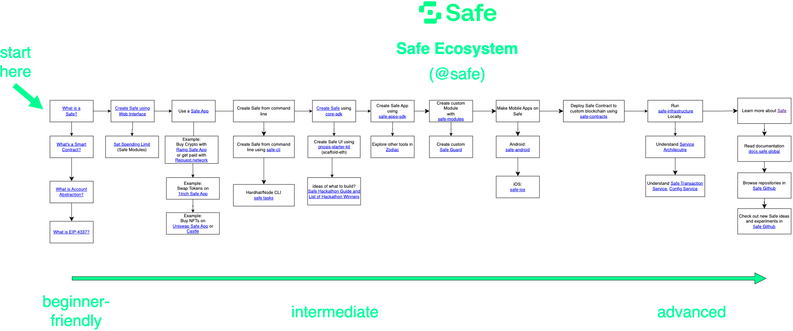

# Gnosis Safe 手册
## 介绍
您需要了解的关于智能账户的所有信息，以及如何开始使用和构建智能账户。
### 什么是智能账户(Smart Account)？
智能账户是一个完全可定制的银行账户。如果你想到你的常规银行账户或加密账户，它使用密钥来签署交易。这意味着任何拥有密钥（密码、私钥）的人都可以签署任何内容并批准从您的帐户中汇款。

	注意：智能账户也称为智能合约账户，而使用密钥签署交易的加密账户也称为外部拥有账户（EOA）或签名账户。
- 这意味着如果有人获得了您的用户名和密码，他们就可以拿走您所有的钱。
- 这也意味着，如果您忘记了密码，那么您必须使用普通银行账户进行冗长的密码重置过程，如果是加密账户，您的钱将永远消失

使用智能账户，它是完全可定制的，因此您可以创建您想要的任何类型的规则。您可以创建的最常见的规则类型是多签名者帐户。

例如，不是只有一个密码（或私钥）控制您的帐户，您可以让多人完成它。

- 您可以添加 3 个您信任的其他人（或公司！）作为您帐户的签名者。然后如果你想发送任何交易，至少有 2 个交易必须批准。
- 另一个常见的规则是设置支出限额。您可以设置一个限额，允许您提取 100 美元以下的金额，而无需其他人的批准。但是，对于更大的金额，您可能需要另外 2 个人签署并批准交易。

当您将帐户的概念从简单地使用密码或私钥来批准交易的东西更改为完全可从头开始自定义的东西时，可能性是无穷无尽的。本指南将向您展示一些可能性并为您提供使这些可能性成为现实的资源。

### 如何阅读本指南
本指南分为三个主要部分：学习、构建、发现。

- 了解智能账户的工作原理。
- 使用智能帐户构建很酷的东西。
- 通过智能账户发现其他人正在构建和使用的内容

我们建议

- 从 Learn 章开始并查看那里的一些教程以了解有关智能账户如何工作的更多信息。
- 然后，前往“Discover 探索”部分，获取有关智能账户可能实现的事物类型的一些想法和灵感。
- 然后，完成其中一个构建教程并制作一个使用智能账户的应用程序。

可以按照[生态系统图](https://viewer.diagrams.net/index.html?tags=%7B%7D&target=blank&highlight=0000ff&edit=_blank&layers=1&nav=1&page-id=atRejJyS5DeNAtDboIeV&title=Safe%20Diagrams.drawio#Uhttps%3A%2F%2Fdrive.google.com%2Fuc%3Fid%3D1WcTgdHoQttJ0K_fV8mDg-RmDZRYGe3D-%26export%3Ddownload)为示例

### 开始
生态系统图涵盖了很多工具。如果您想更简单地介绍 Safe，请从以下步骤开始：

- 用户
	- 了解什么是智能账户
	- 使用 Web 界面创建保险箱
		- 在您的保险箱中设置支出限额
	- 使用安全的应用程序
	- 查看其他人如何使用 Safe
- 开发者
	- 了解外部账户与智能合约账户
	- 从 [safe-cli](https://github.com/5afe/safe-cli) 命令行创建 Safe
	- 使用 [core-sdk](https://github.com/safe-global/safe-core-sdk) 创建 [safe](https://github.com/safe-global/safe-core-sdk/tree/main/packages/safe-core-sdk#getting-started)
	- 从 [safe hackathon 手册和获胜者列表](https://gnosis-safe.notion.site/Safe-Hackathon-Success-Guide-53d2fb3c29424b58b1c4407519a54930) 了解为什么要构建 safe

### 联系我们方法
- [Discord](https://chat.safe.global/)
- [推文](https://twitter.com/safe)
- [提出 gnosis-safe 问题](https://ethereum.stackexchange.com/questions/tagged/gnosis-safe)
- [safe Github](https://github.com/safe-global)

### 进一步阅读
- [警卫文档](https://docs.gnosis-safe.io/contracts/guards)
- [core-sdk 文档](https://docs.gnosis-safe.io/build/sdks/core-sdk)
- [模块文档](https://docs.gnosis-safe.io/build/sdks/core-sdk)

## 学习手册
### 为什么要建立在 Safe(保险箱) 之上？
您可能想要考虑在 Safe 的智能合约帐户标准之上构建您的应用程序的几个关键原因。总的来说在 Safe 之上构建您的应用程序可以提供一系列好处，包括

- 增强的安全性
- 改进的用户体验
- 以及更大的灵活性
- 和集成度

多重签名控制只是冰山一角，Safe 账户为新形式的保管、所有权和身份解锁了广泛的可能性。

智能合约账户可以实现新的托管形式

- 高安全性

	Safe 的多重签名功能允许您定义所有者帐户列表和确认交易所需的帐户数量阈值。一旦所有者帐户的阈值确认了交易，就可以执行安全交易。所有者可以是 EOA 或其他智能合约帐户。
- 高级执行逻辑

	可以使用不同的`安全库合约`来执行复杂的交易。一个非常常见的例子是`批量交易`，其中多个简单的以太坊交易被组合在一起并立即执行。这意味着用户不必按顺序签署多个交易，而只需签署一个批量交易。
- 高级访问管理

	您可以将`安全模块`添加到您的 safe 中。从而可以实现更细粒度的访问管理。例如，
	
	- 可以定义一个只能用于在特定情况下`恢复对 Safe 的访问的模块`。
	- 一个流行的版本是`社会恢复模块`。
	- 一个不同的例子是`许可模块`，它允许 safe 的所有者授予有限的执行权限，例如对外部帐户的每日限制。
- Token 回调支持

	许多新 Token 需要钱包合约来实现回调。ERC721 和 ERC1155 等 Token 标准允许合约对通过这些接收 Token 立即做出反应，甚至可以完全拒绝转移。
- 无以太账户

	Safe 的另一个核心功能是 Token 支付。通常，以太坊交易需要 ETH 支付交易费用（“gas”）。使用 Safe，用户可以使用多种受支持的 ERC20 Token 支付交易费用。这是通过接受这些 Token 并将交易提交到区块链的交易中继服务实现的，因此以 ETH 支付汽油费。使用相同的功能，可以实现无以太交易，其中第 3 方通过相同的中继服务代表 Gnosis Safe 支付交易费用。

#### 采用
Safe 智能合约被大量使用并存储了大量的以太币和其他Token。我们一直通过 [Dune Analytics](https://www.duneanalytics.com/)基于链上数据创建以下仪表板：......

- 一般 [用法](https://explore.duneanalytics.com/dashboard/gnosis-safe_2) 概述
- 按类型划分
- 设置

#### 支持的网络
Safe 智能合约的规范版本部署到以下网络：

- Ethereum Mainnet (Etherscan 在[这里](https://etherscan.io/accounts/label/gnosis-safe)提供了一个很好的概述)
- Ethereum Testnets: Rinkeby, Kovan, Ropsten, Görli
- Gnosis Chain (以前的 xDai)
- Arbitrum
- Aurora
- Avalanche
- Binance Smart Chain
- Energy Web Chain
- Energy Web Chain Testnet: Volta
- Optimism
- Polygon

合同地址在所有这些网络上都匹配。完整列表可以在 [safe-deployments](https://github.com/gnosis/safe-deployments) Github 上的存储库（例如 [1.3.0](https://github.com/gnosis/safe-deployments/tree/main/src/assets/v1.3.0)).

要在另一个基于 EVM 的链上部署安全合约版本 1.3.0，请按照 [safe-contracts 合约库说明](https://github.com/gnosis/safe-contracts/blob/v1.3.0/README.md#custom-networks). 请注意：该链需要完全兼容，即支持 Safe 合约使用的所有操作码。

为了运行 [Safe Web interface](https://docs.gnosis.io/safe/docs/contracts_other_evm/gnosis-safe.io/app/) [(code)](https://github.com/gnosis/safe-react/)，您还需要运行后端服务，尤其是 [safe-client-gateway](https://github.com/gnosis/safe-client-gateway/)和[safe transaction service](https://github.com/gnosis/safe-transaction-service)包括一个跟踪节点（见[服务架构](https://docs.gnosis-safe.io/learn/infrastructure/service-architecture)).

Safe 团队没有能力为所有基于 EVM 的网络启动和维护完整的前端和后端支持。所有 Safe 相关的源代码都是开源的。我们鼓励每个人将 [部署规范版本](https://github.com/gnosis/safe-contracts/blob/v1.3.0/README.md#custom-networks)的 safe 合约到他们各自的网络，并自己运行所需的后端和前端部分。

要将 [safe-deployments 库](https://github.com/gnosis/safe-deployments) 添加到另一个受支持的网络，请按照 [合约说明](https://github.com/gnosis/safe-contracts/blob/v1.3.0/README.md#deployments) 步骤进行.

如有任何问题，请使用[邮件](safe@gnosis.io)告诉我们或联入我们的[Discord](https://chat.safe.global/).

#### EOA 与智能合约账户
外部拥有账户 (EOA) 和智能合约账户有什么区别？

EOA 由单个私钥控制，而安全帐户由代码控制。

- EOAs

	迄今为止，大多数在以太坊和其他 EVM 网络上创建的账户都属于外部拥有账户类别。简称 EOA 是使用传统密钥对的帐户。也就是说它们包含一个可用于进行交易和签署消息的私钥。如果您可以访问该私钥，您就可以完全控制该帐户。大多数流行的钱包，如 Metamask 或 imToken 都是简单的 EOA，甚至 Ledger Nano 或 Trezor 等硬件钱包也是基于 EOA。这意味着只有您的私钥——单点故障——会阻止您和您的资金丢失。
- 智能合约账户

	另一种类型的以太坊账户是智能合约账户。与 EOA 一样，每个智能合约账户都有一个唯一的公共以太坊地址，并且不可能通过查看以太坊地址将它们与 EOA 区分开来。智能合约账户也可以接收资金并进行类似 EOA 的交易。通常，关键区别在于没有使用单个私钥来验证交易。相反，账户如何完成交易背后的逻辑是在智能合约代码中定义的。智能合约是在以太坊区块链上运行并在满足特定条件时执行的程序。它们在合约账户中的功能意味着与 EOA 相比，此类账户可以，例如，实施访问权限，指定由谁、如何以及在什么条件下可以执行交易
- 多重签名钱包

	多重签名钱包是需要多方确认交易才能执行的合约账户。这些各方，每个都由一个唯一的以太坊账户地址代表，在智能合约中被定义为多重签名钱包所有者。只有当预定数量的这些所有者确认交易时，交易才会被执行。因此与私钥控制账户相关的单点故障被消除；丢失或泄露私钥将不再​​自动导致帐户控制的所有资金丢失。
与需要多个密钥才能执行交易的安全帐户相比，传统钱包方案中单个私钥控制帐户访问
- 不同存储方案的比较
	- EOA 与多签钱包比较

		
	- 与传统多签钱包、软 EOA 钱包、硬 EOA 钱包、中心化交易所方案比较
		- 多签
		- DeFI 集成
		- 隐私
		- 收藏品NFT
		- 免 Gas 签名
		- 开源
		- 正规验证 

		

### Safe 工具
#### SDK
我们提供多种软件开发工具包 (SDK) 来与来自不同平台和不同用例的安全智能合约进行交互。

- `Safe Apps` 是可以无缝集成到 [safe 界面](https://app.safe.global/) 中的去中心化应用程序。
- `Safe Core SDK` 是一个 TypeScript 库，可促进与 Safe 合约和服务的交互。
- `Contract Proxy Kit ( CPK )` 提供了一种创建保险箱的简单方法，可用于在您的去中心化应用程序中利用智能合约钱包的优势。

##### Safe 应用 SDK
- 什么是 safe 应用程序？

	仅 Safe 就拥有价值超过 9千万美元的数字资产，对于 dapp 生态系统来说，进入尚未开发的多重签名钱包市场至关重要。Safe Apps 为开发人员引入了一种全新的方式来将他们的 dapps 直接构建到 Multisig 界面中。将你的 Dapp 变成一个可以通过 Safe 访问的 HTML iframe 组件。我们正在提供广泛的开发人员工具，以便轻松创建、测试 Safe Apps 并将其集成到 Safe 中。这包括一个独特的设计系统、可重复使用的组件和一个促进 safe 安全通信的 `safe 应用程序 SDK`。

	请参考这个 [讲座](https://www.youtube.com/watch?v=1GirpNHZPJM&t=168s) 了解有关 safe 应用程序的更多信息。

	已经有适用于许多流行协议的 safe 应用程序，例如 [aave](https://aave.com/)、[synthetix](https://synthetix.io/)、[1inch](https://1inch.exchange/)、[balancer](https://balancer.finance/). 这些是由第 3 方开发人员或项目本身构建的。

	如果您缺少 safe 应用程序，请联系相应的项目或 [safe 应用sdk](https://docs.gnosis-safe.io/learn/safe-tools/sdks/safe-apps/build)使用.
- 链上统计

	有可用的有关 safe 应用程序的 Dune Analytics 仪表板：

	- [交易数](https://explore.duneanalytics.com/dashboard/gnosis-safe---safe-apps-transactions)
	- [交易金额](https://explore.duneanalytics.com/dashboard/gnosis-safe---safe-apps-volume)
- 现有的 safe 应用程序

	这是包含 Safe Apps 的几个已知公共存储库的列表，供参考：
	
	- [tx-builder](https://github.com/gnosis/safe-react-apps/tree/development/apps/tx-builder)
	- [wallet-connect](https://github.com/gnosis/safe-react-apps/tree/development/apps/wallet-connect)
	- [safe-airdrop](https://github.com/bh2smith/safe-airdrop)
	- [OpenZeppelin](https://github.com/OpenZeppelin/upgrades-safe-app)
	- [balancer](https://github.com/balancer-labs/frontend-v2)
	- [1inch.exchange](https://github.com/CryptoManiacsZone/gnosis.1inch.exchange)
	- [synthetix](https://github.com/protofire/safe-app-synthetix-mintr)
	- [sablier](https://github.com/TomAFrench/sablier-safe-app)
	- [pancakeSwap](https://github.com/pancakeswap/pancake-frontend)
- 免责声明
	
	我们可自行决定将应用程序从保险箱中上架或下架。Gnosis 不拥有、控制、维护或审计安全应用程序。
	 
应用 sdk 详细查看 [这里]()

##### safe 核心 SDK Monorepo
它是一组用 TypeScript 编写的软件开发人员工具，可促进与 Gnosis Safe [合约](https://github.com/safe-global/safe-contracts)和[服务](https://github.com/safe-global/safe-contracts)的交互。

- 指南

	指南|内容
	---|---
	[集成 safe core sdk](https://github.com/safe-global/safe-core-sdk/blob/main/packages/guides/integrating-the-safe-core-sdk.md)|本指南展示了如何将 [safe core sdk](https://github.com/safe-global/safe-core-sdk/tree/main/packages/safe-core-sdk)与 [safe service client](https://github.com/safe-global/safe-core-sdk/tree/main/packages/safe-service-client) 一起使用来部署新的 safes、提案交易、手机链下签名并执行
- 包

	包|发布|描述
	---|---|---
	[safe-core-sdk](https://github.com/safe-global/safe-core-sdk/tree/main/packages/safe-core-sdk)|npm 3.2.0|促进与 [safe-contracts](https://github.com/safe-global/safe-contracts)合约交互 typescrip 库
	[safe-core-sdk-types](https://github.com/safe-global/safe-core-sdk/tree/main/packages/safe-core-sdk-types)|npm 1.7.0|从[核心 sdk](https://github.com/safe-global/safe-core-sdk/tree/main/packages) 提取常见类型
	[safe-core-sdk-utils](https://github.com/safe-global/safe-core-sdk/tree/main/packages/safe-core-sdk-utils)|npm 1.5.0|[核心 sdk](https://github.com/safe-global/safe-core-sdk/tree/main/packages) 包的实用程序
	[safe-ethers-lib](https://github.com/safe-global/safe-core-sdk/tree/main/packages/safe-ethers-lib)|npm 1.7.0 |ethers.js 实用程序和safe 合约类型(typechain ethers-v5) 用于初始化 safs [核心 sdk](https://github.com/safe-global/safe-core-sdk/tree/main/packages/safe-core-sdk)
	[safe-service-client](https://github.com/safe-global/safe-core-sdk/tree/main/packages/safe-service-client)|npm 1.4.0 | safe [交易服务 api](https://github.com/safe-global/safe-transaction-service) 客户端
	[safe-ethers-adapters](https://github.com/safe-global/safe-core-sdk/tree/main/packages/safe-ethers-adapters)|npm 0.1.0-alpha.13|促进与 [gnosis 服务](https://github.com/safe-global/safe-transaction-service) 交互的 [ethers 适配器](https://docs.ethers.io/v5/single-page/)

#### 模块
模块为 safe 合约添加了额外的功能。它们是实现 Safe 功能的智能合约，同时将模块逻辑与 Safe 的核心合约分离。根据用例，模块可以允许在不需要所有确认的情况下执行交易。一个基本的 Safe 不需要任何模块。添加和删​​除模块需要所有所有者的确认。模块对安全性非常关键，因此它们需要与所有其他 Safe 合约一样安全。每当添加或删除模块以及模块事务成功或失败时，都会发出事件。

模块可以包括每日支出津贴、无需其他所有者批准即可支出的金额、经常性交易模块、在定期设定日期执行的长期订单，例如支付租金，以及社会恢复模块，这可以让您恢复，万一失去对所有者帐户的访问权限。这只是可能模块的简短示例列表，您可以想到许多其他可能对您的钱包有益的模块。模块使开发人员能够通过单独的智能合约包含他们自己的功能。

有关模块的示例，请找到几个[示例](https://github.com/gnosis/safe-modules)和 Zodiac 团队创建的[模块](https://github.com/gnosis/zodiac#modules).
#### 守卫
交易守卫已被引入. n当在-out-of- scheme之上有限制时使用它们。m
交易守卫可以在安全交易前后进行检查。
事务之前的检查可以例如在执行之前以编程方式检查相应事务的所有参数。
在交易执行的最后调用交易后的这种检查，并且可以用于例如对保险箱的最终状态执行检查。
有关事务守卫的示例，请从 Zodiac 中找到实现和向往.	

# 参考
https://docs.gnosis-safe.io/