# Safe 简单使用手册
## 创建保险箱
- 进入地址

		https://app.safe.global/welcome
		
	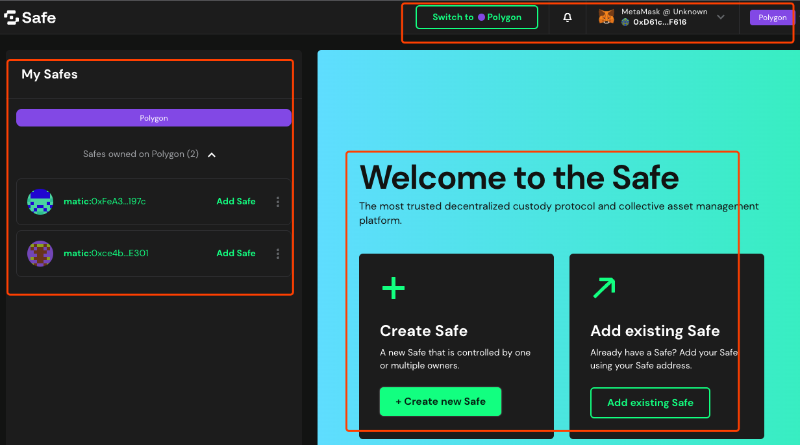
	
	页面包含3大部分
	
	- 部分1

		header 部分，主要负责针对用户的通知、钱包地址切换和链切换3个功能

		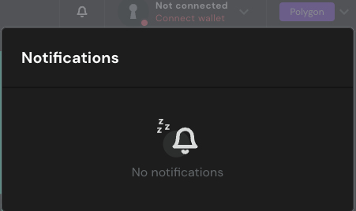
		
		- 通知

			负责通知钱包
			
			
		- 钱包链接
			
			负责与当前的 EOA 热钱包链接 
			
			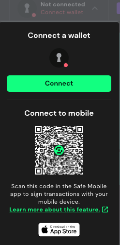
			
			支持的钱包
			
			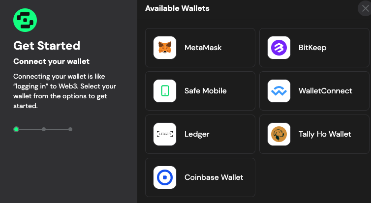
		- 链选择 

			可以选择多种链，如图所示，注意这里一定要先选定钱包链
			
			 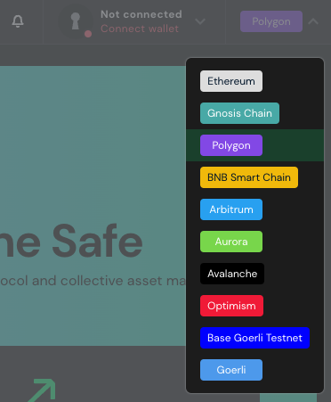
	- 部分2

		页面 body 左边部分

		显示已经有的
	- 部分3

		页面 body 右边部分
		
		保险箱操作，包括2个
		
		- 创建保险箱

			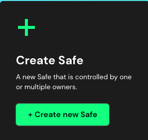
		- 导入保险箱 

			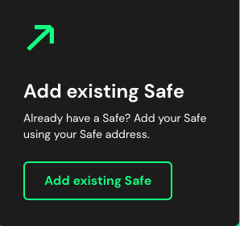
- 点击创建，跟着步骤走就可以创建一个在 polygon 上的一个保险箱合约(多签钱包)

	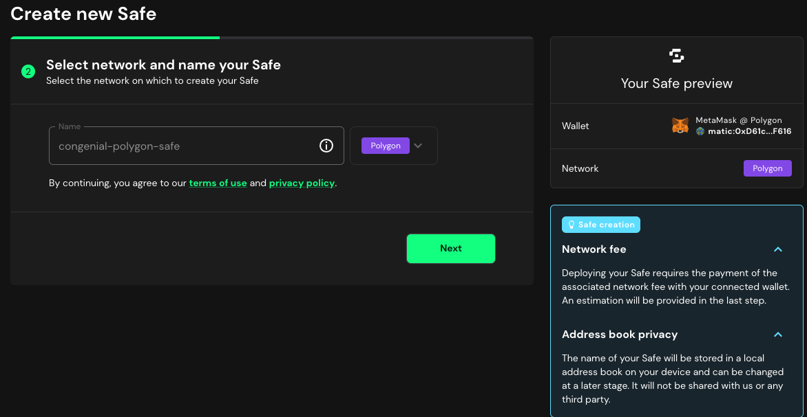
	
## 功能主界面
主界面分6个部分，分别是	

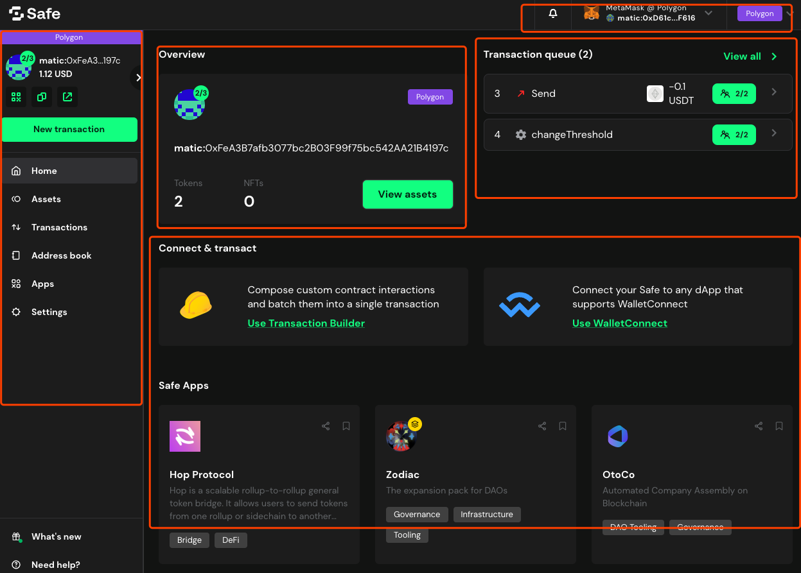
### header 部分
主要负责针对用户的通知、钱包地址切换和链切换3个功能

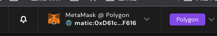
	
- 通知

	负责通知钱包
	
	
- 钱包链接
	
	负责与当前的 EOA 热钱包链接 
	
	
	
	支持的钱包
	
	
- 链选择 

	可以选择多种链，如图所示，注意这里一定要先选定钱包链
	
	 
	 
### 工作菜单(左边工作区域)
这里包含右边主要工作区功能切换，包含6个工作去切换按钮和1个新交易按钮
	
 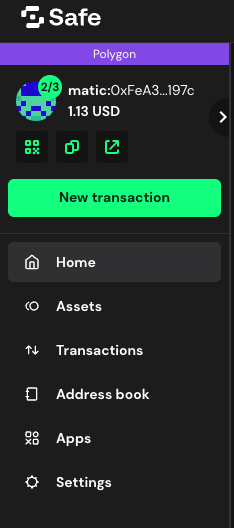
 
-  6个功能做切换按钮
	- home
	
		主要就是总体保险箱的功能汇总页面
		
		 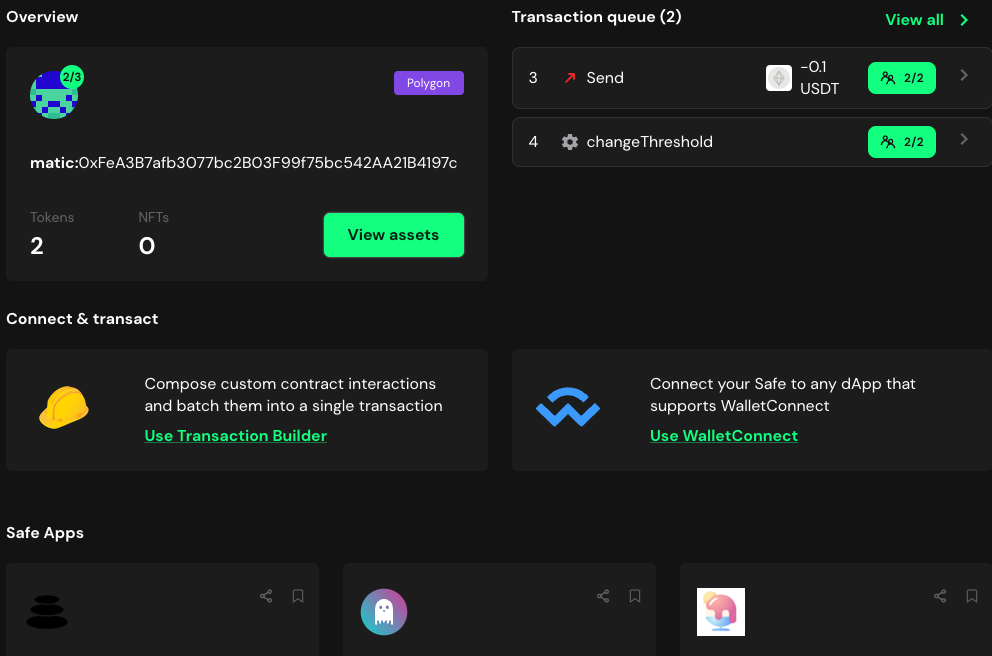
	- Assets
	
		管理资产列表页面，主要包括2大类型资产，FT代币和 NFT 代币
		
		当然也可以在这里对选中代币发起交易
		
		 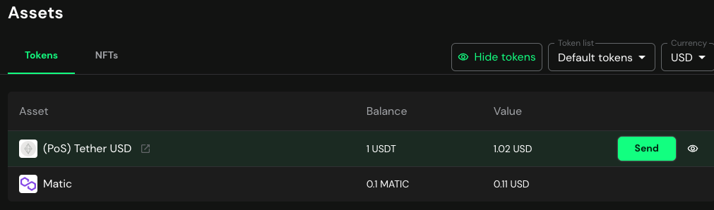
	- Transactions
	
		交易列表页面，主要包括2个状态的交易，队列中准备执行的交易和历史交易
		
		- 队列交易(待执行)
		
			 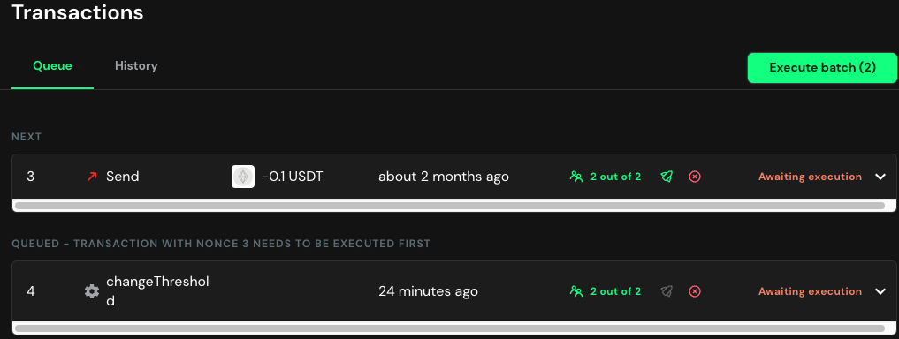
		 - 历史交易(已执行)
	
		 	 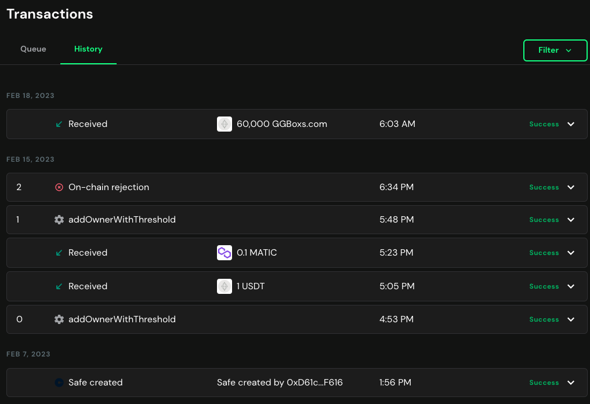
	- Addressbook
	
		地址记录，创建、修改、删除、导入、导出记录钱包地址与人可读懂字符串名字的关系
		
		 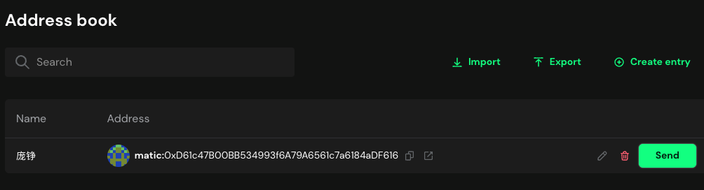
	- Apps
	
		保险箱生态，所有支持保险箱的 Dapp，也可以自己添加自己的 Dapp
		
		 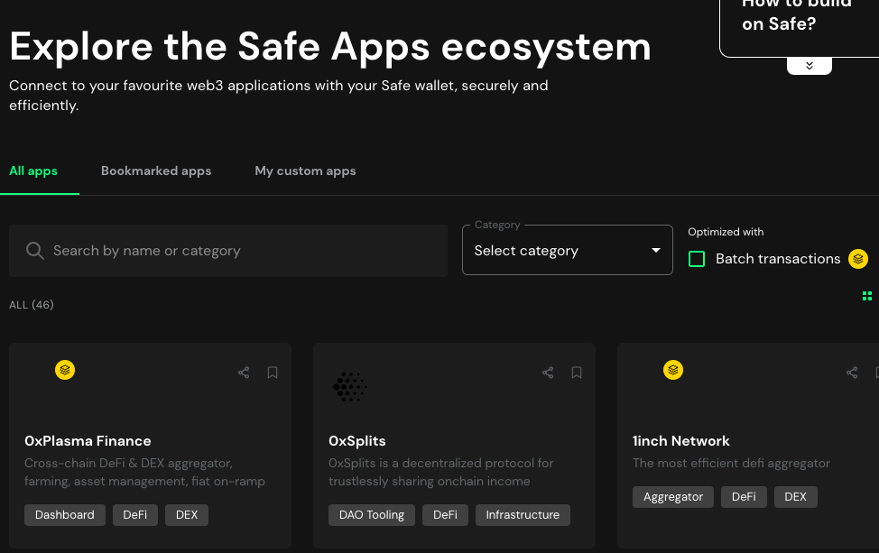
	- settings
	
		保险箱设置，可以设置很多东西，包括
		
		- Setup (核心功能)
			
			主要设置，这里可以查看保险箱版本、管理员列表、投票设置
			
			  
		- Appearance
	
			外观设置
		- Modules
	
			模块设置，为保险箱增加其他插件模块或者守卫模块，默认没有设置
		- 支出限额
	
			可以做自动支出方案，从受益者、授权资产金额、时间来设置。
		- 应用权限
	
			可以设置保险箱对应用的设置
		- 数据
	
			可以从旧的数据导出所有保险箱和地址的数据
		- 环境变量
	
			可以设置前端链 RPC 提供者或者保险箱的 API 设置，比如访问控制 token
- 1个新交易按钮

	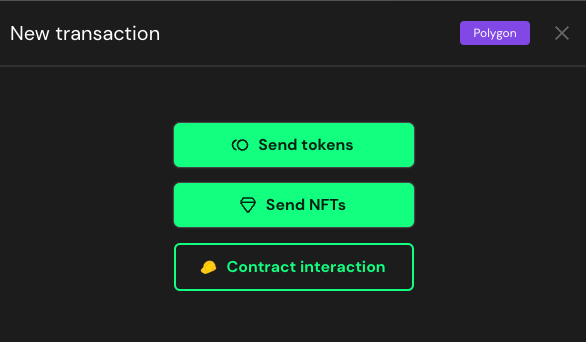 
	
	点击后，可以查看有3种交易操作可以进行
	
	- 发送 FT
	- 发送 NFT
	- 合约交互

### 工作区域(Home)
工作区域仅介绍 Home 汇总区域，其他大部分功能按钮功能均在此汇总
		 
- 当前地址资产信息

	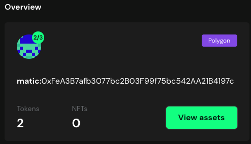 
	
	操作包含
	
	- 保险箱地址 
	- 在线人数
	- 保险箱所在链
	- 拥有 Token 类型的总数量
	- 拥有 NFT 类型的总数量
	- 查看资产(跳转到资产列表)  
- 交易队列信息

	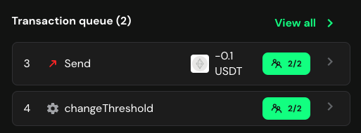 
	
	可由这里打开交易队列中的每一个交易进行操作，也可以打开全部交易列表包含
	
	- 交易队列
	- 交易全部列表跳转
- 链接和交易

	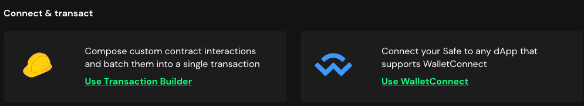 
	
	包括合约交易和模拟 walletconnect 链接应用，本文不做介绍
- 应用

	包括支持的所有 Dapp,本文不做介绍
	
## 交易投票
交易投票从业务层面分3个类型

- 对交易代币投票(核心功能)

	对 NFT 和 FT 代币的交易进行投票并交易，创建页面包含
	
	- New transaction
	- Assets 中的每个资产 send 操作
- 对合约的操作投票

	这里包含保险箱所有对合约操作的创建和投票，因为合约非标准化操作严重，所以合约操作均使用合约地址+ABI 调用方法，创建页面包括
	
	- New transaction
	- home 中的 Use Transaction Builder 
- 对保险箱的管理

	对保险箱管理包含2个部分，成员管理、投票合法性管理
	
	- 成员管理

		对成员的增删改查，操作在 setting 中进行
		
		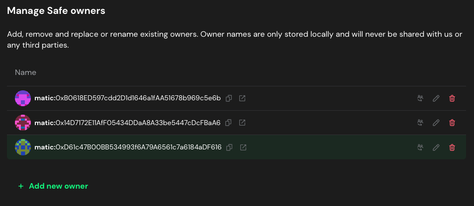 
	- 投票合法性管理

		对投票合法性数量的设置，比如3个人2个投票，交易即可执行，操作在 setting 中进行	
		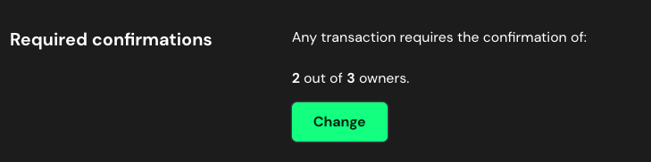 
		
## 交易流程例子
本例子以投票合法性管理为例，当前 2/3 也就是3个管理员，2个投票即可消费。但要改成1/3 ，只需要1人确认即可消费 、
### 创建交易
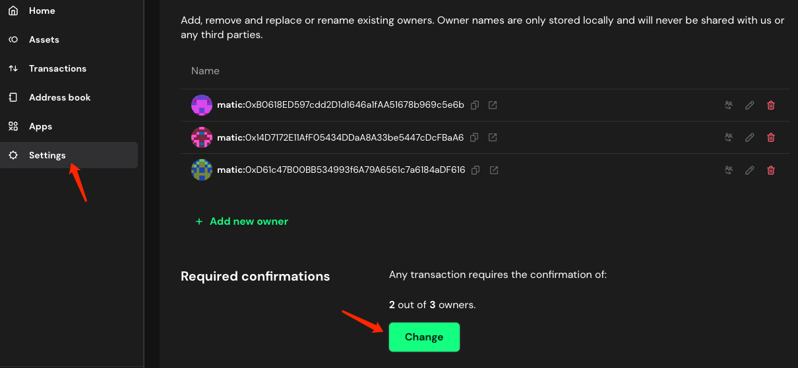 
	
点击 setting 下的 Change 按钮
	
- 创建一个修改设置投票

	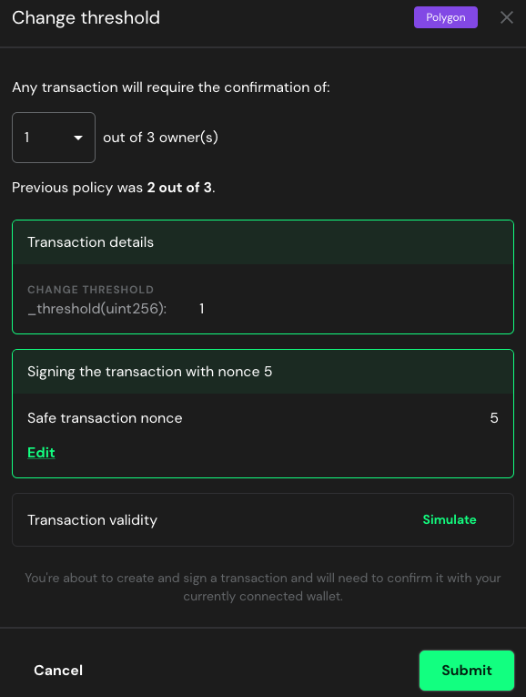 
	
	可以
	
	- 设置投票规则
	- 查看交易详情
	- 查看和编辑交易签名 nonce

		注意当前条件是我的排队列表中已经有了2个测试投票， nonce 分别是3和4。这里我要创建新交易，如果不想影响到其他人的提案，我们就使用默认的 nonce 5即可，但是需要等待前面2个交易完成。
		
		但是我队列中都是测试投票，所以我覆盖第3个 nonce 来替换下一次投票交易。
		
			注意，nonce 交易是排队的，如果前面 nonce 的投票交易没有执行，后面的也不可以。
		- 当前投票等待执行队列	
		
			
		- 创建投票任务
		
			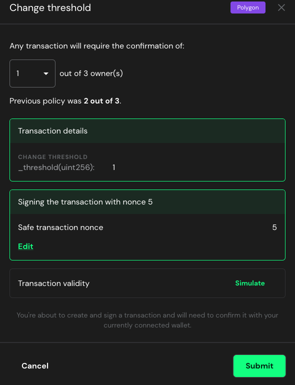
		- 编辑修改 nonce 为3
		
			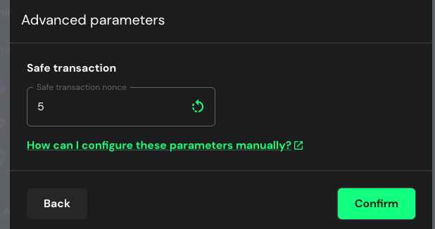
		- 最后投票申请
		
			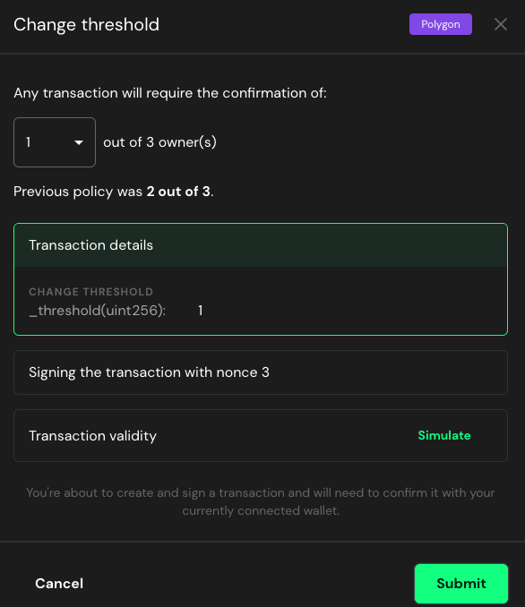
		- 钱包投票签名

			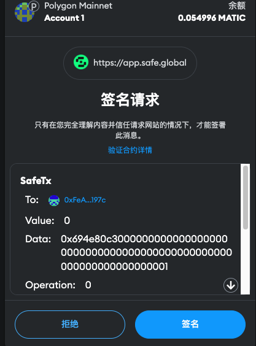
		- 之前投票任务被覆盖

			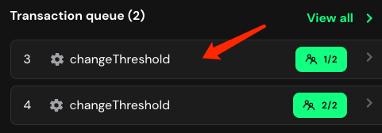

### 换一个管理员来投票
- 切换账户

	
- 进入 nonce 3任务

	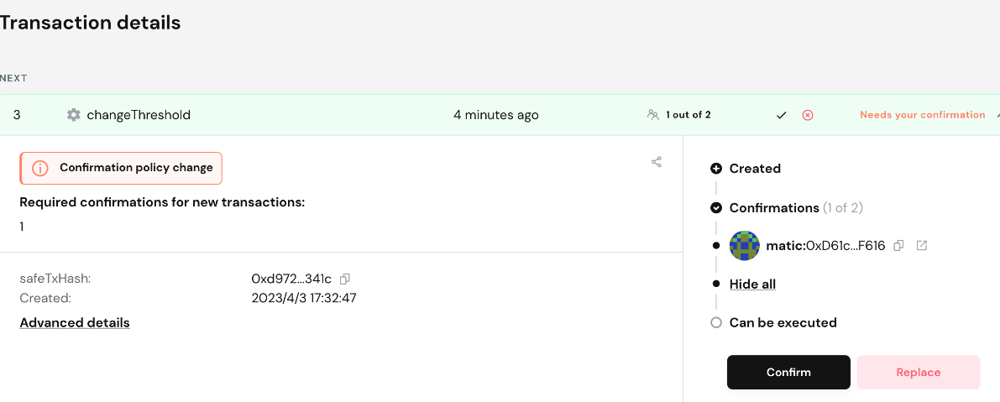
	
	注意看这里分两个部分，上面是任务简介，下面是任务详情，可折叠。
- 点击 Confirm 进入投票环节

	
	
	同创建类似分3个部分
	
	- 交易详情
		- 点击可以看到交易详情，类创建 
	- 执行交易
		- 这里如果本地址用户想直接投票后向区块链发送交易执行，可以选中，否则就取消
		- 这里还可以看到交易额大概是多少 
	- 交易验证
		- 可以模拟交易来验证签名合法性
- 取消执行后点击 Submit 执行，只做离线交易，对该地址免除 gas 费

	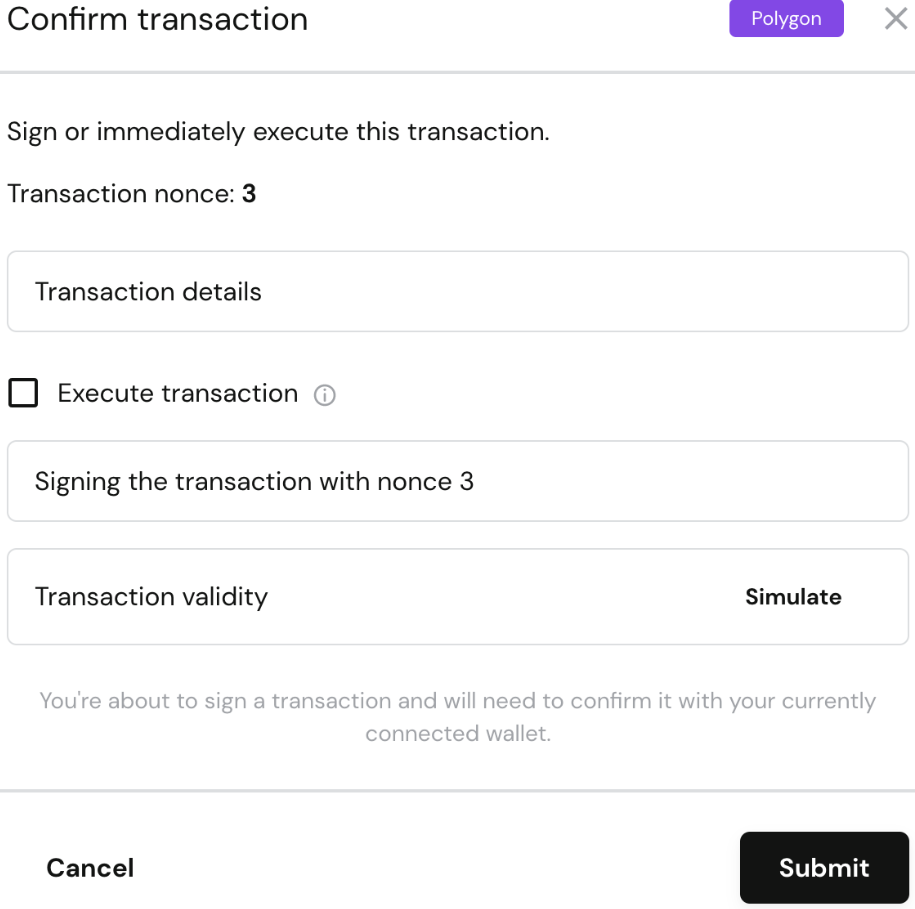
- 点击钱包签名

	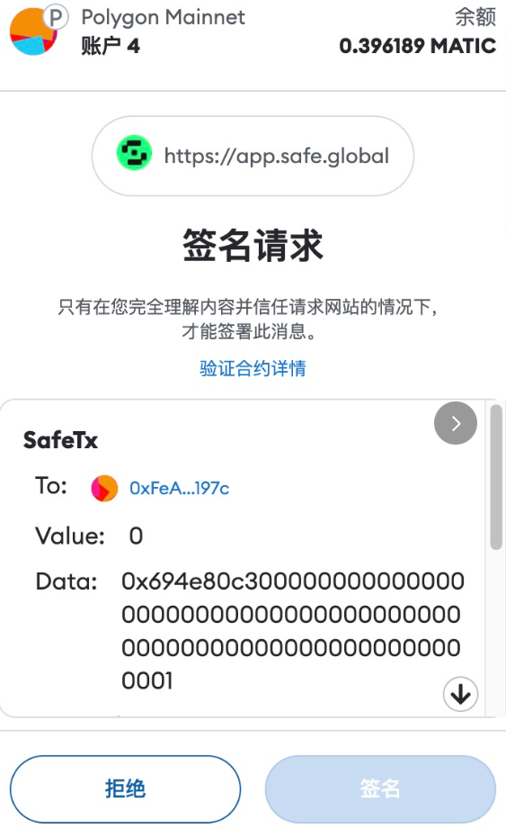
- 查看任务

	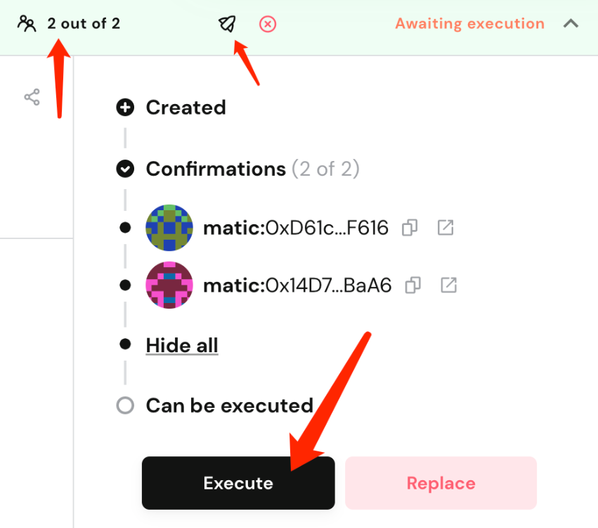

	可以看出该任务已经是2人投票，且 nonce 是排行第一，所以可以点击 execute 执行上链交易。
- 注意
	- 1、nonce 不是队列第一个是无法执行交易的。
	
		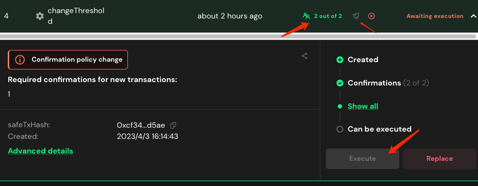
	- 2、投票人数没过设置，也是无法交易的。

### 使用任意管理员账户发送执行交易
因为投票结束，所以任意管理员都可以发送执行交易，即使没有投票的管理员也可以发送执行交易，我们切换回创建的管理员执行

- 点击执行

	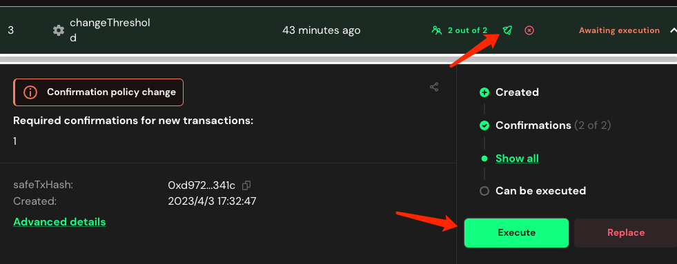
- 查看执行交易 gas 费用

	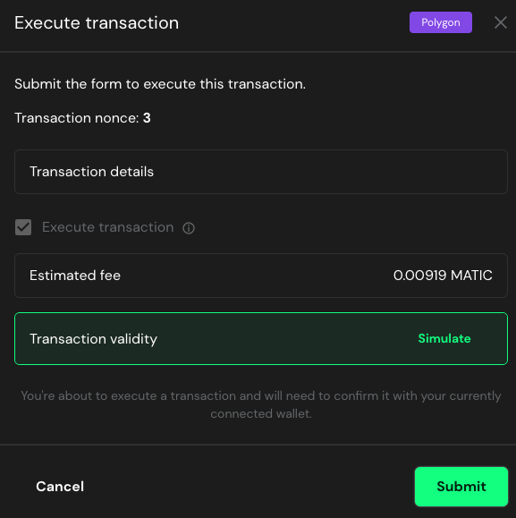	
- 钱包执行交易
- 查看任务进度

	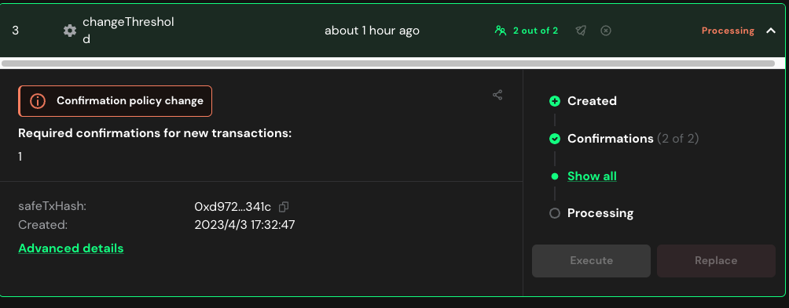	
- 执行成功

	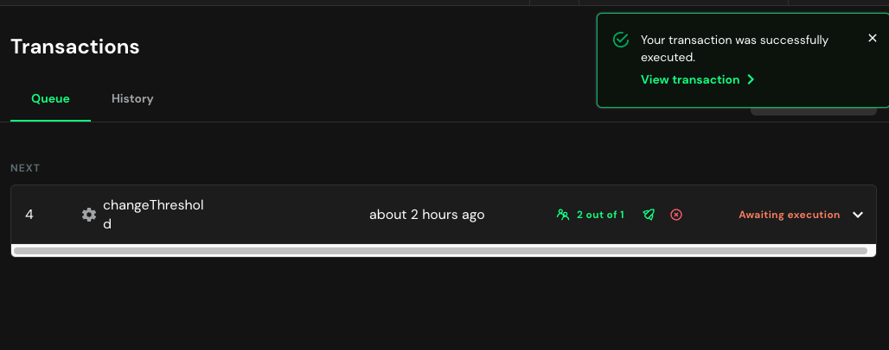	
- 返回查询投票名额

	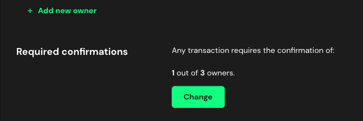		
		

## 保险箱官方手册
更详细的信息，请阅读保险箱的官方手册

- [保险箱用户手册](https://github.com/pangzheng/BOOKS/blob/master/%E6%8A%80%E6%9C%AF/%E5%8C%BA%E5%9D%97%E9%93%BE%E6%8A%80%E6%9C%AF%E5%AD%A6%E4%B9%A0/GnosisSafe/Gnosis%20Safe%20%E6%89%8B%E5%86%8C.md)	
		 

	

		
		
		
							 
			 
			 
			 
			 