# ManeSTUDIO
## 简介
ManeSTUDIO 是 ManesLAB 为 Web3 创作者开发的一体化且无需许可的工具包。该工具包括

- NFT生成
- 1/1 NFT注入
- 元数据管理
- IPFS去中心化存储上传
- 智能合约自定义部署
- 盲盒铸币网站建设等

致力于解决工作流程中的所有编码部分，让创作者可以简单专注关于创作本身。

归根结底，ManeSTUDIO 是一个 Web3 创建工具，不需要任何编码知识，也没有进入障碍。ManeSTUDIO 创建的 NFT 项目将在 ManeSPACE 上自动生成铸币网站。智能合约符合 OpenSea、LooksRare 等主流 NFT 二级市场协议标准，在初次发售后会自动同步。

ManeSTUDIO 可免费用于项目创建，它仅从主要销售收入中收取 3.3% 的服务费。

## 功能解释
### 第零步 开始之前-安全第一
你有没有听过一些人说：
	
	“区块链是一片黑暗的森林。”
是的，可以。但是，如果您足够谨慎，那么森林就是游乐场。这就是为什么我们强烈建议所有创建者使用安全的钱包地址进行项目创建和合约部署。

我怎么知道我的钱包是否安全？好吧，除非你的钱包被盗，否则你永远不会知道。与使用帐户和密码的 web2 服务不同，会向您发送可疑登录警告，大多数 Web3 钱包不提供此功能。只要您的私钥或助记词泄露，黑客就会耗尽您的加密钱包。它并没有就此结束。黑客将使用清扫机器人监控你的钱包，这意味着你转移到受损钱包中的每一个 ETH 作为气体，试图保存一些其他资产，将被耗尽并转移到黑客的钱包中。您受损的钱包基本上将有 0 ETH 余额并且完全瘫痪。
#### 那么我怎么知道我的钱包是安全的呢？
想想你是否做过以下事情：

- 在线某处提交您的私钥/助记词
- 复制并粘贴您的私钥/助记词并将其存储在您计算机上的某个位置
- 复制并粘贴您的私钥/助记词并将其发送给其他人
- 用可以访问互联网的智能手机为您的私钥/助记词拍照
- 还有更多听起来比上面更危险的东西
- 如果是这样，如果您可以创建一个新钱包（不添加 Metamask 地址，因为它们共享相同的种子短语，因此如果您泄露了种子短语，新地址与其他地址一样有风险），或者当前的最佳解决方案，那就太好了，使用使用硬件钱包（例如 Ledger）创建的地址来确保不会批准和提交任何交易，除非您使用只有您可以访问的物理设备进行确认。

当您使用 ManeSTUDIO 创建项目并成功部署合约时，您当前（可能存在风险）的钱包将成为合约所有者和管理员，这意味着它可以完全控制您的项目，包括资金管理。

如果在最坏的情况下，这个地址被泄露，黑客可能会撤回并窃取你从项目的主要销售中获得的所有资金，或者使用上面提到的扫地机器人，这样你甚至无法将合约所有权转移到安全的钱包地址。

如果你是加密艺术家并且你的主要钱包，或者说你的链上身份被泄露，那将是一件很痛苦的事情。所以说一切，保持安全，伙计们！收到您说您的钱包被黑的电子邮件将是我们最不想听到的消息，但如果不幸真的发生了，请随时与我们联系支持@maneslab.xyz

### 第一步 创作艺术品
通过添加组、层和将特征上传为 .png 文件来创建生成的 NFT 集合。您可以更改层的顺序，重命名特征命名并调整特征和组的稀有度。

- 设置
	- 添加新项目

		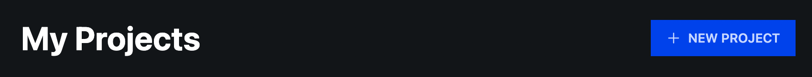 
		
		- 点击 NewProject

			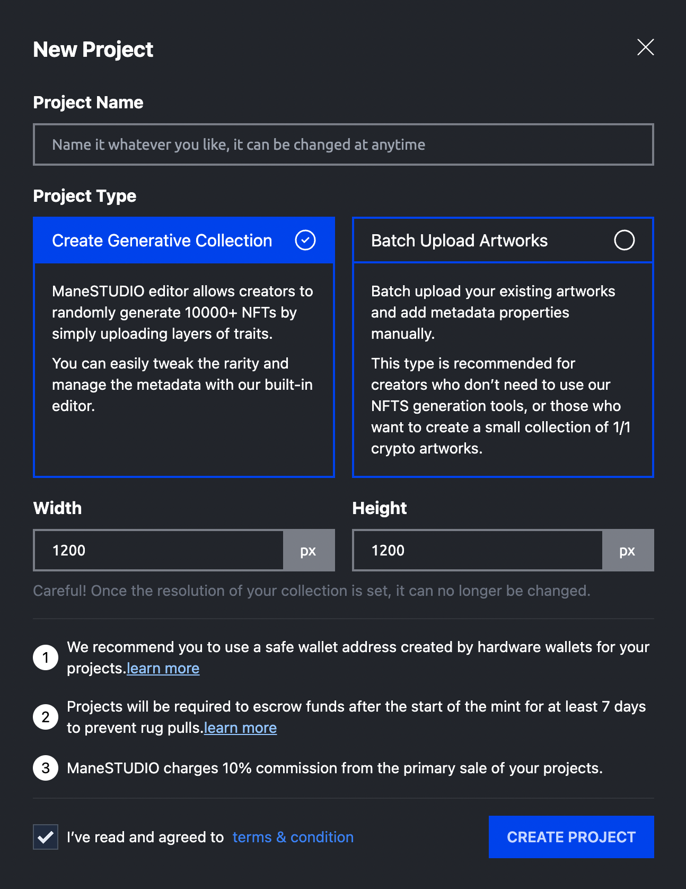 	

			会有2个选项
			
			1. 使用生成器创建生成集合，例如 PFP 集合
			- 上传完成的艺术品，例如艺术收藏

			对于生成式收藏，画布的分辨率可以自由编辑，最高可达 2048*2048 px 。请确保分辨率和纵横比例正确，因为这是生成器的一个重要参数，一旦设置，除非重建新项目，否则无法修改。
	- 组

		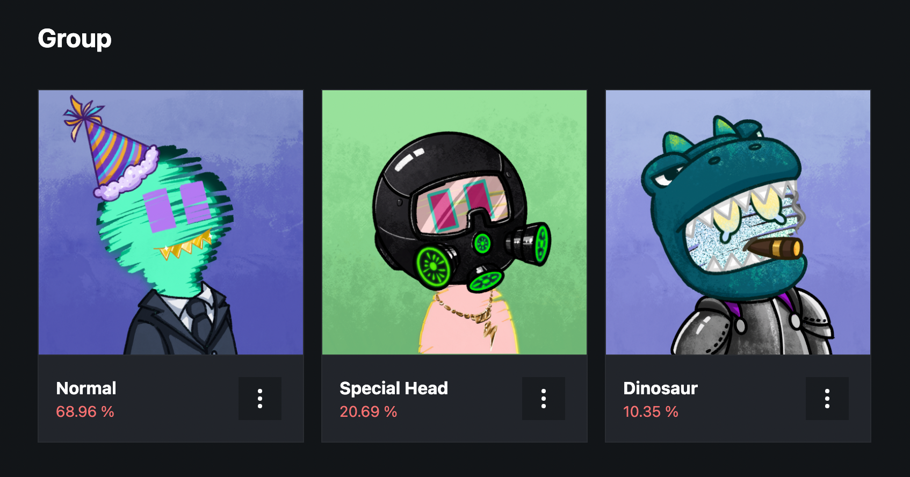
		
		创建 NFT 生成集合的第一步是添加组/组。

		- 了解组织

			组允许创建者集成不同的生成规则。

			例如，你的 PFP 项目有两个 A 和 B形状的角色，他们都有特征1，但是 特征A1 和 B1 被设计成不同的位置和比例来适应性状 A 和 B。然后你可以创建两个组 A 和 B，然后只在匹配的组中使用字符和特征。只要你将“A1”和“B1”这两个特征重命名为“1”，它们就会合并到你的最终生成结果中，从而不会干扰稀有度计算。你也可以改变A组和B组的稀有度。

			在上面的例子中，你可以看到 3 组 Weirdo Ghost Gang 作为我们的演示 NFTs, 3组表示3种生成逻辑的图层顺序，以正确重叠和突出设计特征，解释如下(从左到右=图层顺序从下到上)

			- 正常:			背景-身体-衣服-头-嘴-眼睛
			- 特殊头部:		背景-身体-衣服-嘴-眼睛-头
			- 恐龙:			背景-身体-衣服-眼睛-头-嘴

			组可以在许多创造性方式
	- 层次和特征

		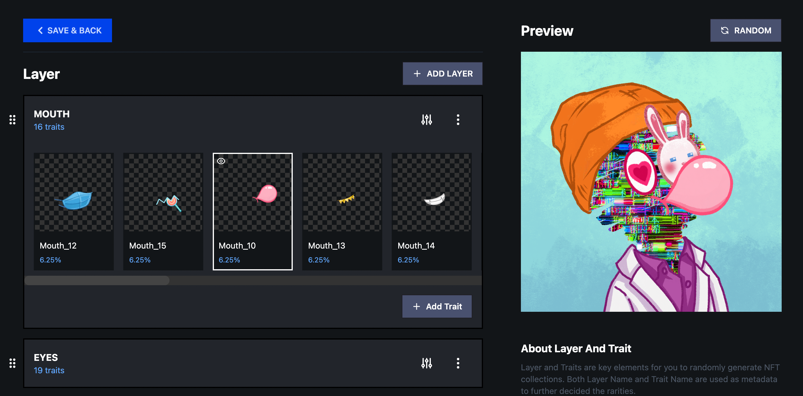	
		
		Layer 层和 Traits 特征是你随机生成 NFT 集合的关键元素。以“层名”和“特征名” 作为元数据，进一步确定稀有度。

		层的使用与 Photoshop 和 Procreate 等工具相同，它们允许你将图像元素堆叠在彼此之上，并调整顺序。

		特征是出现在同一层中的变体。你在一个层中添加的特征越多，你的集合中的每个 NFT 看起来就越独特。每个性状的稀有度都可以编辑。
		
		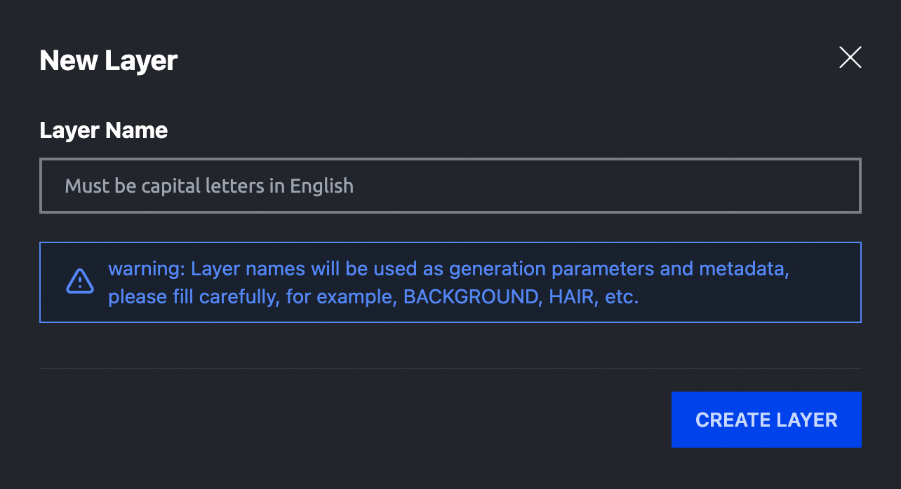					

		当你添加新的层时，请注意，如果你想合并不同组的特征，命名是非常重要的。确保所有组的层名和特征名是相同的。
		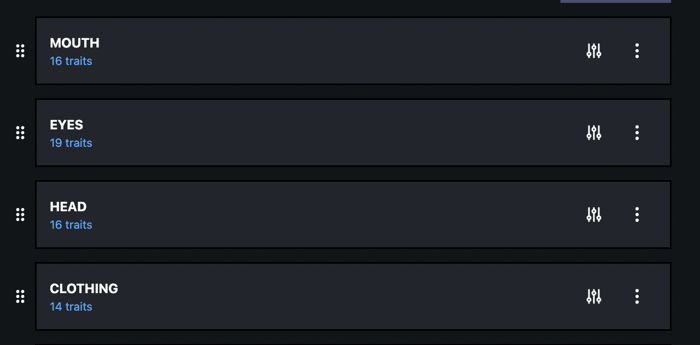
		
		注意这些层可以通过拖拽前面的提示 logo 来更改层的顺序
	- 预览窗口

		
		
		预览窗口允许通过单机随机按钮在上传的元素里进行随机滚动组合
		
		当单击并选择特定特征时，选择的特征被锁定，您现在可以单击随机按钮查看选择特征如何与其他特征组合
		
		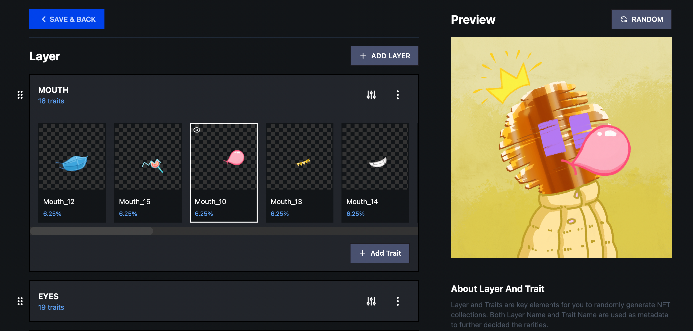
		
		注意预览窗口的结果可能不包含最终生成的结果
	- 稀有度

		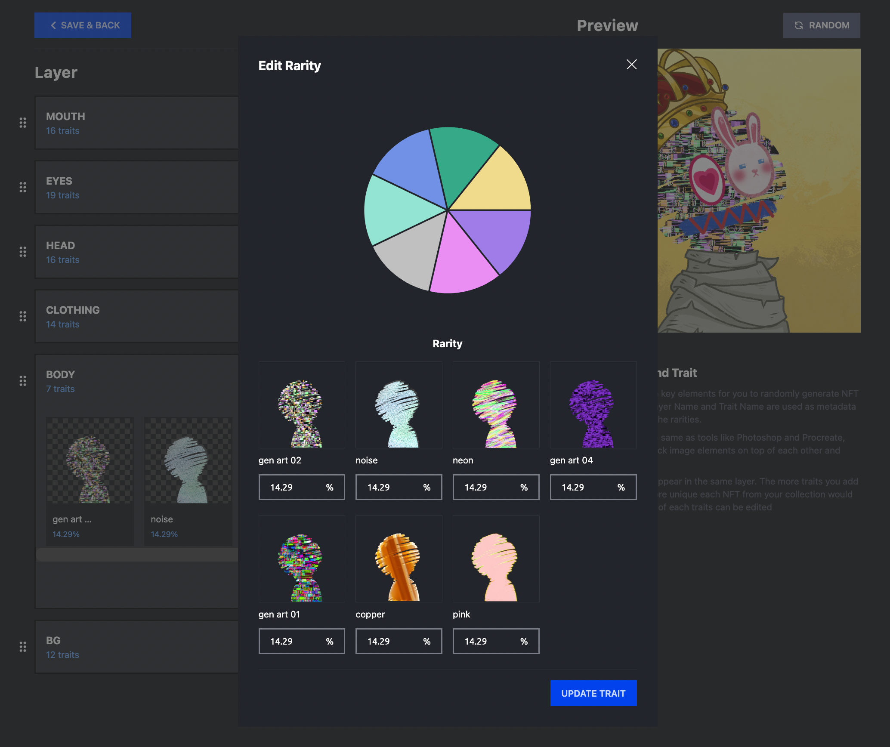
		
		单击每个特征上的设置，特质稀有度和群体稀有度均可编辑，无需手动计算准确比例，只需要更改1个或多个，点击 '更新特质' 即可自动计算比例
		
		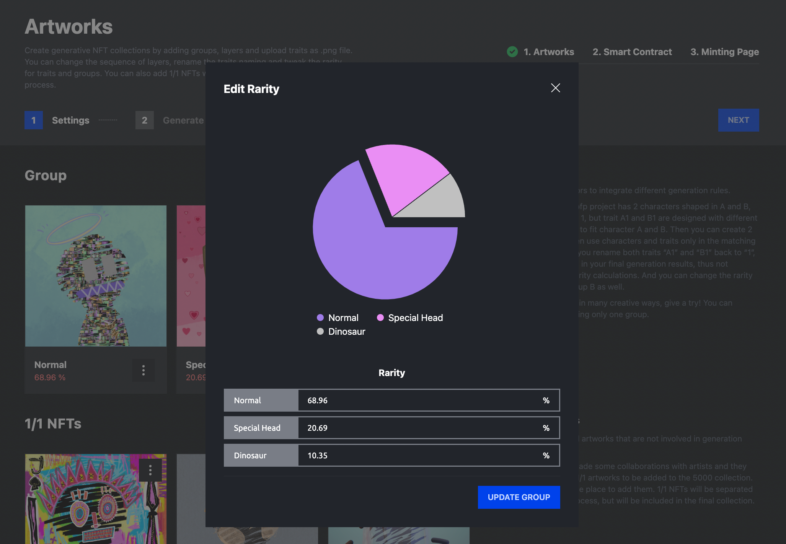		
		
		组稀有度也可以编辑
	- 1/1  NFT 

		该类型 NFT 是不参与生成过程的特殊艺术品
		
		例如：与艺术家进行了一些合作，他们创作了10件特殊的 1/1 艺术品，并添加到 5000 收藏中，那么这里是添加他们正确的位置。 1/1 NFT 将与生成过程分离，但包含在最终集合中
- 创造
	- 生成 NFT 

		使用左侧的过滤器缩小选择范围
		
		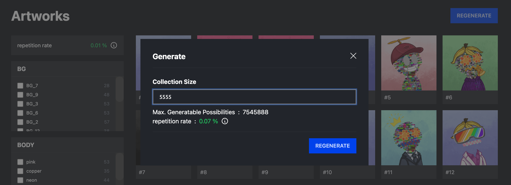 
		
		单击 `GENERATE` 开始生成设置所需的集合收藏品数量多少
		
			在设置收藏品大小时，不需要排除 1/1 NFT 输入的数字应该是您收藏中 NFT 最终数量，例如 5000/999/10000
		最大限度。可生成的可能性表示最大的生成结果。
		
		重复率简单的计算为 `收藏品大小/最大数量`。可生成的可能性来评估您的  NFT 集合的独特性。这个数字越小，收藏品中出现的重复概率也就越小。
		
		- 绿色 < 10% 一切都很好
		- 黄色 10% < 率 < 30% 一般，如果打算保持当前集合大小，需要填入更多的特征变化可能会很好
		- 红色 率 > 30% 重复率太高，最好在最后一步添加更多的特征，否则 NFT 看了起来相同过多。 
	
		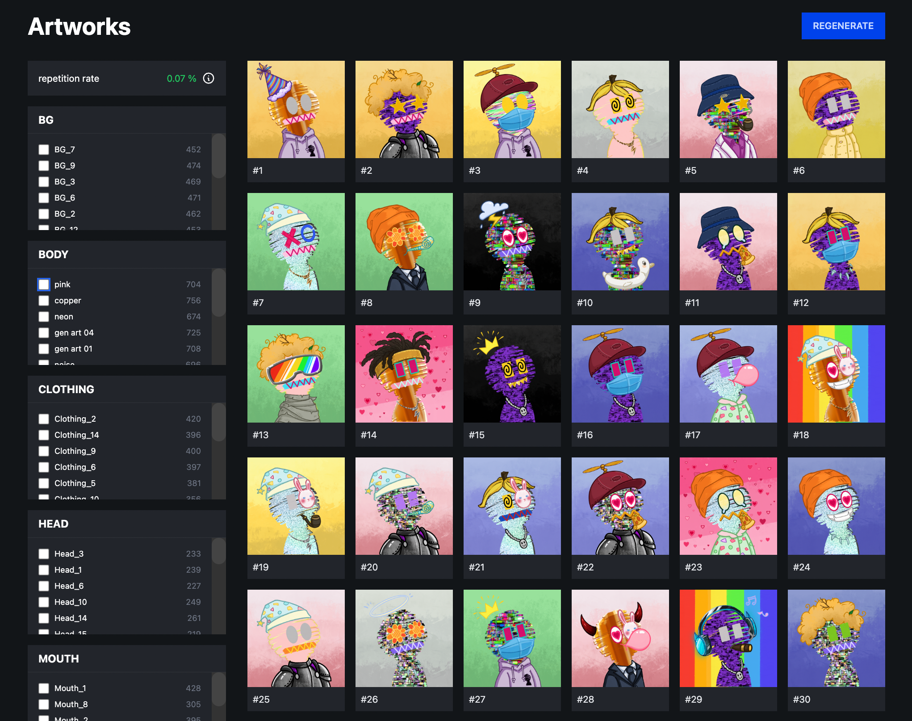
		
		生成结果应会在短时间内出现
		
		此处显示的代币编号与铸造最终的 NFT 代币 ID 不符，为了保证公平性，最终代币将使用随机决定每个 NFT 的铸造顺序
	- 搜索过滤器

		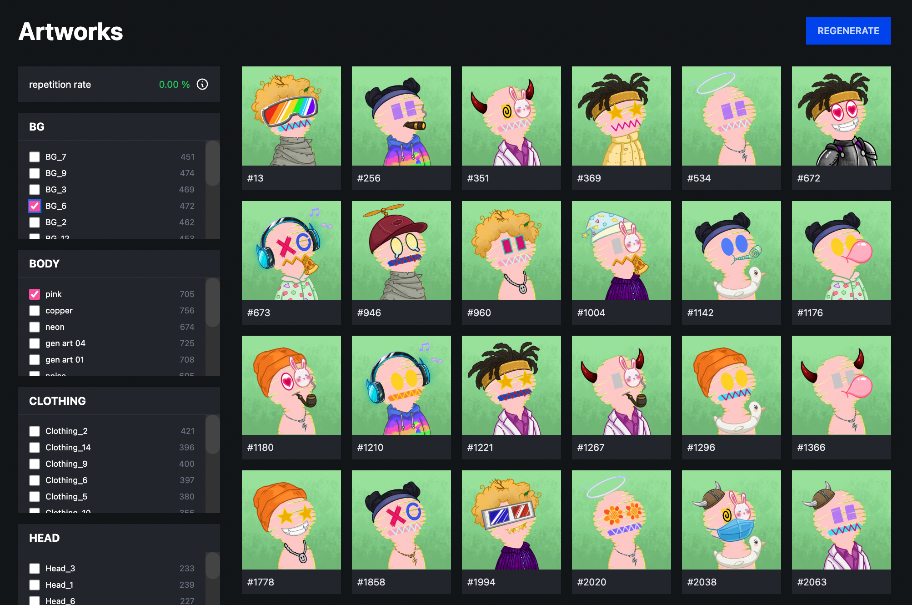
		
		左侧的搜索过滤器允许用户快速选择特定的特征和相应的生成结果。
	- 再生

		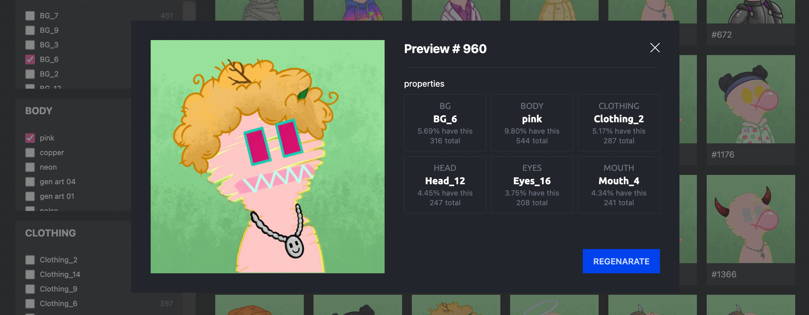
		
		如果看到任何不需要的生成结果，请单击 `REGENARATE` 功能，此功能将当前生成的结果替换成新的。可以无限次点击，直到找到满意的结果。
- 元数据

	描述 NFT 集合的特征和稀有度的元数据概述
	
	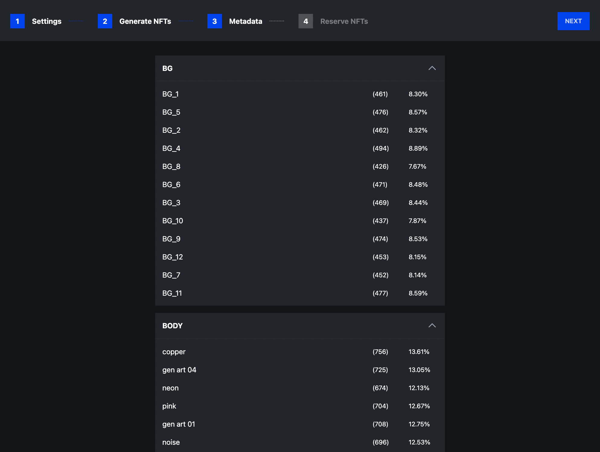	
	
	元数据描述集合中每个 NFT 的重要属性。当您使用 ManeSTUDIO 创建项目时，层和特征将自动转换为元数据，并与nft一起上传到 IPFS。像 rare sniper 这样的第三方工具将获取这些数据并使用自己的算法计算稀有度。

	如果你有需要从不同组合并的特征，你也可以在这一步检查是否所有的东西都正确合并了。

		1/1 NFTs 的特征仍然可以在这里编辑。但如果想更改特征名，需要返回设置
- 预留 Reserve NFT 

	这将是创造 NFT 的最后一步
	
	- 关于预留

		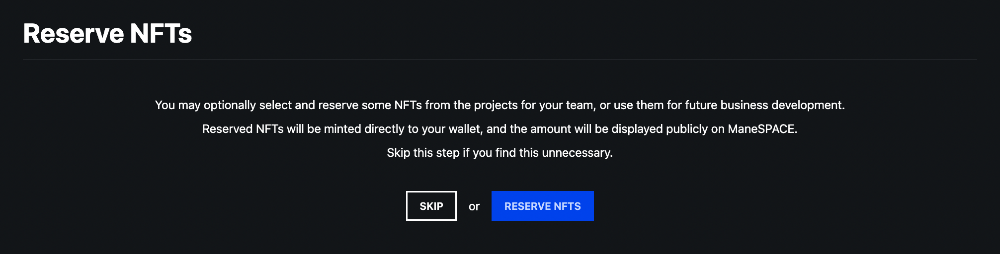	
		
		预留 NFTs 是一个可选功能。

		有些项目将保留一些 nft 来奖励团队或将其用于未来的业务开发目的。但是，请对社区公开这个决定。开启该功能后，您的决策和预留 nft 数量将以公共信息的形式显示在 MabeSPACE 界面上。		
		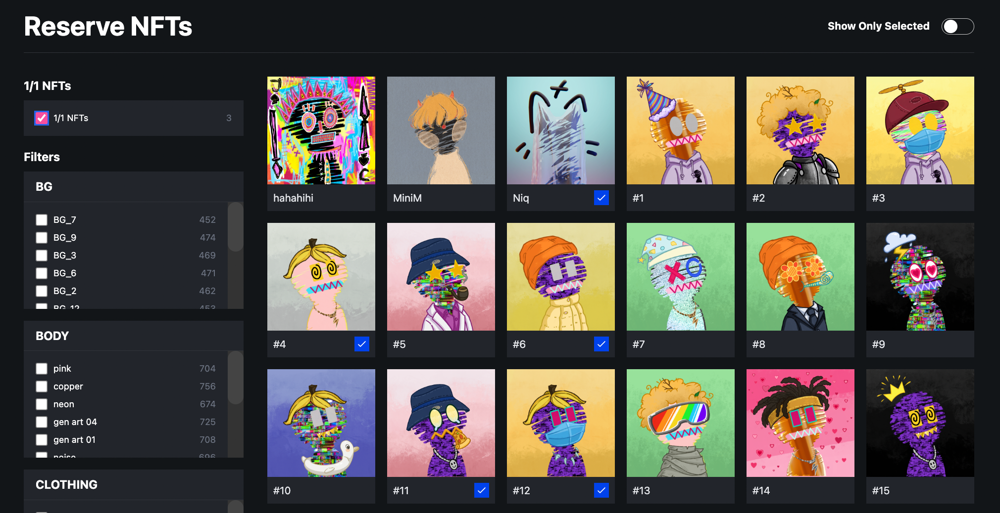
		启用此功能时，单击选择或使用过滤器缩小范围
		
		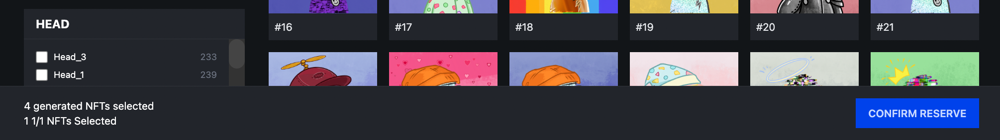
		
		在页面底部确认预订，现在您已经完成了艺术品的创建。
	- 当我预订NFTs时会发生什么?

		预留 NFTs 意味着选定的 NFTs 将铸造到您的钱包，这个过程将在部署合约时增加 gas 使用量，预留越多 gas 费越高。

### 第二步 智能合约
智能合约时将数字艺术品转化为 NFT 代币， NFT 是通过分配所有权和管理 NFT 可转让性的合约铸造的

- 智能合约设置			
	
	使用 ManeSTUDIO ，只需要单机鼠标编辑参数，即可完成项目定制独立的智能合约
	
	- 合约基础

		合约基本信息包含合约名称、代币符号、合约类型和最大代币供应量
		
		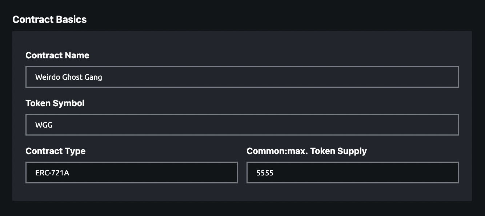
		
		- 合约名称

			合约名称是您的智能合约的主要标识符，将出现在提及您的合约的任何地方。通常与您的项目名称相同。
		- 代币符号

			代币符号是您的合约名称的缩写，它将出现在 Etherscan 和 NFT 市场之类的地方。
		- 合同类型

			合同类型是指您的合同标准。ERC-721 是单版 NFT 的通用标准。ManeSTUDIO 使用 ERC-721A，这是一个由 Azuki 创建的开源优化版本，用于减少铸造时的气体使用量。
		- 最大限度。代币供应

			最大代币供应量与您在之前步骤中确定的集合大小同步，此处无法编辑。
	-  可退款

		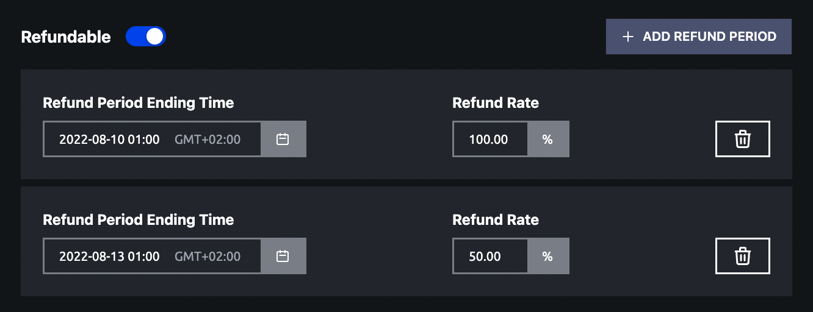
	
		退款是我们为创作者提供的一项可选功能，以展示对项目和社区的坚定承诺。如果您启用退款功能，“可退款”标签将被添加并突出显示到您项目在 ManeSPACE 的铸币页面。
		
			请注意，增加可退款期将导致您的主要销售收入的资金托管时间更长，您可能能够在所有可退款期结束之前提取部分资金。
	- 白名单预售
	
		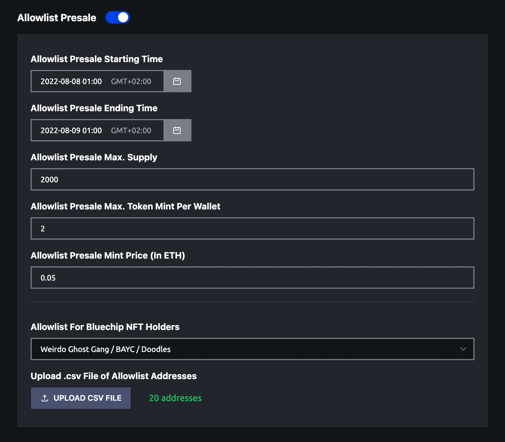
		
		- 关于白名单预售

			白名单是获取预先批准用于铸造的钱包地址列表的过程，通常在公开销售阶段之前。白名单地址的用户还可以获得额外的好处，例如更低的铸币价格。

			允许名单可以通过社区活动分发或赠送给其他蓝筹 NFT 持有者，以获得其他社区的支持。

			进入白名单并不总能保证您成功铸造 NFT，因为白名单位置可能被过度分配，而不是最大 NFT 供应取决于项目。
			使用 ManeSTUDIO，您可以选择将许可名单授予选定的 Bluechip NFT 持有者或上传包含钱包地址的 .csv 文件。
			
			- 白名单预售开始时间

				白名单地址可以开始铸造的时间点。通常在公开发售开始时间前 6-24 小时。
		- 白名单预售结束时间

			许可名单预售结束的时间点。通常在公开发售开始前几个小时，或在公开发售开始前。
		- 允许名单预售供应上限。

			可以在许可名单预售阶段铸造最大 NFT。通常小于 NFT 的总供应量。
		- 允许名单预售上限。

			允许列表中的每个地址都可以铸造最大的 NFT。通常有 1-5 之类的限制，因此允许列表地址有机会铸造您的 NFT 更为公平。
		- 白名单预售铸币厂价格（以 ETH 为单位）

			白名单预售阶段每个 NFT 的价格。通常低于或等于公开售价。
			
			- 时尚 NFT 持有者的许可名单

				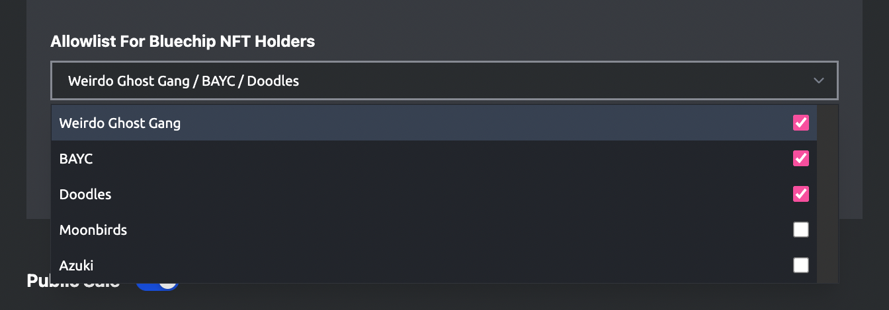
				
				您可以选择将许可名单授予时尚的 NFT 持有者。在钱包中拥有选定 NFT 代币的持有者可以在许可名单预售阶段铸造您的项目。
					
				这是一种获得支持的方式，也许是其他 NFT 社区的一些建议。
		- 上传允许列表地址的 .csv 文件

			上传包含钱包地址列表的 .csv 文件，每行一个地址。地址通常是从社区活动中收集的。
	- 公开发售

		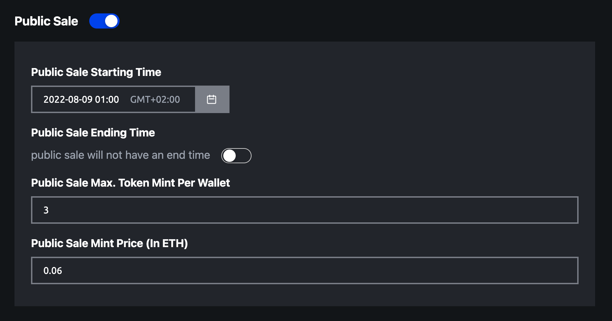
		
		- 关于公开发售

			NFT 项目的公开销售以先到先得的方式进行。公开销售对所有钱包地址开放。当许可名单预售后剩余供应量的需求较高时，一些 NFT 交易者可能会使用机器人或提高 gas 来加快铸币速度，以确保他们能得到一个。这有时会导致我们所说的“ gas 战争”。
		- 公开发售开始时间

			所有地址都可以开始公开铸币的时间点。通常在许可名单预售阶段结束后开始。
		- 公开发售结束时间

			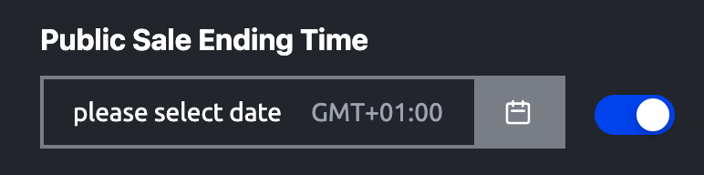
			
			结束时间是可选的。如果您启用此功能，销售将在您决定时结束，如果您还剩下未铸造的 NFT 代币，它们将永远保持未铸造状态。如果禁用此功能，销售时间将持续到所有 NFT 都被铸造出来。

				请注意，一旦设置了此时间，就不能再对其进行编辑。小心。
		- 公开销售 每个钱包的代币铸币厂

			在公开销售阶段，每个地址可以铸造最大的 NFT。
		- 公开销售铸币价格（以 ETH 计）

			公开销售阶段每个 NFT 的价格。
	- 延迟披露

		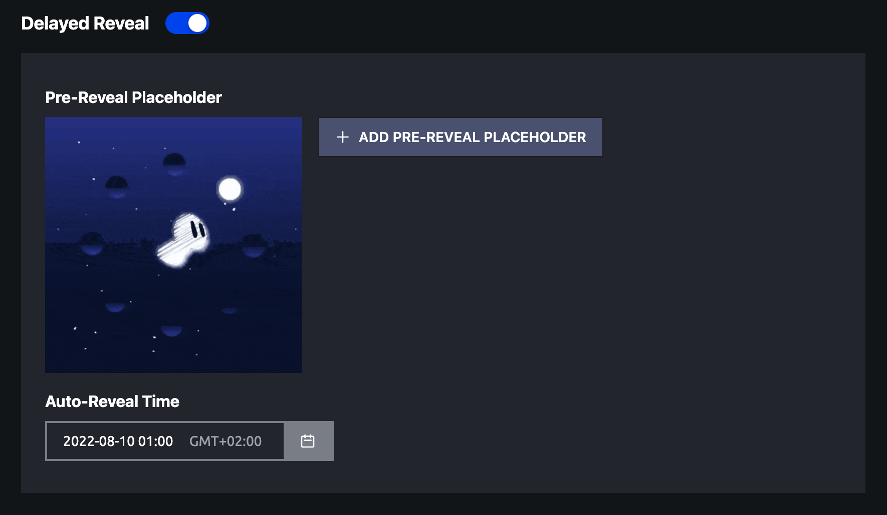

		延迟显示是我们建议您启用的可选功能。在披露发生之前，所有 NFT 和元数据都被隐藏并在二级 NFT 市场上作为盲盒进行交易。请添加占位符，否则它将在市场上显示为损坏的图像。

		时间到了，会自动显示，稀有度将由第三方服务（如特质狙击手）计算。

		如果禁用延迟显示，则 NFT 会在铸造时同时显示
	- 溢出收益

		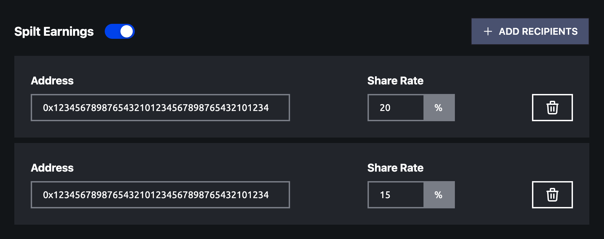

		您可以选择启用溢出收益功能，以便与合作者或项目合作伙伴无缝分配资金。当您在托管期后提取资金时，溢出会自动发生，您的决定将公开显示在您的 ManeSPACE 铸币页面上。
- 部署在测试网上

	您现在将智能合约部署到区块链。ManeSTUDIO 建议创作者在对 ETH 主网进行更改之前先在测试网上进行部署，以避免错误和浪费。
	
	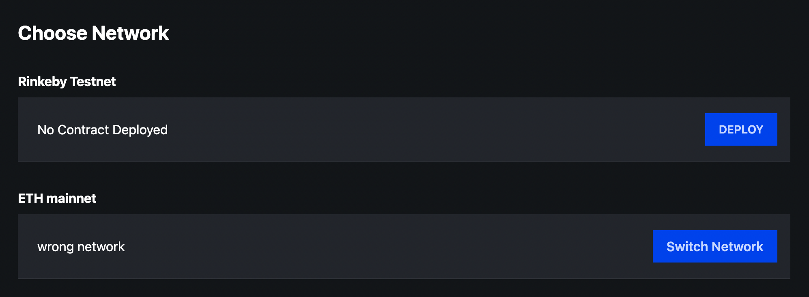
	
	- 在测试网上部署

		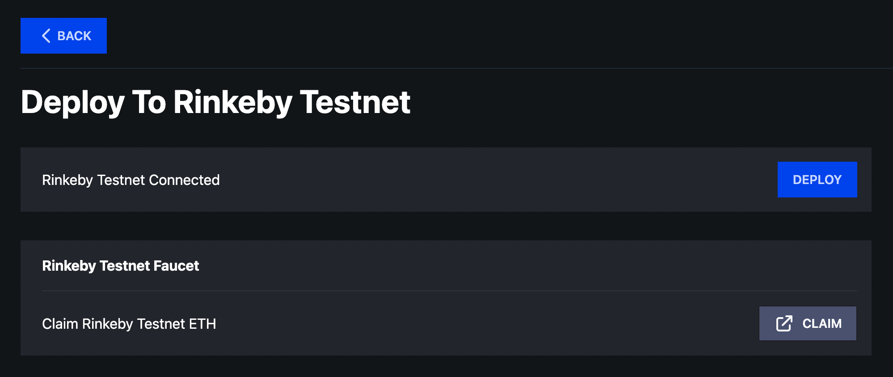
		
		测试网模拟真实世界的以太坊区块链环境，您可以进行更改并使用您可以免费索取的测试 ETH 代币。您甚至可以在 Opensea 上测试铸币并查看您的 NFT 收藏。
	- Rinkeby 测试网

		Rinkeby 测试网是最受欢迎的测试网之一。Opensea 和 Rarible 在 Rinkeby 测试网上也有他们的市场，因此您还可以在将智能合约部署到主网上之前在二级市场上检查您的 NFT。
	- Rinkeby 测试网水龙头

		要在 Rinkeby 测试网上进行交易，您需要一些 Rinkeby 测试 ETH。您可以通过以下水龙头免费领取 Rinkeby
		
		- https://faucets.chain.link/rinkeby
		- https://rinkebyfaucet.io/
		- https://faucet.paradigm.xyz/
- 在测试网上管理和重新编辑智能合约

	在部署到 ETH 主网之前，检查和管理 Rinkeby 合约上已部署的合约。

	- 管理智能合约
	
		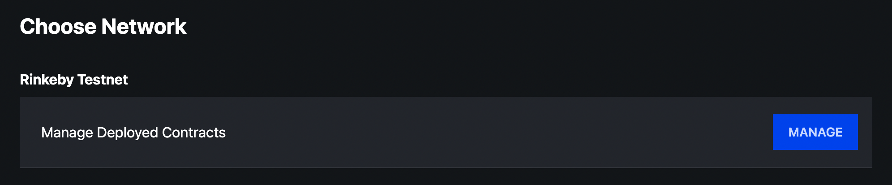
		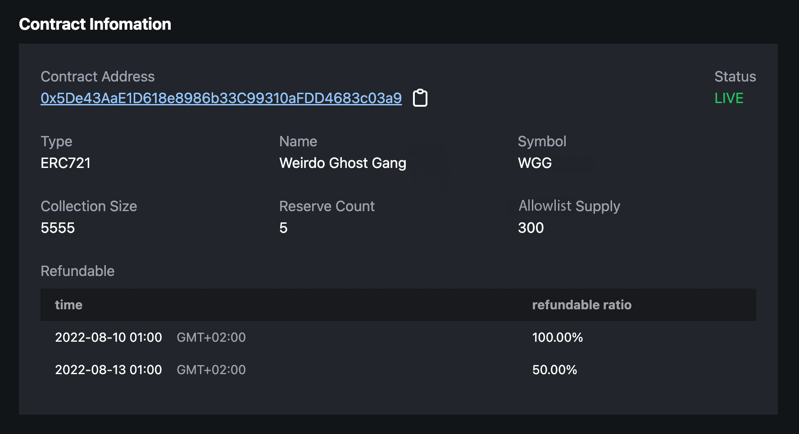

		成功部署到 Rinkeby 测试网后，您可以在此处管理已部署的合约。时间、价格和许可名单地址等参数始终可以在之后进行编辑。

		在主网上部署之前，请确保一切正确。

		但是，合约名称、符号和退款等一些功能是例外的，如果要更改这些功能，则必须使用紧急按钮销毁测试网合约，然后返回编辑器并重新部署。

			铸币阶段开始时间/结束时间、铸币价格、许可名单等参数始终可以在测试网和 ETH 主网中更新。

			根据您所做的更改，可能会收取汽油费。
	- 紧急按钮功能

		
		
		- 暂停合同

			如果有任何紧急情况，您可以暂时暂停您的智能合约，稍后再恢复。
		- 销毁合约

				此功能仅适用于 Rinkeby 测试网合约。一旦你部署到 ETH 主网，它就不能再次被销毁。我们已经重复了很多次，请在部署到合约之前确保一切正确。否则你是在浪费气体，你必须重新启动整个项目。
			要更改合约名称、符号和退款等功能等参数，如果您尚未铸造任何 NFT，您可以销毁此测试网合约并使用正确的设置再次部署它。否则，我们建议您开始一个新项目。
				
				在这种情况下，保留的 NFT 不被视为铸造的 NFT。
		- 白名单管理

			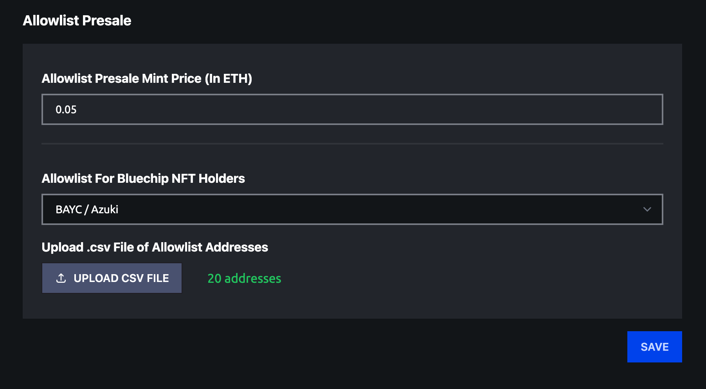
			
			允许列表信息存储在服务器上，而不是存储在智能合约中，以节省气体使用量，并允许您自由更新允许列表。如果您想更新白名单，只需上传新的 .csv 文件或添加/更改已检查的蓝筹 NFT。

			经常有一些社区成员错过了地址提交的最后期限，并在铸币开始前寻求帮助。

					“你的项目，你的规则。”
			决定是否让他们进入始终是您的选择，但从技术上讲，我们确实为您提供了这样做的可能性。
		- 延迟披露管理

			
			
			延迟显示占位符也可以更新。如果 NFT 已经被铸造，这种变化可能需要一段时间才能对二级市场产生影响。
- 主网部署

	在测试网上部署合约并确保一切正确后，您就可以将其部署在 ETH 主网上。
	
	- 切换到以太坊主网
	
		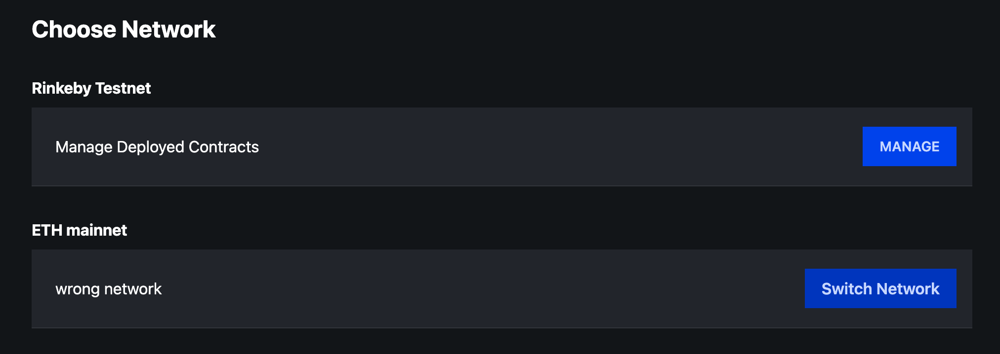
	- 在 Metamask 弹出窗口中确认，然后选择部署

		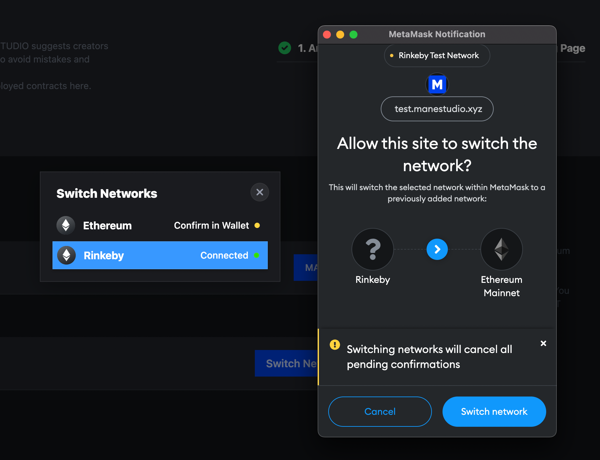

	单击“DEPLOY”后，将提交交易。这是您需要使用 ETH 支付部署费用的步骤。

	- 在 ETH 主网上部署我的智能合约需要多少费用？

		这取决于。你的钱包建议的gas费是根据以下计算得出的：
		
		- 01. 网络情况

			您可以在此处查看当前 GAS [以太坊gas 追踪器](https://etherscan.io/gastracker) 
		
			当前的 gas 费用越高，它的成本就越高。

			如果当前的汽油费很高，我们强烈建议您稍等片刻。要了解“gas”的含义和工作原理，请查看[这里](https://ethereum.org/en/developers/docs/gas/)​​​
		- 02. gas 使用

			你的智能合约的复杂程度也会影响 gas 费用，因为 gas 的使用可能会有所不同。

			您在设置智能合约时启用的功能越多，智能合约就越复杂，因此成本越高。
		- 03. 预留 NFT

			如果您启用了 NFT 预留，则在您部署合约时，预留的 NFT 将被铸造到您的钱包中。这将花费更多的燃料来执行交易。
			你保留的 NFT 越多，成本就越高。
- 管理 ETH 主网上的智能合约

	管理仪表板与 Rinkeby 测试网管理非常相似。只有“销毁合约”功能被禁用。

	当您认为有必要时，您仍然可以自由编辑时间、价格、许可名单。

		仅在必要时进行更改，并确保将这些决定告知社区。

### 第三步 铸币页面
建立一个网站供人们铸造您的 NFT 并使用 ManeSTUDIO 网站工具检查项目信息

- 铸币页面设置

	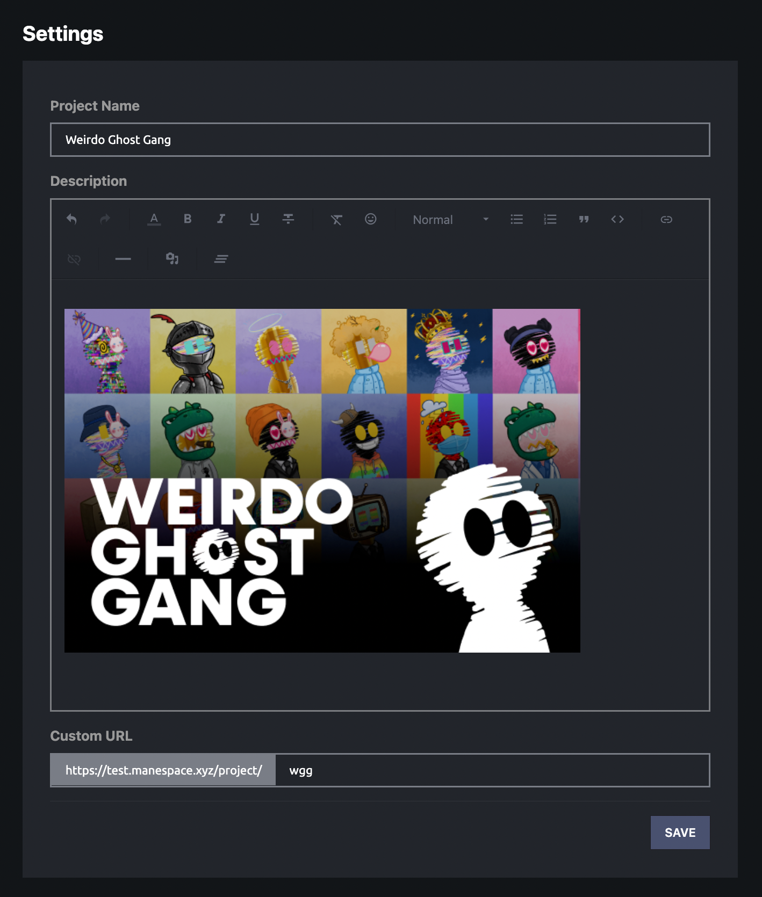
	
	您可以将铸币页面作为您项目的官方网站，放置一些信息和背景故事，以便人们更多地了解您的项目。
文本编辑器非常强大，您可以添加媒体、列表、引用和链接来详细描述您的项目。
链接到您的铸币网站的 URL 可以自定义和更新。
- 画廊

	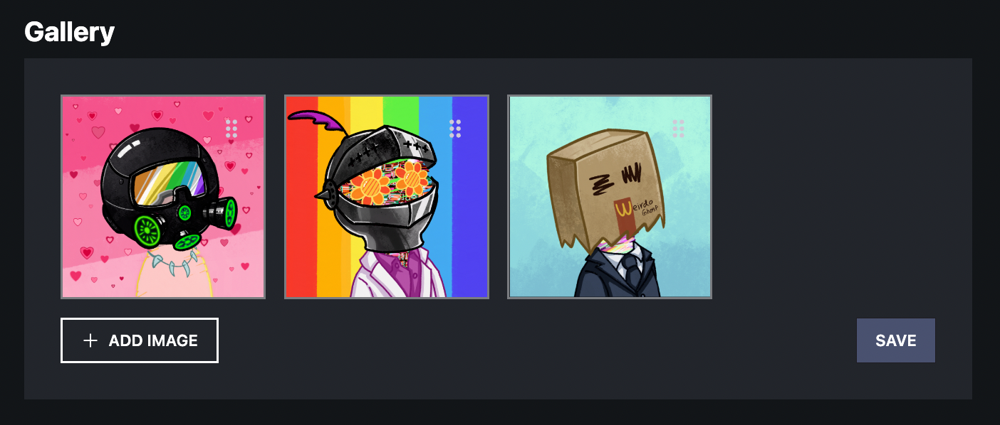
	
	Gallery 是您添加项目视觉效果和偷拍的地方，上传的图片将显示在 ManeSPACE 上。

	推荐的纵横比为 1:1。
- 创作者

	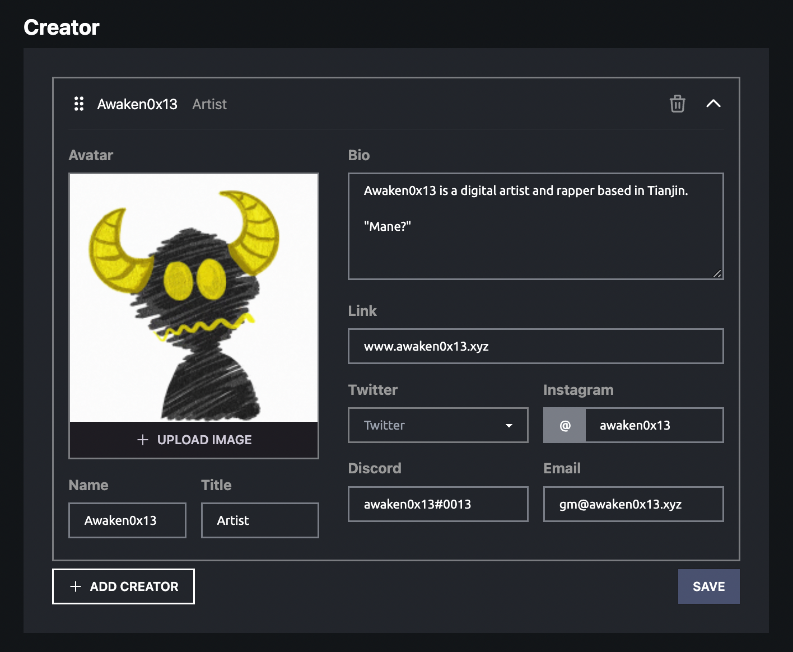
在此处添加创建者 BIOS。您可以添加多个创建者。
	
	- 推特验证

		如果您想绑定您的 Twitter 帐户，您将需要验证您有权访问 Twitter 帐户以防止冒充。	
		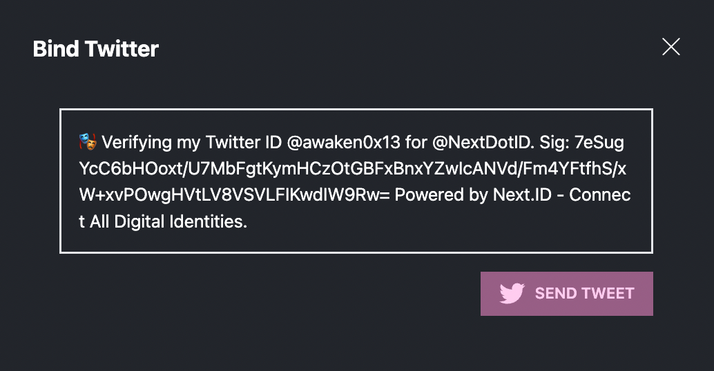	
- 路线图

	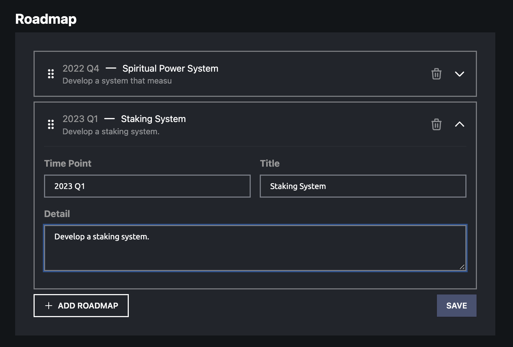

	- 路线图告诉您项目的里程碑。
	- 您可以单击“添加路线图”添加更多内容块。
	- 设定你的目标，然后建造！
- 嵌入式铸造 按钮

	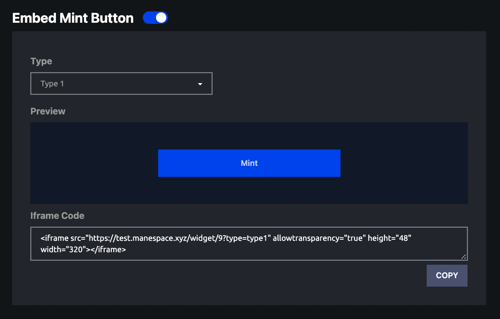
	Embedded Mint Button 是一个 iframe 组件。如果您想使用自己的网站，请选择按钮类型，然后复制 mint 按钮的 iframe 代码。		

### ManeSPACE
ManeSPACE 是一个主要的 NFT 启动平台，您的 NFT 可以在其中铸造。它包含您的铸币页面，主页汇总了使用 ManeSTUDIO 创建的所有项目。

将您的项目发布到 ManeSPACE 后，会创建一个特殊链接，人们可以在该链接中查看您的项目详细信息，并在铸币开始时直接铸币。

- 申请退款

	底部有“我的 NFT”部分，您可以在其中概览您拥有的 NFT。如果创建者已将此项目设为可退款，并且您希望在退款​​期限内申请退款，请单击 ⋮ 按钮，然后按照说明进行操作。

		当您申请退款时，资金将退回到您的钱包，NFT 将退回到创作者的钱包。您收到的确切金额取决于该退款期的可退还比率。
		当您要求退款时，将收取燃气费。

### 设置版税
NFT 领域的一个很棒的功能是能够从创作者的二次销售中收取版税，当我们谈论传统艺术市场时，这很难想象。

	启动项目后，在二级市场设置版税非常重要，以确保您不会错过任何交易版税。
使用 ManeSTUDIO 创建的合约符合大多数二级 NFT 市场的合约标准，例如 Opensea、Element、LooksRare、Rarible 和 x2y2。

当您使用用于创建合约的钱包连接这些市场时，您的 NFT 集合将自动出现或者您可以简单地导入它。

	目前，ManeSTUDIO 不支持合约级别的版税设置，请确保您访问市场并单独设置版税。

我们从主流市场收集了以下信息，以指导您设置版税。

- [opensea](https://support.opensea.io/hc/en-us/articles/1500009575482-How-do-creator-earnings-work-on-OpenSea-)
- [element](https://docs.element.market/welcome-to-element/spotlight/getting-started/how-do-creators-set-royalty#start-setting-your-royalty)
- [looksrare](https://docs.looksrare.org/guides/collection-management/set-or-edit-collection-royalties)
- [rarible](https://rarible.medium.com/list-your-collection-on-rarible-com-for-secondary-sales-with-multiple-royalties-512cf4221f6)
- [x2y2](https://docs.x2y2.io/guides/collection-management/manage-your-collection)

		【警告：自 2022-08-26 起，x2y2 允许买家自行决定版税，您很可能无法从 x2y2 的销售中获得任何版税。】
		
### 提款
从主要销售中索取您的收入。

- 我如何索取我的收入？

	祝贺你的项目！您现在可以去合约管理并在基金托管期结束后从初次销售中索取您的收入。

	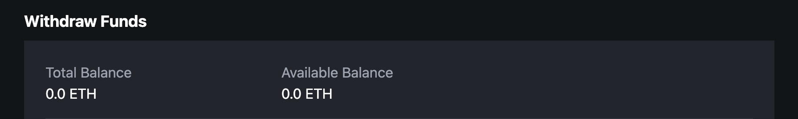
	
	在 7 天的资金托管期后，可以从主要销售中提取资金。在所有退款期结束之前，您的部分资金可能会一直托管。
ManeSTUDIO 3.3% 的服务费已从总余额中扣除。

	[服务条款](https://docs.manestudio.xyz/legal/terms-of-service)信任和责任部分了解更多关于资金管理的信息。
- 溢出收益如何？

	当您启用了溢出收益功能时，当您提取资金时，溢出将无缝发生。资金根据您的设置分为几部分，并发送到收款人的钱包地址。
- ManeSTUDIO如何收取3.3%的佣金？
	- ManeSTUDIO 会自动从您项目的初次销售中收取 3.3% 的费用，您无需手动支付。
	- 总余额和可提现余额已扣除 ManeSTUDIO 的服务费。
	- 3.3%的服务费用于产品开发、怪人回购、未来品牌发展。

### 售后更新元数据
- 售后还能编辑 NFT 吗？

	只允许更新特征名称，以防出现拼写错误。

	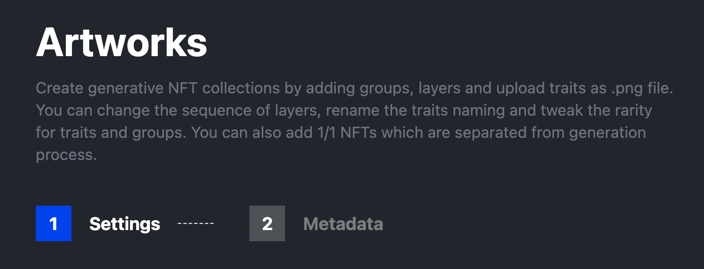
	为此，请返回艺术品 - 设置，您将能够重命名特征。

		如果您在不同组中有多个特征共享相同名称以进行合并，则需要重命名所有特征，否则元数据可能会混乱，并且稀有度计算中可能会发生不需要的更改。
- 我可以更换或更新特定 NFT 代币的艺术品吗？

	不可以。为确保 NFT 持有者的公平性，艺术品一旦生成，您不得更新。

	如果您遇到这方面的问题，并且您认为更换艺术品是解决问题的唯一方法				
## 参考
[https://docs.manestudio.xyz/](https://docs.manestudio.xyz/)