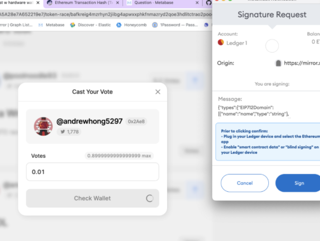

## Mirror 使用手册中文版-代币竞赛块(Token Race)
Mirror 支持创建代币竞赛，这是我们自己的 [$WRITE Race](https://mirror.xyz/race) 的衍生产品。Token Race 是一个简单的基于持续时间的治理工具，允许上传提案并允许社区根据他们在某个时间点持有的特定 ERC20 代币或 ERC721 代币 (NFT) 对提案进行投票。
### 代币竞赛如何运作?

- 创建代币竞赛

	您可以通过转到从仪表板创建代币竞赛 `/dashboard/token-race`。
	
	

	为了创建代币竞赛需要指定有关代币竞赛的一些详细信息，例如
	
	- 名称
	- 描述
	- 要使用的 ERC20 代币地址
	- 开始日期
	- 结束日期
	- 要突出显示的获胜者数量用户界面

	还需要以 CSV 格式上传您希望社区投票的提案。列是（按顺序）：

	wallet address (required) | body (required)|twitter handle (optional)
	---|---|---|

	注意：请确保 CSV 中的列正确，上传后可以看到预览。

	
	
	要查看如何构建 CSV 的示例，请查看[示例](https://docs.google.com/spreadsheets/d/1ar9kAMcSFWFsctYKyW7gm9b-z0pM7T3gmgBOJHF_nNU/edit?usp=sharing)。

	所有代币竞赛数据均可通过 IPFS 访问，并通过 [Estuary](https://estuary.tech/) 存储在 Filecoin 网络上。
	
	创建代币竞赛后，您可以单击仪表板中的代币竞赛以转到代币竞赛页面。
- 代币快照
	
	我们对 ERC20 代币（或 ERC721 代币 ID）的所有余额进行快照，以确定投票权。投票权是 1:1 与他们的 ERC20 代币余额，四舍五入到合约指定的最接近的小数。
	
	对于拥有多个持有代币的多重签名地址的用户，投票权是所有这些代币的总和。
	
	快照总是在代币竞赛开始时间前 3 小时拍摄。
	
	快照数据在代币竞赛页面（外部链接）的页脚中可见。

	
- 删除代币竞赛

	您可以在代币竞赛上线之前从仪表板中删除它。您只能在它们上线之前删除代币竞赛。您无法删除已结束的代币竞赛。删除代币竞赛会将其从Mirror UI 中删除，但数据将继续存在于 IPFS 上?	
	
	
- 获取 ERC20 地址

	您可以从 [Etherscan](https://etherscan.io/) 的 Token Explorer 部分获取 ERC20 地址。
- 获取 ERC721 的代币 ID

	要使用 ERC721 (NFT) 创建代币竞赛，您需要 ERC721 合约地址、合约中的代币 ID（每个 ID 都是 NFT），以及您希望分配给每个 NFT 所有者的投票数.
- 为提议者链接推特

	创建代币竞赛后，您可以要求您的提议者去 Mirror 主页链接他们的推特账户。一旦他们链接了他们的帐户，他们的推特详细信息将与他们的提案一起显示在您的代币竞赛页面上。
- 投票的工作原理

	选民连接他们的钱包，这会显示他们当前的投票权。投票权由 ERC20 代币的余额决定。

	选民可以随意分配他们的选票。
- 多重签名投票

	Token Race 支持代表多重签名账户投票，而不需要多重签名持有者使用多重签名签署他们的投票。为了代表多重签名投票，请将您的多重签名地址添加到代币竞赛页面。一旦通过验证，您就可以代表多重签名进行投票。	
	考虑到用户被列为多重签名的所有者，用户可以代表任意数量的多重签名投票。

	当用户投票时，他们会看到一个下拉选项代表他们的多重签名投票。

### 使用 Ledger 硬件钱包 + metamask 进行投票
代币竞赛支持使用 Ledger 硬件钱包 + metamask（仅限桌面）进行投票。为了用你的硬件钱包投票，你应该：

1. 使用 Ledger Live 确保您的 Ledger 使用最新固件
- 确保您的 Metamask 扩展也是应用商店提供的最新版本
- 如果其中任何一个已过时，则集成将不起作用
- 插入您的 Ledger 设备并选择 Ethereum 应用程序
- 将您的硬件钱包连接到 metamask，并访问代币竞赛页面
- 如果您还没有在 Ledger 设备上启用“智能合约数据”或“盲签名”
- 通过点击“连接钱包”按钮同步您的钱包，您应该会看到您对硬件钱包的投票权

		
- 一旦你分配了选票并投票，Metamask 会提示你从你的硬件钱包中签署消息

		
- 在 metamask 上点击“签名”后，您会在硬件钱包上看到一个弹出窗口，要求您签署交易
- 通过点击右侧按钮完成这些步骤，然后确认“签署消息”
- 返回代币竞赛页面，您将看到带有“投票”消息的模态文本更新

	
- 几秒钟后，模态将关闭，页面将更新以反映您所投的票。您还会注意到分配选票后您的投票权有所下降