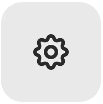

## Mirror 使用手册中文版-参赛作品块 (Entries)
参赛作品是一种使 Mirror 上的文字成为限量版 NFT 收藏品的方式。您需要做的就是在参赛作品中添加封面图片并创建您的帖子。
### 层级
参赛作品按层级定价，让您最大的粉丝能够获得有价值和独特的东西，同时也可以让您的所有读者以可承受的价格点收集东西。定价和供应如下：

- 传奇, 5/5, 1 ETH
- 稀有，50/50，0.1 ETH
- 普通，500/500，0.01 ETH

### 铸造你的参赛作品
在仪表板(Dashboard)内的设置参赛作品，使您的帖子具有收藏价值。

- 封面图片设置
	- 首先

		为您的帖子选择封面图片。将您的参赛作品视为一本精美杂志的精选社论。可视化它的最佳方法是什么？包括一个漂亮的背景图片和一个大标题！
	- 然后

		导航到编辑器右上角的参赛作品设置

		
	
		在设置中上传您的封面图片。封面图片应为 2880 x 1440 像素，以便在各种设备上看起来都很棒。

		如果您的封面图片包含帖子的标题，请勾选“在参赛作品中隐藏标题”以避免出现多余的标题。
		
		
		
		您可以在上传完成后关闭设置。
- 铸造 NFT

	现在，勾选编辑器右上角的“NFT”。

	
	
	点击“保存”或“发布”以创建参赛作品。您会看到一个带有封面图片的确认模式弹出。
- 资金接受者

	指定您希望从 NFT 销售中接收资金的位置。这可能是您自己的钱包地址，但也可以是以太坊上能够接收 ETH 的任何地址，包括拆分(Splits)！
	
	如果一切看起来都不错，请按“发布和铸造参赛作品”。
	
	系统会提示您确认钱包中的交易。交易确认后，您的参赛作品将成为收藏品！

	导航到参赛作品的链接是永久性的，使用它以查看它并与您的读者分享。