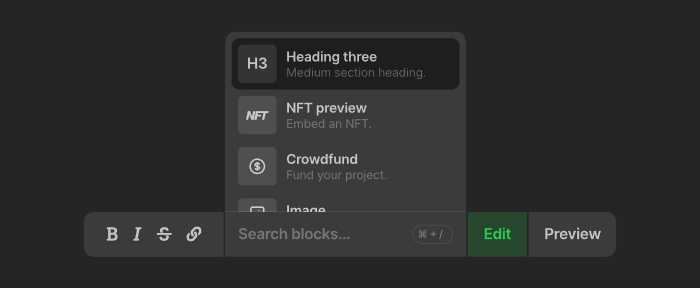
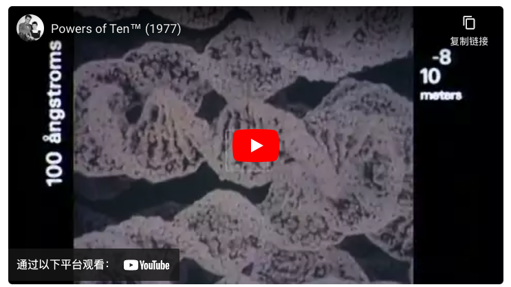
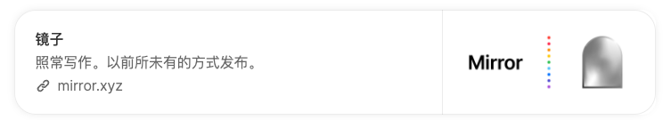
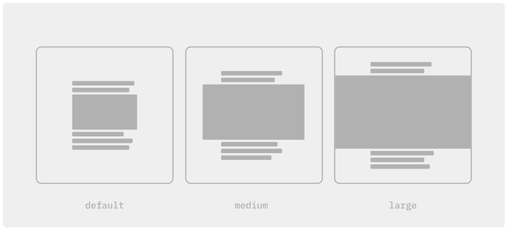

## Mirror 使用手册中文版-编辑工具讲解
Mirror 编辑器允许使用媒体块（例如图像和视频）以及加密经济块（例如众筹和拍卖）来撰写参赛作品。它使用纯文本和 Markdown 以及一些格式约定。
### 模式
合成发生在 `Edit` 模式中。要预览您的参赛作品，请进入 `Preview` 模式,因为它将出现在您的出版物中。您可以使用工具栏中的相关按钮在它们之间切换。
### 导入参赛作品
要从其他地方导入参赛作品，例如 Medium 或 Substack，请打开 `•••` 导航中的二级菜单，然后单击倒入参赛作品 `Import entry`。

接下来，输入您的参赛作品的 URL。url 将被解析为 markdown，并设置为您的参赛作品的内容。请仅导入您创建和拥有的内容。
### 创建块
要轻松创建媒体或经济区块，请先在参赛作品内单击以将光标放置在您希望区块出现的位置。接下来，单击工具栏的块区域或使用键盘快捷键聚焦 `⌘+/`。将出现块菜单，显示所有可用的块。选择一个块会提示您输入辅助信息。满意后，请确认信息以将块插入到您的参赛作品中。

### 块
Mirror 上的媒体嵌入和经济块通过简单的格式约定进行识别：在它自己的文本行上有一个单独的链接。要手动创建块，请插入新的文本行，添加链接，然后添加换行符。请确保新行只包含一个链接。

这是一个创建 Youtube 视频嵌入的示例。

	Powers of Ten illustrates the universe as an arena of both continuity and change, of everyday picnics and cosmic mystery.
	
	[Powers of Ten](https://www.youtube.com/watch?v=0fKBhvDjuy0)
	
	We hear about scale every day, whether it be supertankers, stars burning thousands of lightyears away, the study of microscopic viruses, or global warming. Understanding scale, or as the Eameses said, “the effect of adding another zero,” has the power to make us better scholars and better citizens.
	
	

下面代码将测试在 mirror 显示

[Powers of Ten](https://www.youtube.com/watch?v=0fKBhvDjuy0)

### NFT
Mirror 上的参赛作品可以铸造为 NFT。要将您的参赛作品创建为 NFT，请选中参赛作品编辑器右上角的 NFT 复选框。为您的参赛作品上传封面图片，以便它可以在不同的 NFT 平台上呈现。一旦您的 NFT 在链上铸造，您将在参赛作品的署名行中看到确认。
### 众筹
在 Mirror 上，任何人都可以使用众筹块为想法或项目筹集资金。在幕后，众筹是以太坊上的智能合约。粉丝存入 ETH 来资助您的想法以换取代币。代币代表赞助证明和项目潜在成功的股份。众筹可以嵌入到 Mirror 上的任何参赛作品中，以及讲述您项目故事的文本和其他媒体块。
### 拍卖
[创建拍卖](https://mirror.xyz/dashboard/auctions)并部署它。部署后，该嵌入拍卖部分将显示一段代码。将其复制并粘贴到参赛作品中。它应该类似于下面的示例，但带有您的专用拍卖地址和tokenID.

	[Token #1522](auction://0xabEFBc9fD2F806065b4f3C237d4b59D9A97Bcac7?network=mainnet&tokenId=1522)

下面代码将测试在 mirror 显示

[Token #1522](auction://0xabEFBc9fD2F806065b4f3C237d4b59D9A97Bcac7?network=mainnet&tokenId=1522)

### 图片
可以通过拖放到编辑器中、在块菜单中选择图像或手动创建降价图像标签来嵌入图像。通过定义 width 和 height 查询参数可以在加载之前保留图像的空间，这些参数在将图像上传到 Mirror 时自动设置。

	

### 链接预览
Mirror 显示基于 OpenGraph 标签通用标准的所有链接的渐进增强预览。

	[Mirror](https://mirror.xyz)	

下面代码将测试在 mirror 显示

[Mirror](https://mirror.xyz)

### 推特
通过插入指向任何 Twitter URL 的链接来嵌入单个推文或整个推文主题。

	[Mirror’s first tweet](https://twitter.com/viamirror/status/1325856116748726273)
	

下面代码将测试在 mirror 显示

[Mirror’s first tweet](https://twitter.com/viamirror/status/1325856116748726273)
### youtube

	[Powers of Ten](https://www.youtube.com/watch?v=0fKBhvDjuy0)

下面代码将测试在 mirror 显示

[Powers of Ten](https://www.youtube.com/watch?v=0fKBhvDjuy0)

### 视频嵌入
.mp4 通过插入指向外部托管视频文件的链接来嵌入视频。也可以设置 `autoplay`，`muted`，`loop` 并 `controls` 通过设置相关的查询参数。确保您手动定义 `width` 和 `height` 参数以保留视频的垂直空间。

	[Powers of Ten](https://jkm-library.s3.amazonaws.com/blocks/powers-of-10.mp4?height=480&width=640&autoplay=true&loop=true&muted=true)

下面代码将测试在 mirror 显示

[Powers of Ten](https://jkm-library.s3.amazonaws.com/blocks/powers-of-10.mp4?height=480&width=640&autoplay=true&loop=true&muted=true)

### 框架
可以通过创建 iFrame 块来嵌入任何页面。例如，这在嵌入交互式 WebGL 内容时很有用。只需设置display=iframe为查询参数。

	[ThreeJS Demo](https://threejs.org/examples/webgl_water_flowmap.html?display=iframe)

下面代码将测试在 mirror 显示

[ThreeJS Demo](https://threejs.org/examples/webgl_water_flowmap.html?display=iframe)		
### 版面尺寸
如果您希望为您的参赛作品创建更具编辑性的布局，请考虑为某些媒体块设置自定义布局大小。支持的块类型包括图像、视频、Youtube 和 iFrame。

块大小通过查询参数设置，可以从medium和 中进行选择large。例如，下面是一个large延伸到页面边缘的图像。

	

	
	
### 未来的增强
Mirror 是一个新项目，我们的编辑有意识地专注于我们快速行动以创建新的经济工具来资助伟大的写作。随着时间的推移，我们计划引入一个新的编辑器，它支持就地编辑，无需在编辑和预览模式之间切换。在此之前，我们感谢您的耐心等待，并欢迎任何反馈。