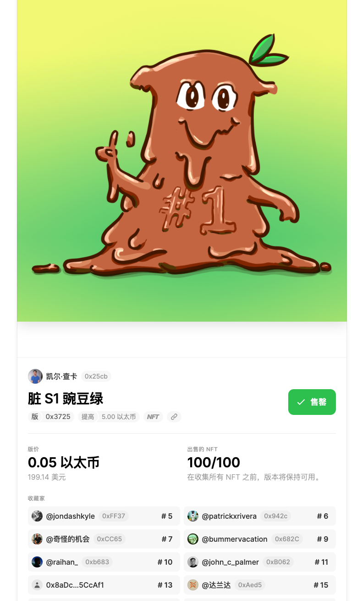

## Mirror 使用手册中文版-限量版块(Editions)
限量版本是创作者以固定价格铸造有限供应的相同 NFT 的一种方式。如果 1/1 NFT 是毕加索的苏富比，那么限量版本就像发布的数以千计的第一版全息喷火龙。

Mirror 上的限量版本配置有四个参数

- 价钱
- 媒体文件（我们目前支持.jpg，.png，.gif，和.mp4）
- 总供应量
- 资金收款人地址

与 Mirror 上的其他区块一样，您的限量版本作为智能合约部署，可以嵌入任何 Mirror 参赛作品中。

### 用例
限量版本可用于

- 铸造数字收藏品
- 创建社区成员
- 代表分层奖励

### 启动 NFT 版本
- 上传媒体文件

	目前支持.jpg, .png, .gif, 和.mp4
- 添加标题和描述

	当嵌入参赛作品中时，标题和描述将显示在限量版本块中。
- 设定价格和供应

	可以根据限量版本目标设置自定义 ETH 价格和供应上限。例如，可以设置高价和低供应来表示稀有。另一方面，你可以设置低价高供应，让更多人参与和接收 NFT。

	如果想最大限度地提高社区参与度，您可以通过 1/1 保留拍卖加上一些版本来开展活动。

	例如：

	- 通过储备拍卖获得 1/1 黄金 NFT
	- 0.5 ETH 的 10/10 白银 NFT
	- 0.1 ETH 的 100/100 青铜 NFT

### 嵌入限量版本 
限量版本部署嵌入 `Embed`  后，仪表板的版本页面部分将显示一段代码。将其复制并粘贴到参赛作品中。它应该类似于下面的示例，但带有您的专用版本地址和限量版本 .

例如，此代码在本指南的顶部嵌入了版本。

	[Dirty S1 Pea Green](edition://0x3725CA6034bcDBc3c9aDa649d49Df68527661175?editionId=2)

下面代码将测试在 mirror 显示

[Dirty S1 Pea Green](edition://0x3725CA6034bcDBc3c9aDa649d49Df68527661175?editionId=2)