# Mirror 使用手册中文版
顺序按照下图

## 参赛作品块 (Entries)
参赛作品是一种使 Mirror 上的文字成为限量版 NFT 收藏品的方式。您需要做的就是在参赛作品中添加封面图片并创建您的帖子。
### 层级
参赛作品按层级定价，让您最大的粉丝能够获得有价值和独特的东西，同时也可以让您的所有读者以可承受的价格点收集东西。定价和供应如下：

- 传奇, 5/5, 1 ETH
- 稀有，50/50，0.1 ETH
- 普通，500/500，0.01 ETH

### 铸造你的参赛作品
在仪表板(Dashboard)内的设置参赛作品，使您的帖子具有收藏价值。

- 封面图片设置
	- 首先

		为您的帖子选择封面图片。将您的参赛作品视为一本精美杂志的精选社论。可视化它的最佳方法是什么？包括一个漂亮的背景图片和一个大标题！
	- 然后

		导航到编辑器右上角的参赛作品设置

		
	
		在设置中上传您的封面图片。封面图片应为 2880 x 1440 像素，以便在各种设备上看起来都很棒。

		如果您的封面图片包含帖子的标题，请勾选“在参赛作品中隐藏标题”以避免出现多余的标题。
		
		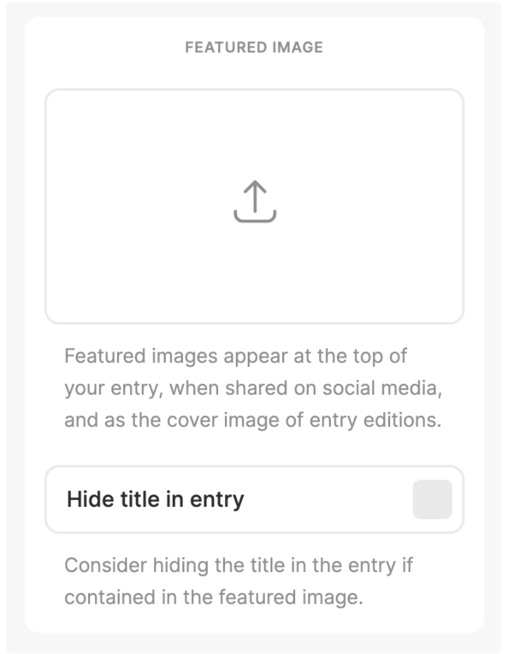
		
		您可以在上传完成后关闭设置。
- 铸造 NFT

	现在，勾选编辑器右上角的“NFT”。

	
	
	点击“保存”或“发布”以创建参赛作品。您会看到一个带有封面图片的确认模式弹出。
- 资金接受者

	指定您希望从 NFT 销售中接收资金的位置。这可能是您自己的钱包地址，但也可以是以太坊上能够接收 ETH 的任何地址，包括拆分(Splits)！
	
	如果一切看起来都不错，请按“发布和铸造参赛作品”。
	
	系统会提示您确认钱包中的交易。交易确认后，您的参赛作品将成为收藏品！

	导航到参赛作品的链接是永久性的，使用它以查看它并与您的读者分享。

## NFT 块
### NFT的参赛作品
Mirror 上的参赛作品可以铸造为 NFT。要将您的参赛作品创建为 NFT，请选中参赛作品编辑器右上角的 NFT 复选框。

为您的参赛作品上传封面图片，以便它可以在不同的 NFT 平台上呈现。一旦您的 NFT 在链上铸造，您将在参赛作品的署名行中看到确认。

您可以通过编辑、选中 NFT 复选框并保存参赛作品来追溯创建以前的参赛作品。在仪表板的“参赛作品”选项卡下查看您的哪些参赛作品已被铸造为 NFT。

接下来，在拍卖指南中了解如何拍卖 NFT 。

### NFT 嵌入
通过创建链接嵌入 NFT。使用  `ethereum://`  协议作为 URL 前缀，后跟 `address/id`. 目前支持

- 图像
- 音频
- 视频
- 文本嵌入

Mirror 目前支持 EthBlock.art、Foundation、Rarible、SuperRare 和 Zora。

	[NFT Example](ethereum://0xb932a70a57673d89f4acffbe830e8ed7f75fb9e0/16297)
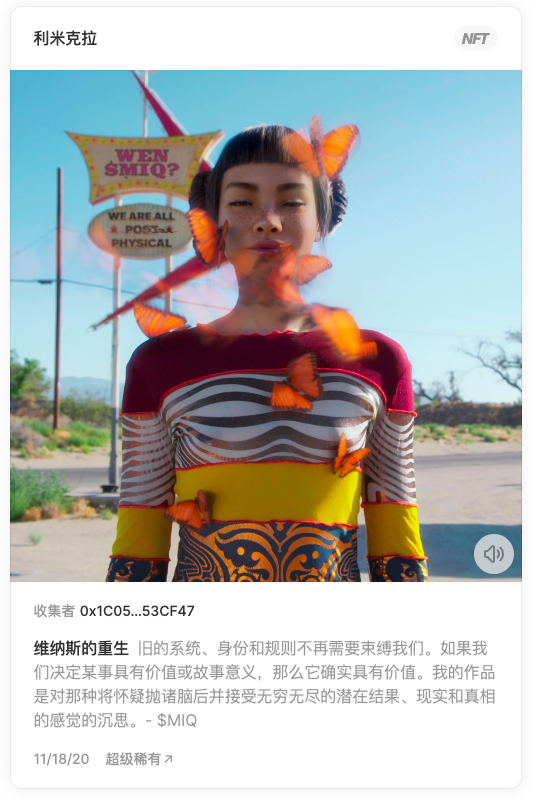

## 众筹块 (Crowdfund)
在 Mirror 任何人都可以使用众筹块为想法或项目筹集资金。在幕后，众筹是以太坊上的智能合约。粉丝存入 ETH 来资助您的想法以换取代币。代币代表赞助证明和项目潜在成功的股份。众筹可以嵌入到 Mirror 上的任何参赛作品中以及讲述您项目故事的文本和其他媒体块。

Mirror 上的参赛作品可以铸造为 NFT。要将您的参赛作品创建为 NFT，请选中参赛作品编辑器右上角的 NFT 复选框。为您的参赛作品上传封面图片，以便它可以在不同的 NFT 平台上呈现。一旦您的 NFT 在链上铸造，您将在参赛作品的署名行中看到确认。它最初发布的地方是 [出版物](https://mint.mirror.xyz/mDws2xGmJCq55ehGDdcv8tGDCpSd_c_CfeqhexiKSqU)。

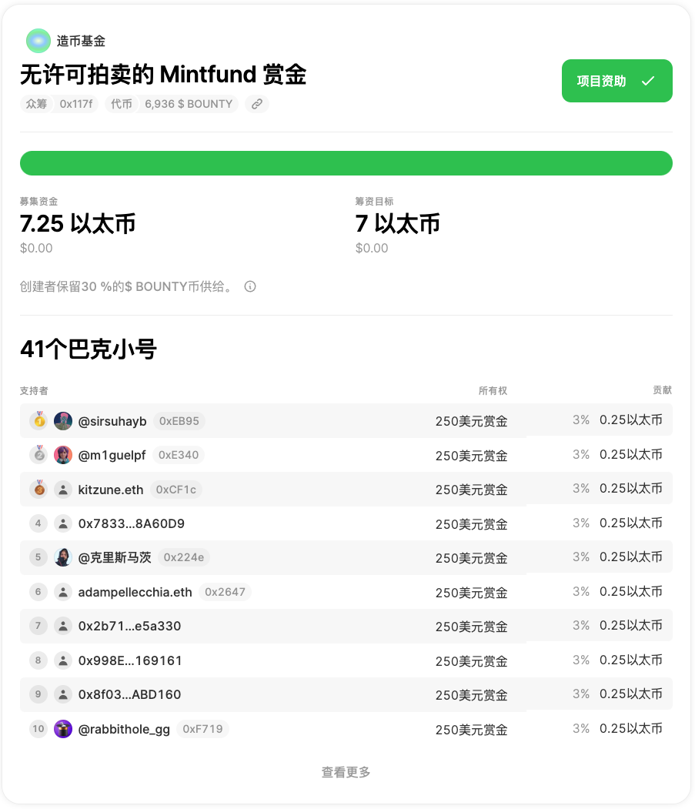

- 例子

	在 Mirror 上查看这些众筹以获取有关如何展示您的众筹的灵感。

	- [小说](https://emily.mirror.xyz/0AFENlMKv9amUC1OJIZY26udpISw_raXkoEcvelPvzg)
	- [赏金](https://mint.mirror.xyz/mDws2xGmJCq55ehGDdcv8tGDCpSd_c_CfeqhexiKSqU)
	- [一般](https://generalist.mirror.xyz/1T0h7VGDcECJuifK4TPDfRoUQ3zaO_tPwdZV-dtnNqw)
	- [ESSAY](https://j.mirror.xyz/uVGCCwwm3k341lPpxaJmHTZROESVse9Pe_rmbiuUAC0)
- 开始

	任何人都可以通过转到 Mirror 仪表盘中的众筹选项卡并配置一些基本设置来创建众筹。

	众筹可以是最小的只有一个名称和一个资金目标或者包括一个具有 NFT 奖励层级的更制作的活动。
	
	- 基本
	
		所有众筹都有一些启动活动所需的基本参数。
	
		- `名称`
	
			一个伟大的名称封装了您项目的核心。它应该简短而令人难忘。
		- `封面图片`
	
			封面图片就像专辑封面或电影海报。它应该以艺术的方式直观地概括您的项目。它出现在您的参赛作品顶部，并用作跨社交媒体平台的预览卡。图像必须是 2:1。建议的分辨率为 3000x1500 像素。
	- 目标和资金
	
		实现您的项目所需的目标金额是多少？您对接收感到满意的最大值是多少？资金应该去哪里？
	
		- `资金目标`
	
			您希望筹集的 ETH 数量来实现您的项目。该金额在众筹进度条中显示为目标。考虑您的受众的规模，并尝试使这个目标现实。
		- `延伸目标`
	
			您愿意筹集的最大 ETH 数量。如果有大量需求，更高的延伸目标可以让您筹集额外的 ETH，同时防止您的众筹失控。将此视为您最愿意托管的 ETH。
		- `资金接收者`
	
			众筹资金将从以太坊地址发送。这可以是您的个人钱包、拆分、多重签名或其他支持 ETH 转移的智能合约。
- 添加功能

	现在您已经配置了活动的基础知识，您可以添加额外的功能，让您的社区参与进来。

	- 代币

		所有众筹都需要代币。您项目的粉丝会自动收到一个代币以换取他们的 ETH。代币跟踪每个粉丝为您的项目做出了多少贡献。代币以 1000 代币比 1 ETH (1000:1) 的比例发行。

		您的代币主要充当“赞助证明”，为您的粉丝提供一个纪念他们支持的收藏品。代币还可用于代表您项目社区中的成员资格（例如，代币控制的 Discord）。通过将未来收入返回给代币，代币还可以代表您项目未来成功的经济利益。

		- 代币名称
		
			您的众筹代币的简短但描述性名称。此名称将用于区块浏览器和代币钱包。
		- 代币符号

			表示您的众筹代币的单字符号。此符号将用于区块浏览器和代币钱包。
		- 您的份额

			您可以选择保留一定比例的代币。这些可用于空投未来的社区成员或保留您项目的经济利益。
	- NFT 层级
	
		类似于 Kickstater 活动中为粉丝提供某些好处和特权的奖励层级，Mirror 众筹支持 NFT 奖励层级。
	
		您可以创建多个分层的 NFT 版本来奖励您的粉丝。
	
		NFT 层需要以下字段：
	
		- 媒体：代表 NFT 艺术作品的图像或视频
		- 描述：层级的描述，包括粉丝购买 NFT 的潜在福利
		- 价格：奖励的价格
		- 总供应量：可用版本总数

		将您的层定价为一个连贯的活动很重要。考虑您的资金目标、社区规模以及他们可能愿意参与的价格点。
	
		拥有大约三层通常是有意义的：
	
		- 为您最大的粉丝提供昂贵但稀缺的层级
		- 中等粉丝的稍微便宜且更丰富的层级
		- 价格实惠的层级，适合那些希望将自己的名字与您的项目相关联并获得一些很酷的奖励的人
		
		还要考虑与您的总体资金目标相关的层级定价。您可能应该通过仅售出 50-70% 的层级来达到您的融资目标。这也将为您提供一些空间来实现延伸目标。
	- 众筹领奖台
	
		领奖台让您项目的最大粉丝竞争排行榜的前三名。与定时拍卖类似，当领奖台计时器用完时，前三名粉丝将获得独特的 NFT。登上领奖台是发现最大粉丝的好方法，让项目能够在固定价格层级之外筹集到更多的资金。
	
		众筹领奖台需要以下字段：
	
		- 媒体：上传代表每个领奖台位置的 NFT 的媒体
		- 持续时间：类似于定时拍卖，在做出初始贡献后领奖台保持开放的时间领奖台计时器的工作原理类似于储备拍卖：
		- 在对众筹做出初始贡献后，倒计时	开始
		- 如果时钟还剩 15 分钟或更少，并且有新的领奖台贡献，则时钟将重置为 15 分钟
	
		重置时钟可在领奖台倒计时的最后几分钟进行竞标。
	
		虽然领奖台资格在领奖台计时器用完时结束，但众筹将保持开放，直到您通过仪表板手动关闭资金。您可以在整个活动结束时与您的粉丝沟通并手动关闭它。
- 发布

	创建众筹的最后步骤包括添加项目的故事并在上线前确认所有参数。

	- 故事

		 众筹故事创建者( `Crowdfund Story Creator` )是您创建面向公众的页面的地方，该页面将被共享以宣传您的众筹。它是一个内联编辑器——类似于 Google Docs 或 Notion。

		您可以通过使用故事快( Story Blocks )添加内容来讲述众筹背后的故事。第一个区块是为您的众筹概览保留的，可以通过点击 “描述您的故事”进行编辑。它看起来像这样：

		您可以在众筹区块之间添加后续内容以提供更多背景信息。为此，请点击“添加故事内容”以展开故事块。它看起来像这样就像以前一样，只需点击块即可开始编辑。当您对故事内容感到满意时，点击保存以返回众筹概览。
	
	- 上线

		在上线之前，系统会提示您验证众筹的所有参数。重要的是所有值都正确，因为在部署众筹后无法更改它们。

		仔细查看广告系列的每个部分并验证值是否正确。

		如果您对您的配置感到满意，请部署众筹并与世界分享！

## 拍卖(Auctions)
Mirror 支持使用储备拍卖方式来拍卖 NFT。保留拍卖方式配置有两个主要参数：

- 保留价格
- 拍卖持续时间

与 Mirror 上的其他区块一样，您的拍卖是作为智能合约部署的，可以嵌入到任何 Mirror 参赛作品中。

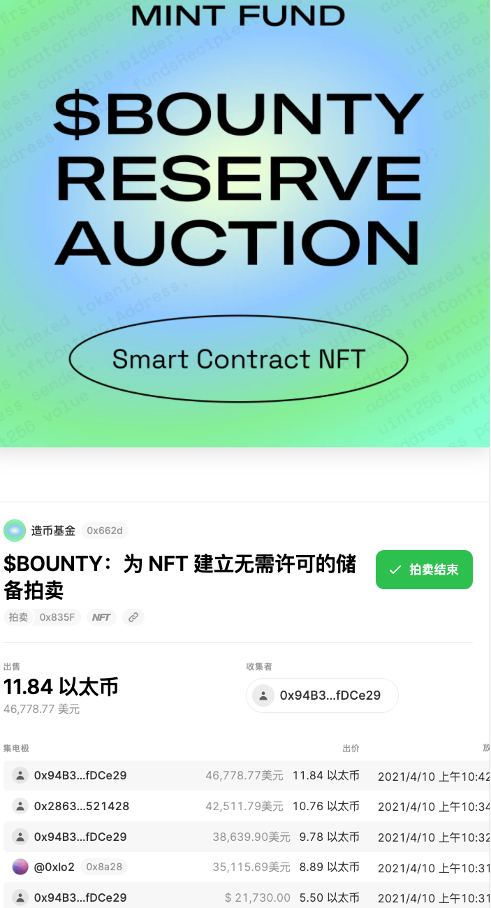

### 拍卖如何运作？
当出价匹配或超过您的底价时，拍卖持续时间倒计时开始。让我们想象一下，Alice 以 1 ETH 的底价和 12 小时的持续时间创建了一个储备拍卖。

- Bob 出价 1 ETH。
- 时钟从 12 小时开始倒计时
- 在拍卖的最后 15 分钟内进行的任何出价都会将时钟重置为 15 分钟。
- 新的出价必须比之前的出价高 10%。
- 在拍卖结束前最后出价的收藏家赢得 NFT。

### 发起拍卖
- 选择一个 NFT

	要创建拍卖，请选择铸造 NFT 的平台或添加自定义地址。您还需要包括  NFT 的 `tokenId`。
- 批准转移

	为了部署拍卖，你需要提交一个批准交易，允许拍卖合约将 NFT 从你的钱包转移到拍卖合约。
- 资金路线

	拍卖的收益可以路由到任何以太坊地址或智能合约。如果您想为自己分配资金，请在此处输入您的以太坊地址或资金可以流向 Mirror 上的其他区块，例如众筹或拆分。要将 NFT 拍卖的收益转移到您的众筹，请在此处输入您的众筹地址。您还可以通过将资金路由到拆分合约地址来与多个实体共享资金。
- 设置限制

	第一次出价后拍卖应该进行多长时间？底价应该是多少？

### 嵌入拍卖
部署后该嵌入拍卖(`Embed auction`) 部分将显示一段代码。将其复制并粘贴到参赛作品中。它应该类似于下面的示例，但带有您的专用拍卖地址和 `tokenID`. 例如，此代码在本指南的顶部嵌入了拍卖。

	[Token #1522](auction://0xabEFBc9fD2F806065b4f3C237d4b59D9A97Bcac7?network=mainnet&tokenId=1522)
下面代码将测试在 mirror 显示

[Token #1522](auction://0xabEFBc9fD2F806065b4f3C237d4b59D9A97Bcac7?network=mainnet&tokenId=1522)

## 拆分(Splits)
拆分是一种自动与多个实体共享您产生的价值的方法。拆分是一种可支付的智能合约，可将价值路由到以太坊上的多个地址。

拆分可以用作奖励您的合作者、激励您的人或捐赠您的工作收益的一种方式。

通过转到仪表板中的“拆分”选项卡来创建拆分。至少需要在两个地址之间进行拆分，并且拆分百分比之和必须为 100%。

	警告：拆分目前仅适用于 ETH。将 ERC-20 代币发送到拆分将导致它们被永久锁定。
### 在拍卖中使用拆分
拆分可以很容易地与 Mirror 上的其他价值产生块组合在一起，例如拍卖。您可以将拍卖的所有收益分配给多个实体，而不是自己保留拍卖的所有收益。

首先在仪表板的拆分部分创建拆分。部署拆分后复制拆分的地址。现在，创建一个新的拍卖并将拆分地址粘贴到资金接收方( `Funds Recipient`) 字段中。

拍卖结束后，资金将在拆分合约中指定的接收者之间自动共享。

拆分也可以在 Mirror 之外接收 ETH，就像任何应付的智能合约或 EOA。

## 限量版本(Editions)(1155?)
限量版本是创作者以固定价格铸造有限供应的相同 NFT 的一种方式。如果 1/1 NFT 是毕加索的苏富比，那么限量版本就像发布的数以千计的第一版全息喷火龙。

Mirror 上的限量版本配置有四个参数

- 价钱
- 媒体文件（我们目前支持.jpg，.png，.gif，和.mp4）
- 总供应量
- 资金收款人地址

与 Mirror 上的其他区块一样，您的限量版本作为智能合约部署，可以嵌入任何 Mirror 参赛作品中。

### 用例
限量版本可用于

- 铸造数字收藏品
- 创建社区成员
- 代表分层奖励

### 启动 NFT 版本
- 上传媒体文件

	目前支持.jpg, .png, .gif, 和.mp4
- 添加标题和描述

	当嵌入参赛作品中时，标题和描述将显示在限量版本块中。
- 设定价格和供应

	可以根据限量版本目标设置自定义 ETH 价格和供应上限。例如，可以设置高价和低供应来表示稀有。另一方面，你可以设置低价高供应，让更多人参与和接收 NFT。

	如果想最大限度地提高社区参与度，您可以通过 1/1 保留拍卖加上一些版本来开展活动。

	例如：

	- 通过储备拍卖获得 1/1 黄金 NFT
	- 0.5 ETH 的 10/10 白银 NFT
	- 0.1 ETH 的 100/100 青铜 NFT

### 嵌入限量版本 
限量版本部署嵌入 `Embed`  后，仪表板的版本页面部分将显示一段代码。将其复制并粘贴到参赛作品中。它应该类似于下面的示例，但带有您的专用版本地址和限量版本 .

例如，此代码在本指南的顶部嵌入了版本。

	[Dirty S1 Pea Green](edition://0x3725CA6034bcDBc3c9aDa649d49Df68527661175?editionId=2)

下面代码将测试在 mirror 显示

[Dirty S1 Pea Green](edition://0x3725CA6034bcDBc3c9aDa649d49Df68527661175?editionId=2)	
## 代币竞赛(Token Race)
Mirror 支持创建代币竞赛，这是我们自己的 [$WRITE Race](https://mirror.xyz/race) 的衍生产品。Token Race 是一个简单的基于持续时间的治理工具，允许上传提案并允许社区根据他们在某个时间点持有的特定 ERC20 代币或 ERC721 代币 (NFT) 对提案进行投票。
### 代币竞赛如何运作?
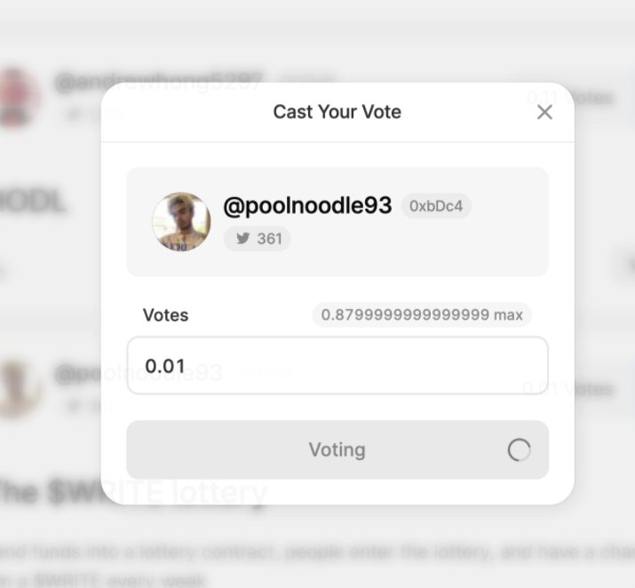

- 创建代币竞赛

	您可以通过转到从仪表板创建代币竞赛 `/dashboard/token-race`。
	
	

	为了创建代币竞赛需要指定有关代币竞赛的一些详细信息，例如
	
	- 名称
	- 描述
	- 要使用的 ERC20 代币地址
	- 开始日期
	- 结束日期
	- 要突出显示的获胜者数量用户界面

	还需要以 CSV 格式上传您希望社区投票的提案。列是（按顺序）：

	wallet address (required) | body (required)|twitter handle (optional)
	---|---|---|

	注意：请确保 CSV 中的列正确，上传后可以看到预览。

	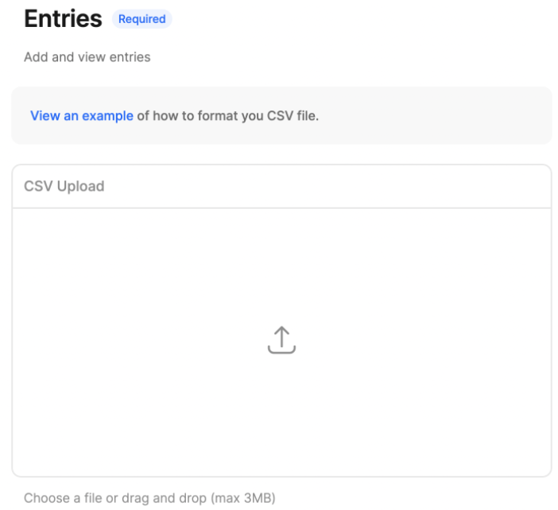
	
	要查看如何构建 CSV 的示例，请查看[示例](https://docs.google.com/spreadsheets/d/1ar9kAMcSFWFsctYKyW7gm9b-z0pM7T3gmgBOJHF_nNU/edit?usp=sharing)。

	所有代币竞赛数据均可通过 IPFS 访问，并通过 [Estuary](https://estuary.tech/) 存储在 Filecoin 网络上。
	
	创建代币竞赛后，您可以单击仪表板中的代币竞赛以转到代币竞赛页面。
- 代币快照
	
	我们对 ERC20 代币（或 ERC721 代币 ID）的所有余额进行快照，以确定投票权。投票权是 1:1 与他们的 ERC20 代币余额，四舍五入到合约指定的最接近的小数。
	
	对于拥有多个持有代币的多重签名地址的用户，投票权是所有这些代币的总和。
	
	快照总是在代币竞赛开始时间前 3 小时拍摄。
	
	快照数据在代币竞赛页面（外部链接）的页脚中可见。

	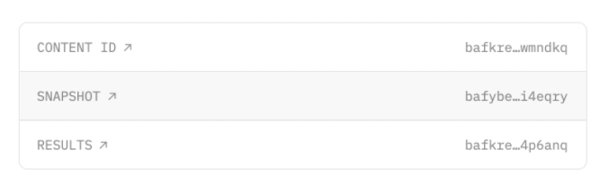
- 删除代币竞赛

	您可以在代币竞赛上线之前从仪表板中删除它。您只能在它们上线之前删除代币竞赛。您无法删除已结束的代币竞赛。删除代币竞赛会将其从Mirror UI 中删除，但数据将继续存在于 IPFS 上?	
	
	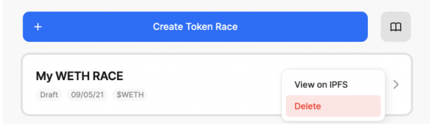
- 获取 ERC20 地址

	您可以从 [Etherscan](https://etherscan.io/) 的 Token Explorer 部分获取 ERC20 地址。
- 获取 ERC721 的代币 ID

	要使用 ERC721 (NFT) 创建代币竞赛，您需要 ERC721 合约地址、合约中的代币 ID（每个 ID 都是 NFT），以及您希望分配给每个 NFT 所有者的投票数.
- 为提议者链接推特

	创建代币竞赛后，您可以要求您的提议者去 Mirror 主页链接他们的推特账户。一旦他们链接了他们的帐户，他们的推特详细信息将与他们的提案一起显示在您的代币竞赛页面上。
- 投票的工作原理

	选民连接他们的钱包，这会显示他们当前的投票权。投票权由 ERC20 代币的余额决定。

	选民可以随意分配他们的选票。
- 多重签名投票

	Token Race 支持代表多重签名账户投票，而不需要多重签名持有者使用多重签名签署他们的投票。为了代表多重签名投票，请将您的多重签名地址添加到代币竞赛页面。一旦通过验证，您就可以代表多重签名进行投票。	
	考虑到用户被列为多重签名的所有者，用户可以代表任意数量的多重签名投票。

	当用户投票时，他们会看到一个下拉选项代表他们的多重签名投票。

### 使用 Ledger 硬件钱包 + metamask 进行投票
代币竞赛支持使用 Ledger 硬件钱包 + metamask（仅限桌面）进行投票。为了用你的硬件钱包投票，你应该：

1. 使用 Ledger Live 确保您的 Ledger 使用最新固件
- 确保您的 Metamask 扩展也是应用商店提供的最新版本
- 如果其中任何一个已过时，则集成将不起作用
- 插入您的 Ledger 设备并选择 Ethereum 应用程序
- 将您的硬件钱包连接到 metamask，并访问代币竞赛页面
- 如果您还没有在 Ledger 设备上启用“智能合约数据”或“盲签名”
- 通过点击“连接钱包”按钮同步您的钱包，您应该会看到您对硬件钱包的投票权

	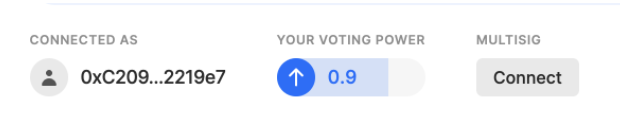	
- 一旦你分配了选票并投票，Metamask 会提示你从你的硬件钱包中签署消息

		
- 在 metamask 上点击“签名”后，您会在硬件钱包上看到一个弹出窗口，要求您签署交易
- 通过点击右侧按钮完成这些步骤，然后确认“签署消息”
- 返回代币竞赛页面，您将看到带有“投票”消息的模态文本更新

	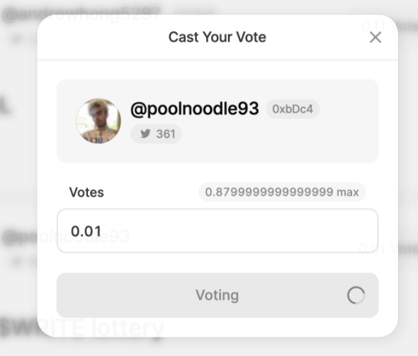
- 几秒钟后，模态将关闭，页面将更新以反映您所投的票。您还会注意到分配选票后您的投票权有所下降

## 编辑
Mirror 编辑器允许使用媒体块（例如图像和视频）以及加密经济块（例如众筹和拍卖）来撰写参赛作品。它使用纯文本和 Markdown 以及一些格式约定。
### 模式
合成发生在 `Edit` 模式中。要预览您的参赛作品，请进入 `Preview` 模式,因为它将出现在您的出版物中。您可以使用工具栏中的相关按钮在它们之间切换。
### 导入参赛作品
要从其他地方导入参赛作品，例如 Medium 或 Substack，请打开 `•••` 导航中的二级菜单，然后单击倒入参赛作品 `Import entry`。

接下来，输入您的参赛作品的 URL。url 将被解析为 markdown，并设置为您的参赛作品的内容。请仅导入您创建和拥有的内容。
### 创建块
要轻松创建媒体或经济区块，请先在参赛作品内单击以将光标放置在您希望区块出现的位置。接下来，单击工具栏的块区域或使用键盘快捷键聚焦 `⌘+/`。将出现块菜单，显示所有可用的块。选择一个块会提示您输入辅助信息。满意后，请确认信息以将块插入到您的参赛作品中。

### 块
Mirror 上的媒体嵌入和经济块通过简单的格式约定进行识别：在它自己的文本行上有一个单独的链接。要手动创建块，请插入新的文本行，添加链接，然后添加换行符。请确保新行只包含一个链接。

这是一个创建 Youtube 视频嵌入的示例。

	Powers of Ten illustrates the universe as an arena of both continuity and change, of everyday picnics and cosmic mystery.
	
	[Powers of Ten](https://www.youtube.com/watch?v=0fKBhvDjuy0)
	
	We hear about scale every day, whether it be supertankers, stars burning thousands of lightyears away, the study of microscopic viruses, or global warming. Understanding scale, or as the Eameses said, “the effect of adding another zero,” has the power to make us better scholars and better citizens.
	
	

下面代码将测试在 mirror 显示

[Powers of Ten](https://www.youtube.com/watch?v=0fKBhvDjuy0)

### NFT
Mirror 上的参赛作品可以铸造为 NFT。要将您的参赛作品创建为 NFT，请选中参赛作品编辑器右上角的 NFT 复选框。为您的参赛作品上传封面图片，以便它可以在不同的 NFT 平台上呈现。一旦您的 NFT 在链上铸造，您将在参赛作品的署名行中看到确认。
### 众筹
在 Mirror 上，任何人都可以使用众筹块为想法或项目筹集资金。在幕后，众筹是以太坊上的智能合约。粉丝存入 ETH 来资助您的想法以换取代币。代币代表赞助证明和项目潜在成功的股份。众筹可以嵌入到 Mirror 上的任何参赛作品中，以及讲述您项目故事的文本和其他媒体块。
### 拍卖
[创建拍卖](https://mirror.xyz/dashboard/auctions)并部署它。部署后，该嵌入拍卖部分将显示一段代码。将其复制并粘贴到参赛作品中。它应该类似于下面的示例，但带有您的专用拍卖地址和tokenID.

	[Token #1522](auction://0xabEFBc9fD2F806065b4f3C237d4b59D9A97Bcac7?network=mainnet&tokenId=1522)
		

下面代码将测试在 mirror 显示

[Token #1522](auction://0xabEFBc9fD2F806065b4f3C237d4b59D9A97Bcac7?network=mainnet&tokenId=1522)

### 图片
可以通过拖放到编辑器中、在块菜单中选择图像或手动创建降价图像标签来嵌入图像。通过定义 width 和 height 查询参数可以在加载之前保留图像的空间，这些参数在将图像上传到 Mirror 时自动设置。

	

### 链接预览
Mirror 显示基于 OpenGraph 标签通用标准的所有链接的渐进增强预览。

	[Mirror](https://mirror.xyz)	


下面代码将测试在 mirror 显示

[Mirror](https://mirror.xyz)
### 推特
通过插入指向任何 Twitter URL 的链接来嵌入单个推文或整个推文主题。

	[Mirror’s first tweet](https://twitter.com/viamirror/status/1325856116748726273)
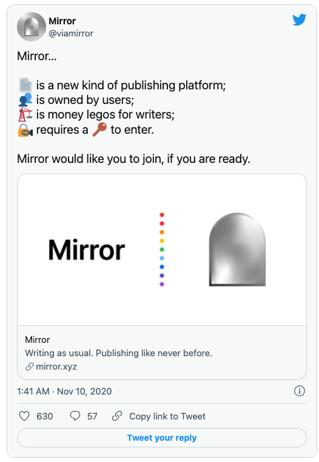	

下面代码将测试在 mirror 显示

[Mirror’s first tweet](https://twitter.com/viamirror/status/1325856116748726273)
### youtube
	[Powers of Ten](https://www.youtube.com/watch?v=0fKBhvDjuy0)


下面代码将测试在 mirror 显示

[Powers of Ten](https://www.youtube.com/watch?v=0fKBhvDjuy0)

### 视频嵌入
.mp4 通过插入指向外部托管视频文件的链接来嵌入视频。也可以设置 `autoplay`，`muted`，`loop` 并 `controls` 通过设置相关的查询参数。确保您手动定义 `width` 和 `height` 参数以保留视频的垂直空间。

	[Powers of Ten](https://jkm-library.s3.amazonaws.com/blocks/powers-of-10.mp4?height=480&width=640&autoplay=true&loop=true&muted=true)	
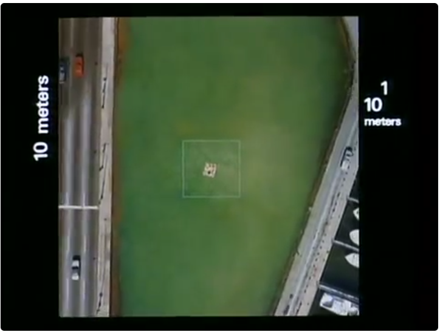

下面代码将测试在 mirror 显示

[Powers of Ten](https://jkm-library.s3.amazonaws.com/blocks/powers-of-10.mp4?height=480&width=640&autoplay=true&loop=true&muted=true)

### 框架
可以通过创建 iFrame 块来嵌入任何页面。例如，这在嵌入交互式 WebGL 内容时很有用。只需设置display=iframe为查询参数。

	[ThreeJS Demo](https://threejs.org/examples/webgl_water_flowmap.html?display=iframe)
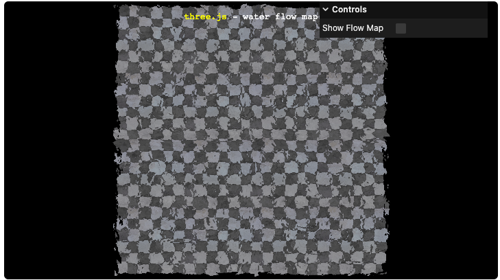

下面代码将测试在 mirror 显示

[ThreeJS Demo](https://threejs.org/examples/webgl_water_flowmap.html?display=iframe)		
### 版面尺寸
如果您希望为您的参赛作品创建更具编辑性的布局，请考虑为某些媒体块设置自定义布局大小。支持的块类型包括图像、视频、Youtube 和 iFrame。

块大小通过查询参数设置，可以从medium和 中进行选择large。例如，下面是一个large延伸到页面边缘的图像。

		

		
	
### 未来的增强
Mirror 是一个新项目，我们的编辑有意识地专注于我们快速行动以创建新的经济工具来资助伟大的写作。随着时间的推移，我们计划引入一个新的编辑器，它支持就地编辑，无需在编辑和预览模式之间切换。在此之前，我们感谢您的耐心等待，并欢迎任何反馈。