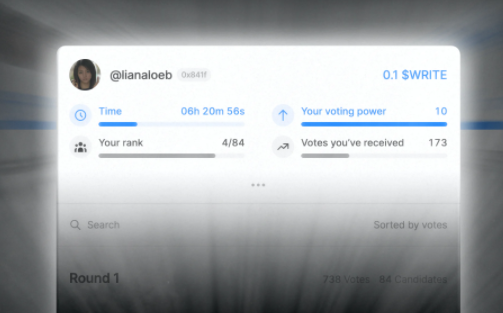
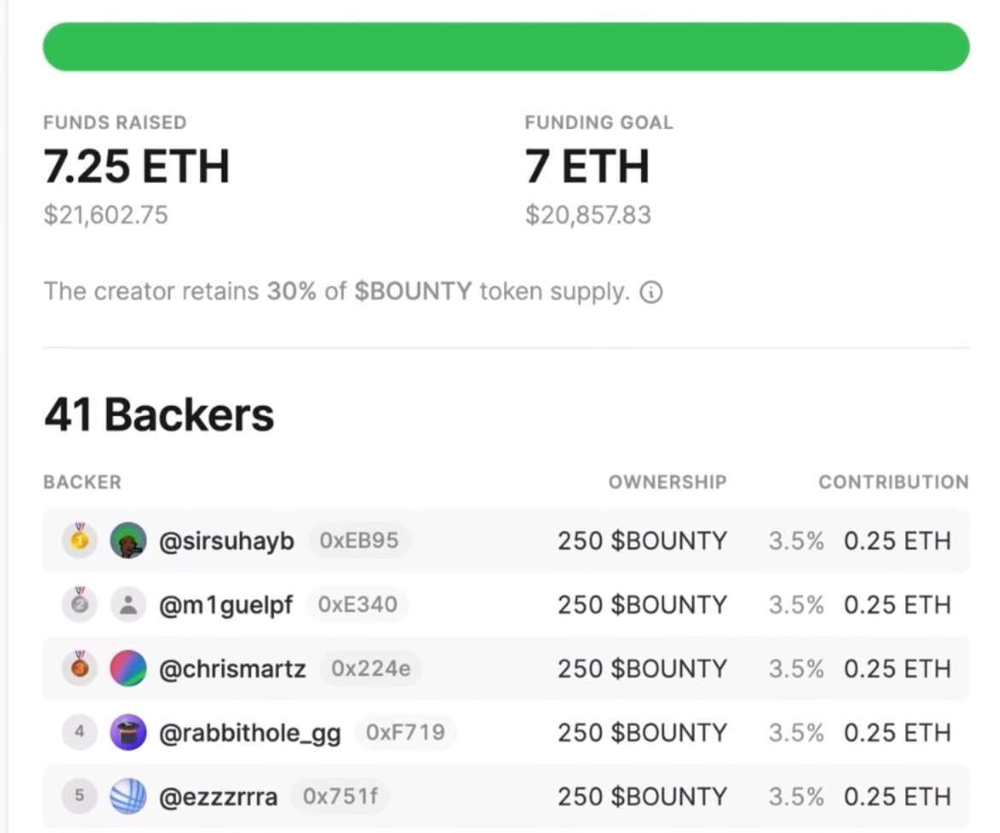

# Mirror.xyz 产品调研(创作不一定是文字，包含音乐等)
## 目标
- 成为一个 dao 社区
- 提供一个自维护创作平台
- 用来改变当前网络的表达、分享和货币化的想法，如
	- 传播方式
	- 解释方式
	- 应用方式
	- 价值方式

所有人都受益，所有人都快乐

## 简介
Mirror 是一个社区拥有和运营的协议和经济体。 Mirror 的价值是社区工作的总价值，这意味着现有成员对谁做出贡献具有文化和经济利益。为确保基础质量，我们决定在平台的早期阶段以个人为基础授予访问权限。

为此，我们创建了 `$WRITE` 令牌，这是传统平台邀请系统的加密替代方案。获得一个 `$WRITE` 令牌可以让某人在 Mirror 上发布权力。作为销毁代币的交换，用户在 Mirror 边界上获得一个独特的情节，其中包括 ENS (*.mirror.xyz) 上的唯一名称和铸造的出版物。

对于发布作品，需要有 token `$WRITE` 代笔，获取方式

- 写者比赛

	笔者每周比赛或的代币和加入社区的资格，社区会投票选出下一个加入社区的人以及比赛前10名将获得1个空投代币，通过这些代笔兑换为在 Mirror 上的出版物。
	
	加入社区这个是一个持续增长的实验，赋予社区决定新成员的权利。
	
	代币可以用于兑换镜像会员、域名、未来社区福利(大饼)
	
	
	
	- 比赛规则
		- 比赛时间 
			
			每次比赛投票时间持续12小时
		- 选票权重
	
			您的投票权重 = $WRITE 余额 x 1000。但每轮再多币也只能投票一次
		- 奖励
			- top 10 获得1个代币，1 个代币可以加入社区并且可以出版 NFT 
			- 参与比赛者都可以获得一点代币，可能是 0.01
		- 提取代币

			同 UNI 项目启发，使用默克尔根验证合约在链上发布参与摘要和结果，选民将通过在链上提交默克尔证明来在主网兑换代币？？？  	
- 投机客空投

	空投获得
-  出版物

	拥有出版物的现有成员获得 1 $WRITE。由于他们通过内容积极为平台创造价值，我们认为他们应得的
- 候补名单

	所有加入候补名单的新申请人将收到 0.01 美元的 WRITE。我们认为这是我们希望建立长期关系的第一步。

用加密游戏取代 Web 2.0 平台（如 Clubhouse、Superhuman 和 Gmail）使用的传统邀请系统。这么做的原因是为了确保 Mirror 社区能够决定它由谁组成，并相应地决定它想要成为什么。这是为了保证我们通往真正社区所有平台的道路——作家是网络和经济的仲裁者——从正确的角度开始。

裙带关系和稀缺性使蜂巢思想和奖励处于次要地位。它同时是最好的作家背后的集体集会，也是发现他们的一种方式。这是个人资料的众筹。这是一场运动。而且，最重要的是，这很有趣。

- 专用的 mirror.xyz 子域？

## 做恶惩罚
- 保留对机器人玩家的惩罚 	

## 功能
- 允许内容创作者对单篇内容发布众筹
- 并支持铸造一枚 NFT 代表内容所有权
- 资助人可以用加密货币购买该 NFT 的份额支持，或者进行投资
- 最初的手稿在平台上，可公开所有人访问
- 然后在通过 zora 协议铸造成 NFT
- 支持者保留手稿摘要和完整手稿 NFT 购买份额
- 每次该 NFT 出售时，会按照一定比例的金额返还给份额持有者
- 然后在共享池子兑换一定比例的 eth

	
- 完成在第一版众筹用户在未来再版销售，可以得到版权的份额比例，支持者永远与该版权联系在一起，可以成为这个内容的赞助人

把每个文章理解成基金，

- 然后每个人都可以持有一定份额，持有人的的收益就是每次转手的份额和升值空间
- 持有份额的人也有特权

内容创作者摆脱了现有生产体系，可以根据特定读者，提供有价值和高可用的内容来生存

## 商业闭环
创建一种自给自足的写作者社区经济

- 投资
- 生产
- 消费
- 转让

## 第二层业务逻辑
- 众筹平台

	通过发布的内容(文字性的)，发布众筹内容，利用平台的流量资源进行引流众筹，这样平台就变成了一个 dao 众筹平台。

	- [众筹音乐](https://mirror.xyz/ibninglor.eth/crowdfunds/0xAD1fE534cb1bEA44a67307164Da9C03b763815bE)
- 去中心化社区平台

	召集线上或者线下活动，利用流量招揽
	
	- [社区活动](https://blvkhvnd.mirror.xyz/Ctta2YjiTJ7Bn7OmWd9jhZuOsweuNPTo47K-tT4_fr0) 
- 去中心化消息平台

	利用发布引流，可以作为圈内的发布平台 

	- [比赛](https://mirror.xyz/race)

# Audius
音乐道，解决艺术家利润锁定与粉丝连接升级，但是版权问题还是很长时间要走

- 分发代币(粉丝币)
	- 通过定时奖励排行榜奖励

- 内容付费
	- 目前所有用户免费听音乐
	- 后面解锁付费功能
- 代币功能
	- 参与协议治理投票
	- 用于质押在发现节点和内容节点，获得网络受益
	- 抵押以解锁艺术家代币和徽章等功能并获得粉丝投票权
	 
## 划分
- 用户划分
	- 创作者
		- 发表作品、创建艺术家代币  
	- 用户
		- 参与质押发现节点和内容节点获取代币
		- 还可以购买艺术家代币获得与艺术家之间的特权   
- 区块链
	- 发现节点
		- 内容分类账本发现 
	- 内容节点
		- 内容存放
		- 访问内容权限  	  

## 技术
API 接口，可以将音乐分享到

- 游戏
- 抖音(第一个与社交媒体达成合作的音乐流媒体门户，可以很方便的集成到抖音中)
- youtube

总调用6800万次，月活 534万

# rally
提供粉丝代币的平台，目标是构建一个由创作者驱动的网络，与多个内容平台创主播密切合作，内容平台包含但不限于 youtube、抖音、twitch 等。通过 rally 创作者可以定制他们自己的可定制的代币，也称为创作者币或者粉丝币，为他们的粉丝提供价值或实用功能。任何创作者都可以创建自己的代币

- 主播在平台上创作代币
- 主播粉丝在平台上购买代币
- 随着主播人气上涨，代币也上升
- 主播和代币拥有者共同享有代币利益

可以创建粉丝和内容创作者之间的内容价值转换和沟通渠道

## 逻辑
- 创作者用这个方式变现
- 也让粉丝共同参与

## 代币功能
拥有代币的粉丝可以有特权，比如

- 拥有50额度，就可以加入主播私人的私人聊天室
- 拥有100额度，就可以私信偶像
- 拥有1000额度，可以购买偶像亲笔签名照
- 粉丝还可以用消费的方式把创作者币再转回偶像
- 还可以用作粉丝之间转账

## 粉丝币和平台币的关系
粉丝币通过算法，按照一定的曲线绑定平台币，然后可以兑换一定数量的平台币，平台币再去交易市场兑换
## 铸造NFT
- 创作者实用一定数量的 rally ，构造专属 NFT

## 购买代币
- 粉丝创建账户来购买粉丝币
- 发币支付
	- 支持借记卡支付，限额200
- 加密货币支付
	- 不限

  

# 参考
- [官方地址](Mirror.xyz)
- [比赛](https://dev.mirror.xyz/vZxxUIeGMQK9NNLcrT0eDYZ6wXhXVr6vTQzztj1DaEA)