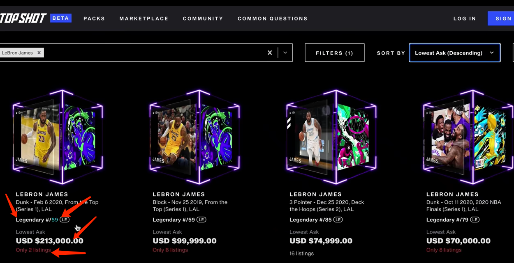

# NBA top show 研究
## 分析
- 分为等级卡，等级越高越稀有，从上到下
	
	
	
	-  常见
		- 黑色
		- 发行 1w 张  
	-  稀有
		- 金色
		- 发行 150-4999 张  
	-  传奇
		-  紫色
		-  发型 25-499 张
	-  最终-铂金
	-  最终-创世纪
- 搜索数量

	
	
	
	- 等级
	- 数量(59)
	- 价格
		- 最低和最高价格之间 
	- 多少在销售

## 投资
- 球员价值属性
	- 当前火爆的继续升高
		- mvp 
	- 未来有潜力的球员
		- 新秀 
- 卡片价值属性
	- 稀有程度 
	- 卡片号里有和球员相同号码的就更稀有？
	- 球衣颜色和卡片颜色相同？
- 新手
	- 从喜欢的球员开始(建立心里认同感？)

## 收藏投资
- 实体卡
	- 优势
		- 可以炫耀，比如价值和历史(1900/1800)
		- 可以拿在手里
	- 价值
		- 稀有
		- 好看
		- 其他人也想要
		- 稀有程度
	- 缺点
		- 交易邮递时间长(月？年？)，流动性交易时间带来的是了价格波动
		- 保存风险     
- 虚拟卡	
	- 更容易转卖   

- topshow 顶级收藏品？

## 用户赚钱
- 自己做对应球类up 
	- nft 收藏直播或者解说
		- club top shot
		- 自己说自己
		- 自己说虚拟卡牌
		- 自己说实体卡牌
		- 讲解原理
		- 联机
		- 社区维护问题
		- 真实赛事联动
		- 游戏直播
	- 对自己的宣传/也直接推动了市场
		- 主动寻找接盘？
	- 个人营销
		- 观众粉丝
		- 直播带货？  

	 	 
## 功能性
- 官方销售
	- 开卡模式(概率赌博)
- 注册
	- 账户密码
	- 验证
		- 手机
		- 邮箱
	- 跳转说明宣传视频
		- 第一步简单说明
		- 第二步定义忠诚度
			- 狂热
			- 普通
			- 等
		- 第三步产品调查
			- 比如社区
		- 第四步选择球队(单选)
		- 引导使用
			- 比如拥有nft历史等
			- 平台推荐新手卡包购买 
- 登陆
	- 账户密码+手机短信
- 身份验证
	- 手机+密码验证
- 购买
	- 法律合规(需要进行社会身份验证)
		- 护照验证
			- 人脸识别
			- 护照照片页(只要照片页)
- 用户
	- 我的钱包
		- home
			- 当前金额
				- 添加跳转到支付页面 
			- 交易历史
				- 过滤
				- 下载csv
		- 账户设置
			- 描述
				- 用户名
				- 头像
			- 账户信息
				- 登录邮箱
					- 变更邮箱
					- 链接google认证
		-  安全
			- 密码登录
				- 修改密码 
			- 认证身份
				- 护照认证
				- 手工填写
				- 护照照相
				- 当前头像照相
			- 二阶认证
				- 手机号
		- 付款+支出(Dapper Balance)
			- 当前余额
			- 充值
				- 必须是整数
			- 保存卡片
			- 银行信息
			
				每个请求需要25美元的处理费，即使操作失败 
				
				- 国家
					- 美国
					- 加拿大
					- 英国
				- 姓名
				- 账号/安全码
				- 账户说明
			- 账单明细

## 支付
- 第一次购买
	- 添加一张新的信用卡
		- 支持国家
			- 美国
			- 加拿大
			- 英国
	- 其他钱包  
		- 使用加密钱包付款
			- eth、btc、bch、usdc、dai
				- 必须使用 coinbase 为每次付款提供加密货币和地址？
				- 收取标准转账费用
				- 处理时间因网络而异，btc需要更长时间
				- 将会使用 dapper balance 补偿
		- 使用 flow 钱包付款
	- 不适用
		- Dapper Balance                                     
  	  
## 产品定义
- 由 NBA 授权
- 任何人都可以参与
- app 免费下

## 在 nba top show 测试整个流程
- 注册(手机号)
- 登录
- 	
## 参考
- [How A 24-Year-Old Built An NBA TOP SHOT Collection Worth $2 MILLION!](https://www.youtube.com/watch?v=L9JjrS0yjpw)

BFS链盘 v0.8.15可发版。
