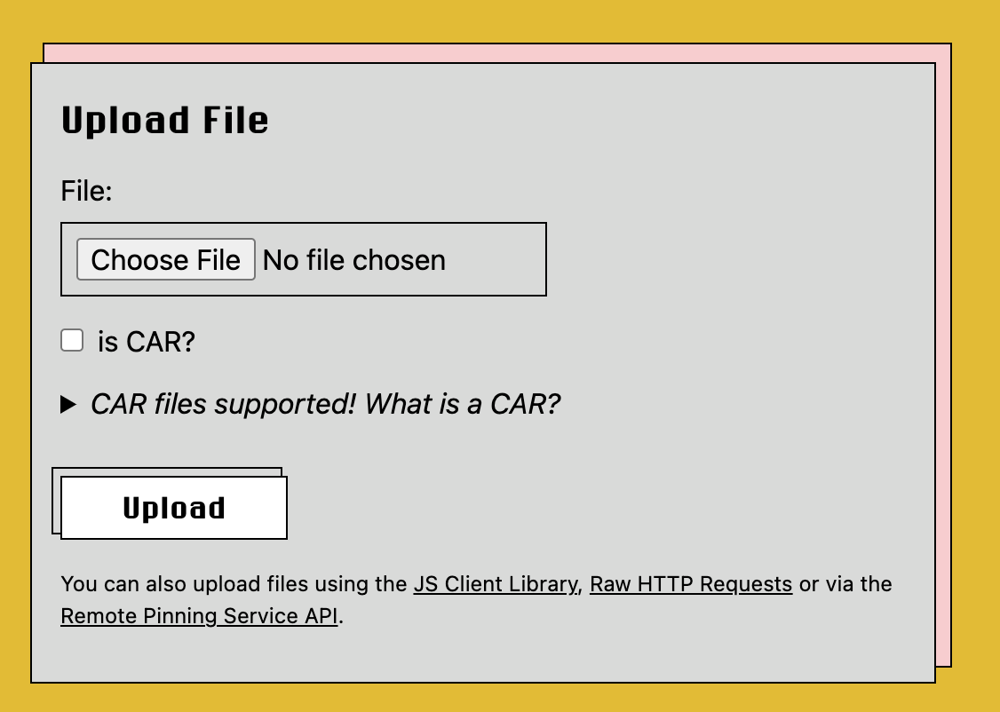
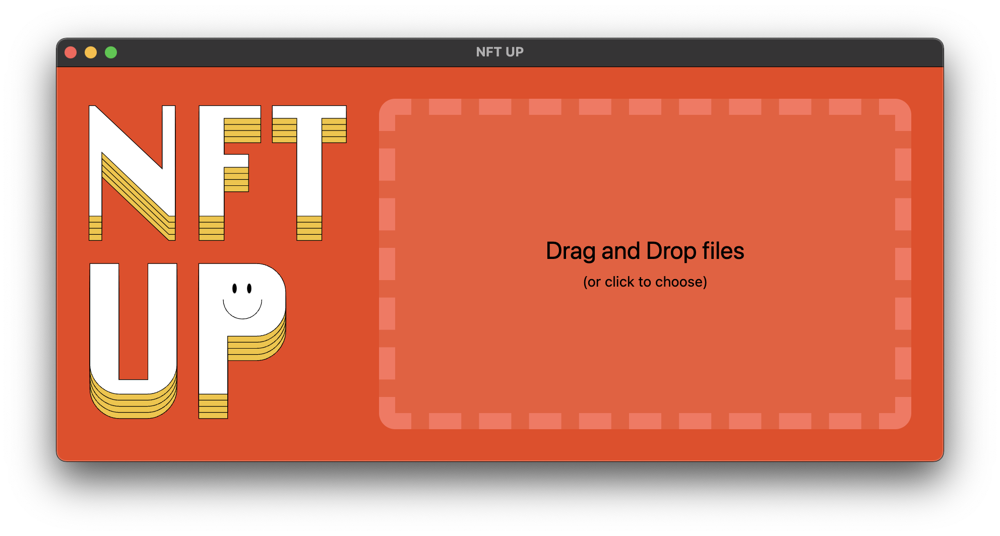
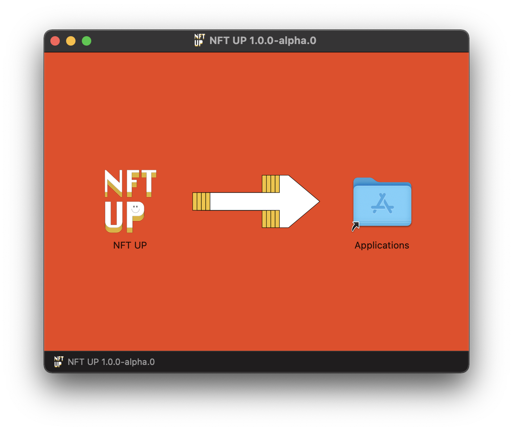
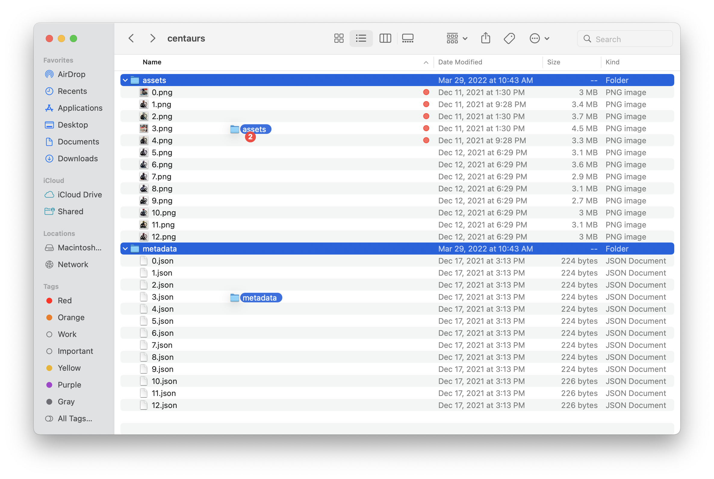
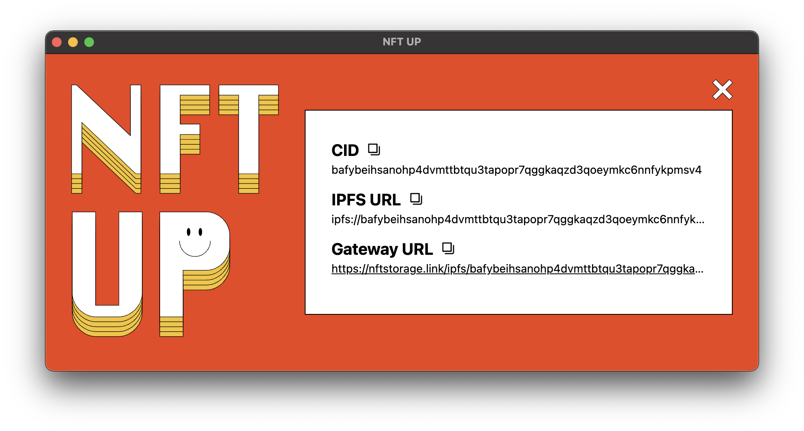

# NFT.Storage
## 快速开始
NFT.Storage 是一种存储服务，可让您免费上传链下 NFT 数据，目标是将所有 NFT 数据存储为公共产品。数据永久存储在 [Filecoin](https://filecoin.io/) 去中心化存储网络中并通过其唯一的内容 ID 通过 [IPFS](https://ipfs.io/) 提供。您可以上传任意数量的数据，只要它是 NFT 的一部分（例如，元数据、图像和代币或其元数据中引用的其他资产），尽管目前每个单独上传的限制为 31GiB。

NFT.Storage 对于铸造 NFT 的个人创作者或希望支持创作者和收藏家的 NFT 工具开发人员特别有用！NFT.Storage 非常易于使用和集成，为您提供在铸造 NFT 时所需的上传内容 ID，[使其真正不可变](https://nft.storage/docs/quickstart/why-nft-storage/#pitfalls-with-using-http-urls)，并使您的数据在[性能上可用](https://nft.storage/docs/quickstart/why-nft-storage/#infrastructure-for-web25)。

在本指南中，我们将完成以下步骤：

- [创建 NFT.Storage 帐户](https://nft.storage/docs/quickstart/#create-an-account)
- [通过网站上传文件](https://nft.storage/docs/quickstart/#uploading-a-file-using-the-website)
- [通过 NFTUp 应用程序上传文件和目录](https://nft.storage/docs/quickstart/#uploading-files--directories-via-the-nftup-application)
- [获取免费的 API 令牌](https://nft.storage/docs/quickstart/#get-an-api-token)
- [使用 JavaScript API](https://nft.storage/docs/quickstart/#using-the-javascript-api)

本指南使用 Node.js，因为它是以编程方式开始使用 NFT.Storage JavaScript 客户端的最快方法，但如果 Node 不是您最喜欢的运行时环境或者您根本不想进行任何编码，请不要担心. 您还可以通过以下方式使用 NFT.Storage：

- 在 Web 浏览器中使用 JavaScript 客户端。
- 直接从 NFT.Storage 网站上的[文件页面](https://nft.storage/files/)上传和检索文件。

您还可以使用任何可以发送 HTTP 请求的编程语言或工具直接使用 [HTTP API](https://nft.storage/api-docs/) 

使用 HTTP API 时，请务必阅读 [CAR 文件](https://nft.storage/docs/quickstart/concepts/car-files/) 以了解如何支持大型上传！

### 创建一个帐户
对于本指南，您需要一个 NFT.Storage 帐户来获取您的 API 令牌并管理您存储的数据。您可以使用您的电子邮件地址或 GitHub 免费注册。

- 电子邮件
	- 转到 [nft.storage/login](https://nft.storage/login) 开始。
	- 输入你的电子邮箱地址。
	- 检查您的收件箱中是否有来自 NFT.Storage 的验证电子邮件，然后单击电子邮件中的登录按钮。
	- 你都准备好了！
- github
	- 转到[nft.storage/login](https://nft.storage/login)开始。
	- 在登录屏幕上单击 GitHub 。
	- 在 GitHub 询问时授权Web3.Storage。
	- 你都准备好了！ 

### 使用网站上传文件
登录后，您可以通过使用网站上传文件立即开始使用 NFT.Storage。

- 单击文件转到您的 [NFT.Storage 文件列表页面](https://nft.storage/files/)。
- 点击上传按钮进入文件[上传页面](https://nft.storage/new-file/)。
- 单击选择文件按钮以从您的设备中选择一个文件：

	
- 如果您要上传 [CAR 文件](https://nft.storage/docs/quickstart/concepts/car-files/)，请勾选 is CAR？复选框。
- 单击“上传”按钮以存储您的文件！

上传完成后，您将能够在文件列表页面中查看您的文件。

### 通过 NFTUp 应用程序上传文件和目录
NFTUp 是内容创建者上传其元数据和资产的最简单方式，准备好通过智能合约铸造成 NFT，然后在市场上交易，并在画廊中浏览。

- 为您的操作系统[下载并安装 NFTUp](https://nft.storage/docs/quickstart/how-to/nftup/)
- 启动应用程序。
- 拖放一些文件或文件夹就可以了。系统可能会提示您输入 NFT.Storage API 密钥。您可以在您的帐户页面上[获取您的密钥](https://nft.storage/manage/)。
- 上传您想要的任何文件结构。如果您正在执行类似 HashLips 构建的操作，您可以通过将资产和元数据同时拖动到上传框来上传它们。
- 上传完成后，您将获得指向您的内容的链接。单击它以从 IPFS 网络获取数据。
- 设置您的[智能合约基础 URL](https://nft.storage/blog/post/2022-02-15-base-url-apis/)，或以其他方式与 NFT 铸造服务共享您的内容。
- 在 [GitHub](https://github.com/nftstorage/nftup) 上投稿。

### 获取 API Token
从 NFT.Storage 获得免费的 API Token 只需几分钟。此 Token 使您能够在不使用主网站的情况下与 NFT.Storage 服务进行交互，从而使您能够将使用 NFT.Storage 存储的文件直接合并到您的应用程序和服务中。

- 单击帐户以转到您的 [NFT.Storage 帐户页面](https://nft.storage/account)。
- 单击创建 API Token。
- 输入 API Token 的描述性名称，然后单击 Create。
- 在您知道不会丢失的安全地方记下 Token 字段。您可以单击复制将新的 API Token 复制到剪贴板。

		将您的 API Token 保密

		不要与其他任何人共享您的 API Token。此密钥特定于您的帐户。

### 使用 JavaScript API 
如果您使用 JavaScript 或 TypeScript 构建应用程序，NFT.Storage [JavaScript 客户端](https://nft.storage/docs/quickstart/client/js/)可以让上传文件和创建与 ERC-1155 兼容的 NFT 元数据变得简单。

客户端库使用熟悉的 [Web 文件 API](https://developer.mozilla.org/en-US/docs/Web/API/File) 并包含 `File Node.js` 的实现。下面是一个小示例，它从命令行读取文件的路径并将文件存储在 NFT.Storage 中。

	对于此示例，您需要 Node.js 版本 16 或更高版本。

- 创建一个新的 JavaScript 项目
	
	创建一个新目录并用于 `npm` 创建一个新项目
	
		mkdir nft-storage-quickstart
		cd nft-storage-quickstart
		npm init
	NPM 会询问一些关于你的项目的问题并创建一个 `package.json` 文件。
- 将 `nft.storage` 客户端添加到您的项目依赖项中。
	
	安装最新版本的 `nft.storage` 软件包：
	
		npm install nft.storage
	当我们这样做时，添加 `mime` 包，这将帮助我们猜测给定文件名的文件类型。
	
		npm install mime
- 创建一个名为upload.mjs并使用代码编辑器打开它的文件。

	下面是我们需要上传具有 ERC-1155 兼容 NFT 元数据的图像的代码。
	
	粘贴下面的代码并通读它。随意删除评论 - 他们只是在那里突出发生了什么。
	
		确保将 NFT_STORAGE_KEY 变量的值替换为 NFT.Storage API 令牌。
		
		在一个真实的应用程序中，您应该从一个环境变量或配置文件中读取令牌，而这些文件没有被检入源代码控制！
	
	code
	
		// 导入 NFTStorage 类和 File 构造函数。存储的包
		import { NFTStorage, File } from 'nft.storage'
		
		// 'mime' npm 包帮助我们在 file 对象上设置正确的文件类型
		import mime from 'mime'
		
		// Node.js 上的 'fs' 内置模块提供了对文件系统的访问
		import fs from 'fs'
		
		// 'path'模块为操作文件系统路径提供了帮助
		import path from 'path'
		
		// 粘贴你的非功能性测试。存储 API 密钥到引号
		const NFT_STORAGE_KEY = 'REPLACE_ME_WITH_YOUR_KEY'
		
		/**
		  * *从' imagePath '读取一个 image 文件并存储一个具有给定名称和描述的 NFT。
		  * @param {string} imagePath 镜像文件的路径
		  * @param {string} 为 NFT 命名
		  * @param {string} description NFT 的文本描述
		  */
		async function storeNFT(imagePath, name, description) {
		    // 从磁盘加载文件
		    const image = await fileFromPath(imagePath)
		
		    //使用我们的 API 密钥创建一个新的 NFTStorage 客户端
		    const nftstorage = new NFTStorage({ token: NFT_STORAGE_KEY })
		
		    //调用客户端。存储，传入图像和元数据
		    return nftstorage.store({
		        image,
		        name,
		        description,
		    })
		}
		
		/**	
		  * 一个从磁盘上读取文件并返回 file 对象的助手。
		  * 注意这将整个文件读入内存，不应该用于非常大的文件。
		  * @param {string}  filePath 存储文件的路径
		  * @returns {File}  返回一个包含文件内容的 File 对象
		  */
		  
		async function fileFromPath(filePath) {
		    const content = await fs.promises.readFile(filePath)
		    const type = mime.getType(filePath)
		    return new File([content], path.basename(filePath), { type })
		}
		
		
		/**
		* 检查命令行参数和调用 storeNFT 的脚本的主要入口点。
		* 为了简化示例，仅为 imagePath、名称和描述提供三个位置参数
		*/
		async function main() {
		    const args = process.argv.slice(2)
		    if (args.length !== 3) {
		        console.error(`usage: ${process.argv[0]} ${process.argv[1]} <image-path> <name> <description>`)
		        process.exit(1)
		    }
		
		    const [imagePath, name, description] = args
		    const result = await storeNFT(imagePath, name, description)
		    console.log(result)
		}
		
		// 不要忘记调用 main 函数!
		// 我们不能在顶层' await '事物，所以这增加了
		// 一个.catch() 来获取任何错误并将它们打印到控制台
		
		main()
		  .catch(err => {
		      console.error(err)
		      process.exit(1)
		})
- 使用节点运行脚本

	您现在应该能够运行脚本并为其提供图像文件的路径。您还需要为 NFT 提供名称和描述。

	在下面的示例中，我们假设 `token.png` 在与脚本相同的目录中调用了一个文件。如果您的文件在其他地方，请替换 `token.png` 为您的图像的路径。

		node upload.mjs token.png 'A name for my token' 'A longer description for the token...'

	`A name for my token` 注意和周围的引号 `A longer description for the token...`。这会导致命令行 shell 将引用的文本视为单个参数，而不是每个单词一个参数。由于我们的脚本只需要三个参数，因此如果其中有空格，您需要引用名称和描述。

	完成后，您应该会看到如下内容：

		Token {
		  ipnft: 'bafyreifrkkhbwkf3fibwhbzcmpqnmh3b4t5t4ig7qdtymkdoatcycwe6n4',
		  url: 'ipfs://bafyreifrkkhbwkf3fibwhbzcmpqnmh3b4t5t4ig7qdtymkdoatcycwe6n4/metadata.json'
		}
	这 `url` 是一个 IPFS URL，可以使用 [Brave](https://brave.com/) 和其他支持 IPFS 的工具和浏览器查看。有关访问令牌数据的其他方式，请参阅我们的[检索 NFT 数据指南](https://nft.storage/docs/quickstart/how-to/retrieve/)。
	
## 为什么选择 NFT.Storage？
[NFT.Storage](http://nft.storage/) 使遵循 NFT 最佳实践变得容易，最大化您正在铸造的 NFT 的价值，并最大限度地减少 NFT 铸造者和所有者长期维护 NFT 的开销

NFT 的强大功能之一是它们可以引用链下数据，从而为您节省在链上存储图像、视频和其他大型 NFT 数据的成本。这方面的一个例子是 ERC-1155 标准，它定义了您应该通过 URI 引用链下数据的位置：

- 元数据

	在交易本身中，您需要包含一个指向 JSON 文件的 URI，该 JSON 文件包含 NFT 的元数据
- 图片

	标准定义了 `image` 元数据中的字段，其值是指向与您的 NFT 关联的图片的 URL
- 其他数据

	标准定义了 `properties` 元数据中的字段，其中包括另一个允许用户定义自定义字段的 JSON 对象，这些字段通常引用指向其他链下数据（例如视频）的 URL

最佳实践是使用包含 [IPFS 内容 ID](https://docs.ipfs.io/concepts/content-addressing/) (CID) 的 URI，它是对底层数据本身的引用（即数据的哈希）。这使得什么数据对应什么 NFT 变得明确 - CID 是数据本身的属性。如果两个人对特定的 NFT 及其内容存在分歧，您只需检查哪一个对应于正确的 CID。使用 NFT.Storage 的库可以轻松地在本地计算 NFT 数据的 CID。

使用 NFT.Storage 还可以轻松地将数据存储在公共 IPFS 网络上。IPFS 的美妙之处在于它对数据的物理位置没有意见，因为它通过其 CID 引用数据。因此，IPFS 保证，如果至少有一个数据副本被广播到网络（无论是存储在存储服务、分散存储还是本地计算机上），您可以获得一个副本。

NFT.Storage 是 NFT 数据的长期存放地，数据被广播到 IPFS 网络并以不信任的方式存储在 Filecoin 上（其愿景是将自身完全分散为服务）。NFT.Storage 背后的存储和检索基础架构旨在并将越来越多地利用 Web2 和 web3 的创新来提供最终用户期望的性能。

### 使用 HTTP URL 的陷阱
铸造 NFT 时您需要非常小心使用哪种 URI。使用 HTTP URL 会降低 NFT 的价值，因为它们引用了 Web 上的特定位置。对于具有 HTTP URL 的 NFT，潜在买家可能会考虑：

- 如果运行 HTTP 服务器的人决定交换我的 NFT 引用的数据会发生什么？如果我试图向其他人炫耀我的 NFT，就会出现与我最初购买的不同的艺术品。
- 如果这些 HTTP 服务器完全关闭会发生什么？即使我仍然拥有该艺术品的副本，我也无法使用链上数据证明我的 NFT 指向这件特定艺术品。

由于 NFT 所有权可能经常易手，因此 NFT 所有者和 HTTP 服务器维护者通常不会相同，这可能会为保持 NFT 数据永久可用造成不明确或不平衡的激励。

### IPFS 和 NFT.Storage 的救援
这就是 [NFT.Storage](http://nft.storage/) 为您提供 [IPFS](https://ipfs.io/) URI 而不是 HTTP URL 的原因。IPFS URI 是基于数据本身的加密哈希的底层数据的唯一标识符，而不是数据今天所在的位置。这样一来，您就可以轻松证明一条数据实际上是您 NFT 的一部分！此外，只要 IPFS 网络的某处存在副本（在公共 IPFS 节点上、在 Filecoin 上，甚至在您自己运行 IPFS 节点的计算机上），您就可以下载该数据的副本。

单击[此处](https://proto.school/content-addressing)阅读有关内容寻址功能的更多信息！

	import { NFTStorage, File } from 'nft.storage'
	import { pack } from 'ipfs-car/pack';
	
	const apiKey = 'YOUR_API_KEY'
	const client = new NFTStorage({ token: apiKey })
	
	const metadata = await client.store({
	  name: 'Pinpie',
	  description: 'Pin is not delicious beef!',
	  image: new File([/* data */], 'pinpie.jpg', { type: 'image/jpg' })
	})
	console.log(metadata.url)
	// ipfs://bafyreib4pff766vhpbxbhjbqqnsh5emeznvujayjj4z2iu533cprgbz23m/metadata.json
还有其他方法可以将数据放到 IPFS 上并帮助确保数据保持正常（例如，[将数据添加到您自己的节点](https://docs.ipfs.io/how-to/command-line-quick-start/)和/或使用固定服务），但 [NFT.Storage](https://nft.storage/) 为您简化了流程。您使用简单的 API 上传数据，在幕后该服务使数据在 IPFS 上可用并将数据的物理副本冗余地放入 Filecoin 网络，这是一个“说出”IPFS CID 的去中心化存储网络！

Filecoin 网络是任何去中心化存储系统的重要组成部分。独立存储提供商必须定期以加密方式证明他们在特定时间段内物理存储您的特定数据。当他们将这些证明提交给网络时，其他节点会验证这些证明，这就是 Filecoin 区块链上的最终结果。因此，任何人在任何特定时刻都可以不信任地验证特定内容是否已持久化、网络上的副本数量以及与谁一起存储。在[此处](https://filecoin.io/blog/posts/what-sets-us-apart-filecoin-s-proof-system/)阅读有关 Filecoin 证明的更多信息。

在 Filecoin 上存储数据时，您输入的存储“交易”具有有限的持续时间。NFT.Storage 服务目前为您续订交易，以确保您的数据交易永不过期。然而，为了确保多代持久性而不依赖于 NFT.Storage，也正在进行改进，其使命是将所有 NFT 数据存储为公共产品。Filecoin 将可验证的存储证明和开放市场协议的独特组合允许通过智能合约交互确保持久性的解决方案。目前的计划是创建一个“数据 DAO”，为智能合约提供资金，以永久确保上传到 NFT.Storage 的数据存在许多副本，并在存储交易到期或副本消失时创建新的存储交易。使用 NFT。

但是由于 IPFS 网络上的更多副本只会增加冗余，因此您应该将链下 NFT 数据存储在您需要的所有地方以便感觉舒适（我们称之为“存储层最大化”）。我们希望 NFT 市场、工具、艺术家和买家都感到有责任保留他们的 NFT 数据副本，同时我们努力将 NFT 数据存储为公共产品——但这首先要在 NFT 中使用 IPFS CID。
### Web2.5 的基础设施
为了帮助最终用户使用 NFT 获得最佳体验，我们设计基础架构以平衡性能（例如，可靠性、速度）和去信任性（例如，可验证性）。为此，我们依赖于 CDN、缓存、边缘工作者和其他云基础设施等基础设施，同时设计我们的数据管道以确保用户在基于 CID 存储和检索数据时本地计算 CID。我们鼓励人们使用 NFT.Storage 来获得最佳的链下数据存储和检索体验，同时不影响 web3 原则！

准备好立即开始使用 NFT.Storage 了吗？按照快速入门指南在几分钟内启动并运行！

## 如何做
### 使用 ERC-1155 元数据标准存储和铸造 NFT
使用 NFT.Storage，您可以：

- 存储您所有 NFT 的图像和资产
- 生成包含图像和资产的符合 ERC-1155 的元数据
- 将此元数据存储到 NFT.Storage
- 为应该放入生成 ERC-1155 令牌的事务中的元数据提供 IPFS URL

...全部在一个 HTTP 请求中！

这是一个关于如何创建自己的 NFT 的示例！

#### 上传您的图片、资产和元数据
在为 NFT 创建区块链记录之前，您需要存储构成 NFT“包”的所有链下资源。存储完所有内容后，您可以使用元数据的 IPFS URI 从链上令牌链接到其他所有内容。

下面是使用 JavaScript 和 HTTP API 存储 NFT 资产和元数据的示例。这两个示例都使用了该 store 操作，该操作在一个请求中接受元数据和资产文件，并更新元数据以使用 IPFS URI 链接到资产文件。

此方法要求元数据符合 [ERC-1155](https://eips.ethereum.org/EIPS/eip-1155#metadata) 元数据模式。该标准向后兼容 ERC-721 元数据并且通常得到各种钱包和市场的良好支持。

不使用 ERC-1155？如果您的元数据不符合 ERC-1155 标准，请学习[如何使用自定义元数据进行铸造](https://nft.storage/docs/how-to/mint-custom-metadata/)！
	
添加自定义属性时，我们建议您将它们放在 `properties` 对象中，而不是放在顶层。但是，如果您正在为特定市场铸造，您应该查阅他们的文档并遵循他们的建议。

对于下面的示例，我们将使用如下所示的元数据：

	{
	  "name": "Storing the World's Most Valuable Virtual Assets with NFT.Storage",
	  "description": "The metaverse is here. Where is it all being stored?",
	  "image": null,
	  "properties": {
	    "type": "blog-post",
	    "origins": {
	      "http": "https://nft.storage/blog/post/2021-11-30-hello-world-nft-storage/",
	      "ipfs": "ipfs://bafybeieh4gpvatp32iqaacs6xqxqitla4drrkyyzq6dshqqsilkk3fqmti/blog/post/2021-11-30-hello-world-nft-storage/"
	    },
	    "authors": [
	      {
	        "name": "David Choi"
	      }
	    ],
	    "content": {
	      "text/markdown": "The last year has witnessed the explosion of NFTs onto the world’s mainstage. From fine art to collectibles to music and media, NFTs are quickly demonstrating just how quickly grassroots Web3 communities can grow, and perhaps how much closer we are to mass adoption than we may have previously thought. <... remaining content omitted ...>"
	    }
	  }
	}
此元数据对象描述了 NFT.Storage 博客上的一篇[文章](https://nft.storage/blog/post/2021-11-30-hello-world-nft-storage/)，该文章 `properties` 使用了为此示例组成的字段中的一些自定义元数据。

虽然钱包和其他客户端不会理解我们自定义字段（如 `typeor` ）的含义 `origins`，但他们将能够显示名称、描述和图像，因为它们都符合 ERC-1155 和 ERC-721 规范。

说到 `image`，如果您仔细查看上面的元数据，您可能会注意到该 `image` 字段设置为 `null` 。这是因为根据您使用的是 JavaScript 客户端还是 HTTP API，在您的请求中包含图像和其他文件的方法略有不同。查看与您的平台匹配的选项卡，了解如何准备您的请求。

- JavaScript

	JavaScript 客户端的 [store(token)](https://nftstorage.github.io/nft.storage/client/classes/lib.NFTStorage.html#store) 方法采用单个 `token` 参数，其中包含作为 JavaScript 对象的 NFT 元数据。

	在 `token` 对象内部，该 `image` 字段必须设置为一个 [File](https://developer.mozilla.org/en-US/docs/Web/API/File) 或 [Blob](https://developer.mozilla.org/en-US/docs/Web/API/Blob) 对象，该对象应包含“网络友好”格式的图像数据，例如 PNG 或 JPEG。

`properties` 您可以通过向值为 `File` 或 `Blob` 对象的字段添加条目来包含其他文件。这将导致这些文件与 NFT.Storage 一起存储，并且元数据条目将设置为文件的 IPFS 链接。

这是一个例子：

	import { NFTStorage } from 'nft.storage'
	
	// 从环境变量读取API键。您需要在运行示例之前设置它!
	const API_KEY = process.env.NFT_STORAGE_API_KEY
	

	//例如，我们将从一个 HTTP URL 获取一个图像。
	//在大多数情况下，你会希望使用用户提供的文件。
	async function getExampleImage() {
	  const imageOriginUrl = "https://user-images.githubusercontent.com/87873179/144324736-3f09a98e-f5aa-4199-a874-13583bf31951.jpg"
	  const r = await fetch(imageOriginUrl)
	  if (!r.ok) {
	    throw new Error(`error fetching image: [${r.statusCode}]: ${r.status}`)
	  }
	  return r.blob()
	}
	
	async function storeExampleNFT() {
	  const image = await getExampleImage()
	  const nft = {
	    image, // 使用图像Blob作为“图像”字段
	    name: "Storing the World's Most Valuable Virtual Assets with NFT.Storage",
	    description: "The metaverse is here. Where is it all being stored?",
	    properties: {
	      type: "blog-post",
	      origins: {
	        http: "https://nft.storage/blog/post/2021-11-30-hello-world-nft-storage/",
	        ipfs: "ipfs://bafybeieh4gpvatp32iqaacs6xqxqitla4drrkyyzq6dshqqsilkk3fqmti/blog/post/2021-11-30-hello-world-nft-storage/"
	      },
	      authors: [{ name: "David Choi" }],
	      content: {
	        "text/markdown": "The last year has witnessed the explosion of NFTs onto the world’s mainstage. From fine art to collectibles to music and media, NFTs are quickly demonstrating just how quickly grassroots Web3 communities can grow, and perhaps how much closer we are to mass adoption than we may have previously thought. <... remaining content omitted ...>"
	      }
	    }
	  }
	
	  const client = new NFTStorage({ token: API_KEY })
	  const metadata = await client.store(nft)
	
	  console.log('NFT data stored!')
	  console.log('Metadata URI: ', metadata.url)
	}

	storeExampleNFT()
- HTTP API

	要使用 [HTTP API](https://nft.storage/api-docs/) 存储 ERC-1155 NFT 元数据和资产，请向端点发送一个 `POST` 请求 `/store` ，其正文包含`multipart/form-data` 内容。

	检查文件大小

	端点支持总 `/store` 请求大小为 100Mib，包括所有元数据、图像和其他资产文件。如果您需要存储较大的文件并且无法使用 JavaScript 客户端，请参阅[CAR 文件指南](https://nft.storage/docs/how-to/mint-erc-1155/concepts/car-files/)以了解如何将大文件分块以进行上传。

	在表单数据中，您必须有一个名为 `meta` 的字段，其中包含您的 ERC-1155 兼容元数据作为 JSON 字符串。

	元对象内的任何字段都可以替换为文件的 IPFS URL，方法是提供一个名称与（`.`分隔的）属性路径和包含文件内容的值匹配的表单数据字段（二进制字符串或纯文本，具体取决于文件格式） )。

	包含文件内容的表单数据字段的名称应该是 JSON 字段的“路径”，`.` 用于遍历嵌套对象。

	例如，使用 `meta` 以下形式的对象：

		{
		  "name": "Hello",
		  "image": null,
		  "properties": {
		    "videoClip": null
		  }
		}
	您必须在请求正文中包含名为`image` 和的表单字段 `properties.videoClip` ，并将图像和视频文件的内容作为表单字段值。

	这是一个使用 CURL 上传图像及其元数据的示例。

	它假定您 `image.jpg` 在本地目录中有一个名为的文件。如果没有，你可以下载[这个](https://user-images.githubusercontent.com/87873179/144324736-3f09a98e-f5aa-4199-a874-13583bf31951.jpg)并保存为 `image.jpg`

		curl --request POST -F image=@image.jpg -F meta='{"image":null,"name":"Storing the Worlds Most Valuable Virtual Assets with NFT.Storage","description":"The metaverse is here. Where is it all being stored?","properties":{"type":"blog-post","origins":{"http":"https://nft.storage/blog/post/2021-11-30-hello-world-nft-storage/","ipfs":"ipfs://bafybeieh4gpvatp32iqaacs6xqxqitla4drrkyyzq6dshqqsilkk3fqmti/blog/post/2021-11-30-hello-world-nft-storage/"},"authors":[{"name":"David Choi"}],"content":{"text/markdown":"The last year has witnessed the explosion of NFTs onto the world’s mainstage. From fine art to collectibles to music and media, NFTs are quickly demonstrating just how quickly grassroots Web3 communities can grow, and perhaps how much closer we are to mass adoption than we may have previously thought. <... remaining content omitted ...>"}}}'

#### 铸造你的 NFT 
获得元数据的 IPFS URI 后，您就可以创建 NFT 了！

如何铸造 NFT 的细节将取决于您使用的区块链，以及您希望对铸造拥有的控制量

检查您的元数据 URI

确保在铸造 NFT 时使用的元数据 URL 是格式正确的 IPFS URL（即 `ipfs://bafy...` ）非常重要。这样，任何与 IPFS 兼容的浏览器都可以直接使用此 URL 检索正确的数据，并且您的 NFT 遵循此通用标准。单击[此处](https://docs.ipfs.io/how-to/address-ipfs-on-web/)阅读有关 IPFS URL 的更多信息。
#### 编写 NFT 智能合约
[以太坊](https://ethereum.org/)是 NFT 的“发源地”，并且仍然是 NFT 市场和创作者最受欢迎的平台之一。

最广泛使用和得到良好支持的标准是 [ERC-721](https://eips.ethereum.org/EIPS/eip-721) 和 [ERC-1155](https://eips.ethereum.org/EIPS/eip-1155)。采用其中一种接口将为您的 NFT 提供钱包和其他 NFT 应用程序“开箱即用”的广泛支持，而无需您进行任何特殊的协调或努力。

两种 ERC 标准都定义了检索与令牌关联的 URI 的方法。在 ERC-721 中，该方法称为 `tokenURI`，而 ERC-1155 则使用 `uri`。

一般来说，您将通过调用分配新令牌 ID 并设置元数据 URI 的智能合约函数来铸造新令牌。此函数的确切名称可能因合约而异，如果您正在编写自己的合约，您可以随意调用它。

这是 [OpenZeppelin ERC-721 指南](https://docs.openzeppelin.com/contracts/4.x/erc721) 中的示例合约，使用了他们出色的基础合约：

	// contracts/GameItem.sol
	// SPDX-License-Identifier: MIT
	pragma solidity ^0.8.0;
	
	import "@openzeppelin/contracts/token/ERC721/extensions/ERC721URIStorage.sol";
	import "@openzeppelin/contracts/utils/Counters.sol";
	
	contract GameItem is ERC721URIStorage {
	    using Counters for Counters.Counter;
	    Counters.Counter private _tokenIds;
	
	    constructor() ERC721("GameItem", "ITM") {}
	
	    function awardItem(address player, string memory tokenURI)
	        public
	        returns (uint256)
	    {
	        _tokenIds.increment();
	
	        uint256 newItemId = _tokenIds.current();
	        _mint(player, newItemId);
	        _setTokenURI(newItemId, tokenURI);
	
	        return newItemId;
	    }
	}
在这里，铸币函数被调用 `awardItem`，它会创建一个新的代币并将其分配给 `player` 地址。

第二个参数是 `tokenURI`，它设置合约 `tokenURI` 方法返回的值。您可以在此处放置 NFT 元数据的 IPFS URI。

铸造代币后，任何人都可以调用该 `tokenURI` 方法（在基础合约中定义）并找到任何代币的 URI。使用 URI，调用者可以使用对等 IPFS 网络或 HTTP 网关获取定义 NFT 的元数据、图像和其他资产。

我们只触及了以太坊上 NFT 可能实现的表面。以下是一些有助于后续步骤的资源：

- 构建铸币服务，来自[NFT 学校](https://nftschool.dev/)的分步教程
- OpenSea 的 ERC-721 [教程](https://docs.opensea.io/docs/getting-started)
- [如何使用 IPFS 铸造 NFT](https://docs.ipfs.io/how-to/mint-nfts-with-ipfs/) 和使用 IPFS存储NFT 数据的[最佳实践](https://docs.ipfs.io/how-to/best-practices-for-nft-data/)，来自 [IPFS 文档站点](https://docs.ipfs.io/)。

您可以在NFT School找到更深入的示例！

### 使用自定义元数据存储和铸造 NFT
如果您的元数据符合流行的 ERC-721 或 ERC-1155 标准，您可以[在一个 HTTP 请求中上传您的所有 NFT 资产并准备您的元数据](https://nft.storage/docs/how-to/mint-erc-1155/)。

如果您想以与 ERC-1155 不兼容的方式自定义元数据或者如果您知道您将在许多 NFT 中使用相同的链下资产，您可以单独存储您的文件并获取它们的 IPFS URI。然后，您可以使用这些 IPFS URI 并将它们放入 JSON 文件中，但是您想创建元数据。然后可以存储此元数据，从而生成一个 IPFS URI，您可以将其存储在令牌的链上记录中。

检查您的元数据 URI

确保 `ipfs://bafy...` 在铸造 NFT 时使用的元数据 URL 以及元数据中引用的 URL 使用格式正确的 IPFS URL（即 ）非常重要。这样，任何兼容 IPFS 的浏览器都可以直接使用这些 URL 检索正确的数据，并且您的 NFT 遵循这个通用标准。单击[此处](https://docs.ipfs.io/how-to/address-ipfs-on-web/)阅读有关 IPFS URL 的更多信息。

这是一个关于如何创建自己的 NFT 的示例！
#### 上传您的图片、资产和元数据
在为 NFT 创建区块链记录之前，您需要存储构成 NFT“包”的所有链下资源。存储完所有内容后，您可以使用元数据的 IPFS URI 从链上令牌链接到其他所有内容。

- 存储资产文件
	- JavaScript

		[JavaScript 客户端库](https://nftstorage.github.io/nft.storage/client)提供了三种方法，可用于存储 NFT 资产和元数据的任意文件。
		
		该 [storeBlob 方法](https://nftstorage.github.io/nft.storage/client/classes/lib.NFTStorage.html#storeBlob) 接受单个 [Blob](https://developer.mozilla.org/en-US/docs/Web/API/Blob)或 [File](https://developer.mozilla.org/en-US/docs/Web/API/File)对象并返回上传文件的 CID。注意不会保留原始文件名和内容类型信息，返回的CID `storeBlob` 会直接指向文件数据。
		
		要保留文件名，或一次上传多个相关文件，请 [storeDirectory](https://nftstorage.github.io/nft.storage/client/classes/lib.NFTStorage.html#storeDirectory) 使用 `.storeDirectory` 接受多个 `File` 对象并用 IPFS 目录列表包装它们。这允许您使用人类可读的名称作为 IPFS URI 或网关链接的“路径”组件链接到文件。
		
		请务必注意，它 `storeDirectory` 返回目录列表的 CID，您需要将文件名附加到 CID 以构建指向文件本身的链接。
		
		例如，存储名为 `pinpie.jpg` 使用 `storeDirectory` 的图像  可能会返回 CID `bafybeiajdopsmspomlrpaohtzo5sdnpknbolqjpde6huzrsejqmvijrcea`。如果您[在 HTTP 网关上查看此 CID](https://bafybeiajdopsmspomlrpaohtzo5sdnpknbolqjpde6huzrsejqmvijrcea.ipfs.dweb.link/)，您应该会看到一个目录列表页面，其中包含指向该文件的链接 `pinpie.jpg`。
		
		要链接到图像，您需要添加 `/pinpie.jpg` 到 CID 以创建有效的 IPFS URI：
		
			ipfs://bafybeiajdopsmspomlrpaohtzo5sdnpknbolqjpde6huzrsejqmvijrcea/pinpie.jpg
		存储任意数据的最后一种方法是 [storeCar](https://nftstorage.github.io/nft.storage/client/classes/lib.NFTStorage.html#storeCar)，它存储已经打包成 IPFS 内容存档格式的数据。此方法可让您精确控制 IPFS 对象图的结构，如果您已经在 IPFS 中拥有数据，则可能非常适合。请参阅 [CAR 文件指南](https://nft.storage/docs/concepts/car-files/)以了解如何使用 CAR 并准备它们以供上传。

	- HTTP API
	
		[HTTP API](https://nft.storage/api-docs/) 提供了一个端点，`/upload` 它接受一个或多个文件并将它们存储在 NFT.Storage 中。
		
		- 尺寸限制
		
			端点在 `/upload` 每个 HTTP 请求中最多可以接受 100 MiB。如果您的文件大于 100 MiB，请参阅下面的 [CAR 文件](https://nft.storage/docs/how-to/mint-custom-metadata/#car-files)部分，该部分可用于在多个 HTTP 请求之间拆分上传。
		- 单个文件
		
			要上传单个文件，请使用二进制文件数据作为请求正文发送请求 `POST`。`/upload` 标 `Content-Type` 头应设置为适合内容的类型，例如`image/jpeg`.
		
			您应该得到与此类似的响应：

				{
				  "ok": true,
				  "value": {
				    "cid": "bafkreidivzimqfqtoqxkrpge6bjyhlvxqs3rhe73owtmdulaxr5do5in7u",
				    "size": 132614,
				    "created": "2021-03-12T17:03:07.787Z",
				    "type": "image/jpeg",
				    "scope": "default",
				    "pin": {
				      "cid": "bafkreidivzimqfqtoqxkrpge6bjyhlvxqs3rhe73owtmdulaxr5do5in7u",
				      "name": "pin name",
				      "meta": {},
				      "status": "queued",
				      "created": "2021-03-12T17:03:07.787Z",
				      "size": 132614
				    },
				    "files": [
				      {
				        "name": "logo.jpg",
				        "type": "image/jpeg"
				      }
				    ],
				    "deals": [
				      {
				        "batchRootCid": "bafkreidivzimqfqtoqxkrpge6bjyhlvxqs3rhe73owtmdulaxr5do5in7u",
				        "lastChange": "2021-03-18T11:46:50.000Z",
				        "miner": "f05678",
				        "network": "nerpanet",
				        "pieceCid": "bafkreidivzimqfqtoqxkrpge6bjyhlvxqs3rhe73owtmdulaxr5do5in7u",
				        "status": "queued",
				        "statusText": "miner rejected my data",
				        "chainDealID": 138,
				        "dealActivation": "2021-03-18T11:46:50.000Z",
				        "dealExpiration": "2021-03-18T11:46:50.000Z"
				      }
				    ]
				  }
				}
		- 多个文件
		
			要上传多个文件，请发送 `POST` 请求以在请求正文中 `/upload` 包含多部分。[FormData](https://developer.mozilla.org/en-US/docs/Web/API/FormData) 标 `Content-Type` 头必须设置为 `multipart/form-data`.
			
			多部分表单数据的每个“部分”都应包含一个 `Content-Disposition` 标题，该标题指定表单字段的名称（always `"file"`）和文件名。部分标头还应包含一个 `Content-Type` 标头，该标头的值适用于正在上传的数据。
			
			这是一个例子：

				------WebKitFormBoundary5peilISl2YOOweQy
				Content-Disposition: form-data; name="file"; filename="image.png"
				Content-Type: image/png
				
				<data>
				------WebKitFormBoundary5peilISl2YOOweQy--
			上面示例中的 `------WebKitFormBoundary5peilISl2YOOweQy` 标记设置了表单数据中每个“部分”的边界。在大多数情况下，这将由准备表单数据主体的任何请求库或 API 自动设置。如果您要手动准备多部分请求，请参阅 [RFC7578](https://datatracker.ietf.org/doc/html/rfc7578)。
		- CAR 文件

			该 `/upload` 端点对 IPFS 内容存档 (CAR) 有一些特殊支持，可用于上传大于 100 MiB 单请求限制的文件。
			
			上传 CAR 文件就像上传单个文件一样。向发送 `POST` 请求 `/upload`，请求 `Content-Type` 头设置为 `application/car`，二进制文件数据作为请求体。
			
			要上传大于 100 MiB 的文件，您可以将它们打包成 CAR 文件并将 CAR 拆分为块，在单独的 HTTP 请求中上传每个块。请参阅 [CAR 文件指南](https://nft.storage/docs/concepts/car-files/)以了解更多信息。
	
#### 准备元数据
存储所有资产后，您可以更新元数据以将 IPFS URI 包含到作为 NFT 一部分的图像和其他文件中。

对于您上传的每个文件，准备一个格式为 的 IPFS URI  `ipfs://<CID>/<filename>`。

在某些情况下，您可能还希望包含 HTTP 网关 URL，但最好将它们添加为优化或后备，以便与本机不支持 IPFS 的浏览器或钱包兼容。有关 IPFS URI 和使用 HTTP 网关所涉及的权衡的更多详细信息，请参阅[有关 Web 地址的 IPFS 文档](https://docs.ipfs.io/how-to/address-ipfs-on-web/)。

元数据准备就绪后，您可以将其序列化为文件（通常为 JSON 格式），并通过将元数据作为请求正文发送 `POST` 请求来上传。`/upload` 将 `Content-Type` 标头设置为适合您的元数据的类型，例如 `application/json`.

您可以使用元数据上传中的 CID 将链上记录链接到 IPFS 上的元数据。

需要使用 CIDv0？

目前使用的 IPFS 内容标识符 (CID) 有两个版本。传统的“CIDv0”格式更紧凑，但它缺少 CIDv1 的几个重要特性，通常不鼓励用于新项目。

如果您需要使用仅支持 CIDv0 的系统（例如，由于智能合约中的硬大小限制），您可以准备一个包含与 CIDv0 兼容的 IPFS 对象的 CAR 文件。NFT.Storage API 仍将返回 CIDv1 结果，但可以使用您的编程语言的 CID 工具将其转换为 CIDv0。

有关示例，请参阅此[拉取请求](https://github.com/nftstorage/nft.storage/pull/991)。

#### 铸造你的 NFT 
现在您的元数据已存储在 NFT.Storage 中，您可以使用您选择的区块链平台铸造代币。

我们不会在这里尝试说明铸造过程，因为细节取决于您使用的链和开发语言，以及您所针对的合约和标准。

相反，当链接到使用 NFT.Storage 存储的资产时，我们将提供一些适用于任何区块链的建议。

要查看 NFT.Storage 与自定义元数据一起使用的示例，请查看 [NFT School 上的 Flow 教程](https://nftschool.dev/tutorial/flow-nft-marketplace/)。

- 避免在链上存储 HTTP URL 

	尽管在许多情况下，从 [IPFS 检索 NFT 数据](https://nft.storage/docs/how-to/retrieve/)的最便捷方法可能涉及使用 IPFS HTTP 网关，但您应避免将 HTTP 网关链接存储在智能合约或其他区块链记录中。

	相反，存储 `ipfs://` URI，它不依赖于单个网关提供程序。在网络上显示 NFT 时，您可以将此 URL 重写为“最后一英里”处的网关链接。这可确保只要任何 IPFS 对等方提供数据，区块链链接始终有效，并且不会将您的 NFT 绑定到任何特定网关主机。

	如果您确实包含 HTTP 链接，请在 IPFS URI 之外使用它们，作为优化或后备。只要有可能，IPFS URI 应该是规范链接，或“事实来源”。
- 首选 IPFS URI 而非原始 CID 或哈希

	有几种不同的方式来引用 IPFS 上的数据，所有这些方式都涉及内容标识符或 CID。

	如果您正在编写自己的合约，您可能很想以二进制形式存储 IPFS CID，它使用的存储空间比字符串编码的 CID 少，例如
			
			bafkreigfvngoydofemwj5x5ioqsaqarvlprzgxinkcv3am3jpv2sysqobi`
	虽然二进制 CID 确实比等效的字符串编码使用更少的内存，但在许多情况下，它实际上并不重要。在最小存储分配为 256 位的以太坊虚拟机等平台上，两种形式的 CID 都需要相同数量的实际链上存储空间。在某些情况下，存储二进制 CID 的成本可能更高，例如，如果您需要在合约中转换为字符串形式。

	`ipfs://<cid>/<path>` 当从链上记录链接到 IPFS 数据时，我们建议使用这种形式的 URI 。这为您提供了灵活的地址，可以在路径中包含对人类友好的文件名，并且使用字符串而不是二进制链接使调试更加简单。
	
### 使用 Metaplex 在 Solana 上存储和铸造 NFT
[Solana](https://solana.com/) 是一个高性能、无需许可的区块链，它迅速发展并在 NFT 领域找到了一个热情的社区。

借助 NFT.Storage，您可以上传 Solana NFT 的所有链下数据，包括图像、视频、动画和元数据，利用[去中心化存储](https://nft.storage/docs/how-to/concepts/decentralized-storage/)的力量来保存您的 NFT 数据并使其在网络上可用。

NFT.Storage 使用 IPFS 使用通用标识符（这意味着没有人可以争论你的 NFT 是什么）来引用数据，并使用 Filecoin 提供多代、可验证的存储（通过链上、加密证明去信任地表明那些说法是存储您的数据实际上是这样做的，并且存储旨在随着网络的增长而变得更便宜）。在[此处](https://nft.storage/docs/how-to/why-nft-storage/)阅读有关 NFT.Storage的更多信息！

无论是否有 NFT.Storage 帐户，您都可以上传 Solana NFT 的数据！通过使用 Solana 钱包中的签名，您（或您的用户，如果您正在构建一个平台）可以在没有 NFT.Storage API 密钥的情况下免费上传到 NFT.Storage。

在最基本的层面上，Solana 上的 NFT 由 Solana 程序库的 [Token program](https://spl.solana.com/token)定义，它可以在 Solana 上创建可替代和不可替代的令牌。虽然可以[通过 Token 程序直接创建 NFT](https://spl.solana.com/token#example-create-a-non-fungible-token)，但以这种方式创建的令牌没有关联的元数据或内在“意义”，本质上只是 Solana 帐户可以拥有的唯一标识符。

为了构建功能丰富的 NFT，Solana 社区在 Token 程序提供的基本 NFT 功能之上开发了标准，允许使用描述令牌及其属性的元数据“装饰”令牌。

本指南将重点介绍 [Metaplex](https://metaplex.com/) ，它是目前 Solana 上最流行、功能最齐全的 NFT 标准，支持数以千计的 NFT 项目。
#### Metaplex NFT 概述
Metaplex NFT 由几个部分组成，它们共同提供完整的 “NFT 体验”。

首先，使用 SPL 代币程序创建一个 SPL 代币账户，提供一个（零小数或“小数代币”），使代币不可替代。这个新账户被称为“代币铸币厂”，由代币创建者的 Solana 账户控制。

从 [Metaplex 代币标准1.1](https://docs.metaplex.com/token-metadata/specification) 版开始，Metaplex 还支持供应量大于 1 的“半可替代”代币。这些在 Metaplex 文档中被称为“可替代资产”。我们不会在本指南中介绍它们，但很高兴知道它们在那里！

新创建的代币账户随后注册到 Metaplex [代币元数据合约](http://docs.metaplex.com/architecture/deep_dive/overview)，该合约将一些关于代币“链上”的信息存储在 Solana 账户中。存储在链上的信息包括令牌的名称、一个简短的符号、有关令牌创建者和版税分割的一些信息，以及指向具有更多元数据的 JSON 文档的 URI。

扩展元数据的 URI 很重要，因为扩展元数据包含有关与 NFT 关联的图像和其他媒体文件的所有信息，以及描述和您可能需要的任何自定义属性等内容。

有许多方法可以创建和分发 Metaplex NFT，其中一些是为特定用例量身定制的。本指南将重点介绍“糖果机-Candy Machines”，它旨在根据要求以随机、不可预测的方式铸造 NFT，类似于在给予硬币时分配随机风味的口香糖机。

糖果机通常用于生成艺术 NFT 和个人资料图片 (PFP​​) 集合，其中数百或数千个 NFT 可能构成一个集合。我们的示例范围会更小，但您可以根据需要扩展该技术。

稍后，您将使用名为 [Candy Machine CLI](https://nft.storage/docs/how-to/mint-solana/#using-candy-machine-cli) 的工具来处理上传 NFT 数据、创建令牌和铸造 NFT 的过程。首先，请参阅以下部分以了解如何[准备元数据](https://nft.storage/docs/how-to/mint-solana/#preparing-your-metadata)以进行上传。

#### 准备元数据
在配置和创建糖果机之前，您需要准备一些描述集合中每个 NFT 的元数据。

[Metaplex 令牌标准](https://docs.metaplex.com/token-metadata/specification)定义了 Metaplex NFT的标准元数据字段。这包括两个独立的元数据 blob：

- 一个链上元数据组件

	链上元数据包含授权铸造和更新 NFT 的 Solana 账户的公钥以及有关 NFT 是否已售出、属于哪个集合以及其他相关“状态”的信息到 NFT。

	链上元数据还包括一个 `uri` 链接到包含 NFT 详细信息的 JSON 文档的字段，以及 JSON 元数据中保留在链上的一些字段，例如 `name`和 `symbol`.
- 一个具有扩展元数据的链外 JSON 文件

	对于本指南，我们将主要关注带有链下元数据的 JSON 文档。与钥匙和所有权相关的部分将在下面的糖果机配置部分中介绍。

	这是非常简单的 Metaplex NFT 的基本链下元数据格式：

		{
		    "name": "NFT.Storage Example #0",
		    "symbol": "NFTDOT",
		    "description": "A text description of this NFT",
		    "image": "0.png",
		    "attributes": [
		        {"trait_type": "edification", "value": "100"}
		    ],
		    "properties": {
		        "creators": [
		          {"address": "N4f6zftYsuu4yT7icsjLwh4i6pB1zvvKbseHj2NmSQw", "share": 100}
		        ],
		        "files": [
		          {"uri": "0.png", "type": "image/png"}
		        ]
		    }
		}

	name、description、symbol 字段是标准描述性属性，允许您将人类可读的名称和文本描述以及短标记符号附加到 NFT。

	该 `image` 字段指定 NFT 的主图像的文件名。现在它指向一个本地文件，0.png，它需要与这个 JSON 文件在同一个目录中。图像上传到 NFT.Storage 后，0.png将在存储元数据之前替换为上传文件的链接。

	该`attributes` 数组允许您使用各种“特征”标记您的 NFT，其含义完全取决于您。例如，如果您正在编写游戏，您的 NFT 武器可能具有与武器的攻击力相对应 `trait_type` 的“伤害”。`value` 一些艺术 NFT 可能会受益于“稀有”特征，以表明给定 NFT 与其收藏伙伴相比相对独特。

最后，该 `properties` 字段是您想要包含的任何自定义元数据的主页，但它还包含两个重要的子字段，`properties.creators` 和 `properties.files`.

该 `properties.creators` 字段列出了每个 NFT 创建者的 Solana 钱包地址。`properties.creators` 数组中的每个条目都有一个 `share` 指示每个创建者将获得多少销售价格。所有 `share` 条目的总和必须为 100，因此如果有一个创建者，则其份额应始终为 100。

该 `properties.files` 数组包含有关与 NFT 关联的任何文件的元数据。最重要的是，数组中的每个条目都包含一个 `type` 具有文件 MIME 内容类型的字段。

所有包含 NFT 的 `image` 将至少有一个条目，`properties.files` 其中  `uri` 等于该 `image` 字段的值。与该 `image` 字段一样，此示例显示了一个本地文件路径，但是一旦使用 NFT.Storage 存储，它将被上传图像的 URL 替换。

请注意，此示例未显示所有可能的元数据字段。有关完整规范，请参阅[元数据标准](https://docs.metaplex.com/token-metadata/specification)。

#### 使用糖果机
Candy Machine CLI 是一个用 TypeScript 编写的命令行工具，它获取图像及其相关元数据并将它们转换为 NFT 的集合，这些 NFT 可以从链上的 Solana Candy Machine 程序中生成。

- 先决条件

	在运行 Candy Machine CLI 之前，您需要进行一些设置，包括 git、Node.js 和 Solana 命令行工具。

	最好前往官方的 Candy Machine [入门指南](http://docs.metaplex.com/candy-machine-v2/getting-started)，该指南会与您需要的所有内容的当前所需版本保持同步。

	本指南的其余部分将假定您已安装推荐的 [metaplex](https://github.com/metaplex-foundation/metaplex) 工具并将 [git 存储库](https://github.com/metaplex-foundation/metaplex) 克隆到位于 `~/metaplex`.

	您还应该有一个用于 Solana 开发网的钱包，其中包含一些可以使用的开发网 SOL，并且本指南将假定密钥文件位于 `~/.config/solana/devnet.json` 入门指南中。如果您的密钥位于其他地方，请确保使用正确的位置更新示例命令。

	如果一切安装正确，您应该能够运行以下命令从 CLI 工具获取一些帮助文本：

		ts-node ~/metaplex/js/packages/cli/src/candy-machine-v2-cli.ts --help
	每次要运行命令时都键入所有内容可能会有点尴尬，因此，如果您愿意，可以使用 shell 创建别名。详细信息取决于您使用的 shell - 对于 Bash 和兼容的 shell，您可以使用此命令创建一个名为 的别名 `candy-machine`：

		alias candy-machine="ts-node ~/metaplex/js/packages/cli/src/candy-machine-v2-cli.ts"
	现在您应该能够运行 `candy-machine --help` 以查看与以前相同的帮助输出。要使此别名永久化，您需要将其添加到您的 shell 的配置文件之一，例如，`.profile` 或 `.bashrc`.

	在本指南的其余部分，我们将使用 `candy-machine` 别名来使示例专注于其余的命令行参数。如果您决定不设置别名，请记住在运行示例命令时替换`candy-machine` 为完整 `ts-node ~/metaplex/js/packages/cli/src/candy-machine-v2-cli.ts` 命令。

- 糖果机配置

	您创建的每个 Candy Machine 项目都由两件事定义。

	首先，JSON [配置文件](http://docs.metaplex.com/candy-machine-v2/configuration)定义了适用于整个项目的设置。这包括从机器上铸造 NFT 的价格（以 SOL 或其他可替代的 SPL 代币）、应收到付款的 Solana 帐户，以及与如何和何时出售 NFT 相关的设置。

	这是一个使用 NFT.Storage 进行上传的最小配置文件：

		{
		    "price": 1.0,
		    "number": 10,
		    "gatekeeper": null,
		    "solTreasuryAccount": "<YOUR WALLET ADDRESS>",
		    "splTokenAccount": null,
		    "splToken": null,
		    "goLiveDate": "25 Dec 2022 00:00:00 GMT",
		    "endSettings": null,
		    "whitelistMintSettings": null,
		    "hiddenSettings": null,
		    "storage": "nft-storage",
		    "nftStorageKey": null,
		    "ipfsInfuraProjectId": null,
		    "ipfsInfuraSecret": null,
		    "awsS3Bucket": null,
		    "noRetainAuthority": false,
		    "noMutable": false
		}
	您需要替换 `<YOUR WALLET ADDRESS>` 为 solana 钱包的地址。

	如果您想使用您的个人 NFT.Storage 帐户来跟踪和管理与您的帐户关联的上传，您还可以选择将该 `nftStorageKey` 字段设置为 NFT.Storage API 密钥，这将导致上传出现在您的 NFT.Storage 帐户的文件中清单。[登录 NFT.Storage](https://nft.storage/) 后，您可以在 Account 页面中创建 API 密钥。

	如果您不提供 NFT.Storage API 密钥，您的 Solana 钱包密钥将用于创建签名以授权上传，使用  [metaplex-auth 库](https://github.com/nftstorage/metaplex-auth)。

	有关其他参数的详细信息，请参阅[配置文档](http://docs.metaplex.com/candy-machine-v2/configuration)。

	您需要的第二件事是一个充满 NFT 资产和元数据的目录。此目录包含以从零开始的数字序列命名的图像集合，例如 `0.png` 、`1.png` 等。

	对于每个图像文件，需要有一个 `.json` 具有相同编号（`0.json` 等）的相应文件，其中包含相应图像的元数据。此元数据应采用上述[准备元数据](https://nft.storage/docs/how-to/mint-solana/#preparing-your-metadata)部分中描述的格式。

	`number` 配置 JSON 中的字段必须与资产目录中的 NFT 数量相匹配，这一点很重要。例如，如果 `number` 设置为 `10`，您应该有十个图像和元数据对，编号为 0 - 9。

	最后，您的项目目录应如下所示：

		example-nft/
		├── assets
		│   ├── 0.json
		│   ├── 0.png
		│   ├── 1.json
		│   ├── 1.png
		│   ├── 2.json
		│   ├── 2.png
		│   ├── 3.json
		│   ├── 3.png
		│   ├── 4.json
		│   └── 4.png
		└── config.json
	有关更多信息，请参阅有关资产准备的[官方 Metaplex 文档](http://docs.metaplex.com/candy-machine-v2/preparing-assets)。

#### 使用 Candy Machine 上传 NFT 
[准备好元数据](https://nft.storage/docs/how-to/mint-solana/#preparing-your-metadata) 并[设置配置文件和资产目录](https://nft.storage/docs/how-to/mint-solana/#candy-machine-configuration)后，您可以上传 NFT 数据并创建新令牌。

首先，检查你的 Solana 钱包的余额，`solana balance` 确保你有一些可用的 SOL。如果没有，请参阅 [Metaplex 入门指南](http://docs.metaplex.com/candy-machine-v2/getting-started) 以了解如何获取一些 devnet SOL。

现在导航到您的项目目录，其中应该包含一个 `config.json` 文件和一个 `assets` 包含图像和元数据的目录。

您现在可以运行糖果机 `upload`命令，传入您的 devnet Solana 密钥文件以及配置和资产的路径：

	candy-machine upload -e devnet -c example -k ~/.config/solana/devnet.json -cp config.json ./assets
该 `-c example` 标志将本地上传缓存的名称设置为“example”。您可以选择您喜欢的任何名称，但请记住您为将来的命令选择的名称。

您应该会看到与此类似的输出：

	wallet public key: 3eoKfwCQ4jMBD5CEpLM8aCTZVN7wGQ9KTUBHhksmaZNh
	Beginning the upload for 5 (img+json) pairs
	started at: 1645646275683
	initializing candy machine
	initialized config for a candy machine with publickey: ANhEU5d5T5fE41UthWDKa6VEcST9v9Hx1ymEaAumsv1t
	Uploading Size 5 { mediaExt: '.png', index: '0' }
	Processing asset: 0
	Media Upload /home/yusef/work/projects/metaplex/cmv2/example-nft/assets/0.png
	Upload metadata
	Upload end
	Processing asset: 1
	Media Upload /home/yusef/work/projects/metaplex/cmv2/example-nft/assets/1.png
	Upload metadata
	Upload end
	Processing asset: 2
	Media Upload /home/yusef/work/projects/metaplex/cmv2/example-nft/assets/2.png
	Upload metadata
	Upload end
	Processing asset: 3
	Media Upload /home/yusef/work/projects/metaplex/cmv2/example-nft/assets/3.png
	Upload metadata
	Upload end
	Processing asset: 4
	Media Upload /home/yusef/work/projects/metaplex/cmv2/example-nft/assets/4.png
	Upload metadata
	Upload end
	Writing indices 0-4
	Done. Successful = true.
	ended at: 2022-02-23T19:58:42.635Z. time taken: 00:00:46
如果您遇到糖果机无法找到的错误，请参阅[先决条件](https://nft.storage/docs/how-to/mint-solana/#pre-requisites)部分来设置别名，或使用该 `ts-node` 部分中描述的完整命令。

#### 上传后：接下来的步骤
运行 `upload` 命令后，您的糖果机就可以与之交互了。

在铸造令牌之前，最好验证上传以确保可以正确检索所有内容。

您可以使用 `verify_upload` Candy Machine CLI 命令，传入本地缓存文件的名称。在上传示例中，我们使用该 `-c example` 标志来设置缓存文件名，因此我们将在此处使用相同的标志：

	candy-machine verify_upload -e devnet -c example -k ~/.config/solana/devnet.json
如果您看到任何错误，请尝试 `upload` 再次运行该命令。

验证上传后，您可以从糖果机铸造代币。作为糖果机的所有者（或“权威”），您可以 `goLiveDate` 在配置文件中设置之前铸造代币。

使用该 `mint_one_token` 命令铸造一个令牌：

	candy-machine mint_one_token -e devnet -c example -k ~/.config/solana/devnet.json
您应该会看到类似于以下内容的内容：

	wallet public key: N4f6zftYsuu4yT7icsjLwh4i6pB1zvvKbseHj2NmSQw
	mint_one_token finished 3R9XADK91RWESj3FZdzB2QXHchpjwcS5khdwZVoSd3petHyqt2T6MjntMxozX2meRFyaFZEsqjPxbCUjxz5eL5z9
如果您现在检查您的钱包，例如在 [Solana Explorer](https://explorer.solana.com/) 中，您应该会看到新令牌。

有关更多示例，请参阅 [Metaplex 文档](http://docs.metaplex.com/candy-machine-v2/mint-tokens)，以及[设置铸币网站的指南](http://docs.metaplex.com/candy-machine-v2/mint-frontend)，以便任何人都可以轻松地为自己铸币。

### 其他选项
如果您渴望将 NFT.Storage 用于您的 Solana NFT，但不创建 Candy Machine，则有一些选择。

[Magic Eden](https://www.magiceden.io/) 是一个 Solana NFT 市场和社区，提供名为 [Launchpad](https://blog.magiceden.io/p/magic-eden-launchpad) 的全方位服务 NFT 铸造程序，可以解决铸造 Solana NFT 所涉及的所有技术问题。由于 Lanchpad 与 NFT.Storage 集成，您无需编写任何代码或了解区块链开发即可利用[去中心化存储](https://nft.storage/docs/how-to/concepts/decentralized-storage/)的优势。

另一方面，如果你是 Solana 开发人员，想要更多技术细节，你可以直接在你的 NFT 项目中使用 [metaplex-auth 库](https://github.com/nftstorage/metaplex-auth)，而不是通过 Candy Machine CLI。

使用 `metaplex-auth`，您可以构建允许用户使用 Solana 钱包直接从浏览器上传 NFT 数据的应用程序，这样他们就无需创建 NFT.Storage 帐户来利用其优势。

### 从 IPFS 检索 NFT 数据
在本指南中，您将学习几种方法来检索使用 NFT.Storage 存储的 NFT 数据。

使用 NFT.Storage 存储的所有数据都可通过 [IPFS](https://ipfs.io/)（星际文件系统）进行检索。IPFS 是用于存储和共享内容寻址数据的分布式点对点网络。

如果您收集了使用 IPFS 的 NFT，本指南可以帮助您了解 [IPFS 地址的工作原理](https://nft.storage/docs/how-to/retrieve/#understanding-ipfs-addresses) 以及如何使用 [HTTP 网关](https://nft.storage/docs/how-to/retrieve/#using-ipfs-http-gateways)或[原生 IPFS 工具](https://nft.storage/docs/how-to/retrieve/#running-ipfs-on-your-computer)查看数据。

您还可以了解如何使用 IPFS 工具 [制作 NFT 数据的存档副本](https://nft.storage/docs/how-to/retrieve/#making-archival-copies-of-your-nft-data)。

如果您正在构建需要代表最终用户获取 NFT 数据的平台或市场，请参阅[架构注意事项指南](https://nft.storage/docs/concepts/architecture-considerations/#retrieving-data-for-end-users)
#### 了解 IPFS 地址
IPFS 使用一种称为内容寻址的技术，通过称为内容 ID (CID) 的短字符串来唯一标识每条数据。

CID 通常看起来像这样：

	bafybeigvgzoolc3drupxhlevdp2ugqcrbcsqfmcek2zxiw5wctk3xjpjwy
如果您的 NFT 使用 [IPFS 最佳实践](https://docs.ipfs.io/how-to/best-practices-for-nft-data/)，则从区块链到您的 IPFS 数据的链接将采用 URI 的形式，如下所示：

	ipfs://bafybeigvgzoolc3drupxhlevdp2ugqcrbcsqfmcek2zxiw5wctk3xjpjwy
这只是一个 `ipfs://` 添加了前缀的 CID，以便于识别为 IPFS CID，而不是其他类型的随机数据。

一些 IPFS 地址在 CID 之后还有一个路径组件，如下所示：

	ipfs://bafybeigvgzoolc3drupxhlevdp2ugqcrbcsqfmcek2zxiw5wctk3xjpjwy/amazing.gif
这里的 `/amazing.gif` 路径指向带有 CID 的 IPFS 目录“内部”的图像文件 `bafybeigvgzoolc3drupxhlevdp2ugqcrbcsqfmcek2zxiw5wctk3xjpjwy`。

带有前缀的 URL `ipfs://` 可以直接与支持 IPFS 的浏览器一起使用，例如[Brave](https://brave.com/)。[配置 IPFS](https://brave.com/ipfs-support/) 支持后，您只需将 `ipfs://` URL 粘贴到地址栏中即可在浏览器中查看内容。

有关其他选项，请参阅下面有关使用 [HTTP 网关](https://nft.storage/docs/how-to/retrieve/#using-ipfs-http-gateways)和在[本地运行 IPFS](https://nft.storage/docs/how-to/retrieve/#running-ipfs-on-your-computer)的部分。

有关链接到 IPFS 数据的不同方式的更多详细信息，请参阅 IPFS 文档中的 [Web 上的 IPFS 地址](https://docs.ipfs.io/how-to/address-ipfs-on-web/)。
#### 查找 NFT 元数据的 IPFS 地址
在您可以检索您的链下 NFT 元数据之前，您需要知道在哪里可以找到它。使用 IPFS，这意味着找到令牌元数据的[IPFS 地址](https://nft.storage/docs/how-to/retrieve/#understanding-ipfs-addresses)，该元数据记录在令牌的区块链条目中。

您经常可以在 NFT 市场和其他 NFT 浏览器网站上找到此信息。例如，OpenSea 的 `Details` 视图包含一个指向 NFT 的“冻结”元数据的链接，该元数据存储在 IPFS 上：

在上面的示例中，元数据链接是 [https://ipfs.io/ipfs/bafkreigfvngoydofemwj5x5ioqsaqarvlprzgxinkcv3am3jpv2sysqobi](https://ipfs.io/ipfs/bafkreigfvngoydofemwj5x5ioqsaqarvlprzgxinkcv3am3jpv2sysqobi)，这是一个使用公共网关的 IPFS 网关 URL `https://ipfs.io`。

您可能会看到不同的网关主机而不是 `ipfs.io`，或不同类型的[IPFS 地址](https://nft.storage/docs/how-to/retrieve/#understanding-ipfs-addresses)，具体取决于您的 NFT 是如何创建的以及您使用哪个平台来查看它。那完全没问题！我们需要的只是内容标识符 (CID)，它是 `/ipfs` 上面示例中的随机字符串。

如果您的市场或钱包不显示原始元数据 URI，您可以尝试使用区块浏览器直接查询区块链。这方面的细节将取决于你的 NFT 是用哪个区块链平台和智能合约标准铸造的。

下面是在符合 [ERC-1155](https://eips.ethereum.org/EIPS/eip-1155) 的 [Polygon](https://polygon.technology/) `uri()` 合约上调用函数的示例：

现在您有了元数据地址，您可以[使用计算机上的 HTTP 网关](https://nft.storage/docs/how-to/retrieve/#using-ipfs-http-gateways)或 [IPFS](https://nft.storage/docs/how-to/retrieve/#running-ipfs-on-your-computer)下载副本。

不要忘记查看元数据内部！NFT 元数据通常包含指向其他资源的链接，尤其是在该 `image` 领域。查看内部并检查其他[IPFS 地址](https://nft.storage/docs/how-to/retrieve/#understanding-ipfs-addresses)，以便您也可以下载链接数据！

#### 选项：使用 IPFS HTTP 网关检索
上面我们看到了一些使用 URL 前缀的 [IPFS 地址示例](https://nft.storage/docs/how-to/retrieve/#understanding-ipfs-addresses)。`ipfs://`

您可能还会看到指向 IPFS 内容的 HTTP 链接，如下所示：

	https://bafybeigvgzoolc3drupxhlevdp2ugqcrbcsqfmcek2zxiw5wctk3xjpjwy.ipfs.nftstorage.link
或者可能采用这种形式，在路径中使用 CID 而不是域名：

	https://nftstorage.link/ipfs/bafybeigvgzoolc3drupxhlevdp2ugqcrbcsqfmcek2zxiw5wctk3xjpjwy
这些是网关 URL，它们使用 HTTP 网关提供程序链接到 IPFS 数据。网关在点对点 IPFS 协议和所有 Web 浏览器支持的 HTTP 协议之间提供了一座桥梁。

您可以通过[选择网关](https://ipfs.github.io/public-gateway-checker/)并将前缀替换为 .将任何 `ipfs://` URL 转换为网关 URL 。

	ipfs://https://<gateway-host>/ipfs/
我们建议使用 `nftstorage.link` 网关，该网关由 NFT.Storage 团队构建，用于优化 NFT 资产的检索，并包含通过 NFT.Storage 上传的数据的缓存。`nftstorage.link` 您可以在我们的 [网关概述指南][概念-网关] 中了解有关网关的更多信息。

要将网关 `nftstorage.link` 与上述示例 CID 一起使用，您将创建 URL [https://nftstorage.link/ipfs/bafybeigvgzoolc3drupxhlevdp2ugqcrbcsqfmcek2zxiw5wctk3xjpjwy/amazing.gif](https://nftstorage.link/ipfs/bafybeigvgzoolc3drupxhlevdp2ugqcrbcsqfmcek2zxiw5wctk3xjpjwy/amazing.gif)。单击该链接应该会将您带到网关主机提供的图像。

#### 选项：在您的计算机上运行 IPFS 
如果您想直接与 IPFS 对等网络进行交互，您可以在您的计算机上[安装 IPFS](https://docs.ipfs.io/install/) 。

安装命令后，您可以使用该 `ipfs` 命令将任何 IPFS 数据下载到您的计算机 `ipfs get`。

运行 `ipfs get <cid>`（替换 `<cid>` 为您的内容的 CID）会将引用数据的副本下载到您的本地计算机。

您还可以在 CID 之后包含路径，就像使用 IPFS URL 一样。例如，

	ipfs get bafybeigvgzoolc3drupxhlevdp2ugqcrbcsqfmcek2zxiw5wctk3xjpjwy/amazing.gif
将下载文件 `amazing.gif`.

虽然 `ipfs get `非常适合查看您的文件，但您也可以将它们添加到本地 IPFS“存储库”，以便 IPFS 网络上的其他用户可以直接从您的计算机获取数据。为此，请使用 `ipfs pin add` 命令告诉您的本地 IPFS 节点获取并“固定”内容：

	ipfs pin add bafybeigvgzoolc3drupxhlevdp2ugqcrbcsqfmcek2zxiw5wctk3xjpjwy
有关固定 IPFS 内容的更多信息，请参阅 [IPFS 固定文档](https://docs.ipfs.io/how-to/pin-files/)。

#### 制作 NFT 数据的存档副本
您可以通过将您的收藏下载到您自己的设备来保护与您的 NFT 相关的数据。这将数据置于您的控制之下并确保您不依赖任何第三方（包括 NFT.Storage！）来确保 NFT 的使用寿命。

IPFS 的一大优点是它允许任何人提供给定数据的副本，无论他们是谁或位于何处。因为 IPFS 使用唯一的、可验证的[内容标识符 (CID)](https://docs.ipfs.io/concepts/content-addressing)来识别文件，所以 IPFS 链接不绑定到单个服务器或域名。这意味着即使您的 NFT 数据的每个副本都从 IPFS 网络中消失，您也可以自行处理并将本地副本提供给网络，从而修复所有现有的数据链接。

相比之下，断开的 HTTP 链接将永远断开，除非原始域名的所有者决定修复它。即使你有一个完美的链下 NFT 数据备份，你也无法在不控制原始域名的情况下修复链上 NFT 记录和链下数据之间的链接。

	随着越来越多的 NFT 平台采用 IPFS 和 Filecoin，我们希望钱包和其他工具能够添加简单的“一键式”存档下载来简化这一过程。如果这对您很重要，请让您最喜欢的钱包和市场的制造商添加存档支持！

制作 NFT 的存档副本包括三个步骤：

- 查找 NFT 元数据的 IPFS 地址

	第一步是[找到 NFT 元数据的 IPFS 地址](https://nft.storage/docs/how-to/retrieve/#finding-the-ipfs-address-of-your-nfts-metadata)。
- 使用元数据地址下载 IPFS 内容存档 (CAR)

	找到您在步骤 1 中找到的地址的 CID 部分。例如，如果您的 NFT 有 URI `ipfs://bafkreigfvngoydofemwj5x5ioqsaqarvlprzgxinkcv3am3jpv2sysqobi`，您只需要该 `bafkreigfvngoydofemwj5x5ioqsaqarvlprzgxinkcv3am3jpv2sysqobi` 部分。有关 CID 的更多信息，请参阅[了解 IPFS 地址](https://nft.storage/docs/how-to/retrieve/#understanding-ipfs-addresses)。

使用 CID，您可以下载 IPFS 内容存档文件 (CAR)，其中包含与存储在 IPFS 和 Filecoin 上的编码完全相同的数据。这很重要，因为同一个文件可以产生多个不同的 CID，这取决于它在添加到 IPFS 时的编码方式。通过下载 CAR，您可以保留所有原始 CID，并可以按照 NFT 铸造时的格式重新提供数据。

如果您的[ 计算机上运行了IPFS](https://nft.storage/docs/how-to/retrieve/#running-ipfs-on-your-computer)，则可以使用 `ipfs` 命令行工具导出 CAR：

	ipfs dag export YOUR_CID > FILENAME.car
替换 `YOUR_CID` 为您在上面找到的 CID，以及 `FILENAME` 您想要调用存档文件的任何内容。这应该会创建一个包含 CID 引用的所有数据的新文件。

如果你没有运行 IPFS，一些远程 HTTP 网关允许你向 IPFS API 发出请求。例如，您可以使用网关 `atdweb.link` 使用以下 `curl` 命令导出 CAR：

	curl -X POST 'https://dweb.link/api/v0/dag/export?arg=YOUR_CID' --output FILENAME.car
替换 `YOUR_CID` 为您在上面找到的 CID，以及 `FILENAME` 您想要调用存档文件的任何内容。`ipfs dag export` 这应该输出与本地运行命令相同的 CAR 文件。

- 检查任何其他 IPFS 链接的元数据并为每个链接下载 CAR。

	现在您已经为 NFT 元数据创建了存档，还有最后一步。您的 NFT 元数据可能包含指向存储在 IPFS 上的其他数据的链接，例如图像或视频文件。

	您可以从刚刚使用 [ipfs-car 工具](https://www.npmjs.com/package/ipfs-car)制作的 CAR 中提取元数据，或者只是在[HTTP 网关](https://nft.storage/docs/how-to/retrieve/#using-ipfs-http-gateways)上打开元数据地址以将其作为 JSON 文本文件查看。

查找任何其他 [IPFS 地址](https://nft.storage/docs/how-to/retrieve/#understanding-ipfs-addresses) 并记下它们的 CID。

对于元数据中的每个 CID，重复上一步以创建 CAR 文件并将其与元数据的 CAR 一起保存

### 存放文件目录
您可以使用 NFT.Storage 存储 NFT 项目所需的任何文件。本指南展示了一个简单的示例，该示例使用以 Node.js 编写的脚本和 `nft.storage` [JavaScript 客户端库](https://nft.storage/docs/client/lib)来上传包含文件的目录。

要继续进行，您需要 [Node.js](https://nodejs.org/) 版本 16 或更高版本。
#### 创建项目
创建一个新目录并用于 `npm` 初始化一个新的 JavaScript 项目。

	mkdir store-directory
	cd store-directory
	npm init -y
这将创建一个 `package.json` 具有标准“新项目”默认值的文件。

接下来，将 `nft.storage` 和 `files-from-path` 包添加到项目的依赖项中：

	npm install nft.storage files-from-path
#### 添加上传代码
创建一个名为的文件 `storeDirectory.mjs` 并添加以下代码：

	import { NFTStorage } from 'nft.storage'
	import { filesFromPath } from 'files-from-path'
	import path from 'path'
	
	const token = 'YOUR_API_TOKEN'
	
	async function main() {
	  //在真正的应用程序中，您可能需要更复杂的参数解析
	  if (process.argv.length !== 3) {
	    console.error(`usage: ${process.argv[0]} ${process.argv[1]} <directory-path>`)
	  }
	  const directoryPath = process.argv[2]
	  const files = filesFromPath(directoryPath, {
	    pathPrefix: path.resolve(directoryPath), // see the note about pathPrefix below
	    hidden: true, // 如果你想忽略以' '开头的文件，请使用默认值 false。
	  })
	
	  const storage = new NFTStorage({ token })
	
	  console.log(`storing file(s) from ${path}`)
	  const cid = await storage.storeDirectory(files)
	  console.log({ cid })
	
	  const status = await storage.status(cid)
	  console.log(status)
	}
	main()
该 `filesFromPath` 功能由 [files-from-path](https://www.npmjs.com/package/files-from-path) 包提供。它将目录的内容读入`File`可以传递给 NFT.Storage 客户端的对象中。

`pathPrefix` 选项告诉 `filesFromPath` 从它创建的 `File` 对象的文件名中删除输入路径。例如，如果您正在从一个名为 `example` 的目录中读取文件，那么调用 `filesFromPath` 而不带 `pathPrefix` 参数将导致文件名为` example/file1.txt、example/file2.txt` 等的 `File` 对象。如果将 `pathPrefix` 选项设置为`example`，则会得到`file1.txt、file2.txt`等。这导致最终的 IPFS URI为 `IPFS:///file1.txt`，而不是 `IPFS:///example/file1.txt`。

请注意，我们 `path.resolve` 在将 `directoryPath` 参数用作 `pathPrefix` . `filesFromPath` 会将 `pathPrefix` 我们给它的绝对路径与文件的绝对路径进行比较，因此` usingpath.resolve` 确保我们给它正确的输入，即使用户在命令行中传入了相对路径。

您需要 `YOUR_API_TOKEN` 用您的 NFT.Storage API 密钥替换。如果您还没有 API 密钥，请参阅[快速入门指南](https://nft.storage/docs/)。

确保不要将您的 API 令牌签入版本控制！如果您打算与其他人共享此脚本，最好从环境变量或配置文件中读取令牌，而不是将其包含在源代码中。
#### 运行脚本
您现在应该能够运行脚本并将路径传递给目录：

	node storeDirectory.mjs 'path_to_your_directory'
上传完成后，上传的 CID 和状态将打印到控制台。	

## 获取上传状态
NFT.Storage 服务提供了几种检查上传状态的方法。

在 NFT.Storage 站点的[文件列表页面](https://nft.storage/files)上，您可以看到您已上传到 NFT.Storage 的内容列表。

文件列表页面上的表格有两列与数据存储过程的当前状态相关，即[Pin Status](https://nft.storage/docs/how-to/get-status/#pin-status)和 [Storage Providers](https://nft.storage/docs/how-to/get-status/#storage-providers)。

文件列表页面中的信息也可以使用 JavaScript 客户端的 [check方法](https://nftstorage.github.io/nft.storage/client/classes/lib.NFTStorage.html#check) 获得，并通过 [HTTP API](https://nft.storage/docs/client/http/) 向端点发送 `GET` 请求。`/check/{cid}`
### PIN 状态
当您将数据上传到 NFT.Storage 时，它​​会“[固定](https://docs.ipfs.io/how-to/pin-files)”到多个[IPFS 集群](https://cluster.ipfs.io/)，这些集群是一组机器，它们相互协调以向[IPFS](https://ipfs.io/)对等网络提供内容寻址数据。

`Pin Status` 列显示了锁定操作的状态。Pin Status 列有三个可能的值：

- Queuing

	排队状态表明一个钉住数据的请求已经提交给一个集群节点，并且该节点已经将该请求添加到一个要钉住的队列中。根据集群的繁忙程度，上传可能会在转换为“固定”或“失败”之前保持一段时间的排队状态。

	请注意，即使状态为，您也可以使用 IPFS [检索数据](https://nft.storage/docs/how-to/retrieve/) `Queuing`。您可以通过从 HTTP 网关检索数据来验证这一点。如果您已上传目录，请尝试检索目录中的文件样本。

- Pinned

	`Pinned` 状态表示集群已成功固定数据。		
- Failed

	失败状态表示操作在尝试固定数据时失败。请注意，`Failed` 状态可能是临时的，因为集群将在后台不断重试 `Failed pin`，如果重试尝试成功，则将状态更新为 `Pinned`。

	除了由集群自动重试之外，如果在后续请求中成功上传相同的数据，则失败的引脚将更改为 `Pinned` 。只要两个上传的 CID 是相同的，原始上传的状态将标记为 `Pinned` 后的小延迟。

	有几个原因可以解释为什么上传会出现`Failed` 状态。

	- 如果您能够从 IPFS 检索数据，则集群可能正在等待重试先前的尝试，并且很快将固定数据。
	- 如果您使用[客户端库](https://nft.storage/docs/client/js/)、[HTTP API](https://nft.storage/docs/client/http/)或[网站上的上传页面](https://nft.storage/new-file/) 将数据直接上传到 NFT.Storage 服务，则 `Failed` 状态可能表明该服务未收到一个或多个数据块。上传大文件或包含许多文件的目录时可能会发生这种情况，并且可以通过重试上传来解决。

	如果您的数据是使用 Pinning Service API 固定的，`Failed` 则状态通常意味着集群无法通过 IPFS 对等网络获取完整的内容。由于涉及许多变量，这些问题可能难以诊断，尤其是当原始数据源可能与网络的连接不可靠或位于防火墙后面时。如果数据是由其他固定服务（例如 Pinata）提供的，或者如果您已验证可以使用 IPFS 检索数据（最好是从多个不同的位置），请[提出问题](https://github.com/nftstorage/nft.storage/issues/new?assignees=&labels=kind%2Fbug%2Cneed%2Ftriage&template=bug_report.md&title=)，以便我们调查原因。

	请注意，NFT.Storage 服务报告的状态可能并不总是与 IPFS 集群报告的实际状态同步。NFT.Storage 服务 `Failed` 在初始上传后的一个月内每周检查一次是否已找到并被集群固定。

	如果您发现您的文件是可检索的，但 pin 状态仍然显示 `Failed`，请向相关 CID [提出问题](https://github.com/nftstorage/nft.storage/issues/new?assignees=&labels=kind%2Fbug%2Cneed%2Ftriage&template=bug_report.md&title=)，我们将进行查看。

#### 存储供应商
文件列表页面上的存储提供商列显示有关已承诺为上传数据进行长期存储交易的 [Filecoin 存储提供商的信息](https://docs.filecoin.io/storage-provider/)。

首次上传数据时，Storage Providers 列将显示状态为 `Queuing`。这表明 NFT.Storage 服务拥有数据并将其聚合为可用于进行存储交易的格式。

一旦聚合了足够的数据，NFT.Storage 服务将与不同的 Filecoin 存储提供商提出多项 Filecoin 存储协议。这些最初将显示为“待定”状态，而提供商接受交易并将其承诺发布到 Filecoin 区块链。

当使用 HTTP API 或客户端库检查上传状态时，有关 Filecoin 存储的信息在 `deals` 状态响应对象的数组字段中提供。上传状态时，`deals` 数组将为空`Queuing`。

一旦提出存储交易，该 `deals` 数组将包含描述每个交易的 JSON 对象。每个对象都有一个 `status` 字段，该字段将具有 `"queued"` 交易待处理时间的值。当交易被确认并发布到 Filecoin 区块链时，该 `status` 字段的值为 `"active"`.

下面是一个描述活动存储交易的示例 JSON 对象：

	{
	    "status": "active",
	    "lastChanged": "2022-03-13T04:17:47.969874+00:00",
	    "chainDealID": 4486352,
	    "datamodelSelector": "Links/197/Hash/Links/22/Hash/Links/0/Hash",
	    "statusText": "containing sector active as of 2022-03-13 09:18:00 at epoch 1628556",
	    "dealActivation": "2022-03-14T13:19:00+00:00",
	    "dealExpiration": "2023-08-06T13:19:00+00:00",
	    "miner": "f0840770",
	    "pieceCid": "baga6ea4seaqcfs2mrjyaqnwgdheb4ny76i6yaeeklcylqijaha3kpcwmutnb6ma",
	    "batchRootCid": "bafybeig2qsdu6nfmmaxlpnrpcz63jzyb6bzc4ngllv4mcj7q66ei4rq72y"
	}
在进行初始存储交易后，您可以随时验证您在 Filecoin 区块链上的上传状态。交易激活后，您会在文件列表页面的存储提供商列中找到交易信息的链接。这些将带您进入 [Filfox 区块浏览器](https://filfox.info/)，其中显示每条 Filecoin 消息和交易的详细信息。您还可以使用来自上述 JSON 交易对象的信息，使用[Lotus](https://lotus.filecoin.io/) 等原生 Filecoin 软件检索交易信息。

### 使用 UCAN 令牌进行委托授权
使用[客户端库](https://nft.storage/docs/client/js)或 [HTTP API](https://nft.storage/docs/client/http) 向 NFT.Storage 发出请求时，您必须提供“不记名令牌”来验证请求。本指南介绍 UCAN 代币，这是一种特殊的不记名代币，可用于向其他用户发行代币。

通常（没有 UCAN），当用户在 NFT.Storage 上注册一个帐户时，该服务会给他们一个 API 令牌来验证和授权上传。这是标准的 Web 2 身份验证，它工作得很好，但它有一些限制，特别是如果你想使用 NFT.Storage 为你自己的最终用户提供服务。

例如，如果您正在构建 NFT 市场并希望用户在铸造之前将艺术品上传到 NFT.Storage，那么您不能将您的 API 令牌放入您的 Web 应用程序的源代码中而不将其公开。由于您的 API 令牌包含的权限不仅仅是上传，例如从您的帐户中删除上传，这不是一个很好的解决方案。您可以通过运行代理服务器来解决此问题，该代理服务器对用户隐藏您的令牌并将其附加到存储请求，但这意味着您需要通过您的服务器中继所有流量并支付带宽成本。

UCAN 为存储服务提供了一种方法来发布一种称为 UCAN 令牌的特殊授权令牌。UCAN 令牌可用于派生“子”UCAN 令牌，它可以具有编码在“父”UCAN 中的权限子集。
#### 它是如何工作的
由于 UCAN 的工作方式与大多数授权系统不同，因此值得花点时间了解所涉及的术语和概念。如果您想加入并开始试验，请前往下面的[将 UCAN 与 NFT.Storage 结合使用](https://nft.storage/docs/how-to/ucan/#using-ucans-with-nft-storage)。

[UCAN](https://ucan.xyz/) 代表用户控制的授权网络，它提供了一种非常适合去中心化应用程序的新授权方法。

UCAN 认证流程中的参与者通过密钥对进行识别，密钥对是一个带有相应的公共验证密钥的私有签名密钥。流中涉及的每个用户或服务都将拥有自己的密钥对。每个用户或服务的公钥被编码到一个 `[去中心化身份文档(DID)][DID -overview]`中，使用 `[DID:key方法][DID -key]`，该方法将公钥编码到一个紧凑的字符串中，格式为 `did:key:<encoded-public-key>`:。这些DID字符串用于标识 UCAN 流中的每个参与者。

UCAN 令牌是标准的 [JSON Web 令牌 (JWT)](https://jwt.io/)，具有一些额外的属性，允许我们一直在描述的那种授权链。[UCAN 数据结构](https://ucan.xyz/#the-ucan-data-structure) 指定了 JWT 有效负载的一些必需属性，其中一些属性类似于JWT 规范 `iss` 中 `aud` 的标准字段。

- `iss` 或“issuer”字段包含发出令牌的公钥，编码为DID。公钥可用于验证令牌的签名，该签名必须使用相应的私有签名密钥创建。
- `aud` 或“受众”字段包含应该接收令牌的公钥。
- `nbf` 或“not before”和exp或“expiry”字段包含 [Unix时间戳](https://www.unixtimestamp.com/)，可用于控制令牌被认为有效的时间窗口。
- `prof` 或“proof”字段包含验证授权链的“证明链”。
- `att` 或“衰减”字段指定令牌应该授予持有者的权限。这些在下面的[存储能力](https://nft.storage/docs/how-to/ucan/#storage-capabiliites)一节中有描述，在UCAN中有更详细的[存储规范](https://github.com/nftstorage/ucan.storage/blob/main/spec.md)描述。

为了说明授权流程，让我们看一个 NFT 市场的示例，该市场希望允许其用户上传到 NFT.Storage。

- 首先，市场将生成一个密钥对并向 NFT.Storage 服务注册他们的 DID
- 然后要求该服务向他们颁发一个`根令牌`。根令牌是一个 UCAN 令牌，它对市场帐户被允许执行的所有权限进行编码。
	- `iss` 根令牌的字段将是 NFT.Storage 服务的 DID，该字段`aud` 将是市场的 DID。

当最终用户登录市场并想要上传到 NFT.Storage 时，市场可以使用他们的根令牌来创建用户令牌。这一次，该 `iss` 字段包含市场的 DID，因为它们是发行令牌的人，并且该 `aud` 字段包含最终用户的 DID。用户令牌的 `prf` 或“证明”字段将包含市场根令牌的副本，以验证他们是否确实拥有他们尝试委派的权限。根令牌可以安全地与最终用户共享，因为如果没有市场的私钥，它就无法“赎回”用于存储服务。

发行用户令牌时，市场可以选择授予他们通过根令牌访问的所有权限，或者他们可以授予权限的子集。市场还可以为用户令牌设置过期时间，以便丢失或受损的令牌最终会过期。有关可用权限的更多信息，请参阅下面的 [存储功能](https://nft.storage/docs/how-to/ucan/#storage-capabiliites)。

一旦市场最终用户拥有用户令牌，他们将创建最后一个令牌，即授权其上传请求到 NFT.Storage 服务的请求令牌。请求令牌由用户生成，很可能是在带有 JavaScript 的浏览器中生成的，并且它必须包含来自其私钥的签名。

请求令牌在字段中包含最终用户的 DID，在 `iss` 字段中包含 NFT.Storage 服务的 DID aud。该 `prf` 字段包含市场发行的用户令牌的副本，而市场又在其自己的 `prf` 字段中具有根令牌。

请求令牌附加到上传到 NFT.Storage，它验证令牌中编码的证明链，并通过检查令牌签名确认每个参与者的加密身份。如果令牌有效并且请求令牌中编码的权限足以执行请求，则它将成功。

#### 存储能力
UCAN 令牌将权限编码为一组“能力”，这些能力是描述令牌持有者可以对某些“资源”执行的操作的对象。

NFT.Storage 遵循 storage 定义能力的 [UCAN.Storage 规范](https://github.com/nftstorage/ucan.storage/blob/main/spec.md )。该 `storage` 能力表示对存储资源的操作的访问（例如，将文件上传到 NFT.Storage）。

能力对象如下所示：

	{
	  "with": "storage://did:key:<user-public-key>",
	  "can": "upload/*"
	}
- `with` 字段指定资源指针，在 UCAN.Storage 的情况下，它是一个字符串，其中包括向其颁发令牌的用户的 DID。storage 由支持 UCAN.Storage 的服务发出的资源指针将始终以前缀开头，`storage://` 后跟发出令牌的 DID（令牌的“受众”）。

	在为新用户派生子令牌时，您可能希望限制该用户对存储的子路径的访问。一个简单的方法是将新用户的 DID 附加到资源路径，用 `/` 字符分隔 DID 字符串。例如，如果您的 DID 是 `did:key:marketplace`，则存储服务发出的令牌将具有资源 `storage://did:key:marketplace`。然后 `did:key:user-1`，您可以向具有 DID和资源路径 `storage://did:key:marketplace/did:key:user-1` 的用户颁发令牌 。

- `can` 字段指定令牌持有者有权执行的操作。UCAN.Storage 目前支持两个动作，
	- `upload/*`
	- `upload/IMPORT`

	`upload/*` 或 “upload all”操作允许访问给定资源下的所有上传操作。

	有关更多详细信息，请参阅 [UCAN.Storage 规范](https://github.com/nftstorage/ucan.storage/blob/main/spec.md)。

#### 在 NFT.Storage 中使用 UCAN
在 NFT.Storage 中使用 UCAN 委派上传权限目前是一项预览功能。如果您使用并有任何反馈，请在此 Github [讨论](https://github.com/nftstorage/nft.storage/discussions/1591)中留下反馈！

对于市场和其他平台，采用 UCAN auth 可以让您将免费的去中心化 NFT 存储集成到您自己的应用程序中，而无需您的最终用户注册 NFT.Storage 帐户。

NFT.Storage API 包括用于向您的 NFT.Storage 帐户注册您的 DID 并获取可用于将存储权限委派给其他用户的“根令牌”的端点，无论他们是否拥有 NFT.Storage 帐户。

如果您尚未创建 NFT.Storage 帐户，请参阅[快速入门指南](https://nft.storage/docs/)。

要使用 UCAN API 端点，请在您的 NFT.Storage [帐户管理页面](https://nft.storage/manage/) 创建一个 API 令牌。

要管理令牌本身，您可以使用 [ucan-storage](https://nft.storage/manage/) [package](https://github.com/nftstorage/ucan.storage/)，其中包括一个 JavaScript 库和一个用于创建和验证 UCAN 的命令行工具。

以下是开始使用带有 NFT.Storage 的 UCAN 令牌所需的操作。请注意，[ucan-storage](https://nftstorage.github.io/ucan.storage/) [文档](https://nftstorage.github.io/ucan.storage/) 中描述了一些非 NFT.Storage 特有的操作（如生成密钥对和创建令牌 ，因此最好单击下面的链接以了解完整过程。

- 注册您的 DID 

	获得 NFT.Storage 的普通 API 令牌后，您可以使用 `ucan-storage` CLI [生成密钥对]( https://nftstorage.github.io/ucan.storage/#generating-a-keypair) 并调用 API 端点以将公钥的 DID 注册到 NFT.Storage 服务。

	要注册您的 DID，请使用包含以下 JSON 对象的正文发送 `POST` 请求：`https://api.nft.storage/user/did`

		{
		  "did": "<your-did-string>"
		}
	在下面的示例中，替换 `$API_TOKEN` 为您的 NFT.Storage API 令牌或设置一个 `API_TOKEN` 在运行命令之前命名的 shell 变量。

	同样，替换为您的 DID 字符串，或在运行命令之前 `$DID` 设置一个命名 DID 的 shell 变量。

		curl -X POST -H "Authorization: Bearer $API_TOKEN" -H 'Content-Type: application/json' --data "{\"did\": \"$DID\"}" https://api.nft.storage/user/did
	这应该返回一个 JSON 对象：

		{
		  "ok": true,
		  "value": "<the-did-you-registered>"}
- 获取根 UCAN 令牌

	注册 DID 后，您可以从 NFT.Storage API 请求根 UCAN 令牌，该令牌有效期为两周。

	要请求根令牌，您必须具有普通 API 令牌或现有的根 UCAN 令牌。通过提供现有的 UCAN，您可以在令牌过期之前“刷新”令牌。

	发送 `POST` 请求以 `https://api.nft.storage/ucan/token` 获取新的 UCAN 令牌。

	在下面的示例中，替换 `$TOKEN` 为现有的 UCAN 令牌或 NFT.Storage API 令牌 ，在运行命令之前设置一个命名 TOKEN 的 shell 变量。

		curl -X POST -H "Authorization: Bearer $TOKEN" https://api.nft.storage/ucan/token
	这将在字段中返回一个带有 UCAN 令牌的 JSON 对象value：

		{
		  "ok":true,
		  "value":"eyJhb..."
		}
	您可以使用根令牌为其他用户派生子 UCAN 令牌或创建请求令牌以使用 UCAN 身份验证而不是您的 API 令牌上传内容。
- 获取服务 DID 

	NFT.Storage 服务的 DID 在公共端点上可用 `https://api.nft.storage/did`。

	向发送 `GET` 请求 `https://api.nft.storage/did` ，该请求应返回以下形式的 JSON 对象：

		{
		  "ok": true,
		  "value": "<service-did>"
		}
	该 `value` 字段包含服务 DID，在[创建请求令牌](https://nftstorage.github.io/ucan.storage/#creating-a-request-token-to-upload-content)时使用。
- 获得帮助

	在 NFT.Storage 中使用 UCAN 委派上传权限目前是一项预览功能。如果您发现集成问题，需要工具帮助，或有针对您的用例改进 API 的建议，请在此 Github [讨论](https://github.com/nftstorage/nft.storage/discussions/1591)中留下反馈。我们很高兴看到您将构建什么！
	
### 固定服务 API
您可以使用此 API 要求 NFT.Storage 归档已经在 [IPFS](https://ipfs.io/) 分布式存储网络上的数据。这些数据将通过 IPFS 永久可用（由 [Filecoin 去中心化存储](https://nft.storage/docs/concepts/decentralized-storage/#filecoin-for-verifiable-content-persistence)支持）。

NFT.Storage 提供了一种基于 [IPFS 固定服务 API 规范](https://ipfs.github.io/pinning-services-api-spec/) 的固定服务。

有关所有可用固定服务端点的完整列表和文档，请访问 [IPFS 固定服务 API 端点文档](https://ipfs.github.io/pinning-services-api-spec/#tag/pins)。
#### 请求访问
要为您的 NFT.Storage 帐户请求访问固定服务，您需要从您的[帐户页面](https://nft.storage/manage/) API 密钥请求访问权限。一旦获得批准，您将能够使用您的 [API 令牌](https://nft.storage/docs/#get-an-api-token) 访问固定服务 API 端点。
#### 使用 HTTP API 
所有请求的 NFT.Storage 固定服务端点是 [https://api.nft.storage/pins](https://api.nft.storage/pins)。有关其他文档，请参阅 [IPFS 固定服务 API 端点文档](https://ipfs.github.io/pinning-services-api-spec/#tag/pins)。

- 添加 pin

		curl -X POST 'https://api.nft.storage/pins' \
		  --header 'Accept: */*' \
		  --header 'Authorization: Bearer <YOUR_AUTH_KEY_JWT>' \
		  --header 'Content-Type: application/json' \
		  -d '{
		  "cid": "QmCIDToBePinned",
		  "name": "PreciousData.pdf"
		}'
- 列出成功的 pin

		curl -X GET 'https://api.nft.storage/pins' \
		  --header 'Accept: */*' \
		  --header 'Authorization: Bearer <YOUR_AUTH_KEY_JWT>'
		
- 删除 pin

		curl -X DELETE 'https://api.nft.storage/pins/<requestId>' \
		  --header 'Accept: */*' \
		  --header 'Authorization: Bearer <YOUR_AUTH_KEY_JWT>'

#### 使用 IPFS CLI 
通过首先添加 NFT.Storage pinning 服务，[IPFS CLI](https://docs.ipfs.io/reference/cli/) 可用于维护 pin。

	ipfs pin remote service add nftstorage https://api.nft.storage/ <YOUR_AUTH_KEY_JWT>

在[IPFS 文档](https://docs.ipfs.io/reference/cli/#ipfs-pin-remote)中查看更广泛的文档。

- 添加 pin

		ipfs pin remote add --service=nftstorage --name=<PIN-NAME> <CID>
- 列出 ping

		ipfs pin remote ls --service=nftstorage
- 删除 ping

		ipfs pin remote rm --service=nftstorage --cid=<CID>
		
			
### 使用 NFTUp 上传文件和目录
NFTUp 是内容创建者上传其元数据和资产的最简单方式，准备好通过智能合约铸造成 NFT，然后在市场上交易，并在画廊中浏览。

适用于 Mac 操作系统的下载

- [Mac 通用](https://github.com/nftstorage/nftup/releases/download/v1.0.0-beta.0/NFT-UP-1.0.0-beta.0-universal.dmg)
- [麦克M1](https://github.com/nftstorage/nftup/releases/download/v1.0.0-beta.0/NFT-UP-1.0.0-beta.0-arm64.dmg)
- [苹果x86](https://github.com/nftstorage/nftup/releases/download/v1.0.0-beta.0/NFT-UP-1.0.0-beta.0.dmg)
- [所有版本](https://github.com/nftstorage/nftup/releases)

在下载过程中，这里是您可以期待的快速预览。首先，您将下载磁盘映像并将 NFTUp 拖放到您的应用程序文件夹中。

然后双击启动应用程序，您将看到主屏幕。

现在您可以在其上拖放一些文件或文件夹。系统可能会提示您输入 NFT.Storage API 密钥。您可以在您的[帐户页面](https://nft.storage/manage/)上获取您的密钥。

您可以上传任何您想要的文件结构。如果您正在执行类似 HashLips 构建的操作，您可以通过将资产和元数据同时拖动到上传框来上传它们。

上传完成后，您将获得指向您的内容的链接。单击它以从 IPFS 网络获取数据。

现在您已准备好设置您的[智能合约基础](https://nft.storage/blog/post/2022-02-15-base-url-apis/) URL，或以其他方式与 NFT 铸币服务共享您的内容。

享受 NFTUp，如果你想贡献代码，可以在 [GitHub 上找](https://github.com/nftstorage/nftup)到代码。

## 客户端
### JavaScript 客户端库
[nft.storage](https://npmjs.com/package/nft.storage) JavaScript 包是一个小型且易于使用的库，可以在几分钟内将您的 JavaScript 或 TypeScript 项目与 NFT.Storage 集成。

JavaScript 客户端使用 [HTTP API](https://nft.storage/api-docs/) 将您的数据作为[内容存档 (CAR)](https://nft.storage/docs/concepts/car-files/)的集合发送到 NFT.Storage 服务。将数据编码到本地 CAR 允许您发送文件，否则这些文件将太大而无法适应 API 的大小限制，因为客户端会自动将大型 CAR 拆分为更小的部分，并且一旦全部接收到，服务将重新组装它们。

在本地对数据进行编码还有另一个好处是降低了 NFT.Storage 服务所需的信任。通过自己计算数据的所有[内容标识符 (CID)](https://docs.ipfs.io/concepts/content-addressing/)，您可以确保您发送的数据正是提供给网络的数据。NFT.Storage 服务或第三方“中间的怪物”对您的数据进行的任何更改都会导致不同的 CID，客户端将作为错误拒绝。

本指南将涵盖创建客户端对象的基础知识，以及最常见和最有用的操作。有关更多详细信息，请参阅完整的[客户端 API 文档](https://nftstorage.github.io/nft.storage/client/)。如需更少，请参阅[快速入门](https://nft.storage/docs/)指南！

#### 安装和导入
可以使用您喜欢的 JS 依赖管理器将 [nft.storage](https://npmjs.com/package/nft.storage) NPM 包添加到您的项目中：

- npm
		
		npm install nft.storage
- yarn

		yarn add nft.storage

如何将客户端导入代码取决于您的项目是使用 [ES 模块](https://developer.mozilla.org/en-US/docs/Web/JavaScript/Guide/Modules)还是 [CommonJS](https://en.wikipedia.org/wiki/CommonJS) require 语法：

- ES 模块（导入）

		import { NFTStorage } from 'nft.storage'
- CommonJS（需要）

		const { NFTStorage } = require('nft.storage')

#### Node.js 的额外导入
客户端 API `File` 和  `Blob` 与浏览器上 JavaScript 运行时内置但未包含在 Node.js 标准库中的对象一起使用。您可以从包中导入 API 兼容的对象 `File` 和对象，这将在 Node 和浏览器中运行：`Blobnft.storage`

- ES 模块（导入）

		import { NFTStorage, File, Blob } from 'nft.storage'
- CommonJS（需要）

		const { NFTStorage, File, Blob } = require('nft.storage')

#### 创建客户端对象
要创建 [NFTStorage](https://nftstorage.github.io/nft.storage/client/classes/lib.NFTStorage.html) 客户端对象，您需要一个 NFT.Storage API 令牌。如果您还没有，请前往[快速入门指南](https://nft.storage/docs/)了解更多信息。

	const NFT_STORAGE_TOKEN = 'your-api-token'
	const client = new NFTStorage({ token: NFT_STORAGE_TOKEN })
#### 存储数据
有几种方法可用于存储数据。

- `store` - 存储 ERC1155 NFT 数据

	对于遵循 [ERC-1155](https://eips.ethereum.org/EIPS/eip-1155) 元数据规范的 NFT，该 [store](https://nftstorage.github.io/nft.storage/client/classes/lib.NFTStorage.html#store)方法提供了一种方便的方式来上传 NFT 资产（图像等），操作与元数据相同，客户端负责从元数据链接到资产。

		const imageFile = new File([ someBinaryImageData ], 'nft.png', { type: 'image/png' })
		const metadata = await client.store({
		  name: 'My sweet NFT',
		  description: 'Just try to funge it. You can\'t do it.',
		  image: imageFile
		})
	有关更多详细信息，请参阅[存储 ERC-1155 NFT 的指南](https://nft.storage/docs/how-to/mint-erc-1155/)。
- `storeBlob` - 存储单个二进制数据对象

	[storeBlob](https://nftstorage.github.io/nft.storage/client/classes/lib.NFTStorage.html#storeBlob) 方法采用单个 [Blob](https://developer.mozilla.org/en-US/docs/Web/API/Blob) 二进制数据并将其存储在 NFT.Storage 中，异步返回 CID。请注意，以这种方式存储的文件不会在 IPFS 上存储人类可读的文件名，必须由 CID 直接获取。

		const someData = new Blob(["hello world"])
		const cid = await client.storeBlob(someData)
- `storeDirectory` - 存储文件集合

	[storeDirectory](https://nftstorage.github.io/nft.storage/client/classes/lib.NFTStorage.html#storeDirectory) 方法采用一个或多个[File](https://developer.mozilla.org/en-US/docs/Web/API/File)对象的集合并将它们存储在 IPFS 目录列表中。您可以通过使用文件名中的 `/` 字符来分隔目录来创建目录结构。

		const readmeFile = new File('Run node src/index.js for a friendly greeting.', 'README.txt', { type: 'text/plain' })
		const sourceFile = new File('console.log("hello, world")', 'src/index.js', { type: 'text/javascript' })
	
		const cid = await client.storeDirectory([readmeFile, sourcefile])

	`storeDirectory` 方法返回的 CID 将解析为包含存储文件的 IPFS 目录对象。在上面的示例中，内容将是一个名为的文件 `README.txt` 和一个名为的子目录 `src` ，其中包含一个 `index.js` 文件。

- `storeCar` - 存储内容存档 (CAR) 

	[storeCar](https://nftstorage.github.io/nft.storage/client/classes/lib.NFTStorage.html#storeCar)方法存储内容寻址数据的[内容存档 (CAR)](https://nft.storage/docs/concepts/car-files/)，返回存档的根 CID。

	创建 CAR 的最简单方法之一是使用类的 [encodeBlob](https://nftstorage.github.io/nft.storage/client/classes/lib.NFTStorage.html#encodeBlob)和[encodeDirectory](https://nftstorage.github.io/nft.storage/client/classes/lib.NFTStorage.html#encodeDirectory)静态方法 `NFTStorage`。有关其他选项，请参阅 [CAR 文件指南](https://nftstorage.github.io/nft.storage/client/classes/lib.NFTStorage.html#encodeDirectory)。

		const someData = new Blob(["hello world"])
		const { car } = await NFTStorage.encodeBlob(someData)
		
		const cid = await client.storeCar(car)
- 从您的帐户中删除上传

	[delete](https://nftstorage.github.io/nft.storage/client/classes/lib.NFTStorage.html#delete)方法可以从您的帐户中删除上传的数据，但重要的是要了解这并不能保证数据将从NFT.Storage 使用的[分散存储](https://nft.storage/docs/concepts/decentralized-storage/)网络中删除。

	数据条目将从您帐户的文件列表页面中删除，并且 NFT.Storage 服务可能会停止向 IPFS 网络提供数据并管理 Filecoin 存储交易。但是，存储网络中已获得数据副本的任何对等方可以继续存储它，并且可以自行决定继续向网络提供数据。

### OpenAPI 生成的客户端
如果您正在将 NFT.Storage 与 JavaScript 项目集成，那么 [JavaScript 客户端](https://nft.storage/docs/client/js/)就很合适。如果 JavaScript 不是您的堆栈的一部分，则可以从任何能够发出 HTTP 请求的编程语言中使用NFT.Storage [HTTP API ](https://nft.storage/api-docs/)。

除了使用您的语言的标准请求库之外，您还可以使用从描述 API的 [OpenAPI模式生成的客户端](https://www.openapis.org/)。

请注意，生成的客户端限制为每个请求上传 100 Mib。通过首先将数据编码到内容存档 (CAR) 并将 CAR 拆分为小于 100 Mib 的块，可以重新创建 JavaScript 客户端的行为并[上传最多 31 Gib 的文件](https://nft.storage/docs/client/js/)。上传所有 CAR 块后，即可检索完整文件。有关创建和拆分 CAR 的更多详细信息，请参阅 [CAR 文件指南](https://nft.storage/docs/client/js/)。

生成的客户端可用于以下语言：

- [Go](https://github.com/nftstorage/go-client)
- [Java](https://github.com/nftstorage/java-client)
- [PHP](https://github.com/nftstorage/php-client)
- [Python](https://github.com/nftstorage/python-client)
- [Ruby](https://github.com/nftstorage/ruby-client)
- [Rust](https://github.com/nftstorage/rust-client)

请参阅每个客户端库的存储库以获取使用详细信息。	

### HTTP API
#### 原始 HTTP 请求
配置您的 HTTP 客户端并设置 Authorization 标头：

	"Authorization":"Bearer YOU_API_KEY"
提交 `multipart/form-data` HTTP `POST` 请求到 `https://api.nft.storage`

该请求应包含一个 `file` 属性，即您要添加的文件的数据。

响应是一个 JSON 对象。查看 [API 文档](https://nft.storage/api-docs)以获取有关响应的信息。

查看 [API 文档](https://nft.storage/api-docs)以了解如何查询请求以查看 IPFS 固定状态和 Filecoin 交易状态。

#### HTTP API 文档
[完整的 API 文档](https://nft.storage/api-docs)

		