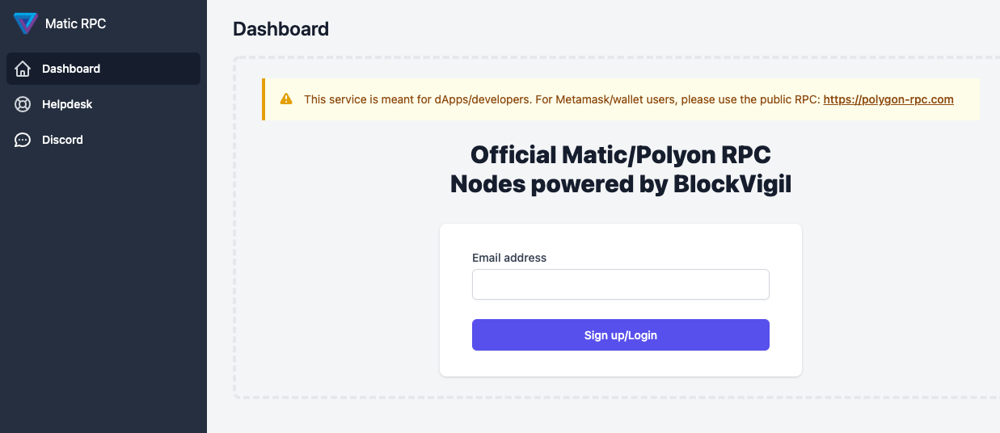
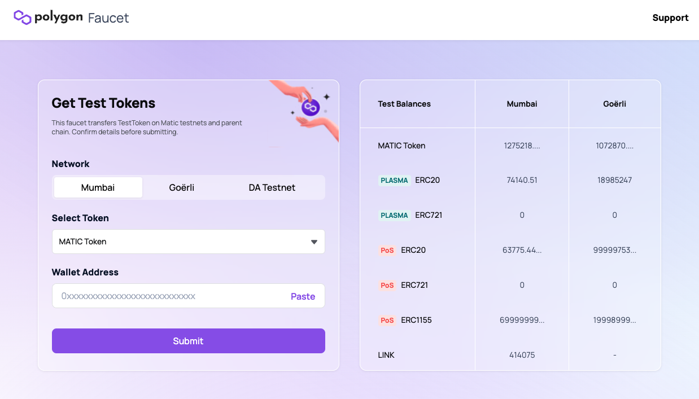

# Polygon 集成入门
## 简介
Polygon 是公共区块链的扩展解决方案。Polygon 支持所有现有的以太坊工具以及更快、更便宜的交易。

如果您希望与 Polygon 集成，那么您来对地方了。如果您是其中之一：

- 一个区块链钱包
- 元交易提供者
- 托管区块链完整节点
- 为以太坊或其他区块链构建开发工具

### 部署智能合约
- 部署合约在 polygon 上
	- [使用 Alchemy](https://docs.polygon.technology/docs/develop/alchemy)
	- [使用 Chainstack](https://docs.polygon.technology/docs/develop/chainstack)
	- [使用 QuickNode](https://docs.polygon.technology/docs/develop/quicknode)
	- [使用 Remix](https://docs.polygon.technology/docs/develop/remix)
	- [使用 Truffle](https://docs.polygon.technology/docs/develop/truffle)
	- [使用 Hardhat](https://docs.polygon.technology/docs/develop/hardhat)
- 将 Web3 RPC-URL 配置为 [https://rpc-mumbai.matic.today](https://rpc-mumbai.matic.today/)，其他一切都保持不变

## 网络
- [网络详细信息](https://docs.polygon.technology/docs/develop/network-details/network)

	查看网络详细信息
- [Polygon Faucet](https://faucet.polygon.technology/) 

	在 Polygon 水龙头处获取 TestTokens

### 网络列表
网络|RPC|状态|父链|区块链游览器
---|---|---|---|---
Mumbai Testnet |[https://rpc.maticvigil.com/](https://rpc.maticvigil.com/)注册一个免费的 RPC 链接|运营中|Goërli| [https://mumbai.polygonscan.com/](https://mumbai.polygonscan.com/)
Polygon Mainnet|[https://rpc.maticvigil.com/](https://rpc.maticvigil.com/)注册一个免费的 RPC 链接|运营中| Eth主网|[https://polygonscan.com/](https://polygonscan.com/)

https://rpc.maticvigil.com/ 注册页面

### 网络详情
#### 如何阅读网络详细信息？
您可以通过访问以下共享支持链接来获取网络详细信息。

- 网络配置

		<static.matic.network/network/"network_name"/"version"/index.json>
- 示例

	对于 TestnetV3：[https ://static.matic.network/network/testnet/v3/index.json](https://static.matic.network/network/testnet/v3/index.json)
	
		{
		  "Main": {
		    "NetworkName": "Ropsten testnet",                                           // 网络名称
		    "ChainId": 3,                                                               // ChainId
		    "RPC": "https://ropsten.infura.io/v3/70645f042c3a409599c60f96f6dd9fbc",     //这是 Ropsten 测试网 RPC
		    "SyncerAPI": "https://testnetv3-syncer.api.matic.network/api/v1",           // 将 Matic 侧链状态同步到 MySQL 数据库的后端服务，我们使用该数据库进行更快的查询。 这特别适合在从 Plasma 退出资产时构建提款证明。
		    "WatcherAPI": "https://testnetv3-watcher.api.matic.network/api/v1",         // 将以太坊主链上的 Matic Plasma 合约事件同步到 MySQL 数据库的后端服务，我们使用该数据库进行更快的查询。 这特别适合收听 Plasma 合约上的资产存款。
		    "DaggerEndpoint": "https://ropsten.dagger.matic.network",                   // Ropsten 中的 Dagger 端点
		    "Explorer": "https://ropsten.etherscan.io",                                 // Ropsten的游览器
		    "Contracts": {
		      "Registry": "0x56B082d0a590A7ce5d170402D6f7f88B58F71988",                 // Ropsten 测试网中主注册表的地址
		      "RootChain": "0x82a72315E16cE224f28E1F1fB97856d3bF83f010",                // Ropsten 测试网中主要 Plasma 合约的地址
		      "DepositManager": "0x4b068Ac93b3b71DB13Fce4c4510Eb70D3022576A",           // Ropsten 测试网中的 DepositManager 合约地址
		      "DepositManagerProxy": "0x3Bc6701cA1C32BBaC8D1ffA2294EE3444Ad93989",      // Ropsten 测试网中的 DepositManagerProxy 合约地址
		      "WithdrawManager": "0xcBd99DfD6fbC55e7596318FC069bC3B7869Ff30a",          // Ropsten 测试网中 WithdrawManager 合约的地址
		      "WithdrawManagerProxy": "0x3cf9aD3395028a42EAfc949e2EC4588396b8A7D4",     //Ropsten 测试网中 WithdrawManagerProxy 合约的地址
		      "StakeManager": "0x0aEd86c6cA8c68C5499cec6F3570e2CA4860A918",             // Ropsten 测试网中 StakeManager 合约的地址
		      "SlashingManager": "0xAb1e2218EAF1b2d242ddDD047BE5f5583A68BA84",          // Ropsten 测试网中 SlashingManager 合约的地址
		      "DelegationManager": "0xba032CD2B41a6FDA32ad9f1DE5623694a47Db9EA",        //Ropsten 测试网中委托管理器合约的地址
		      "ExitNFT": "0xe4202974B2d5b2f26b7A8f27098EC439d1e6C4aa",                  //Ropsten 测试网中 ExitNFT 合约的地址
		      "StateSender": "0x22E1f5aa1BA9e60527250FFeb35e30Aa2913727f",              // Ropsten 测试网中 StateSender 合约的地址
		      "Predicates": {                                                           // Ropsten 中的谓词合约
		        "ERC20Predicate": "0xaBE79B1B44581c69cCc45146dd8681Fb82a8AA18",         
		        "ERC721Predicate": "0x1F07Aa7eB46414d2F89746C7510E8597E82CF698",
		        "MarketplacePredicate": "0x2E3a58bF3644E4D790f93A01527F85E211c57841",
		        "TransferWithSigPredicate": "0x3f0dC47C79254cfCA4195519954b444F87a766E0"
		      },
		      "Tokens": {
		        "MaticWeth": "0x7BdDd37621186f1382FD59e1cCAE0316F979a866",              // Ropsten 中 WrappedEther 的合同
		        "TestToken": "0x28C8713DDe7F063Fdc4cA01aB2A8856e0F243Fec",              // Ropsten 的 ERC20 合同
		        "TestERC721": "0x07d799252cf13c01f602779b4dce24f4e5b08bbd"              // Ropsten 的 ERC721 合同
		      }
		    }
		  },
		  "Matic": {
		    "NetworkName": "Matic testnet",                                             // 网络名称
		    "ChainId": 15001,                                                           // ChainId
		    "RPC": "https://testnetv3.matic.network",                                   // 这是 MATIC 测试网 RPC
		    "RPCWebSocketEndpoint": "wss://testnetv3-wss.matic.network",                //这是 MATIC 测试网 Wss
		    "SyncerAPI": "https://testnetv3-syncer.api.matic.network/api/v1",           // 将 Matic 侧链状态同步到 MySQL 数据库的后端服务，我们使用该数据库进行更快的查询。 这特别适合在从 Plasma 退出资产时构建提款证明。
		    "Explorer": "https://testnetv3-explorer.matic.network/",                    // 游览器
		    "DaggerEndpoint": "https://testnetv3-dagger.matic.network",                 // polygon 中 dagger 的端点
		    "Contracts": {
		      "ChildChain": "0xa2EF03edfA084ac9e5Bf110e409Ed5483BAe4101",               // 这是子链合约地址
		      "Tokens": {
		        "MaticWeth": "0x8567184E6F9b1B77f24AfF6168453419AD22f90e",              // Polygon testnetv3 中 WrappedEther 的 ChildContract
		        "TestToken": "0x9a93c912F4eFf0254d178a18ACD980C1B05b57b0",              // Polygon 测试网中 ERC20 的子合约
		        "TestERC721": "0x8D5231e0B79edD9331e0CF0d4B9f3F30d05C47A5"              // Polygon 测试网中 ERC721 的子合约
		      }
		    }
		  }
		}
		
#### Mumbai 测试网
[点击这里](https://static.matic.network/network/testnet/mumbai/index.json)

	{
	Main: {
	NetworkName: "Goerli",
	ChainId: 5,
	DaggerEndpoint: "wss://goerli.dagger.matic.network",
	WatcherAPI: "https://staking.api.subgraph.matic.today/api/v2",
	StakingAPI: "https://staking.api.subgraph.matic.today/api/v2",
	Explorer: "https://goerli.etherscan.io",
	SubgraphUrl: "https://api.thegraph.com/subgraphs/name/maticnetwork/mumbai-root-subgraphs",
	SupportsEIP1559: true,
	Contracts: {
	BytesLib: "0xde5807d201788dB32C38a6CE0F11d31b1aeB822a",
	Common: "0x84Dc17F28658Bc74125C7E82299992429ED34c12",
	ECVerify: "0xccd1d8d16F462f9d281024CBD3eF52BADB10131C",
	Merkle: "0xCD87Be2Df3de01EA23666c97104613ec252300E8",
	MerklePatriciaProof: "0x3a0Db8fa2805DEcd49cCAa839DaC15455498EDE2",
	PriorityQueue: "0xD26361204b8e4a4bb16668bfE7A1b9106AD17140",
	RLPEncode: "0xDE0D18799a20f29d9618f8DDbf4c2b029FAdc491",
	RLPReader: "0xA5e463c187E53da5b193E2beBca702e9fEeA3738",
	SafeMath: "0x1bEb355BE0577E61870C4c57DAaa6e2129dd0604",
	Governance: "0x03Ac67D03A06571A059F20425FFD1BEa300d98C2",
	GovernanceProxy: "0xAcdEADEE4c054A86F5b1e8705126b30Ec999899B",
	Registry: "0xeE11713Fe713b2BfF2942452517483654078154D",
	RootChain: "0x77f32d6c7bf3639b2f59c6843420e80e9e3a86af",
	RootChainProxy: "0x2890bA17EfE978480615e330ecB65333b880928e",
	ValidatorShareFactory: "0x5737AD9095AB4d55FeE7F972ea7F86734695E3c1",
	StakingInfo: "0x29C40836C17f22d16a7fE953Fb25DA670C96d69E",
	StakingNFT: "0x532c7020E0F3666f9440B8B9d899A9763BCc5dB7",
	StakeManager: "0xc1b9b1ff63ef14502f7c6c8e9f5eed47654695ae",
	StakeManagerProxy: "0x00200eA4Ee292E253E6Ca07dBA5EdC07c8Aa37A3",
	SlashingManager: "0xDD17DE137c7Cc288E022fE95a3B398C94BDd5b83",
	ValidatorShare: "0xa7957328580692f6440948c3c479a9cde17de206",
	StateSender: "0xEAa852323826C71cd7920C3b4c007184234c3945",
	DepositManager: "0x20339c5Ea91D680E681B9374Fc0a558D5b96a026",
	DepositManagerProxy: "0x7850ec290A2e2F40B82Ed962eaf30591bb5f5C96",
	WithdrawManager: "0xb075cdda944d4e1ff19f2201cdc3a440a11d4710",
	WithdrawManagerProxy: "0x2923C8dD6Cdf6b2507ef91de74F1d5E0F11Eac53",
	ExitNFT: "0xE2Ab047326B38e4DDb6791551e8d593D30E02724",
	ERC20Predicate: "0xf213e8ff5d797ed2b052d3b96c11ac71db358027",
	ERC721Predicate: "0x473cb675c9214f79dee10948443509c441a678e7",
	EIP1559Burn: "0x70bca57f4579f58670ab2d18ef16e02c17553c38",
	Tokens: {
	MaticToken: "0x499d11E0b6eAC7c0593d8Fb292DCBbF815Fb29Ae",
	TestToken: "0x3f152B63Ec5CA5831061B2DccFb29a874C317502",
	RootERC721: "0xfA08B72137eF907dEB3F202a60EfBc610D2f224b",
	MaticWeth: "0x60D4dB9b534EF9260a88b0BED6c486fe13E604Fc"
	}
	},
	POSContracts: {
	Merkle: "0x0ef207185e0c1631beb5514eb76501dd16ff9258",
	MerklePatriciaProof: "0xfa76e5b10a0131573176bd2802535b4a9e76fecb",
	RLPReader: "0x383b6b577298a35fd8ee18536d3915db6039468f",
	SafeERC20: "0xcf0902e21c85ba20633c89523c9a0bfa04de3ec5",
	RootChainManager: "0x0d2ae21bf7e72f646ef8e1f2aa92edbd13588691",
	RootChainManagerProxy: "0xBbD7cBFA79faee899Eaf900F13C9065bF03B1A74",
	DummyStateSender: "0x4Ad6FFD6D9b49E832e5ac56f5aEcaB137F9F91C6",
	ERC20Predicate: "0x4b1544c9b01707f68f97ee70083e96ebe9bfe633",
	ERC20PredicateProxy: "0xdD6596F2029e6233DEFfaCa316e6A95217d4Dc34",
	ERC721Predicate: "0xaa94c8e8b93cf019353db81bc55c95f74ca27b8a",
	ERC721PredicateProxy: "0x74D83801586E9D3C4dc45FfCD30B54eA9C88cf9b",
	ERC1155Predicate: "0xb6ef1d4dbad1f226b04100bcb154c12b0410cfc9",
	ERC1155PredicateProxy: "0xB19a86ba1b50f0A395BfdC3557608789ee184dC8",
	EtherPredicate: "0xcfa4746e2ffa649ede74c78c30be0bd7860e54c2",
	EtherPredicateProxy: "0xe2B01f3978c03D6DdA5aE36b2f3Ac0d66C54a6D5",
	MintableERC20Predicate: "0x21b018b6FA1A563B25ff3E19F814B09dFdC83067",
	MintableERC20PredicateProxy: "0x37c3bfC05d5ebF9EBb3FF80ce0bd0133Bf221BC8",
	MintableERC721Predicate: "0x12919a30447ff59947740507362a05b8bea9a6e7",
	MintableERC721PredicateProxy: "0x56E14C4C1748a818a5564D33cF774c59EB3eDF59",
	MintableERC1155Predicate: "0xe8f4879dc09f41824c0a7e279bc68fa16b201b9e",
	MintableERC1155PredicateProxy: "0x72d6066F486bd0052eefB9114B66ae40e0A6031a",
	Tokens: {
	DummyERC20: "0x655F2166b0709cd575202630952D71E2bB0d61Af",
	DummyERC721: "0x084297B12F204Adb74c689be08302FA3f12dB8A7",
	DummyERC1155: "0x2e3Ef7931F2d0e4a7da3dea950FF3F19269d9063",
	DummyMintableERC20: "0x6668BfceC8F6fE54B57Da04D487d1fC95FEd78cb",
	DummyMintableERC721: "0xFf3aD71e6323dD584348d3E5FfFD4d07d82a2355",
	DummyMintableERC1155: "0x9f5755D47fB80100E7ee65Bf7e136FCA85Dd9334"
	}
	},
	FxPortalContracts: {
	FxRoot: "0x3d1d3E34f7fB6D26245E6640E1c50710eFFf15bA",
	FxERC20RootTunnel: "0x79B77456684AEB0bf7c8Ec50FB9c714d52BdA46c",
	FxERC721RootTunnel: "0x823eF03B39C339337E451d82cEC57f31316de15F",
	FxERC1155RootTunnel: "0x186C72e49a3Db03E9161Ca18e52C09DE9468Bfc9"
	}
	},
	Matic: {
	NetworkName: "Mumbai",
	ChainId: 80001,
	RPC: "https://matic-mumbai.chainstacklabs.com",
	DaggerEndpoint: "wss://mumbai-dagger.matic.today",
	Explorer: "https://mumbai.polygonscan.com",
	NetworkAPI: "https://apis.matic.network/api/v1/mumbai",
	SupportsEIP1559: true,
	Contracts: {
	EIP1559Burn: "0x70bca57f4579f58670ab2d18ef16e02c17553c38",
	ChildChain: "0x1EDd419627Ef40736ec4f8ceffdE671a30803c5e",
	Tokens: {
	MaticWeth: "0x4DfAe612aaCB5b448C12A591cD0879bFa2e51d62",
	MaticToken: "0x0000000000000000000000000000000000001010",
	TestToken: "0x2d7882beDcbfDDce29Ba99965dd3cdF7fcB10A1e",
	RootERC721: "0x33FC58F12A56280503b04AC7911D1EceEBcE179c",
	WMATIC: "0x9c3C9283D3e44854697Cd22D3Faa240Cfb032889"
	}
	},
	POSContracts: {
	ChildChainManager: "0x2e5e27d50EFa501D90Ad3638ff8441a0C0C0d75e",
	ChildChainManagerProxy: "0xb5505a6d998549090530911180f38aC5130101c6",
	Tokens: {
	DummyERC20: "0xfe4F5145f6e09952a5ba9e956ED0C25e3Fa4c7F1",
	DummyERC721: "0x757b1BD7C12B81b52650463e7753d7f5D0565C0e",
	DummyERC1155: "0xA07e45A987F19E25176c877d98388878622623FA",
	DummyMintableERC20: "0x4d350e8A3C0D57714d3b80c9e2030ab8f1Bb7875",
	DummyMintableERC721: "0xd854928B54c408F1D38D869BE744c9E6Ce0A2448",
	DummyMintableERC1155: "0xfAc5F13459EB4241D2C3F8BbfC2789FC006BCBc8",
	MaticWETH: "0xA6FA4fB5f76172d178d61B04b0ecd319C5d1C0aa"
	}
	},
	FxPortalContracts: {
	FxChild: "0xCf73231F28B7331BBe3124B907840A94851f9f11",
	FxERC20ChildTunnel: "0x9dee38B0D819c78cEBAbc86707019dA18f25E6Cc",
	FxERC721ChildTunnel: "0x52001E25F365Fa1f03AC8f8aCc8c8eCcc662e5e1",
	FxERC1155ChildTunnel: "0x886425F120AC6d7E79dD7BB1fA5689B5887F985c"
	},
	GenesisContracts: {
	BorValidatorSet: "0x0000000000000000000000000000000000001000",
	StateReceiver: "0x0000000000000000000000000000000000001001"
	}
	},
	Heimdall: {
	ChainId: "heimdall-80001",
	API: "https://heimdall.api.matic.today"
	}
	}
#### Polygon 主网
[点这里](https://github.com/maticnetwork/static/blob/master/network/mainnet/v1/index.json)

	{
	  "Main": {
	    "NetworkName": "Ethereum",
	    "ChainId": 1,
	    "DaggerEndpoint": "wss://mainnet.dagger.matic.network",
	    "WatcherAPI": "https://sentinel.matic.network/api/v2",
	    "StakingAPI": "https://sentinel.matic.network/api/v2",
	    "Explorer": "https://etherscan.io",
	    "SubgraphUrl": "https://api.thegraph.com/subgraphs/name/maticnetwork/mainnet-root-subgraphs",
	    "SupportsEIP1559": true,
	    "Contracts": {
	      "BytesLib": "0x1d21fACFC8CaD068eF0cbc87FdaCdFb20D7e2417",
	      "Common": "0x31851aAf1FA4cC6632f45570c2086aDcF8B7BD75",
	      "ECVerify": "0x71d91a8988D81617be53427126ee62471321b7DF",
	      "Merkle": "0x8b90C7633F1f751E19E76433990B1663c625B258",
	      "MerklePatriciaProof": "0x8E51a119E892D3fb324C0410F11f39F61dec9DC8",
	      "PriorityQueue": "0x61AdDcD534Bdc1721c91740Cf711dBEcE936053e",
	      "RLPEncode": "0x021c2Bf4d2941cE3D593e07317EC355937bae495",
	      "RLPReader": "0xD75f1d6A8A7Dc558A65c2f30eBF876DdbeE035a2",
	      "SafeMath": "0x96D358795782a73d90F2ed2d505aB235D197ca05",
	      "Governance": "0x98165b71cdDea047C0A49413350C40571195fd07",
	      "GovernanceProxy": "0x6e7a5820baD6cebA8Ef5ea69c0C92EbbDAc9CE48",
	      "Registry": "0x33a02E6cC863D393d6Bf231B697b82F6e499cA71",
	      "RootChain": "0x536c55cFe4892E581806e10b38dFE8083551bd03",
	      "RootChainProxy": "0x86E4Dc95c7FBdBf52e33D563BbDB00823894C287",
	      "ValidatorShareFactory": "0xc4FA447A0e77Eff9717b09C057B40570813bb642",
	      "StakingInfo": "0xa59C847Bd5aC0172Ff4FE912C5d29E5A71A7512B",
	      "StakingNFT": "0x47Cbe25BbDB40a774cC37E1dA92d10C2C7Ec897F",
	      "StakeManager": "0xd6f5c46d4e1a02f9d145cee41d2f8af30d8d2d76",
	      "StakeManagerProxy": "0x5e3Ef299fDDf15eAa0432E6e66473ace8c13D908",
	      "SlashingManager": "0x01F645DcD6C796F6BC6C982159B32fAaaebdC96A",
	      "ValidatorShare": "0x01d5dc56ad4206bb0c132d834644d57f51fed5ec",
	      "StateSender": "0x28e4F3a7f651294B9564800b2D01f35189A5bFbE",
	      "DepositManager": "0xd505C3822C787D51d5C2B1ae9aDB943B2304eB23",
	      "DepositManagerProxy": "0x401F6c983eA34274ec46f84D70b31C151321188b",
	      "WithdrawManager": "0x017C89Ca4Bda3D66cC65E3d20DD95432258201Ca",
	      "WithdrawManagerProxy": "0x2A88696e0fFA76bAA1338F2C74497cC013495922",
	      "ExitNFT": "0xDF74156420Bd57ab387B195ed81EcA36F9fABAca",
	      "ERC20Predicate": "0x158d5fa3ef8e4dda8a5367decf76b94e7effce95",
	      "ERC721Predicate": "0x54150f44c785d412ec262fe895cc3b689c72f49b",
	      "EIP1559Burn": "0x70bca57f4579f58670ab2d18ef16e02c17553c38",
	      "Tokens": {
	        "MaticToken": "0x7D1AfA7B718fb893dB30A3aBc0Cfc608AaCfeBB0",
	        "TestToken": "0x3db715989dA05C1D17441683B5b41d4510512722",
	        "RootERC721": "0x96CDDF45C0Cd9a59876A2a29029d7c54f6e54AD3",
	        "MaticWeth": "0xa45b966996374E9e65ab991C6FE4Bfce3a56DDe8"
	      }
	    },
	    "POSContracts": {
	      "Merkle": "0x195fe6EE6639665CCeB15BCCeB9980FC445DFa0B",
	      "MerklePatriciaProof": "0xA6FA4fB5f76172d178d61B04b0ecd319C5d1C0aa",
	      "RLPReader": "0xBEFe614A45A8300f2a4A00fb634b7137b6b1Bc47",
	      "SafeERC20": "0xeFfdCB49C2D0EF813764B709Ca3c6fe71f230E3e",
	      "SafeMath": "0x6EBEAC13f6403D19C95b6B75008B12fd21a93Aab",
	      "RootChainManager": "0x7cfa0f105a4922e89666d7d63689d9c9b1ea7a19",
	      "RootChainManagerProxy": "0xA0c68C638235ee32657e8f720a23ceC1bFc77C77",
	      "ERC20Predicate": "0x608669d4914eec1e20408bc4c9efff27bb8cbde5",
	      "ERC20PredicateProxy": "0x40ec5B33f54e0E8A33A975908C5BA1c14e5BbbDf",
	      "ERC721Predicate": "0xb272b6d99858b0efb079946942006727fe105201",
	      "ERC721PredicateProxy": "0xE6F45376f64e1F568BD1404C155e5fFD2F80F7AD",
	      "ERC1155Predicate": "0x62d7e87677ac7e3bd02c198e3fabeffdbc5eb2a3",
	      "ERC1155PredicateProxy": "0x0B9020d4E32990D67559b1317c7BF0C15D6EB88f",
	      "MintableERC20Predicate": "0xFdc26CDA2d2440d0E83CD1DeE8E8bE48405806DC",
	      "MintableERC20PredicateProxy": "0x9923263fA127b3d1484cFD649df8f1831c2A74e4",
	      "MintableERC721Predicate": "0x58adfa7960bf7cf39965b46d796fe66cd8f38283",
	      "MintableERC721PredicateProxy": "0x932532aA4c0174b8453839A6E44eE09Cc615F2b7",
	      "MintableERC1155Predicate": "0x62414d03084eeb269e18c970a21f45d2967f0170",
	      "MintableERC1155PredicateProxy": "0x2d641867411650cd05dB93B59964536b1ED5b1B7",
	      "EtherPredicate": "0x499a865ac595e6167482d2bd5a224876bab85ab4",
	      "EtherPredicateProxy": "0x8484Ef722627bf18ca5Ae6BcF031c23E6e922B30",
	      "DummyStateSender": "0x53E0bca35eC356BD5ddDFebbD1Fc0fD03FaBad39",
	      "Tokens": {
	        "DummyERC20": "0xf2F3bD7Ca5746C5fac518f67D1BE87805a2Be82A",
	        "DummyERC721": "0x71B821aa52a49F32EEd535fCA6Eb5aa130085978",
	        "DummyMintableERC721": "0x578360AdF0BbB2F10ec9cEC7EF89Ef495511ED5f",
	        "DummyERC1155": "0x556f501CF8a43216Df5bc9cC57Eb04D4FFAA9e6D"
	      }
	    },
	    "FxPortalContracts": {
	      "FxRoot": "0xfe5e5D361b2ad62c541bAb87C45a0B9B018389a2",
	      "FxERC20RootTunnel": "0xF1D80Ecb5de086b197EB2683513A3Da4061F0102",
	      "FxERC721RootTunnel": "0xca1f5ec720eCdA31bE3d80BD3ef4686cBb07eb4D",
	      "FxERC1155RootTunnel": "0x1E2baf7541C68FAfd0560FB87D2eAb0c4E51589d"
	    }
	  },
	  "Matic": {
	    "NetworkName": "Polygon",
	    "ChainId": 137,
	    "RPC": "https://polygon-rpc.com",
	    "DaggerEndpoint": "wss://matic-mainnet.dagger.matic.network",
	    "Explorer": "https://polygonscan.com",
	    "NetworkAPI": "https://apis.matic.network/api/v1/matic",
	    "SupportsEIP1559": true,
	    "Contracts": {
	      "ChildChain": "0xD9c7C4ED4B66858301D0cb28Cc88bf655Fe34861",
	      "EIP1559Burn": "0x70bca57f4579f58670ab2d18ef16e02c17553c38",
	      "Tokens": {
	        "MaticWeth": "0x8cc8538d60901d19692F5ba22684732Bc28F54A3",
	        "MaticToken": "0x0000000000000000000000000000000000001010",
	        "TestToken": "0x5E1DDF2e5a0eCDD923692d4b4429d8603825A8C6",
	        "RootERC721": "0xa35363CFf92980F8268299D0132D5f45834A9527",
	        "WMATIC": "0x0d500B1d8E8eF31E21C99d1Db9A6444d3ADf1270"
	      }
	    },
	    "POSContracts": {
	      "ChildChainManager": "0xa40fc0782bee28dd2cf8cb4ac2ecdb05c537f1b5",
	      "ChildChainManagerProxy": "0xA6FA4fB5f76172d178d61B04b0ecd319C5d1C0aa",
	      "Tokens": {
	        "DummyERC20": "0xeFfdCB49C2D0EF813764B709Ca3c6fe71f230E3e",
	        "DummyERC721": "0x6EBEAC13f6403D19C95b6B75008B12fd21a93Aab",
	        "DummyMintableERC721": "0xD4888faB8bd39A663B63161F5eE1Eae31a25B653",
	        "DummyERC1155": "0xA0c68C638235ee32657e8f720a23ceC1bFc77C77",
	        "MaticWETH": "0x7ceB23fD6bC0adD59E62ac25578270cFf1b9f619"
	      }
	    },
	    "FxPortalContracts": {
	      "FxChild": "0x8397259c983751DAf40400790063935a11afa28a",
	      "FxERC20ChildTunnel": "0x0cC2CaeD31490B546c741BD93dbba8Ab387f7F2c",
	      "FxERC721ChildTunnel": "0x2b4732e448b3023131a7b25046b3A5EF50CfCf71",
	      "FxERC1155ChildTunnel": "0x80a708B92939B373e86eF8e8cfc9e05EfE2f5e49"
	    },
	    "GenesisContracts": {
	      "BorValidatorSet": "0x0000000000000000000000000000000000001000",
	      "StateReceiver": "0x0000000000000000000000000000000000001001"
	    }
	  },
	  "Heimdall": {
	    "ChainId": "heimdall-137",
	    "API": "https://heimdall-api.polygon.technology"
	  }
	}
#### Polygon 水龙头
[点击这里](https://faucet.polygon.technology/)

	

### 高级
#### 最低硬件要求
测试网硬件最低标准配置

- 全节点的最低硬件配置#
	- 内存：16-32 GB
	- CPU：4-8核CPU（t3 xLarge）
	- 存储：至少 650GB SSD（确保它是可扩展的）

	虽然我们不赞成任何操作系统，但更安全和稳定的 Linux 服务器发行版（如 CentOS）应该优于桌面操作系统（如 Mac OS 和 Windows）。

我们将在适当的时候提供有关硬件设置的更详细信息。

#### 部署全节点
- 全节点二进制文件部署，参考开发文档
- 全节点部署，参考开发文档

