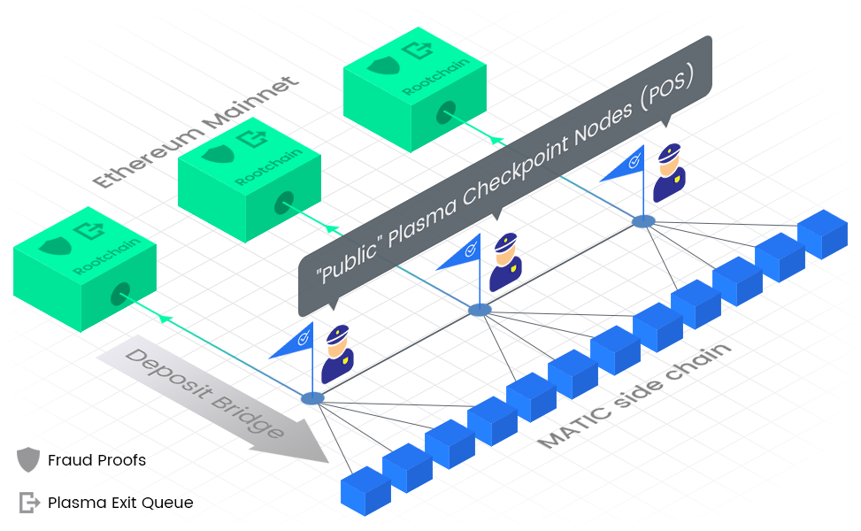
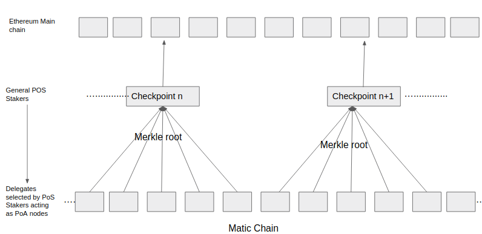

## polygon 常见问题
### 什么是 polygon？#
Polygon 是一种基于侧链的公共区块链扩展解决方案。它基于 Plasma 框架的改编实现。Polygon 提供可扩展性，同时以安全和分散的方式确保卓越的用户体验。它在 Kovan 测试网上有一个适用于以太坊的工作实现。Polygon 打算在未来支持其他区块链，这将使其能够提供互操作性功能，同时为现有公共区块链提供可扩展性。
### Polygon 与 Plasma 的其他实现有何不同？
Polygon 的 Plasma 实现建立在 EVM 上运行的基于状态的侧链上，而 Plasma 的其他实现主要使用 UTXO，这将它们限制为特定于支付。拥有基于状态的侧链允许 Polygon 为通用智能合约提供可扩展性。

其次，Polygon 使用公共检查点层，该层在定期间隔后发布检查点（与 Plasma Cash 中每个块之后的检查点不同），允许侧链在批量发布检查点的同时高速运行。这些检查点以及欺诈证明确保 Polygon 的侧链以安全的方式运行，并且可以在以太坊主链上检测到任何欺诈活动，并通过削减不良行为者的赌注来惩罚。这种主链安全性是对侧链上 PoS 协议安全性的补充。
### 您的项目使用 plasma 链为以太坊提供可扩展性，它本身是协议还是原生区块链？#
Polygon Network 是一种“侧链”解决方案，以太坊主链资产，即主链的所有 Dapps/Tokens/Protocols 都可以移动/迁移到 Polygon 侧链，并在需要时可以将资产撤回主链。
### Polygon 相对于其竞争对手的竞争优势是什么？
- L2 扩展解决方案

	Polygon 致力于通过去中心化实现规模化。Polygon 使用定期检查点和欺诈证明，如 Plasma 框架中所述。当用户想要提取他们的资产时，他们使用检查点来证明他们在侧链上的资产，而需要欺诈证明来挑战欺诈或任何不良行为并削减质押者。

	而 Loom 等其他项目也提供 L2 缩放解决方案。Loom 最近宣布了可能与 Polygon 有相似之处的 Zombiechain 计划。
	
	但是我们在两个关键要素上有所不同：

	- 首先，重点不同点在于 Loom 专注于游戏和社交应用程序（需要相对较少的去中心化），而 Polygon 不仅专注于金融交易/交易，还专注于游戏和其他休闲 Dapps。我们还计划提供全面的金融服务，例如借贷/交易 DApp（代币互换、保证金交易等等）
	- 其次，我们认为 Loom 想要“在未来”使用的 Plasma Cash 的出块时间将大于以太坊的出块时间，因为您需要将侧链的每个块推送到主链，而 Polygon 使用检查点机制 1 - 秒块时间（使用 PoS 层）

	由于 Plasma Cash 与不可替代代币 (NFT) 一起使用，它非常适用于您有预定义费用的游戏卡和社会状态变化（捆绑为 NFT - 例如玩游戏的“20 个代币”等于 Plasma 现金上的 1 个 NFT 硬币）。对于正常的代币转移，您可能需要在 Plasma 现金之上交换代币（如纸币和零钱），这使得在提供友好的用户体验的同时难以实施。Plasma 调用仍在讨论它，而 Polygon 使用基于状态的 Plasma（更接近 Plasma MVP）。
- L1 扩展解决方案

	除此之外，在 Ziliqa 和 Quarkchain 等其他扩展项目中，Polygon 因其在保持高度去中心化的同时实现扩展的能力而脱颖而出。

	更重要的是，这些可扩展性项目有一个重新发明轮子的问题。他们正在创建新的区块链，开发者社区、产品生态系统、技术文档，更重要的是，企业需要从“零开始”构建。
	
	而 Polygon 是支持 EVM 的链、编程语言、开发人员文档等，Polygon 现成可用。建立在以太坊主链上的所有 Dapps/资产都具有可扩展性，只需单击一个按钮即可。这可以通过 Polygon 作为基于 EVM 的侧链来实现。
- 付款

	在支付方面，雷电网络可以成为竞争对手。雷电在以太坊上实现了闪电网络。一个重要的问题是枢纽的容量/流动性。但是对于雷电来说，这个问题被进一步放大，因为闪电网络只有一种资产（比特币）供枢纽保持流动性，而雷电网络必须为无数资产（以太币、ERC20 代币）实现流动性

	我们认为 Polygon 在可用性方面具有优势，因为在 Raiden 中，发送方和接收方都必须创建自己的支付渠道。这对用户来说非常麻烦。而使用 Polygon 的底层技术，用户不需要支付渠道，他们只需要拥有有效的以太坊地址即可接收代币。这也符合我们改善去中心化应用程序用户体验的长期愿景。
- 贸易和金融

	Polygon 打算在其平台上启用 DEX（例如 0x）、流动性池（例如 Kyber Network）和其他类型的金融协议，如借贷协议（Dharma Protocol），这将使 Polygon 用户能够使用各种金融服务应用程序，如 DEX、借贷 DApps 和许多其他
- 其他

	此外，Polygon 的核心重点是创建具有增强用户体验的应用程序，这将有助于 DApp 的大规模采用。为了同样的最终目标，我们打算构建生态系统工具。我们的产品，如 Dagger（在以太坊社区中广为人知）和 Opensigner（Walletconnect 协议的实现和完整的 Node.js 实现）证明了这一点 

- [walletconnect](https://github.com/WalletConnect/walletconnect-monorepo)
- [Dagger](https://github.com/maticnetwork/eth-dagger.js)
- [Sol-Trace](https://github.com/maticnetwork/sol-trace.js)

### Polygon 与 POA/Go-Chain 等其他侧链解决方案相比如何？#
Polygon 最大的区别在于 Plasma 框架，它确保了侧链交易的去中心化和安全性。

POA 等项目使用经过政府公证的区块生产者，Go-Chain 依赖于各国的机构。这样的公共区块生产者很有可能受到强大的外部机构和自身利益的影响。

此外，侧链交易仅由侧链共识保护，其中参与者的数量非常少 3-25，而在 Polygon 上，所有侧链交易均由侧链和主链上的多种机制保护。

在侧链上，由区块生产者层完成的任何交易都通过高度分散的检查点层验证并检查点到主链。因此，如果任何欺诈交易发生在侧链上，它可以被检查点层检测和处理。即使在区块生产者层和检查点层都串通的极端和极不可能的情况下，即使这样，主链也有欺诈证明，任何来自公众的人都可以来挑战他们认为在侧链上存在欺诈的任何交易。如果挑战成功，随着他们的赌注被削减，合谋各方将受到巨大的经济抑制/经济惩罚。此外，公共挑战者将获得削减欺诈侧链参与者的股份。

这使得 Polygon 成为一个经济激励的侧链网络，具有高度的去中心化和侧链交易的安全性。

其次，Polygon 侧链的容量和 TPS 远高于 POA 和 Go-chain。尤其是当 Polygon 可以有数千笔交易，而 POA 和 Go-chain 是单侧链时，数千笔交易的上限更高。
### 通过什么原则添加新的侧链？民营企业的本地侧链会有什么特殊要求吗？#
如上所述，可以使用 Plasma 框架实现单个第 1 层区块链（例如以太坊）的侧链。相对于状态通道，Plasma 代表了可扩展框架的更好替代方案，主要是由于该框架提供的安全保证——这基本上表明用户在任何情况下都不会损失资金。当然，取回资金可能会有延迟，但拜占庭 Plasma 保证了运营商不能凭空创造资金或者双花交易。

Polygon 将在未来努力成为一个完全开放和公共的区块链基础设施，其中经济激励/抑制将主要推动系统的安全性和稳定性。所以任何人都应该能够加入系统并参与共识。然而，在网络播种阶段，最初 Polygon 必须发挥更大的作用才能启用侧链。

此外，Polygon 侧链将主要是公共侧链，即像其他公共区块链一样可供任何人在公共场合使用的侧链。虽然，Enterprise Polygon 链将打算为特定组织提供专用的侧链（非隐私启用）。使用检查点层和主链上的欺诈证明，此类链的安全性和去中心化仍将保持不变。然而，在主链上支持具有检查点验证和欺诈证明的隐私侧链仍然是我们的研究课题。我们正在研究像 zkSNARK 和 zkSTARK 这样的新技术。
### Polygon 与 Celer Network 有何不同？#
Polygon 和 Celer Network 都是针对同一问题的不同解决方案——当前区块链中的低交易吞吐量。两者都利用链下扩展技术，并依靠主链获得最终安全性；然而，根本区别在于方法 

- Polygon 基于由 Proof-of-Stake 共识支持的一组 Plasma 侧链（有关更多详细信息，请参见 [https://plasma.io/](https://plasma.io/)）

- Celer Network 是一个状态- 基于渠道的解决方案。

这两个项目都旨在实现链下的广义状态转换，但方式截然不同。

- Polygon 的目标是建立一个 DApp 开发者生态系统。由于它使用基于帐户的 Plasma 侧链，并且还采用了与 EVM 兼容的运行时，称为 Polygon VM，因此基于以太坊的 DApp 在上线后迁移到 Polygon 会相对容易
- 在这方面，Celer Network 在开发人员接口方面也有所不同。

### 侧链是否也会与主链（以太坊）同步？#
绝对地！如前所述，我们正在 Plasma 的基础上实施 Polygon 基础设施。为此，Plasma 框架要求在主链上发布在侧链上产生的交易/区块的证明。公共检查点层将验证侧链上发生的所有交易并将证明发布到主链。为了确保侧链交易的万无一失的安全性，主链 Plasma 合约包含各种欺诈证明，任何侧链交易都可能因任何欺诈活动而受到质疑。如果挑战者成功，参与欺诈的侧链参与者的股份将被削减并转移给挑战者。这相当于一个永远运行的高风险漏洞赏金。一个很好的理解图表如下：

### 会实施原子交换吗？如果是，如何做到？#
有很多方法可以做到这一点，如 Swingyby 协议、Doge/ETH 桥接器，[查看这篇](https://medium.com/truebit/enter-the-rabbit-hole-the-doge-ethereum-art-project-31e8116043c4) Medium 的文章、哈希时间锁定合约或简单挂钩。随着我们的前进，我们将选择最适合 UI/UX 和安全性的选项。一旦来自多个区块链的资产在侧链上可用，DEX 将能够在最初来自不同基础链的资产之间提供交换。
### 在白皮书的最后，有一个“潜在用例”列表——所有这些都会被实施吗？按什么顺序？#
Polygon Foundation 将支持并支持生态系统团队开发这些潜在的用例。我们不打算自己实施所有这些项目——我们不希望给人留下这种印象。我们希望 Polygon 成为一个 DApp 平台，它将以低成本提供即时交易。一旦 Polygon 上线，我们将继续为所有这些用例添加支持。我们将依靠社区团队在我们的平台上与我们合作来创建这些应用程序。

- 基本逻辑是

	如果有一个在以太坊上运行的 DApp/协议，但受到低交易吞吐量和高交易费用的限制——那么我们将能够在 Polygon 上添加对这些 DApp/协议的支持。
- 最终目标是提出广义状态缩放

	然而，这需要时间。我们已经在与 Parsec Labs、Truebit 和 Decentraland 等团队合作开展这项计划 [这里](https://parseclabs.org/blog/Development-Update-May-2018/)和[这里](https://blog.decentraland.org/blockchain-security-will-it-scale-5d82c5df4640)的其他项目很少提及 Matic 。

但在此之前，我们将添加对特定合约和协议的支持。一旦合约得到欺诈证明保证，它就可以在 Polygon 上运行，并且可以被 DApps 使用。

优先顺序是 

- DEX
- 支付
- 流动性提供者
- 借贷和信用评分
- 原子交换

尽管这些功能中的大多数将并行运行，但我们正在与各个顶级团队进行谈判，以与我们合作在 Polygon 侧链上部署这些协议。

### 为什么复制 Polygon 的 Plasma 实现会很困难？#
尽管使用区块链解决方案更多的是关于网络效应，即哪个网络能够比其他网络更好地扩展/发展生态系统，但更重要的是，对于区块链解决方案，它们必须强制开源，因为它需要其中使用的实际资产。

所有开源项目也是如此。它同样适用于我们以及其他竞争对手的实现，因为我们将获得 GPL 许可证，该许可证要求任何使用我们实现的人强制开源他们的代码。但再次强调，代码的复制甚至适用于比特币、以太坊和任何其他项目，更多的是一个项目可以实现的网络效应。
### Polygon Network 的 Plasma 实现有什么特别之处？#
所以 Plasma Polygon 使用基于账户的模型系统，而不是 Plasma Cash、Plasma MVP 和 Plasma XT 使用的 UTXO 系统。这为我们提供了在 Polygon 链上使用 EVM 的巨大优势，使我们能够为 Polygon 使用整个以太坊生态系统、开发人员工具、集成库等。

Dapps 可以轻松使用 Polygon 系统，而无需对其 ERC20 代币进行任何更改。此外，我们的检查点层使我们能够比其他 Plasma 实现快数倍，因为我们在检查点中批量处理单个块的证明，而其他 Plasma 实现必须将每个块证明提交给主链
### 您将如何解决中心化问题？#
这是一个图表，可以为您提供一些背景信息：

因此，

- 首先，您看到的 PoA 节点将是代表（具有偿付能力证明，即他们必须存入大量股份）和 KYC 基本上由 PoS 层选择，就像 EOS 风格的 DPoS 或 DBFT 节点一样。
- 其次，让我们假设所有代表（或其中 2/3 的代表）都变成了不良行为者并产生了错误的区块，那么您将拥有 PoS 层的质押者，他们将验证所有区块，如果存在任何欺诈行为，代表的股份将被削减，检查点停止以进行纠正操作。
- 第三，假设即使是 Staker PoS 层（这将是大量节点）也变坏并串通产生错误的检查点。即所有的 PoA 都是腐败的，PoS 也是腐败的,即使遵循 Plasma 哲学，我们正在编写令人垂涎的侧链扩展之一，欺诈证明，许多大型项目都在关注它（观察者可以被视为我们在 Github 上的存储库观察者)。这种欺诈证明机制使任何人都可以公开挑战主链上的任何交易，并获得成功，他们将从削减参与欺诈的所有利益相关者的股份中获得回报。

### 为什么需要 Matic 代币？#
以下原因强化了拥有 Matic 代币的必要性
#### Polygon 旨在成为公共区块链的通用扩展解决方案：#
我们从以太坊开始作为我们的第一个基础链，但未来 Polygon 可以部署在多个基础链上。很快就会添加其他基础链，因此使用一种货币（以太币）来支付侧链的费用是没有意义的。如果对任何 basechains 的未来存在存在担忧，那么将该 basechains 的货币作为 Polygon 的本地资产将削弱扩展网络。因此，在 Polygon 自己的网络代币上构建 Staker 生态系统非常重要。
#### Appcoin安全模型：#
Polygon 打算通过使用像 Kyber 这样的流动性池抽象代币交换机制，使 Dapps 能够以 Dapp 币支付 Polygon 费用。用户只需使用她的 Dapp 币支付费用，在后台将 Dapp 币换成 Matic 代币。因此，想要提供无缝用户体验的 DApp 开发人员将有助于维护 Polygon 流动性池。
#### 在新生阶段播种网络：#
当一开始网络中几乎没有 txns 时，几乎不可能为系统播种，因为我们无法将 Eth 分配给高度去中心化的验证者层和区块生产者。在使用 Matic 代币的同时，我们已经提供了很大比例的代币，用于分发区块生产者、检查点质押并随后提供区块奖励。即使网络需要一些时间来承担网络效应，这项规定也能确保质押者获得奖励。这类似于为什么为比特币保留 Block Mining 奖励，可以通过这种方式激励质押者和块生产者以保持网络安全。

如果您关心的是开发人员，我们战略的支柱之一就是将开发人员的进入门槛保持在非常低的水平。我们已确保所有以太坊开发工具都可以在 Polygon 上开箱即用。就在测试网上支付费用所需的代币而言，对于在以太坊上开发的开发人员来说并没有什么不同。开发人员从 Polygon 水龙头获得测试网的免费代币并开始工作，就像在以太坊上一样。仅当您想在 Polygon 主网上部署时才需要 Matic 代币，其 gas 费用远低于以太坊，约为您在以太坊上支付的 txn 费用的 1/100。
### 是什么推动了 Matic 代币的使用和需求？#
代币有两个主要用途：

- 代币用于支付网络中的交易费用
- 该代币用于质押参与检查点层和区块生产层的 Proof of Stake 共识机制

#### 代币需求的一些次要原因：
- Polygon Network 打算通过使用像 Kyber 这样的流动性池抽象代币交换机制，使 Dapps 能够以 Dapp 币支付 Polygon 费用。用户只需使用她的 Dapp 币支付费用，在后台将 Dapp 币换成 Matic 代币。因此，想要提供无缝用户体验的 DApp 开发人员将有助于维护 Polygon 流动性池。
- Plasma 退出要求 2 秒的等待时间，这导致用户体验低于标准。为了实现更快的退出，我们正在使用 Dharma 协议实施贷款机制，其中承销商/贷方可以接收退出代币并支付退出金额并支付少量费用作为利息。然后贷方在一周后使用 exit-token 索取代币。因此，用户几乎可以立即取款，而贷方可以从他们提供的服务中赚取利息。

#### 代币的协议级销毁
我们打算在每个区块中燃烧一定比例的交易费用。这使得代币本质上是通货紧缩的，并在协议级别为其价值提供了持续的支持。
#### 进入门槛低（因此快速采用的机会更高）
我们将严重依赖 DApp 来吸引最终用户的采用。其中一个关键特性是我们维护了一个与以太坊开发生态系统完全兼容的架构，即所有智能合约、钱包、IDE、DevOps 工具等都与 Polygon 直接兼容。任何以太坊 Dapp 都可以移植到 Polygon，几乎没有重大变化。因此，现有以太坊开发人员过渡到 Polygon 的进入障碍可以忽略不计，这可以迅速启动病毒式 Dapp 采用。由于围绕 Polygon 建立的网络效应，这有可能带来大量有机需求。
### 你有原型或演示要向公众展示吗？#
是的。演示在[这里](https://www.youtube.com/watch?v=l1vb5pjezJ8)可用
### 每秒的交易量是多少？#
目前 “一条 Polygon 侧链” 理论上每秒可以处理2^16（65,000+）笔交易
### 代币类型是 ERC20 吗？#
是的。同样的代币也将适用于 MatPolygonic 链，即将来无需迁移到原生代币
### 你们有 Alpha Mainnet 启动的时间表吗？#
很可能是第三季度或第四季度初。
### 您能否概述一下您的路线图，您的开发进度以及您预计何时推出 Matic 的实时实施？#
我们已经有一个实时实施。我们最近把它放在了 youtube 上。我们还在孟买进行了 Consensys BSIC，在那里我们在 Kovan 测试网上演示了 Polygon。在路线图方面，我们将很快发布详细的路线图。
### 你能为以太坊网络带来的预期 TPS 是多少？你现在在 testnet 上运行什么？#
单侧链每秒可处理 2^16 (65,000+) 笔交易。Polygon 具有添加多条侧链的能力，但目前，我们的重点是用一条侧链稳​​定网络。
### “我们选择了以太坊作为第一个展示我们可扩展性的平台”你的目标是什么其他平台，是否有实施时间表#
让我们的主网在以太坊上运行是目前的首要任务。一旦我们准备好测试网的稳定实施，我们将宣布我们对其他区块链的计划。
### “我们还打算在代币销售之前推出我们的主网的 alpha 版本和工作 Dapps” #
合作伙伴信息目前是保密的。我们将很快将它们公之于众。我们有 4 个团队在 Polygon 之上构建他们的解决方案。其中一个是印度的银行钱包，一个在游戏领域，一个在推荐营销（他们将在白皮书中发布有关 Polygon 的内容）和一个在广告网络中。还有其他正在筹备中，但尚未最终确定。
### 你有代币销售的时间表吗？有关这些 DApp 的任何信息？#
截至目前，代币销售相关细节再次保密。