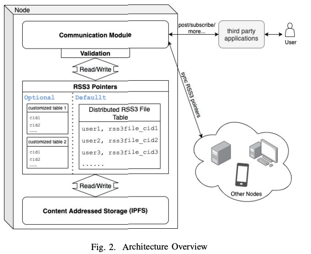
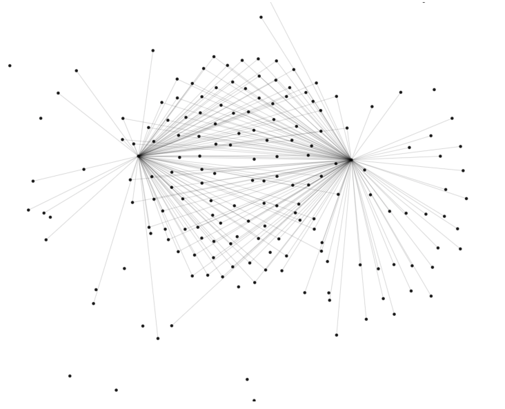
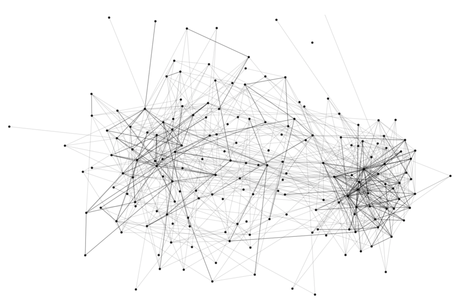
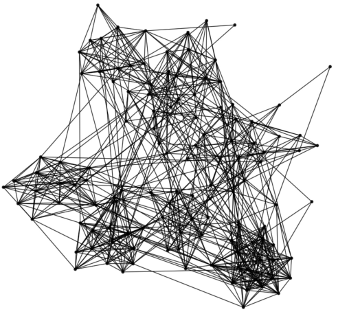

# RSS3 白皮书(RSS3:分散的内容和社交协议)
自然选择实验室
## 摘要
在原有 RSS 标准的启发下，提出了一种新的包含社交图和密码认证的内容分发协议。RSS3 文件将包含所有权、配置文件、链接和项目的属性，而内容则存储在应用程序和用户选择的某个位置。

为了抑制集中 RSS3 文件托管的可能性，基于 IPFS 引入了点对点托管。一个开放和去中心化的系统改变了数据所有权的结构，极大地造福用户和开发人员。

用户将完全控制自己的数据，而应用程序可以平等地访问用户生成的公共内容，以提供更好的整体用户体验。新协议将支持流行的社交和内容网络，同时其模块化允许构建强大的中间件，进一步增强其他类型的应用程序。
## 一 背景
最初的 RSS 是第一个看到大规模采用的网络辛迪加。这是对 Web 1.0 时代“互联网精神”的完美诠释。它是开放的，中立的，和分散。然而，随着集中式社交媒体平台的兴起，RSS 的使用在 Web 2.0 时代急剧下降。

在过去的二十年里，对内容和链接的控制逐渐被几个中心化的数据超级大国所实现，他们就滥用垄断地位，干坏事:

- 他们侵犯了我们的隐私

	例如，脸书在未经剑桥分析公司同意的情况下分享了数百万用户的个人数据用于政治广告[3]。
- 他们挪用利润

	例如，仅在2020年，社交媒体平台的广告收入就超过415亿美元。
- 他们协助并进行审查

	例如，中国主要社交媒体平台禁止主要加密交易所[6]的关键词。
- 滥用算法

	例如，社交媒体应用程序使用算法故意让用户上瘾[2]。
- 他们阻碍创新

	例如，没有开发人员能够开发出像数据垄断公司[7]那样具有竞争力的应用程序。

让超级大国“不作恶”的努力被证明是徒劳的。取而代之的似乎是一个“不能作恶”的系统。为了促进创建一个社交和内容网络自由、平等和蓬勃发展的世界，需要一个去中心化的生态系统。

作为Web 3.0运动的一部分，它从三个主要原则开始:

- 开源

	所有的源代码都应该提供给每个人审查
- 民主治理

	生态系统的规则应该在民主制度下制定
- 分布式控制

	控制的力量应该是

为了让新的去中心化生态系统达到足够的规模来推翻现有的中心化生态系统，我们还需要:

- 包容性

	应该支持不同类型的现有和未来可能的应用程序
- 中立性

	底层协议不应该偏向于特定的应用
- 激励

	应该给予用户、内容创造者和开发者大量的转换激励

在之前的点对点系统中，有很多关于公共内容分发的成功想法，例如 BitMessage[8] 或 ZeroNet[1] 引入的广播和订阅功能，专注于网站分发。然而，这些系统，包括最初的 RSS 标准，不包括允许用户之间进行社交互动的条款。

虽然其他一些社交网络系统，如 Peergos 或 Mastodon 确实支持信息发布，它们要么专注于私有信息分布，要么由于结构过于复杂而具有生成超级节点的倾向。

RSS3 协议源自 RSS 的精华，它允许用户控制自己的数据，允许开发人员轻松构建分散的内容和社交网络。

## 二 RSS3 标准
一切都从 RSS3 标准开始。与最初的 RSS 标准相比，RSS3 更轻、更简单、更强大、更高效和更可扩展。具体来说，RSS3 在以下几个方面有所不同:

- 文件格式由XML改为JSON，简单高效
- 加密密钥对用于验证和验证文件，确保数据完整性和所有权
- 文件通过链接和反向链接连接
- 与上游和上下文实现内容交互
- 使用不同的 mime 类型支持不同形式的内容
- `items_next` 和 `list_next` 用于支持历史内容

RSS3 文件被设计为包含五种基本类型的属性:

- Info 属性

	文件的基本信息，如id、version、date_updated 等
- Ownership 属性

	基于密码学验证所有权的变量
- Profile 属性

	身份信息，如头像、显示名称和兴趣。私有属性被加密
- Link 属性

	与其他 RSS3 文件的关系。不同的应用程序可以为不同的用途定义多种类型的关系
- Item 属性

	文件所有者发布的所有项。与原始 RSS 类似，这里只存储元数据和指针

与原始 RSS (只提供最新的条目)不同的是，引入了“ item chain 条目链”来创建条目文件的链表，完全由文件所有者控制.

应用程序可以在用户同意的情况下为更复杂的用例添加自定义变量。更多细节可以在这里找到 [https://github.com/NaturalSelectionLabs/RSS3](https://github.com/NaturalSelectionLabs/RSS3)。

## 三 HOSTING
表1 .集中系统中的数据访问

 |公共|私有
---|---|---
读|平台及用户|平台指定用户
写|平台|平台
存储|集中的服务器|集中的服务器
审查|平台|平台

### A 概述
RSS3 托管是一个提供 RSS3 协议的点对点系统。

一般来说，系统中有三方:

- 节点

	核心托管部分最强调的是让用户完全控制和访问他们的数据，并且应该是一个通用的共享分布式系统。因此，它与应用层解耦，使用户可以自由切换应用程序，也给了开发人员足够的灵活性。
	
	开发人员可以自由地在分布式节点上构建具有友好前端 UI 的第三方应用程序，这些应用程序可以是移动应用程序、桌面应用程序、浏览器扩展或其他任何东西。
- 用户

	通常，用户指的是角色背后的真人，他们在多个平台上运行节点客户机，包括服务器、笔记本电脑、移动电话，甚至嵌入式系统，这些平台都是点对点连接的。
- 第三方应用

	关于中间件和第三方应用程序的进一步讨论可以在第五节和第六节中找到。

每个托管节点包含三个组件，如图2所示:

- (1) 内容寻址存储(IPFS)，作为全局文件存储系统;
- (2) RSS3 指针，指向 RSS3 文件或帖子的 cid;
- (3) 通信模块，负责与其他节点同步 RSS3 指针并处理最终用户查询。

### B IPFS 内容寻址存储
从理论上讲，使用本地文件存储系统作为存储基础是可行的，但实际上，这可能会阻碍可伸缩性。

因此，我们提出了一个系统，其中所有节点都使用内容寻址存储系统 IPFS，这意味着所有 RSS3 文件都存储在 IPFS 上。

每个 RSS3 文件都应该可以被任何具有特定限制的角色读和写。因此，存储系统不应该有基于角色的访问控制，这使得 IPFS 成为理想的选择。

此外，与 Arweave 不同的是，IPFS 不需要节点与之交互的令牌，这使得它更灵活，最终用户和开发人员更容易上手。
### C. RSS3 指针
因为我们只能用 CID 在 IPFS 上搜索，所以需要一些索引表。默认情况下，每个节点都有一个从用户地址到用户 RSS3 文件 CID 的映射。

由所有节点承载的表组成全局分布式表。

此外，对于不同的模块，将有可选的索引表用于特定目的，这将在第1节中进一步讨论。

在未来，可以鼓励节点索引和存储索引值。
### D.通信模块
一方面，来自最终用户或第三方应用程序的查询将由通信模块处理。

通常，有两种类型的查询:

- 发布
- 订阅

一旦节点查询订阅某个 RSS3 文件，通信模块将首先从分布式 RSS3 文件表中查找 CID，然后从 IPFS 中查询整个 RSS3 文件，最后返回。

一旦节点查询要发布消息，在验证之后，它将更新分布式 RSS3 文件表。

一些高级查询(包括更新索引主题列表或订阅主题)共享类似的工作流

为了维护分布式表，不同节点之间必须进行通信。表上的每个更新都将被广播，接收更新的节点将通过数据完整性验证。如果更新比现有版本更新，节点将更新其本地版本以反映更新。

在物理上，每个节点都可以在远程服务器、个人计算机甚至嵌入式系统上运行。

- 对于公共 ip，通信很简单。
- 对于私有 ip，我们使用中继进行 NAT 穿越。具体来说,对于支持 IPv6 的网络，可以在 IPv6 上建立连接。

此外，为了使信息流最大化，还将支持 Wi-Fi 和蓝牙连接。

### E 可伸缩性
对于点对点系统，必须考虑可伸缩性。

- 对于存储层，IPFS 可以保证可伸缩性。

	由于 RSS3 文件只包含元数据，因此将有足够的磁盘空间来实现冗余。同时，IPFS 社区也在致力于更好的可伸缩性[5]。因此，存储层的可伸缩性不应构成挑战。
- 在RSS3指针方面

	由于任何 CID 都小于 64 字节，并且使用 20 字节的以太坊兼容地址作为用户公共地址，因此 RSS3 文件表的一个条目应该小于 84 字节。假设我们为这个表分配了 1gb 的空间，那么在这个空间中可以容纳 1200 万个条目。但我们预计 RSS3 托管在未来将有数十亿个条目，这可能需要 tb 甚至更多的空间。解决这个问题的一种方法是使用自聚合的.方法来创建子对等体组，从 BitMessage 中学习[8]。

## 四 所有权
表2 .rss3 生态系统中的数据访问

 |公共|私有
---|---|---
读|所有应用和用户|指定加密用户
写|拥有私钥的用户|拥有私钥的用户
存储|去中心化网络|去中心化网络
审查|没有，或具体情况具体分析|没有，或具体情况具体分析

随着 RSS3 的引入，数据所有权进行了重构。

用户通常有两种类型的数据

- 一种是对公众开放的
- 另一种是只有特定用户才能阅读的

在集中式系统下，数据访问一般具有结构(如表1):

RSS3 有一个完全不同的数据所有权系统。加密身份验证的使用确保了只有用户处于控制之中，同时打破了不同应用程序之间的壁垒，如表II所示。

### A.用户变更
这是第一次，用户不必被迫将其存储和写入访问权限委托给集中的一方，这通常会导致数据侵权、丢失或泄漏。此外，用户不受任何特定应用程序或平台的限制，因为它们现有的内容和关系可以很容易地携带到它们决定使用的任何新应用程序中。现在可以从任何应用程序访问公共内容，这允许更多用户访问，从而获得更高的影响力覆盖率。

用户再也不会因为毫无根据的规定而被封杀。即使某些应用程序(在非常罕见的情况下)在本地禁用了它们，它们也始终可以将数据转移到不同的应用程序。

审查制度也受到很大的压制，只有一些具体的情况，如父母控制。用户将体验社交媒体和通信应用程序，就像他们现在在以太坊上与 dApps 交互的方式一样。

他们只需要一个分布式身份管理器来管理所有的角色，使用自己的特定用途，然后用自己的私钥签名。
### B. 对开发者的改变
开发人员现在可以观察、研究和利用一个巨大的公共数据集。在 Web 2.0 时代，平台严格保护自己的数据集，使得外部开发人员不可能使用这些数据，即使这些数据是最终用户创建的公共内容。使用 RSS3，你可以开始一个 “Instagram”，而不用担心如何获得前 100 万张图片给用户看:公共 ugc 已经存在，就像以太坊网络上的交易历史。

由于除了用户本身之外，没有人能够控制用户数据，与已建立的应用程序相比，新应用程序及其背后的开发人员不再处于严重劣势。如果一款应用能够提供更好的用户体验，它将被允许更好地服务用户，而不是因为数据不足而失败。过去相互竞争数据垄断的应用程序将共同为整个生态系统构建更丰富的数据集。

## 五 程序
最初的 RSS 标准被设计成一个只关注内容的网络联合。通过引入 RSS3 文件之间的链接，可以形成网络。这些链接进一步使 RSS3 能够增强不同类型的内容和社交网络，包括但不限于:
### A.传统媒体网络
图3 所示。有两个发布节点的传统媒体网络。黑点是节点，灰线是单向链接

传统媒体网络是指仅指定特定节点创建和发布内容，而其他节点只能选择是否订阅的内容网络类型。这种类型的网络通常具有较高的平均内容质量，因为可以发布的内容被选中。它还会导致每个内容的覆盖率更高，覆盖率由受影响的节点数量除以节点总数来定义。这些网络中的内容创作者通常以获得更多用户印象为主要目的，而用户通常都在寻找高质量的内容。但由于网络内容有限，活动节点有限，预计这些网络的链路密度较低，如图3所示。这些网络将由向特定用户添加特定标签的应用程序创建，这些用户的内容随后将显示在订阅者的时间表上。这些应用可以是团体报纸、传统有线电视、
以及其他面向内容的网络。
### B.社交媒体网络
图4所示。典型的社交媒体网络。黑点为节点，灰线为单向链接，黑线为双向链接

社交媒体网络是指所有节点都有相同的发帖和关注权的网络。在这些网络中，内容创造者只是用户。由于每个人都有同样的发帖权利，用户通常具有影响和社交的混合目的。过去十年里，大多数成功的社交和内容网络都属于这一类，包括Twitter、Instagram和抖音。虽然它不像传统媒体网络那样具有高的平均内容覆盖率和高的平均内容质量，但更多的节点被激活来创建，从而导致一个更繁荣的生态系统。如图4所示，无论是单向链接还是双向链接，这些都有望具有更高的链接密度。应用程序可以帮助用户创建不同形式的内容，然后根据特定的需求为消费内容提供不同的体验.
### C.通讯网络
图5所示。典型的通信网络。黑点代表结点和黑色线是双向的链接

通信网络是指节点之间以社交为主要目的而自由连接的网络。这些类型的网络只存在双向链接，内容主要是为一小群人创建的，如果不是一个人的话。WhatsApp、微信和 Facebook Messenger 就是这一类的例子。通过利用 RSS3 文件之间的链接，应用程序可以轻松地与其他开源和点对点协议(如WebRTC) 一起构建通信网络。图5显示了一个通信网络的样子。
## 六 模块化
如上所述，RSS3 标准和 RSS3 托管将足以构建基本应用程序。然而，作为一个开放的生态系统，RSS3 被设计为具有不同的可扩展性模块。就像基于RSS3 开发应用程序一样，开发人员可以在没有任何权限的情况下为系统创建不同的模块。为了为不同用途的应用程序提供动力，我们在此提出一些可能的中间件，它们可以构建在 RSS3 之上，这将释放出巨大的可能性。
### A.付费解锁
付费解锁模块可以添加到 RSS3 的内容分发系统中，这为内容创作者带来了一系列不同的盈利可能性。我们预计付费解锁模块将基于去中心化托管的加密构建。付费解锁可以在每个内容的基础上使用，用户可以直接向创建者支付解密密钥，也可以与订阅模式一起使用，用户可以在特定时期内支付密钥来解锁一系列特殊内容。应用程序还可以利用 RSS3 文件之间的链接和 nft 相关资产属性，以获得更好的付费订阅关系。
### B.全局索引
当然，在 RSS3 系统本身中，没有简单的方法来获得所有已发布项目的全局索引。最好在将来引入分散的全球索引服务。通过这种方式，应用程序将能够为用户提供“探索”功能，以便更好地发现新内容和用户关注。此外，这还将使应用程序能够从全局数据集中进行筛选。这些过滤器可以是标签、媒体类型、创建者类型或不同属性的混合。有了这些过滤器，eBay 和 Zillow 等市场应用程序，Reddit 和 Quora 等论坛应用程序，以及 Pinterest 和Dribbble 等内容应用程序都可以出现。
### C.内容标注
为了让系统实现更高的内容分发效率，节点对内容进行透明标签的方式是非常有帮助的。与全局索引一起，我们可以期待为最终用户提供更好的搜索和排名体验。我们希望内容标记也可以由分散的 RSS3 节点进行，其中节点可以选择是否要为任务投入可能额外的计算资源。因此，使用节点所放标签的应用程序应该为服务付费。要实现相对普遍的采用，可能需要一个标签内容的标准。
### D.兴趣图
最终用户的兴趣图对于更好的用户体验也很重要。与集中式服务不同的是，用户活动都是在一个集中的服务器中跟踪和分析的，RSS3 生态系统的兴趣图应该是一个具有统一标准的离线模块。兴趣图应该只由开源应用程序更新，使用私钥加密字符串的结果。因此，用户可以根据自己的兴趣选择任何应用程序，以获得不同的用户体验。此外，应用程序应该让用户完全控制他们是否想要推荐提升体验，并允许他们随时选择退出。

## 七 威胁模型
### A.数据篡改
我们的节点有两个可能的篡改点:

- IPFS存储系统

	对于具有足够副本的 IPFS 存储系统，完全删除某些文件基本上是不可能的
- 指针表
	
	只要正确维护指针表，用户数据就不会被篡改

由于在我们的系统中，公钥的作用是用户的地址，每个 RSS3 文件(除所有权属性外有四个基本部分)都附加了签名，因此节点可以很容易地验证数据和海报是否被欺骗，并决定是否同意指针更新。

如果某个节点行为不当，则只修改其本地存储。连接到它的可信节点将拒绝更新，这样全局分布式指针表就不会被破坏。通过这种方式，节点可以信任它们接收到的内容，而不需要信任它们接收到内容的对等体。由于最终用户可以自己轻松地启动节点，因此他们没有动机从另一个可疑节点查询。此外，在未来我们可以有惩罚机制。

### B DDoS
传统的 DDoS 攻击目标是一个或几个托管 web 服务的集中式服务器。在 RSS3 系统中，内容是大规模离散的，会有许多节点承载相同的内容，因此，泛洪所有节点更加困难。为了减轻针对某些特定内容的专用节点上的本地攻击，每个节点可以自由地放弃任何传入连接或设置带宽限制规则
### C 审查
RSS3 网络上可能存在两种形式的审查:

- 以用户为目标的审查

	除非每个节点都同意封锁某个用户，否则不可能封锁某个用户。只要存在索引用户 RSS3 文件 CID 的节点，就不能阻止该用户。
- 以内容为目标的审查。

	内容审查可能针对每个平台或应用程序。但是，只要第三方应用程序协调努力，在 IPFS 或其他地方复制这些内容，原始帖子就不会丢失。

	对于特定帖子的评论，发帖者不可能在 RSS3 系统中审查其帖子的评论。我们提出了一个系统，在这个系统中，评论被记录在评论者的 RSS3 文件中，只有评论者可以更新他们自己的内容。

	此外，单个 RSS3 文件不能被任意阻止。随着越来越多的节点加入 RSS3 网络，随着网络的连接性和可扩展性越来越强，预计阻止单个 RSS3 文件将变得越来越困难，因为没有人有能力完全阻止这样一个文件。
	
	审查仍然可以发生在集中的“代理网关”级别，但是如果启动一个节点既简单又便宜，最终用户就没有动力从这样的网关进行查询。

## 八 结论
介绍了一种构建“不能作恶”内容和社交网络的协议。我们首先提出一个从原始 RSS 标准衍生而来的新设计标准。通过引入基于加密的身份验证和文件间的链接，整个系统实现了数据所有权的分散，可以支持各种类型的网络。不同于最初的 RSS 生态系统(不同的 RSS 文件通常存储在子数据中心)，RSS3 将构建一个点对点托管服务，因此形成任何数据超级大国的可能性将非常低。RSS3 的灵活性和适应性使其能够支持各种类型的内容和社交网络，无论是现有的还是尚未创建的。

## 参考文献
- 去中心化的p2p网络平台。
- 希拉里·安德森。社交媒体应用“故意”让用户上瘾，2018年7月。
- 罗莎莉·陈。剑桥分析的举报人解释了该公司如何使用脸书数据影响2019年10月的选举。
- 梅根·格雷厄姆。尽管2021年4月受到大流行的影响，但2020年数字广告支出增长了12%。
- Rudiger Klaehn。[2021年主题提案]可扩展的分散内容¨路由，2020年12月。
- 凯莉·乐。微博下架币安火币对中国的加密货币意味着什么?2021年3月。
- 罗斯·乌布利希。去中心化社交媒体，2021年3月。
- 乔纳森·沃伦。Bitmessage:点对点消息认证和传递系统，2012年11月。
