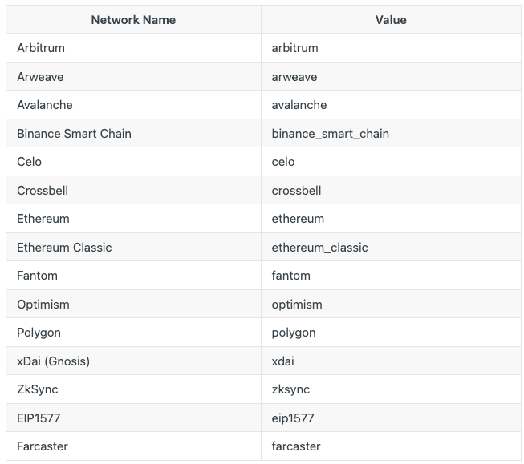
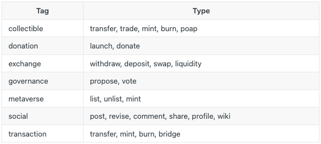
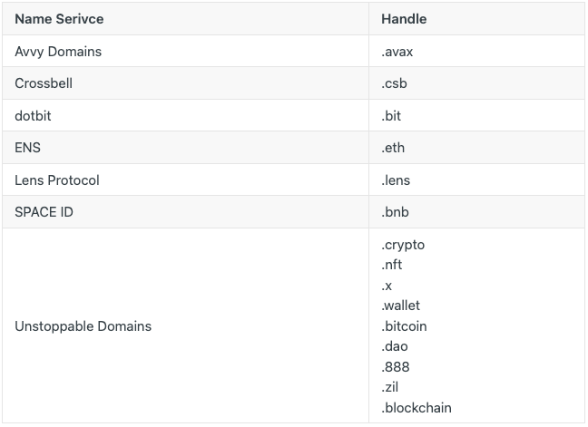

# Rss3 Doc
## 为什么选择 RSS3
创建、传播和分发信息的权利不应掌握在中央集权政府手中。这是网络生活的基本权利。

在过去的二十年里，几个数据超级大国逐渐控制了内容和链接，以营造一种有毒的中心化氛围，为了利润而牺牲隐私和自由。这种氛围进一步阻碍了创新：无论您的应用程序设计和工程设计得多么出色，都无法与数据垄断企业竞争。

世界一直渴望一种新的信息联合方式。RSS曾经是时代的先锋，现在是我们接过接力棒继续前行的时候了。

RSS3 源自 RSS 的精华，是一种以提要和搜索为核心要素的 Web3 信息传播协议。它定义了信息呈现和通信的格式，通过这种设计优雅、用户友好的内容格式，客户端可以轻松访问统一格式的各种内容源，而无需大量的兼容性逻辑。
## 应用接口
### 介绍
RSS3 API 提供了一组简单易用的 API 来访问任何用户的跨链 Web3 Feed。目前，稳定版本是 v1。
#### API端点
当前稳定端点：

- [https ://api.rss3.io/v1](https://api.rss3.io/v1)

可以在 [API Playground](https://docs.rss3.io/reference) 中添加测试它们

#### 速率限制
为确保每个人的可用性，我们将请求限制为每分钟 600 个。当我们认为合适时，限制将逐渐增加。

可以在 [https://rss3.io/network](https://rss3.io/network) 查看一些 RSS3 网络统计数据。
#### 归因
虽然所有 RSS3 API 的使用都是完全免费的，但我们恳请您提供我们的徽标以及返回我们主页或我们网站上特定内容 URL 的链接。有关更多信息，请参阅我们的[品牌指南](https://rss3.notion.site/RSS3-Brand-Kit-251e768345684ba9acd038d79c6899b8)。
### 统一的元数据模式
RSS3 API 使开发人员能够快速插入返回的数据，而无需担心底层结构。我们负责所有繁重的工作，为所有 `.type`

您将在下面看到类型列表和相应的 UMS。

```
此页面仍在修改中，下面列出的 UMS 可能会在未来发生变化。
我们建议严格检查并在您的代码中实施。TagType
```
#### 收藏品 Collectible
`collectible (transfer, mint, burn)` 共享相同的 UMS:

- collectible

		{
		  "id": "3111",
		  "value": "1",
		  "contract_address": "0xa6f969045641cf486a747a2688f3a5a6d43cd0d8",
		  "standard": "ERC-721",
		  "name": "RSS3 Whitepaper v1.0",
		  "symbol": "RWP",
		  "image": "ipfs://bafybeialcb7udgz56dtpzn7dcchujd5jt6jcu7ugg4y32e2jsvg3z477fq/rss3-whitepaper-no-1.png",
		  "attributes": [
		    {
		      "value": "Natural Selection Labs",
		      "trait_type": "Author(s)"
		    },
		    ...
		  ],
		  "description": "RSS3 Whitepaper v1.0 - Commemorative & Limited Edition",
		  "animation_url": "ipfs://bafybeif2wobpdjlkv7k33k2at4agirvmrs5zqa7hm4wvz72teui6bttg7y/rss3-whitepaper-no-1.glb",
		  "external_link": "https://rss3.io/RSS3-Whitepaper.pdf"
		}
- trade

		// `trade` 与 `collectible` 共享基本结构，但有一个额外的 `cost` 字段。
		{
		  "id": "3111",
		  "contract_address": "0xa6f969045641cf486a747a2688f3a5a6d43cd0d8",
		  "standard": "ERC-721",
		  "name": "RSS3 Whitepaper v1.0",
		  "value": "1",
		  "symbol": "RWP",
		  "image": "ipfs://bafybeialcb7udgz56dtpzn7dcchujd5jt6jcu7ugg4y32e2jsvg3z477fq/rss3-whitepaper-no-1.png",
		  "attributes": [
		    {
		      "value": "Natural Selection Labs",
		      "trait_type": "Author(s)"
		    },
		    ...
		  ],
		  "description": "RSS3 Whitepaper v1.0 - Commemorative & Limited Edition",
		  "animation_url": "ipfs://bafybeif2wobpdjlkv7k33k2at4agirvmrs5zqa7hm4wvz72teui6bttg7y/rss3-whitepaper-no-1.glb",
		  "external_link": "https://rss3.io/RSS3-Whitepaper.pdf",
		  // 附加字段
		  "cost": {
		    "name": "Ethereum",
		    "image": "https://assets.coingecko.com/coins/images/279/large/ethereum.png",
		    "value": "230325000000000000",
		    "symbol": "ETH",
		    "decimals": 18,
		    "value_display": "0.230325000000000000",
		    "standard": "Native"
		  },
		}
- poap

		// 由于垃圾邮件的问题，api 默认不返回 poap。我们提供了两种方法来包含它们:
		// 1. 将 `include_poap` 设置为 true.
		// 2.  `poap` 包含在 `type` 中.
		{
		    "id": "5364876",
		    "name": "RSS3 Cancer Meetup - 2022",
		    "image": "https://assets.poap.xyz/rss3-cancer-meetup-2022-2022-logo-1657702983639.png",
		    "symbol": "The Proof of Attendance Protocol",
		    "standard": "ERC-721",
		    "attributes": [
		        {
		            "value": "07-Jul-2022",
		            "trait_type": "endDate"
		        },
		        {
		            "value": "true",
		            "trait_type": "virtualEvent"
		        },
		        {
		            "value": "",
		            "trait_type": "city"
		        },
		        {
		            "value": "",
		            "trait_type": "country"
		        },
		        {
		            "value": "",
		            "trait_type": "eventURL"
		        },
		        {
		            "value": "07-Jul-2022",
		            "trait_type": "startDate"
		        }
		    ],
		    "description": "The RSS3 2022 Q3 Internal Meeting",
		    "contract_address": "0x22c1f6050e56d2876009903609a2cc3fef83b415"
		}
- approval

		// ' approval '批准/撤销钱包中资产的权限。
		{
		  "name": "Optimistic Explorer",
		  "action": "approve", // 这里 action 表示操作.另一个可能的值是 revoke.
		  "symbol": "SUPNERDS",
		  "standard": "ERC-721",
		  "collection": "Optimistic Explorer",
		  "contract_address": "0x81b30ff521d1feb67ede32db726d95714eb00637"
		}
#### donation(捐赠)

	`donation` 对服务和项目的支持鼓励了开放网络的发展
- launch

		// `launch` 指示启动新授权的操作。
		{
		    "logo": "https://c.gitcoin.co/grants/7f2bdd3cbd59dcaaa1c4b54c5b73a952/ethers-gitcoin.png",
		    "title": "ethers.js - Complete, Simple and Tiny",
		    "platform": "gitcoin",
		    "description": "The ethers.js library is a complete and compact library for interacting with the Ethereum Blockchains and their ecosystem..."
		}
- donate

		// `donate` 指示将令牌转移到已建立的授予。
		{
		    "logo": "https://c.gitcoin.co/grants/7f2bdd3cbd59dcaaa1c4b54c5b73a952/ethers-gitcoin.png",
		    "title": "ethers.js - Complete, Simple and Tiny",
		    "platform": "gitcoin",
		    "description": "The ethers.js library is a complete and compact library for interacting with the Ethereum Blockchains and their ecosystem...",
		    // 这里我们有详细的捐赠值
		    "token": {
		        "image": "https://s2.coinmarketcap.com/static/img/coins/64x64/825.png",
		        "name": "Tether USD",
		        "symbol": "USDT",
		        "decimals": 6,
		        "value": "10000000",
		        "value_display": "10",
		        "contract_address": "0xc2132D05D31c914a87C6611C10748AEb04B58e8F",
		        "standard": "ERC-20"
		    }
		}

#### Exchange(交换)
exchange 主要包括通过 DeFi 平台和交易所进行的交易(中心化和去中心化)。

- deposit/withdraw

		// `withdraw` 表示从 CEX 或 DEX 传输令牌。
		// `deposit` 表示将令牌转移到 CEX 或 DEX。
		// 它们都遵循与' transaction '相同的 UMS
		{
		    "image": "https://s2.coinmarketcap.com/static/img/coins/64x64/3890.png",
		    "name": "polygon",
		    "symbol": "MATIC",
		    "decimals": 18,
		    "value": "1000000000000000000",
		    "value_display": "10",
		    "contract_address": "0x0000000000000000000000000000000000001010",
		    "standard": "ERC-20"
		}
- swap

		// ' swap ' 表示 DEX 上的令牌交换。
		{
		    "protocol": "Uniswap V2",
		    "to": {
		        "image": "https://s2.coinmarketcap.com/static/img/coins/64x64/825.png",
		        "name": "Tether USD",
		        "symbol": "USDT",
		        "decimals": 6,
		        "value": "28652612",
		        "value_display": "28.652612",
		        "contract_address": "0xc2132D05D31c914a87C6611C10748AEb04B58e8F",
		        "standard": "ERC-20"
		    },
		    "from": {
		        "image": "https://s2.coinmarketcap.com/static/img/coins/64x64/3408.png",
		        "name": "USD Coin",
		        "symbol": "USDC",
		        "decimals": 6,
		        "value": "28622667",
		        "value_display": "28.622667",
		        "contract_address": "0x2791Bca1f2de4661ED88A30C99A7a9449Aa84174",
		        "standard": "ERC-20"
		    }
		}
- liquidity

		// `liquidity` 指示符可以指示许多操作，例如:
		// 1. 从池中添加/移除 `add/remove` 令牌
		// 2. 向贷款人提供/借贷 `supply/borrow` 令牌
		// 3. 向贷款人偿还 `repay`令牌
		// 4. `collect` 收益率
		
		{
		    "protocol": "Uniswap V2",
		    "action": "add", // or `remove`, `supply`, `borrow`, `repay`
		    "tokens": [
		        {
		            "image": "https://s2.coinmarketcap.com/static/img/coins/64x64/825.png",
		            "name": "Tether USD",
		            "symbol": "USDT",
		            "decimals": 6,
		            "value": "28652612",
		            "value_display": "28.652612",
		            "contract_address": "0xc2132D05D31c914a87C6611C10748AEb04B58e8F",
		            "standard": "ERC-20"
		        },
		        {
		            "image": "https://s2.coinmarketcap.com/static/img/coins/64x64/3408.png",
		            "name": "USD Coin",
		            "symbol": "USDC",
		            "decimals": 6,
		            "value": "28622667",
		            "value_display": "28.622667",
		            "contract_address": "0x2791Bca1f2de4661ED88A30C99A7a9449Aa84174",
		            "standard": "ERC-20"
		        }
		    ]
		}
- bridge

		// ' bridge '表示将资产从区块链A桥接到区块链B。
		// action “deposit”是指将代币存入区块链A的网桥
		// action `withdraw`指从区块链B的网桥中提取令牌
		{
		    "token": {
		        "name": "Ethereum",
		        "image": "https://assets.coingecko.com/coins/images/279/large/ethereum.png",
		        "value": "30000000000000000",
		        "symbol": "ETH",
		        "decimals": 18,
		        "standard": "Native",
		        "value_display": "0.03"
		    },
		    "action": "deposit", // 它也可以是“withdraw”
		    "target_network": {
		        "name": "Polygon",
		        "symbol": "MATIC",
		        "chain_id": 137
		    }
		}

#### Governance
Governance 是指为治理开放Web而执行的操作

- propose

		//`propose` 表示创建新提案的动作。
		{
		    "type_on_platform": ["proposal"],
		    "id": "123",
		    "title": "some agenda",
		    "body": " description of the proposal",
		    "options": ["1. yea", "2. neh", "3. abstain"],
		    "startAt": "2022-01-01T15:00:00Z",
		    "endAt": "2022-01-02T15:00:00Z",
		    "organization": {
		      "type_on_platform": ["charity"],
		      "id": "8818",
		      "name": "some charity",
		      "about": " description of the organization"
		    }
		}
- vote

		//“vote ”表示对既定提案的投票行为。
		{
		    "type_on_platform": ["vote"],
		    "choice": "1",
		    "proposal": {
		        "type_on_platform": ["proposal"],
		        "id": "123",
		        "title": "some agenda",
		        "body": " description of the proposal",
		        "options": ["1. yea", "2. neh", "3. abstain"],
		        "startAt": "2022-01-01T15:00:00Z",
		        "endAt": "2022-01-02T15:00:00Z"，
		        "organization": {
		          "type_on_platform": ["charity"],
		          "id": "8818",
		          "name": "some charity",
		          "about": " description of the organization"
		        }
		    }
		}										

#### 元宇宙
metaverse 代表开放网络的 GameFi 部门。

- claim

		// `claim` 指示声明令牌的操作。
		{
		  "tag": "metaverse",
		  "type": "claim",
		  "index": 351,
		  "address_from": "0x99655ca16c742b46a4a05afaf0f7798c336fd279",
		  "address_to": "0x94899d21697c391374fe87ac680231ba50b21643",
		  "metadata": {
		    "name": "Aave Matic Market WETH",
		    "image": "https://assets.coingecko.com/coins/images/17266/large/amWETH_2x.png",
		    "value": "3174603174603170",
		    "symbol": "amWETH",
		    "decimals": 18,
		    "standard": "ERC-20",
		    "value_display": "0.00317460317460317",
		    "contract_address": "0x28424507fefb6f7f8e9d3860f56504e4e5f5f390"
		  },
		  "platform": "Aavegotchi",
		  "related_urls": [
		    "https://polygonscan.com/tx/0x9128eeb88078103367cc73cb90f8bbb4aff6e5a33792d6603d9678c3d15113d9"
		  ]
		}
- list/unlist

		// “list”和“unlist”表示(un)列出游戏内物品进行交易的操作。
		// 这里的项目是符合ERC-20、ERC-721或ERC-1155的令牌。
		{
		  "id": "3073458",
		  "name": "IN LE#173361395",
		  "image": "https://static.planetix.com/46Sl0KZHaA856srXdxD9AnNC5SbzGvtCeqFZusuS.png",
		  "value": "1",
		  "symbol": "PIX",
		  "standard": "ERC-721",
		  "attributes": [
		    {
		      "value": "[77.28876779858112,28.66998572337609]",
		      "trait_type": "Coordinates"
		    },
		    // ...
		  ],
		  "collection": "PlanetIX",
		  "value_display": "1",
		  "contract_address": "0xb2435253c71fca27be41206eb2793e44e1df6b6d"
		}
- mint

		// `mint` 是自解释的。
		// 这里的令牌符合 ERC-20、ERC-721 或 ERC-1155。
		{
		  "id": "31",
		  "name": "[CARVnival] ChapterX x CARV AMA",
		  "image": "https://ipfs.rss3.page/ipfs/bafkreihrsqtcqvr3qftfsvxga2swrai5xbzajegr2vclnlj2m4pxgykop4",
		  "value": "1",
		  "symbol": "CARV-EVNT",
		  "standard": "ERC-1155",
		  "attributes": [
		    {
		      "value": "Events",
		      "trait_type": "Carv Type"
		    },
		    {
		      "value": "ChapterX",
		      "trait_type": "Carv Collection"
		    }
		  ],
		  "collection": "Carv Events",
		  "description": "Holders joined ChapterX x CARV AMA during CARVnival! All your gaming moments, in one place, only on Carv!",
		  "value_display": "1",
		  "contract_address": "0xdda56260fcb1b1c6ba1d84c5f99f5507d556a04b"
		}
- trade

		// `trade` 也是不言自明的。
		// 通常 ERC-20 代币可以兑换游戏中的道具 (ERC-721或ERC-1155代币)。
		{
		  "tag": "metaverse",
		  "type": "trade",
		  "index": 49,
		  "address_from": "0x03e69a147ef6dc063360e976ad15ff5468501c12",
		  "address_to": "0x8cbf96319b3c56d50a7c82efb6d3c46bd6f889ba",
		  "metadata": {
		    "name": "Aavegotchi GHST Token (PoS)",
		    "image": "https://assets.coingecko.com/coins/images/12467/large/ghst_200.png",
		    "value": "640000000000000000",
		    "symbol": "GHST",
		    "decimals": 18,
		    "standard": "ERC-20",
		    "value_display": "0.64",
		    "contract_address": "0x385eeac5cb85a38a9a07a70c73e0a3271cfb54a7"
		  },
		  "platform": "Aavegotchi",
		  "related_urls": [
		    "https://polygonscan.com/tx/0x104e3cd25830a06b802868d267a12f33258cb2ca5b931d76d4e613f51a08aaa3"
		  ]
		},
		{
		  "tag": "metaverse",
		  "type": "trade",
		  "index": 51,
		  "address_from": "0x8cbf96319b3c56d50a7c82efb6d3c46bd6f889ba",
		  "address_to": "0x03e69a147ef6dc063360e976ad15ff5468501c12",
		  "metadata": {
		    "id": "4744",
		    "name": "Paarty King",
		    "image": "https://arweave.net/fWYXkoPohNpL5a1upY_6G-BTXLO8s5HYq0nZ_luPBEQ",
		    "value": "1",
		    "symbol": "FG",
		    "standard": "ERC-721",
		    "attributes": [
		      {
		        "value": "0x8cbf96319b3c56d50a7c82efb6d3c46bd6f889ba",
		        "trait_type": "Publisher"
		      }
		      //
		    ],
		    "collection": "FAKE Gotchis",
		    "description": "Rumored to have been summoned by degens, Paarty King rose to power through frenly vibes and good times. ",
		    "value_display": "1",
		    "contract_address": "0xa4e3513c98b30d4d7cc578d2c328bd550725d1d0"
		  },
		  "platform": "Aavegotchi",
		  "related_urls": [
		    "https://polygonscan.com/tx/0x104e3cd25830a06b802868d267a12f33258cb2ca5b931d76d4e613f51a08aaa3",
		    "https://opensea.io/assets/matic/0xa4e3513c98b30d4d7cc578d2c328bd550725d1d0/4744"
		  ]
		}

#### 社交
社交网络是开放网络不可或缺的一部分

- post/revise

		// `post` 表示发布新文章的动作。
		// `revise` 更新已存在帖子的操作。
		{
		    "title": "Guess what's coming",
		    "body": "Guess what's coming",
		    "author": ["https://lenster.xyz/u/henryqw.lens"],
		    "media": [
		        {
		            "address": "https://ipfs.infura.io/ipfs/QmXGp2tq7yTXMoeKbDqAsFNW9Qw1GGzWbEFiXmhKxVikGj",
		            "mime_type": "image/png"
		        }
		    ],
		    "type_on_platform": ["post"]
		}
- comment

		// `comment` 指示对现有帖子进行评论的操作。
		{
		    "title": "RSS3 is building a Lens integration!",
		    "body": "RSS3 is building a Lens integration!",
		    "author": ["https://lenster.xyz/u/henryqw.lens"],
		    "media": [
		        {
		            "address": "https://ipfs.infura.io/ipfs/QmXGp2tq7yTXMoeKbDqAsFNW9Qw1GGzWbEFiXmhKxVikGj",
		            "mime_type": "image/png"
		        }
		    ],
		    "type_on_platform": ["comment"],
		    "target": {
		        "title": "Guess what's coming",
		        "body": "Guess what's coming",
		        "author": ["https://lenster.xyz/u/henryqw.lens"],
		        "created_at": "2022-06-22T16:22:33Z",
		        "target_url": "https://lenster.xyz/posts/0x83a6-0x01",
		        "media": [
		            {
		                "address": "https://ipfs.infura.io/ipfs/QmXGp2tq7yTXMoeKbDqAsFNW9Qw1GGzWbEFiXmhKxVikGj",
		                "mime_type": "image/png"
		            }
		        ],
		        "type_on_platform": ["post"]
		    }
		}
- share

		// `share` 表示分享现有帖子或评论的动作，可以将其视为转发。
		{
		    "type_on_platform": ["mirror"],
		    "target": {
		        "body": "Yo! from RSS3! https://rss3.io",
		        "author": ["https://lenster.xyz/u/henryqw.lens"],
		        // ' created_at '和' target_url ' 的原始帖子
		        "created_at": "2022-06-22T16:22:33Z",
		        "target_url": "https://lenster.xyz/posts/0x83a6-0x01"
		    }
		}
		
		// “share”也可能带有“comment”，其结构与上面的“comment”相同。
		{
		    "title": "RSS3 is building a Lens integration!",
		    "body": "RSS3 is building a Lens integration!",
		    "media": [
		        {
		            "address": "https://ipfs.infura.io/ipfs/QmXGp2tq7yTXMoeKbDqAsFNW9Qw1GGzWbEFiXmhKxVikGj",
		            "mime_type": "image/png"
		        }
		    ],
		    "type_on_platform": ["Mirror"],
		    "target": {
		        "title": "Guess what's coming",
		        "body": "Guess what's coming",
		        "media": [
		            {
		                "address": "https://ipfs.infura.io/ipfs/QmXGp2tq7yTXMoeKbDqAsFNW9Qw1GGzWbEFiXmhKxVikGj",
		                "mime_type": "image/png"
		            }
		        ],
		        "type_on_platform": ["Post"]
		    }
		}
- profile

		// ' profile '表示创建或更新新凭证的操作。
		{
		    "address": "0x...",
		    "network": "ethereum",
		    "platform": "ENS",
		    "source": "ENS",
		    "name": "henryqw.eth",
		    "handle": "henryqw.eth",
		    "bio": "The awesome Henry.",
		    "expire_at": "2032-01-02T21:28:35Z"
		}
- follow/unfollow

		// “follow” 表示跟踪现有配置文件的操作。' unfollow '使用相同的结构。
		{
		    "type_on_platform": ["Follow"],
		    "target": {
		        "bio": "",
		        "name": "",
		        "type": "create",
		        "handle": "henryqw.lens",
		        "source": "Lens",
		        "address": "0x...",
		        "network": "polygon",
		        "platform": "Lens"
		    }
		}
- reward

		// “奖励”是一种通过加密交易支持作者的行为。
		{
		  "reward": {
		    "name": "(PoS) Tether USD",
		    "value": "1000000",
		    "symbol": "USDT",
		    "decimals": 6,
		    "standard": "ERC-20",
		    "value_display": "1",
		    "contract_address": "0xc2132d05d31c914a87c6611c10748aeb04b58e8f"
		  },
		  "type_on_platform": ["curation"],
		  "target": {
		    "body": "body",
		    "title": "title",
		    "author": ["someone"],
		    "summary": "summary",
		    "type_on_platform": ["post"],
		  }
		}
- wiki

		// ' wiki '是一个每个人都可以编辑的条目
		{
		  "body": "Bitcoin (BTC) is the first ...",
		  "tags": ["Bitcoin"],
		  "media": [
		    {
		      "address": "https://ipfs.rss3.page/ipfs/QmSS8AXhUXUdvfxC77bhQ7UqX9HscgUZc8SPagc3QDUkNt",
		      "mime_type": "image/png"
		    }
		  ],
		  "title": "Bitcoin",
		  "action": "revise", // `create` is another possible value
		  "author": ["0x53B55848a4ccCd79771eBA19112CB1E17b2226fc"],
		  "summary": "Bitcoin (BTC) is the first decentralized cryptocurrency and payment system that uses Blockchain technology which allows users to send and receive digital money ...",
		  "categories": ["Cryptocurrencies"],
		  "created_at": "2022-08-12T10:51:36Z",
		  "target_url": "https://iq.wiki/wiki/bitcoin",
		  "origin_note_id": "bitcoin",
		  "type_on_platform": ["update"]
		}

#### 交易
transaction 如果以上所有标签都不匹配，将使用。

- transfer/mint/burn

		{
		  "image": "https://s2.coinmarketcap.com/static/img/coins/64x64/3890.png",
		  "name": "polygon",
		  "symbol": "MATIC",
		  "decimals": 18,
		  "value": "1234000000000000000",
		  "value_display": "1.234", // value_display is the value formatted with the correct decimal places
		  "contract_address": "0x0000000000000000000000000000000000001010",
		  "standard": "ERC-20"
		}
- approval

		// `approval` 批准/撤销钱包中资产的权限。
		{
		  "name": "USD Coin",
		  "value": "0",
		  "action": "revoke", // 另一个可能的值是' approve '。
		  "symbol": "USDC",
		  "decimals": 6,
		  "standard": "ERC-20",
		  "value_display": "0",
		  "contract_address": "0x7f5c764cbc14f9669b88837ca1490cca17c31607"
		}

### 数据和过滤
RSS3 API 支持使用多种过滤条件过滤数据，例如：

1. 网络
2. 标签
3. 类型
4. 平台

		当然，我们无法在此处提供完整的平台名称列表。
如需更多过滤器，请访问我们的 [API Playground](https://docs.rss3.io/reference)。

- 网络列表

	
- 标签和类型列表

	
	
### 名称服务解析
除了 EVM 地址，RSS3 API 还支持以下名称服务，您可以在 API 请求中使用其中任何一个来代表用户。


#### 无效分辨率
这通常发生在句柄设置不正确时，例如，没有解析器的 ENS（正向解析，0x -> ENS）或没有反向记录（反向解析，ENS -> 0x）。

		
																										

	