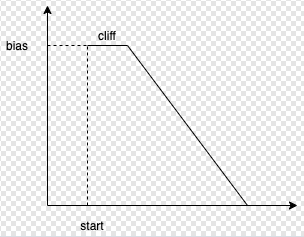
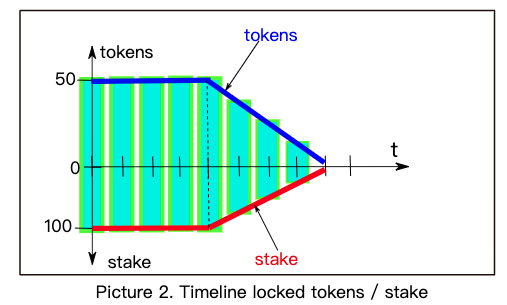

# Rarible 协议的智能合约
## 协议由组成

- Exchange v2：负责销售、拍卖等。
- token：用于存储有关 NFT 的信息
- Rarible 支持的链上版税规范

## 编译、测试、部署
	yarn
	yarn bootstrap
## test: cd 项目目录,然后使用 truffle 编译
	truffle test --compile-all
## 协议概述
Rarible 协议是用于交换代币的智能合约、代币本身、用于订单创建、发现的 API、智能合约中使用的标准的组合。

协议主要针对 NFT，但不仅限于 NFT。EVM 区块链上的任何资产都可以在 Rarible 上进行交易。

智能合约以可升级的方式构建，订单具有版本信息，因此将来可以根据需要添加新字段。
## 交易流程概览
### 用户在 Rarible 上卖出交易流程
- 批准将他们的资产转移到交易所合约（例如：ERC-721 调用 `approveForAll`  ，ERC-20 approve） - 交易所需的金额是价格 + 费用。在交换合同自述中了解更多信息
- 通过首选钱包签署交易订单（订单就像声明“我想以 10 ETH 的价格出售我珍贵的加密猫”）
- 使用 Rarible 协议 API 将此订单和签名保存到数据库中（将来也将支持将订单存储在链上）

如果用户要取消订单，必须调用交易所智能合约的取消功能

### 用户在 Rarible 上购买交易流程
- 通过开放订单找到他们喜欢的资产
- 以相同的方式 approve 转移（如果不使用以太币购买）
- 在另一个方向形成订单（声明如“我想以 10 ETH 购买珍贵的加密猫”）
- 使用两个订单和一个订单签名调用 `Exchange.matchOrders`

## 合约代码库分析
### asset //资产，可能在订单合约中使用
`LibAsset` 包含 `Asset` 和 `AssetType` 结构

- `Asset` 

	代表以太坊区块链上的任何资产。`Asset` 具有类型和价值（资产的数量）。
- `AssetType` 

	一种特定资产。例如 `AssetType` 是特定的 ERC-721 代币（key 是 token + tokenId）或特定的 ERC-20 代币（例如 DAI）。它由 `asset class` 通用数据组成（不同资产类别的数据格式不同）。例如，对于 ERC20 资产类别的数据保存代币的合约地址，而对于 ERC-721 的数据保存的是合约地址和 tokenId。

- Asset 字段：
	- `AssetType` //资产类型
	- `uint` //资产数量
- `AssetType` 字段：
	- `bytes4` // 资产类别
	- `bytes` // 数据

`Asset` 当前方法将在 [LibOrder](https://github.com/rarible/protocol-contracts/blob/master/exchange-v2/contracts/LibOrder.md) 中使用

### broken-line //虚线-好像是投票用的
Line 描述了一个线性函数，用户的声音(投票)是如何随着速度的斜率从点(开始，偏差)递减的

- 虚线一条曲线，描述了几个用户投票总数变化的曲线
- 这条曲线从一条直线开始，然后在任何时候，斜率都可以改变
- 所有的坡度变化都存储在 `slopeChanges` 中。斜率只能减少，不能增加，

因为用户只能用完锁定时间

这个库的灵感来自 curve.fi staking 合约。它更通用一点，添加了一些新功能，并且可以独立于任何抵押逻辑使用。

它可用于对线性下降的值进行建模。

库解决了这个问题：我们有一些线性函数，使用这些参数指定：

- start(开始)

	线开始处的 x 坐标
- bias(偏差)

	线开始处的 y 坐标
- slope(斜率) 

	线的斜率（乘以 -1）
- cliff(悬崖) 

	y 恒定时的间隔

这些线在 y 降为零时结束。在这里您可以看到示例行：

库允许对任意数量的此类行进行求和并计算值 y，而无需遍历这些线。更新虚线只需要少量的状态变化。

#### 实现的功能
- add

	添加一条虚线在 Linedata 中，该线应该有唯一的 id，并且可以通过 update 更新
- remove

	从虚线中删除线
- update

	将虚线刷新到当前时间 - 此操作可以进行许多状态更改，但可以在某些事务中完成

注意：更新只能在未来进行。不可能获得虚线的先前值。

### custom-matchers // 自定义合集合约订单匹配
为合集合约(收藏)定制匹配器(assetClass，需要集合中的任何/所有元素)，全部是右边资产类型定义

- 721
- 1155
- 惰性铸币 721
- 惰性铸币 1155
- 加密朋克

该方法仅限于合集合约的所有者

### deploy \\ 全迁移合约？
对合约数据进行迁移？迁移数据包括

- 资产匹配合约数据
- 订单匹配合约数据
- 费率注册中心订单数据
- 代币订单数据
- 交易订单数据

启用 legacy 合约集属性的迁移
	
- deploy_legacy: true
- 对于 exchangev1 集：
	- beneficiary: "",
	- buyerFeeSigner: "",
- 对于 rarible 的 legacy 代币集

		"rarible_token_legacy": {
		    name: "Rarible",
		    symbol: "RARI",
		    signer: "0x002ed05478c75974e08f0811517aa0e3eddc1380",
		    contractURI: "https://api-e2e.rarible.com/contractMetadata/{address}",
		    tokenURIPrefix: "ipfs://",
		},
- 对于铸造的 legacy 代币集

		"mintable_token_legacy": {
		    name: "Rarible",
		    symbol: "RARI",
		    newOwner: "0x002ed05478c75974e08f0811517aa0e3eddc1380",
		    contractURI: "https://api-e2e.rarible.com/contractMetadata/{address}",
		    tokenURIPrefix: "ipfs://",
		},

### exchange-v2 \\Rarible 协议交易所智能合约
#### 架构
Rarible 交换合约是使用 openzeppelin 的可升级合约库构建的。因此可以更新合约代码以支持新功能、bug修复等。

该合约经过大量测试，测试文件夹中提供了测试。

功能分为几个部分（每个部分负责部分算法）。

从本质上讲，ExchangeV2 是一个智能合约，用于在以太坊（或 EVM 兼容）区块链上进行任何资产的去中心化交换。
#### 算法
交易所的主要功能是 `matchOrders`。它需要两个订单（左和右），尝试匹配它们，然后在匹配时填充。

从逻辑上讲，整个过程可以分为几个阶段：

- 订单验证（检查订单参数是否有效且调用方有权执行订单）
- 资产匹配（检查左右顺序的资产是否匹配，提取匹配的资产）
- 计算填充（找出应该填充的确切值。如果一方不想完全填充其他订单，可以部分匹配订单）
- 订单执行（执行转账，如果需要保存订单的填写）

领域模型

- 订购字段
	- `address` 制作者
	- `AssetleftAsset`（见 [LibAsset](https://github.com/rarible/protocol-contracts/blob/master/asset/contracts/LibAsset.md)）
	- `address` 接受者（可以是零地址）
	- `AssetrightAsset`（见[LibAsset](https://github.com/rarible/protocol-contracts/blob/master/asset/contracts/LibAsset.md)）
	- `uint` salt 

		用于区分不同 `maker` 的订单的随机数（如果 salt = 0，那么交易应该由 `order.maker` 执行。那么订单的填充不会被保存）
	- `uint` 开始 

		在此日期之前无法匹配订单（可选）
	- `uint` 结束

		在此日期之后无法匹配订单（可选）
	- `bytes4` dataType 

		数据类型，通常是某个字符串的散列，例如：“v1”、“v2”（在[此处](https://github.com/rarible/protocol-contracts/blob/master/exchange-v2/contracts/LibOrderData.md)查看更多信息）
	- `bytes` data 

		通用数据，可以是任何东西，订单的可扩展部分（在[此处](https://github.com/rarible/protocol-contracts/blob/master/exchange-v2/contracts/LibOrderData.md)查看更多信息）
- 订单执行

	当用户签署订单时，他声明如下：

	- 生产者想交换资产（`make`），资产为 `make.value`
	- 作为回报，他想得到 `take` 数量的资产，并且保证不获取超过 `take.value` 的部分。
	
	订单可以部分执行，但在这种情况下，汇率应该相同或者对我来说应该更有利可图。

	这意味着：

	- 用户可以提供小于 `make.value`
	- 用户不能接收超过 `take.value` 的价值（当用户得到他想要接收的东西时订单被填充-Fill）

	订单的填充保存在智能合约中，它与购买订单部分有关。填充存储在映射中，其中使用以下字段计算：
	
	- maker //制造商
	- make asset type //制造的资产类型
	- take asset type //想获取的资产类型
	- salt //盐-随机值

	这意味着，仅汇率不同的订单的填充存储在相同的映射槽中。

	此外，完全填充的订单可以扩展：用户可以使用相同的盐签署新订单（例如，他们可以增加 `make.value` 和 `take.value`）。

	订单汇率优先：如果汇率不同，但订单可以成交（例如，左订单是10X -> 100Y，但右订单是100Y -> 5X），则左订单决定汇率。

	舍入误差：为了计算填充量，使用数学运算。当进行四舍五入且误差大于0.1%时，会抛出四舍五入错误，订单无法执行。
- 订单验证
	- 检查订单的开始/结束日期
	- 检查订单的接受者是否为空白或接受者 = order.taker
	- 检查订单是否由其制造商签署或订单制造商正在执行交易
	- 如果订单的制造商是合约，则执行 ERC-1271 检查

	TODO：目前仅支持链下订单，这部分智能合约可以轻松更新以支持链上订单簿。
- 资产匹配

	这个目的是为了验证 make 资产的中左顺序一致采取资产从正确顺序，反之亦然。无需智能合约升级即可添加新类型的资产。这是使用自定义 `IAssetMatcher` 完成的。

	使用这些自定义匹配器可能会对协议进行改进

	- 支持参数化资产。例如，用户可以下单将 10 ETH 兑换为流行收藏中的任何 NFT。
	- 支持 NFT 捆绑包
- 转移执行

	传输由 `TransferManager` 完成。有2种变体：

	- SimpleTransferManager（它只是将资产从 maker-制造者转移到 taker-接受者，反之亦然）
	- RaribleTransferManager（复杂版本，它考虑了协议佣金、版税等）

	TODO：有计划扩展 `RaribleTransferManager` 以支持更多的版税计划并添加新功能，如自定义费用、多个订单受益人。

	这部分算法可以使用自定义 ` ITransferExecutor` 进行扩展。将来，将添加新的 `executor` 以支持新的资产类型，例如，可以添加用于处理 `bundle` 的 `executor`。

	TODO：可能的改进：
	
	- 支持包
	- 支持随机包
- 执行 ETH 转账

	付款字段中的 `orders`-订单和 `addresses`-地址的制造商 `order.data` 可以是合约。因此，这些合约应该具有可支付的回退功能来接受传入的 ETH 转账。在其他情况下，tx 将失败。

	这同样适用于来源领域，版税接收者。
- 税费

	RaribleTransferManager 支持以下类型的费用：

	- 协议费用（从交易双方收取）
	- 原产地费用（为每个订单设置原产地和原产地费用。涉及的两个订单可以不同）
	- 版税（作品的作者将获得每次销售的一部分）

	出于安全原因，该项目的版税不能超过 30%。如果特许权使用费超过 30%，则恢复交易。
- 费用计算和费用出资方

	要收取费用，我们需要计算交易的哪一方可以用作支付方。有一个简单的算法可以做到这一点：

	- 如果 ETH 来自交易的任何一方，则使用它
	- 如果没有，那么如果 ERC-20 在交易中，它就会被使用
	- 如果没有，那么如果 ERC-1155 在交易中，则使用它
	- 否则，不收取费用（例如，交易涉及两个 ERC-721）

	当我们建立交易时，交易的哪一部分可以被视为同质化代币，那么我们收取哪方，
	
	- 买方是拥有资金的交易方
	- 卖方是交易的另一方

	然后计算资产（货币方）的总金额
	
	- 在填写的金额之上添加协议费
	- 买家订单的原产地费也加在上面

	如果买家使用 ERC-20 代币付款，则他必须 approve 至少计算出的代币数量

	如果买方使用 ETH，则他必须将计算出的 ETH 数量与 tx 一起发送。
- 取消订单

	取消功能可用于取消订单。这样的订单不会被匹配，并且会抛出错误。订单制作者使用此函数来标记订单不可成交。此功能只能由订单创建者调用。

	TODO：有可能更改取消功能的授权 - 通过签名添加授权。可能，这将在未来添加。
- 合约事件

	ExchangeV2 合约发出这些事件：

	- 匹配（当订单匹配时）
	- 取消（当用户取消订单时）

	TODO：目前，事件中没有索引字段，因为稀有协议使用内部索引。将来可能会添加索引字段

### interfaces \\ 接口
### lazy-mint \\ 惰性铸币
Rarible 上的 `mintAndTransfer` 功能接口

`mintAndTransfer` 函数可以用来造币和一次性转移它们。这对于惰性(免费)造币非常有用。Rarible 上的用户可以在链外创建代币，但买家可以在购买时铸造和转移代币。

惰性铸币支持2个 NFT 协议 721和 1155

- ERC-721 惰性铸币的数据结构包括
	- tokenid
	- tokenuri \\ 字符串
	- creators \\ 作者地址数组
	- royalties \\ 版税数组
	- signatures \\ 二进制
	
	引用的是 openzeppelin 的 721 扩展合约
	
		@openzeppelin/contracts-upgradeable/token/ERC721/IERC721Upgradeable.sol
	并在此之上扩展
	
	- 事件扩展
		- `Creators`
	- 接口扩展
		-  `mintAndTransfer` 
		-  `transferFromOrMint` 
- ERC-1155 惰性铸币的数据结构包括
	- tokenid
	- tokenuri \\ 字符串
	- supply \\ 持有数量
	- creators \\ 作者地址数组
	- royalties \\ 版税数组
	- signatures \\ 二进制

	引用的是 openzeppelin 的 1155 扩展合约
	
		@openzeppelin/contracts-upgradeable/token/ERC1155/IERC1155Upgradeable.sol
	并在此之上扩展
	
	- 事件扩展
		- `Creators`
		- `Supply`
	- 接口扩展
		-  `mintAndTransfer` 
		-  `transferFromOrMint` 

### libraries \\签名验证方法
本库的功能是从签名中恢复签名者的地址

- 方法 `recover(bytes32 hash, bytes memory signature)` 功能
	- 从签名中恢复 `r,s,v` 值
	- 调用 `recover(bytes32 hash, uint8 v, bytes32 r, bytes32 s)`
- 方法 `recover(bytes32 hash，uint8 v，bytes32 r，bytes32 s）` 功能
	- 检查 s 和 v 的值是否正确
	- 检查 v > 30 案例
		- 如果 v > 30，则签名来自不支持 EIP-712 类型签名的钱包
		- 在这种情况下，需要使用 `\x19Ethereum Signed Message:\n32` 调整消息的哈希值
		- 并设置 `v=v-4`
	- 然后恢复签名者的地址

测试在 [LibSignature.test.js](https://github.com/rarible/protocol-contracts/blob/master/test/v2/LibSignature.test.js)	

### meta-tx \\ 元数据检测合约
这个合约提供了 `gasless` 执行方法，它为 `metaTransaction` 检测。使用 `metaTransaction` 需要继承本合约 `EIP712MetaTransaction`。

- 方法 `__MetaTransaction_init_unchained `  用来检测签名所有事务的唯一名称，接受这些参数:
	- `string` 名称-合约名称
	- `string `版本-合约版本
- 方法 `executeMetaTransaction` 用于执行函数，接受以下参数:
	- `address` userAddress,用户地址执行和支付交易的地址;
	- `bytes` functionSignature,方法签名;
	- `bytes32` sigR,签名R;
	- `bytes32` sigS,签名S;
	- `bytes32` sigV,签名V;
	- `bytes` - 返回函数的结果，哪个函数签名检测参数。
- 方法 `getonce` -返回id事务，用于生成唯一签名
	- `address` userAddress -执行和支付交易的地址;
	- `uint256` nonce
不要忘记方法 `_msgSender()` 返回地址，它调用 `metaTransaction`。使用此方法代替 `msg.sender`。

如果需要检查，该合约支持 `metaTransaction`，例如使用方法 `areMetaTxSupported` 在测试中。

- 方法 `areMetaTxSupported`,如果合约支持 `metaTransaction` 则返回 `true`，否则返回 `false`
	- `addressContract` 合同地址;

请参阅[测试](https://github.com/rarible/protocol-contracts/blob/master/meta-tx/test/MetaTransaction.test.js)，以明确传输 metaTransactions

该合约引用的是 openzeppelin 的 `ContextUpgradeable` 扩展合约和 `SafeMath`

	@openzeppelin/contracts-upgradeable/utils/ContextUpgradeable.sol
	@openzeppelin/contracts/math/SafeMath.sol

### royalties-registry \\版税提供者(合约版税登记处)
在此之前需要知道:

	struct Part[] {address account; uint value} ，简单的一级结构保存地址作者和他们的部分。
#### 方法
RoyaltiesRegistry 是一个单独的合约，它提供

- 接口 
	- ` getRoyalties()` 
- 方法 
	- `setProviderByToken()`
	- `setRoyaltiesByToken()`
	- `setRoyaltiesByTokenAndTokenId()`。

方法可以由拥有者合约(Owner contract) `RoyaltiesRegistry` 或拥有者合约 (token)调用，地址集作为输入参数 token。

- 版税提供商(Royalties Provider)

	任何支持 `IRoyaltiesProvider` 接口的合约。通过这种方式，任何合约都可以继承 `IRoyaltiesProvider` 接口并实现自己的 `getRoyalties()` 方法。在调用 `setProviderByToken()` 方法后，提供商合约地址将出现在`providerroyalty` hash 存储(进一步使用 PHS)中。
- `getRoyalties(address token, uint tokenId) ` 返回 `(Part[] memory royalty)`;
	- 输入参数
		- token -token合约地址
		- tokenId - tokenId;
	- 返回	
		- 版税-Part[]版税数组。
-  `getRoyalties()` 算法由三部分组成
	-  检查 RoyaltiesRegistry 散列存储(进一步使用 RHS)，如果通过 `token` 或 `tokenId` 找到版税，返回版税信息。
	-  检查 PHS 输入 `token`。如果在 PHS 中找到一个合同地址，检查合约支持 `IRoyaltiesProvider` 接口，通过 `IRoyaltiesProvider` 接口获取版税，在 RHS 中保存版税，返回版税。
	-  通过 `token` 和 `tokenId` 检查合约版税。如果合约支持 `RoyaltiesV1` 或 `RoyaltiesV2` 接口，则通过支持的接口之一 (RoyaltiesV1或RoyaltiesV2)获得版税，将版税保存在 RHS 中，返回版税。
- `setProviderByToken(address token, address provider)`;保存 PHS 中的地址提供程序。此方法不更新 RHS。如果需要节省 RHS 版税，用户需要调用 `setRoyaltiesByTokenAndTokenId()` 方法。
	- 输入参数
		- token -token 合约地址
		- tokenId - tokenId
- `setRoyaltiesByTokenAndTokenId(address token, uint tokenId, Part[] memory royalties)`;节省 RHS 的版税。
	- 输入参数
		- token -token 合约地址
		- tokenId - tokenId
		- royalties-数组版税，每项内容作者地址和作者分成?
- `setRoyaltiesByToken(address token, Part[] memory royalties)`,节省 RHS 的版税。
	- 输入参数
		- token -token 合约地址
		- royalties-数组版税，每项内容作者地址和作者分成?。

### royalties-upgradeable \\
摘要可升级的基于 Rarible 的 nft 智能合约。

基于 `@openzeppelin/contracts-upgradeable`

有两个版本:

- V1:旧版本，不需要abi解码器v2
- V2:最新版本，需要abi解码器V2，参考实现合同使用较少gas(约5000)

### royalties \\ NFT 智能合约指定版税的接口,使用 ERC-165 和 ERC2981
有两个版本:

- V1:旧版本，不需要 abi 解码器 v2
- V2:最新版本，需要 abi 解码器 V2，参考实现合同使用较少 gas(约5000)

此外，这些合同应该符合 ERC-165。

我们在这里不使用其他库来支持 ERC-165，因为不同的项目可以使用不同的库(例如，`@openzeppelin/contracts或@openzeppelin/contracts-upgradeable`)

你可以在 impl 文件夹中查看这些接口的参考实现

#### 提供者
支持两个非 ERC298 提供的额外提供者

- ArtBlocks
	- `RoyaltiesProviderArtBlocks` 允许检索 `artBlocks` 集合的版税
	- artblocks 地址
		- 合同的所有者会收到版税的一部分
		- 拥有者可以使用 `transferOwnership` (address newOwner)方法更改
		- 当拥有者改变时，事件 `OwnershipTransferred` (地址索引为 `previousOwner`，地址索引为`newOwner`)被触发
	- `uint96 artblockpercentage=250;`
		- artBlocks 的版税金额设定为 250 或合同初始化时的 2%
		- `value` 可以由所有者使用 `setartblockpercentage(uint96 _artblockpercentage)` 方法更改
		- 当该值改变时，`ArtblocksPercentageChanged(address _who, uint96 _old, uint96 _new)`被触发
	- `getRoyalties(address token, uint tokenId)`
		- 方法计算 `id=tokenId` 的合约 `token` 中的所有版税，并在 `LibPart` 中返回它们数组的一部分。
		- 第一要素或版税由 `owner` 和 `artblockpercentage` 变量构成;
		- 关于版税的数据要求从 token 合约，我们得到:
			- `address  artistAddress` -艺术家的版税地址
			- `address  additionalPayee`-版税额外的收款人地址
			- `unit256 additionalPayeePercentage - percentage` -支付给额外的收款人(例如: `royaltyFeeByID`=10%， `additionalPayeePercentage`=40%，那么 `additionalPayee` 得到 0,1 * 0,4 = 0,04 =总金额的4%)
			- `unit256 royaltyFeeByID` -艺术家和额外收款人的总比例的版税
		- 第二个元素使用 `artistAddress`, `royaltyFeeByID` 和 `additionalPayeePercentage`计算
		- 然后，如果 `additionalPayeePercentage > 0`，则使用 `additionalPayee` 和`additionalPayeePercentage` 计算第三个元素

	迁移在[5_royalties_provider_art_blocks](https://github.com/rarible/protocol-contracts/blob/db6622d46b7e35ca728bf9dd0424c7d2a6861475/royalties-registry/migrations/5_royalties_provider_art_blocks.js)
- Legacy

	RoyaltiesProviderV2Legacy 允许使用 V2 Legacy 版税接口检索收藏的版税，换句话说，它支持使用 `getRoyalties(uint tokenId)` 方法的 Token 合约。

	迁移在 [4_royaltProviders](https://github.com/rarible/protocol-contracts/blob/db6622d46b7e35ca728bf9dd0424c7d2a6861475/royalties-registry/migrations/4_royaltProviders.js)

### staking \\ Defi?
该合约锁定 ERC-20 代币并发行回质押代币。这些质押的代币不可转让，但可以委托给其他用户。代币线性解锁。

`start` moment(开始)用户立即锁定代币,锁定代币数量为 `bias`。在此 `cliff` 期间锁定的代币数量没有变化，然后开始线性下降。

Staked余额的行为方式几乎相同，但初始 `bias` 值乘以 `value k` 使用 `Stake` 参数（slope, cliff, bias等）计算得出的值。

该合约基于 [LibBrokenLine](https://github.com/rarible/protocol-contracts/blob/db6622d46b7e35ca728bf9dd0424c7d2a6861475/broken-line/readme.md)。
#### 特征
- 每个用户都支持的功能：
	- `stake` 

		创建新的 `Stake`. 的初始偏差 `Stake` 取决于锁定的代币数量和其他参数 `Stake`（slope, cliff, bias等）
	- `restake`

		更改 `Stake`. 可以延长期限和增加锁定金额
	- `withdraw`

		撤回解锁的 ERC-20 代币（如果某些东西已经解锁）
	- `delegateTo`

		 特定 Stake 于其他用户的委托
	- `migrate`

		这个函数只能在 `Migration` 状态中调用。将用户迁移 `Stakes` 到新合约
- 读取数据的函数
	- `totalSupply()` - 计算所有抵押余额的总和
	- `balanceOf(address account) ` - 计算指定用户的当前权利（将他所有的 Stakes 和所有委托的 Stakes 相加）
	- `getAvailableForWithdraw() ` - 计算用户账户可提取的代币数量
	- `locked()` - 计算用户帐户的抵押代币数量
	- `getAccountAndDelegate(uint id)` - 通过 Stakeid 返回合约中存储的地址账户和地址委托
	- `getWeek ()` - 计算当前周的值
- 仅供所有者使用的功能
	- `stop()` - 进入合约的停止状态。用户只能在此状态下提取代币。Stakes 无法创建/修改。
	- `startMigration(address to)` - 进入合约的迁移状态。Owner 指定新 Staking 合约的地址（它应该实现特定的接口）。在这种状态下，用户可以迁移 `Stakes` 到这个新合约
- 创建 Stake

	`stake (address account, address delegate, uint amount, uint slope, uint cliff)`

	Stake 可以是 3 种类型：

	- only cliff(只有悬崖)
	- cliff plus slope(悬崖加坡)
	- only slope(只有坡度)

	例如，考虑图 1。

	
	
	当创建 `Stake` 时，`Stake` 数量会使用特殊公式计算，但描述 Stake 余额的函数将与锁定代币的函数几乎相同（只会乘以特定值）
	
	
	
	用户可以随时提取解锁数量的代币，如图3所示
	
	
	
	用户可以创建无限数量的 Stakes. 创建的每个 Stake 都有一个唯一的id。用户的总权益计算为委托给他的所有权益的总和，请考虑图 4

	
- 重置 Stake
	
	`restake (uint id, address newDelegate, uint newAmount, uint newSlope, uint newCliff) ` 可以用来更新Stake. 允许用户增加周期和增加代币数量，示例如图5所示。
	
	
	如果没有足够的代币被锁定，那么 Staking 合约将从用户账户中转移所需数量的代币，如图 6 所示。
	
	
	如果新的 Stake“砍掉旧的” Stake. 在任何时间段内，锁定的 ERC20 代币数量不应少于原始数量 Stake（图 7）。

	
- 委托(Delegate)

	用户可以将他们的 Stake 委托给其他账户。这可以在创建 (stake)、更新 (restake) 时完成。此外，可以使用特殊功能委托将一个 Stake 委托给其他账户，而无需更改 Stake 参数。
- 股权价值计算

	Stake 值由以下公式计算：

		stake = K * tokens / 1000;

		K = ( 11356800 + 9300 * (cliffPeriod)^2 + 4650 * (slopePeriod)^2) / 10816;
	Stake 值取决于周期 cliff 和周期 slope 的值。质押期越长，用户获得的质押就越多。最大放样期等于 2 年cliff 期和 2 年 slope 期。K系数呈非线性变化，如图8所示。	
	
- 合约事件

	Staking 合约发出以下事件：

	- `StakeCreate`(创建股份) - 创建 Stake 时
	- `Restake`(重制股份) - 当 stake 参数改变时
	- `Delegate`(委托股份) - 当 Stake 委托给其他账户时
	- `Withdraw `(提取股份) - 当用户取款时
	- `Migrate`(迁移股份) - 当用户将他的股份迁移到新合约时
	- `StopStaking` - 当用户不赞成运行合约功能时接受撤回
	- `StartMigration`  - 当用户设置的地址迁移到

### tokens \\用于 NFT Rarible 的智能合约
### 架构
这些合约是使用 openzeppelin 的可升级智能合约构建的。有 2 个版本的 token：

- Rarible 通用合约（ERC-721 和 ERC-1155）
- Rarible 的用户拥有的合约（ERC-721 和 ERC-1155),用户部署这些合约，只有所有者可以在这些合约中铸造

所有这些合约都支持以下功能：

- 懒惰铸币：有 `mintAndTransfer` 功能，它铸造 NFT 并将 NFT 转移给新所有者
- Rarible 的链上版税
- 多个创作者(共同创建者版税？)
- 支持整个智能合约的 operator（可以代表用户转移代币）
- 可升级

用户拥有的合约使用信标(beacon)代理，这些合约可以由 Rarible 的 DAO 更新。Rarible 的普通合约也可以升级。

### 铸币
铸币是在两个（ERC-721 和 ERC-1155）合约中使用 mintAndTransfer 函数完成的。

- ERC-721 

	函数具有以下签名：`mintAndTransfer(LibERC721LazyMint.Mint721Data memory data, address to)`

	    struct Mint721Data {
	        uint tokenId;
	        string tokenURI;
	        address[] creators;
	        LibPart.Part[] royalties;
	        bytes[] signatures;
	    }
	- `tokenId`  \\ 常规 ERC-721 tokenId
	- `tokenURI` \\ token uri 的后缀。前缀通常是“ipfs:/”
	- `creators` 作者 \\ 考虑作品作者的地址数组。将被保存，任何人都可以查询此信息。
	- `royalties ` 版税 \\ 版税数组，将被保存。 将被保存，任何人都可以查询此信息。
	- `signatures `签名 \\ 此信息的签名数组。每个创建者都应该有签名（唯一的例外是创建者发送铸币交易）
-  ERC-1155 

	函数还有一些参数： `mintAndTransfer(LibERC1155LazyMint.Mint1155Data memory data, address to, uint256 _amount)`

	    struct Mint1155Data {
	        uint tokenId;
	        string tokenURI;
	        uint supply;
	        address[] creators;
	        LibPart.Part[] royalties;
	        bytes[] signatures;
	    }
	- `tokenId` - ERC-1155 tokenId
	- `tokenURI` - token uri 的后缀。前缀通常是“ipfs:/”
	- `supply` 供应- tokenId 的总供应量。初始造币后无法更改。
	- `creators` 创作者- 考虑作品作者的地址数组。将被保存，任何人都可以查询此信息。
	- `royalties ` 版税-版税数组，将被保存。 将被保存，任何人都可以查询此信息。
	- `signatures ` 签名- 此信息的签名数组。每个创建者都应该有签名（唯一的例外是创建者发送薄荷交易）

	可以多次调用 ERC-1155 的 `mintAndTransfer`，直到总铸造量不等于供应量。
- 惰性铸币

	函数 `mintAndTransfer` 可用于常规铸币（当创建者铸造 NFT 时）也可以用于惰性铸币：当创建者签署铸币请求数据时，任何人都可以铸币 NFT。

	`transferFromOrMint` 首先转移已经铸造的代币，然后在必要时铸造代币
- operator 的智能合约

	该智能合约有一个智能合约范围 operator（Rarible 协议交换合约）。这可以防止用户向 Exchange 合约转账。这样用户可以节省gas费用。	
	
	
## 参考
- [protocol-contracts](https://github.com/rarible/protocol-contracts)

## 问题
- lazy-mint
	- 应该是创作者调用合约，而是买方通过市场调用合约，那么签名保存在什么位置？链上？链下？
		-  猜测链下，那么如何验证安全性？
	- tokenid 如何生成
	- signatures 如何生成，签名信息是什么
	-  需要 sdk 支持，那么这块逻辑是涵盖在 web3 标准的还是非标的
- 为什么需要代币铸造厂   

//tokens 721
import "@rarible/tokens/contracts/erc-721/ERC721Rarible.sol";
import "@rarible/tokens/contracts/erc-721-minimal/ERC721RaribleMinimal.sol";

import "@rarible/tokens/contracts/create-2/ERC721RaribleFactoryC2.sol";

import "@rarible/tokens/contracts/beacons/ERC721RaribleMinimalBeacon.sol";
import "@rarible/tokens/contracts/beacons/ERC721RaribleBeacon.sol";

//tokens 1155
import "@rarible/tokens/contracts/erc-1155/ERC1155Rarible.sol";
import "@rarible/tokens/contracts/create-2/ERC1155RaribleFactoryC2.sol";
import "@rarible/tokens/contracts/beacons/ERC1155RaribleBeacon.sol";