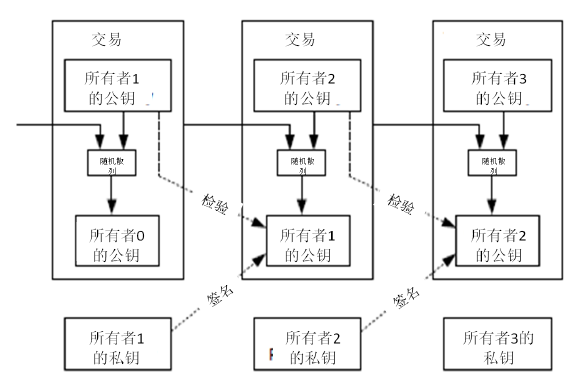
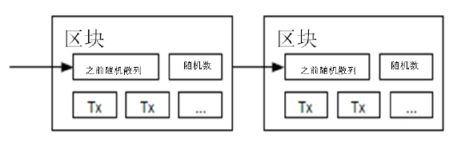
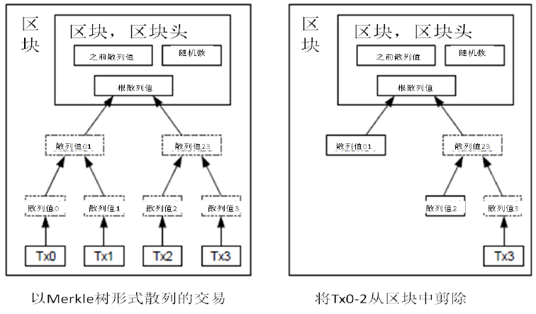
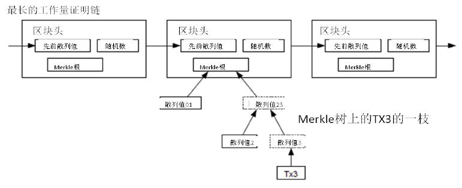
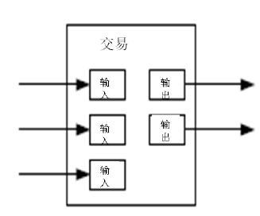
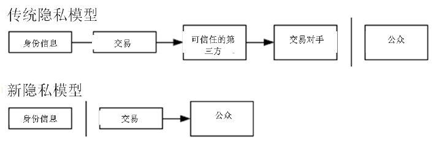
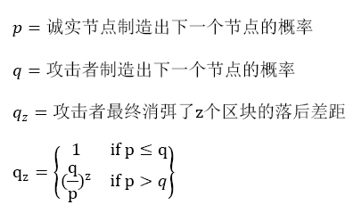
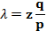
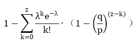

# BTC 白皮书
## 简介
- 网上贸易全部需要借助金融机构作为可信第三方处理电子支付信息，但这类系统受制于"基于信用的模式"。
	- 无法实现不可逆交易
	- 中介存在也会增加交易成本，这里是按照交易额来收费
	- 限制了最小交易规模
	- 限制了日常小额支付交易
	- 需要支持退款，交易可能导致泄露交易双方信息
	- 无法避免

BTC 就是一个点对点分布式电子支付系统，基于密码学原理而不给予信用，使得任何达成一致的双方，能够直接进行支付，从而不需要第三方中介参与。杜绝回滚支付交易的可能，保护特定的卖家免于欺诈。

服务基于一种点对点分布式的时间戳服务器，来生成依照时间前后排列并加以记录的电子交易证明，从而解决双重支付问题。只要诚实的节点所控制的计算能力总和大于合作关系的攻击者计算能力总和，就是安全的。

## 交易
定义一种电子货币(an electronic coin) 是这样的一串数字签名

- 每一位所有者通过对前一次交易和下一位拥有着的公钥签署一个随机散列的数字签名
- 将这个签名附加在这枚电子货币的末尾
- 发送给下一位所有者
- 收款人通过对签名进行检验，验证该签名的所有者

难点在于收款人难以验证，之前的某位所有者是否对这枚电子货币进行了双重支付。 这需要确保所有者没有对更早的交易实施签名。实际上只需要关注交易之前发生的交易，而不需要关注这笔交易发生之后是否会双重支付的尝试。

## 时间戳服务器(Timestamp server)
解决上面的方案首先提出一个 "时间戳服务器"。

- 时间戳服务器通过对区块(block)形式存在的一组数据实施随机散列而加上时间戳，并将该随机散列进行广播。
- 该时间戳能够证实特定数据必然于某特定时间是的确存在，因为只有在该时刻存在才能获取相应的随机散列值。
- 每个时间戳应当将前一个时间戳纳入其散列值中，每个随后的时间戳都对之前的一个时间戳进行增强，就形成了一个链条

## 工作量证明(Proof-of-Work)
为了在点对点的基础上构建一组分散化的时间戳服务器，需要一个哈希方法。在进行随机散列运算时，工作量证明机制引入了对某一个特定值的扫描工作，如 sha-256，随机散列值以一个或者多个0开始，那么随着0的数目上升，找到这个解所需要工作将呈指数增长，而对结果进行检验则仅需要1次散列运算。

在区块中增一个随机数(Nonce)，这个随机数要使得该给定区块的随机散列值出现了所需的多个0.通过反复尝试来找寻这个随机数，直到满足。这样就构建了一个工作量证明机制。只要耗费硬件的工作量能够满足该工作量证明机制，除非重新完成相当的工作量，否则该区块的信息就是不可更改的。由于之后的区块是链接在该区块之后的，所以想要更改该区块中的信息，还需要重新完成之前的所有区块的全部工作。

同时，该机制还解决了在集体投票时，谁是大多数的问题。如果决定大多数的方式基于 IP,一个IP一张票，那么如果有人拥有大量 IP ，该机制则无法运作。而工作量证明本质是一 cpu 一票。大多数的决定表达为最长的链，因为最长的链包含了最大的工作量。假设大部分 cpu 为诚实的节点控制，那么诚实节点的链肯定最长，并超过其他的竞争链条。设想一个较慢的攻击者试图赶上区块增长，成功率成指数递减。

随着硬件速度的增长，节点参与网络的程度则会有所起伏。为了解决这个问题，工作量证明的难度( the proof of work difficulty) 将采用移动平均目标的方法来确定，即令难度指向令每小时生成区块的速度为某一个预定的平均数。如果区块生成的速度过快，那么难度就会提高。

## 网络
运行该网络步骤

- 新的交易向全网进行广播
- 每个节点都会收到交易信息纳入一个区块
- 每个节点都会尝试在自己的区块中找到一个具有足够难度的工作量证明
- 当一个节点找到了一个工作量证明，就向全网进行广播
- 当包含该区块中的所有交易都是有效的并且有效，且之前没有存在过，其他节点才能认同区块有效性
- 其他节点表示他们接受该区块，而且表示接受的方法，则是在跟随该区块的末尾，制造新的区块以延长该链条，而被接受区块的随机散列值为先于新区块的随机散列值

节点始终将最长的链条视为正确的链条，并持续工作和延长他们。如果有2个节点同时广播不同的版本新区块，那么其他节点接收时间将存在先后差异。这个情况，他们将率先收到的区块基础上进行工作，但也会保留另一条链条，防止后者变成最长链条。僵局在下一个工作证明打破，而其中一条将变成最长的，所有节点将切换到最长的那条链工作。

所谓新的交易广播，实际上不需要抵达全部节点。只要交易信息能够抵达足够多的节点，那么他们很快会被整合进一个区块中，而区块的广播被丢弃的信息具有一定的容错能力，如果一个节点没有收到某特定区块，那么该节点将被发现自己缺失了某个区块，也就可以提出自己下载该区块的请求。

## 激励
预定每一个区块的第一笔交易进行特殊化处理，该交易产生一个创币交易，用来奖励该节点的维护者。这样就增加了在没有中心化服务的前提下，节点支持该网络的激励，提供一种将电子货币分配到流通领域的一种方法。这种将一定数量新货币持续添加到货币系统中的方法，非常类似于耗费资源去挖掘金矿并将黄金注入流通领域。不过现在用的是 cpu 和电力消耗。

另一个激励来源则是交易费(transaction fees)，如果某笔交易的输出值小于输入值，那么差额就是交易费，该交易费将被增加到该区块的激励中。只要既定数量的电子货币进入流通，那么记录机制就可以逐渐转换为完全依靠交易费，那么本货币系统就能够免于通货膨胀。

激励系统也有助于鼓励及诶单保持诚实，如果攻击者计算能力足够，那么它将可以选择诚实工作来生成电子货币或用来攻击。而明显诚实工作收益更高。因为在规则下工作可以受益更多电子货币。
## 回收硬盘空间
如果最近的交易已经被纳入了足够多的区块中，那么就可以丢弃该交易之前的数据，以回收硬盘空间。为了同时确保不损害区块的随机散列值，交易信息被随机散列的同时，会被构建默克尔树(Merkle tree)的形态，使得只有根 (root) 被纳入了区块的随机散列值。通过将该数(tree)的分支拔除(stubbing) 的方法，老区块就被压缩。而内部的随机散列值不必保存。

不含交易信息的区块头大小仅有80字节，如果设定区块生成速率为每10分钟1个区块，那么每年产生的数据为 4.2MB（80 byte*6*24*365=4.2MB），这样算，即使全部区块头放进内存，都不会有问题。

## 简化的支付确认(Simplified Payment Verification)
在不运行完整网络节点的情况下，也能够支付进行检验。一个用户需要保留最长的工作量证明链条的区块头的拷贝，它可以不断的向网络发起询问，直到它确信自己拥有最长的链条，并能够通过默克尔树的分支通向它被加上时间戳，并纳入区块的那次交易。节点想要自行检验该交易的有效性原本是不可能的，但通过追溯到链条的某个位置，它就能够看到某个节点曾经接受它，并于其后追加的区块也进一步证明全网曾经接受它。

只要诚实节点控制了网络，检验机制就是可靠的。但当全网被一个计算力占优的攻击者攻击时，将变得非常脆弱。因为网络节点能够自行确认交易的有效性，只要攻击者能够持续的保持计算力的优势，简化的机制会被攻击者焊接到交易。那么一个可行的策略就是，只要他们发现了一个无效的区块，就立即报警，收到报警的用户理解开始下载被警告的有问题的区块或交易的完整信息，以对信息的不一致进行判断。对于日常发生大量首付款的商业机构，可能仍会希望运行完全节点，以确保独立的完整性和检验的快速性。

## 价值的组合与分割(Combining and Splitting Value)
虽然可以单个的进行电子货币进行处理，但对于每一个电子货币发起一次交易是一种笨拙的方法。为了使得价值易于组合与分割，交易被设计为可以纳入多个输入和输出。一般而言某次价值较大的前次交易构成的单一输入，或由于某几个价值较小的前次交易共同构成的并行输入，但输出最多只有2个，一个用于支付，一个用于找零。

当一笔交易依赖于之前的多笔交易时，这些交易又各自依赖于多笔交易，但这并不存在任何问题。因为这个工作机制并不需要展开检验之前发生的所有交易历史。
## 隐私

传统中心化模型为交易的参与者提供了一定程度的隐私保护，因为试图向可信任的第三方索取交易信息是严格受限的。但如果交易信息向全网广播，这意味着这个方法将失效。但是隐私依然可以得到保护，将公钥保持匿名。公众的值的信息仅仅是某人将一定数量的货币发送给另一个人，但很难将该交易和特定的人联系在一起。

作为预防错误，使用者可以让每次交易都生成一个新的地址，以确保这些交易不被追溯到一个共同的所有者。但是由于并行输入的存在，一定程度上，追溯是不可避免的，因为并行输入表明这些货币属于一个所有者，因此风险在于，如果某个人在某一个公钥被确认属于他，那么可以追溯出此人的其他交易。
## 计算
假设一个攻击者试图比诚实节点产生更快的区块来代替诚实区块链。即使达到这个目的，整个系统也并非完全受制于攻击者，因为节点不接受无效交易，而诚实节点永远不会接受一个包含无效信息的区块。一个攻击者最多只能修改自己的交易信息，并试图拿回刚才的付款。

诚实链条和攻击者链条的竞赛，可以用二叉树随机漫步(Binomial Random Walk) 来描述。成功事件定义为诚实链条延长了一个区块，使其领先性+1，而失败事件则是攻击者的链条被延长一个区块，差距-1.

攻击者成功填补某一个既定差距的可能性，可以近乎看作赌徒破产问题。假设赌徒拥有无限透支的信用卡，然后开始进行潜在次数的无穷赌博，试图填补自己的亏空。那么计算填补上的概率

假定 p > q，那么攻击成功的概率就因为区块的增长呈现指数下降，由于攻击者如果不能幸运的快速获得成功，那么随着时间的流逝，变得越发艰难。那么就可以得出一个结论，一个收款人需要等待多长时间，才能够确信付款人难以修改交易。

收款人生成了新的一对密钥组合，然后只预留一个较短的时间将公钥发送给付款人。这将可以防止以下情况

- 付款人预先准备好一个区块链然后持续的对此区块进行运算，直到运气让他区块超越诚实链条，方才确认支付。
- 但只要交易一旦发出，攻击者就秘密的准备包含该交易替换版本的平行链
- 然后收款人将等待交易出现在首个区块中，然后在等到 z 个区块后，此时，收款人仍无法确认缺钱攻击者已经进展了多少区块，但是假设诚实区块将耗费平均预期时间以产生一个区块，那么攻击者潜在的进展就是一个泊松分布，期望为

为了计算攻击者追上的概率，将攻击者取得进展区块数量的泊松分布的概率密度，乘上该数量下攻击者依然能够追上的概率

c语言表达如下

	#include double AttackerSuccessProbability(double q, int z)
	{
		double p = 1.0 - q;
		double lambda = z * (q / p);
		double sum = 1.0;
		int i, k;
		for (k = 0; k <= z; k++)
			{
				double poisson = exp(-lambda);
				for (i = 1; i <= k; i++)
					poisson *= lambda / i;
				sum -= poisson * (1 - pow(q / p, z - k));
			}
	return sum;
	}
对其运算，概率结果，发现概率对z值呈指数下降

	当 q=0.1 时
		z=0 P=1.0000000
		z=1 P=0.2045873
		z=2 P=0.0509779
		z=3 P=0.0131722
		z=4 P=0.0034552
		z=5 P=0.0009137
		z=6 P=0.0002428
		z=7 P=0.0000647
		z=8 P=0.0000173
		z=9 P=0.0000046
		z=10 P=0.0000012
	
	当 q=0.3 时
		z=0 P=1.0000000
		z=5 P=0.1773523
		z=10 P=0.0416605
		z=15 P=0.0101008
		z=20 P=0.0024804
		z=25 P=0.0006132
		z=30 P=0.0001522
		z=35 P=0.0000379
		z=40 P=0.0000095
		z=45 P=0.0000024
		z=50 P=0.0000006
	
	求解令 P<0.1%的 z 值：
	
	为使 P<0.001， 则
		q=0.10 z=5
		q=0.15 z=8
		q=0.20 z=11
		q=0.25 z=15
		q=0.30 z=24
		q=0.35 z=41
		q=0.40 z=89
		q=0.45 z=340
## 结论
通过提出一种不需要信用中介的电子支付系统。

- 首先讨论了通常的电子货币的电子签名原理，虽然这种系统为所有权提供了强有力的控制，但不足以防止双重支付。
- 为了解决这个问题，提出了一种工作量证明机制的点对点网络来记录交易的公开信息，只要大多数诚实节点控制计算力，就可以让攻击者难以篡改交易记录。

它结构简洁。节点之间工作大部分独立运行，只需要很少的协同。每个节点都不需要明确自己的身份，由于交易信息的流动路径并无任何要求，所以只需要近期最大努力传播即可。节点可以随时离开和加入，只需要补充完整的工作量证明链即可。节点通过自己的 CPU 计算力进行投票，表决他们对有效区块的确认，他们不断延长有效区块链来表达自己的确认，并拒绝无效区块。	

