# BTC 笔记
## 基础概念定义
- BTC 地址即共钥地址

	`1DSrfJdB2AnWaFNgSbv3MZC2m74996JafV` 通过对160位二进制公钥哈希值进行 base58check 编码转换而来
- 私钥

	`5J76sF8L5jTtzE96r66Sf8cka9y44wdpJjMwCxR3tzLh3ibVPxh+` 解锁钱包地址(公钥)的一串字符	
- BIP

	比特币改进提议，比特币社区提交的一系列改进比特币的提议，比如 bip0021
- 区块

	一个区块是若干交易数据的集合，会标记上时间和之前区块的独特标记。区块头由哈希运算后产生一份工作证明，从而验证区块中的交易。有效区块经过全网共识后才会被追加到主区块中
- 区块链

	是一串通过验证的区块的集合，每个区块与上一个相连，一直到创世区块。
- coinbase

	一个用于为创币交易提供专门输入的特殊字段。允许声明区块奖励，并为任意数据提供100字节。它不是创币交易
- coinbase 交易

	区块中的第一笔交易。由矿工创建，包含单个 coinbase。
- 冷存储

	离线存储，任何持币者都是重要的。在线计算机不适合存储大量比特币
- 染色币

	比特币 2.0 开源协议允许开发者在比特币区块链之上，利用它的超越货币的功能创建数字资产
- 交易确认

	当一项交易被区块收录后，可以说是一次确认，矿工在此区块之后每产生一个区块，交易确认数就加1.当确认数到6的时候，通常认为这笔交易比较安全并很难篡改。
- 共识

	当网络中许多节点，拥有相同本地验证的最长区块时，称为共识。
- 共识规则

	全节点与其他节点保持共识的区块验证规则。
- 难度

	整个网络会通过调整难度来控制生成工作量证明所需要的计算力
- 难度重定义

	全网中每新增 2016 个区块，全网难度将重新计算，该难度依据 2016 个区块哈希的算力而定。
- 难度目标？

	使整个网络的计算力大致每10分钟产生1个区块所需要的难度数值即为难度目标
- 双重支付(双花)？

	比特币通过添加到区块中的每笔交易进行验证来防治双花
- ECDSA

	椭圆签名算法，比特币使用的是其中一种，确保资金被正确的拥有者支付。
- 超额随机数？

	随着难度增加，矿工通常在循环便利 4亿次随机数后仍未找到区块。因为 coinbase 脚本可以存储2-100字节数据，矿工开始使用这个存储空间作为超额 nonce 空间，允许矿工利用一个更大范围的区块头哈希来寻找有效区块。
- 矿工奖励

	每笔交易的交易者会向网络缴纳一笔矿工费，用处理交易，之前为 0.005 比特币，但现在随着比特币上升，该金额越来越小。交易费用并不是固定的，但是带来更多的交易延迟(注意，从交易频率来看，交易越高时间段的频率交易延迟越高，推荐小额交易使用交易频率低的时间点，这样延迟最小)
- 分叉

	分叉也被称为意外分叉，是两个或多个区块拥有同一区块高度时发生的，此时产生分叉。
	
	- 典型情况是多个矿工几乎同时在同一时间发现了区块。
	- 共识攻击的情况下也会出现
- 创世区块
	- 指区块链上的第一个区块，用来初始化相应的加密货币
- 硬分叉
	- 区块链中一个永久分叉。通常按照新的共识规则进行了版本升级的节点产生了新区块时，那些没有升级的节点无法验证这些新区块产生。
- 钱包

	用于存储用户私钥
- 哈希

	数据指纹
- 哈希锁

	限制一个输出花费的限制对象，作用一直持续到指定数据片段公开透露。
	
	- 特性  		
	
		一旦任意一个哈希锁被公开，其他任何安全使用相同密钥的哈希锁也被打开。这让创建多个被同意哈希锁限制的输出，这些将在同一时间被花费。
- HD 协议

	层级确定性 HD 密钥创建和传输协议 BIP32，该协议允许按层级方式从父密钥创建子密钥。
- HD 钱包

	使用创建层次确定的钥匙和 BIP32 传输协议的钱包
- HD 钱包种子

	种子或根种子是一个用于为 HD 钱包生成主私钥和主链码所需要种子的潜在简短数值。
- 哈希时间锁定合约(HTLC)

	HTLC 是一类支付方式，使用哈希锁和时间锁来锁定交易。解锁需要接收方提供通过加密支付证明承认在截止日期之前收到的支付或接收方丧失了认领支付的能力(支付金额将返还支付方)
- KYC

	(know yourcustomer)充分了解你的账户是一个商业过程，用于认证和验证客户身份信息。也指银行监管
- leveldb

	kv 数据库
- 闪电网络

	闪电网络是哈希时间锁定合约的一种建议实现方式。闪电网络通过双向支付通道方式允许支付方通过多个点对点支付通道安全的完成支付。这将允许一种支付网络的构建，该网络中的一方可以支付给其他任何一方，即使在双方没有直接建立支付通道的情况。
- 锁定时间

	是交易的一部分，表明该交易被添加到区块中的最早时间
- 交易池

	是区块中所有交易数据的集合，这些交易已经被比特币节点验证，但未确认。
- 默克尔根

	是树的根节点，该节点为树中所有节点对的多次哈希计算结果。区块头必须包括区块中所有交易哈希计算得到的有效默克尔根。
- 默克尔树

	生成一颗完整的默克尔树需要递归对哈希节点对进行哈希，并将新生成的哈希插入默克尔树中，直到只剩下一个哈希节点，该节点就是默克尔树的根。比特币中，叶子节点来自每个区块中的交易。
- 矿工

	一个为新区块通过重复哈希计算来寻找有效工作量证明的网络节点
- 多重签名

	需要多于一个密钥验证一个比特币交易
- 网络

	比特币中的每一个节点组成的点对点网络
- 随机数

	比特币区块中一个 32位(4字节)的字段，在设置了该值后，才能计算区块的哈希，其哈希值是以多个0开头，区块中其他字段值是不变的，因为有确定含义。
- 离线交易

	区块链外的价值转移，通过区块链意外的方法来记录和验证交易。
- 操作码

	比特币脚本语言，通过操作码可以在公钥脚本或签名脚本中实现压入数据或执行函数操作。
- 开放资产协议？

	是建立在比特币区块链之上简单有效的协议，允许用户创建资产的发行和传输。是颜色币的盖点的一个进化。
- op_return？

	一个用在交易中国呢的一种输出操作码。
- op_return 交易

	在比特币核心 0.9 中默认的一种被传输和挖出交易类型，在随后的版本中添加任意数据可证明的未话费公钥中，全节点中无需将该脚本存储到他们的 utxo 数据库。
- 孤块

	由父区未被本地节点处理的区块，不能被完全验证
- 孤立交易

	孤立交易是指那些因为缺少一个或多个输入交易而无法进入交易池的交易
- 交易输出

	txout 是交易中的输出，包含两个字段
	
	- 输出值字段：用于传输 0 或者更多聪
	- 公钥脚本：用于确定这些聪需要在满足什么条件下可花费
- p2pkh

	支付到比特币地址的交易包含支付公钥哈希脚本(p2pkh)，脚本锁定的交易输出可以通过给出由相应私钥创建的公钥和数字签名来解锁(消费).
- p2psh

	是一种强大、新型、且能简化复杂交易的脚本交易类型。通过使用 p2psh ，详细描述话费输出条件的复杂脚本(赎回脚本)将不会出现在锁定脚本中。赎回脚本哈希包含在锁定脚本中。
- p2psh 地址

	基于base58编码的一个包含20个字节哈希的脚本。 p2sh 地址采用 5 前缀。导致base58编码后地址为3开头。它隐藏了所有复杂性，因此，用其支付的人将不会看到脚本。
- p2wpkh

	p2wpkh 签名包含了与 p2pkh 话费相同的信息。但签名信息放置于见证字段，而不是签名脚本字段中。公钥脚本也被修改。
- p2wsh

	p2wsh与p2sh 的不同之处在于加密证据存放在位置从脚本签名字段转变至见证字段，公钥脚本字段也被改变。
- 纸钱包

	纸钱包是一个包含所有必要数据的文件，这些数据用于生成比特币私钥，形成密钥钱包。人们通常使用该术语表达以物理文件形式离线存储比特币的方式。第二个定义也包括纸密钥和可赎回编码。
- 支付通道

	设计用于用户生成多个比特币交易，且无需提交所有交易至比特币区块链中。在一个典型的支付通道中，只有两个交易被添加到区块链中，但参与双方可以生成无限制或者接近无限数量的支付。
- 矿池

	矿池是一种挖矿方式，矿池中多个客户端共同贡献算力来生产区块，然后根据贡献算力大小来区分块奖励。
- 权益证明

	权益证明 pos 是一种方法，加密货币区块链网络获得分发共识。 pos 会让用户证明其拥有的资产总量。
- 工作量证明

	通过有效计算得到的一小块数据。比特币矿工必须在满足全网目标难度的情况下求解 sha256 算法
- 奖励

	每新生成一个区块，就奖励矿工12.5个比特币
- ripemd-160

	是一个 160位的加密哈希函数，是 ripemd 的加强版，计算结果是160个哈希值。实现未来10年的安全。
- 脚本

	比特币使用脚本系统来处理交易，估计设计为非图灵完备，没有循环计算能力。
- scriptpubkey(公钥)

	脚本公钥匙包含在交易输出的脚本中。该脚本设置了比特币花费满足的条件。满足条件的数据可以由签名脚本提供。
- sriptsig

	签名脚本是由支付端生成的数据，该数据几乎总是被用作满足公钥脚本的变量。
- 隔离见证

	隔离见证是比特币协议的升级建议，该建议技术创新性将签名数据从比特币交易中分离出来。隔离见证是一个推荐的软分叉方案，该变化将从技术上使得比特币协议规则更严谨。
- 软分叉

	区块链中一个短暂的分叉，通常是矿工在不知新共识规则的情况下，未对其节点升级产生的。
- spv(简化支付验证)

	简化支付验证是在无需下载所有区块的情况下对特定交易进行验证的方法，该方法被用于一些比特币轻量客户端中。
- 旧块

	旧块是那些被成功挖出，但没有包含在当前主链的区块，很可能是同一高度的其他区块有限扩展了区块链长度导致。
- 时间锁

	一种阻碍类型，用于严格控制一些比特币只能在将来某个特定时间和区块才能被支出。时间锁在很多比特币合约中起到了显著作用，包括支付通道和哈希锁合约。
- 交易

	简单的说，交易指把比特币从一个地址转移到另一个地址。过程是一个经过签名的运算，表达价值转移的数据结构。每一笔交易都经过比特币网络传输，由矿工节点收集并打包至区块中，永久保存
- 交易池

	一个无序的交易合集，该交易未在主链区块中，但有期输入。
- 图灵完备

	在给定足够时间与内存的情况下，一个变成语言能够运行在图灵机上，该语言就被称为图灵完备的编程语言。
- UTXO(未花费交易输出)

	未花费交易输出，可以作为新交易的输入
- 钱包

	保存比特币地址和私钥的软件，可以用它来接受、发送、存储比特币。
- WIF(钱包导入格式)

	钱包导入格式是一个数据交换格式，设计用于允许导出和导入单个私钥，该私钥通过标示表明是否使用压缩公钥。
- 交易的输入和输出
	- 输入是比特币的来源，通常是之前的一笔交易输出。
	- 输出分两个部分
		- 将约定金额发给新的所有者地址
		- 将零钱返回原来的比比特币所有者，这里不一定是之前的输入地址
	
## 货币互联网的四大创新
- 去中心化对等网络(比特币协议)
- 公共交易总帐(区块链)
- 独立交易确认和货币发行(共识规则)
- 实现有效的区块链全球去中心化共识机制(工作量证明算法)

## 三个基本问题
- 钱是真实的
- 如何避免双重支付

	通过工作量证明方法，每10分钟进行一次全球选举，从而允许分布式网络达成交易共识，解决双花问题。
- 安全性不可被盗取

## 组成
比特币系统由四方面组成

- 用户(钱包)
- 交易(每笔交易都会被广播到整个比特币网络)
- 矿工(区块链共识节点)
- 区块链(总帐)

## 优势
- 设计实现了去中心化

	不受制于任何可能被攻击或损坏的中央权威或控制点，关键创新是使用工作量证明算法(结局拜占庭将军问题)每10分钟进行一次全球选举，允许分布式网络达成关于交易状态的共识。这种分权网络可以作为彩票、资产登记、数字公证等。
- 比特币交易无需手续费(通过中心化交易所是有成本的)

## 钱包分类
### 按照平台分
- 桌面钱包

	第一种类型的钱包，运行在通用操作系统，如 win/mac，有安全隐患
- 手机钱包

	最常见类型，分简易钱包和全功能钱包
- 在线钱包

	通过游览器访问，真正钱包在第三方服务器中
- 硬件钱包(比较安全)

	专用硬件，独立操作设别，通过 usb 于桌面或者移动设备的近场 NFC 进行通讯
- 纸钱包

	打印长期存储，即使可以使用其他材料，如木材或者金属，提供低技术，但是高安全的长期储存方案，也被称为冷存储

### 按照自主交互程度分
- 全节点客户端

	存储比特币交易全部历史的数据，管理用户钱包，并且可以直接在比特币网络上启动交易。可以处理协议的所有逻辑，并可以独立验证整个区块链的任何交易。消耗 400GB 磁盘和 2GB 内存，磁盘消耗将越来越大
- 轻量级客户端

	也称简单支付验证客户端(SPV),链接到比特币完整节点，用于访问比特币交易信息，但在本地存储用户钱包，独立创建，验证和传输交易。轻量级客户端于 比特币网络直接交互，无需中介。
- 第三方 api 客户端

	通过应用程序编程接口 api 的第三方系统与比特币交互的 api 客户端，而不是直接链接到比特币网络。钱包由第三方服务器存储，比如交易所

### 钱包分组
- 桌面全客户端
- 移动轻巧钱包
- 网络第三方钱包

### 钱包支付二维码
- 钱包支付二维码包含
	- 买家地址
	- 一笔支付金额
	- 一段描述信息

### 钱包特性
- 比特币地址(新的公钥)可以随意新建，不进行交易的地址就不存在于比特币网络中，而进行交易的地址才存在于网络
- 有些钱包可以每次交易都会自动创建一个新地址，最大程度提高隐私
- 钱包只是一个比特币地址的合集和解锁资金的钥匙

### 交易特性
- 比特币交易不可逆
- 比特币与法币交易即可被定位，所以与法币交互的账户和币币交易账户应该分开

### 获取比特币方法
#### 寻找渠道
- 找熟人线下交易比特币
- meetup 线下交易
- localbitcoins.com 中间商交易
- 交易所交易

#### 寻找价格
价格实时波动，需要找寻市场价格参照物,大部分钱包会自动转换价格

- [bitcoin average](https://bitcoinaverage.com/markets/coins/BTC/USD)
- [coincap](https://coincap.io/assets/bitcoin)

### 二维码使用 BIP0021 定义，数据包含
	bitcoin:1GdK9UzpHBzqzX2A9JFP3Di4weBwqgmoQA?
	amount=0.015&
	label=Bob%27s%20Cafe&
	message=Purchase%20at%20Bob%27s%20Cafe
	Components of the URL
	A bitcoin address: "1GdK9UzpHBzqzX2A9JFP3Di4weBwqgmoQA"
	The payment amount: "0.015"
	A label for the recipient address: "Bob's Cafe"
	A description for the payment: "Purchase at Bob's Cafe

## 交易流程
### 基础流程
- 卖方
	- 输入买方地址(公钥)
	- 输入发送金额
		- 转发金额
		- 矿工奖励(0.0004) 
	- 创建了交易记录
	- 用卖家私钥签署交易记录
	- 广播给比特币网络这笔交易
- 买房
	- 使用买方地址通过 btc 游览器查看比特币网络数据
	- 查询到数据，但并没有确认(没有超过51%的节点同步到交易存储的区块)，预计要几秒中
	- 等待数据确认
	- 数据确认(超过51%的节点同步到交易存储区块，并认为这个是对的。) ，预计要1-2个小时

### 交易的输入和输出
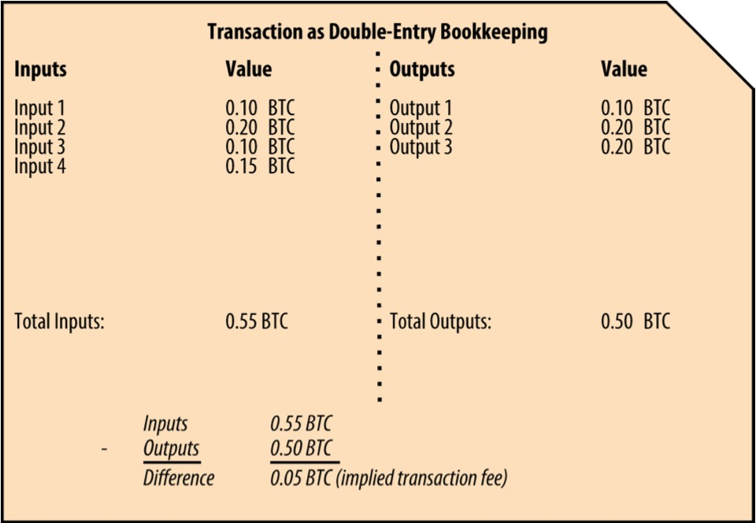
交易时将比特币从交易输入转移至交易输出。随着钱从一个地址被转移到另一个地址，同时形成了一条所有权链条，如下图。
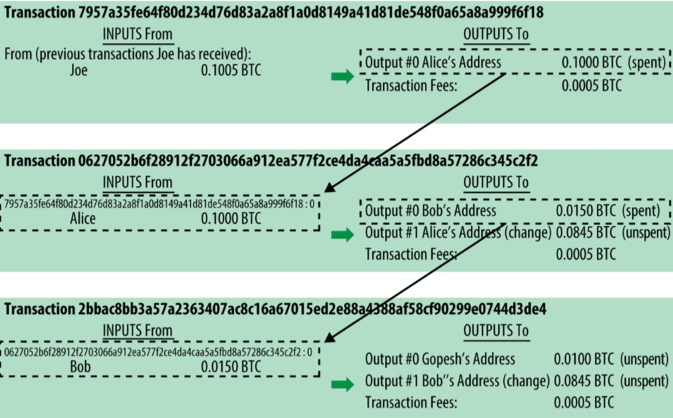

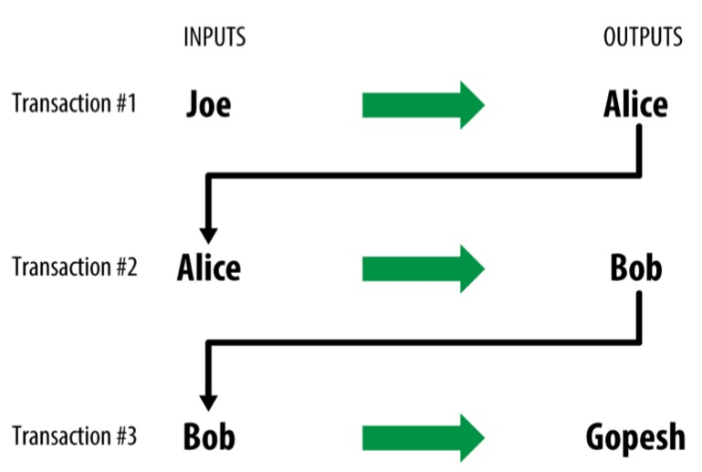

- 一笔交易(消费)，包含
	- 输入
	
		一个或者多个输入，输入针对一个比特币账户的负债，对于比特币消费者来说也就是要被消费掉的比特币金额
	- 输出

		一个或多个输出，被当成信用积分记入比特币账户 ，对于比特币收费者来说，就是收入到的比特币
	- 矿工奖励(小费)

		输入和输出不需要相等，累加略小于输入，两者之差包含"矿工奖励"
	- 所有权证明

		还包含这笔交易的所有权证明，用所有者密钥签名来证明，该证明可以被任何人证明。
	- 找零
		- 比特币新所有者地址(买方地址)
		- 比特币当前所有者(卖方地址-也称为找零地址)
		
		比特币交易还包含找零地址，在支付过程中支付比特币，剩余的比特将被退回找零地址，注意，这里的找零地址可以和原有支付地址不相同，通常可以是所有者钱包的新地址。不同的钱包可以汇总持有的多个地址的比特币总额，以便使用不同策略付款。可以聚合多个地址的小额比特币，也可以使用单一地址的大额。
		
		- 如果总使用大面额支付，最终会得到一个充满零钱的钱包。
		- 如果总使用零钱，将最终得到一个整钱

		比特币钱包开发商力图平衡

### 交易类型		
- 普通交易
	- 单一地址大额消费
	
		由一个输入地址和两个输出地址组成

		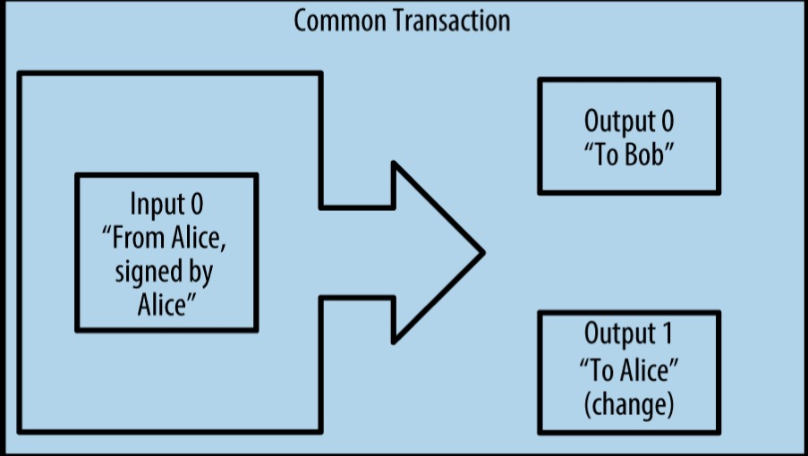
	- 多个地址小额消费，也叫打包资金交易

		由多个输入地址和一个输出地址组成，类似用零钱支付。
		
		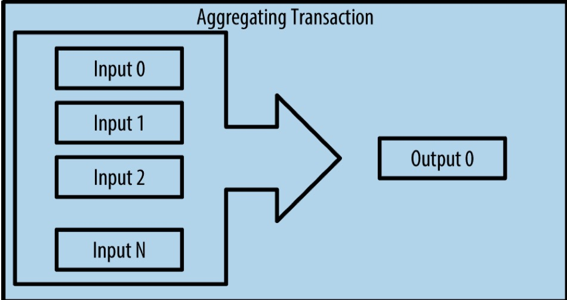
	- 一个输入地址分配给多个输出地址
		
		由一个输入地址分配给多个输出地址，即接收方为多个，现实例子发工资。
			
		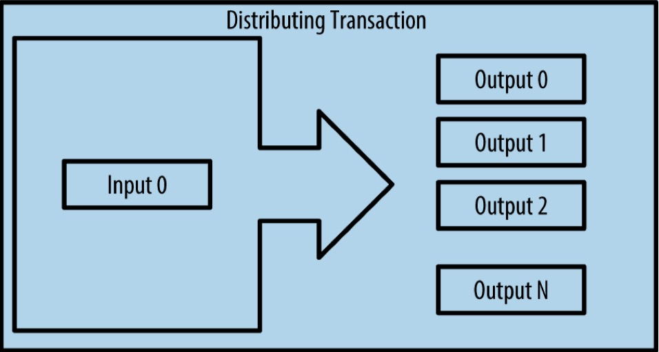
		
### 交易构建
构建交易无需实时连接比特币网络，只需要在执行交易时，才需要将交易发送到网络

- 获取正确输入

	完整客户端包含整个区块链的所有交易的所有未消费输出副本。这样可以使完整客户端即可以使用输出构建交易，又可以收到新交易时很快验证其输入是否正确。	
	
	钱包找寻足够额度的比特币地址进行支付。大多数钱包应用跟踪钱包中某个地址的所有输出(已有额度)。大多数钱包只保存自己消费的输出(轻钱包)，如果发现没有某一消费交易输出，它可以通过完整客户端服务提供者的各种数据接口拿到这部分信息。比如使用 API
	
	例子查找 alice 的比特币地址`1Cdid9KFAaatwczBwBttQcwXYCpvK8h7FK `所有的[未消费输出](https://www.blockchain.com/btc/tx/7957a35fe64f80d234d76d83a2a8f1a0d8149a41d81de548f0a65a8a999f6f18),这里包含足够的额度支付，如果没有，钱包软件将搜索其他管理地址，直到找到足够支付额度为止。交易可能需要找零，钱包应用会创建交易的输出部分。
	
		curl https://blockchain.info/unspent?active=1Cdid9KFAaatwczBwBttQcwXYCpvK8h7FK | jq
		
		{
		  "notice": "",
		  "unspent_outputs": [
		    {
		     "tx_hash":"186f9f998a5...2836dd734d2804fe65fa35779",
			"tx_index":104810202,
			"tx_output_n": 0,
			"script":"76a9147f9b1a7fb68d60c536c2fd8aeaa53a8f3cc025a888ac",
			"value": 10000000,
			"value_hex": "00989680",
			"confirmations":0
		    }		  ]
		}
- 交易输出
	- 第一个输出

		交易输出会包含一个脚本(被创建成一个包含这笔交易数额的脚本形式)，只能被引用这个脚本的一个解答后才能兑换。(执行脚本验证交易签名和收款方公开地址匹配上即可支付)。而只有收款方的私钥才能签名才能兑换处这笔输出。付款方需要收款方的签名来包装一个输出
	- 第二个输出

		钱包应用将创建第二个输出，将交易的剩下的款项发送给自己。包装出第二个输出，方法同上。
	- 奖励

		输入和输出的差值将奖励给矿工，让网络尽快处理这比交易。
	
	例子查看 alice 这比交易得到的[结果](https://www.blockchain.com/btc/tx/0627052b6f28912f2703066a912ea577f2ce4da4caa5a5fbd8a57286c345c2f2)
	
### 交易放到总账
上面的交易创建完毕后，数据大小为 256 字节，包含了全部交易信息。现在必须将交易传送到比特币网络。

- 交易从哪里传送

	 比特币网络由对等比特币客户端节点组成的 p2p 网络。所以从哪里传数据都无所谓。
- 传输方法

	交易可以发送给交易的任何一个联网的客户端，不论通过有线或者无线网络。任何比特币节点收到一个之前未见过的有效交易会立刻将它发送给连接自身的其他节点。因此这个交易迅速通过 p2p 传播，几秒就能达到大多数节点。
- 从收款方角度

	收款者钱包能在几秒钟后就可以看到这比交易，因为包含收款者私钥，所以能兑换输出。也可以用之前未消费的输入来确认这比交易正确构建，矿工奖励足够的话，该交易将被打包到下一个区块中。
	
## 挖矿
交易在比特币网络传播开，但只有被挖矿过程验证且加到一个区块中后，交易才会成为共享账簿的一部分。挖矿系统的两个重要作用

- 挖矿节点通过参考比特币共识规则验证所有交易。因此挖矿通过拒绝无效或畸形交易来提供比特币交易安全性
- 挖矿在构建区块时会创建新的比特币，但随时间会逐渐减少。

	挖矿成本和报酬之间取得平衡，一个成功的矿工将以新的比特币和交易费的形式得到奖励。但矿工只有正确验证了所有交易才能获取奖励。
	
## 挖矿交易记录
- 交易记录进入网络节点
- 节点将交易记录存放在临时未验证交易池子中
- 节点在创建一个新区块，如[ alice 交易的区块例](https://www.blockchain.com/btc/block/277316)
	- 会从这个池子中拿交易放到新区块中，注意这块时按照交易费多少来和其他一些规则排优先级
	- 会加入一个特殊的新交易，将这个新生成区块的 12.5 个比特币报酬支付给矿工的地址 
- 然后做工作量证明，证明其合法性
- 合法证明完毕后，矿工将新创建的区块发布到网络上(包含交易信息)
- 在一段时间内，网络中的其他节点将获得这个新区块，并且对该区块进行验证，每多一个节点验证，就多一次确认。 
- 当全网超过半数节点在一个区块6次以上的确认时，这个确认将不可被撤销。因为撤销和重建6个区块需要巨量的计算

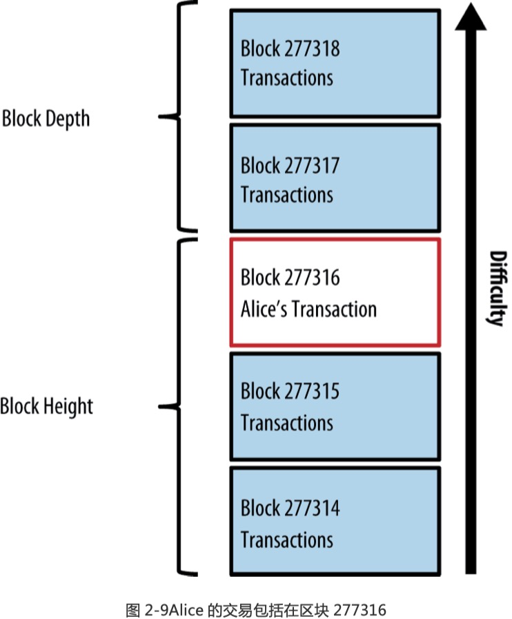

## 比特币核心
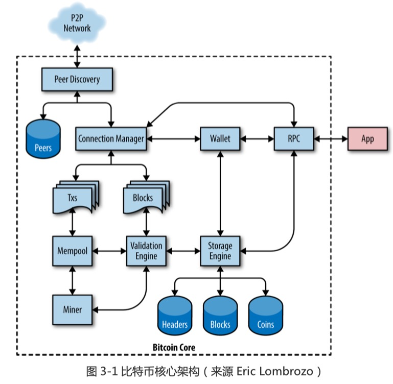
### 源码编译比特币客户端核心(bitcoind)
- clone

		$ git clone https://github.com/bitcoin/bitcoin.git
		Cloning into 'bitcoin'...
		remote: Counting objects: 66193, done.
		remote: Total 66193 (delta 0), reused 0 (delta 0), pack-reused 66193
		Receiving objects: 100% (66193/66193), 63.39 MiB | 574.00 KiB/s, done.
		Resolving deltas: 100% (48395/48395), done.
		Checking connectivity... done.
		$ cd bitcoin
- 获取 tag

		$ git tag
		v0.1.5
		v0.1.6test1
		v0.10.0
		v0.11.2rc1 
		...
- 切换稳定版本

		$ git checkout v0.11.2
		HEAD is now at 7e27892... Merge pull request #6975
		$ git status
		HEAD detached at v0.11.2
		nothing to commit, working directory clean	
		
### 配置构建
- 查看 

		more readme.md
- 查看编译说明 		

		more doc/build-unix.md # or build-osx.md  or build-windows.md
- 安装先决条件
- 进入编译目录

		cd autogen/configure/make
- 简单执行编译脚本	
		
		$ ./autogen.sh
		...
		glibtoolize: copying file 'build-aux/m4/libtool.m4'
		glibtoolize: copying file 'build-aux/m4/ltoptions.m4'
		glibtoolize: copying file 'build-aux/m4/ltsugar.m4'
		glibtoolize: copying file 'build-aux/m4/ltversion.m4'
		...
- 自定义构建		
	- 配置编译
			
			$ ./configure --help
			`configure' configures Bitcoin Core 0.11.2 to adapt to many kinds of systems.
			Usage: ./configure [OPTION]... [VAR=VALUE]...
			...
			Optional Features:
			--disable-option -checking
			ignore unrecognized --enable/--with options
			--disable-FEATURE
			do not include FEATURE (same as
			--enable-FEATURE=no)
			--enable-FEATURE[=ARG]
			include FEATURE [ARG=yes]
			--enable-wallet
			enable wallet (default is yes)
			--with-gui[=no|qt4|qt5|auto]
			...
			
		- 通过 `--enable-FEATURE` 和 `--disable -FEATURE` 开启或者禁用某些功能
		- `--prefix=$HOME` 切换主目录
		- `--disable-wallet` 关闭钱包功能
		- `--with-incompatible -bdb` 允许使用不兼容的 bdb 库
		- `--with-gui=no` 不需要图形
	- 自定义配置
	
			$ ./configure
			checking build system type... x86_64-unknown-linux-gnu
			checking host system type... x86_64-unknown-linux-gnu
			checking for a BSD-compatible install... /usr/bin/install -c
			checking whether build environment is sane... yes
			checking for a thread-safe mkdir -p... /bin/mkdir -p
			checking for gawk... gawk
			checking whether make sets $(MAKE)... yes
			...
			[many pages of configuration tests follow]
			...
			$
	- 构建二进制

			$ make
			Making all in src
			CXX
			crypto/libbitcoinconsensus_la-hmac_sha512.lo
			CXX
			crypto/libbitcoinconsensus_la-ripemd160.lo
			[... many more compilation messages follow ...]
	- 安装

			$ sudo make install
			Password:
			Making install in src
			../build-aux/install -sh -c -d '/usr/local/lib'
			libtool: install: /usr/bin/install -c bitcoind /usr/local/bin/bitcoind
			libtool: install: /usr/bin/install -c bitcoin-cli /usr/local/bin/bitcoin-cli
			libtool: install: /usr/bin/install -c bitcoin-tx /usr/local/bin/bitcoin-tx
			...
	- 查看路径

			$ which bitcoind
			/usr/local/bin/bitcoind
			
			$ which bitcoin-cli
			/usr/local/bin/bitcoin-cli
				 
### 运行核心节点
- 运行全索引节点物理资源
	-  2GB 内存
	-  500GB 磁盘,[丢弃旧数据](https://github.com/bitcoinbook/bitcoinbook/blob/second_edition/ch03.asciidoc#constrained_resources)
	-  互联网带宽,[限制带宽](https://github.com/bitcoinbook/bitcoinbook/blob/second_edition/ch03.asciidoc#constrained_resources) 
- 运行全节点需求
	- 需要做比特币开发，依靠节点进行编程和访问比特币网络，提供网络服务
	- 运行更多的钱包、更多的用户交易
	- 不依赖第三方处理和验证交易
- 首次运行比特币会提示一个安全码给 JSON-RPC 接口创建一个配置文件

		$ bitcoind
		Error: To use the "-server" option, you must set a rpcpassword in the
		configuration file:
		/home/ubuntu/.bitcoin/bitcoin.conf
		It is recommended you use the following random password:
		rpcuser=bitcoinrpc  #必须有
		rpcpassword=2XA4DuKNCbtZXsBQRRNDEwEY2nM6M4H9Tx5dFjoAVVbK #必须有
		...	

### 配置核心节点
- 获取配置
		  		
		bitcoind --help
		Bitcoin Core Daemon version v0.11.2
		...
- 参数说明
	- `alertnotify`

		电子邮件通知
	- `conf`

		设置配置文件位置
	- `datadir`

		 区块数据放入系统的目录位置
	- `prue`

		通过删除旧的区块，降低磁盘空间要求(在受限节点)
	- `txindex`

		维护所有交易的索引，意味着通过 ID 方式检索任何交易的块链数据
	- `maxconnections`

		节点最大连接数，减少带宽消耗
	- `maxmempool`

		将交易内存池限制在多少MB,减少内存使用
	- `maxreceivebuffer/maxsendbuffer`

		将每连接内存缓冲区限制 多少 kb，在内存受限制节点使用
	- `minrelaytxfee`	

		设置继续的最低费用交易。低于此值，交易被视为零费用。内存受限减少临时交易池大小
	- `txindex `

		交易数据库索引和 txindex 选项。默认情况下，比特币核心会构建一个仅包含与用户钱包有关的交易数据库。如果想使用诸如 `getrawtransaction` 之类的命令访问任何交易，则需要配置核心构建完整的交易索引，这可以通过 `txindex` 设置 1 来实现。
	- `reindex`

		如果全索引模式在初始化数据后没有设置，那么需要设置此参数进行重新构建索引。
- 例子
	- 全节点例子

			alertnotify=myemailscript.sh "Alert: %s"
			datadir=/lotsofspace/bitcoin
			txindex=1
			rpcuser=bitcoinrpc
			rpcpassword=CHANGE_THIS
	- 小型服务器例子

			alertnotify=myemailscript.sh "Alert: %s"
			maxconnections=15
			prune=5000
			minrelaytxfee=0.0001
			maxmempool=200
			maxreceivebuffer=2500
			maxsendbuffer=500
			rpcuser=bitcoinrpc
			rpcpassword=CHANGE_THIS
- 测试配置,可以通过 `Ctrl-C` 终端

		$ bitcoind -printtoconsole
		Bitcoin version v0.11.20.0
		Using OpenSSL version OpenSSL 1.0.2e 3 Dec 2015
		Startup time: 2015-01-02 19:56:17
		Using data directory /tmp/bitcoin
		Using config file /tmp/bitcoin/bitcoin.conf
		..
- 通过守护进程运行

		$ bitcoin-cli getinfo
		
		{
		"version" : 110200,
		"protocolversion" : 70002,
		"blocks" : 396328,
		"timeoffset" : 0,
		"connections" : 15,
		"proxy" : "",
		"difficulty" : 120033340651.23696899,
		"testnet" : false,
		"relayfee" : 0.00010000,
		"errors" : ""
		}
- 启动例子在源码的 `contrib/init`
				
### 使用命令行来调用核心 API (JSON) 接口
- 帮助

		$ bitcoin-cli help
		addmultisigaddress nrequired ["key",...] ( "account" )
		addnode "node" "add|remove|onetry"
		backupwallet "destination"
		createmultisig nrequired ["key",...]
		createrawtransaction [{"txid":"id","vout":n},...] {"address":amount,...}
		decoderawtransaction "hexstring"
		...
	多级
		
		$ bitcoin-cli help getblockhash
		getblockhash index
		Returns hash of block in best-block-chain at index provided.
		Arguments:		
- 获取核心客户状态，可以使用 getinfo 检查进度

		$ bitcoin-cli getinfo
	
		{
		"version" : 110200, #版本
		"protocolversion" : 70002,#协议版本
		"blocks" : 396367,#区块数量
		"timeoffset" : 0,
		"connections" : 15,
		"proxy" : "",
		"difficulty" : 120033340651.23696899,
		"testnet" : false,
		"relayfee" : 0.00010000,
		"errors" : ""
		}		
- 查询交易

	通过使用这个参数，可以查询所有交易，最终追溯到对应的拥有者
	
		$ bitcoin-cli getrawtransaction $txid(交易id)
	运行结果	
		
		返回16进制数据
- 解码交易

	需要使用 `decodeawtransaction` 对返回的16进制数据进行解码
	
		$ bitcoin-cli decoderawtransaction
	
		0100000001186f9f998a5aa6f048e51dd8419a14d8 
		a0f1a8a2836dd734d2804fe65fa35779000000008b483045022100884d142d86652a3f47ba474
		...

	运行结果		
		
	    {
	    "txid":"0627052b6f28912f2703066a912ea577f2ce4da4caa5a5fbd8a57286c345c2f2",
	    "size":258,
	    "version":1,
	    "locktime":0,
	    "vin":[
	        {
	            "txid":"7957a35fe64f80d234d76d83a2...8149a41d81de548f0a65a8a999f6f18",
	            "vout":0,
	            "scriptSig":{
	                "asm":"3045022100884d142d86652a3f47ba4746ec719bbfbd040a570b1decc...",
	                "hex":"483045022100884d142d86652a3f47ba4746ec719bbfbd040a570b1de..."
	            },
	            "sequence":4294967295
	        }
	    ],
	    "vout":[
	        {
	            "value":0.015,
	            "n":0,
	            "scriptPubKey":{
	                "asm":"OP_DUP OP_HASH160 ab68...5f654e7 OP_EQUALVERIFY OP_CHECKSIG",
	                "hex":"76a914ab68025513c3dbd2f7b92a94e0581f5d50f654e788ac",
	                "reqSigs":1,
	                "type":"pubkeyhash",
	                "addresses":[
	                    "1GdK9UzpHBzqzX2A9JFP3Di4weBwqgmoQA"
	                ]
	            }
	        },
	        {
	            "value":0.0845,
	            "n":1,
	            "scriptPubKey":{
	                "asm":"OP_DUP OP_HASH160 7f9b1a...025a8 OP_EQUALVERIFY OP_CHECKSIG",
	                "hex":"76a9147f9b1a7fb68d60c536c2fd8aeaa53a8f3cc025a888ac",
	                "reqSigs":1,
	                "type":"pubkeyhash",
	                "addresses":[
	                    "1Cdid9KFAaatwczBwBttQcwXYCpvK8h7FK"
	                ]
	            }
	        }
	    ]
		}
- 探索区块
	- getblock

			$ bitcoin-cli getblockhash $区块高度
		结果
			
			得到该区块的哈希值
	- getblokhash 		
		
			$ bitcoin-cli getblock $区块哈希值
		结果
		
			得到区块整体交易结果

### 直接使用 API 接口
- 使用 curl 请求
	
		$ curl --user myusername --data-binary '{"jsonrpc": "1.0", "id":"curltest","method": "getinfo", "params": [] }' -H 'content-type: text/plain;' http://127.0.0.1:8332/
- 使用 getinfo 中的 Python 脚本运行简单的 get info 调用，调用在代码 `code/rpc_example.py` 

		$ python rpc_example.py
		394075 #返回块总数
- 检索交易详情,位置 `code/rpc_transaction.py`

		$ python rpc_transaction.py
		([u'1GdK9UzpHBzqzX2A9JFP3Di4weBwqgmoQA'], Decimal('0.01500000'))
		([u'1Cdid9KFAaatwczBwBttQcwXYCpvK8h7FK'], Decimal('0.08450000'))
- 检索块并添加所有交易输出，结果交易总值为  `10322.07722534`  个 BTC，其中包含挖矿奖励和交易费用，游览器一般不会有总价格和总交易费用。

		$ python rpc_block.py
		('Total value in block: ', Decimal('10322.07722534'))

### 使用其他客户端、资料包、工具包游览数据比特币数据结构
- C/C++
	- Bitcoin Core 

		The reference implementation of bitcoin
	- libbitcoin

		Cross-platform C++ development toolkit, node, and consensus library
	- bitcoin explorer

		Libbitcoin’s command-line tool
	- picocoin 

		A C language lightweight client library for bitcoin by Jeff Garzik
- JavaScript
	- bcoin 

		A modular and scalable full-node implementation with API
	- Bitcore

		Full node, API, and library by Bitpay
	- BitcoinJS

		A pure JavaScript Bitcoin library for node.js and browsers
- Java
	- bitcoinj 

		A Java full-node client library
	- Bits of Proof (BOP) 

		A Java enterprise-class implementation of bitcoin
- Python
	- python-bitcoinlib 

		A Python bitcoin library, consensus library, and node by Peter Todd
	- pycoin 

		A Python bitcoin library by Richard Kiss
	- pybitcointools 

		A Python bitcoin library by Vitalik Buterin
- Ruby
	- bitcoin-client 

		A Ruby library wrapper for the JSON-RPC API
- Go
	- btcd

		A Go language full-node bitcoin client
- Rust
	- rust-bitcoin

		Rust bitcoin library for serialization, parsing, and API calls
- C#
	- NBitcoin 

		Comprehensive bitcoin library for the .NET framework
- Objective -C
	- CoreBitcoin
		
		Bitcoin toolkit for ObjC and Swift

## 密钥和地址
比特币的所有权是通过数字密钥、地址、数字签名来确认的。

- 密钥

	实际不存在于网络中，而是由用户自己生成的，可以存储在叫做钱包的文件或者简单数据库中。存储在用户钱包中的数字密钥完全独立于比特币协议，由钱包软件生成并管理，无需联网。钱包特性有
	
	- 去中心化信任
	- 控制
	- 所有权认证
	- 密码学证明的安全模型

	比特币交易都需要一个有效签名才会被存储。只有有效密钥才能进行有效签名，因此拥有密钥副本就拥有了比特币控制权。

	密钥是成对出现的，私钥和公钥(一般情况下收款地址)组成，公钥就是银行账户，而私钥就是密码。私钥一般由钱包管理。 

	- 地址
		
		一般情况下，公钥是地址，但也并非所有公钥都是地址，也可以由其他对象代替，比如脚本。这样就相当于比特币地址把收款方抽象了，交易更加灵活，就像支票一样。
- 创建密钥

	通过创建密钥对，包括随机生成一个私钥和基于椭圆算法使用私钥生成公钥(唯一)，在通过单项哈希函数和公钥生成比特币地址。地址用于接受比特币，私钥用于比特币支付签名。
	
	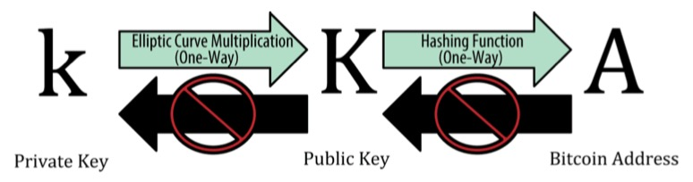
	
	私钥就是一串 256 位的数字，可以任意生成，比如用笔写出，或者投硬币来算。计算机方法可以通过一个密码安全的随机源中取出一个随机长字符串，再对其进行 sha256 计算，这样就可以产生 256 位数字，如果运算结果小于 n-1( n 为 `n=1.158 * 10^77`),那么就得到一个私钥，否则再随机。
	
	- 使用核心客户端命令来创建密钥对 
		- 生成密钥对
			
				$ bitcoin-cli getnewaddress
			得到
				
				1J7mdg5rbQyUHENYdx39WVWK7fsLpEoXZy
		- 生成私钥

				$ bitcoin-cli dumpprivkey 1J7mdg5rbQyUHENYdx39WVWK7fsLpEoXZy
			得到

				KxFC1jmwwCoACiCAWZ3eXa96mBM6tb3TYzGmf6YwgdGWZgawvrtJ
	- 使用 `bitcoin explorer` 命令行工具生成和显示私钥

			$ bx seed | bx ec-new | bx ec-to-wif

			5J3mBbAH58CpQ3Y5RNJpUKPE62SQ5t fcvU2JpbnkeyhfsYB1Jcn
	- 通过私钥创建公钥
	
		比特币使用 `secp256k1` 生成公钥，生成方法 `{K = k * G}`，,因为比特币所有者均使用 `secp256k1` ，G 点均相同，所以只要有相同的私钥即可计算出相同的公钥。所以不能将密钥泄露。
		
		- k 是私钥
		- G 是生成点
		- 曲线上得的 K 就是公钥
	- 比特币地址
		- 一般的地址代表一对公钥和私钥的所有者，那么地址由数字和字母组成，`1J7mdg5rbQyUHENYdx39WVWK7fsLpEoXZy`  开头总是`1` 
		
			通过公钥生成比特币地址时，算法是由 `SHA256`和 `RIPEMD160` 组成，算法如下
			
				A=RIPEMD160(SHA256(K))
				
				A 是地址
				K 是公钥
			常见的地址还经过 `Base58Check` 编码， 它使用了 58 个字符效验码，提高了可读性、避免了歧义并有效防止了在地址转录和输入产生的错误。
			
			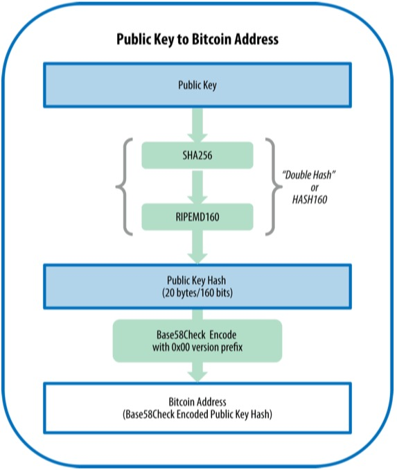	
		- 也可以代表其他东西，如 `P2SH(Pay-to-Script-Hash)`
- 密钥格式

	密钥对使用不同格式的编码，会不同，但本质没有改变。
	
	- 私钥

		私钥常见的有3种格式 hex、wif、wif-compressed，不同格式使用场景不同，如十六进制和二进制在软件内部使用，用户很少看见。WIF 格式是钱包之间的密钥输入和输出数据格式，也用于代表私钥的二维码或者条形码。
		
		
		
		- 格式描述
			
			格式|前缀|描述
			---|---|---
			Raw|None|32字节
			Hex|None| 16 进制描述
			WIF|5|Base58Check 编码，前缀+128+32bit 检查组成
			WIF-compressed(压缩)|K or L|在编码后增加后缀 0x01 
		- 对应格式
		
			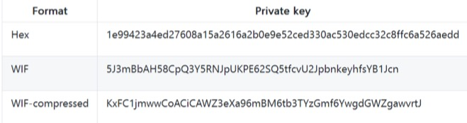
		
			可以使用 `Bitcoin Explorer` 命令行在格式间转换 
			
			- Hex2WIF

					$ bx wif-to-ec 5J3mBbAH58CpQ3Y5RNJpUKPE62SQ5tfcvU2JpbnkeyhfsYB1Jcn
					1e99423a4ed27608a15a2616a2b0e9e52ced 330ac530edcc32c8ffc6a526aedd
			- WIF-compressed2Hex

					$ bx wif-to-ec KxFC1jmwwCoACiCAWZ3eXa96mBM6tb3TYzGmf6YwgdGWZgawvrtJ
					1e99423a4ed27608a15a2616a2b0e9e52ced330ac530edcc32c8ffc6a526aedd
- 从 Base58Check 解码

	使用 `Bitcoin Explorer` 命令行可以处理比特币密钥、地址和交易
	
	- 私钥
		- 使用 base58check-decode 命令解码未压缩的密码 
			
				$ bx base58check-decode 5J3mBbAH58CpQ3Y5RNJpUKPE62SQ5tfcvU2JpbnkeyhfsYB1Jcn
		
				wrapper{
					checksum 4286807748  #校验和
					payload 1e99423a4ed27608a15a2616a2b0e9e52ced330ac530edcc32c8ffc6a526aedd #有效负载
					version 128 #前缀 128
				}
		- 注意压缩密钥的有效负载后缀增加了 01 ，表示导出的公钥要压缩
	
				$ bx base58check-decode
			
				KxFC1jmwwCoACiCAWZ3eXa96mBM6tb3TYzGmf6YwgdGWZgawvrtJ
				
				wrapper {
					checksum 2339607926
					payload 1e99423a4ed27608a15a2616a2b0e9e52ced330ac530edcc32c8ffc6a526aedd01
					version 128
				}
		- 将16进制私钥转换为 Base58Check 编码，注意 WIF 版本前缀是 128
	
				bx base58check-encode 1e99423a4ed27608a15a2616a2b0e9e52ced330ac530edcc32c8ffc6a526aedd --version 128
				5J3mBbAH58CpQ3Y5RNJpUKPE62SQ5tfcvU2JpbnkeyhfsYB1Jcn
		- 将16进制(压缩格式密钥)转换为 base58Check 编码，需要在密钥后增加后缀01表明是压缩密钥
	
				$ bx base58check-encode 1e99423a4ed27608a15a2616a2b0e9e52ced330ac530edcc32c8ffc6a526aedd01 --version 128 # hex 编码为01 后缀
				KxFC1jmwwCoACiCAWZ3eXa96mBM6tb3TYzGmf6YwgdGWZgawvrtJ  # 注意压缩私钥格式为 K 开头
				
		整理格式
		
		格式|私钥
		---|---
		hex|1e99423a4ed27608a15a2616a2b0e9e52ced330ac530edcc32c8ffc6a526aedd
		wif|5J3mBbAH58CpQ3Y5RNJpUKPE62SQ5tfcvU2JpbnkeyhfsYB1Jcn
		hex-压缩|1e99423a4ed27608a15a2616a2b0e9e52ced330ac530edcc32c8ffc6a526aedd01
		wifi-压缩|KxFC1jmwwCoACiCAWZ3eXa96mBM6tb3TYzGmf6YwgdGWZgawvrtJ
		
	- 公钥

		公钥也分成多个格式，主要分非压缩和压缩，公钥在椭圆曲线上的一个点，由一对坐标 x,y 组成。通常表示为前缀 04 (非压缩)，紧接着2个 256 bit 数字，x和y。压缩用 02和03开头。
		
		注意虽然是相同私钥生成的公钥，压缩和非压缩双哈希后的结果是不同的。
		
		- 非压缩(前缀04)
			下面是私钥生成的公钥 x和y:
			
			- x=F028892BAD7ED57D2FB57BF33081D5CFCF6F9ED3D3D7F159C2E2FFF579DC341A
			- y=07CF33DA18BD734C600B96A72BBC4749D5141C90EC8AC328AE52DDFE2E505BDB
	
			下面是 520 bit数字(130个16进制数字)来表示，这个公钥用 04 前缀开头，紧接着是x以及y坐标，组成 `04+x+y`
			
				K=04F028892BAD7ED57D2FB57BF33081D5CFCF6F9ED3D3D7F159C2E2FFF579DC341A07CF33DA18BD734C600B96A72BBC4749D5141C90EC8AC328AE52DDFE2E505BDB
		- 压缩(前缀02或03)

			引入压缩公钥是为了减少比特币交易字节数，从而可以节省那些运行区块链节点的磁盘空间压力。大部分比特币交易包含了公钥，用于验证用户的凭据和支付。每个公钥 520 bit,每个区块几百个交易，每天就会写入大量数据。
			
			压缩方法是将椭圆曲线 x,y 坐标转换成数学公式，这样只需要保存 x ，然后用公式( `y2 mod p = (x3 + 7) mod p `)来求y，即可得到坐标。这种做法从理论上减少了1倍的数据。
			
			压缩前缀是02或03，需要两个不同的前缀原因是因为椭圆曲线加密的公式的左边是 y2 ，也就是 y 的解是来自一个平方根，结果值可能是正或负。所以区分y坐标很重要，前缀02为偶数，03为奇数。这样就确定了y值的正确性。
		
		 	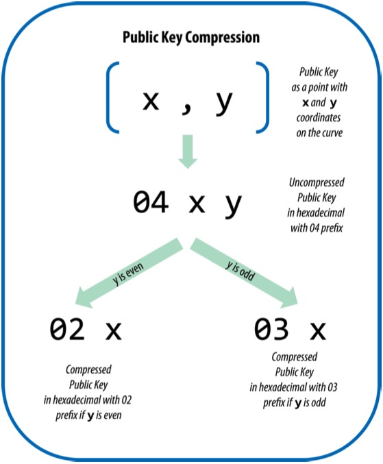
		 	
		 	未压缩的公钥是一个奇数，所以用03表示，压缩完后数据为 66个16进制数字

				K=03F028892BAD7ED57D2FB57BF33081D5CFCF6F9ED3D3D7F159C2E2FFF579DC341A
				
### 用 python 实现密钥和比特币地址	
- 使用 pybitcointools 生成和显示不同格式的密钥和比特币地址

	代码在 `code/key-to-address-ecc-example.py`
	
		$ python key-to-address-ecc-example.py
	
		Private Key (hex) is:
			3aba4162c7251c891207b747840551a71939b0de081f85c4e44cf7c13e41daa6
		Private Key (decimal) is:
			26563230048437957592232553826663696440606756685920117476832299673293013768870
		Private Key (WIF) is:
			5JG9hT3beGTJuUAmCQEmNaxAuMacCTfXuw1R3FCXig23RQHMr4K
		Private Key Compressed (hex) is:
			3aba4162c7251c891207b747840551a71939b0de081f85c4e44cf7c13e41daa601
		Private Key (WIF -Compressed) is:
			KyBsPXxTuVD82av65KZkrGrWi5qLMah5SdNq6uftawDbgKa2wv6S
		Public Key (x,y) coordinates is:
			(41637322786646325214887832269588396900663353932545912953362782457239403430124L,16388935128781238405526710466724741593761085120864331449066658622400339362166L)
		Public Key (hex) is:
			045c0de3b9c8ab18dd04e3511243ec2952002dbfadc864b9628910169d9b9b00ec243bcefdd4347074d44bd7356d6a53c495737dd96295e2a9374bf5f02ebfc176
		Compressed Public Key (hex) is:
			025c0de3b9c8ab18dd04e3511243ec2952002dbfadc864b9628910169d9b9b00 ec
		Bitcoin Address (b58check) is:
			1thMirt546nngXqyPEz532S8fLwbozud8
		Compressed Bitcoin Address (b58check) is:
			14cxpo3MBCYYWCgF74SWTdcmxipnGUsPw3
- Python ECDSA 库来做椭圆曲线计算

	代码在 `code/ec-math.py`
	
	- Install Python P IP package manager
		
			$ sudo apt-get install python-pip
	- Install the Python ECDSA library
		
			$ sudo pip install ecdsa
	- Run the script

			$ python ec-math.py

			Secret:
				38090835015954358862481132628887443905906204995912378278060168703580660294000 
			EC point:
				(70048853531867179489857750497606966272382583471322935454624595540007269312627,105262206478686743191060800263479589329920209527285803935736021686045542353380)
			BTC public key:
				029ade3effb0a67d5c8609850d797366af428f4a0d5194cb221d807770a1522873

### 高级密钥和地址
高级密钥和地址包括：加密私钥、脚本、多重签名地址、靓号、纸钱包

- 加密私钥(BIP0038)

	私钥必须保证机密性，但又和实用性相互矛盾。备份机密性更难，通过加密私钥的钱包可能要好一点，但也要备份那个钱包。用户因为升级或者重装软件需要等需要把密钥从一个导入另外一个。私钥备份也可能需要存储在纸上或其他存储。
	
	BIP0038 提出了一个通用标准，使用一个口令加密私钥并使用 Base58Check 对加密私钥进行编码，这样私钥就可以安全的保存在备份设备里，安全的相互转移。加密使用了 AES。
	
	方案方法
	
	- 输入一个比特币私钥
	- 通过 wif 编码，base58chek 字符串前缀为5
	- 需要一个长密码作为口令，通常使用多个单子和字母组成
	- 加密结果的私钥前缀为 6P

	如果前缀是6P 开头的私钥，就意味着被加密过，并需要一个支持口令的钱包来解码才能使用。
	
	通常使用 BIP0038 加密的密钥是用来做纸钱包的，将备份的加密密钥打印到一张纸上。只要用户选择强口令，使用 BIP0038 协议加密就安全无比。
- P2SH(Pay-to-Script Hash) 和多重签名地址

	前缀字母3开头的比特币地址是个 P2SH 地址，这个称为多重签名，指交易多名受益人为哈希脚本，而不是公钥所有者。这个特性在 2012年 BIP0016 引入，当出现前缀为3的地址时，需要的不仅是一个公钥哈希和一个私钥签名。在创建地址时，要求会被指定在脚本中，所有对地址的输入都会被这些要求阻隔。
	
	一个 P2SH 地址从交易脚本中创建，被定义谁能消耗这个交易输出，编码一个 P2SH 地址涉及使用一个在创建比特币地址用到过的双重哈希，应用在脚本而不是公钥
	
		script hash = RIPEMD160(SHA256(script))	
	产生脚本的哈希编码前为5前缀，编码后得到3前缀地址。一个 P2SH 地址是 `3F6i6kwkevjR7AsAd4te2YB2zZyASEm1HM`，使用 Bitcoin Explorer 命令脚本编码获得，比如 sha256,ripemd160,base58check-encode,例
	
		$ echo dup hash160 [ 89abcdefabbaabbaabbaabbaabbaabbaabbaabba ] equalverify checksig > script
		
		$ bx script-encode < script | bx sha256 | bx ripemd160 | bx base58check -encode --version 5
		3F6i6kwkevjR7AsAd4te2YB2zZyASEm1HM	
	- 多重地址

		目前，最常见的P2SH就是多重地址，底层脚本需要多个签名来证明所有权，此后才能消费资金。设计多重签名特性是需要总共 n 个密钥种，需要 M 个签名，也被称为阈值，被称为 M-N 多签名，其中 M 是等于或小于 N。
		
		- 例1，联合账户消费

			交易使用多重签名，一个是交易者，一个是交易者的同伴。已确保其中一方可以签署消费一笔锁定到这个地址的输出。类似传统银行种的一个联合账户。其中任何一方都可以单独消费这个账户。
		- 例2，复合验证消费
			
			也可以是至少几个账户同时签署，才能支付消费
- 靓号

	比特币地址包含人类可读信息，如下面的Base-58地址中有 love。这种号码对于宣传来说有一定作用，比如捐款。
	
		1LoveBPzzD72PUXLzCkYAtGFYmK5vYNR33
	
	- 生成

		比特币地址是由 Base58 从数字中生成的，可以把 `1Kids` 当成前缀字母，已 `1kid` 开头的地址范围中，大约有58的29次方地址，范围
		
		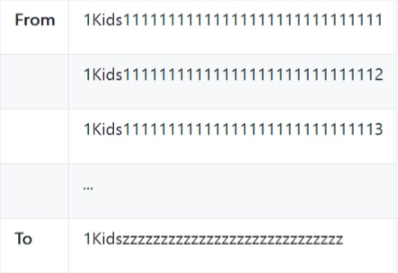
		
		
		`1kid` 可以看作比特币地址中这个前缀出现的概率。如果用普通电脑靠 cpu 计算每秒可以搜索10w个密钥的能力计算下表是计算需要的时间。
		
		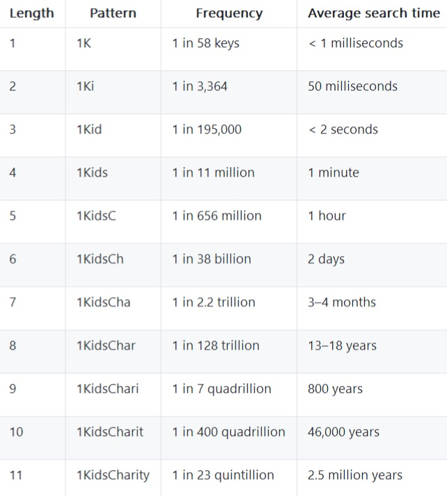		
		
		通过 GPU 可以优化速度几个数量级，所以可以通过帮人寻找靓号来赚比特币。通过 GPU ，7位的靓号地址可以几个小时即可找到。
		
		- 寻找靓号过程
		
			尝试随机密钥，检查生成地址是否符合所需要的字符串，然后重复这个过程，知道找到为止，这个过程称作挖靓号，可以使用 `libbitcoin` 库来执行,需要 C 编译器链接 libbitcoin 库进行编译，可以不带参数直接执行 `vanity-miner`,就会自动寻找 `1kid` 开头靓号地址，注意这里使用的例子是 `std::random_device` 类似 uninx 操作系统的 `/dev/urandom` 。这里用于演示，不适合生产级密钥，不够安全。	代码位置： 
			
				code/vanity -miner.cpp
	- Compile the code with g++ 
	
			$ g++ -o vanity-miner vanity-miner.cpp
			$(pkg-config --cflags --libs libbitcoin)
	- Run the example

			$ ./vanity-miner

			Found vanity address! 1KiDzkG4MxmovZryZRj8tK81oQRhbZ46YT Secret:
			57cc268a05f83a23ac9d930bc8565bac4e277055f47 94cbd1a39e5e71c038f3f
	- Run it again for a different result

			$ ./vanity-miner
	
			Found vanity address! 1Kidxr3wsmMzzouwXibKfwTYs5Pau8TUFn Secret:
			7f65bbbbe6d8caae74a0c6a0d2d7b5c6663d71b60337299a1a2cf34c04b2a623
	- 统计运行时间

			$ time ./vanity -miner Found vanity address!
	
			1KidPWhKgGRQWD5PP5TAnGfDyfWp5yceXM Secret:			2a802e7a53d8aa237cd059377b616d2bfcfa4b0140bc85fa008f2d3d4b225349
			real 0m8.868s user 0m8.828s sys 0m0.035s
- 靓号的安全性

	靓号地址既可以增加安全性，也可以降低安全新，是双刃剑。
	
	- 增加安全性
		- 可以生成一个独特的地址，对手难以使用他们的地址代替这个地址以欺骗客户付款
		- 因为靓号的部分字段是可读的，所以如果靓号的可读字段越多，被替换的肯能性也就越少，因为攻击花费的努力是数学可论，如果花钱找矿池申请一个靓号，那么对于攻击者来说，攻击可能承担不起，因为单次攻击收益可能无法回报支出。
	- 降低安全性
		- 虽然对手无法创建出一个一样的地址，但可以创造一个类似的号码来欺骗客户付款
		- 使用单一地址的另一个坏处是，黑客可以黑进你的支付地址修改成自己的来取代你的支付地址。而使用随机地址的时候，普通用户可能只检查头几个字符,比如 `1j7mdg`
- 纸钱包

	纸钱包打印在纸上的比特币私钥，为了方便，可能还包括对应的比特币地址，大不是必须的，因为地址可以从私钥导出。纸钱包是一个非常有效的建立备份和线下存储比特币的方式。可以提供额外的安全性
	
	- 防止物理设备，如硬盘损坏、丢失、意外删除等情况
	- 因为纸钱包永远不上线，所以可以防止黑客攻击在线设备获取密钥

	纸钱包私钥和公钥打印基本都会打印到一张纸上，形式可以多种，但差不多，如例 `bitaddress.org` 的客户端使用 javascript 生成。这个页面包含所有必须代码，生成的时候为了保证安全性，可以在完全断网的情况下使用。
	
	- 生成未加密纸钱包步骤
		- 登陆 bitaddress.org
		- 下载 html 页面保存在本地磁盘或者u盘
		- 将磁盘或者u盘转移到断开互联网的设备中
		- 游览器打开生成
		- 在通过本地打印机打印出来
		- 将纸钱包放置在防火保险柜内保存
		- 在线交易的时候填写对应地址
	- 加密纸钱包

		未加密纸钱包依然可能会被盗， BIP0038 加密的私钥。纸钱包的私钥被通过 AES 口令加密过了，没有口令将无法获取数据。在纸钱包的安全性上增加了一层。
		
	如果提取金额的话，建议一次性的提取所有金额，为了防止联网电脑被污染，或者密钥泄露。一次性取走所有额度比较安全。如果金额小，可以把剩余金额转移到新地址中。
	
	- 纸钱包生成地址
		- bitcoinpaperwallet.com
		- bitaddress.org
	- 形式
		- 折叠方式
		- 多个副本

## 钱包
钱包在比特币中有多种含义，

- 广义上

	钱包是一个应用，为用户提供交互界面。钱包功能包括

	- 控制用户访问权限
	- 管理密钥和地址
	- 跟踪余额
	- 创建和签名交易
- 狭义上

	钱包是用于存储和管理用户密钥的数据结构。私钥的容器一般是通过结构化文件或简单数据库来实现。

### 钱包概念
钱包只包含一个或者多个密钥，而比特币是存在于区块链的总帐本的网络中，用户通过钱包的密钥来签名交易进行使用。有两种主要的钱包类型

- 非确定性钱包(nondeterministic wallet)

	每个密钥都是从随机数独立生成的。密钥彼此无关。也被称为 just a bunch of keys 一堆密钥，简称 JBOK 钱包。最早的一些如 `Bitcoin Core` 比特币客户端中的钱包是随机生成的私钥合集。
	
	这种情况直接与避免地址重复使用的原则相冲突(每个比特币地址只能使用一次),地址重复使用将多个交易和地址关联在一起，这样会导致隐私暴露的可能性增高。
	
	避免使用重复地址时，这种类型的钱包并不是一个很好的选择，核心开发者也不鼓励大家使用。
	
	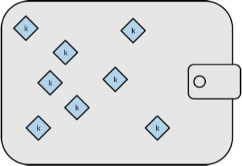
		
	- 问题

		它们难以管理、备份、导入，随机密钥的缺点是如果生成很多密钥，那必须保存所有副本，意味着钱包必须经常备份每一个密钥。
- 确定性(种子钱包)钱包(deterministic wallet)

	每个密钥都是从一个主密钥派生出来的，这个主密钥即为种子(seed) ，它是通过单项离散函数生成的(BIP0032/BIP0044)，种子是一个随机数该类型钱包中所有密钥都相互关联，使用种子可以再次生成出全部密钥。确定性钱包中使用了许多不同的密钥派生方法。最常用的派生方法是树状结构，称为分级确定性钱包或 HD 钱包。
	
	种子被编码成英文单词，也称为助记词。初始创建一个简单备份就足以搞定，并且也足够让钱包导入或者导出。解决了非确定性钱包问题。
	
	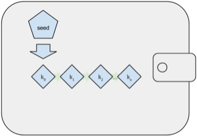
	
	- 分层确定性钱包 (HD Wallets(BIP0032/BIP0044))
	
		分层确定性钱包(HD)是确定性钱包的高级形式，确定性钱包被开发成更容易从单个 `种子` 中生成许多密钥。HD 钱包包含以树状结构衍生的密钥，使得父密钥可以衍生一系列子密钥，每个子密钥又可以衍生出一系列孙密钥，以此类推，无限衍生。
		
		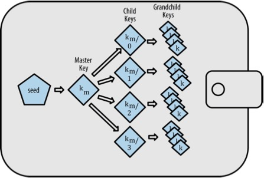	
		
		对比非确定性钱包的优势
		
		- 树状结构可以用来表达额外的组织含义。比如一个特定的分支的子密钥用来接收交易，而另一个分支子密钥用来支付交易。不同的分支密钥可以被不同的组织中使用，比如(公司、家庭、部门)。
		- 它允许使用者建立一个公共密钥的序列，而不需要访问对应的私钥。这允许 HD 钱包在不安全的服务器中使用或在每笔交易中使用不同的比特币地址。公钥不需要提前加载或提前生成，这样就不需要可用来支付的密钥。
- 种子和助记词(BIP-39)

	HD 钱包具有管理多个密钥和地址强大的机制。由一系列英文单词生成种子是个标准化的方法，这样易于在钱包中转移、导入、导出。这些英文单词被称为助记词，标准由 BIP-39 定义，今天大部分钱包均使用此标准，并可以使用可相互操作的助记词导入和导出种子进行备份和恢复。
	
	- 16 进制表示的种子

			0C1E24E5917779D297E14D45F14E1A1A
	- 助记词

			army van defense carry jealous true garbage claim echo media make crunch
- 最佳实践

	钱包技术已经成熟，出现了行业标准，使得比特币钱包具有广泛互操作，易于使用，安全和灵活的特性。这些标准为
	
	- 助记词 BIP-39
	- HD 钱包 BIP-32		
	- 多用途 HD 钱包结构 BIP-43
	- 多币种和多账户钱包 BIP-44

	这些标准可能改变也可能过时，但它们形成了一套互锁技术，这些技术已经成为了事实钱包标准。
- 使用钱包
 
 	用户使用 Trezor 比特币硬件钱包来安全的管理他的比特币。 Trezor 是一个简单的 USB 设备，具有两个按钮，用于存储密钥和签署交易。它遵循行业所有标准，因此它并不依赖于任意专用技术和单一供应商解决方案。
 	
 	
 	
 	初始化阶段，钱包在屏幕上按顺序逐个显示助记词,用笔记录下这些助记词，方便在损坏的时候用于恢复。它兼容任意一种使用助记词的硬件或者软件钱包，(注意单词序列很重要,需要记录每个单词空格分割，也可以用编号记录)。助记词有12个单词，也有24个单词。
 	
 	
 
###  钱包的技术细节
- 助记词(BIP-39)

	助记词是英文单词序列代表,用于种子对应确定性钱包的随机数。单词的序列足以创建种子，并且从种子那里重新创造钱包以及所有私钥。首次创建钱包时，带有助记词，运行确定性钱包的应用会向使用者展示一个 12-24个单词顺序。这些单词和顺序就是种子，记录下来就是备份。备份可以用来在新的支持助记词的硬软钱包恢复密钥。相比随机数，助记词更容易使用。
	
	和"脑钱包"不同，助记词钱包是随机生成的单词，而脑钱包是用户选择的词组，随机更加安全。助记的方案有两种，并且相互不兼容，BIP-39 标准由 Trezor 硬件钱包公司提出，现在已经被广泛使用，变成了事实标准。
	
- 创建助记词(1-6步)

	助记词使用 BIP-39 中定义的标准自动生成的，钱包从墒开始，增加校验和，然后将商英社到单词列表
	
	1. 创建一个128-256位的随机序列(墒)
	2. 提出 sha256 哈希前几位(墒长/32，如果128就是4位，如果是256就是8位)，就可以创造一个随机序列和校验和
	3. 将校验和添加到随机序列的末尾
	4. 将序列划分为包含 11 位的不同部分
	5. 将每个部分值与一个预先定义的 2048 个单词的字典做对应
	6. 生成有序的单词组，就是助记词

	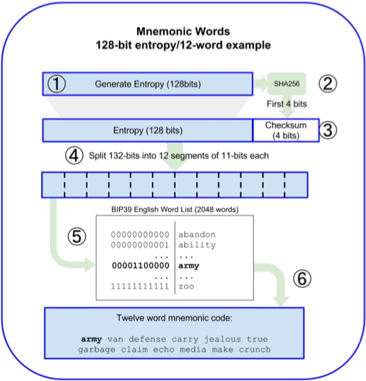
	
	墒数据大小和助记词的长度之间的关系
	
	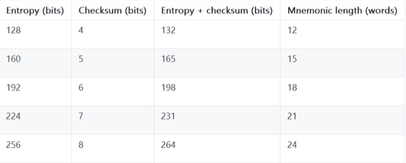
- 从助记词生成种子	
 	
	助记词长度为 128 -256 位的墒，通过使用密钥延伸函数 PBKDF2(Password-Based Key Derivation Function 2)，墒被用于导出较长的 512 位的种子。将所得的种子用于构建确定性钱包并得到其密钥。
	
	密钥延伸函数的两个参数
	
	- 助记词
	- 盐
		- 目的1，是用于暴力破解混淆增加难度
		- 目的2，在 BIP-39 标准中，允许引入密码短语(passphrase) 作为保护种子的附加安全因素
	- PBKDF2

		基本原理是通过一个为随机函数(例如 HMAC 函数)，把明文和盐值作为输入参数，然后重复进行运算最终产生密钥。 比特币里循环 2048次
- 创建助记词之后(7-9)
	7. PBKDF2 密钥延伸函数的第一个参数是从创建助记词的步骤获得助记词
	8. PBKDF2 密钥延伸函数的第二个参数是盐。
		- 由字符串常数"助记词"加(可选)的用户提供的密码字符串组合
		- BIP-39 中允许在推导种子时选择密码短语，如果不选，将只保留"助记词(mnemonic)"常量来代替参数。注意每一个密码短语都会产生不相同的种子，暴力破解的可能性为零。
		- 密码短语带来了2个重要功能
			- 有密码短语的助记词需要配合使用，可以把密码短语指向小额资金，分散攻击者的注意力。
			- 如果忘记助记词，会导致种子生成失败，导致讲永远无法找到对应的种子和丢失所有存在里面的比特币，所以需要备份 
	9. PBKDF2 使用 HMAC-SHA512 算法，使用 2048 次哈希运算来延伸助记词和盐的参数，产生一个512位的值作为最终输出。这个512位的值就是种子。
		- 2048 次哈希运算是一种很好的保护方式，防止对助记词或者密码短语的暴力破解

	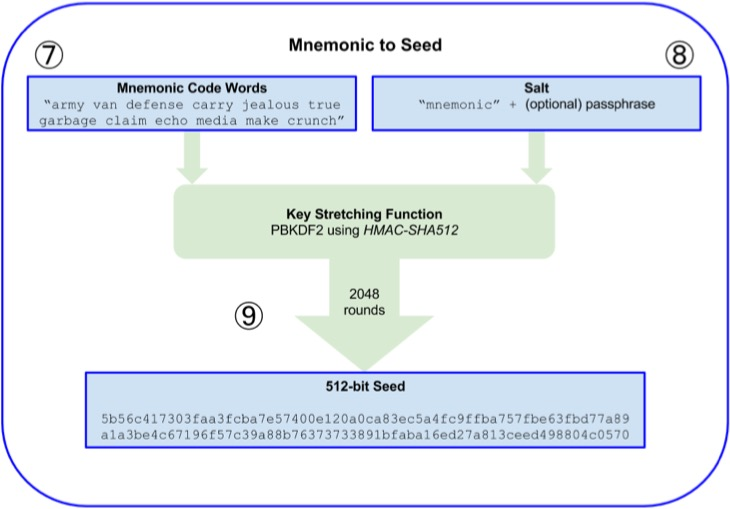 
	
	- 128 没有密码短语
	
		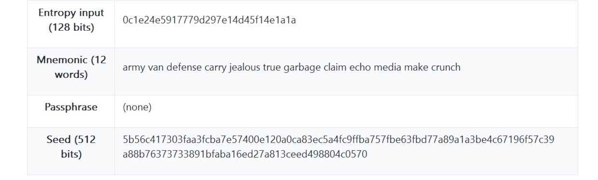
	- 128 有密码短语

		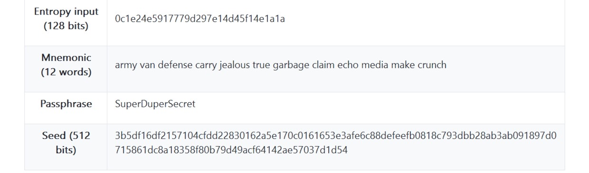
	- 256 没有密码短语

		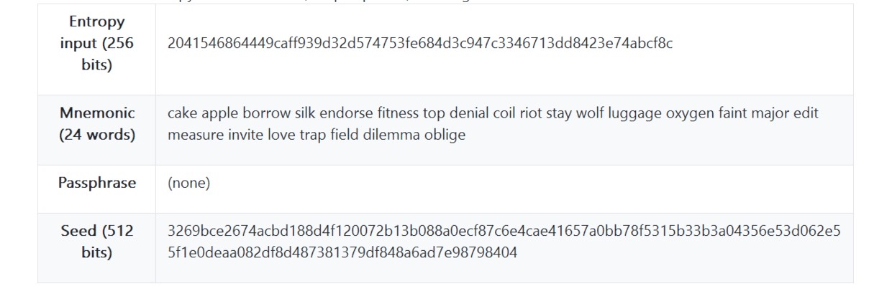
- 助记词代码
	
	BIP-39被做成函数库，支持多种编程语言 
	  
	- python  [python-mnemonic](https://github.com/trezor/python-mnemonic)
	- js [bitcoinjs/bip39](https://github.com/bitcoinjs/bip39)
	- c++ [libbitcoin/mnemonic](https://github.com/libbitcoin/libbitcoin/blob/master/src/wallet/mnemonic.cpp)
	- [网页离线版本](https://iancoleman.io/bip39/)

### 从种子中创造 HD 钱包
从单个种子(root seed) 中创建，为 128 到 256 位的随机数。最常见的是，这个种子是从助记词符产生的。所有确定性密钥都从这个根种子产生。任何兼容 HD 钱包的根种子也可以重新创建整个 HD 钱包。所以转移根种子就相当于转移了所有派生的密钥。

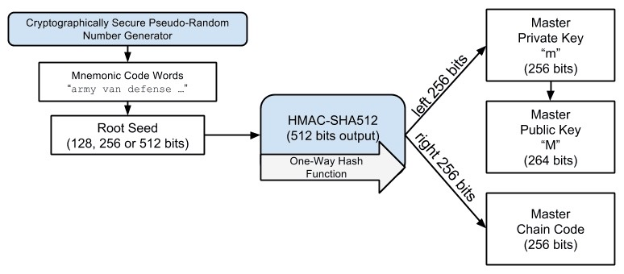

- 还原根种子步骤
	- 输入助记词和短语密码生成根种子
	- 根种子输入到 HMAC-SHA512 
		- 创建一个主私钥(m) ，HMAC-SHA512 结果的前 256 bit
		- 主链代码哈希，HMAC-SHA512 结果的后 256 bit 
	- 主密钥通过椭圆曲线生成相对的主公钥(M)
- 扩展密钥

	密钥延生函数可以被用来创建密钥树上的任何层级的子密钥，只需要3个输入:密钥、链码、索引。密钥以及链码这2个重要的部分被结合之后叫做扩展密钥(extended key),因为这种密钥用来衍生子密钥。
	
	扩展密钥可以理解为将256位密钥和256位链码所并联的512位序列。有两种密钥。扩展密钥通过 Base58Check 来编码，从而轻易的在不同的 BIP-32 兼容钱包之间导入导出。扩展密钥编码采用 Base58Check 加特殊前缀 `xprv` 和 `xpub` 来区分。(因为扩展密钥是 512 或者513位，所以它比之前看到的 Base58Check 编码串更长。)
	
	- 扩展私钥

		私钥结合链码，用来生成子私钥，扩展私钥可以建立一个完整的分支，
		
			Extended Private Key = Private Key + Chain Code, 标记为 xpriv，可用于派生子节点私钥和公钥
		例
			
			xprv9tyUQV64JT5qs3RSTJkXCWKMyUgoQp7F3hA1xzG6 ZGu6u6Q9VMNjGr67Lctvy5P8oyaYAL9CAWrUE9i6GoNMKUga5biW6Hx4tws2six3b9c
		
		
		
		比如常见应用于安装扩展公钥电商的网络服务器上，网络服务器可以使用这个公钥衍生函数给每一笔交易创造一个新的比特币地址。但为了被盗，网络服务商不会拥有任何私钥。如果没有 HD 钱包，唯一的方法就是在不同的安全服务器上创建成千上万的比特币地址，之后再上传到电商服务器上。这种方法比较繁琐而需要持续维护，防止公钥被用光。
	- 扩展公钥

		公钥以及链码组成，用来扩展子公钥。而扩展公钥只能创建一个公钥分支

			Extended Public Key = Public Key + Chain Code, 标记为 xpub，只能用于派生出子节点公钥
		例
		
			xpub67xpozcx8pe95XVuZLHXZeG6XWXHpGq6Qv5cmNfi7cS5mtjJ2tgypeQbBs2UAR6KECeeMVKZBPLrtJunSDMstweyLXhRgPxdp14sk9tJPW9

		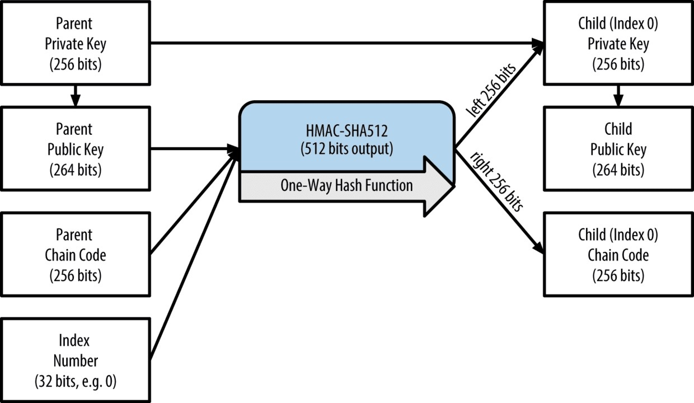

		比如常见应用就是冷或者硬钱包。在这种情况下，扩展的私钥可以被储存在纸质钱包中或硬钱包中，于此同时，扩展公钥可以在线保存。使用者可以根据意愿创造接收地址，而私钥将被线下保存。为了支付资金，使用者可以使用扩展私钥离线签署比特币客户或者通过硬件钱包设备签署交易。
				
### 子私密钥推导

- 介绍

	分层确定性钱包使用 CKD-child key derivation 函数从父密钥(parent keys)推导出子密钥(child keys)。子密钥延生函数是基于HMAC-SHA512(单项哈希函数)
	
	-  父密钥 (没有压缩过的椭圆曲线推导的私钥或公钥 ECDSA uncompressed key)
	-  链码(256bit) 的种子
		
		用来增加过程引入随机性，
		
		- 使索引不能充分延生其他子密钥。让有子密钥的人不能发现其他子密钥，除非有了链码。最初链码种子在密码输的根部，用随机数据构成，后来发展成从父链中衍生
		- 还有就是不能直接获取到父公钥，这样增加了隐私性。
	-  索引号(32bit)
		
		从0开始的索引号，每层子密钥可以创建2的31次方(2,147,483,647) 个子密钥。
- 生成过程
	- 根据父私钥使用椭圆算法导出公钥
	- 将父公钥匙和父链码以及子索引号组合出一个字符串
	- 输入到 HMAC-SHA512 得到512bit
	- 第一层子链的密钥(前256bit)和代码哈希(后256bit)
	- 再用第一层子链的私钥生成第一层子链的公钥

私有子密钥不能从非确定性密钥中区分出来，因为延生函数的单向性，除了 HD 钱包外，对于外部是不可见的。子密钥生成公钥地址来进行交易。

- 子密钥不能用来发现它们的父密钥。
- 子密钥也不能用来发现它们相同级别的密钥，
		
### 子公密钥推导
这种方式可以用来创造一个非常保密的只有公钥的方案。服务器或应用程序可以在没有私钥的情况下也可以扩展公钥的副本。这种方案可以创造出无限数量的公钥而没有消费权。而只有保存扩展私钥的服务器和软件才可以衍生出所有对应的可交易的私钥。
	
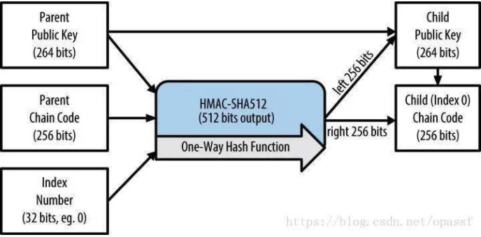

与子私钥推导区别，虽然依旧是使用父公钥推导，但

- 子私钥推导过程中私钥替换为公钥
- 子公钥推导出对应出与之的子链码
	
使用自动生成子公钥用例

- 使用单一地址
	- 服务者 A 使用硬件钱包创建了一个单一地址放到自己的网站上
	- 因为所有订单均使用这个单一地址支付，导致匹配订单和交易相当困难
- 使用多地址
	- 服务者A 使用硬件钱包创建了一个扩展公钥(xpub)，硬件钱包永远不会导出私钥
	- 将扩展公钥导入他的项目，对接钱包软件使用的是 Mycelium Gear 
	- Mycelium Gear 将为每一个订单生成一个唯一的地址 

### 硬化子密钥延生
扩展公钥衍生一个分支公钥的能力，但会有一些风险，访问扩展公钥并不能得到子密钥的途径。但因为扩展公钥包含链码，所以如果有子私钥被知道或泄露的话，父链码就可以被用来衍生所有其他子私钥，更糟糕的是，子私钥与父链码可以用来推断父私钥。

为了应对这种风险，HD 钱包使用一种叫做硬化衍生的代替衍生函数。打破了父公钥以及子链码之间的关系。硬化衍生函数使用了父私钥去推导子链码，而不是父公钥。这就创建了一个防火墙，

与一般衍生子私钥相同，不同的是使用的父私钥而非公钥。

所以要想保住便利性，又想增加安全性，就需要从强化父私钥衍生的公钥来衍生子公钥。这样可以防止推断出主密钥。
### 索引号
在衍生函数中索引号吗是32位的整数，为了区分密钥从正常的衍生函数还是强化衍生函数产生，这个索引被分为两个范围

- 正常范围
	- 0到2的31次方-1 
	- 小于2的31次方
	- 常规子密钥描述为0
- 强化范围
	- 2的31次方到2的32次方之间用于强化衍生	
	- 大于等于2的31次方
	- 强化描述为 0'

### HD钱包密钥标识符	 
HD钱包明明使用路径

- 每个级别之间用斜杠 `/` 字符来表示	
- 由主私钥衍生出的私钥用 `m` 打头，第一个子私钥 `m/0`,第一个子私钥的子钥 `m/0/1`
- 由主公钥衍生的公钥用 `M` 打头，第一个子公钥 `M/0`

密钥祖先从右向左读，直到到达衍生的主密钥。如  

-  子密钥m/x/y/z 是 m/y/z 的第 z 个子密钥
- 而子密钥 m/x/y 是 m/x 的第 y 个子密钥	

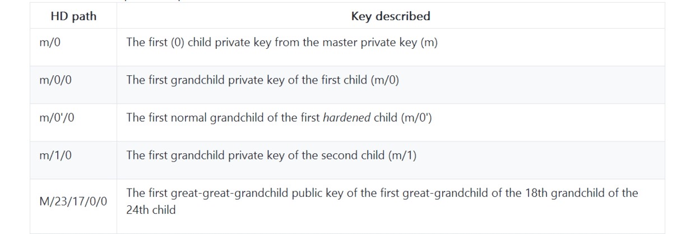

### HD 钱包树状结构导航
树状结构提供了强大的灵活性，每一层的一个父扩展密钥都有 40亿个子密钥，其中 20亿常规子密钥和20亿个强化子密钥。这样可以无穷尽，但对导航变的异常困难。尤其是在不同的钱包之间的转移交易。

两个 BIP 建议提供了这个复杂问题的解决方案

- BIP-43 

	提出使用第一个强化索引作为特殊的标识符号，表示树状结构的 `purpose`。使用此方案，钱包使用且只用第一层级的树分支，而且索引号去识别结构并且有命名空间来定义剩余的树的目的地。如只使用 `m/i'/` 为了表明那个被索引号`i`定义的特殊为目的地
- BIP-44 延长了43的规范，提议了多个账户结构作为 `purpose` ，只使用树的第一个分支要求被定义为 : `m/44/`,并包含了5个预定义树状层级结构

	`m / purpose' / coin_type' / account' / change / address_index`
	
	- 第一层 purpose 总被设定为 44'
	- 第二层 coin_type 被指定币种，目前定义3种
		- Bitcoin is m/44'/0'
		- Bitcoin Testnet is m/44'/1'
		- Litecoin is m/44'/2'
	- 第三层是 account,允许使用者为组织目的细分钱包独立的逻辑账户，每个账户都有自己的亚树根，如
		- `m/44'/0'/0'`
		- `m/44'/0'/1'` 
	- 第四层就是 change,包含2个树，无论先前层是否强化，这层使用常规生成，为了使用公钥生成公钥
		- 用来接收地址
		- 一个用来创建找零地址 
	- 第五层就是 address_index

		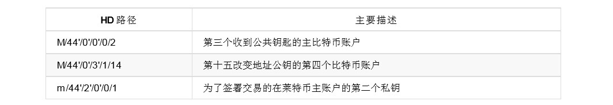  

## 交易
交易系统是比特币最重要的部分，根据系统设计原理，系统中任何其他部分都是为了确保比特币交易可被生成、在网络中可传播、任何点可验证，最终加入到网络总帐中。

交易本质就是数据结构，这些数据结构含有比特币交易参与者价值转移的相关信息。全球一本总账，每笔交易都是比特币区块链上的一个公开记录。
### 交易细节
使用 Btc 游览器查看交易，游览器中显示了从支付者的地址转移到接收者地址的交易。这里看到的是一个非常简化的交易。大部分内容均由游览器应用构建，实际上并不在交易中。

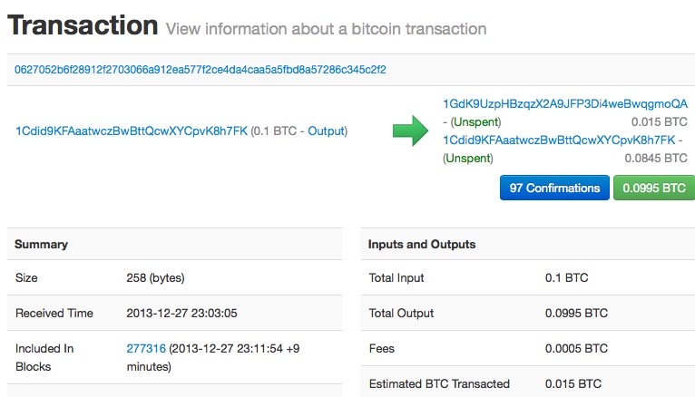		

- 背后细节

	实际的交易与游览器提供的交易非常不同，在比特币应用中看到的大多数高级结构并不存在于比特币网络中。可以通过 `bitcoin core` 的命令界面(`getrawtransaction` 和 `decodeawtransaction`) 来检索原始交易，并对其解码:
	
		{
		    "version":1,
		    "locktime":0,
		    "vin":[
		        {
		            "txid":"7957a35fe64f80d234d76d83a2a8f1a0d8149a41d81de548f0a65a8a999f6f18",
		            "vout":0,
		            "scriptSig":"3045022100884d142d86652a3f47ba4746ec719bbfbd040a570b1deccbb6498c75c4ae24cb02204b9f039ff08df09cbe9f6addac960298cad530a863ea8f53982c09db8f6e3813 [ALL]
		            0484ecc0d46f1918b30928fa0e4ed99f16a0fb4fde0735e7ade8416ab9fe423cc5412336376789d172787ec3457eee41c04f4938de5cc17b4a10fa336a8d752adf",
		            "sequence":4294967295
		        }
		    ],
		    "vout":[
		        {
		            "value":0.015,
		            "scriptPubKey":"OP_DUP OP_HASH160 ab68025513c3dbd2f7b92a94e0581f5d50f654e7 OP_EQUALVERIFY OP_CHECKSIG"
		        },
		        {
		            "value":0.0845,
		            "scriptPubKey":"OP_DUP OP_HASH160 7f9b1a7fb68d60c536c2fd8aeaa53a8f3cc025a8 OP_EQUALVERIFY OP_CHECKSIG"
		        }
		    ]
		}

### 交易输入输出
 交易中的基础构建单元是交易输出，不可分割的基本组合，记录在区块上，并被网络整体识别为有效。比特币完整节点跟踪所有可找到的和可使用的输出，称为 "未花费的交易输出"(unspent tracsaction outputs),即 UTXO。所有 UTXO 的集合被称为 UTXO 集，目前有数百万的 UTXO。当新的 UTXO 被创建， UTXO 集就变大，而 UTXO 被消耗， UTXO 集就变小。每一个交易都代表 UTXO 集变化，状态转换。
 
钱包可以检测可用的 UTXO ，通过钱包控制密钥签名，就可以将 UTXO 消费，钱包余额是指用户钱包中可用过的 UTXO 总和，这些分散在数百个交易和区块中。"一个用户的比特币余额" 概念是比特币钱包应用派生的，钱包通过扫描区块链并汇聚所有数据该用户的 UTXO 来计算用户余额。而大多数钱包维护了一个数据库或者使用数据库服务来存储所有 UTXO 的索引。

一个 UTXO 可以是1聪的任意倍数，就像美元可以被分割成两位小数的分一样，比特币可以被分割成八位小数的聪。尽管 UTXO 可以是任意值，但一旦被创造出来，即不可分割。这是 UTXO 值得被强调的一个重要特性: 

	UTXO 面值为聪的离散且不可分割的价值单元，一个 UTXO 只能在一次交易中被作为一个整体被消耗。如果一个 UTXO 比一笔交易所需量大，仍会被当作一个整体消耗，多出来的部分会产生零头。比如有20个比特币的 UTXO 想支付一个 BTC ,那么就要消耗这20个 UTXO ，并产生两笔输出，一个支付了1比特币给接收方，另一个支付了19个零头给消费方设置的地址，注意这里可以是相同地址，也可以是不同。
实际生活中比特币钱包或者应用会使用一些策略来满足支付需求，

- 组合若干小额 UTXO 并算出准确的找零。
- 使用大额 UTXO 然后找零

所有这些 UTXO 组合集合，都由用户钱包自动完成，并不为用户所见。只有当使用编程方式用 UTXO 来构建原始交易才与这些有关。通过消耗和创建新的 UTXO 的方式，比特币在不同的所有者之间转移，并在交易链中消耗和创建。一笔交易通过使用者的签名来解锁 UTXO ,并通过使用新的所有者地址来锁定并创建 UTXO。

有一个例外，一种特殊的交易“币基交易”(Coinbase Transaction)，它是每个区块中的第一笔交易，这种交易存储的是对挖矿的奖励，创造出全新的可花费比特币用来支付给挖到的矿工。

- 交易输出

	每一笔交易都会创造出输出，并被总账记录，除特例之外(“数据输出操作符” OP_RETURU)，几乎所有输出都能创造出一定数量的可用支付的比特币，也就是 UTXO，这些 UTXO 在 UTXO 集(UTXOset)中被每一全节点客户端追踪。交易输出包含两个部分
	
	- 一定量的比特币，面值为聪，最小的比特币单位
	- 确定花费输出所需要的条件,加密难题(cryptographic puzzle

	这个加密难题也被称为
	
	- 锁定脚本(locking script)
	- 见证脚本(witness script)
	- 脚本公钥(scriptPubKey)

	从上面的例子中，找到识别输出，json 编码为 vout 的数组，交易包含2个输出，每个输出都有一个值和一个加密难题来定义。
	
		"vout":[
			        {
			            "value":0.015, #在这里(bitcoine core)该值为 bitcoin 为单位。而交易本身会被记录为聪的整数单位。
			            "scriptPubKey":"OP_DUP OP_HASH160 ab68025513c3dbd2f7b92a94e0581f5d50f654e7 OP_EQUALVERIFY OP_CHECKSIG" #这部分就是加密难题，在这里(bitcoine core) 显示为 scriptPubKey,并展示了一个可读脚本。后面讨论。
			        },
			        {
			            "value":0.0845,
			            "scriptPubKey":"OP_DUP OP_HASH160 7f9b1a7fb68d60c536c2fd8aeaa53a8f3cc025a8 OP_EQUALVERIFY OP_CHECKSIG"
			        }
			    ]
	- 交易序列化-输出
	
		当交易通过网络传输或在应用程序之间交换时，他们被称为序列化。序列化是将内部的数据结构表示转换为可以一次性发送字节的过程。序列化最常用的编码通过传输或用于文件中存储的数据结构。交易输出的序列化格式如下
		
		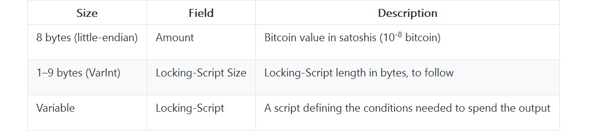
		
		大多数比特币函数库和架构不会在内部将交易存储为字节留，因为每次需奥访问单个字段时，都需要复杂的解析。为了方便可读性，函数库将交易内部存储在数据结构中。
		
		- 从交易的字节流转换为函数库的内部数据结构表示的过程称为反序列化或交易解析
		- 从函数库的数据结构转换回字节流通过网络传输、哈希化或存储在磁盘上的过程被称为序列化
	
		从序列化的十六进制形式手动解码交易，包含两个输出部分
		
		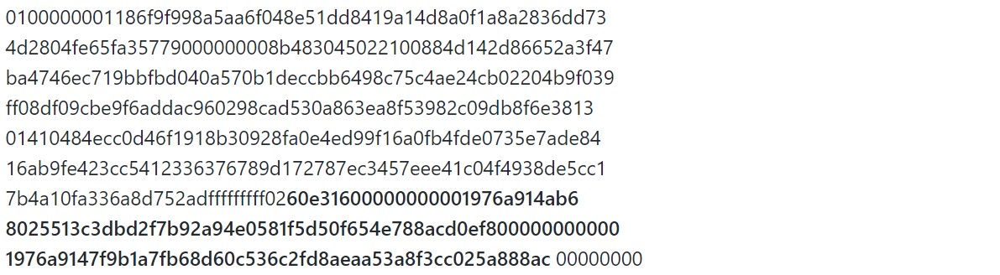
		
		解析内容包括
		
		- 加粗部分包括两个输出，每个部分都进行了序列化
		- 0.015 个比特币价值为 1,500,000 聪。十六进制为 `16 e3 60`
		- 串行交易中值 `16 e3 60` 以另外一种叫小端-little-endian(最低有效字节优先)字节顺序进行编码，所以看起来像 `60 e3 16`
		- scriptPubKey 的长度为 25 个字节，以16进制显示为 19 个字节
- 交易输入

	交易输入将  UTXO 通过引用标记为将被消费，并通过解锁脚本提供所有权证明。要构建一个交易，一个钱包从它控制的 UTXO 中选择足够的价值来执行付款。输入组件包括
	
	- 第一部分是一个指向 UTXO 的指针，通过指向 UTXO 被记录在区块链中所在的交易哈希和序列号来实现。
	- 第二部分是解锁脚本，大多情况下，解锁脚本是一个证明比特币所有权的数字签名和公钥，但并不是所有解锁脚本都包括签名。
	- 第三部分是序号

	从上面的例子中，找到识别输出，json 编码为 vin 的数组
	
		"vin":[
			        {
			            "txid":"7957a35fe64f80d234d76d83a2a8f1a0d8149a41d81de548f0a65a8a999f6f18", #一个交易 id，引用包含正在使用 UTXO 的交易
			            "vout":0, #一个输出索引(vout),用于标识来自交易的哪个 UTXO 被引用，索引从0开始。
			            "scriptSig":"3045022100884d142d86652a3f47ba4746ec719bbfbd040a570b1deccbb6498c75c4ae24cb02204b9f039ff08df09cbe9f6addac960298cad530a863ea8f53982c09db8f6e3813 [ALL]
			            0484ecc0d46f1918b30928fa0e4ed99f16a0fb4fde0735e7ade8416ab9fe423cc5412336376789d172787ec3457eee41c04f4938de5cc17b4a10fa336a8d752adf", # 一个 scriptSig(解锁脚本)，由钱包应用构建，检索引用的 UTXO 上的条件，在检查锁定脚本，最后构建解锁脚本
			            "sequence":4294967295 
			        }
			    ]
	上面的数据并没有给出交易支付总额的交易费，所以需要从 `txid` 和 `vout` 组成了需要引用 UTXO 在总账中记录的标记索引位置，比特币软件无论何时解析交易验证交易合法性，都必须先从总账中检索到引用的 UTXO，拿到数据。
	
	通过查询 `"txid":"7957a35fe64f80d234d76d83a2a8f1a0d8149a41d81de548f0a65a8a999f6f18"` 和 `"vout":0` 可以查询到以前的交易 UTXO
	
		"vout":[{
			"value": 0.10000000,
			"scriptPubKey": "OP_DUP OP_HASH160 7f9b1a7fb68d60c536c2fd8aeaa53a8f3cc025a8 OP_EQUALVERIFY OP_CHECKSIG" # 锁定脚本 scriptPubKey
			}]
	- 交易序列化-交易输入

		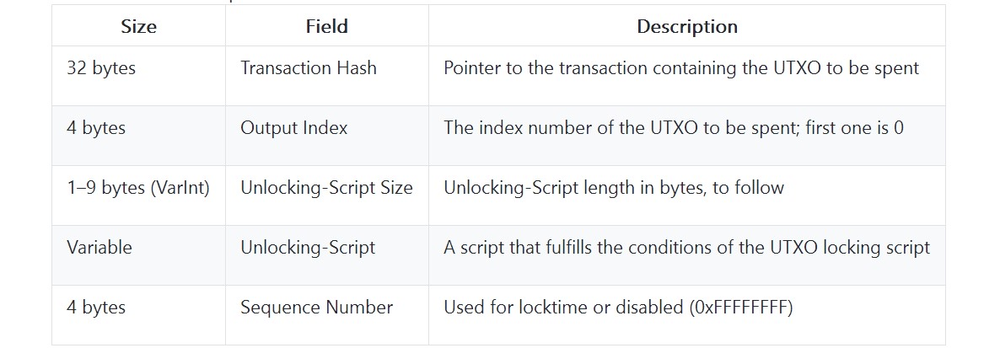
				
		将上面 json 编码输入 vin 数组序列化成十六进制字段
		
		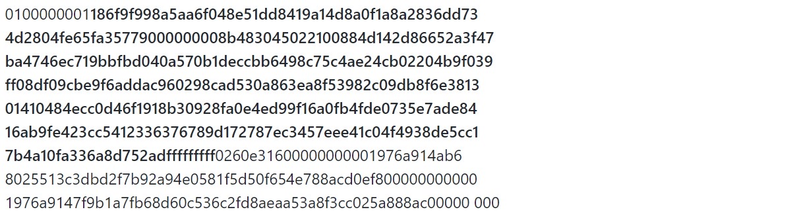
		
		- 交易 ID 反转字节顺序序列化，因此以实力进制 18开头，79 结尾
		- 输出索引为4字节组的 `0`,更容易识别
		-  scriptSig 的长度为 139 字节，十六进制为 8b
		-  序列号为 FFFFFFFF 也容易识别
- 交易费

	大部分交易都包含交易费(矿工小费)，使用经济机制来约束攻击者通过交易请求来洪水。并且奖励挖矿矿工。大多数钱包会自动计算交易费，但如果使用命令行或者编程方式，必须手动输入费用。
	
	交易费的计算是基于千字节来计算，而不是比特币交易的价值。总的来说，交易费根据总市场力量确定，矿工依据许多不同的标准对交易进行优先级排序，包括费用，在特定情况下也可能免费，但大多情况下，交易费影响处理优先级。交易费不是强制的，没有交易费最终也可能会被处理。
	
	交易费的计算方式起初是固定的(一个固定常数)，随着交易量的不断变化，从 2016 年开始，因为网络容量的限制，造成交易之间的竞争，从而导致更高的费用，免费彻底成为过去，很少的费用也很少被处理，有时根本不会在网络上传播。
	
	在 bitcoin core 中，费用传递政策由 `minrelaytxfee` 设置。默认的 `minrelaytxfee` 是每千字节 0.00001 比特币。默认情况下，费用低于 0.0001 比特币交易被认为是免费的，但只有在内存池有空间时次阿辉被转发，否则将被丢弃。全节点可以通过调节 `minrelaytxfee ` 值来覆盖默认的费用传输策略
	
	任何比特币服务都必须实现动态收费，动态收费也可以通过第三方费用估算服务或内置费用估算算法来实现。可以依赖第三方服务，也可以设计和部署自己的算法。估算费用算法范围从十分简单的,比如最后一个块平均值或中位数，到非常复杂的(统计分析)均有覆盖。估算费用单位以字节为单位，这使得交易具有很高的可能性被打包进一定数量的块内。大多数第三方服务为用户提供高、中、低优先级费用选择。
	
	比较流行的交易费评估服务如 [earn](https://bitcoinfees.earn.com/), 提供了 API 和可视化图表显示 byte 为单位不同的优先级费用。静态费用已经被彻底抛弃。普通的交易大约是 224-226 字节，因此单笔费用是 
	
		交易字节大小*区间比特币价格
	估算费用可以通过上面服务商提供的 [HTTP REST API](https://bitcoinfees.21.co/api/v1/fees/recommended) 获取，单位是 `聪/字节`
	
		curl https://bitcoinfees.earn.com/api/v1/fees/recommended
		{"fastestFee(最快确认)":102,"halfHourFee(半个小时确认)":102,"hourFee":88(一个小时确认)}
- 交易费加到交易中

	为了节省存储开销，交易的数据结构并没有交易费的字段，交易费是从输入和输出之间的差获取。交易费要精确计算，否则可能会转给矿工很大一笔奖励。注意如果每设置找零地址，也会被当作交易费来处理。
	
		交易费即输入总和 - 输出总和 = 交易费		
	如果交易中使用的都是零钱 UTXO ,那么就会包含大量的输入地址，这会导致交易会占用大量字节，可能会达到1kb或者几kb.交易费就随之上升。

### 比特币交易脚本和脚本语言
比特币交易脚本语言被称为脚本，是一种类似 Forth 的逆波兰表达式的基于堆栈的执行语言。在 UTXO 上的锁定脚本和解锁脚本都以此脚本语言编写。当一笔比特币被验证时，每一个输入值中的解锁脚本与其对应的锁定脚本并行执行，以确定这笔交易是否满足支付条件。该脚本是一个非常简单的语言，被设计为执行范围上是有限的，在硬件，比如嵌入式上执行也一样简单，它的轻量化用于验证可编程货币，是出于安全考虑。

大多数交易基于 P2PKH(pay-topublic-key-hash)脚本，但也可以编写用来表达更复杂的情况。

- 图灵非完备性

	脚本包含许多执行码，但都故意限制为一种重要的模式，除了有条件的流控制外，没有循环和复杂流控能力。这意味着脚本有限的复杂性和可预见的执行次数。脚本并不是通用语言，保证不会被创造无限循环或者其他逻辑炸弹，这样的炸弹可以植入交易，引起比特币网络拒绝服务攻击。受限的语言可以防止交易验证系统被漏洞利用。
- 去中心化验证

	脚本语言没有中心化主题，没有任何中心主题能凌驾于脚本之上，也没有脚本被执行后对其保存。所有执行脚本所需的信息均保存在脚本中。脚本在任何系统上用相同的方式执行。如果系统验证了一个脚本，可以确认每个比特币网络中的其他系统也验证这个脚本，这意味着一个有效的交易对每个人而言都是有效的。结果可预见性很重要的良心特征。

### 脚本构建(锁定与解锁)
比特币交易验证引擎依赖于两个脚本来验证比特交易

- 锁定脚本(locking script)

	一个放置在输出上面的花费条件，指定了花费这笔输出必须要满足条件。由于锁定脚本往往含有一个比特币地址，在历史上被称为脚本公钥(`scriptPubKey`)。而在文章中将被称为锁定脚本。
	
	- 见证脚本(`witness script`)

		是另一种锁定脚本，它是一个加密难题(`cryptographic puzzle`)
- 解锁脚本(ScriptSig)

	一个解决被锁定脚本在一个输出设定花费条件的脚本，它允许输出被消费。解锁脚本是一笔比特币交易输入的一部分，而且它基本会有一个用户的数字签名(由钱包生成)。因为这个特性，所以它也被称为 `ScriptSig`,还有一个名字被称为见证 `witness`。注意并非所有的解锁脚本都包含签名。
	
每个验证节点都会通过同时执行锁定和解锁脚本来验证一笔交易，

- 交易输入都包含一个解锁脚本，并引用之前存在的 UTXO。
- 交易软件将复制解锁脚本，检索输入所引用的 UTXO，并复制 UTXO 的锁定脚本。
- 依次执行解锁脚本和锁定脚本。 
- 如果解锁脚本满足锁定条件，则输入有效。
- 所有输入都是独立验证，作为交易总体验证的一部分。

UTXO 被永久的记录在区块链中，因此将不会改变，不会受到新交易引用失败的影响。只有满足输出条件的有效交易才能将输出视为开销来源，将该输出从未花费的交易输出集(UTXO set) 中删掉。

最常见类型的比特币交易(P2PKH 对公钥哈希的付款)的解锁和锁定脚本例子，显示脚本验证之前从解锁和锁定脚本的并置产生的组合脚本。

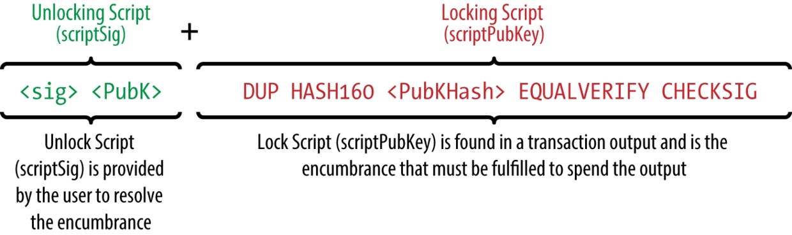

### 脚本执行堆栈
比特币脚本语言被称为堆栈语言，因为它使用一种被称为堆栈的数据结构。堆栈是一个非常简单的数据结构，可以被视为一堆卡片。允许两个操作

- push

	在堆栈顶部添加一个项目
- pop

	从堆栈中删除顶部的项目
	
堆栈是后进先出操作也被称为(LIFO)队列。脚本语言从左到右处理每个项目来执行脚本。数字(常量)被推倒堆栈上。

- 操作码

	从堆栈中推送或弹出一个或多个参数，对其进行操作，并可能将结果推送到堆栈上。例如，操作码 OP_ADD 将从堆栈中弹出两个项目，添加她们，并将结果的总和推送到堆栈上。
- 条件操作码(conditional operators)

	 对一个条件进行评估，产生一个 true or false 的布尔值。例如， OP_EQUAL 从堆栈中弹出两个项目，如果相等，推 true 数字为1，否则就是false 数字0。交易脚本通常包含操作条件码来产生有效交易结果。
- 一个简单的脚本
 
	执行简单的数学运算，演示算数加法操作码 `OP_ADD`,操作时把2个数相加，然后把结果推送到堆栈，后面条件操作符 `OP_EQUAL` ,验算之前的2个数之和是否等于5.
	
			2 3 OP_ADD 5 OP_EQUAL
	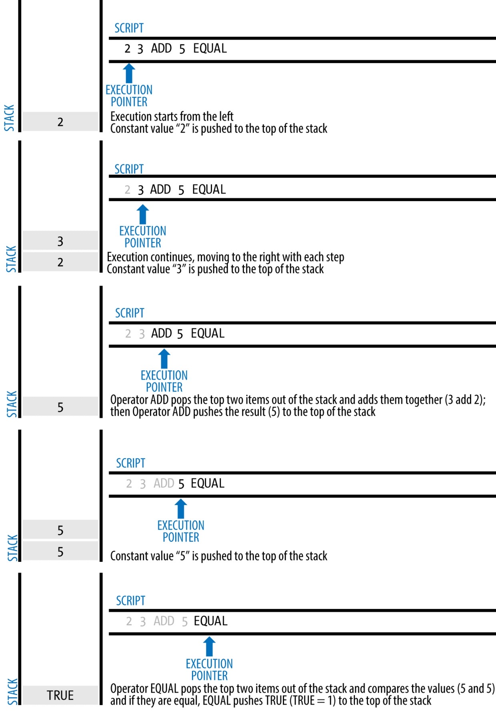
	
	大多数解锁脚本都指向一个公钥地址，想要使用资金则需要验证所有权，但脚本本身并不需要如此复杂，任何解锁和锁定脚本组合如果为真，则有效。
- 稍微复杂的脚本

	计算 2+7-3+1 ，当脚本在一行包含多个操作码的时候，堆栈允许一个操作码结果由下一个操作码执行
	
		2 7 OP_ADD 3 OP_SUB 1 OP_ADD 7 OP_EQUAL
- 解锁和锁定脚本的单独执行

	最初的比特币客户端，解锁和锁定以连锁的形式存在，并依次执行。出于安全考虑(因为存在允许异常解锁脚本推送数据入堆栈并入污染锁定脚本的漏洞)。2010 年，修改成两个脚本分别执行。

	- 首先堆栈执行解锁脚本。
	- 如果执行正常，则复制到主堆栈，再执行锁定脚本
		- 如果从解锁脚本复制而来的堆栈数据执行锁定脚本结果为 true，那么解锁脚本就成功的满足了锁定脚本所设置的条件。该输入是一个能使用该 UTXO 有效授权。
		- 如果执行为 false ，则输入都是无效的
- P2PKH(pay-to-public-key-hash)

	比特币网络处理大多数交易花费都是由 P2PKH 脚本锁定的输出，这些输出含有一个锁定脚本，将输入锁定为一个公钥哈希值(地址)。由 P2PKH 脚本锁定的输出可以通过提供一个公钥和由相应私钥创建的签名来解锁。(ECDSA数字签名)
	
	比如支付 0.015 个比特币指令，锁定脚本为
	
		OP_DUP OP_HASH160 <Cafe Public Key Hash> OP_EQUALVERIFY OP_CHECKSIG
	- Cafe Public Key Hash 为咖啡馆地址，注意这里公钥哈希都显示为16进制，而不是 Bases58Check 的1开头地址。
	
	上述锁定脚本相应的解锁脚本是
	
		<Cafe Signature> <Cafe Public Key>
	两个脚本结合起来可以形成如下组合验证脚本
	
		<Cafe Signature> <Cafe Public Key> OP_DUP OP_HASH160
		<Cafe Public Key Hash> OP_EQUALVERIFY OP_CHECKSIG
	当解锁脚本与锁定脚本设定条件相匹配，执行组合验证脚本才会通过。
		
	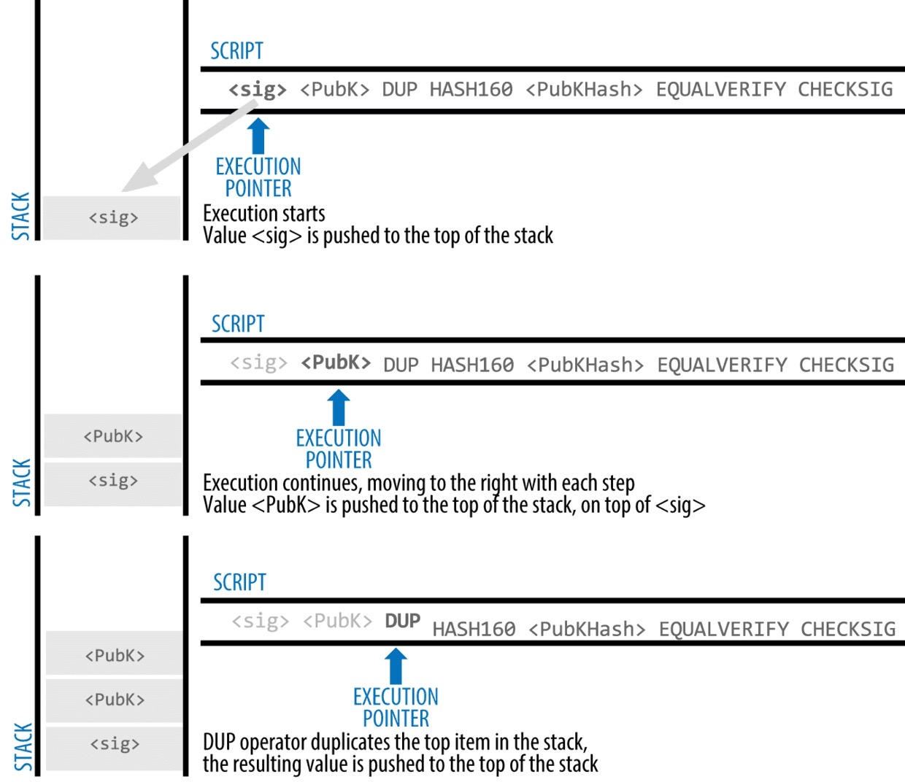
	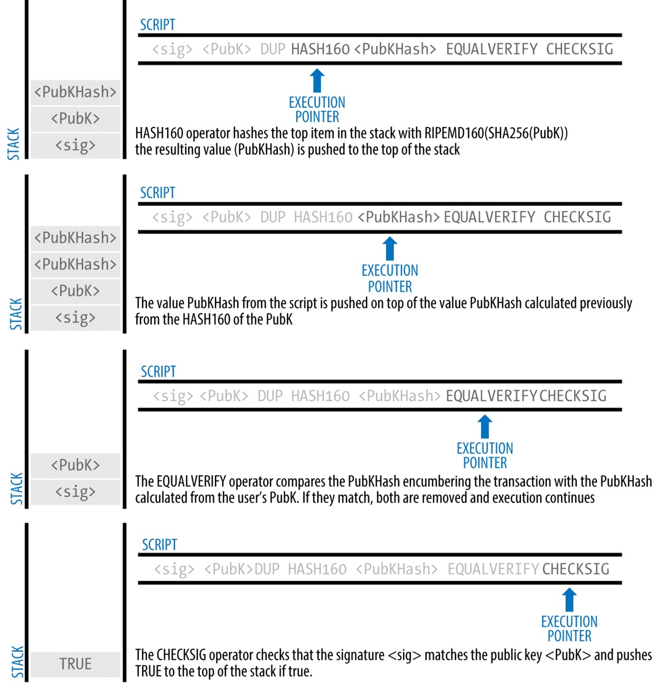
	
### 数字签名(ECDSA)
比特币使用的数字签名算法为 `Elliptic Curve Digital Signature Algorithm` 或为 ECDSA。基于椭圆曲线算法对密钥对的数字签名算法。 

ECDSA 用于脚本函数 

- OP_CHECKSIG
- OP_CHECKSIGVERIFY
- OP_CHECKMULTISIG
- OP_CHECKMULTISIGVERIFY

每当锁定脚本看到这些的解锁脚本必须包含一个 ECDSA 签名。数字签名在比特币中有三种用途

- 签名证明私钥所有者，授权消费资金
- 授权证明是不可否认的
- 签名证明交易，在签名后没有也不会被任何人修改

注意，每个交易输入都是独立签名，这一点至关重要，因为不管签名还是输入都不必由同一个所有者事实。实际上，一个名为 coinjoin 的特定交易方案就是用这个特性来创建多方交易保护隐私。

- 如何工作 	
	
	数字签名由两部分组成
	
	- 使用私有密钥从消息(交易)创建签名的算法
	- 给定消息和公钥的条件下，允许任何人验证签名的算法
- 创建签名

		((Sig = F{sig}(F{hash}(m), dA)))
	- dA 私钥
	- m是交易
	- F hash 是散列函数
	- F sig 是签名算法
		- 通常有2个参数组成，R和 S，它们就是序列化为字节流，使用称为分辨编码规则(Distinguished Encoding Rules) 或 DER 的国际标准编码方案
			
				Sig = (R, S)  
	- Sig 是签名结果			
- 签名序列化(DER)

	上面的例子，在交易输入中有一个解锁脚本，其中包含支付者签名的 DER 编码签名，证明授权，序列化格式包含9个元素
	
		3045022100884d142d86652a3f47ba4746ec719bbfbd040a570b1deccbb6498c75c4ae24cb02204b9f039ff08df09cbe9f6addac960298cad530a863ea8f53982c09db8f6e381301
	- 0x30 表示 DER 序列的开始
	- 0x45 序列长度(69字节)
	- 0x02 一个整数值
	- 0x21 整数长度 (33字节)
	- R 

			00884d142d86652a3f47ba4746ec719bbfbd040a570b1deccbb6498c75c4ae24cb
	- 0x02 接下来是一个整数
	- 0x20 整数长度(32字节)
	- S

			4b9f039ff08df09cbe9f6addac960298cad530a86 3ea8f53982c09db8f6e3813
	- 0x01 后缀说明使用的哈希类型是(SIGHASH_ALL) 
- 验证签名

	要验证签名必须有签名(R和S)、序列化交易和公钥。本质上签名意味着生成只有公钥的私钥所有者才能签名的交易。
	
	签名验证算法采用消息(交易或其他部分的哈希)、签名的公钥和签名(R和S值)，如果签名对该消息和公钥有效，则返回为真。
- 签名哈希类型(SIGHASH)

	在交易中，签名意味着私钥持有者对特定交易数据的承诺。但交易又分两种情况
	
	- 签名适用于整个交易，从承诺所有输入、输出和其他交易的字段
	- 在一个交易中一个签名只承诺一个数据子集或者签名还具有指示交易数据的那一个部分包含在使用 SIGHASH 标志的私钥签名的哈希方式。

	SIGHASH 是附加到签名的单个字节，每个签名都有一个 SIGHASH,该标志在不同输入之间也可以不同。3个签名输入的交易可以具有不同 SIGHASH，每个签名签署交易不同的部分。
	
	每个输入在解锁脚本中基本会包含一个签名。这样多个输入的交易可以拥有不同的 SIGHASH 标志的签名，这些标志在每个输入中承诺交易不同部分。许多参与者去签名一份交易，这个交易才有效。
	
	SIGHASH 有3个标志 `ALL,NONE,SINGLE`
	
	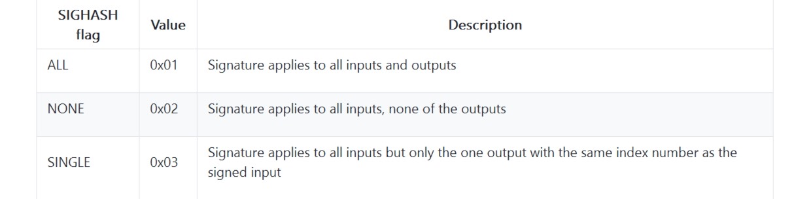
	
	还有一个修饰符 `SIGHASH_ANYONECANPAY`，与前面的标志组合。当设置该值时，只有一个输入被签名，其余的序列号打开以进行修改。 修饰符值为 0x80 通过按位 or 运算，得到如下组合
	
	 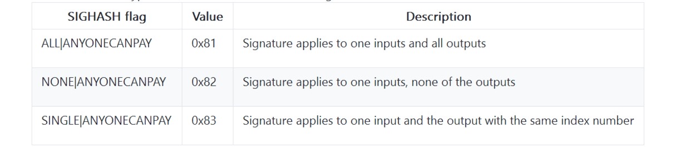
	
	SIGHASH 标志在签名和验证期间应用的方式是建立交易的副本和删节其中的某些字段(设置长度为0并清空)，继而生成交易被序列化，SIGHASH 标志被添加到序列化交易的结尾，并结果哈希化，得到值本身即是被签名的消息。基于 SIGHASH 标志的使用，交易的不同部分被删节。所得到的哈希值取决于交易中数据的不同子集。哈希化前，SIGHASH 类型本身在签名签附加到交易，签名也会对 SIGHASH 类型进行签名，因此不能更改。(所有 SIGHASH 类型对应交易 nLocktime 字段)
	
	- SIGHASH_ALL
	
		在 `签名序列化(DER)` 的例子中，DER 编码签名最后一部分是 0x01，这是 SIGHASH_ALL 标志。这会锁定交易数据，支付者签名承诺所有输入和输出状态。这个是最常见的一种签名类型
	- ALL|ANYONECANPAY

		这个构造用来做众筹交易，试图筹集资金的人可以用单笔输出来创建一个交易，没有输入交易显然无效，但是其他人通过使用 `ALL|ANYONECANPAY` 添加自己的输入来捐款修改，除非收集足够的输入达到输出的价值，否则交易持续无效。每一次捐款都是一项抵押，直到整个募捐目标数量完成，众筹发起人才能得到捐款。
	- NONE

		这个结构可以用来创建特定数量的不记名支票或者空白支票。它对输入进行了承诺，但是允许输出锁定脚本被更改。任何人都可以将自己的比特币地址写入输出脚本兑换交易。而输出值被签名锁定。
	- NONE | ANYONECANPAY

		这种结构可以创建一个`吸尘器`，一些钱包中拥有微小 UTXO 的用户无法花费这些费用，因为手续超过了这些微小的 UTXO 价值。借助这种签名，微小的 UTXO 可以捐赠给任何人，随时收集和消费。
		
	还有一些修改和扩展 SIGHASH 系统的建议，宗旨是创造一个更灵活的代替品，允许任意输入和输出矿工可改写位掩码，表示更复杂的合同预付款方案。例如分配资产中变更已经签名的报价。
	
	钱包基本使用 P2PKH 和 SIGHASH_ALL 标志进行签名，想使用其他方案，必须自己来构建和签署交易。
- ECDSA 数学

	签名算法首先生成一个临时私公钥对，射击签名私钥交易哈希的变换之后，该临时密钥对用于计算 R 和 S 值。
	
	临时密钥对基于随机数 k,做临时私钥。从 k 生成临时公钥 P,方法同比特币密钥对。数字签名 R 值则是临时公钥P 的 x* 坐标

	- 生成签名 S 值的方法
	
		
		
		- k 是临时私钥
		- R 是临时公钥的 x 坐标
		- m 是交易数据
		- p 是椭圆曲线的主要顺序		
	- 验证签名

		验证签名是生成函数的道术，使用 R,S值和公钥来计算一个值 P，该值是椭圆曲线上的一个点(临时公钥)
		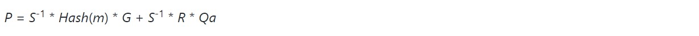
		
		- R 和 S是签名值
		- Qa 是支付者公钥
		- m 是签署的交易数据
		- G 是椭圆曲线发生器点

		如果计算 P 的 x 坐标等于 R,则验证结论为真。
- 随机性在签名中的重要性

	签名生成算法使用随机密钥 k 作为临时私钥-公钥对的基础。k的值只要随机。如果使用相同的k值在不同的消息上签署两个签名，那么签名私钥可以由任何人计算。签名算法中重复相同的 k 值会导致密钥泄露。
	
	重用 k 值的最常见原因是为正确初始化的随机数生成器。为了避免这个bug，业界最佳实践不是用墒播种的随机数生成器生成 k 值，而是使用交易数据本身播种的确定性随机进程。这确保每个交易产生的不同 k 值。
	
	随后在公布的 RFC 6979 中定义了 k 值的确定性初始化行业标准算法，如果自己实现一个用于签名交易的算法，必须使用 RFC 6979 或类似的随机算法来确保为每个交易生成不同的 k 值。

### 比特币地址余额和其他摘要
我没看到交易本身不包含比特币地址，而通过锁定地址和解锁地址离散值的脚本进行操作。这个系统中任何地方都不存在余额，而每个钱包应用都明白的显示余额。这个抽象概念是如何从原始的组成部分派生出来的。

	

- 支付者地址

	交易信息左侧为支付者地址，这个信息本身并不包含在交易中。它查询的是 UTXO 索引引导的旧交易中提取的第一个输出。该输出内是一个锁定脚本，将 UTXO 锁定到支付者的地址(P2PKH脚本)。游览器提取了该公钥，并使用 Base58Check 编码对其进行编码，生成左侧支付者地址。
- 收费者地址

	同样右侧游览器展示了2个输出地址，都是游览器通过每个输出中提取锁定脚本，将其识别为 P2PKH 脚本，并提取公钥地址，最后使用 Base58Check 编码对其进行编码生成
	
	- 第一个是收款者地址
	- 第二个是支付者找零地址，这个可能和支付者地址相同也可能不同
- 地址余额

	任意点击上面的比特币地址，比如点击了收款人地址
	
	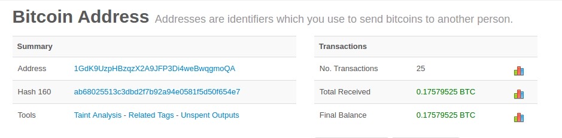
	
	游览器显示了余额，但比特币系统却没有余额这个概念。由游览器通过以下方法将余额构建出来
	
	- 首先解码Base58Check编码的比特币地址，得到检索编码 160 位的哈希值。
	- 然后在交易数据库查询使用公钥哈希 P2PKH 锁定脚本的输出
	- 通过总结所有输出值，游览器可以生产所有接收的总额，注意这里只是接收，不包含扣除
	- 然后搜索当前未被使用的输入保存为一个分离的数据库-UTXO集，为了维护这个集合，游览器程序必须跟踪比特币网络中新创建的 UTXO，并从未确认的交易中实时的删除。这是一个复杂的过程，不但要实时跟踪交易，还要同时保持与比特币网络共识，确保正确的链上。有的时候可能未保持同步，导致数据不完整。
	- 通过收集 UTXO 集，游览器总结了引用公钥未使用输出的值
	- 将这些值汇总就是最终余额

	生成余额，游览器可能需要索引并搜索数十到数十万交易。为了抽象更多底层细节，游览器和钱包开发者主要关注常见的交易类型，每个输入上具有 SIGHASH_ALL 的签名的 P2PKH。这样会导致程序易于阅读的方式呈现了所有 80% 以上的交易，但有时会无法处理偏离常规的交易，包括更复杂的锁定脚本和不同 SIGHASH 标志，或多个输入和输出的交易显示了这些抽象的简单性和弱点。每天都有数百不包含 P2PKH 输出的交易在块上被确认。这些游览器无法解码.		

## 高级交易和脚本
上面介绍了交易基本元素，和查看了最常见的交易脚本类型，即P2PKH脚本。这里将介绍更多复杂交易。
### 多重签名
多重签名脚本设置了一个条件，其中 N 个公钥被记录在脚本中，并且至少有 M 个必须提供签名来解锁资金。即 M-N 方案，其中 N 是公钥总数，M 是验证签名数量。该方案最多可以有15个公钥，未来可能更多。

比如 2/3 的多重签名是3个公钥被列为潜在签名，至少2个有效签名才能消费。

- 设置 M-N 多重签名条件的锁定脚本一般形式是 

		M <Public Key 1> <Public Key 2> ... <Public Key N> N CHECKMULTISIG
	- M 刷费输出所需要的签名数量
	- N 是列出公钥的总数
- 比如设置2到3多重签名条件的锁定脚本

		2 <Public Key A> <Public Key B> <Public Key C> 3 CHECKMULTISIG
- 解锁脚本

	上面的锁定脚本可以有含有足够签名和公钥的脚本解锁，以2/3为例，需要3个公钥和至少2个签名才可以解锁。解锁脚本类似于
	
		<Signature B> <Signature C> 2 <Public Key A> <Public Key B> <Public Key C> 3 CHECKMULTISIG
	- CHECKMULTISIG 执行中的bug		
	
		当 CHECKMULTISIG 执行时，它应该消耗堆栈上 M+N+2个项目作为参数，然而由于错误， CHECKMULTISIG 将弹出 pop 超出预期的额外值和一个值。如例
		
			<Signature B> <Signature C> 2 <Public Key A> <Public Key B> <Public Key C> 3 CHECKMULTISIG
		- 首先 CHECKMULTISIG 弹出最上面的项目，例为3
		- 然后弹出N个项目，例为 ABC公钥
		- 然后弹出一个项目 M，例为 2
		- 此时 CHECKMULTISIG 应该按照 M 弹出对应签名，并查看有效，但 CHECKMULTISIG 弹出一个项目(M+1).检查签名时，不考虑额外的项目，它对 CHECKMULTISIG 本身没有直接影响，但是，必须存在额外的值。因为如何不存在，则CHECKMULTISIG尝试弹出空堆栈时，导致错误。因为额外项目被忽略，它可以是任何东西，但通常是0.

			综上所述，正确的修改方式是增加0
			
				0 <Signature B> <Signature C> 2 <Public Key A> <Public Key B> <Public Key C> 3 CHECKMULTISIG

### P2SH(Pay-to-Script-Hash)
P2SH 在2012年被作为新型、强大、且能大大简化复杂交易脚本的交易类型引入。迪拜的一个电子产品进口商 Mohammed 采用比特币多重签名作为其公司会计帐本记录。多重签名脚本是比特币高级脚本最常见的运用之一，是一种相当强大影响力的脚本。针对所有的顾客支付(即应收账款)，公司要求采用多重签名交易。基于多重签名机制，顾客的任何支付都至少需要2个签名才能解锁，一个来自公司，另一个来自合作伙伴或者备份密钥的代理人。

多重密钥机制作为公司治理提供管控便利，同时也能有效防范盗窃、挪用和丢失。最终脚本非常长

	2 <Mohammed's Public Key> <Partner1 Public Key> <Partner2 Public Key><Partner3 Public Key> <Attorney Public Key> 5 OP_C HECKMULTISIG
多重签名十分强大，但在之前的版本下，使用非常不便利。此外由于脚本可能含有特别长的公钥，最终的交易脚本可能是最初脚本长度的5倍之多。额外长度造成了额外的费用。最后，一个长的交易脚本将一直记录在所有节点的随机存储器的 UTXO 集中，直到这笔资金被使用。采用这种复杂输出脚本变得非常困难。

P2SH 正式为了解决这些问题而引入的，宗旨是简单化。在 P2SH 制服中，复杂的锁定脚本被电子指纹所取代，电子指纹是密码学中的哈希值。

当一笔交易时图支付 UTXO 时，要解锁支付脚本，它必须含有与哈希值相匹配的脚本。 P2SH 含义是向该海西匹配的脚本支付，当输出被支付时，该脚本将在后续呈现。

锁定脚本由哈希运算的20字节的散列值取代，被称为赎回脚本。因为它在系统中是在赎回时出现而不是在锁定脚本模式出现。这样的做法相当于将复杂的计算工作从发送方转移到了收款方。

- 输出脚本

		2 Pubkey1 Pubkey2 Pubkey3 Pubkey4 Pubkey5 5 CHECKMULTISIG
	没有出现锁定脚本,但实际上很长一大串的(约520字节)进行哈希运算后的20字节的散列值取代，然后将之放到解锁脚本中。这使得给矿工的交易费用从发送方转移到收款方，并且令复杂的计算工作也从发送方转移到了收款方。
- 返回 Mohammed 公司的例子，复杂的多重签名和相应的 P2SH 脚本对比
	- 多重签名
	
			2 <Mohammed's Public Key> 5 CHECKMULTISIG
		实际如果占位符由真实的公钥代替，如下
		
			2 04C16B8698A9ABF84250A7C3EA7EEDEF9897D1C8C6ADF47F06CF73370D74DCCA01CDCA79DCC5C395D7EEC6984D83F1F50C900A24DD47F569FD4193AF5DE762C58704A2192968D8655D6A935BEAF2CA23E3FB87A3495E7AF308EDF08DAC3C1FCBFC2C75B4B0F4D0B1B70CD2423657738C0C2B1D5CE65C97D78D0E3 4224858008E8B49047E63248B75DB7379BE9CDA8CE5751D16485F431E46117B9D0C1837C9D5737812F393DA7D4420D7E1A9162F0279CFC10F1E8E8F3020DECDBC3C0DD389D99779650421D65CBD7149B255382ED7F78E946580657EE6FDA162A187543A9D85BAAA93A4AB3A8F044DADA618D087227440645ABE8A35DA8C5B73997AD343BE5C2AFD94A5043752580AFA1ECED3C68D446BCAB69AC0BA7DF50D56231BE0AABF1FDEEC78A6A45E394BA29A1EDF518C022DD618DA774D207D137AAB59E0B000EB7ED238F4D800 5 CHECKMULTISIG
	- P2SH

		整个脚本都可以由仅为 20 个字节的哈希值取代，采用 sha256 哈希算法，随后对其运用 RIPEMD160 算法。上面通过哈希压缩后的结果得到
		
			54c557e07dde5bb6cb791c7a540e0a4796f5e97
	 	一笔 P2SH 交易运用锁定脚本将输出与哈希关联，而不是与前面的长脚本关联，使用锁定脚本为
		
			HASH160 54c557e07dde5bb6cb791c7a540e0a4796f5e97e EQUAL
		这样顾客向公司支付时，只要在其支付指令中纳入这个非常简短的锁定脚本即可。当公司想要花费这笔 UTXO 时，附上原始赎回脚本(与 UTXO 锁定的哈希)和必要的解锁签名即可
		
			<Sig1> <Sig2> <2 PK1 PK2 PK3 PK4 PK5 5 CHECKMULTISIG>
		两个脚本经由两步实现组合
		
		- 首先将赎回脚本与锁定脚本对比以确认其与哈希是否匹配

				<2 PK1 PK2 PK3 PK4 PK5 5 CHECKMULTISIG> HASH160 <redeem scriptHash> EQUAL
		- 加匹配赎回脚本与哈希匹配成功，解锁脚本会执行释放赎回脚本

				<Sig1> <Sig2> 2 PK1 PK2 PK3 PK4 PK5 5 CHECKMULTISIG		
		注意接所有脚本只能用 P2SH 脚本实现，不能直接在 UTXO 锁定脚本中使用。			
- P2SH 地址

	P2SH 的一个重要特征是能将脚本哈希编译为一个地址(BIP0013/BIP-13)。P2SH 地址基于 Base58 编码是含有20个字节哈希的脚本很像比特币地址。但 P2SH 地址采用5作为开头，导致基于 Base58 的地址以3开头。例如 Mohammed 的脚本， P2SH 地址为 `39RF6JqABiHdYHkfChV6USGMe6Nsr66Gzw` ，客户可以使用钱包实现对这个地址像比特币地址一样简单支付。该地址与一个脚本对应而不是一个公钥，但效果一样。 P2SH 隐藏了所有复杂性，因此，运用其支付的人将不会看到脚本。
- P2SH 的优点

	直接使用复杂脚本以锁定输出的方式相比，P2SH 具有以下特点
	
	- 交易输出中，复杂脚本由简短的电子指纹取代，使得交易代码变短
	- 脚本能被编译为地址，支付只能的发出者和支付者的比特币钱包不需要复杂工序就可以执行 P2SH
	- 将构建脚本的重担转移到了接收方，而非发送方
	- 将长脚本数据存储的负担从输出方(存储 UTXO 集，影响内存)，转移到了输入方(存储的区块链里)
	- 将长脚本数据存储的重担从当前(支付时)转移到未来(花费时)
	- 将长脚本的交易费成本从发送方转移到接收方，接收方在使用该笔资金时必须含有赎回脚本
- 赎回脚本和标准确认

	在0.9.2 版本客户端前， P2SH 仅限于标准比特币交易脚本类型(即通过标准函数检验的脚本)。这意味着使用该笔资金的交易中赎回脚本只能是标准化的 P2PK、P2PKH 或多重签名，不支持 RETURN 和 P2SH。 0.9.2 版本 P2SH 交易能包含任意有效的脚本，这使得 P2SH 更灵活，也产生更多复杂交易类型。
	
	请注意，不能将 P2SH 植入 P2SH 赎回脚本，因为 P2SH 不能自循环，虽然技术上支持 RETURN 包含赎回脚本，但由于规则中没有策略阻止执行此操作，因此在检验期间执行 RETURN 将导致交易被标记为无效。因此，赎回脚本只有在试图发送一个 P2SH 输出是才会在比特币网络中出现，加入你将输出与一个无效的哈希锁定，该 UTXO 将会被成功锁定，但其中的资金将无法使用，因为赎回脚本指向的是无效的脚本，所以执行无效。这样的处理机制也衍生出一个风险，就是比特币锁定到了一个未来不能 被花费的 P2SH 中，因为网络本身接受支付无效地址，无论它是无效的比特币地址还是无效的 P2SH 地址。
	
	P2SH 锁定脚本包含一个赎回脚本哈希，该脚本对赎回脚本本身未提供任何描述。P2SH 交易即使在赎回脚本无效的情况下，也会被认为有效。如果处理不当，导致交易比特币无效化。
	
### 数据记录输出(RETURN 操作符)
比特币去中心化特点和时间戳机制，即区块链技术，其潜在运用大大超过支付领域。许多开发者试图充分发挥交易脚本语言安全性和可恢复性优势，将其运用于电子公证服务、证劵认证和智能合约等领域。早期开发者利用交易将记录数据放到区块链上的方法进行了很多尝试。例如，为文件记录电子指纹，则任何人都可以通过该机制在特定的日期建立关于文档存在的证明。

运用比特币的区块链技术存储和比特币支付不相关数据的做法是一个争议话题。

- 有些开发者认为这个是滥用

	那些反对非支付相关应用的开发者认为，这样做会引起区块链膨胀，消耗所有区块链节点磁盘空间为代价，负担存储数据的任务。更严重的是此类交易仅将比特币地址当作自由组合的20个字节使用，进而产生不能用于交易的 UTXO。因此比特币地址只是被当作数据使用，并不与私钥相匹配，导致 UTXO 不能用于交易，是一种伪交易的行为。因此，这些交易永远不会花费，所以永远不会从 UTXO 集中删除，导致 UTXO 数据库大小永远增加。
- 另一些开发者视为区块链技术强大功能的有力证明

	从而试图给予大力支持。那些反对非支付相关应用的开发者认为这样
	
在 0.9 版本客户端上，通过采用 Return 操作符最终实现了拖鞋。 Return 允许开发者在交易输出增加 80 字节的非交易数据。然后，与伪交易型 UTXO 不同，Return 创造了一种明确的可复查的非交易输出，此类数据无需存储在 UTXO 集。Return 输出被记录在区块链上，他们会消耗磁盘空间，也会导致区块链规模增加，但不会存储在 UTXO 集中，因此不会导致 UTXO 内存膨胀，更不会以消耗高昂的内存代价使全节点无法工作。Return 脚本样式

	RETURN <data>
` data` 部分被限制为 80 字节，并且以哈希方式呈现，如 32 字节的 SHA256 算法输出。许多应用都在其前面加上前缀以辅助认定。例如,电子公证服务的证明材料采用 8 个字节前缀 "DOCPROOF" ，在十六进制算法中，相应的 ASCII 码为 `44 4f 43 50 52 4f 4f 46`。请记住 Return 不涉及可用于支付的解锁脚本的特点，Return 不能使用其输出中锁定的资金，因此它也就没有必要记录在蕴含成本的 UTXO 集中，所以 RETURN 实际是没有成本的。

RETURN 常为一个金额0的比特币输出，因为任何与该输出相应的比特币都会消失。一笔 RETURN 作为一笔交易输入，脚本验证引擎将会阻止验证脚本执行，标记为交易无效。一个标准的交易(通过了isStandard 函数检查)，只能有一个 RETURN 输出。但是单个 RETURN 输出能与任意类型的输出交易进行组合。bitcoin core 新版中添加两个新命令。

- datacarrier

	控制 RETURN 交易中继和挖掘，默认设置为 1 允许
- datacarriersize 

	指定 RETURN 脚本的最大大小(字节单位)，默认为 83 字节，允许最多 80 个字节的 RETURN 数据加上一个字节的 RETURN 操作码和两个字节的 PUSHDATA 操作码

最初提出 RETURN 限制为 80 字节，但当功能发布时，容量减半。 2015年2月， BItcoin core 的 0.10 版本中，限制提高到设定的 80 字节。节点可选择不中继或重启 RETURN ,或者只能中继和挖矿包含少于 80 字节数据的 RETURN.	 
### 时间锁(Timelocks)
时间锁只允许在一段时间后才允许支出的交易,对后期交易和将资金锁定到将来日期很有用，时间锁还扩展了比特币的时间维度，为更复杂的多级智能合约打开了大门。比特币从一开始就有一个交易中的 nLocktime 字段实现的时间锁功能。 2015-16年推出了2个新时间锁功能，提供 UTXO 级别的时间锁定功能，这些 CHECKLOCKTIMEVERIFY 和 CHECKSEQUENCEVERIFY 

- 交易锁定时间(nLocktime)

	锁定时间也称为 nLocktime ，是来自 Bitcoin Coer 代码中使用的变量名。它等于一张延期支票。
	
	- 大多数交易中，将其设置为零，以指示即时传播和执行。
	- 如果 nLocktime 不为零，低于 5亿，则其解释为块高度或 Unix 纪元时间，意味着交易无效，并且指定的块高度或 Unix 纪元时间之前未被中继或者包含在块链中。
	- 如果超过5亿，则被解释为 Unix 纪元时间戳(1970-1-1 之后的秒数)，则交易在指定时间前无效。

	指定未来块或时间的 nLocktime 的交易必须由始发系统持有，并且只有在有效后才被发送到比特币网络。如果交易在指定的 nLocktime 之前传输到网络，那么第一个节点将会拒绝交易，并不会进行中继。
- 交易锁定时间限制

	nLocktime 就是一个限制，虽然它可以在将来花费，但时间没到前不行，比如支付者给接收者使用 nLocktime 设定为3个月。支付者将这笔交易发送给了接收者。
	
	- 3个月过去之前，收款者不能完成交易变现
	- 收款者可以在3个月后接受交易
	- 然而支付者创建了另一笔交易，使用相同的 UXTO 支付，并且没有锁定时间
	- 接收者无法保证在3个月后得到
- 检查锁定时间验证 Check Lock Time Verify(CLTV)

	2015年12月，引入了一种新的时间锁进行比特币软分叉升级。根据 BIP-65 中的规范，脚本语言添加了一个名为 CHECKLOCKTIMEVERIFY(CLTV) 的新脚本操作符。 CLTV 时每个输出的时间锁，而不是每个交易的时间锁，通过在输出的赎回脚本中添加 CLTV 操作码来限制输出，从而只能在指定的时间过后使用。
	
	- nLocktime 变是交易级时间锁
	- CLTV 是基于输出的时间锁 		 

	CLTV 不会取代 nLocktime,而是限制特定的 UTXO ,并通过将 nLocktime 设置为更大或相等值，从而达到未来才能花费这笔钱的目的。 CLTV 操作码采用一个参数作为输入，表示为与 nLocktime 相同高度或 Unix 纪元时间的格式数字。如果 VERIFY 后，CLTV 如果为 FALSE ,则停止执行脚本的操作码类型。如果为 TRUE ,则继续执行。
	
	为了使用 CLTV 锁定输出，将其插入到创建输出的交易中的赎回脚本中。例如刚才3个月的支付例子，通常会包含一个这样的 P2PKH 脚本
	
		DUP HASH160 <Bob's Public Key Hash> EQUALVERIFY CHECKSIG
	锁定时间3个月，交易将是一个 P2SH 交易，其中包含一个赎回脚本
	
		<now + 3 months> CHECKLOCKTIMEVERIFY DROP DUP HASH160 <Bob's Public Key Hash> EQUALVERIFY CHECKSIG
	其中是从交易开始被挖矿时间起计3个月的高度或时间值，当高度 12，960 或当 Unix 纪元时间 + 7，760，000 秒。当尝试花费这个 UTXO 时，构建了引用 UTXO 作为输入的交易。签名和公钥在该输入的解锁脚本，并将交易 nLocktime 设置为等于或大于 CHECKLOCKTIMEVERIFY 时间锁。那么比特币网络交易评估，如果接收者设置的 CHECKLOCKTIMEVERIFY 时间锁参数小于或等于交易 nLocktime,脚本将继续执行。否则将停止执行，并认为该交易无效。
	
	CHECKLOCKTIMEVERIFY 和 nLocktime 使用相同的格式描述时间锁，最重要的是一起使用时，nLocktime 的格式必须与输入中的 CLTV 相匹配，必须用秒作引用块高度或时间。因为接收者使用 CLTV 锁定了 UTXO 本身，支付者无法在这个期间内进行消费。在 BIP-65 定义了 CHECKLOCKTIMEVERIFY

### 相对时间锁	
nLocktime 和 CLTV 都是绝对时间，他们指定的绝对时间点。下面的2个时间功能全部是相对时间锁定。它消耗输出的条件指定为从区块链中的输出确认的启动时间。相对时间允许2个或多个相互依赖的交易链接在一起，同时对依赖于从先前交易的确认所经过的时间的一个交易施加时间约束。在 UTXO 被记录在块状态之前，时钟不计数。这个功能在双向状态通道和闪电网络中特别有用。

相对时间锁同绝对时间锁，同时具有交易功能和脚本操作码。

- 交易相对时间锁定的作为每个交易输入中设置交易字段 nSequence 的值的共识规则实现的。
- 脚本相对时间锁使用的是 CHECKSEQUENCEVERIFY (CSV) 操作码实现

相对时间锁是根据 BIP-68 与 BIP112 的规范共同实现的，

- BIP-68 通过与相对时间锁运用一致性增强的数字序列实现(nSequence)

	相对时间锁可以在每个输入中设置好，其方法是在每个输入中多加一个 nSequence 字段
	
	- nSequence 定义

		字段的设计初心是想让交易在内存中修改，可惜后面从未运用过，使用这个字段时，如果输入交易序列值小于 2的32次方，表示尚未确定的交易。这样的交易在内存中存储，直到被另一个交易消耗相同输入具有较大 nSequence 代替。一旦收到一个交易，其投入的 nSequence 值为 2的 32次方，那么它将被“最终确定”并开采。
		
		nSequence 的原始含义从未被正确实现，并且不利用时间锁的交易中， nSequence 的值通常设置为 2的32次方。对于具有 nLocktime 或者 CHECKLOCKTIMEVERIFY 的交易，nSequence 值必须设置为小于 2的32次方，以使时间锁定有效。通常设置为 2的 32次方减1
	- nSequence 作为一个共同执行的相对时间锁定

		由于 BIP-68 的激活，新的共识规则适用于任何包含 nSequence 值小于 2的31次方的输入交易(bit 1 << 31 is not set) 意味着如果没有设置最高有效为 (bit 1<< 31) ，这个表示了一个“相对锁时间"的标志。否则 nSequence 值被保留用于其他用途，例如启用 CHECKLOCKTIMEVERIFY ，nLocktime,Opt-In-Replace-By-Fee 以及其他新功能
		
		当一笔交易输入， nSequence 值小于 2的31次方时，就是相对时间锁定的输入交易。这种交易只有到了相对锁定时间后才生效。例如，具有30个区块的 nSequence 相对时间锁的一个输入的交易，只有在从输入中引用的 UTXO 开始时间起至少30个块时才有效。由于 nSequenc 是每个输入字段，因此交易可能包含任何数量的时间锁输入，所有这些都必须具有足够的时间以使交易有效。交易包括
		
		- 有时间锁输入 nSequence <2^31
		- 没有时间锁输入 nSequence> = 2^31
	
		nSequence 值为块或秒为单位指定，但与 nLocktime 中使用的格式略有不同。类型标志用于区分计数块和计数时间的值。类型标志设置在第 23 个最低有效位，即 1 << 22。
		
		- 如果设置了类型标志，则 nSequence 值将被解释为 512 秒的倍数。
		- 如果没设置类型标志，则 nSequence 值被解释为块数
		
		当 nSequence 解释为相对时间锁定时，只考虑 16 个最低有效位。一旦评估标志 32 和 23 ，nSequence 值通常用 16 位掩码 屏蔽，如 `nSequence ＆0x0000FFFF`
		 	 
		[BIP-68 的标准定义](https://github.com/bitcoin/bips/blob/master/bip-0068.mediawiki)，定义了 nSequence 值的一致执行的相对时间锁定
- [BIP-112](https://github.com/bitcoin/bips/blob/master/bip-0112.mediawiki) 运用到了 CHECKSEQUENCEVERIFY 这个操作码实现，带 CSV 的相对时间锁

	就像 CLTV 和 nLocktime 一样，有一个脚本操作码用于相对时间锁，它利用脚本中的 nSequence 值。该操作码时 CHECKSEQUENCEVERIFY (CSV)。在 UTXO 的赎回脚本中评估时，CSV 操作码仅允许在输入 nSequence 值大于或等于 CSV 参数的交易中进行消耗。实际上限制了 UTXO 消耗，直到 UTXO 开采时间过了一定数量的块或秒。
	
	CSV 中的值必须与相应 nSequence 值中的单位格式相匹配。如果 CSV 时根据块，那么 nSequence 也是，如果秒，后者也是。
	
	当几个链交易被保留为脱链时，创建和签名这几个(已经形成链)交易但不传播时，CSV 的相对时间锁特别有用。在父交易已经被传播，直到消耗完相对锁时间，才能使用子交易。这种用法在 state_channels 和 lightning_network 可以看到。
- 中位时间过去 Median-Time-Past [BIP-113](https://github.com/bitcoin/bips/blob/master/bip-0113.mediawiki)

	作为激活想多时间锁的一部分，时间锁(绝对和相对)的时间方式也发生了变化。在比特币中，墙上时间(walltime)和共识时间之间存在微妙但非常显著的差异。比特币是一个分散的网络，这意味着每个参与者都有自己的时间观。网络上的事件不会随时随地的发生。网络延迟也必须考虑到每个节点。最终所有内容都被同步，以常见一个共同的分账。比特币在过去存在的分类账状态中每10分钟打成一个新共识。
	
	区块头中设置的事件戳由矿工设定。共识规则允许一定的误差来解决分散节点之间的时钟精度问题。然而，这诱惑了矿工作弊，以便通过包括还不在范围内的事件交易来赚取额外矿工费。为了杜绝作弊和加强时间安全，在相对时间锁的基础上，又增加了一个 BIP。这是 BIP-113，它定义了一个称为 "中位时间过去" 的新共识测量机制。通过取得最后 11 个块的时间戳并计算其中位数作为“中位时间过去”的值，这个中间时间值就变成了共识时间，并被用于所有的时间计算。过去约2个小时的中间点，任何一个块时间戳的影响都减小了。通过这个方法，没有一个矿工可以利用时间戳来作弊。
	
	Median-Time-Past 更改了 nLocktime,CLTV,nSequence 和 CSV 的时间计算实现。由 Median-Time-Past 计算的共识时间总是大约在挂钟时间后一个小时。如果创建了时间锁交易，那么在各种进行编码评估时，要考虑它。
- 针对费用阻击(Fee Sniping) 的时间锁定

	费用阻击是一种理论攻击情形，矿工试图从将来的块(挑选手续费较高的交易)重写过去的块，实现 “阻击”更高费用的交易，以最大限度的提高盈利能力。
	
	例子，如果当前最高块为 #100,000 。如果不是试图把 # 100,001 号的矿区扩大到区块链，那么一些矿工会试图重新挖矿 #100,000。这些矿工可以选择在候选块 #100,000 中包含任何有效交易(未开采)。他们不必使用相同的交易来恢复块。他们的动力来自于最有利可图(最高每 KBB) 的交易来包含在区块中。这些交易可以包含旧的 #100,000 中的任何交易，以及来自内存池的任何待处理交易。当他们重新创建块 #100,000 时，他们本质上可以将交易从现在提取到重写的过去中。这种攻击并不是非常有利可图，但是因为挖矿得到的回报奖励远高于每个区块的总费用。但在未来某个时间，交易费用奖励的大部分来自于交易本身时，就不可避免。

	为了防止"费用阻击",当比特币客户端或钱包创建交易时，默认情况下，都使用 nLocktime 将他们限制为"下一个块"。设置 nLocktime 设置为 100,001 。
	
	- 正常情况 nLocktme 没任何效果，交易只能包含在 #100,001 块中，这是下一个区块。
	- 但是区块链分叉攻击的情况下，由于所有这些交易都被时间锁阻止在 #100,001，所以矿工无法从中获取奖励。因为他们只能当时有效的任何交易中重新挖矿 #100,000 ，导致实际不会获取新的费用。

	为了实现这点，Bitcoin Core 和钱包程序所有新交易的 nLocktime 设置为当时最高链+1，以及所有输入上的 nSequence 设置为 0xFFFFFFFE 以启用 nLocktime

### 具有流量控制的脚本(条件子句 Conditional Clauses)
比特币脚本的一个更强大的功能是流控，也称为条件条款。比起传统的条件语句，如 if 等，比特币脚本的控制看起来不同，但基本结构相同。对于比特币脚本操作码允许构建一个具有两种解锁方式的赎回脚本，这取决于评估逻辑条件的 TRUE/FALS 结果。例如，

	如果 x 为 TRUE
		则赎回脚本为 A
	ELSE
		赎回脚本为 B
比特币条件表达式可以无限的 "嵌套"，这意味着这个条件语句可以包含另外一个条件，另外一个条件包含别的条件等等，套娃。 Bitcoin 脚本流控制可用于构建非常复杂的脚本，具有数百甚至数千个可能的执行路径。嵌套没有限制，但对脚本的最大大小字节进行了限制。比特币使用 IF,ELSE,ENDIF 和 NOT。

- 传统语言

		if (condition):
			code to run when condition is true
		else:
			code to run when condition is false
		code to run in either case
- 比特币脚本

			condition #评估条件在这里
		IF
			code to run when condition is true
		ELSE
			code to run when condition is false
		ENDIF
		code to run in either case

- 带有VERIFY 操控码的条件子句		

	VERIFY 后缀表示如果评估的条件不为 TRUE，脚本的执行将立即终止，且交易会无效。 与提供替代执行路径的 IF 子句不同， VERIFY 后缀充当保护子句，只有在满足前条件的情况下才会继续。例如，支付者签名和产生特定哈希的前图像(秘密)。解锁时必须满足两个条件:
	
	- 使用验证
		- 具有 EQUALVERIFY 保护子句的赎回脚本
	
				HASH160 <expected hash> EQUALVERIFY <Bob's Pubkey> CHECKSIG
		- 一个解锁脚本满足上述赎回脚本。(为了兑换，支付者必须构建一个解锁脚本，提供有效的前镜像和签名)，如果没有前图像，支付者无法访问检查其签名的脚本部分。
	
				<Bob's Sig> <hash pre-image>
	- 使用脚本，等价上面的验证
		- 也可以使用脚本IF 编写，具有 IF 保护条款的兑换脚本
	
				HASH160 <expected hash> EQUAL
				IF
					<Bob's Pubkey> CHECKSIG
				ENDIF
		- 支付者解锁脚本一样，解锁脚本满足上述兑换脚本
	
				<Bob's Sig> <hash pre-image>
	
	如果 IF 的脚本与使用具有 VERIFY 后缀的操作码相同，作为保护条款。然而，VERIFY 的构造更有效率，使用较少的操作码。

	-  何时使用 VERIFY

		想要做的事附加一个前提条件，保护条款，用验证更好 
	-  何时使用 IF

		想要有多个执行路径(流控制)，那么需要使用 IF...ELSE		
		EQUAL 之类的操作码会将结果(TRUE/FALSE) 推送到堆栈上，用于后续操作码的评估。而 EQUALVERIFY 后缀不会在堆栈上留下任何东西。验证结果的操作码也不会。
- 在脚本中使用流控

	脚本中流量控制的一个非常常见的用途是构建一个提供多个执行路径的赎回脚本，每个脚本都有一种不同的赎回 UTXO 的方式。
	
	例:两个人，任何一个人都可以兑换，使用多重签名，这表示 1 of 2 多重签名脚本。为了示范，使用 IF 子句做同样的事
	
		IF
			<Alice's Pubkey> CHECKSIG
		ELSE
			<Bob's Pubkey> CHECKSIG
		ENDIF
	注意这里没有赎回条件，该解锁脚本将提供条件，允许两个人选择执行路径，
	
	- alice 解锁兑换，最后1作为条件 TRUE,将使 IF 子句执行 alice 具有签名的第一个兑换途径。

			<Alice's Sig> 1
	- bob 必须通过给 FALSE 来选择第二个兑换途径

			<Bob's Sig> 0
	
	由于可以嵌套，所以可以创建一个迷宫来执行脚本，解锁脚本可以提供一个选择执行路径实际执行地图，如
	
			IF
				script A
			ELSE
				IF
					script B
				ELSE
					script C
				ENDIF
			ENDIF
	在这种情况下，有三个执行路径，脚本 ABC,解锁脚本以 TRUE和 FALSE 值形式提供路径选择。这些值将被推送到堆栈，以便第二个值 FALSE 结束堆栈顶部。使用这个结构，可以用数十或者数百个执行路径构建赎回脚本，每个脚本提供了一种不同的方式来兑换 UTXO。要花费，构建一个解锁脚本，通过在每个流量控制点的堆栈上放置相应的 TRUE和FALSE值来导航执行路径。

### 负载的脚本例子
使用 Mohammed 的例子来演示复杂脚本，本例中， Mohammed 希望用灵活的规则简历公司资本账户，创建方案需要不同级别的授权，具体取决于时间锁。

- 参与方
	- Mohammed
	- 合作伙伴 Saeed
	- 合作伙伴 Zaira
	- 律师 Abdul
- 有效规则有三条
	- 三个伙伴，不包含律师中的2个必须同意支付才可以 
	- 如果他们的key有问题，希望律师能够用三个合作伙伴签名之一回收资金。
	- 如果所有合作伙伴一段时间都不可用或者无行为能力，希望律师可以直接管理账户

具有时间锁(Timelock) 变量的多重签名

	IF
		IF
			2 # 多数执行
		ELSE
			<30 days> CHECKSEQUENCEVERIFY DROP <Abdul the Lawyer's Pubkey> CHECKSIGVERIFY 1 # 律师和签名之一
		ENDIF
				<Mohammed's Pubkey> <Saeed's Pubkey> <Zaira's Pubkey> 3 CHECKMULTISIG #执行多数
	ELSE
		<90 days> CHECKSEQUENCEVERIFY DROP <Abdul the Lawyer's Pubkey> CHECKSIG  # 90天律师接管
	ENDIF
- 第一种解锁脚本(执行路径3-7行组成的多数解锁),末尾设置 TRUE TRUE 来选择

		0 <Mohammed's Sig> <Zaira's Sig> TRUE TRUE
	开头是 0 因为 CHECKMULTISIG 中的错误 bug 从堆栈中弹出一个额外的值，让CHECKSIG 忽略 ，否则签名失败。
- 第二种解锁脚本，执行只能在 UTXO 创建30天后才可以使用，那时候它需要签署的条件是律师和三个合作伙伴任意一个人，通过第5行实现，执行多选法定人数设置1.要选择此路径解锁脚本必须以 FALSE TRUE 结束，注意因为使用堆栈，所以是先进后出。所以不是 TRUE FALSE，而是 FALSE TRUE

		0 <Saeed's Sig> <Abdul's Sig> FALSE TRUE
- 第三种解锁脚本，执行律师单独花费资金，只能在90天后，要选择此执行路径，解锁脚本必须以 FALSE 结束，解锁第三个执行路径。

		<Abdul's Sig> FALSE	

### 思考问题
- 为什么律师可以随时通过解锁脚本选择 FALSE来执行第三种条件
- 在 UTXO 开采后，分别有多少个执行路径可以使用 5，35，105天
- 如果律师丢失钥匙，资金是否流失
- 如果91天过去，答案是否改变
- 合作伙伴如何每隔 29天或89天重制一次，防止律师获得资金
- 为什么脚本中一些 CHECKSIG 操作码有验证后缀，有些没有

## 比特币网络
### P2P 网络架构
P2P (peer to peer )网路架构，指位于同一个网络中的每一台计算机都彼此对鞥，各个节点共同提供网络服务，不存在任何特殊节点。网络结构是以 `扁平(flat)` 拓扑相互连接。P2P 网络中不存在服务端、中央化服务，以及层级结构。 P2P 网络节点之间交互运作、协同处理。P2P 网络因为具有可靠性、去中心化以及开放性。P2P 领域: Napster 、BItTorrent 。

比特币网络除了包含 p2p 协议外，还包含其他协议，如 stratum 协议，用于挖矿或轻量级节点或钱包。网关(gateway)路由服务器提供这些协议，使用 P2p 协议介入比特币网络，并把网络拓展到运行其协议的其他各节点。

### 节点类型及角色
尽管 p2p 网络中，各节点相对等，但根据功能不同，各节点具有不同角色。每个全节点(full node)都是路由、区块链数据库、矿工、钱包四大功能集的合体。 

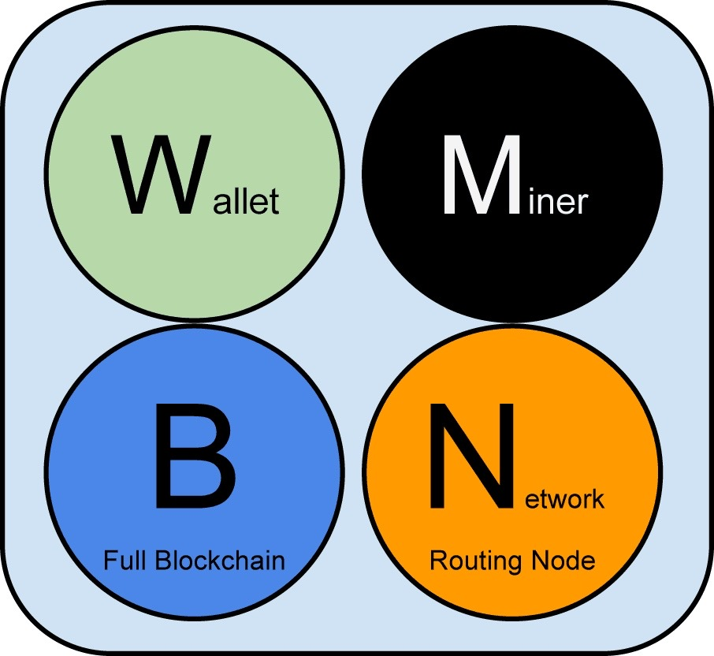

- N 网络路由
- B 区块链数据库全功能
- M 矿工(挖矿)
- W 钱包

- 节点从功能上完整度上分为
	- 全节点
	
		全节点拥有一份完整、最新的区块链拷贝，可以不借助任何外部参照进行自主的校验所有交易
	- 简易支付验证节点(spv-轻量级节点)
	
		SPV 只保存部分区块链数据，只用来检查
- 节点按照功能分	
	- 挖矿节点

		挖矿节点通过运行在特殊硬件设备上的工作证明(proof-of-work)算法，用相互竞争的方式创建新块获取奖励。一些挖矿节点是全节点，保留全部区块数据，还有一些参与矿池挖矿的节点，是轻量级节点，必须依赖矿池服务器维护的全节点进行工作。
	- 钱包节点

		全功能节点的一部分也可以作为钱包使用，但越来越多的用户钱包都是 SPV 节点，尤其是运行于智能手机等资源受限的设备上。而这个正在变得越来越普遍。

比特币最常见的节点类型

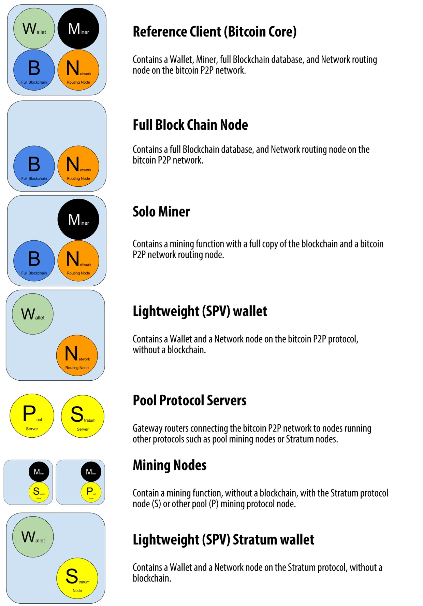

### 扩展网络
运行比特币 P2P 协议的比特币网络主要由大约 5000-8000 个运行着不同版本的客户端(Bitcoin Core ) 的监听节点、以及数百个运行着各类比特币 P2P 协议的应用节点组成。 P2P 网络中的一小部分节点是挖矿节点，它们竞争挖矿、验证交易并创建新区块。许多连接着比特币网络的大型公司运行的 BItcoin 全节点客户端，它们具有区块链完整的拷贝以及网络节点，但不具备挖矿以及钱包功能。这些节点是网络中的边缘路由器(edge routers) ，通过它们可以搭建基于区块链的其他服务，例如交易所、钱包、游览器、支付系统	
下图描述了比特币网络逻辑拓扑，显示各种节点

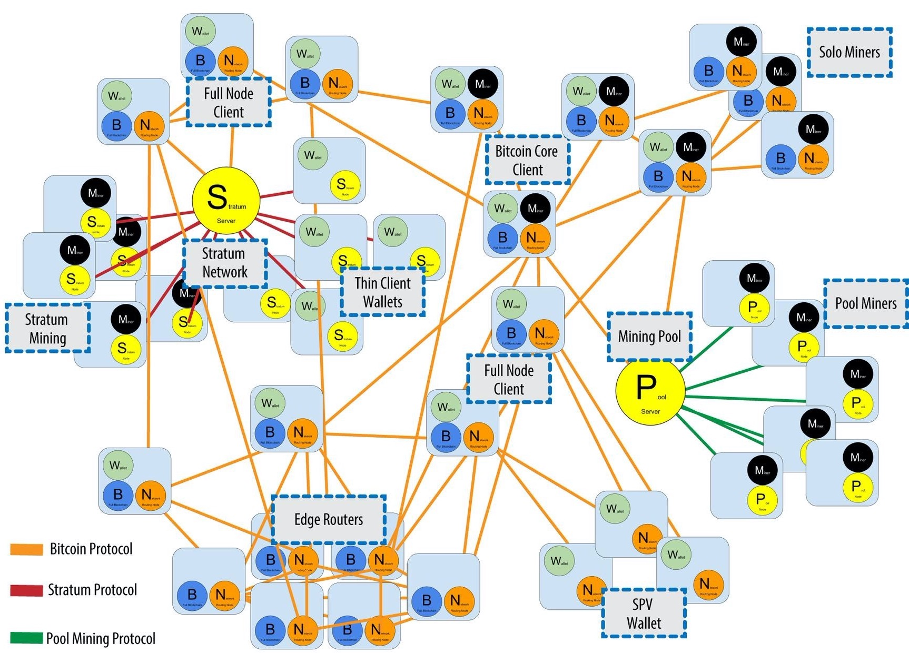
### 传播网络
对于比特币矿工来说，竞争的实际上是时间，已解决工作证明问题。在竞争时，矿工必须最大限度的缩短获胜块传播时间。这让网络延迟和利润直接相关。比特币传播网络是一种尝试最小化矿工之间传输的延迟网络。网络历史:

- 这套网络由 MattCorallo 在2015年创建，并以非常低的延迟在矿工之间快速同步块数据。该网络由世界各地的亚马逊 Web 服务基础架构上托管的几个专门的节点组成，并连接大多矿工和矿池。
- 原始的比特币传输在 2016 年被替换为 Fast Internet Bitcoin Relay Engine(FIBRE)，也是由 MattCorallo 提供。FIBRE 是一种基于 UDP 的中继网络，可以中继节点网络内的块。 FIBER 实现了 compact block ，进一步减少了传输的数量和延迟。

康奈尔大学研究了另一种中继网络 Falcon，它属于直通路由而不是储存转发来减少延迟，通过传播块的部分，而不是等待直到接收到完整块。它不是代替当前 p2p 网络，而更像是一层覆盖网络，在具有特殊需求的节点之间提供额外的连接，像高速公路，解决的是交通繁忙两点之间的快捷方式。

### 网络发现
当新的网络节点启动后，作为参与协同运作，它必须发现网络中的其他比特币节点。新网络节点必须发现至少一个网络中存在的节点并与之连接。由于比特币网络拓扑结构并不基于节点间的地理位置，因此与各节点之间的地理信息完全无关。链接节点时，可以随机连接网络中任何存在的节点。

节点通常采用 TCP 协议(8333 端口-比特币默认端口)与已知的对等节点建立连接。在建立连接时，该节点会通过发送一条包含基本认证内容的 [version](http://bit.ly/1qlsC7w) 消息开始握手。过程如下

- nVersion 定义了客户端所说出的比特币 p2p 协议采用的版本，例如 70002
- nLocalService 一组该节点支持的本地服务列表，当前仅支持 NODE_NETWORK
- nTime 当前时间
- addrYou 当前节点可见的远程节点 IP 地址
- addrMe 本地节点所发现的本机 IP
- subver 指示当前节点运行的软件类型的子版本号，例如 `/Satoshi:0.9.2.1/`
- BaseHeight 当前节点区块链的区块高度

版本消息始终是任何对等体发送给另一个对等体的第一条消息。

- 接收到版本的远程对等体节点将检查接收到的 nVersion 报告，并确定是否兼容。
- 对等体将确认版本消息，并通过发送一个 verack 建立连接。

找到对等体的方法是通过几个方法

- 第一种

	使用多个 "DNS 种子" 来查询 DNS,这些 DNS 服务器提供比特币节点的 IP 地址列表。
	
	- 一些 DNS 种子提供了稳定的比特币监听节点的静态 IP 地址列表。
	- 一些 DNS 种子是 BIND (Berkeley Internet Name Daemon) 的自定义实现

		从搜索器或长时间运行的比特币节点收集比特币节点地址列表中返回一个随机子集。 Bitcoine Core 包含五种不同的 DNS 种子名称。不同的 DNS 种子的所有权和多样性的多样性为初始引导过程提供了高水平的可靠性。在客户端中，使用 DNS 种子的选项由选项 switch-dnsseed 控制，默认为1，使用 DNS 种子。
- 第二种

	不知道网络引导节点必须被给予一个比特币网络节点 IP 地址，之后可以通过进一步参数来建立连接。命令行参数 `-seednode` 可用于连接到一个节点，仅用于将其作用种子。在使用初始种子形成后，客户端将断开连接并发现新的对等体。
	
	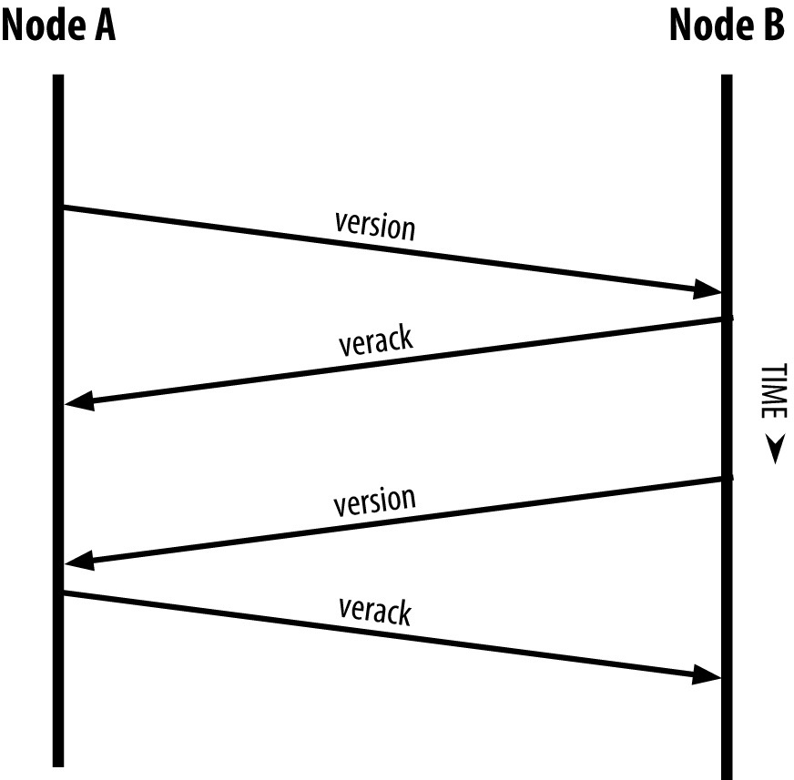
	
	建立一个或多个连接后，新节点将一条包含自身 ip 地址的 addr 消息发送给相邻节点。相邻节点再将消息依次转发给它们的临近节点，从而保证新节点的信息被多个节点所接收、保证连接更稳定。另外，新节点可以向相邻节点发送 getaddr 消息，要求它们返回其已知对等节点的 IP 地址列表。通过这种方式，节点可以找到需要连接的对等节点，并向网络发布它的消息以便其他节点找到。步骤如下
	
	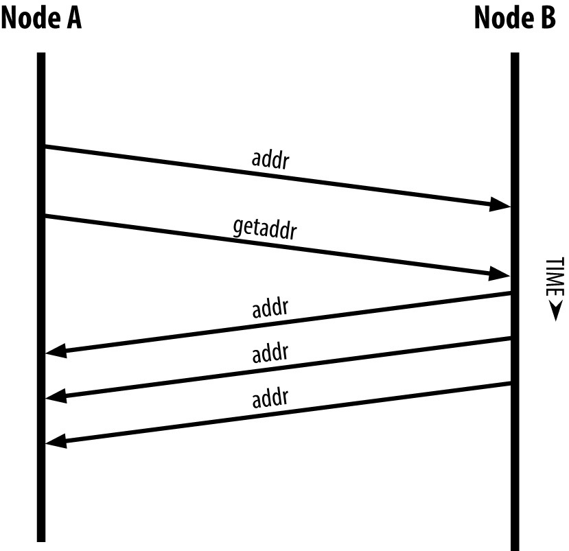
	
	节点必须连接到若干不同的对等节点才能在比特币网络中建立通向比特币网络的各种类型的路径(path)。
	
	由于节点可以随时加入和离开，通讯路径是不可靠的。因此，节点必须持续的进行两项工作
	
	- 在失去已有连接时发现新节点
	- 在其他节点启动时提供帮助

	节点启动时只需要一个连接，因此第一个节点可以将它引荐给它的对等节点，这些节点又会进一步的引荐。一个节点连接到大量其他对等节点后，这既没必要，也是对网络资源的浪费。所以在启动完成后，节点会记住它最近成功连接的对等节点，因此，当重启后可以迅速与先前的对等节点网络重新建立连接。如果先前的网络的对等节点对连接请求无应答，该节点可以使用种子节点进行重启。可以使用 getpeerinfo 命令来获取节点信息
	
		$ bitcoin-cli getpeerinfo
		
		{
			"addr" : "85.213.199.39:8333",
			"services" : "00000001",
			"lastsend" : 1405634126,
			"lastrecv" : 1405634127,
			"bytessent" : 23487651,
			"bytesrecv" : 138679099,
			"conntime" : 1405021768,
			"pingtime" : 0.00000000,
			"version" : 70002,
			"subver" : "/Satoshi:0.9.2.1/",
			"inbound" : false,
			"startingheight" : 310131,
			"banscore" : 0,
			"syncnode" : true
		},
		{
			"addr" : "58.23.244.20:8333",
			"services" : "00000001",
			"lastsend" : 1405634127,
			"lastrecv" : 1405634124,
			"bytessent" : 4460918,
			"bytesrecv" : 8903575,
			"conntime" : 1405559628,
			"pingtime" : 0.00000000,
			"version" : 70001,
			"subver" : "/Satoshi:0.8.6/",
			"inbound" : false,
			"startingheight" : 311074,
			"banscore" : 0,
			"syncnode" : false
		}			
	用户还可以通过提供 `-connect=` 选项来指定一个或多个 Ip 地址，从而达到自动覆盖节点管理功能并制定 IP 地址列表。如果采用此选项，节点只连接这些选定的节点 ip 地址，而不会自动发现并维护对等节点之间的连接。

	如果只建立连接没有数据通讯，所有节点定期会发送信息以维持连接。如果节点保持某个连接长达 90 分钟没有任何通讯，它会被认为已经从网络中断开，并寻找一个新地址。因此比特币网络随时根据变化的节点以及网络问题进行动态调整，而不需要经过中心化的控制即可进行规模增减的调节机制。
	
### 全节点
全节点指应当被称为完整区块链节点。早期，所有的节点都全节点，当前的比特币客户端也是完整区块链节点。但在过去的两年中，出现了许多新型客户端，它们不需要维持完整数据，而是作为轻量级客户端运行。

完整区块链节点拥有完整的交易信息拷贝，这样节点可以独立进行建立并校验区块链，从创始块一直到最新的区块。这样它就可以在验证交易后，更新合并至本地的区块链拷贝中。

判断是否运行的是完整区块链十分容易，只需要看永久存储设备，如硬盘是否超过 20 GB 的空间被用来存储完整区块即可。如果需要很大磁盘空间并同步比特币网络需要n天，那么就是全节点。(消耗时间和磁盘空间还有网络是摆脱中心化管理、获得完整独立的代价)

尽管目前还有一些使用不同编程语言以及软件的其他的完整区块链客户端存在，但最常用的被称为 `Satoshi 客户端`，也就是核心客户端。超过90%的节点与行各种版本的比特币核心客户端。它可以通过节点间发送 version 消息或通过 `get peerinfo` 命令所得到的子版本字符串 `Satoshi` 加以辨认，例如 ` Satoshi:0.8.6`	
### 交换“库存清单”
一个全节点连接到对等节点后，第一件事就是构建完整的区块链。如果该节点是一个全新的，那么它就不包含任何区块链信息，它只知道静态植入在客户端代码中的创世区块。新节点需要下载从0号区块(创世区块)开始的数十万区块的全部内容，才能和网络同步，并重建全新区块链(挖矿)

- 同步区块的过程从发送 version 消息开始，因为该消息中包含有 `BaseHeight` 字段，显示了节点当前的区块高度(数量)。
- 节点也可以从对等节点中得到版本消息，了解双方各自有多少区块，从而进行区块对比。
- 对等节点会交换一个 Getblocks 消息，包含它们本地区块链等端哈希值
	- 如果某个对等节点识别出它接收的哈希值并不属于顶端区块，而属于一个非顶端区块，那么这个发送消息的节点就会被自动断开。因为自身节点数据比需要它传输的节点数据更老。
	- 拥有更更长区块链对等节点比其他节点有更多区块，可以识别出哪些区块是其他节点需要补充的。
- 识别出第一批同步的500个区块，通过 `inv(inventory) ` 消息把这些区块哈希值传输出去。
- 缺少这些区块的节点可以通过各自发送的 `gatdata` 消息请求得到全区块信息，用包含在 inv 消息中的哈希值来确认请求的区块是否正确

例

- 假设某个节点只包含创世区块
- 它收到来自对等节点的 Inv 消息，其中包含了 500 个区块哈希值。
- 它开始向所有与之连接的对等节点请求区块数据，并通过分担工作量的方式防止单一对等节点被批量请求所压垮。
- 该节点会追踪记录其每个对等节点连接上“正在传输”的区块数量，并检查数量有没有超过上限( MAX_BLOCK_IN_TRANSIT_PER_PEER)。

	如果一个节点需要更新大量区块，它会在上一个请求完成后，才发送对新区块的请求，从而控制对对等节点更新的速度，不至于压垮网络。
- 每个区块在被接收后，会被添加到区块链中
- 随着本地区块逐步建立，越来越多的区块被请求和接收，整个过程将一直持续到节点完全与网络同步为止。
- 当每一个节点离线，不管离线多久，这个对等节点比较本地区块恢复缺失的过程就会被触发。
	- 如果一个节点离开几分钟，只会缺失几个区块
	- 如果离开1个月，会缺失上千个区块
	- 无论哪种情况，它都会从发送 Getblocks 消息开始，收到一个 inv 响应，接下来开始下载缺失的区块。 

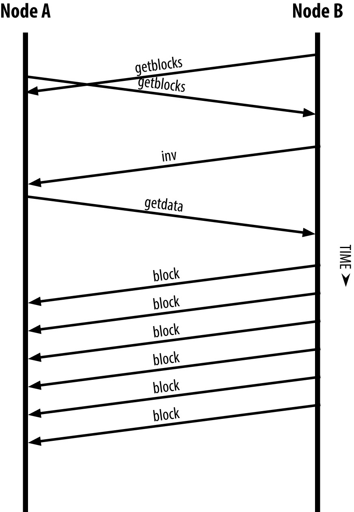					

### 简易支付验证(Simplified Payment Verification(SPV)) 节点
并非所有节点都有能力储存完整的区块链，许多比特币客户端被设计成运行在空间和功率受限的设备。这样设备使用 SPV 方式可以使它们不必存储完整区块链的情况下工作。这种类型的客户端被称为 SPV 客户端或轻量级客户端。随着比特币使用热潮， SPV 节点逐渐变成了比特币最常见的节点形式，如钱包

SPV 节点只需要下载区块头，而不是下载整个区块链交易，由此产生的不含交易信息的交易链，大小只有完整链的1/1000之一，随时间的发展差距会越来越大。 SPV 节点不能构建所有可用于消费的 UTXO 的全貌，这是由于他们不知道网络上交易的完整信息。 SPV 节点验证交易时所使用的方法略有不同，这个方法需要依赖对等节点 `按需` 提供区块链相关部分的局部试图。

打个比方

- 每个全节点就像一个陌生城市里的游客，携带一张该城市的详细地图。

	例，全节点要检查第300,000 号区块的某条交易，它会把从该区块开始一直回溯到创世区块的 300,000个区块都连起来，并建立一个完整的 UTXO 数据库，通过确认该 UTXO 是否还未被支付来证实有效性。 
- 相比之下，SPV 节点就像一个游客，只知道一条主干道的名字，通过随机询问陌生人来获取分段道路指示。虽然通过考察两种游客都可以验证一个街道是否存在，但没有详细地图的游客必须通过不断询问陌生人来修正道路，当然还要避免抢劫。

	简易交易验证是通过参考交易在区块链中的深度(最新的几个块连续查询到)，而不是高度来验证它们。一个拥有完整区块链的节点会构造一条验证链，这条验证链是由沿着区块链按时间倒序一直追溯到创世区块的数千条区块交易组成。而 SPV 节点会验证所有区块的链，而不是所有交易，并把区块链的有关交易链链起来。
	
	例，SPV 节点则不能验证 UTXO 是否未被支付，相反的， SPV 节点会在该交易信息和它所在的区块之间有那个 merkle 路径，建立一条连接。然后 SPV 节点一直等待，直到序号从 300,001 到 300,006 的六个区块堆叠在该交易所所在的区块上时，通过确立交易的深度时在第 300,001-300，006 区块都验证有效性后。(事实上，经过6个区块的确认，根据代理网关协议，可以证明交易不是双重功能支付)
	
如果一个交易实际不存在， SPV 节点不会误认为该交易在某个区块中。 SPV 节点通过请求 merkle 路径证明以验证区块中的工作量证明，来证实交易的存在性。但一个交易的存在是可能对 SPV 节点隐藏的。

SPV 节点毫无疑问可以证实某个交易的存在性，但它不能验证某个交易(譬如同一个 UTXO 的双重支付)不存在，这是因为 SPV 节点没有一份关于交易的记录。这个漏洞会针对 SPV 节点进行拒绝服务攻击或双重支付型攻击所利用。为了防御这些攻击， SPV 节点会随机连接多个节点，以增加至少一个可靠节点连接的概率。然而这种随机连接意味着 SPV 节点也容易受到网络分区攻击或 Sybil 攻击。后者 SPV 连接到了虚假的比特币节点。

绝大多数实际情况中，具有良好的连接的 SPV 节点是足够安全的，它在资源需求、实用性和安全性上做了平衡。当然如果保证万无一失安全，最可靠的方法还是运用全节点。

SPV 节点使用的是一条 `getheaders` 消息，而不是 `getblocks` 消息来获得区块头。发出响应的对等节点将用一条 `headers` 消息发送多达 2000个区块头。这个过程和全节点没区别。 SPV 节点还在与对等节点的连接上做了过滤器，过滤发来的区块和交易数据流。任何目标都是通过一条  `getdata` 的请求来读取的。对等节点生成一条包含交易信息的 `tx` 信息作为响应。整个过程

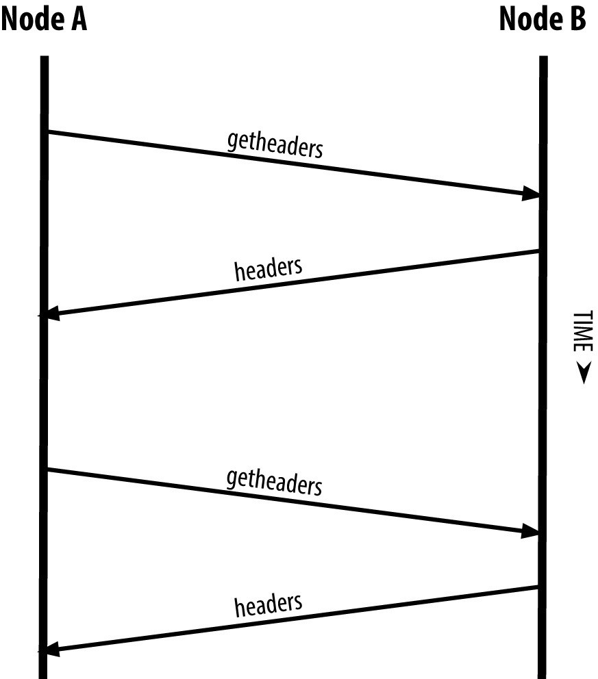					

由于 SPV 节点需要读区特定交易从而选择性的验证交易，这样又产生了隐私性风险。与全节点收集每一个区块的全部交易不同， SPV 节点只对区块内部特定数据请求可能无意中透露了钱包里的地址信息。例如，监控网络的第三房可以跟踪某个 SPV 节点上的钱包所请求的全部交易信息，并利用这些交易信息把比特币地址和钱包用户关联，损害用户隐私。

引入 SPV 后布局，开发人员引入了一个新功能， BLOOM 过滤器，用于解决隐私泄露问题， BLOOM 过滤器通过一个采用概率而不是固定模式的过滤机制，允许 SPV 节点只接收交易信息的子集，通过使用概率而不是固定模式的机制，过滤机制无需精确。

### BLOOM 过滤器
过滤器允许用户描述特定的关键词组合而不必精确表述的基于概率的过滤方法。它能让用户在有效搜索关键词的同时保护它们的隐私。在 SPV 节点里，这个方法被用来定向对等节点发送信息查询请求，同时交易地址不会泄露。

例

一个手中没有地图的游客( SPV )需要去特定地方.如果向陌生人询问 xxx 在哪里，不经意就泄露了自己的目的地。而通过过滤器问，附近带有x字的街道麽。这样问包含比前略少的关键词，游客可以自己定义信息的多少。这样给出少信息来增加不确定性，起到保护作用。

过滤器可以让 SPV 节点指定交易的搜索模式，该模式可以基于确定或私密性的考虑被调节。一个非常具体的过滤条件会生成更准确的结果，但也会显示用户钱包的使用地址，暴露隐私。如果过滤器只包含简单的关键词，相应和无关的交易被搜索，增高了私密性。

- Bloom 过滤器工作原理

	过滤器是由一个可变长度 `N` 的二进制数组 (N位二进制构成了一个位域)和数量可变 (M) 的一组哈希值组成。这些哈希值的输入值始终在1和N之间，该数值与二进制数组对应。且该函数为确定性函数，也就是说任何一个使用相同过滤器节点通过该函数都能得到一个相同的结果。 过滤器的准确性和私密性通过改变长度(N)和哈希数量(M)来调节。
	
	例用一个小型十六进制数组和三个哈希演示原理
	
	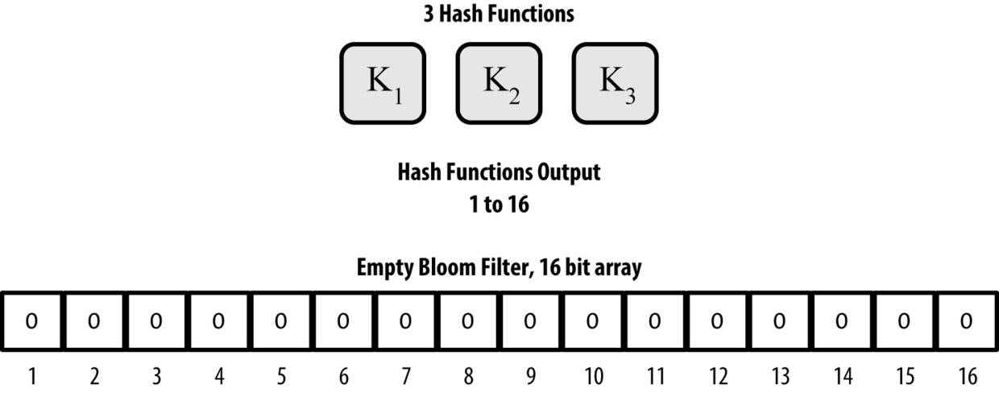
	
	- 过滤器数组的每一个数初始值为零，关键词被加到过滤器中之前，会依次通过每一个哈希运算一次。
	- 该输入经第一个哈希函数运算后，得到一个在 1和 N 之间的数，它在该数组(编号依次为1至N)中所对应的位置为1，从而把哈希函数输出记录下来。
	- 接着再进行下一个哈希函数运算，把另一个位置为1,以此类推。
	- 把全部 M 个哈希函数都运算之后，一共有 M 个位的值从 0 变成1，这个关键词也记录在过滤器中。

	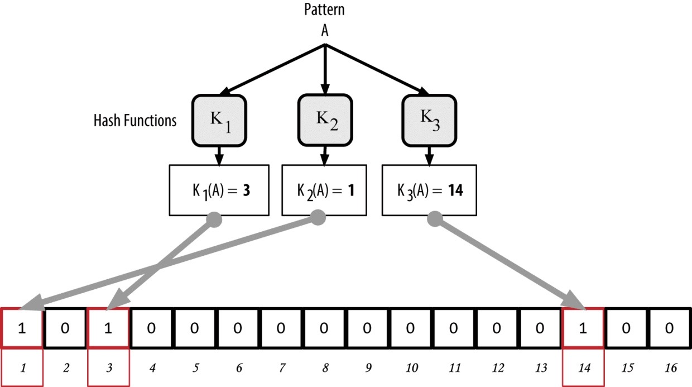
	
	增加第二个关键词就简单的重复之前的步骤，关键词依次通过哈希运算之后，相应的位变为1，过滤器记录该关键词。当过滤器里的关键词增加时，它对应的某个哈希值的输出值的位可能已经是1了，这种情况下，该位将不会再次改变。也就是说所随着更多的关键词指向了重复的位置，过滤器随着位1的增加而饱和，准确性也因此降低。该过滤器之所以是基于概率的数据结构，就是因为关键词的增加会导致准确性的降低。准确性取决于关键词的数量以及数组大小 (N)和哈希函数(M)的多少。更大的数组和更多的哈希函数会记录更多的关键词，以提高准确性。而小的数组和有限的哈希值，只能记录有关的关键词从而降低准确性。

	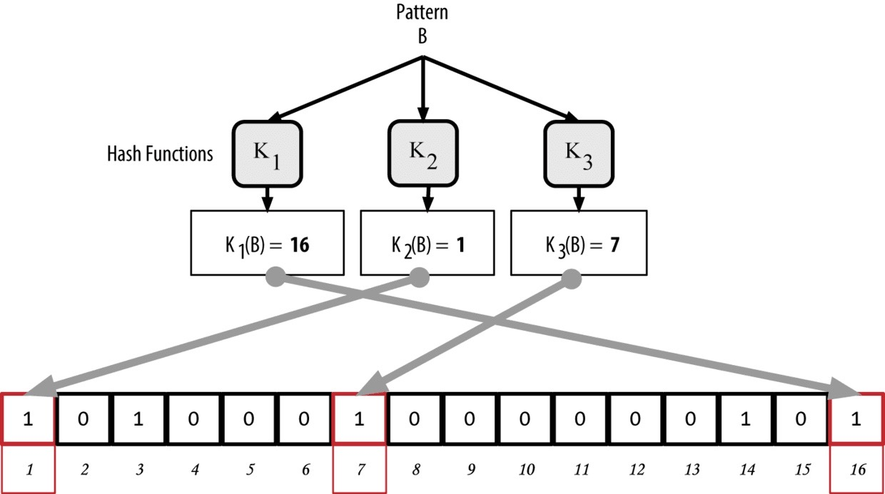
	
	为了测试某一个关键词是否被记录在某个过滤器中，将该关键词逐一带入各哈希函数中计算，并将所得的结果与原数组进行比对。如果所有的结果对应的位都变为1，则表示这个关键词有可能已经被该过滤器及路过。但结果并不确定，因为这些字节 1 也可能是其他关键词运算的重叠结果。但是过滤器正匹配代表着可能是。
	
	验证一个关键词 x 是否在过滤器中，相应的位置都被设置为1，所以这个关键词很可能是匹配的。
	
	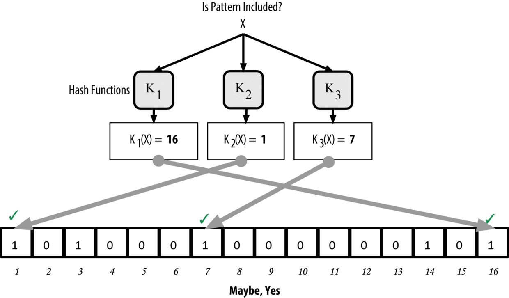
	
	另一方面，如果带入关键词计算后，结果为0，说明该关键词肯定没有记录在过滤器中。这个是100%的。

	验证 y 是否存在在过滤器中，结论是没有
	
	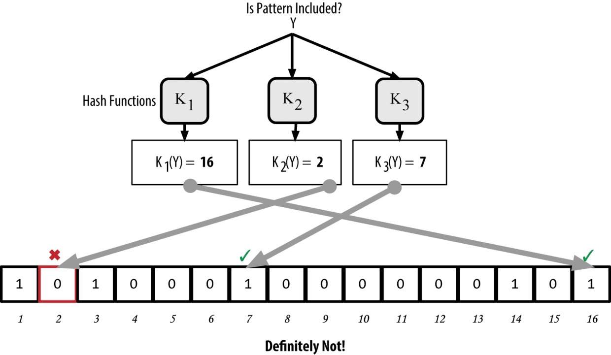

### SPV 节点如何使用过滤器
过滤器用于过滤 SPV 节点从其对等体接收的交易(包含它们的块)，仅选择 SPV 接待你感兴趣的交易，而不会泄露其感兴趣的地址和密钥。

- SPV 节点先将初始化`过滤器` 为 `空`。在该状态下，过滤器将不匹配的任何模式。
- 然后， SPV 节点将列出所有感兴趣的地址，密钥和散列，通过从钱包控制的任何 UTXO 中提取公钥哈希、脚本哈希和交易 ID
- SPV 节点将其中每一个添加到过滤器中，以便这些模式存在与交易，则过滤器匹配，而不会自动显示模式。
- SPV 节点将向对等体发送一个过滤加载消息，其中包含连接上使用的过滤器。
- 对等体针对每个传入的交易检查过滤器，完成的节点会根据过滤器检查交易的几部分，寻找匹配，包括
	- 交易 ID 每个交易输出锁定脚本的数据组件(脚本中的每个键和哈希)
	- 每个交易输入每个输入签名数据组件(见证脚本)
- 通过检查这些组件，可以使用过滤器来匹配公钥哈希、脚本、OP_RETURN 值、签名中的公钥、智能合约或复杂脚本的任何组件。
- 在建立过滤器后，对等体将针对过滤器测试每个交易的输出，只有与过滤器匹配的交易才会发送到节点。
- 响应来自节点的 `getdata` 消息，对等体将发送一个 `merkleblock` 消息，该消息仅包含与过滤器匹配的块和每个匹配交易的 `merkle` 路径的块头。
- 然后对等体将发送包含过滤器匹配的交易的 tx 交易(完整节点向 SPV 节点发送交易)
- SPV 节点丢弃任何吴报，使用正确匹配的交易来更新其 UTXO 集和钱包余额。
- 随着更新自己的 UTXO 集视图，它还会修改过滤器，以匹配任何引用其刚刚发现的 UTXO 的交易
- 完整节点使用新的过滤器匹配交易，反复整个过程

设置过滤器的节点可以通过发送 `filteradd` 消息将模式交互式添加到过滤器，要清除过滤器，节点可以发送一个清楚消息。因为不可能从布局过滤器中删除模式，所以如果不再需要模式，则节点必须清除并重新发送新的过滤器。

[BIP-37 Peer Services](http://bit.ly/1x6qCiO) 中定义了 SPV 节点的网络协议和过滤器机制  

### SPV 节点和隐私
现实 SPV 的节点的隐私比整个节点更脆弱，完整节点接收所有交易，因此不会现实关于它钱包中是否使用某个地址的信息。 SPV 节点接收与钱包中地址相关的经过过滤器列表。结果它减少了所有者的隐私。

过滤器是减少隐私损失的一种方式。如果没有过滤器，SPV 节点将不得不明确的列出它感兴趣的地址，造成严重的隐私违规。然而过滤器对监控 SPV 流量或直接连接到它的 P2P 网络的节点剋有随时随地收集足够的信息来了解 SPV 钱包中的地址。
### 加密和认证
大多数新用户假设比特币节点的网络通讯是加密的，虽然这不是比特币网络的主要隐私，但 SPV 却是。作为增加 P2P 网络隐私和安全性的一种方法，有两种方案可以通过  BIP-150/151 提供通讯加密: 

- tor 传输

	tor 代表洋葱路有网络，是一个软件项目和网络，通过提供匿名，不可追踪和隐私的随机网络路径提供数据加密和封装。
	
	Bitcoin Core 提供了多种配置，允许通过 Tor 网络传输。Bitcoin Core 还可以提供 Tor 隐藏服务，允许其他 Tor 节点通过 Tor 直接连接到节点。
	
	Bitcoin Core 从 0.12版本开始,如果能够连接到本地 Tor 服务，节点将自动提供隐藏的 Tor 服务。如果安装 Tor 并运行 Bitcoin Core 进程有足够权限访问 Tor 认证 cookie 的用户运行，则自动运行。可以使用 debug 模式调节 tor 服务
	
		$ bitcoind --daemon --debug=tor
	在日志看到 `tor:ADD_ONION success` 说明设置已经生效
- P2P 认证加密

	[BIP-150](https://github.com/bitcoin/bips/blob/master/bip-0150.mediawiki)和 [BIP-151](https://github.com/bitcoin/bips/blob/master/bip-0151.mediawiki) 两个改进方案在 P2P 网络中增加了对 P2P 的认证和加密支持。它们定义了可由兼容的比特币节点提供可选服务。
	
	- BIP-150 提供可选的对等认证，允许节点使用 ECDSA 和私钥对对方的身份进行验证。要求在认证前，两个节点必须按照 151 方案建立加密通道
	- BIP-151 启用了支持 BIP-151 的两个节点之间的所有通讯的协商加密

	2017年1月， BIP-150/151 未在 Bitcoin Core 中实施。但2个方案已经至少一个成为 bcoin 的代替核心客户端的程序采纳。允许用户的 SPV 连接到授信的完整节点使用加密和身份验证来保护 SPV 客户端隐私。 
	
	此外，可以使用身份验证来创建颗心的比特币网络，防止中间人攻击。最后

###  交易池
比特币网络中，几乎每个节点都会维护一份未交易的临时列表，称为内存池或者交易池。节点利用这个池，追踪记录哪些被网络所知晓的，但还没有被区块包含的交易。例如保存用户钱包的节点会利用这个交易池来记录哪些网络已经接收但还未确认的、属于该用户钱包的支付信息。

随着交易被接收和验证，它们被添加到交易池中并通知相邻节点，从而传播到网络中。有些节点的实现还维护了一个单独的独立交易池，

- 如果一个交易的输入与某个未知的交易有关，如与缺失的福交易相关，该孤立交易就会暂时被存储到孤立交易池中，直到父交易到来。
- 一个交易被添加到交易池，也会同时检查鼓励交易池，看是否有某个孤立交易引用了此交易的输出(子交易)。
- 任何匹配的孤立交易会被进行验证。
- 如果验证有效，它们会从孤立交易池中删除，并添加到交易池汇总，使其父交易开始的链变得完整

对于新加入交易池的交易来说，它不是孤立的交易，签署过程重复递归找寻进一步的后代，直到所有后代被找到。通过这一过程，一个父交易的到达把整条链中的孤立交易和它们的父交易重新结合在一起，从而触发了整条交易链进行级联重构。

交易池和孤立交易池都是存储在本地内存中，并不是存储在永久性的设备中。准确的说，它们是随着网络传入的消息动态填充的。节点启动时，这个池子是空的，随着网络中新交易不断被接收，两个池子逐渐被填充。

有些比特币客户端还实现了维护一个 UTXO 数据库，也称为 UTXO 池，区块链中所有未支付交易输出的集合。 UTXO 池名与交易池类似，但代表的不同数据集。 UTXO 池不同的地方在于，它初始化时不为空，而是包含了数以百万计的未支付交易输出条目，有些条目可以追溯到 2009 年。 UTXO 池可能会被安置在本地内存，或作为一个包含索引的数据库安置在永久的存储设备汇总。

- 交易池和孤立交易池
	- 是单点的本地视角。取决于节点的启动时间或重启时间，不同的节点的两个池子，内容可能差别极大。
	- 只包含未交易数据
- UTXO 池
	- 代表是网络的突显共识 ，因此不同的节点之间 UTXO 池内容差别不大。
	- 只包含交易数据

## 区块链
区块链数据结构是由包含交易信息的区块按照从远到近的顺序有序的连接起来。可以被存储为平面文件 (flat file)，或者是存储在一个简单的数据库中。比特币核心客户端使用 Goole 的 leveldb 数据库存储区块链元数据。区块链的区块用栈的形象化表示区块依次堆叠这一概念，可以使用术语(高度)来表示区块与创世区块之间的距离，用顶部或者顶端来表示新添加的区块。

对每个区块进行 SHA256 加密哈希，可生成一个哈希值。通过这个哈希值，可以识别出区块链中的对应区块。同时每个区块可以通过其区块头的 "父区块哈希值" 字段引用前一个区块(父区块)。也就是每个区块头都包含它的父区块哈希值。

每个区块虽然只有一个父区块，但是可以暂时拥有多个子区块。每个子区块都将作为同一区块作为其父区块，并且在 "父区块哈希值" 字段中具有相同的父区块哈希值。一个区块出现多个子区块的情况被称为分叉。区块分叉的状态是暂时的，只有当多个不同区块几乎同时被不同的矿工发现时，才会发生。最终只有一个子区块会被区块链认可，同时解决了分叉问题。尽管每个区块只有一个父区块，因为只有一个父区块哈希值字段可以指向它唯一的父区块。

由于区块头里包含父区块哈希值的字段，所以区块的哈希值也收到该字段影响。如果父区块的身份标示发生变化，子区块的身份标示也会发生变化。当父区块有改动，父区块的哈希值也会变化。这样迫使子区块的父区块哈希值哈希值字段也发生变化，从而又将导致子区块哈希值变化。以此类推，一旦一个区块有很多后代，这种连锁反应保证了区块不会被更改，除非重新计算该区块所有后续的区块。因为这种计算需要耗费巨大计算力，所以一个长区块的存在可以让区块链的历史不可改变，这也是区块链安全的一个关键的技术特征。	

区块链中，最近几个区块可能由于分叉原因引发重新计算而被修改。但是，超过6个区块后，区块在区块链的深度被改变的可能性就很小。当然越深可能性越小。在100个块以后的区块链已经足够稳定，这时交易可以被支付。几千个区块后，区块链将确定变成历史，永远不会改变。

### 区块链结构
区块是一种被包含在公开账本里的聚合了交易信息的容器数据结构。它由一个元数据的区块头和紧跟其后的构成区块主体的一长串交易列表组成。区块头是 80 个字节，而平均每个交易至少是 250 个字节，而平均每个区块包含超过 500 个交易，因此，一个交易包含所有交易的完整区块比区块头大1000倍。一个区块结构

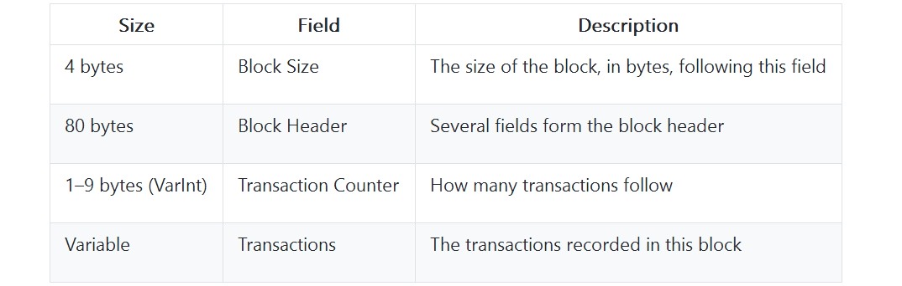
### 区块头
区块头由三组区块元数据组成，

- 首先是一组引用父区块哈希值的数据，这组元数据用于将该区块与区块链中前一个区块相连接
- 第二组元数据即难度、时间戳和 Nonce，与挖矿竞争有关
- 第三组元数据是 merkle 树根，一种可以有效总结区块中所有交易的数据结构。

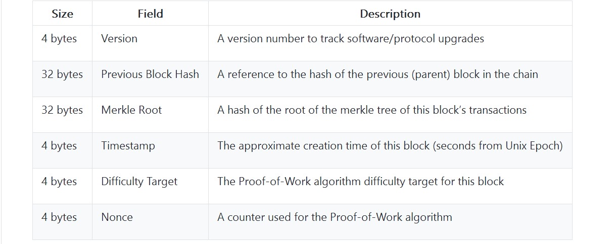
	
### 区块标识符:区块头哈希值和区块高度
区块可以通过两种方式被识别

- 区块哈希值

	区块主标识符是它的加密哈希值，一个通过 SHA265 算法对区块头进行二次哈希计算而得到的数字指纹。产生的 32 字节哈希值被称为区块哈希值，但是更准确的名称是:区块头哈希值，因此只有区块头被用于计算。例如

		000000000019d6689c085ae165831e934ff763ae46a2a6c1 72b3f1b60a8ce26f #创世区块哈希值
	区块还希值可以为一、明确的标示一个区块，并任何节点通过简单的对区块头进行哈希计算，都可以独立获取该区块哈希。区块哈希实际上并不包含在区块的数据结构中，不管该区块在网络上传输，还是它作为区块链的一部分被存储在某个节点的磁盘中。相反，区块哈希值是当区块从网络被接收时，由每一个节点计算出来的。区块的哈希值可能会作为区块元数据的一部分被存储在一个独立的数据库表中，以便索引和更快的从磁盘检索区块。
- 区块高度	

	第二种识别区块的方式是通过该区块在区块链中的位置，即 `高度`。创世区块的高度为0，哈希值为上面的值，随后的区块将比前一个区块高度加1。
	
	和区块哈希值不同，高度并不是唯一标识符。虽然单一区块总是会有明确、固定的区块高度，但反过来不成立。因为一个高度的区块并不总是识别一个单一区块。两个或者两个以上的区块可能有相同的区块高度，在区块链里争夺同一个位置。这种叫做分叉。
	
	区块高度也不是区块链数据结构的一部分，它并不被存储在区块里。当节点接收来自比特币网络的区块时，会动态的识别该区块在区块链里的位置(区块高度)。高度也会作为元数据存储在一个索引数据库表中以便快速检索。

### 创世区块
区块链的第一个区块建立于 2009 年，被称为创世区块。它是区块链里面所有区块的共同祖先，所有区块向后回溯，都最终达到它。创世区块被编入比特币客户端里，所以每一个节点始终于至少包含一个区块的区块链，这将确保创世区块不会被改变。每个节点都知道创世区块的还希值、结构、创建的时间和里面的一个交易。因此每个节点都把该区块作为区块链的首个区块，从而构建了一个安全可信的区块链。

在 [chainparams.cpp](https://github.com/bitcoin/bitcoin/blob/3955c3940eff83518c186facfec6f50545b5aab5/src/chainparams.cpp#L123) 里可以看到创世区块被编入比特币核心代码，任何游览器都可以搜索到这个哈希值，如 blockchain.info。命令行也可以查看，如

	$ bitcoindgetblock 000000000019d6689c085ae165831e934ff763ae46a2a6c172b3f1b60a8ce26f
	{
	    "hash":"000000000019d6689c085ae165831e934ff763ae46a2a6c172b3f1b60a8ce26f",
	    "confirmations":308321,
	    "size":285,
	    "height":0,
	    "version":1,
	    "merkleroot":"4a5e1e4baab89f3a32518a88c31bc87f618f76673e2cc77ab2127b7afdeda33b",
	    "tx":[
	        "4a5e1e4baab89f3a32518a88c31bc87f618f76673e2cc77ab2127b7afdeda33b"
	    ],
	    "time":1231006505,
	    "nonce":2083236893,
	    "bits":"1d 00ffff",
	    "difficulty":1,
	    "nextblockhash":"00000000839a8e6886ab5951d76f411475428afc90947ee320161bbf18eb6048"
	}		
创世区块包含一个隐藏的信息，在 Coinbase 交易的输入中包含一段话。

	The Times 03/Jan/2009 Chancellor on brink of second bailout for banks	
### 区块链接称为区块链
比特币全节点在本地保存了区块链从创世纪区块的完整副本，随着区块生产，该区块链的本地副本会不断的更新用于扩展这个链条。当一个节点从网络接收传入的区块时，它会验证这些区块，然后链接到现在的区块链上。为建立一个连接，一个节点将检查传入区块头并寻找该区块的 "父区块哈希值"。假设一个节点的区块链在本地副本中有 277，314个区块。该节点知道最后一个区块高度为第 277，314。这个区块哈希值为 

	00000000000000027e7ba6fe7bad39faf3b5a83daed765f05f7d1b71a1632249 
然后该比特币节点从网络接收一个新的区块，如

	{
	    "size":43560,
	    "version":2,
	    "previousblockhash":"00000000000000027e7ba6fe7bad39faf3b5a83daed765f05f7d1b71a1632249",
	    "merkleroot":"5e049f4030e0ab2debb92378f53c0a6e09548aea083f3ab25e1d94ea1155e29d",
	    "time":1388185038,
	    "difficulty":1180923195.2580261,
	    "nonce":4215469401,
	    "tx":[
	        "257e7497fb8bc68421eb2c7b699dbab234831600e7352f0d9e6522c7cf3f6c77",
	        [... many more transactions omitted ...]
	        "05cfd38f6ae6aa83674cc99e4d75a1458c165b7ab84725eda41d018a09176634"
	    ]
	}
对于这一新的区块，节点会在"父区块哈希值"字段里找出包含它的父区块的哈希值。这个节点已知的哈希值，也就是高度 277，314 区块。故这个新区块是这个链条里的最后一个区块的子区块。因此现有区块得以扩展。节点将新的区块添加到链的尾端，使用区块变长到一个新的高度 277，315

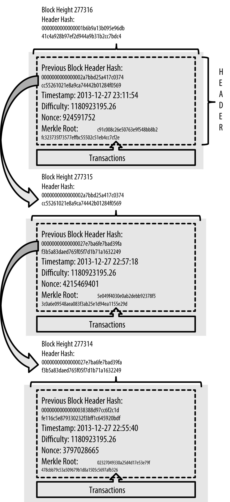

### Merkle 树
区块中的每个区块都包含了产生于该区块的所有交易，用 Merkle 树标示。 Merkle 树是一种哈希二叉树，是一种用作快速归纳和校验大规模数据完整性的数据结构。这种二叉树包含加密哈希值。在比特币网络中， Merkle 树被用来归纳一个区块中的所有交易，同时生成整个交易集合的数字指纹，提供了一种校验区块是否在某个交易的高效途径。完成一个完整的 Merkle 树需要递归的对哈希节点对进行哈希计算，并将新生成的哈希节点插入到 Merkle 树中，直到只剩下一个哈希节点，该节点就是 Merkle 树的根节点。 比特币网络中 Merkle 树中两次使用到了 SHA256 算法，因此其加密哈希算法也被称为 double-SHA256.

当 N 个数据元素经过加密后插入 Merkle 树时，至多要计算 2*log~2~(N) 次就能查询出任意某个数据元素是否在该树中，这使得数据结构非常高效。 Merkle 树是自底向上构建的。例如 ABCD四个构成 Merkle 树叶的交易开始

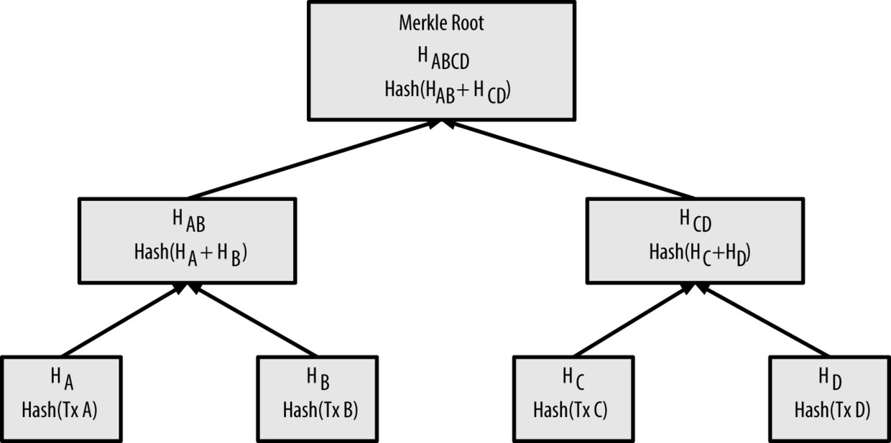

所有交易都不存在 Merkle 树中，而是将数据哈希化，然后将哈希值存储到相应的叶子节点。这些叶子节点分别是 `H~A~、H~B~、H~C~、 H~D~`

	HA = SHA256(SHA256(Transaction A))
将相邻两个叶子节点的哈希串联在一起进行哈希，这个叶子节点随后被归纳为父节点。例如 为了创建 H~AB，子节点 A和B的两个32字节的哈希值将被串联成 64 个字节，然后再进行两次哈希生成父节点

	HAB = SHA256(SHA256(H~A~ + H~B~))
其次类推，直到剩下顶部的一个节点，即为根节点。产生的32字节哈希存储在区块头，同时归纳了四个交易的所有数据。因为二叉树，所以需要偶数个叶子节点。如果仅有奇数个交易需要归纳，那最后交易会被复制一份以构成偶数叶子节点，这种偶数个叶子节点的树也被称为平衡树。例 c节点就被复制了2份

例子的方法同样适用于区块链中成百上千的交易。它们会采用相同的方法归纳，产生一个仅 32字节的字符串作为根节点。下图使用了16个交易形成树，尽管图中的根看起来比叶子节点都大，但实际傻姑娘它们都是 32字节的相同大小。无论交易数量。

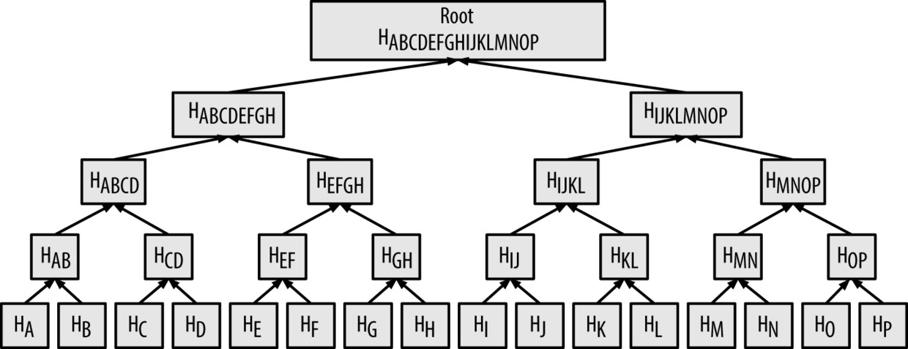

为了证明区块中某个特定交易，一个节点只需要计算 `log~2~(N)` 个哈希值，形成一条从特定交易到树根的认证路径(Merkle路径)即可。随着交易数量的增多，这样计算就显得异常重要，因为相对交易数量的增加，以基底为2的交易数量的对数增长会缓慢很多。这使得比特币节点能够高效的产生1条10-12个哈希值(320-384字节)的路径，来证明在一个巨大字节大小的区块和上千交易中的某笔交易的存在。

例 一个节点能够通过生成一条仅4个32字节哈希值长度(总128字节)的 Merkle 路径，来证明区块中存在一笔交易 K.该路径有4个哈希值(哈希标注)，H~L~、H~IJ~、H~MNOP~ 和 H~ABCDEFGH~。由这4个哈希产生的认证路径，再通过计算另外四对哈希值 H~KL~、

H~IJKL~、H~IJKLMNOP~ 和 Merkle根(虚线标注)，任何节点都能证明 H~K~ (绿色标注)包含在 Merkle 根中

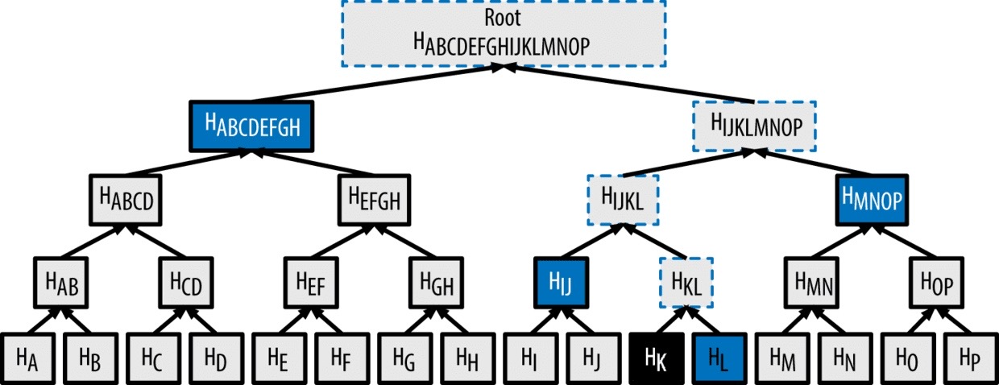

libbitcoin 库中的一些辅助程序，演示了从叶子节点哈希至根节点的过程。 代码路径在  `code/merkle.cpp[]`

	\ # Compile the merkle.cpp code
	$ g++ -o merkle merkle.cpp (pkg-config --cflags --libs libbitcoin)
	\ # Run the merkle executable
	$ ./merkle
	Current merkle hash list:
		32650049a0418e4380db0af81788635d8b65424d397170b8499cdc28c4d27006
		30861db96905c8dc8b99398ca1cd5bd5b84ac3264a4e1b3e65afa1bcee7540c4
	Current merkle hash list:
		d47780c084bad3830bcdaf6eace035e4c6cbf646d103795d22104fb105014ba3
	Result: d47780c084bad3830bcdaf6eace035e4c6cbf646d103795d22104fb105014ba3
Merkle 树的高效随数据的数量变得非常明显。为了证明区块存在某个交易所需要转化的路径的数据数量

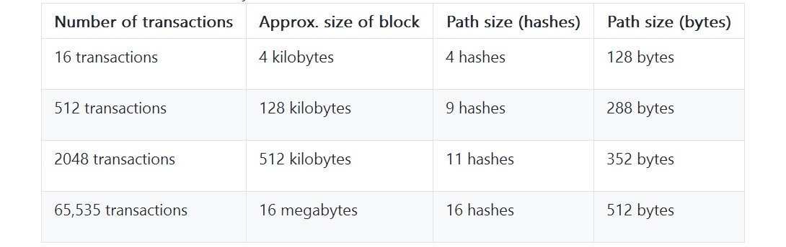

从表中可以看出，当区块为 16 笔(4kb大小)急剧激增到 65,535 笔（16mb）时，为了证明交易存在的 Merkle 路径长度增长及其缓慢，仅从 128字节到512字节。有了 merkle 树，一个节点能够仅在下载区块头(80字节/区块)，然后通过一个全节点回溯一条小的 Merkle 路径就能认证一笔交易的存在，而不需要存储或者传输大量区块中大多数内容，这些内容可能有几个 GB大小。

### Merkle 树和简单支付验证(SPV)
Merkle 树被 SPV 节点广泛使用。SPV 节点不保存所有交易也不会下载整个区块，仅保存区块头。它们使用认证路径或Merkle 路径来验证交易存在于区块中，不必下载所有交易。

例如，一个 SPV 节点相知道它钱包中某个比特币的地址即将到达的支付。

- 该节点会在节点间的通讯链接上建立起过滤器
- 将以 Merkleblock 消息形式发送该区块
- Merkleblock 消息包含区块大小和一条链接目标交易与 Merkle 根的 Merkle 路径。
- SPV 节点能够使用该路径找到与该交易相关的区块
- 进行验证对应区块中该交易的有无
- SPV 节点同时使用区块头去关联区块和区块链中的其余区块。
	- 交易与区块
	- 区块与区块链
	
	两种关联可以证明交易存在于区块链，

SPV 节点会收到少于 1 KB 的有关区块头和 Merkle 路径的数据，其数据量比一个完整的区块少1000多倍。 
		
### 测试区块链
由许多个测试区块链，现存有 `testnet\segnet\retest`

- Testnet 比特币实验网络

	它使用与测试区块链、网络、货币的总称。这个网络时一个功能齐全的在线 P2P 网络，包括
	
	- 钱包
	- 测试比特币
	- 挖矿
	- 其他主干网络有的功能

	与主干网络区别有2个
	
	- 币无价值，因为挖矿难度低，任何人都可以容易的挖到

		它主要用于开发人员测试软件，保护开发人员免受软件错误导致金钱损失，可以保护网络免受由软件错误导致的意外攻击。尽管开发商呼吁，但还是有人使用先进的设备来在 testnet 挖矿，导致挖矿难度增加，使用 Cpu 挖矿不可能，导致测试币获取困难，以至于赋予一定价值。这种做法导致是不是 Testnet 必须被报废并重新从创世区块启动，重新进行难度设置。目前已经被重置多次。
		
		当前 testnet 被称为 testnet3 ，是 testnet 的第三次迭代，于 2011年2月重启，重置了之前的 testnet 网络的的难度。 testnet3 是一个大区块链， 2017年初，超过 20gb，同步需要1天时间，可以使用虚拟机运行。
- 使用 testnet

	与其他比特币软件一样，Bitcoin Core 完全支持 testnet 网络，并且可以运行一个全节点。如果在 testnet 上启动 Bitcoin Core，而不是在主干网启动，可以使用 testnet 开关
	
		$ bitcoind -testnet
	日志中，会看到后见了一个子目录
	
		bitcoind: Using data directory /home/username/.bitcoin/testnet3
	要连接 bitcoind 可以使用 bitcoin-cli 命令，但切记切换模式
	
		$ bitcoin-cli -testnet getinfo
		{
			"version": 130200,
			"protocolversion": 70015,
			"walletversion": 130000,
			"balance": 0.00000000,
			"blocks": 416,
			"timeoffset": 0,
			"connections": 3,
			"proxy": "",
			"difficulty": 1,
			"testnet": true, # 注意这里
			"keypoololdest": 1484801486,
			"keypoolsize": 100,
			"paytxfee": 0.00000000,
			"relayfee": 0.00001000,
			"errors": ""
		}
	还可以通过 `getblockchaininfo` 来确定测试信息
	
		$ bitcoin-cli -testnet getblockchaininfo
	
		{
		"chain": "test", #这里
		"blocks": 1088,
		"headers": 139999,
		"bestblockhash":
		"0000000063d29909d475a1c4ba26da64b368e56cce5d925097bf3a2084370128",
		"difficulty": 1,
		"mediantime": 1337966158,
		"verificationprogress": 0.001644065914099759,
		"chainwork":
		"0000000000000000000000000000000000000000000000000000044104410441",
		"pruned": false,
		"softforks": [
		[...]
	2017年， testnet3 支持主干网络所有功能，包括主干尚未激活的隔离见证(segnet)
- segnet 隔离见证测试网络

	2016年，启动了一个特殊用途的网络，以帮助开发和测试隔离见证。该测试区块链称为 segnet,可以通过运行 bitcoin core 特殊版本来链接。现在 testnet3 已经支持，所以不再使用这个网络。
- regtest 本地区块链

	regtest 代表回归测试，是一种比特币核心功能，允许创建本地区块链以进行测试。与 testnet3 不同，regtest 区块链宗旨在作为本地测试的封闭环境系统运行。从头开始启动该系统，创建一个本地创世区块链。可以将其他节点添加到网络中，或者使用单个节点运行来测试 Bitcoine Core 软件。
	
		$ bitcoind -regtest
	也会和 testnet 一样创建一个新的子目录,初始化新的区块链
	
		bitcoind: Using data directory /home/username/.bitcoin/regtest
	使命令行工具，还需要带 regtest 标示
	
		$ bitcoin-cli -regtest getblockchaininfo
	
		{
			"chain": "regtest",
			"blocks": 0,
			"headers": 0,
			"bestblockhash":
			"0f9188f13cb7b2c71f2a335e3a4fc328bf5beb436012afca590b1a11466e2206",
			"difficulty": 4.656542373906925e -10,
			"mediantime": 1296688602,
			"verificationprogress": 1,
			"chainwork":
			"0000000000000000000000000000000000000000000000000000000000000002",
			"pruned": false,
			[...]							
	可以看到没有任何区块。来挖矿赚取奖励
	
		$ bitcoin-cli -regtest generate 500
	
		[
			"7afed70259f22c2bf11e406cb12ed5c0657b6e16a6477a9f8b28e2046b5ba1ca",
			"1aca2f154a80a9863a9aac4c72047a6d3f385c4eec5441a4aafa6acaa1dada14",
			"4334ecf6fb022f30fbd764c3ee778fabbd53b4a4d1950eae8a91f1f5158ed2d1",
			"5f951d34065efeaf64e54e91d00b260294fcdfc7f05dbb5599aec84b957a7766",
			"43744b5e77c1dfece9d05ab5f0e6796ebe627303163547e69e27f55d0f2b9353",
			[...]
			"6c31585a48d4fc2b3fd25521f4515b18aefb59d0def82bd9c2185c4ecb754327"
		]
	挖矿所哦与这些只需要几秒钟，这样就很容易的进行测试，如果检查钱包余额，将看到 400个区块奖励
	
		$ bitcoin-cli -regtest getbalance
	
		12462.50000000
- 使用测试区块链开发

	Bitcoin 各种区块链为比特币开发者提供了一系列测试环境。无论是开发比特币核心还是全节点共识客户端，如钱包，交易所，电子商务等，设置开发智能合约和复杂的脚本都可以使用测试链。一旦准备好在公网测试，请切换到 testnet ，将代码暴露在更动态的环境中，并提供更多样化的代码和应用。
	
	一旦确信代码正常，就可以切换到主网以实现生产部署。当进行变更，改进，错误修复等操作时，再次启动这个开发管道，首先在 regtest 上开发，然后在 testnet 进行测试，最后生产部署。

## 挖矿和共识
挖矿最重要的作用是巩固了去中心化的清算交易机制，通过这种机制，交易得到验证和清算。挖矿是使得比特币与众不同的发明，实现了去中心化的安全机制，p2p数字货币的基础。 挖矿系统确保了比特币系统安全，并且在没有中央权力的机构情况下实现了全网络范围共识。新币发行和交易费的奖励是矿工的行动与网络安全保持一致的激励计划，同时实现了货币发行。

矿工验证每笔新的交易，并把它们记录在总账。每10分钟就会有一个新区块被挖掘出，每个区块包含从上一个区块后这段时间发生的所有交易，这些交易会被依次添加到区块链中。把包含在区块内切被添加到区块链上的交易称为确认(confirmed) 交易，经过确认之后，新的拥有者才能够花费他在交易中得到的币。

矿工奖励分为两种类型：

- 创建新区块的新币奖励

	新比特币的生成过程称为挖矿，因为它奖励机制被设计为速度递减模式，类似于黄金的挖矿过程。比特币的货币是通过挖矿发行，类似于央行发行法币。矿工创造一个区块得到数量每4年减少一半。
	
	- 2009年1月，每个区块奖励为 50个比特币
	- 2012年11月，减半为 25个
	- 2016年7月，减半为 12.5个
	- 到 2140年，全部的 20,999,999,980 全部发行完毕，之后将不会产生新的比特币。
- 区块中含有交易的交易费

	交易费记录的输入和输出的差额。挖矿过程中成功挖出新区块的矿工可以得到该区块中包含的所有交易消费，目前这笔费用占矿工的 0.5%，或者更少，但随着挖矿奖励递减，这个比重会逐渐增加，到2014年所有矿工收益都将由交易费构成。				 
为了得到这些奖励，矿工争相完成一种基于加密哈希算法的数学难题，这些难题的答案包括在新的区块中，作为矿工的计算工作了证明，被称为`工作了证明`。该算法的竞争机制以及获胜者有权在区块链交易上进行交易记录的机制，这两者是比特币的安全基础。

### 比特币经济学和货币创造
通过创造新区块，比特币以一个确定但不断减慢的速度被创造。大约每10分钟产生1个区块。每开采 210，000个块，大约4年，货币发行速度降低 50%。这个周期约4年。新币发行的速度会以指数级进行 32次等分，直到 6,720,00 块后，大约在 2137 年，达到最小货币单位 1 聪。在 693万个区块之后，全部发行完毕。

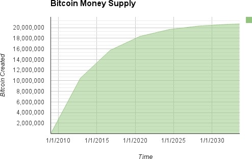

比特币发行的最大数量就是成为挖矿奖励的上限。实际情况，矿工故意挖哪些不足全额奖励的区块。这些区块已经开采，未来可能会有更多倍开采，这样导致货币发行总量下降。

比特币发行总量，代码位置 `code/max_money.py`，运行可以得到输出结构

	python max_money.py

	Total BTC to ever be created: 2099999997690000 Satoshis
总量有限，发行速度递减，创造了一种天然通缩模型。

- 通货紧缩	

	通货紧缩代表一种先确定的发行速度，递减的货币发行模式。通缩是一种由于货币供应和需求不匹配导致的货币增值现象。与通胀相反。货币购买力在增值
	
	经济学家提出通缩经济是一种无论如何都要避免的灾难型经济。因为在快速通缩时期，人民预期的商品价格会下跌，人民会储蓄货币，避免它被花掉。这种现象充斥了日本经济失去的十年中，因为需求崩塌后，导致了滞涨。
	
	而比特币经济学家认为，通缩本身并不坏，将通缩与需求崩塌联系在一起时因为过去出现了一个特例。法币世界，货币可能被无限制的印刷出来。除非遇到需求完全崩塌并且毫无发行货币意愿的情况，因此经济很难进入滞涨阶段。而比特币通缩并不是需求崩塌引起的，它遵循一种预定有节制的货币供应模型。
	
	通货紧缩的积极因素当然是与通胀相反。通胀导致货币缓慢但不可避免的贬值，这种隐性税收的形式，惩罚在银行存钱的人从而实现解救债务人(包括政府)。政府控制下的货币容易遭受债务发行的道德风险，之后可能会以牺牲储蓄者利益为代价，通过贬值来抹去债务。
	
	比特币这种不是因为快速衰退引起的通缩，是否发生其他问题还有待时间检验。
	
### 去中心化共识
比特币网络中，每个参与者都把能接受区块链，把它看作一本证明所有权的权威记录。在不考虑信任任何人的情况下，所有参与者如何达成所有权共识是一个最根本的问题。比特币不是靠创建中心机构来进行共识，而是网络中各节点独立完成。中本聪的主要发明就是去中心化的自发共识(emergent consensus) 机制。这种自发是指共识没有明确的完成点，因为共识达成时，没有明确的选举和固定时刻。共识的所有独立节点遵守了简单的规则，通过异步交互自发形成的产物。所有比特币、交易、支付都是用这套机制。这套共识有4个独立过程相互作用
	
- 每个全节点依据综合标准对每个交易进行独立验证
- 通过完成工作了证明算法的验算，挖矿节点将交易记录独立打包进新区块
- 每个节点独立对新区块进行校验和组装进区块链
- 每个节点对区块链进行独立选择，工作量证明机制下，选择累计工作量最大的区块链

### 交易的独立校验
比特币钱包通过收集 UTXO 、提供正确的解锁脚本、构建一个新的支付给接收者的一些列方式来创造交易。新交易随后被发送到生成交易节点临近的节点，从而使该交易能够在整个比特币网络传播。
	
然而，交易传递的临近节点前，每个收到交易的比特币节点将会首先验证交易，确保这个时有效交易才会在网络中传币，无效交易将被第一个节点抛弃。每一个节点在校验每一笔交易时，需要对照一个标准列表
	
- 交易的语法和数据结构正确性
- 输入与输出列表不为空
- 交易的节点大小是 max_block_size
- 每一个输出值与总量，必须在规定值范围内(小于 2100万，大于0)
- 没有哈希等于0，N 等于-1的输入
- nLocktime 是小于或等于 INT_Max的，或者 nLocktime and nSequence 的值满足 MediatimePast
- 交易的字节大小大于或等于 100
- 交易中的签名数量(SIGOPS)应小于签名操作数量上限
- 解锁脚本 scripSIG 只能够将数字压入栈，并且锁定脚本 scriptPubkey 必须符合 isStandard 格式，否则拒绝
- 池中或位于主分支区块中的一个匹配交易必须是存在的
- 对于每一个输入，引用的输出是必须存在的，并且没有被消费
- 对于每一个输入，如果引用的输出存在于池中任何别的交易中，该交易将被拒绝
- 对于每一个输入，在主分支和交易池中寻找引用的输出交易。如果输出交易缺少任何一个输入，该交易将成为孤儿交易。如果与其匹配的交易还没出现在池中，将被加入孤儿交易池
- 对于每一个输入，如果引用的输入交易是一个 Coinbase 输出，该输出必须至少获得 COINBASE_MATURITY(100)个确认。
- 引用的输出交易获得的输入值，并检查每一个输入值和总值是否在规定值的范围内(0>值<21000)
- 如果输入值的总和小于输出值的总和，交易被终止。
- 如果交易费用太低，以至于无法进入一个空块区，交易将被拒绝
- 每一个输入的解锁脚本必须依据相应输出的锁定脚本来验证

这些条件能够在标准的客户端下的 AcceptToMemoryPool、CheckTransaction、CheckInputs 函数中获得详细描述。需要注意的是，这些条件会随时间的变化发生改变，为了处理新型拒绝服务攻击，有时候也为交易类型多样化放宽标准。
	
在收到交易后，每一个节点都会在全网广播时对这些交易进行独立验证，并以接收时的相应顺序，为有效的新交易建立一个验证池（未确认），这个池可以叫做交易池或 memory pool 或 mempool

### 挖矿节点
在比特币网络中，一些节点被称为专业节点"矿工"。与其他完整节点相同，矿工节点在比特币网络中进行接收和传播未确认交易记录。但它们还可以将一些交易记录打包进新的区块。

这些节点监听传播到网络的新区块。而这些新加入的区块挖矿节点有特殊意义。矿工间的竞争以新区块的传播而结束，如同宣布谁是最后硬件。收到新的区块进行验证后，就意味着别人已经赢得上一轮的挖矿竞赛。然后上一轮的结束就代表下一轮的开始
### 打包交易至区块
验证交易后，比特币节点会将这些交易添加到自己的内存池中。内存池也叫交易池，用来存放尚未加入到区块的交易记录。与其他节点意义，矿工节点会收集、验证、传播这些新交易。而与其他节点不同，矿工节点会把这些交易整合到一个候选区块中。

例 

- 支付者的交易区块在  277，316。
- 一个矿工节点维护了一个区块链的本地副本。当支付者支付的时候，矿工节点的区块链已经收集了 277，314，并监听网络上的交易，尝试挖掘新区块的同时，也监听由其他节点发现的区块。
- 当挖矿节点挖矿时，它从比特币网络收到区块 277.315，那么它将结束这个竞争，开始 277.316 的竞赛
- 在上一个十分钟内，当挖矿节点寻找 277.316 区块答案同时，它在收集交易记录了下一个区块做准备。目前它已经收到了几百笔交易记录，并将它们放到内存池中，接收并验证区块 277.315 之后，交易节点会验证内存池中所有交易，并移除异常交易，比如 277.315 已经存在的交易，确保内存池中的交易都是未确认的。 
- 确保内存池数据后，矿工立刻会建立一个空区块，作为区块 277.316 的候选区块。(之所以是候选区块是因为矿工还没有工作量证明，找到工作量证明才是有效的)
- 然后矿工按照交易小费，进行排序，注意交易按照字节收小费，而不是价格。凑足或接近区块的 1MB。将小费多的交易合并到区块中。总费用可能为 0.09094925 个比特币，可以通过客户端来看
	- 查询区块哈希
		
			$ bitcoin-cli get blockhash 277316
		
			0000000000000001b6b9a13b095e96db41c4a928b97ef2d944a9b31b2cc7bdc4
	- 查询区块内容

			$ bitcoin-cli getblock 0000000000000001b6b9a13b095e96db41c4a928b97ef2d9\44a9b31b2cc7bdc4
			
			{
				"hash" :
				"0000000000000001b6b9a13b095e96db41c4a928b97ef2d944a9b31b2cc7bdc4",
				"confirmations" : 35561,
				"size" : 218629,
				"height" : 277316,
				"version" : 2,
				"merkleroot" :
				"c91c008c26e50763e9f548bb8b2fc323735f73577effbc55502c51eb4cc7cf2e",
				"tx" : [
				"d5ada064c6417ca25c4308bd158c34b77e1c0eca2a73cda16c737e7424afba2f",
				"b268b45c59b39d759614757718b9918caf0ba9d97c56f3b91956ff877c503fbe",
				... 417 more transactions ...// 这一行显示交易数量
			],
			"time" : 1388185914,
			"nonce" : 924591752,
			"bits" : "1903a30c",
			"difficulty" : 1180923195.25802612,
			"chainwork" : "000000000000000000000000000000000000000000000934695e92aaf53afa1a",
			"previousblockhash" : "0000000000000002a7bbd25a417c0374cc55261021e8a9ca74442b01284f0569"
			}

### 创币交易
区块中的第一笔交易时特殊交易，称为创币交易或者 coinbase 交易。这个交易是由挖到矿的矿工节点构造并用来奖励自己所做的贡献的。矿工节点会创建向我自己的钱包支付挖矿奖励的比特币个数 (随时间推移而变化，现在是25.09094928个) 的交易，把生成交易的奖励发送到自己的钱包里。矿工挖出区块获得的奖励金额是 coinbase 奖励(25个全新的比特币)和区块中全部交易矿工费的总和。使用命令行查询创币交易

	$ bitcoin-cli getrawtransaction d5ada064c6417ca25c4308bd158c34b77e1c0eca2a73cda16c737e7424afba2f 1
	
	{
		"hex":"01000000010000000000000000000000000000000000000000000000000000000000000000ffffffff0f03443b0403858402062f503253482fffffffff0110c08d9500000000232102aa970c592640d19de03ff6f329d6fd2eecb023263b9ba5d1b81c29b523da8b21ac00000000",
		    "txid":"d5ada064c6417ca25c4308bd158c34b77e1c0eca2a73cda16c737e7424afba2f",
		    "version":1,
		    "locktime":0,
		    "vin":[
		        {
		            "coinbase":"03443b0403858402062f5 03253482f",
		            "sequence":4294967295
		        }
		    ],
		    "vout":[
		        {
		            "value":25.09094928, #这里，整数部分是挖矿奖励，小数部分是交易小费
		            "n":0,
		            "scriptPubKey":{
		                "asm":"02aa970c592640d19de03ff6f329d6fd2eecb023263b9ba5d1b81c29b523da8b21 OP_CHECKSIG",
		                "hex":"2102aa970c592640d19de03ff6f329d6fd2eecb023263b9ba5d1b81c29b523da8b21ac",
		                "reqSigs":1,
		                "type":"pubkey",
		                "addresses":[
		                    "1MxTkeEP2PmHSMze5tUZ1hAV3YTKu2Gh1N"
		                ]
		            }
		        }
		    ]
		}	
与常规交易不同，创币交易没有输入，不消耗 UTXO ，它只包含一个被称作 coinbase 的输入，仅仅用来创建新比特币。创建交易有一个输出，创建金额为 25.09094928 个比特币发送矿工的比特币地址为

	1MxTkeEP2PmHSMze5tUZ1hAV3YTKu2Gh1N
- coinbase (创币交易)奖励与矿工费

	为了构建创币交易，矿工节点需要计算矿工费总额，将这个 418 个已经添加到区块交易的输入和输出分别进行求和，然后用输入总额减去输出总额的到交易小费。共识如下
	
		Total Fees = Sum(Inputs) - Sum(Outputs)
	在区块 277.316 中，矿工费总额为 0.09094925 ,紧接着， 矿工节点计算出这个新区块正确的奖励。奖励额的计算是基于区块高度，以每个区块 50 个比特币开始，每生产 210，000 区块减半一次，这个区块高度是 277.316，正确的奖励是 25 个比特币。
	
	计算区块奖励一函数 `GetBlockValue` 在 Bitcoin Core 的 `main.cpp` 中
	
		CAmount GetBlockSubsidy(int nHeight, const Consensus::Params & consensusParams)
		
		{
			int halvings = nHeight / consensusParams.nSubsidyHalvingInterval;
			/
			/ Force block reward to zero when right shift is undefined.
			if (halvings >= 64)
				return 0;
			CAmount nSubsidy = 50 * COIN;
			
			// Subsidy is cut in half every 210,000 blocks which will occur approximately
			every 4 years.
			nSubsidy >> = halvings;
			return nSubsidy;
		}
	变量 Subsidy 表示奖励额，值为 COIN 常量(100,000,000聪)与 50 的乘机，也就是初始奖励 50 亿聪。 紧接着，这个函数用当前区块高度除以减半间隔( `SubsidyHalvingInterval` 函数)得到减半次数( 变量 halvings ) 。每个 210，000 个区块为一个减半间隔，对应本例中的区块 277，316，所以减半次数为1。变量 halvings 最大值 64，如果超过这个值，代码算得的奖励额为 0.
	
	这个函数会使用二进制右移操作将奖励额(变量 nSubsiby) 右移一位(等同于除2)，每一轮减半右移动一次。在这个例子中，右移动一次，得25个比特币。之所以采用右移，是因为相比整数或浮点除法，右移效率更高。 最后，将 coinbase 奖励额(nSubsidy) 与矿工的 nFee 总额求和，返回这个值。
	
	矿工把 coinebase 交易写入区块，如何防止写入更多的比特币，因为比特币网络都是各自验证网络，所以不正确的奖励将无法得到其他节点的确认，被丢弃。这样就浪费了矿工的工作量证明。 
- 创币交易的结构

	经过矿工节点构造了一个创币交易，支付给自己 25.09094928 比特币。 创币交易的结构比较特殊，与一般交易输入需要指定一个先前的 UTXO 不同，包含一个 `coinebase` 输入。常规交易输入与创币交易输入对比结构
	- 常规交易输入结构
	
		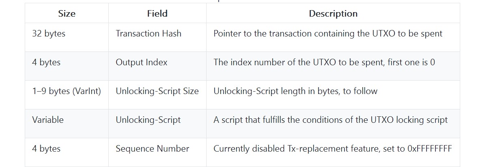
	- 创币交易输入结构
			
		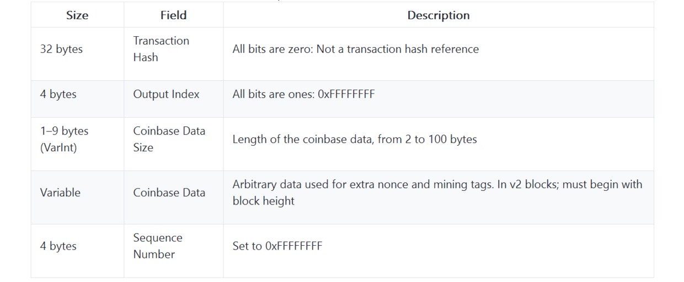
	在创币交易中，“交易哈希” 字段 32 个字节全部填充0， “交易输出索引” 字段全部填充为 0xFF(255)，这2个字段的值表示不引用 UTXO。解锁脚本由创世交易数据代替，数据可以由矿工定义。
- 创世币数据	

	创币交易不包含"解锁脚本 scriptSig" 字段，这个字段被创币交易数据代替，长度最小2字节，最大 100 字节。除了开始几个字节外，矿工可以任意使用创币交易的其他部分，随意填充任何数据。
	
	以创世块为例，中本聪在创世交易中天写了这样的数据
	
		The Times 03/Jan/2009 Chancellor on brink of second bailout for banks(泰晤士报 2009年 1 月 3 日 财政大臣将再次对银行施以援手)
	创币交易前几个字节也曾可以随意填写，不过在BIP-34 规定了版本2的区块，这个区块高度必须根脚本操作 "push" 之后，填充在创世交易字段的启始处。
	
	上例中区块 277.316 为例，创币交易就是交易输入 "解锁脚本 scriptSig" 字段，这个字段的十六进制值为
	
		03443b0403858402062f503253482f
	解码如下
	
	- 第一个字节 03，脚本执行引擎执行这个指令将后面3个字节压入脚本栈
	- 紧接着3个字节 44、3b、04 是以小端格式编码区块高度，翻转字节得到 04、3b、44 表示十进制为 277，316
	- 紧接着几个十六进制数 03、85、84、02、06 用于编码  extra nonce(随机值位方案)，或者一个随机值，从而求解一个适当的工作量证明
	- 最后部分  2f、50、32、53、48、2f 是 ASCII 编码字符 P2SH ，表示挖出这个区块的挖矿节点支持 BIP-0016 定义的 P2SH 改进方案。

	在 P2SH 功能引入比特币，候选者包含 BIP0016和BIP0017。支持BIP0016的矿工将 P2SH 放入创币交易中，支持 BIP0017的矿工将 P2SH/CHV 放入创币交易中，最后 BIP0016 获胜。
	
	使用了 libbitcoin 库，从创世块中提取创币交易数据，并显示出中本聪留下的信息。 libbitcoin 库自带了一份创世块的静态拷贝，工具编码在 `code/satoshi-words.cpp\[\]`
	
		$ # Compile the code
		$ g++ -o satoshi-words satoshi-words.cpp $(pkg-config --cflags --libslibbitcoin)
		$ # Run the executable
		$ ./satoshi-words
			^D��<GS>^A^DEThe Times 03/Jan/2009 Chancellor on brink of second bailout for banks

### 构造区块头
为了构建区块头，挖矿节点需要填充6个字段，

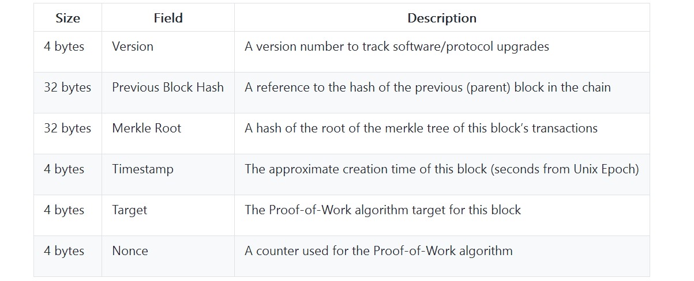					
	
- 在区块 277.316 被挖出的时候，区块结构中用来表示版本号的字段值为 2 ，长度为4 字节，以小端格式编码值为 0x20000000
- 接着，挖矿节点需要填充 "前区块哈希"，也就是 277.315 区块头哈希值，为 `0000000000000002a7bbd25a417c0374cc55261021e8a9ca74442b01284f0569` 作为 277.316 候选区块的父区块。
- 为了向区块头填充 merkle 根，要将全部的交易组成一个 merkle 树。创币交易作为区块中首个交易，将 418 笔交易添加其后，这样区块中就有 419 笔交易。
- 因为 merle 树必须是偶数叶子节点，所以需要复制最后的一个交易作为 420 个叶子节点，每个叶子节点是对交易的哈希值。 这些交易哈希值逐层成对组合，直到最后一个根节点。 merkle 树的根节点将全部交易的摘要哈希为1个 32 字节长度值， merkle 根的值如

		c91c008c26e50763e9f548bb8b2fc323735f73577effbc55502c51eb4cc7cf2e
- 挖矿节点会继续添加一个 4字节的时间戳，以 Unix 纪元时间编码 `1388185914` 2013年12月27号
- 挖矿节点需要填充 target 字段(难度目标值)，为了使该区块有效，这个字段定义了所需满足的工作量证明的难度。难度在区块中以 "尾数-指数" 的格式，编码并存储，这种格式称作  target bits 难度位。最后一个字段是 nonce ，初始值为0.
	- 277316 的难度位是 `0x1903a30c`
		-  `0x19` 使指数的十六进制格式
		-  `03a30c` 是系数

区块头完成全部的字段填充后，挖矿就可以开始进行了。挖矿的目标是找到一个使区块头哈希值小于难度目标的 nonce 。挖矿节点通常需要尝试数十亿甚至数百亿次不同的 nonce 取值，直到找到一个满足条件的 nonce。

### 构建区块
既然挖矿节点已经构成了一个候选区块，那么就轮到矿机对这个新区块进行挖掘，求解工作量证明算法以使这个区块有效。挖矿过程依然使用的是 sha256 哈希函数。

挖矿就是重复计算区块头的哈希值，不断修改该参数，直到找到与哈希值匹配的一个过程。哈希函数的结果无法提前得知，也没有能得到一个特定哈希值的模式。哈希函数的这个特性意味着:得到哈希值的唯一方式就是暴力破解，不断尝试，每次修改随机输入，直到出现匹配的哈希值。

- 工作证明算法

	哈希函数输入一个任意长度的数据，输出一个长度固定且值不相同，可将其视为输入的数字指纹。对于特定输入，哈希的结果每次都一样。任何人都可以使用相同的哈希函数，计算和验证哈希结果。一个加密哈希函数的主要特征就是不同的输入几乎不可能出现相同的数字指纹。因此，选择一个输入去生成一个想要的哈希值是不可能的。 无论输入大小，sha256 输出的长度都是 256 bit。例如
	
		$ python
		Python 2.7.1
		>>> import hashlib
		>>> print hashlib.sha256("I am Satoshi Nakamoto").hexdigest()  # 输入值
		5d7c7ba21cbbcd75d14800b100252d5b428e5b1213d27c385bc141ca6b47989e #输出哈希
	证明逻辑 `code/hash\_example.py\[\]` nonce,执行这个脚本生成末尾数字不同的哈希值。如
	
		$ python hash_example.py
		I am Satoshi Nakamoto0 => a80a81401765c8eddee25df36728d732...
		I am Satoshi Nakamoto1 => f7bc9a6304a4647bb41241a677b5345f...
		I am Satoshi Nakamoto2 => ea758a8134b115298a1583ffb80ae629...
		I am Satoshi Nakamoto3 => bfa9779618ff072c903d773de30c99bd...
		I am Satoshi Nakamoto4 => bce8564de9a83c18c31944a66bde992f...
		I am Satoshi Nakamoto5 => eb362c3cf3479be0a97a20163589038e...
		I am Satoshi Nakamoto6 => 4a2fd48e3be420d0d28e202360cfbaba...
		I am Satoshi Nakamoto7 => 790b5a1349a5f2b909bf74d0d166b17a...
		...	 
	因为输入随机值不同，每个哈希值都不同，但可以在任何计算机上重现。语句末尾的变化数字叫做 nonce 随机数。为了让这个工作证明更有难度，会设立一个木币啊，找到一个语句使之哈希值的十六进制表示以0开头。这个值在第13次就命中了。
	
		I am Satoshi Nakamoto13
		结果
		0ebc56d59a34f5082aaef3d66b37a661696c2b618e62432727216ba9531041a5
	可以从估计现实目标难度取得成功所需的工具。算法基于诸如 SHA256 的确定性函数时，输入本身就成为证据，必须要有一定的工作量才能产出低于目标的结果。因此，称为工作量证明。虽然每次尝试产生一个随机结果，但任何结果的概率可以预先计算。因此，指定特定难度的结果构成了具体的工作量证明。
	
	上面的 nonec 13 加上 `I am Satoshi Nakamoto` 就是工作量证明(Proof of Work),因为它证明了花时间找到 nonce 。验证这个哈希值只需要一次计算，而找到它却需要 13 次。如果目标值更小，则难度更大，那计算出对应的结果就需要更多的 nonce 计算。
	
	比特币的工作量证明和上面的情况很类似，矿工计算命中概率是  10^15 次方/次 才才可以匹配出足够精准的哈希值。简化的工作量证明算法，代码位置  `code/proof-of-work-example.py\[]`，这里可以任意调整难度值
	
		$ python proof-of-work-example.py*
		Difficulty: 1 (0 bits)
		[...]
		
		Difficulty: 8 (3 bits)
		Starting search...
		Success with nonce 9
		Hash is 1c1c105e65b47142f028a8f93ddf3dabb9260491bc64474738133ce5256cb3c1
		Elapsed Time: 0.0004 seconds
		Hashing Power: 25065 hashes per second
		Difficulty: 16 (4 bits)
		Starting search...
		Success with nonce 25
		Hash is 0f7becfd3bcd1a82e06663c97176add89e7cae0268de46f94e7e11bc3863e148
		Elapsed Time: 0.0005 seconds
		Hashing Power: 52507 hashes per second
		Difficulty: 32 (5 bits)
		Starting search...
		Success with nonce 36
		Hash is 029ae6e5004302a120630adcbb808452346ab1cf0b94c5189ba8bac1d47e7903
		Elapsed Time: 0.0006 seconds
		Hashing Power: 58164 hashes per second
		[...]
		
		Difficulty: 4194304 (22 bits)
		Starting search...
		Success with nonce 1759164
		Hash is 0000008bb8f0e731f0496b8e530da984e85fb3cd2bd81882fe8ba3610b6cefc3
		Elapsed Time: 13.3201 seconds
		Hashing Power: 132068 hashes per second
		Difficulty: 8388608 (23 bits)
		Starting search...
		Success with nonce 14214729
		Hash is 000001408cf12dbd20fcba6372a223e098d58786c6ff93488a9f74f5df4df0a3
		Elapsed Time: 110.1507 seconds
		Hashing Power: 129048 hashes per second
		Difficulty: 16777216 (24 bits)
		Starting search...
		Success with nonce 24586379
		Hash is 0000002c3d6b370fccd699708d1b7cb4a94388595171366b944d68b2acce8b95
		Elapsed Time: 195.2991 seconds
		Hashing Power: 125890 hashes per second
		[...]
		
		Difficulty: 67108864 (26 bits)
		Starting search...
		Success with nonce 84561291
		Hash is 0000001f0ea21e676b6dde5ad429b9d131a9f2b000802ab2f169cbca22b1e21a
		Elapsed Time: 665.0949 seconds
		Hashing Power: 127141 hashes per second
	随着难度的增加，查找正确值的时间呈指数级增长。考虑整个 256 Bit 数字空间，每次要求多一个0，就把哈希查找空间减少一半。为了寻找一个 nonce 组合哈希值开头的 26 位值为0，需要尝试 8 千万次。哈希值开头零越多，意味着接受哈希值的范围就大幅减少，因此更困难。生成下一区块的网络每秒计算 `1.8 septa-hashes` (thousand billion billion-10万亿亿次) ,整个比特币网络计算能力为 `3EH/sec` 处理能力，平均每 10分钟找到一块。
- 难度表示

	难度位简称为 `bits` 在区块链 277，316 中，它的值为 `0x1903a30c` 。这个标记值被存为系数/指数格式，前两位十六进制数字为幂(exponent)，接下来得六为系数(coefficient)。在这个区块力， 0x19 为幂，而 0x03a30c 为系数。计算公式为
	
		target = coefficient \* 2^\(8 \* \(exponent – 3\)\)
	由此公式及难度位的值 `0x1903a30c` 得
	
		target = 0x03a30c * 2^(0x08 * (0x19 - 0x03))^
		=> target = 0x03a30c * 2^(0x08 * 0x16)^
		=> target = 0x03a30c * 2^0xB0^
	按十进制计算
	
		=> target = 238,348 * 2^176^
		=> target =
		22,829,202,948,393,929,850,749,706,076,701,368,331,072,452,018,388,575,715,328
	转化为十六进制后
	
		=> target =
		0x0000000000000003A30C00000000000000000000000000000000000000000000
	也就是说高度为 277，316 的有效区块的头信息哈希值是小于这个目标值的。这个数字的二进制表示中前 60 位都是0.在这个难度上，1个每秒可以处理 1万亿哈希计算的矿工(1TH/s)平均每 8.496 个区块才能找到一个正确结果，换句话说，平均每 59 天，才能计算出某个区块正确的哈希。
- 难度目标与难度调整

	目标决定了难度，进而影响求解工作量证明算法所需要的时间。比特币区块平均每 10 分钟生成一个。这就是比特币的心跳，是货币发行速率和交易达成速度的基础。这个必须是一个恒定的，随着计算机性能的发展，矿工的不断变化，为了能让新区块保持10分钟1个的生产速率，挖矿的难度必须根据这些变化进行调整。实际上，难度是一个动态的参数，会定期调整以达到每 10 分钟一个新区块的目标，无论挖矿能力如何。
	
	在去中心化的网络中，难度调节是每个全节点独立自动完成的。每 2016 个区块中的所有节点都会调整难度。难度的调整公式是由最新 2016 个区块花费的时间与 20160 分钟比较得出。难度根据实际与期望时长的比值相应调整。公式
	
		New Difficulty = Old Difficulty \* \(Actual Time of Last 2016 Blocks / 20160 minutes
	工作量证明的难度调整算法(pow.cpp 中的 `CalculateNextWorkRequired()` 函数)
	
		// Limit adjustment step
		int64_t nActualTimespan = pindexLast->GetBlockTime() - nFirstBlockTime;
		LogPrintf("
		nActualTimespan = %d
		before bounds\n", nActualTimespan);
		if (nActualTimespan < params.nPowTargetTimespan/4)
			nActualTimespan = params.nPowTargetTimespan/4;
		if (nActualTimespan > params.nPowTargetTimespan*4)
			nActualTimespan = params.nPowTargetTimespan*4;
		
		// Retarget
		const arith_uint256 bnPowLimit = UintToArith256(params.powLimit);
		arith_uint256 bnNew;
		arith_uint256 bnOld;
		bnNew.SetCompact(pindexLast->nBits);
		bnOld = bnNew;
		bnNew *= nActualTimespan;
		bnNew /= params.nPowT argetTimespan;
		if (bnNew > bnPowLimit)
			bnNew = bnPowLimit;
	之前因为客户端的一个bug，导致 2015 个块计算时间，导致偏差 0.05%。参数 Interval (2016个块)和 TargetTimespan(1,209,600 秒｜两周) 的定义在 `chainparams.cpp` 中。
	
	为了防止变化过快，每个周期的调整幅度必须小于一个因子(值为4)。如果要调整的幅度大于 4 倍，则按 4 倍调整。(因为难度周期会一直循环，所以难度会持续修正。)
	
	值得注意的是，目标难度与交易的数量和金额无关。这意味着哈希算力的强弱、电力的肉入，与交易完全无关。当比特币规模变大时，使用它的人会更多，即使哈希保持当前水平，比特币安全也不会受到影响。目标难度和挖矿电力消耗与比特币兑换现金以支付这些电力之间的关系密切。高性能挖矿系统就要用当前最高效的电力转化为哈希算力。挖矿市场的关键因素就是每度电转化为比特币后的价格。因为这个决定了挖矿活动的营利性，也刺激人们选择进入或退出挖矿市场。

### 成功构建区块
矿工节点创建了一个候选区块，准备拿它来挖矿。矿工安装了几个 ASIC 的矿机，上面有几千万的电路可以快速的并行计算 SHA256 算法。这些定制的硬件通过 USB 连接到他的挖矿节点上。通过电脑上的挖矿节点将区块头信息传送给这些硬件，让它们来计算 nonce 测试。

在对区块 277，316 的挖矿工作开始 11分钟后，这些硬件其中一个求到了正确结果，并发给挖矿节点。这个结果放进区块头时， nonce 4,215,469,401 次计算产生了 

	0000000000000002a7bbd25a417c0374cc55261021e8a9ca74442b01284f0569
这个值小于目标难度

	0000000000000003A30C00000000000000000000000000000000000000000000
矿工节点立即将这个区块发给他所有相邻的节点。这些节点在接收并验证这个新区块后，也会继续传播这个区块。当新区块在网络中散播时，每个节点都会将它作为 277，316 区块加入到自身的区块链中。当挖矿节点收到并验证了这个新区块后，它们会放弃之前的构建与这个相同高度区块的计算，并立即开始计算区块链下一个区块工作。
### 校验区块
共识机制的第三部是通过网络中功能每个节点独立校验每个新区块。当新区块在网络中传播时，每一个节点在将它转发到其他节点之前，会进行一系列的测试去验证它。这个确保了只有有效的区块会在网络中传播。

- 独立校验还确保了诚实的矿工生成的区块可以纳入整个区块网络，从而获得奖励
- 独立校验惩罚不诚实的矿工，浪费了它们的电力，导致亏损

当一个节点接收到一个新的区块，它将对照一个长长的标准清单对该区块进行验证，若没有通过验证，这个区块将被拒绝。这些标准可以在比特币核心客户端函数中的 `CheckBlock` 和 `CheckBlockHead` 中获取，它包括

- 区块的数据结构语法上有效
- 区块头的哈希小于目标难度(工作量证明)
- 时间戳早于验证时刻未来的2个小时(允许时间错误)
- 区块大小在长度限制之内
- 第一个交易(只有第一个)是创币交易
- 使用检查清单验证区块内的交易并确保它们的有效性

每个节点对每个新区块都独立校验。

### 区块链的组装与选择
区块链共识机制的最后一步是将区块链集合至有最大工作量证明的链中，一旦一个节点验证了一个新的区块，它将尝试新的区块链接到现在的链上，将它们组合起来。

节点维护三种区块

- 第一种是链接到主链上的
- 第二种是从主链上产生分支的(备用链)
- 第三种是已知链中没有找到父区块的

验证过程中，一旦发现不符合标准，验证就会失败，这样的区块将被节点决绝。任何时候，主链都是累积了最多难度的区块链。一般情况下，主链也包含最多的区块的那个链，除非两个等长链，并且其中一个有更多的工作量证明。主链也会有分支，这些分支中的区块与主链上的区块互相为兄弟区块。这些区块是有效的，但不是主链的一部分。保留这些分支的目的是如果后续未来某个时刻，它们延长了并在难度上超越了主链，那么后续的区块就会引用它们。

当节点接收到新区块，将会尝试将这个区块插入现有区块链，节点会看到区块的 `previous block hash` 字段，这个字段是该区块对其父区块的引用。同时，新的节点将尝试在已存在的区块链中找到这个父区块。

- 大多数情况下，父区块的主块链的顶点，意味着新区块延长了主链。例如，一个新区块 277，316 引用了父区块 277，315。收到 277.316 区块的大部分节点都将 277.315 作为主链顶端，因此链接到这个新区块并延长区块链。
- 有的时候，新区块延长的区块链不是主链，这种情况下，新区块会被添加到备用链，同时比较备用链与主链的长度，如果比主链长，节点将收敛于备用链，意味着节点将选择备用链为主链，而主链更换成备用链。如果节点矿工，它构建新区块时，来延长这个更新更长的区块链。
- 收到的有效区块不存在于当前本地任何链，这个块就认为是孤块。孤块会被保存在孤块池中，直到它的父区块被节点找到。一旦找到父区块，并将其链接到现在的区块链上，节点就会从孤块从孤块池中取出，并链接到它的父区块，让它作为区块链的一部分。(这种情况可能是2个区块间隔比较短挖出来，传输可能导致顺序不一致)

选择了最大难度区块链后，所有节点最终在全网内达成共识，随着更多的工作量证明被加到链中，链的暂时性差异最终会得到解决。挖矿节点通过 “投票” 来选择它们想要延长的区块链，当它们挖出了一个新块并延长了一个链，新块本身就代表了这种投票。

- 区块分叉

	区块链是去中心化数据结构，不同副本之间不能总保持一致。区块有可能在不同的时间到达不同的节点，导致节点有不同的区块链全貌。解决办法是，每一个节点总是选择并尝试延长累积了最大工作量证明的区块链，也就是最长累积工作的链(greatest cumulative work chain) 节点通过累加链上的每个区块的工作量，得到建立这个链所要付出的工作量证明的总量。只有所有的节点选择最长累计折旧工作的区块链，整个比特币网络最终会收敛到一致的状态。分叉即在不同区块链间发生临时差异，更多的区块添加到某个分叉中，这个问题就会解决。
	
	通过网络跟踪 fork 事件进展，便于描述不同的区块被显示为不同的形状(星形、三角形、倒三角、菱形)，遍布网络。网络中的每个圆表示一个节点。 每个节点都有自己的全局区块链视图。当每个节点从其临近及诶单接收到区块时，它会更新其自己的区块副本，选择最长链。每个节点包含一个图形形状，表示它相信的区块处于主链的顶端。
	
	星型意味着该节点认为星形区块处于主链的顶端。网络有一个统一的区块视角，以星形区块为主链的顶点。
	
	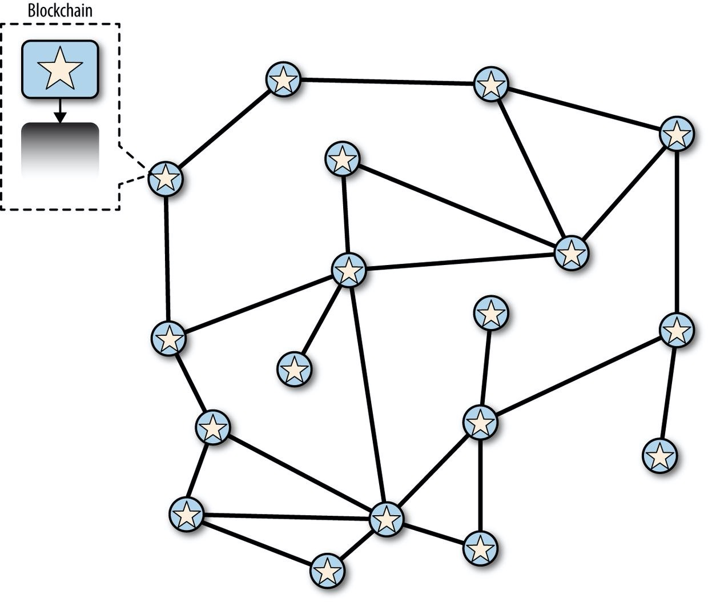
	
	当有两个候选区块同时想要延长最长链时，分叉就会发生。正常情况，分叉发生在两个矿工较短的时间内，格子都计算了工作量证明，两个矿工在各自候选区块发现解，便立即传播自己的获胜区块到网络中，先是传播给临近的节点，而后传播到整个网络。每个收到节点都会自己验证并延长到自己的区块链中。如果节点随后又收到了另一个候选区块，而这个区块又拥有同样的父区块，那么节点会将这个区块链接到候选链上，其结果是，一些节点收到了一个候选区块，另一些收到了另一个候选区块。这时2个版本的区块链就出现了。我们看到两个矿工 NodeX 和 NodeY 几乎同时挖到2个不同的区块在同一高度。这2个区块是顶点区块-星形区块的子区块，可以延长这个区块链。为了方便查看，
	
	- 把节点 X 产生的区块标记为三角形

		矿工节点x 找到扩展区块链工作量证明的解，即三角形区，构建在星形父区块的顶端。
	- 把节点y产生的区块标记为倒三角形

		矿工节点 Y 也找到了扩展区块工作量证明解，即倒三角区块作为候选区块。
	
	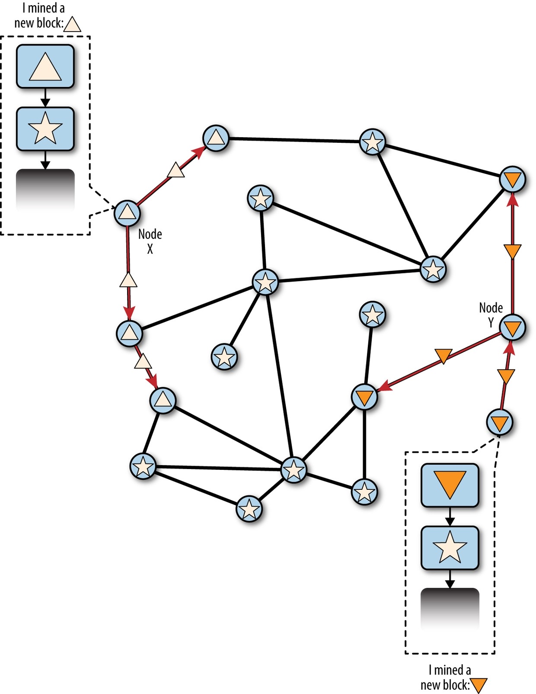

	两个区块均有效，包含了工作量证明解并延长了同一父区块。这两个区块可能包含的交易几乎相同，只是顺序上有些不同。网路传播也是一些节点合并了x 一些节点合并了y，
	
		
	
	由于其他节点第一次接收 x 或 y 后，第二次收到另外一个时，由于第二次收到，所以判定时无效，但不会被丢弃，而会被链接倒父区块，形成备用链。这会网络上存在2个同时存在等长的区块链		
			
				
		
	这个时候 z 节点挖掘出了新的备用区块，图里是棱形，然后它开始向邻居节点发送，注意这里的 z 节点的父区块是由 x 节点提供的。
	
		
	
	最后 z 节点的新区块刷到了全网，所有节点均使用棱形和 x 的父区块来做新的主链。分叉合并。
	
	单区块分叉每周都会发生，而双区块就很罕见了。

### 挖矿和算力竞争
挖矿是一个极富竞争星的行业，从比特币开始，每年的比特币算力成指数增长。有些时候，还会因为科技进步，会将算力提升一次飞跃，如采用 gpu 挖矿， fgpa 挖矿、 asic 挖矿最终到 SHA256 算法的专用芯片。五年的算力增长

时间|算力
2009|0.5 MH/sec–8 MH/sec (16× growth)
2010|8 MH/sec–116 GH/sec (14,500 × growth)
2011|16 GH/sec–9 TH/sec (562× growth)
2012|9 TH/sec–23 TH/sec (2.5 × growth)
2013|23 TH/sec–10 PH/sec (450 × growth)
2014|10 PH/sec–300 PH/sec (3000 × growth)
2015|300 PH/sec-800 PH/sec (266× growth)
2016|800 PH/sec-2.5 EH/sec (312× growth))
			
可以看到两年里，矿业和比特币的成长引起了比特币网络算力的指数增长(每秒网络总算力),

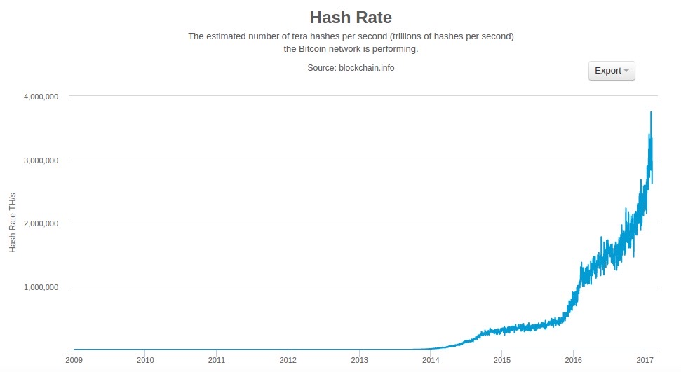

难度也随着相应增长	   	

近两年 ASIC 芯片变得更密集，特征尺寸接近前沿 16 纳米，挖矿利润率驱动了这个行业比通用计算发展更快。制造商正在设计 14 纳米芯片。行业触及了摩尔定律最前沿，每 18 个月增加一倍。

- 随机值升位方案	 (the extra nonce solution)

	比特币挖矿发展出一个解决区块头基本结构限制的方案。早期矿工可以通过遍历随机数(nonce) 获得符合要求的 hash 来挖出一块。难度增加后，矿工经常在计算了 40亿次后还没出块。然后这个很容易通过读取块的时间戳并计算经过的时间来解决。因为时间戳是区块头的一部分，可以让矿工用不同的随机值再遍历。
	
	当硬件速度到达了 4GH/s,这个方法就不好用了，随机数取值在1秒钟就被用尽了。当出现 ASIC 矿机并很快达到了 TH/s 速率后，挖矿软件为了找到有效的块，需要更多的空间来存储 nonce 值。可以把时间戳后延。但不能延长太远而失效。
	
	区块头需要信息源的一个新变革，解决方案是使用创币交易作为额外的随机值来源，因为创币交易脚本可以存储 2-100 字节的数据，矿工开始使用这个空间作为额外随机值的来源，允许它们去探索一个大得多的区块头值范围来找到有效的块。这个创币交易包含 Merkle 树中，这意味着任何创币交易脚本的变化将导致 Merkle 根的变化。
	
	8个字节额外的随机数+4字节的标准随机数，允许矿工每秒尝试 2^96 (8后面28个零)种可能性，而无序修改时间戳。如果未来矿工算力穿过了所有可能性，还可以通过修改时间戳来解决。同样创币交易脚本中也有更多额外空间可以倍用来做随机数。
- 矿池

	竞争环境中，个体独立工作没有一点机会，它们找到一个区块以抵消电力和硬件成本的几率非常小，最快的消费型 asic 也不能和哪些在巨大机房里拥有数万芯片的矿厂竞争。
	
	现在个体矿工组合成矿池，汇聚数以千计的参与者算力分享奖励。通过参加矿池，矿工得到整体的回报一小部分，每天都能得到，因而减少了不确定性。
	
	例子，假设矿工算力为 14,000 GH/S 或 14TH/s。2017 年值 2500 美元。该设备运行的功率是 1.3 千瓦，每日耗电 32 度，日平均成本 1 或 2 美元。以目前的比特币难度，该设备挖出一个比特币平均要 4年。如果在时限内挖出一个，奖励 12.5 个比特币，价值1000美元。可以得到 12，500 美元，这收入无法覆盖电力和硬件成本，亏损 1000 美元。而在4年时间，周期内能挖出一个块还要靠运气。这样可能遭受更大损失。
	
	个人矿工在建立矿池账户后，设置它们的矿机链接矿池服务器。它们挖矿设备在挖矿时保持和矿池服务器的链接，和其他矿工同步各自工作。这样矿池中的矿工分享挖矿任务，之后分享奖励。成功出块的奖励支付到矿池的比特币地址，而不是单个矿工，一旦达到了一个特定的阈值，矿池服务器便会支付奖励到矿工的比特币地址。
	
	通常情况下，矿池服务器会为提供矿池服务收取一个点的费用。参与矿池的矿工把搜寻候选区块的工作量分割，并根据它们挖矿的贡献分区份额。矿池为赚取份额设置了一个低难度的目标，通常比特币网络难度低1000倍以上。当矿池中的人成功挖出一块，矿池获得奖励。设置一个较低的难度钱，使用比特币工作量算法衡量每个矿工的贡献度，这样可以保证公平和避免作弊。通过设置一个较低的份额难度，矿池可以计算出每个矿工完成的工作量。每当矿工发现一个小于矿池难度的区块头哈希，就证明了它已经完成了寻找结果所需的哈希计算。更重要的是，可以根据统计学可衡量的方法，整体寻找一个网络散列值。成千山万的小矿工尝试较小的区间哈希，最终得到符合比特币网络要求的结果。
- 托管矿池

	大部分矿池意味着一个公司或者一个经营者经营一个矿池服务器，矿池服务器的所有者叫矿池管理员，同时它的收入从所得抽取百分之一作为费用。矿池服务器运行专业软件，用来协调矿池中矿工活动的矿池采矿协议。矿池服务器同时也链接到一个或者多个比特币完全节点，并直接访问一个区块链完整数据副本。这使得矿池服务器可以代替矿池中的矿工验证区块和交易，缓解它们运行一个完整节点的压力。
	
	对于矿池中的矿工，这是一个重要的考量，因为一个完整节点要求一个拥有最少 100-150GB 的永久磁盘和 2-4GB 内存专用计算机。另外运行完整节点需要频繁的监控、维护和升级。对于缺乏维护和资源导致当机，都会伤害到矿工的利益。对于矿工来说，不需要维护全节点也是最大好处。
	
	矿工链接矿池服务器使用一个采矿协议比如 Stratum(STM) 或 GetBlockTemplate(GBT)。一个旧标准 GetWork(GWK) 自从 2012年底已经基本过时，因为它不支持哈希速度超过 4GH/s 的矿工。 STM 和 GBT 协议都创建包含候选区块头模版的区块模版。
	
	- 矿池服务器通过打包交易，添加创币交易，计算 Merkle 根，并链接上一个块哈希来建立候选区块。
	- 这个候选区块的头部作为模版分发给每个矿工。
	- 矿工用这个区块模版在地域比特币网络难度的条件下采矿，
	- 成功后发送结果给矿池赚取份额。
- p2p 矿池

	矿池管理人作弊，利用矿池进行双重支付或使区块无效。(共识攻击) 此外，中心化矿池服务器代表单点故障，如果因为拒绝攻击服务器挂了或被减慢，矿池矿工就不能采矿。
	
	2011 年，为了解决中心化造成的问题，提出和实施了一个新的矿池挖矿方法。 P2Pool 是一个点对点矿池，没有中心管理人。 P2Pool 通过将矿池服务器的功能去中心化，并实现了一个并行类似区块链的系统，叫份额链(share chain)。一个份额链是一个难度低于比特币区块链的区块链系统。 份额链允许池中矿工在一个去中心化的池中合作，以每 30 秒一份额区块的速度在份额链上采矿，并获得份额。份额链上的区块记录贡献工作的矿工份额，并继承了之前的份额区块上的份额记录。当一个份额区块上还实现了比特币网络的难度目标，它将广播含有比特币的区块链上，并奖励所有已经在份额链区块中取得份额的矿工。
		
	本质上说，比起用一个矿池服务器记录矿工的份额和奖励，份额链允许所有矿工通过类似的比特币区块链系统的去中心化共识机制跟踪所有份额。P2Pool 采矿方式币矿池采矿方式复杂得多，因为它要求矿工运行空间、内存、带宽充足的专用计算机来支持一个比特币完整节点和 P2Pool 节点软件。 矿工连接他们采矿硬件到本地 P2Pool 节点，它通过发送区块模版到采矿机来模拟一个矿池服务器的功能。在 P2Pool ，单独的矿工创建自己的候选区块，打包交易，类似独立矿工，但它们在份额链合作采矿。
	
	P2Pool 减少了采矿池运营商的中心化，但也容易收到 51% 份额链攻击，P2Pool 的广泛采用并不能解决比特币本身的 51% 攻击问题，相反，P2Pool 整体似的比特币更为强大。
- 共识攻击

	当一个或一群拥有了整个系统中很大算力的矿工出现后，他们就可以通过攻击比特币的共识机制来达到破坏比特币网络安全和可靠性目的。
	
	共识攻击只能影响整个区块链未来的共识，或者说是最多影响不久的过去几个区块的共识(理论最多是10个)。而随着水岸的推移，整个比特币区块链被篡改的可能性越来越低。
	
	理论上的一个区块链分叉可以变得很长，但实际上，想要实现很长时间的分叉，算力要非常非常大，随着整个比特币网络区块链逐渐增长，过去的区块基本可以认为是无法被分叉篡改的。共识攻击也不会影响用户的私钥和算法 ECDSA 的安全性。
	
	共识攻击也不会从钱包盗取比特币、不签名支付、重新分配比特币、更改过去的交易、更改持有比特币记录。共识攻击唯一影响的就是最近10个区块通过拒绝服务器来影响未来区块生成。共识攻击的一个典型场景就是 51% 攻击。这需要超过 50%的矿工联合起来故意造成区块链分叉来实现双重支付或者通过拒绝服务的方式来组织特定交易或攻击特定的钱包地址。
	
	需要注意， 51% 攻击并不是和命名一样，攻击者不需要 51%算力，也可以尝试发起这种攻击。之所以命名 51% 攻击，只是因为攻击者的算力达到 51% 这个阈值的时候，其发起攻击尝试几乎肯定成功。本质上看，共识攻击就想系统中所有矿工算力被分成两个组，一组诚实矿工，一组攻击矿工，攻击者算力越小，胜率越低。从统计学模型来说，算力达到全网 30% 就足以发起 51%的攻击。
	
	中心化控制的矿池引入了矿池操作者处于利益实施攻击的风险。
	
	攻击者还可以为破坏整个比特币系统而发动攻击，而不是为了利益。这种意在破坏比特币系统的攻击者需要巨大的投入和精心的计划。通过购买矿机，运营矿池等方法，进行施行拒绝服务等共识攻击。但随着比特币网络算力的增长，这种可能性越来越低。
	
	比特币系统近期升级，进一步将挖矿控制去中心化的 P2Pool 挖矿协议，也都是理论上利用 P2Pool 攻击变得更困难了。
	
	理论上一次成功的共识攻击会导致持币者对比特币系统的信心降低或崩溃，进而导致价格跳水。导致矿工维系算力体系崩溃，进一步让攻击者从总算力的百分比上升。然后可以持续打击。直到所有矿工无利可图。	
### 改变共识规则
共识规则确定了交易和块的有效性。这些规则是比特币所有节点之间协作的基础，并且负责将所有不同角色的本地视角融合到网络中。共识规则短期不变，所有节点必须一致，但长期看是有可能变化。为了演进和开发比特币系统，规则必须随时改变，以适应新功能、改进、或者修复错误。而与传统软件开发不同，升级共识系统要困难的多，要所有参与者协调。

- 硬分叉

	除了之前的软分叉之外，网络也可能分叉到两条链条，这是由于共识规则的变化。这种分叉被称为硬分叉，因为这种硬分叉后，网络不会重新收敛成单链路，相反，变成两条链子独立发展。硬分叉用于改变共识的规则，有些节点同一有些节点不同意，所以演变成了硬分叉的情况。
	
	硬分叉引入的变化可以被认为不是向前兼容的，因为未升级的系统不能再处理新的共识规则。如图，显示区块链两个分叉
	
	- 高度4

		这个经过高度5的挖掘，网络重新收敛成一条，分叉被解决。
	- 高度6
	
		假设因为共识规则改变，出现了新客户端，从版本7开始，矿工依然运行的版本6的客户端，需要接受新的签名，不是基于 ecdsa 。运行新版本的节点创建一笔含有新签名的交易，一个更新了软件的矿工挖出了区块 7B，而没更新的矿工对 7b 验证无效，不会传播他们。挖出了 7a，这个在旧规则的节点中依然有效。这样就导致硬分叉。
		
	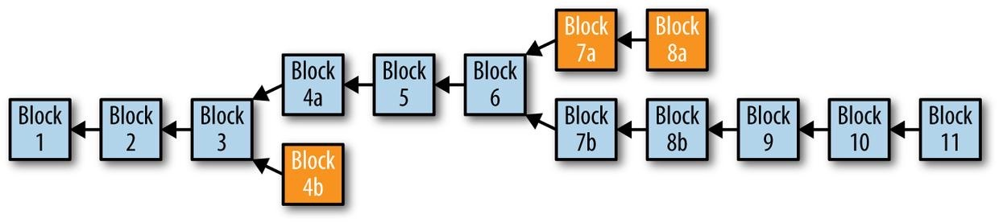
- 硬分叉原因

	硬分叉的两种情况导致
	
	- 共识规则中的错误
	- 共识规则的故意修改

		代码分叉在硬分叉之前，对于这种类型的的硬分叉，新的共识规则必须通过开发、采用和启动新的软件实现。视图改变共识规则的软分叉的例子包括  Bitcoin XT, Bitcoim Classic 和 BitcoinUnlimited。但这些软件没有产生硬分叉。由于采用相互竞争的实施方案，规则需要矿工、钱包和中间节点激活，需多比特币核心的代替实现方式，最终都没有导致硬分叉，有些还实现了软分叉。
		
		不同的共识规则在交易或块的验证中会以明确和清晰的方式有所不同。比如脚本、加密源语(数字签名)时。共识规则的差别还可能由于意料之外的方式，比如由于系统限制或实现细节所产生的隐含共识约束。 核心客户端 0.7 升级到 0.8 之前，意料之外的硬分叉中看到了后者的一个例子，由于用于存储块的 Berkley DB 实现的限制引起的。

	硬分叉还可以看成4个阶段
	
	- 软分叉(代码)

		开发人员创建客户端，这个客户端对共识规则进行了修改。
	- 网络分叉

		这种新版本客户端在网络中部署，矿工、钱包、中间节点可以采用并运行该版本客户端。
	- 挖矿分叉

		得到真实分叉取决于新的共识带来的交易、区块或系统其他方面。如果新的共识规则与交易有关，那么交易被挖掘成一块时，产生的粉快就是影粉快。
	- 区块链分叉		 	
		
		当这个新的区块合并到链上，就变成了两个区块链网络。
- 分离矿工和难度

	随着矿工被分裂开始开采两条不同的链，链上的哈希算力也被分裂。两个链之间的挖矿能力可以分为任意比例。新的规则可能只有少数或者多数人跟随。
	
	假设 80%-20% 分割，
	
	- 80%

		大多数使用了新共识。挖矿难度因为下降 20% 算力在平均每 12 分钟的速率进行下调，每次调节最大不超过 4个小时，直到开采 2016 块需要 24192 分钟（每个块约 12 分钟）或 16.8 天为止。
	- 20%

		而百少数人的链因为开采人数少，挖块的速度在短时间内大幅降低，这样导致合并的交易急剧下降。直到挖矿难度调节正常为止。
- 争议硬分叉

	正如开源软件改变了软件的开发方法，创造了新的方法论、新工具、新社区，共识软件也代表了计算机的前沿。在路线图的辩论、实验和纠结中，看到了新的开发工具、实践、方法和社区出现。硬分叉被视为风险，因为迫使参与者选择升级或保留在原来的链上。整个系统被分为两个竞争系统的风险是被许多人认为是不可接受的。结果开发人员不愿意使用硬分叉机制来实现共识规则的升级，除非全网达成一致。
	
	任何有争议的建议都不会被人支持。这里涉及区块大小限制的共识规则的任何提议。现在有新的方案来解决硬分叉的风险，如 BIP-34和 BIP-9 。
- 软分叉

	并非所有的共识规则的变化都会导致硬分叉。只有向前不兼容的共识规则修改才会导致分叉。软分叉是共识规则的向前兼容并做出了变化，允许未升级的客户端继续或与新规则同时工作。
	
	软分叉一个不明显的方面就是，软分叉只能用于增加共识规则约束，不是扩展它。反之，新规则只能增加限制，否则根据旧规则创建的交易和区块被拒绝，会导致硬分叉。
	
	软分叉可以通过多种方式实现，该术语不定义单一方法，而是一组方法，但都有共同点，就是不要求所有节点升级或强制非升级节点必须脱离共识。
	
	- 软分叉重新定义 NOP 操作码

		Bitcoin 脚本有10个操作码保留供将来使用，NOP1-10。根据共识规则这些操作码在脚本中的存在被解释为无效字符，意味着它们没有任何作用。在执行脚本时， NOP 编码将被无视。因此，软分叉可以修改 NOP 代码的语意给它新的定义。
		
		例如 BIP-65 重新解释了 NOP2 操作码。实际 BIP-65 客户端将 NOP 解释为 `OP_CHECKLOCKTIMEVERIFY` ，并在其锁定脚本中包含该操作码的 UTXO 上，强制了绝对锁定实际的共识规则。这种变化是一个软分叉，因为在 BIP-65 下，有效交易在任何没有实现 BIP-65 功能的客户端同样有效.
	-  其他方式软分叉升级

		NOP 操作码的重新解释是计划的，也是共识升级的明显机制。而 Segwit 使用的是一个交易结构的体系结构变化，它将解锁脚本从交易内部移动到外部数据结构。
		
		最初 Segwit 设计成硬分叉，因为它修改了一个交易的基本结构。在 2015 年 11月，一个参与比特币核心开发工作的人员提出了这种机制，这种机制用于创建 UTXO 的锁定脚本，使得未修改的客户端将任何解锁脚本视为可锁定脚本。所以被视为软分叉
	- 对软分叉的批评

		软分叉虽然允许无中断升级，但是开发者认为软分叉升级的其他方法会产生不可接受的问题。批评认为引入更复杂的问题，带来技术债
		
		- 增加了未来的维护成本
		- 增加代码复杂度，增加错误和安全漏洞的可能性
		- 验证放松未经修改的客户端将交易认为是有效，而不评估修改的共识

		未经修改的客户端不会使用全面的协商一致的规则来验证，因为它们根本对新规则无视。不可逆转的升级因为软分叉产生了额外的共识约束交易，所以它们在实践中成为了不可逆转的升级。如果软分叉在被激活后回退，根据新规则创建的所有交易可能导致旧规则的资金丢失。如果旧规则对 CLTV 交易进行评估，则不存在任何事件锁定约束，可以在任何事件花费。

### 使用区块版本发出软分叉信号
软分叉允许未经修改的客户端在协商一致的情况下运作，激活软分叉是通过向矿工发送信号准备，大多数矿工必须同意他们准备并愿意执行新规则共识。为了协商行动，有一个信号机制，使矿工表达共识支持还是反对。该机制是 2013年3月激活 BIP-34 并在 2016 年7月被 BIP-9 激活取代。

- BIP-34 信号和激活

	BIP-34 中，第一个实施使用块版本字段来允许矿工表达准备打成特定的共识规则更改。在此之前，按照惯例，块版本设定为 1，而不是以共识方式执行。而 BIP-34 定义了一个共识规则变更，要求将创币交易的字段输入包含块的高度。在之前，矿工可以填写任意数据。而现在，有效块必须在创币交易开始处包含特定的块高度，并使用大于或等于2的版本号填入。
	
	BIP-34 为了更改和激活，矿工将块版本设置为 2，而不是1.这没有理解使版本 1 的块将无效。这样导更新的人只有2块才有效，而1无效。它基于 1000个块的滚动窗口定义了两步启动机制。矿工将以2作为版本号来共建块。由于共识规则尚未被激活，这些区块还没遵守新的共识规则，即将包含块高度在哪的基础交易中纳入统一规则。共识规则分为2个步骤
	
	- 如果 75%约 750 个块标有 2版本，则版本 2 块必须包含创币交易中的块高度，否则将被拒绝。版本 1 块仍被网络接受，不需要包含块高度。这个新时期的新旧共识规则共存。
	- 当 95%约 950 个块标有 2 时，版本1的块将被视为无效，版本2块必须符合新的一致性规则，所有有效块必须包含创币交易中的块高度。

	在 BIP-34 规则成功发信号和激活后，该机制在次使用两次激活软分叉，通过了  BIP-66 标签严格 DER 编码通过 BIP-34 信号通过块版本 3 激活，无效版本 2的块。 以此类推进行升级。
- BIP-9 信号和激活

	在 34、66、65 3次成功激活了软分叉后，它被替换，因为它有几个限制
	
	- 通过使用块版本的整数值，一次只能激活一次软分叉，因此升级要有先后。
	- 由于版本增加，所以机制并没有提供一种直接的方式来拒绝变更，而是提出一个不同的方法。老客户端仍在运行，他们可能错过信号，导。
	
	而 BIP-9 来克服这些挑战，提高实施未来变化的速度和便利性。 BIP-9 将块版本解释为 bit 字段而不是整数，因为块版本作为最初整数，因此版本1-4，只有29位可用作为字段。留下 29位，可以独立使用过，同时在 29 个不同提案上表示准备就绪。 BIP-9 还设置了信号和激活的最大事件。矿工不需要永远发出信号。如果在提案 timeout 后未激活，提案将被视为决绝。该提案可以使用不同位的信号重新在新的信号周期提交。
	
	在 timeout 已经过去并且特征被激活或拒绝之后，信号位可以被再次用于另一个特征而不会混淆。因此，多达 29 次的更改可以并行发出信号， timeout 后可将这些位再循环提出。虽然可以重复提出，但投票期不可以重叠。	
	与 BIP-34 不同， BIP-9 根据 2016 块的难度改变目标(retarget) 周期，在整个间隔中计数激活信号。对于每个改变目标期间，如果提案的信号块的总和超过 95%，则该提案将在稍后的改变目标周期期间激活。 BIP-9 提供了一个提案状态图，以说明一个提案的各个阶段和转换
	
	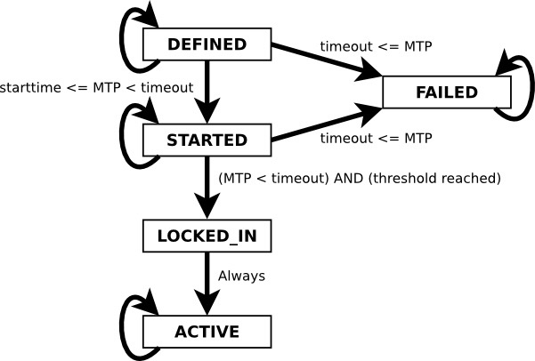			 		
				
	- Defined 状态

		当参数在比特币软件中被定义，提案就在这个状态下
	- Started 状态

		对于具有 MTP 的块开始时间之后，提案转到这个状态
	- Locked_in

		在改变目标期间超过了投票阈值，并未超时，提案转到这个状态
	- Active
	
		一旦到达 Locked_in 提案仍在活动个状态
	- Failed					
	
		提案状态更改为 Failed,表示已拒绝提案。 REJECTED 的建议永远在这个状态
	
	BIP-9 首次实施用于激活 CHECKSEQUENCEVERIY 和希相关 BIP(68,112,113)

### 共识软件开发
共识软件开发不断发展，对于改变共识规则的各种机制进行了很多讨论。由于其本质，比特币在协调和变化共识方便树立了很高的标杆。作为去中心化制度，不存在将权力强加于网络的参与者权威。权力分散在多个支持者，如矿工、核心开发者、钱包开发商、交易所，商家和最终用户之间。这些支持者不能单方面作出决定。例如，矿工在理论上可以通过简单多数(51%)来改变规则，但收到其他支持者的同意和限制。

任何单方面的行动，都会被其他参与者拒绝。这样就会变成少数链条，而没有经济活动，矿工开采将无价值。这种权力的扩散意味着所有参与者都必须协调，或者不能作出任何改变。现状是这个制度的稳定状态。达成一致的情况下，才能有变化。 95% 是门槛

重要的是要认识到，对于共识发展没有完美的解决办法，硬分叉和软分叉都涉及权衡。对于某些类型的更改，软分叉更好，而对于某些人来说，硬分叉更好。没有完美，都带风险。共识软件开发是一个不变特征的变更困难。
## 比特币安全
### 安全准则
比特币的核心准则事去中心化，这一点对安全具有重要意义。中心化系统依赖访问控制和审查制度将不良行为者拒之门外。而比特币则将责任和控制权转移给用户。由于网络的安全性事基于工作量证明而非访问控制，比特币网络可以对所有人开放，无需对比特币传输进行加密。中心化中，破获当前交易和支付令牌，可以随意动用资金，客户信息也被泄露。

比特币交易是授权向指定接收方发送一个指定的数额，并且不能被修改或伪造。不会透露任何个人信息，如当事人身份，也不能用于权限外的支付。因此，比特币的支付网络并不需要加密或者防窃听保护。反而可以在任何公开的网络上广播比特币交易，如蓝牙或 wifi 。
### 比特币系统安全开发
比特币开发者而言，最重要的是去中心化原则。去中心化原则依赖于密钥的分散性控制，并且需要矿工独立的进行交易验证。如果想利用去中心化安全性，必须要保证在这个模型里。保证密钥控制权不要被拿走，不要接受非区块链交易信息。

 - 早期交易所将比特币所有用户的资金集中放在一个包含私钥的"热钱包"(连网)，剥夺了用户的控制全，并将密钥集中到了单一系统。很多系统被攻破，用户带来灾难性损失。
 - 另一个常见错误是接受区块链离线交易，妄图减少交易费或加速交易，一个区块链离线交易系统将交易数据记录在一个内部的中心化账本中，然后偶尔将它们同步到比特币区块链中。这种做法在次证明是可能被伪造、挪用的。

 除非准备强大如银行系统那样的叠加多层访问控制，否则在将资金从比特币的去中心化安全场景中抽离之前，应该考虑这个模型是否足够安全。
 
###  信任根
传统安全体系基于一个信任根的概念，它指的总体系统或应用程序中一个可信赖的安全核心。安全体系像一圈同心圆一样围绕着信任根来进行开发，信任从内到外依次延伸。每一层都构建于更可信的内层之上，通过访问控制、数字签名、加密和其他安全方式确保可信。随着软件系统变得越来越复杂，就越难维护安全性。信任根的概念确保绝大多数的信任被置于一个不是过于复杂系统的一部分，因此该系统的这个部分也相对坚固，而更复杂的软件则在它之上构建。这样的安全体系随着规模的不断扩大而不断重复出现，

- 首先信任根建立于单个系统的硬件内
- 然后信任根通过操作系统扩展到更高级别的系统服务
- 最后逐次扩展到圈内多台服务器上

比特币安全体系里，共识系统建立了一个可信的完全去中心化公开账本，一个正确验证过的区块使用创世区块作为信任根，建立一条至当前区块的可信任链。使用区块链当成它们的信任根。在设计一个多系统服务机制的比特币应用时，应该仔细确认安全体系，以确保对它的信任能有据可依。最终，唯一可确信无疑的是一条完全有效的区块链。如果应用程序或明或暗的依赖于区块链之外的东西，则需要引起重视，因为它可能引入漏洞。

一个不错的评估安全体系的方法，单独思考每个组件，设想该组件被完全攻破并被坏人掌控的场景。依次取出应用程序的每个组件，并评估它被攻破时对整体安全的影响。如果应用程序安全性在该组件沦陷后大打折扣，那就说明已经对该组件过度信任，一个没有漏洞的比特币应用程序应该只受制于比特币的共识机制，这意味着安全体系信任源于比特币最底层的部分。
### 用户安全的最佳实践
人类使用物理安全控制已经有数千年，相比之下，数字化安全经验不到50年。现代操作系统并十分安全，个人计算设备，很时间暴露在互联网上，特别不适合存储数字货币。要杜绝威胁，要有一定的计算机维护水平，并不是所有人都有。

信息安全经过数十年的发展和研究，数字资产仍在攻势下十分脆弱。即使银行或者国防部这样坚不可摧的堡垒，依然可以被攻破。比特币代表的数字资产，其中一个特性就是被窃取后无法找回，这让攻击者有了很强的攻击动机。但得益于激励机制可以提高计算机的安全性，比特币让这些风险变得明确清晰。为了让数字货币得到传播和扩散，可以看到黑客技术和安全解决方案双方的提升。信息安全领域取得巨大的创新，如硬件加密、密钥存储和硬件钱包，多重签名技术、数字托管。

- 比特币物理存储

	相比数字信息，大多数用户对物理安全更加熟悉，比特币非常有效的保护方式就是转化为物理形式。比特币是一串场数字，这意味着它们可以以物理形式存储起来，如印在纸上或者雕刻在金属上。这样保护密钥就变成了简单地保护比特币物理实体。有许多免费工具创建在一组打印纸上的比特币纸钱包。并用 BIP0038 加密，复制多份锁在保险箱里。离线存储(冷钱包)是最有效的安全技术之一。
- 硬件钱包

	长远来看，比特币安全越来越多的以硬件防篡改钱包的形式出现，与智能手机和电脑不同，一个比特币硬件钱包只有一个目的，安全的存储比特币。不像常用软件那样，硬件钱包只提供有限的接口，从而可以给非专业用户近乎万无一失的安全等级。
- 平衡风险

	数据文件存在丢失的情况，为了防止比特币丢失，主人采取了一系列复杂的操作去加密备份，结果不慎丢失了加密密钥，使备份变得毫无价值，白白失去的一大笔财富。
- 分散风险		
	
	风险分散道不同的钱包，用户仅需要把很少的比特币放到在线设备中，其余的都分散存放。
- 多重签名管理

	当一个公司和个人持有大量比特币时，应该考虑采用多重签名的比特币地址，多重签名地址需要多个签名才能支付，从而保证资金的安全。多重签名的密钥应该存储在不同的地方，由不同的人掌控。比如企业中，若干管理层持有，以确保没有任何一个人可以独占资金。多重密钥签名的地址可以提供冗余，例如一个人持有多个密钥，并将它们分别存储在不同的地方。
- 存活能力

	一个常被被忽视的安全性是可用性，其密钥持有者丧失工作能力或死亡后，比特币用户被告知应该使用复杂的密码，并保证它们的密钥安全不为人知。不幸的事，这种做法家人也无法打开。比特币用户的家人可能完全不知道这资产的存在。如果你有很多比特币，应该考虑与一个值得信赖的亲属或律师分析那个解密的细节。可以搞一个更复杂的比特币恢复机制。可以通过设置多重签名，做好遗产规划，或专门的数字资产执行者。

## 比特币应用
比特币使用的是具有低级加密功能的脚本语言。账户、余额、付款等更高层次的概念可以从基本原语中衍生而来，需多其他复杂的应用也是如此。因此，比特币区块链可以称为一个诸如智能合约同等应用程序提供信任服务的应用平台，远超设计账本功能。
### 构建块
比特长时间的运行，提供了一定的保证，可以作为构建块来创建应用程序，包括

- 杜绝双重支付

	共识算法的根本保证是确保 UTXO 不会话费两次
- 不可改变性

	一旦交易被记录在区块中，并随后的区块中添加了足够的工作，交易数据就变得不可篡改。不可改变性是由能源进行保证，因为重写区块对应消耗能量的工作量证明。所需的能源以及由此带来的不可变性程度随区块的增多而增加。
- 中立		
	
	去中心化网络传播有效的交易，不管这些交易的来源或内容如何。意味着任何人都可以支付足够的费用来创建有效的交易，并相信它们可以随时传输交易并使其包含在区块链中。
- 安全时间戳

	共识规则拒绝任何时间戳距离现在太远(过去和将来)的块，这可以保证块上的时间戳可以被信任。块上的时间戳意味着对所有其包含的交易输入之前未被花过的保证。
- 授权

	被去中心化网络验证过数字签名可提供授权保证。没有脚本中指定的私钥授权的数字签名就不嫩执行。
- 审计能力

	所有交易都是公开的，可以被审计的。所有交易和交易所属的区块可以在一个不间断的区块链链起来并最终链接到创世块。
- 会计

	任何交易(创币交易除外)，输入金额等于输出金额加上交易费。在交易中不可能创建或销毁比特币价值数值。输出不能超过输入。
- 永不过期

	有效的交易永远不会过期，如今有效的交易，未来也会有效。只要输入仍没有被话费，共识规则没有改变。
- 公正性

	使用 SIGHASH_ALL 签名的比特币交易或另一个部分由 SIGHASH 类型签署的交易，不能在签名还有效的情况下被修改，从而导致交易本身无效。
- 交易原子性

	比特币交易是原子性的(原子性指要么全部执行，要么全部不执行，不存在中间状态)。它们要么是有效的并且经过确认的，要么不是。不存在挖矿出交易的一部分，交易也不存在中间状态。在任何时间点，交易要么被挖出，要么没有被挖出，不存在中间状态。
- 离散(不可分割)价值单位

	交易输出是离散和不可分割的价值单位。他们要么整体被花费要么整体没被花费。他们不能被分割或者部分被花费。
- 法定人数

	脚本中多重签名限制了规定，多重签名方案中，预定义的法定权限。 M-of- N 要求由共识规则执行。
- 时间锁/老化

	包含相对或绝对时间锁的任何脚本语言只能在其时间超过指定的时间后执行。
- 复制

	区块链的去中心化存储确保了在交易被开采后，经过充分的确认，它被复制到整个网络上，并且变得可以耐受得起电力损失，数据丢失等影响。
- 伪造保护

	每笔交易只能花费现有的经过验证的输出，不可能创造或伪造价值。
- 一致性

	没有矿工硬分叉的情况下，根据记录深度，记录在区块链中的块可能会被从新组织或被不认可的可能性将呈现指数级下降。一旦被记录在深层，改变所需的计算和能量将大到不可行。
- 记录外部状态

	每个交易可以通过 OP_RETURN 提交一个值，表示外部状态及中的状态转换。
- 可预测发行量

	2100万比特币。速度可预测。
	
### 源于构建区块的应用
可用于构成各种应用程序，例

- proof-of-Existence(Digital Notary) 数字公正

	不可篡改+时间戳+永久性。数字指纹可以通过一个交易提交给区块链，以证明文件在此存档的时间内是存在的(安全时间戳)。数字指纹不能在事后修改(不可改变性)，证据将被永久存储(耐久性)
- kickstarter(Lighthouse) 一致性+原子性+可信

	发起众筹活动，一个输入+输出(公正性)，别人可以参与众筹，但在目标(输出值)完成之前(一致性)，这笔钱不能被花出去(交易原子性。)
- Payment Channels 控制法定人数+时间锁+杜绝双重支付+永不过期+耐审查+授权

	一个带有时间锁(Timelock 时间锁)的法定人数为 2-2 的 多重签名被作为付款渠道的结算交易，可以被持有(永不过期)或可以在任何时间由任何一方授权的情况下(耐审查)进行花费。然后双方可以在更短的时间锁创建双重支出结算确认交易
	
### 染色币
染色币是指利用比特币交易记录除比特币之外的外部资产创建、所有权和转让的这类技术。外部资产是不存在于比特币区块链之内的资产。染色币用于跟踪第三方持有的数字资产和实物资产，并通过染色币所有权证书来进行交易。数字资产产色币可以代表无形资产，如股票证书、许可证、虚拟财产或大多数任何形式的许可知识产权(商标，版权等)。有形资产染色币可以代表(黄金、白银、石油)，土地所有权、汽车、船只、飞机等。
	
染色币实质就是用比特币的额度加单位来描述比特币之外的事，比如用1美元钞票表上这是 ACME 的股票证书。然后使用这个1美元钞票与作为其他权证来证明进行交易。染色币的第一次实施，EPOBC, 将外部资产标记于1聪上。
	
染色币的最新实施使用 OP_RETURN 脚本操作码将交易中的元数据与特定资产相关联的外部数据存储结合在一起。 最突出的染色币实现是 OpenAssets 和 Colu 的染色币。这两个系统使用不同的方法来染色，相互不兼容。在一个系统建立的染色币，另一个系统无法使用。
	
- 使用染色币

	染色币被创建、转移并且通常用特殊的可以理解含有染色币协议元数据的比特币交易钱包来查看。必须特别注意避免在常规的比特币钱包中使用染色币相关的密钥，因为常规钱包可能会破坏元数据。同样，染色币也不应该被发送到由常规钱包管理的地址，而只能发送由染色币能够识别的钱包管理地址。 		

	染色币对于大多数通用区块链游览器不可见，相反使用染色币游览器可见

	- OpenAssets
	- Colu
	- Copay 
- 发行染色币

	染色币实现通过不同的方法创造染色币，但它们提供类似功能。创造染色币的过程被称作发行，作为初始交易，发行交易将资产登记在比特币区块链上，并创建用于引用资产的 ID。一旦发行，资产可以通过转账交易在地址之间传递。
	
	作为染色币发行的资产可以有多种属性，可以分割也可以不分割，意味着转账中的资产量可以是整数，也可以是十进制小数，比如 4.321。资产也可以固定发行，意思是有一定数量的资产值可以发行一次，或者可以被再次发行，后者意味着原始发行人的初始发行后可以发行新资产单位。
	
	最后一些染色币启用分红，允许按照拥有比例分配比特币付款给染色币资产所有者。
- 染色币交易

	给染色币交易提供意义的元数据通常使用 OP_RETURN 操作码存储在其中一个输出中。不同的颜色的硬币协议对 OP_RETURN 数据的内容实用不同的编码。包含 OP_RETUREN 的输出称为标记输出。
	
	输出的顺序和标记输出的位置染色币协议中可能具有特殊含义。例如
	
	- 在 Open Assets 中，标记输出之前的任何输出都代表资产发行。标记输出后的任何输出表示资产转账。通过参考各个输出在账单中的顺序标记输出将特定值和颜色分配给其他输出。
	- 在 Colored Coins 中，标记输出编码一个定义元数据，该如何被理解的操作码。操作码 0x01 至 0x0F 表示发行交易。发行操作码通常后面是资产 ID 或可用于从外部来源(bittorrent) 获取资产信息的其他标识符。操作码表示转账交易。转账交易元数据包含简单的脚本，通过参考输入输出的索引(顺序)，将特定数量的资产从输入转账到输出。因此，输入和输出的排序对脚本的解释很重要。

	如果元数据太长而不能放入 OP_RETURN ,则染色币协议可能使用其他"技巧" 在交易中存储元数据。例如包括将元数据放在兑换脚本中，紧接着 OP_DROP 操作码，以确保脚本忽略元数据。另一种被使用的机制是 1-N 多重签名脚本，其中只有第一个公钥是可以花费输出的真实公钥，随后的密钥，则用被编码的元数据代替。
	
	为了正确解释染色币交易中的元数据，必须使用兼容的钱包或块资源游览器。否则交易看起来是个正常比特币交易。
	
	截止文档例子中染色币地址全部无法访问。
- 合约币

	合约币是在比特币之上建立的协议层，与染色币类似的合约币协议，提供了创建和交易虚拟资产的代币能力。此外，合约币提供了去中心化的资产交换。合约币还在实施基于 Ethereum(EVM) 的智能合约。
	
	和染色币协议类似，合约币也使用 	OP_RETURN 操作码或 1-N 多重签名的公钥地址，将元数据嵌入到比特币交易中，该地址用于代替公共密钥进行元数据编码。使用这些机制，合约币实现了在比特币交易中编码的协议层。额外的协议层可以由能理解合约币的应用程序来解读，如钱包和区块链游览器，或使用合约币库构建的任何应用程序。
	
	例如在合约币上的平台允许创作者、作家、发行公司等发行数字所有权代币以及其他实体租赁、访问、交易等。

### 支付通道和状态通道
支付通道是在比特币区块链之外双方之间交换的比特币交易的无信任机制。这些交易如果在比特币网络结算，则是有效的，然而它们却在链外被持有，以期票的形式等待最终批量结算。由于交易尚未结算，所以它们可以在没有通常结算延迟的情况下进行交换，从而满足极高的交易吞吐。
	
支付通道是状态通道的引申概念之一，代表了链外状态的变化，通过区块链上的最终结算得到保障。支付通道是一种状态通道，其中被改变的状态是虚拟货币余额。
	
- 状态通道基本概念和术语

	通过一个交易在区块链上锁定的共享状态，在交易双方之间建立一个状态通道。这被称为资金交易或锚点交易。这笔交易必须传送到网络并开始挖矿被挖矿确认以建立通道。在支付通道中，锁定的状态即为通道的初始余额。
	
	随后双方交换签名交易，这个被称为承诺交易。承诺交易会改变初始状态。这些交易都是有效的，因为任何一方都可以提交结算的请求，不需要等到通道关闭再做结算。任何一方给对方创建、签名和发送交易时，就会更新状态。实践意味着每秒可以进行数千次交易。
	
	当交换承诺交易时，双方同时废除之前的状态，如此一来最新的承诺交易总是唯一可以赎回的承诺交易。这样可以防止任何一方在通道中某个先前状态的比最新状态更有利于己方的时候，通过单方面关闭通道来进行诈骗。
	
	最后通道可以合作关闭，即向区块链提交最后的结算交易，或单方面由任何一方提交最后承诺交易到链上。单方面关闭的选项是必要的，防止交易中一方意外断开。结算交易代表通道的最终状态，并在链上进行结算。
	
	在通道的整个生命周期中，只有两个交易需要提交给链上进行挖矿，资金交易和结算交易。这两个状态之间，双方可以交换任意数量的承诺交易，任何其他人永远不会看到的，也不会上链的。
- 支付通道例子
	- 无欺骗模型
		- 情况说明
			- 参与者 E 和 F 
			- F 提供由微支付通道支持以秒为单位时常计费的视频流服务。  每小时收费 0.036 BTC 的视频。
			- E 利用支付通道从 F 哪里用秒支付通道来购买媒体视频服务
			- E 在浏览器中运行客户端，F从服务器端运行服务端。该软件包括钱包功能，可以创建和签署比特币交易
			- E 通过软件和 F 建立了 2-2 的多重签名地址，双方各有一个密钥
				- 从 E 角度来看，游览器软件提供了一个带有 P2SH 地址的二维码(以3开头)，并要求她提交最多1个小时视频的抵押金。
				- E 支付给多重地址(双签名)的交易就是支付通道的资金交易或锚点交易
			- E 向通道支付了1个小时的费用，这将允许 E 消费，这笔资金交易设定了可以在这个通道上发送的最大数量，即设置了通道容量。
				- E 软件创建并签署一笔交易承诺，改变通道余额，将 0.01 归入 F 地址，并退回给 E 35.99 ，创建交易时 E 设置了2个输出，一个用于找钱，一个用于给 F 付款，交易被部分签署，它需要两个签名(2-2),但只有 E 签名，当 F 的服务器接收到交易时，它会添加第二个签名(用于 2-2 输入)，并将其返回给 E 并附带1秒的视频。
				- E 软件接收到视频数据，并签署另一个承诺交易(2-2)，承诺分配 0.2 的费用输出到 F 地址,还有一个输出为 35.98 找零给 E 自己，F 就继续上面的流程签署并转发数据。

				上述循环后， F 的钱越来越多， E 承诺的金额越来越大。当 E 停止消费，F 或 E 将关闭交易，进行结算。 但链上最终只记录一笔交易。
	- 无信任模型
		- E 需要 F 签名才能获得自己的找零，如果 F 消失，资金将锁死在 2-2 中。任何一方断开都会出现这样的情况。
		- 当通道在运行时， E 可以采取 F 已经签署的任何承诺交易，比如使用只 1 秒的交易。这样E进行欺诈消费。

		两个问题都是用 timelocks 来解决
		
		- 找零锁死问题通过同时建立资金和退款交易。
			- 签署资金交易只能传送给 F ,获得他的签名
			- 退款交易作为第一承诺，其实践锁定通道的生命周期上限，这种情况下，E 可以将 nLocktime 设置为30天或第 n 个块。所有后续承诺交易必须有较短的时间锁，以便在退款交易之前能把它们赎回。
				- 由于 nLocktime 任何一方只能在时间到期后，才能成功传播任何承诺交易。防止任何一方掉线。
				- 每个后续交易必须有较短的时间锁，以便在其之前的退款交易之前进行广播
		- 再看提前关闭交易问题

			任何一方都可以关闭交易，然后设置提取最近的承诺交易，建立一个各方面完全相同的结算交易，唯一差别就是结算交易省略了时间锁。双方都可以签署这笔交易，因为知道对方无法作弊可以得到更多资源。如果不合作，他们也要等待够时间锁，才能得到资金。
- 不对称可撤销承诺

	处理先前承诺的更好办法是明确撤销。比特币取消交易的唯一方法就是双重支付。但这导致支付通道难以使用。有一个更好的方法撤销密钥。
	
	撤销密钥例子， H 和 I 两个交易所构建支付通道。 
	
	-  H 的客户经常向 I 的交易所客户发送付款， 反之亦然。交易都发生在比特币链上，这意味着手续费和等待时间，这导致在交易所之间架设交易通道的需求。
	-  H 和 I 启动通道时，各向通道注资了 5 个比特币。初始 H 和 i 各 5 个。资金交易将通道状态锁定为 2-2 多重签名。
	-  资金交易可能有一个或多个来自 H 的输入，以及 I 的一个或多个输入，这些总值加起来比 5 个比特币多。
	-  投入必须高过通道容量才够支付交易费用，交易将锁定总共 10个比特币的多重输出，如果输入超过需要的数值，资金交易也可能有一个或多个输出将找零返回给 H 和 I。这由双方提供和签署的多个输入形成的单一交易。在发送前，它必须被合作构建起来并且由各方签署。
	-  现在，代替双方签署单一承诺交易的是 H 和 I 创造的2个不对称的承诺交易。
		- H 有一个带有两个输出的承诺交易

				Input: 2-of-2 funding output, signed by Irene
					Output 0 <5 bitcoin>:
						<Irene's Public Key> CHECKSIG
					Output 1:
						<1000 blocks>
						CHECKSEQUENCEVERIFY
						DROP
						<Hitesh's Public Key> CHECKSIG
			- 一个输出支付 I 欠她 5 比特币。	  
			- 一个输出支付 H 欠他 5 比特币，但条件是在 1000个区块时间后解锁
		- I 有带有连个输出承诺交易
			
				Input: 2-of-2 funding output, signed by Hitesh
				Output 0<5 bitcoin>:
					<Hitesh's Public Key> CHECKSIG
				Output 1:
					<1000 blocks>
					CHECKSEQUENCEVERIFY
					DROP
					<Irene's Public Key> CHECKSIG
			- 一个输出支付 H 欠他的 5 比特币
			- 一个支付 I 欠她的 5 比特币，但同样是 1000 个区块时间解锁
		
		这样双方各有一笔承诺交易，用于花费 2-2 的资金输出。该交易的输入方是对方签署的。在任何时候，持有承诺交易的一方都可以签字并进行广播。但它们如果广播，承诺交易会立即支付对方，而它们必须等待短时间锁到期。通过在其中一个输出强制执行赎回，通过靠时间延迟不足以鼓励公平行为。
		
		还有其他的方案，比如一个撤销密钥，允许被欺骗的一方通过占有通道所有余额来惩罚骗子。( 文本 412 页不延展。)
		
		带有相对时间锁(CSV) 的不对称可撤销承诺是实现支付通道的更好办法，也是区块链技术非常重要的创新。通过这种结构，通道可以无限期的保持开放，并且可以拥有数十亿的中间承诺交易。在闪电网络的原型实现中，承诺状态由 48 位索引识别，允许在任何单个通道中有超过 281 兆个状态转换。
- 哈希时间锁合约(Hash Time Lock Contracts HTLC)

	支付通道可以通过特殊类型的智能合同进一步扩展，允许参与者将资金用于可赎回的具有到期时间的秘密(secret) 。此功能称为哈希时间锁合约或 HTLC,用于双向和路由的支付通道。
	
	要创建一个 HTLC ，预期的收款人将首先创建一个秘密R.然后计算这个R 的哈希H
	
		H = Hash\(R\) 		
	这产生了可以包含在输出脚本中的哈希 H.知道秘密的任何人用它来兑换输出。秘密R 也被称为哈希函数的前图像。前图像就是用作哈希函数输入的数据。
	
	HTLC 的第二部分是时间锁组件。如果秘密没有被透露，HTLC 的付款人在一段时间后可以得到退款。这是通过使用绝对时间锁 CHECKLOCKTIMEVERIFY 来实现的。实现 HTLC 的脚本可能如下
		
		IF
			# Payment if you have the secret R
			HASH160 <H> EQUALVERIFY
		ELSE
			# Refund after timeout.
			<locktime>
			CHECKLOCKTIMEVERIFY DROP
			<Payee Pubic Key> CHECKSIG
		ENDIF		 
	任何知道可以让哈希等于 H 的对应秘密 R 的人，可以通过行使 IF 语句的第一个子句来兑换该输出。
	
	如果秘密没有被透露，HTLC 中写明过了，在一定数量的块之后，收款人可以使用 IF 语句中的第二个子句申请退款。
	
	任何拥有 R 秘密的人都可以兑换这种类型的 HTLC。通过对脚本进行微调，HTLC 可以采用许多不同的形式。例如在第一个子句添加一个 CHECKSIG 运算符和一个公钥来限制将哈希值兑换成一个指定的收件人，这个人必须知道 R
	
### 可路由的支付通道(闪电网络)
闪电网络是一种端到端链接的双向支付通道的可路由网络。这个网络允许任何参与者穿过一个通道路由到另一个通道进行支付，而不需要信任任何中间人。闪电网络在 2015年2月提出，基础是许多其他人提出和阐述的支付通道概念。

闪电网络是指路由支付通道网络的具体设计，现已经由5个不同的开源组织实施。这些独立实施是由闪电技术基础(BOLT) 论文中描述的一组互通性标准进行协作。

闪电网络的原型实施已经由几个团队发布，这些只实现在了 testnet 上运行，因为他们使用 segwit 。

- 闪电网络例子

	例子中有5个参与者， ABCDE。他们都彼此开设了支付通道。 
	
	- A 和 B 有支付通道				
	- B 和 C 有支付通道
	- C 和 D 有支付通道
	- D 和 E 有支付通道
				  
	每个通道参与者都注资2个比特币，每个通道总容量为 4个比特币。闪电网络解决的问题是 A 想要支付给 E 1个比特币，但 A 没通过支付通道连接 E。创建支付通道需要资金交易，而这笔交易必须提交给区块链。 A 不想打开一个新的支付通道并支出更多的手续费。
	
	
	- A 使用闪电网络 LN 节点，该节点正在跟踪其向 B  的付款通道，并且能够发现支付通道之间的路由。
	- A 的 LN 节点还具有通过互联网连接到 E LN 节点的能力。 
	- E 的 LN 节点使用随机数生成创建一个秘密 R。 
	- E 的节点没有向任何人透露这个秘密。相反 E 的节点计算秘密 R 对应的哈希值 H ,并将此哈希发送到 A 的节点
	- A LN 节点构建 了 A LN 节点和 E LN 节点之间的路由
	- A 和 B 通道交易
		- A  节点构造一个 HTLC  支付到哈希 H ，具有 10个区块链时间的退款超时，数量为 1.003 个比特币。(小数为路由支付补偿)
		- A 将 HTLC 提供给 B ，从 B 之间的通道余额扣除 1.003 比特币，将其提交  HTLC
			- 如果 B 知道秘密，则 A 将支付给 1.003 个比特币给 B
			- 如果超过 10个区块时间后，将 A 余额退还
			- A 和 B 之间的通道余额现在由承诺交易表示，其中3个输出
				- B 的 2个比特币余额
				- A 的 0.997 余额
				- A 的 HTLC 承诺的 1.003 比特币
	- B 有一个承诺，如果他能够在接下来 10个区块产生时间内获得秘密 R ，他可以获得 A 的 1.003个比特币。 
	- B 和 C 通道交易
		- 反复上面的逻辑 B 向通道创建一个 HTLC , B 提交了 1.002 个比特币哈希到 H 共 9个区块水岸，这个 HTLC 如果 C 有秘密 R 可以兑换 1.002 个比特币。
		- 这样如果通过 C 获取了 R 他就赚取了 0.001 个比特币
	- 以此类推，最终到 E

	这条路上， E 拥有秘密 R，可以获取 D 提供的 HTLC 。他将 R 发送给 D，获取最终的 1个比特币。而通道其他人都获取了 0.001 个比特币。通过路由回传，秘密 R 允许每个参与者获取未完成的 HTLC，C 到 B 哪里获取 1.002 比特币，将通道余额设定为 0.998 给 B，3.002 给 C 。 最后 B 获取来自 A 的 HTLC，通道为  0.997 给 A ，3.003 给 B。
	
	在没有向 E 打开通道的情况下， A 已经支付了 E  1个比特币。付款路线中的中间方不必相互信任。他们的通道内做一个短时间的资金承诺，他们可以赚取一小笔费用，唯一风险是如果通道关闭或路由失败，退款由延迟。
- 闪电网络传输和路由

	LN 节点之间的所有通信节点都是点对点的加密。另外，节点有一个长期公钥，它们作为标识符并且彼此认证对方。每个节点希望向另一个节点发送支付时，首先必须通过连接具有足够容量的支付通道来构建通过网络路径。节点宣传路由信息，包括他们已经打开了什么通道，每个通道拥有多少容量。以及他们收取多少路由支付费用。路由信息可以以各种方式共享，并且随着闪电网络技术的进步，不同的路由协议可能会出现。
	
	- 一些闪电网络实现使用 IRC 协议作为节点宣布路由信息的一种方便的机制。
	- 另一种功能实现时通过 P2P 模型，这类似于比特币传播交易的方法。
	- 未来计划包含一个名为 Flare 的建议，它是一种具体本地节点临近长度的信标节点的混合路由模型。      
	
	前面例子中， A 节点使用路由机制之一来查找将她的节点连接到 E 节点的一个或者多个路由。一旦 A 的节点构建了路径，她将通过网络初始化该路径，传播一系列加密和嵌套指令来连接每个相邻的支付通道。重要的是，这个路径只有 A 节点才知道。付款路线上所有参与者只能看到相邻节点。从 C 的角度，只能看到从 B到 D的付款。闪电网络重要特征是保护了隐私性，中间节点不透露任何内容。
	
	闪电网络实现了一种基于称为 Sphinx 的方案的洋葱路由协议。该路由协议确保支付发送者可以通过闪电网络构建和通讯路由，特点
	
	- 中间节点可以验证和解密其部分路由信息，并找到下一跳
	- 除了上一跳和下一跳，中间节点不能了解路由的其他节点
	- 中间节点无法识别支付路径的长度，或他们自己在路由中的位置
	- 路径的每个部分被加密，使得网络级攻击者不能将来自路径的不同部分的数据包彼此关联
	- 不同于Tor洋葱协议，没有可以被监视的退出节点。付款不需要传输到比特币网络，节点只是更新通道余额

	使用这种洋葱路由协议，A 将路径的每个元素包括在一层加密中，从尾端开始倒算运算。A用 E的公钥加密了 E的消息。该消息包括在加密到D 的信息中，将 E 标示为下一个收件人。 给 D的消息包括在加密到 C的公钥消息中，将 D 识别为下一个收件人。如此嵌套。路径上的每个元素包含承载于 HTLC 的必须扩展到下一跳的信息，HTLC 中的要发送的数量，包括的费用以及 CLTV 锁定到期时间（以块为单位）。随着路由信息的传播，节点将 HTLC 承诺转发到下一跳。
	
	这里用户可能想知道节点怎么知道路径长度以及路径中的位置和转发中是否可能出现问题，比如路径缩短或者推断路径大小和位置。为了防止问题出现，路径总是固定在 20 跳以内，并用随机数填充。每个节点都会看到下一跳和一个要转发的固定长度的加密消息。但只有最终收件人可以看到没有下一跳。
	
### 闪电网络的优势
闪电网络是第二层路由技术，它可以应用于支持一些基本功能的任何区块链，如多重签名交易、时间锁和基本的智能合约。如果闪电网络搭建在区块链上，可以在不牺牲无中介机构的情况下进行无信任操作，并且大大提高区块链的吞吐速度、容量、颗粒度、隐私性

- 隐私

	闪电网络付款比比特币区块链的付款更隐私，因为它们不是公开的。虽然路由中的参与者可以看到其通道上传播的付款，但他们并不知道发件人或者收件人。
- 流动性

	闪电网络使得在比特币上应用监视和黑名单变得更加困难，从而增加了货币流通性。
- 速度

	使用闪电网络的比特币交易将以毫秒为单位，而不是分钟，因 HTLC 在不用提交交易到区块链上的情况下被结算。
- 粒度

	闪电网络可以使支付至少与比特币 `灰尘` 限制一样小，甚至更小。一些允许子聪级别增量。
- 容量

	闪电网络将比特币的容量提高好几个数量级，每秒可以通过闪电网络路由的付费数量没有限制，因为它仅取决于节点的容量和速度。
- 无信任操作

	闪电网络在不需要互相信任的情况下作为对等使用的节点之间使用比特币交易。因此，闪电网络保留了比特币系统原理，同时显著扩大了其操作参数。
	
当然，闪电网络协议不是实现路由支付通道的唯一方法，其他提出的系统包括很多。然而，闪电网络已经被部署在 testnet 上了，几个团队已经开发了竞争的 LN 实现，并且正在努力实现一个互相操作的标准(称为 BOLT)，闪电网络很可能是第一个部署在生产中的路由支付通道网络。	 	
			

		
## 问题
- 区块链数据大小到 2021年1月有多大？有多少个块？
	- 10分钟1个区块1MB
	- 1小时
	
			1*6=6
	- 1天

			6*24=144
	- 1年

			144*356=51,264 约等于 51 GB
	- 创世块

			2009年1月
	- 2021年1月-12年

			51264*12=615,168 约等于 615 GB
	- 2021年1月-12年有多少块

			615168/6=102,528		
- 比特币支付流程
	- 所有者需要在交易中添加公钥和交易签名发送给比特币网络
	- 比特币所有节点都可以通过所有者提交的数据对交易进行验证是否有效。
- 比特币钱包存储
	
	只需要存储私钥即可，公钥由私钥计算而来  
- BTC 交易网络处理能力

	比特币一个区块的大小上限为1MB，每10分钟产生一个区块，平均每一个比特币交易的大小约为 250 字节，即 0.25 KB
	
	- 每个区块的交易数量 
	
			1*1024*1024/250=4194.304
	- 每秒能处理的交易量约等于7笔
	
			4194/(10*60)=6.99
- 生成一个区块奖励

	奖励 12.5 个比特币，而每4年，获得比特币奖励降低一半。总发行量低于 2100万，预计到 2140年，长期看是通货紧缩。
- 难度重新定义时间

	2016个区块重定义难度，约 336 个小时重新定义
- 难度重新定义如何做到

	比特币协议包含内置算法，用于调整整个网络的采矿功能，平均而言，任何时候，无论多少矿工(计算力)参与竞争，矿工必须执行处理任务难度实现动态调整，保证每10分钟就可以挖矿成功。

- 比特币网络程序如何更新？
- 如何保证更新程序不被黑
- 如何确定交易最后成功了
	- 在交易后，查询钱包

		当交易被区块网络确认后，全网任何一个节点都可以获取到交易数据。轻量级的客户端通过确认一个交易在区块链中且在它后面有几个新区块来确认一个支付的合法性。这个方法叫简易支付验证(spv)
	- 看到正确金额后，等待6个区块周期，即 10分钟*6=1个小时(确保安全可以2个小时复查)
	- 如果时间过后查看还是正确的，说明转账成功
	- 也可以通过自己的收款地址和交易哈希值到区块链游览器查看
		- [blockchain.info](https://www.blockchain.com/explorer) 
		- [bitpay](https://insight.bitpay.com/)

- 清算是如何确认的，分叉会不会影响交易安全性
- 什么是信用积分
- 比特币交易速度

	从交易发送到比特币客户端到传播到大多数节点只需要几秒中
- 无效或畸形交易攻击？
- 比特币网络挖矿运算

	通过对区块头和一个随机数进行哈希，每秒亿万次哈希计算，最终得到一个与预设值相匹配的解，即可赢得挖矿。哈希计算的难度随着连入矿工的数量 
- 钱包构建

	钱包构建参考 BIP-39和32构建
- 私钥如何创建

	私钥就是一串 256 位的数字，可以任意生成，比如用笔写出，或者投硬币来算。计算机方法可以通过一个密码安全的随机源(CSPRNG)中取出具有足够墒值的一个随机长字符串(种子)，再对其进行 sha256 计算，这样就可以产生 256 位数字，如果运算结果小于 n-1( n 为 `n=1.158 * 10^77`),那么就得到一个私钥，否则再随机。正确的使用 `CSPRNG` 很重要。比特币私钥空间总大小为 2^256，这是一个很大的数字。用十进制表示为 `10^77`，可见宇宙被估计只含有 `10^80` 原子 

	一个随机生成的私k，以十六进制表示(二进制为256位，16进制为64位)
	
		1E99423A4ED27608A15A2616A2B0E9E52CED330AC530EDCC32C8FFC6A526AEDD
- Base58Check 是如何在比特币中做合法性验证
	
		checksum = SHA256(SHA256(prefix+data)) # 生成 32 位 哈希值，取前4个字节，这4个字节就作为校验和添加到数据之后。
	- prefix

		为了将数据转换成 base58check 格式，需要增加版本字节(前缀，也就是定义这个编码类型),如
		
		数据类型|前缀版本(hex十六进制)|十进制|base58 编码后
		---|---|---|---
		比特币地址|0x00|1|1
		支付脚本哈希地址(P2SH)|0x05|2053|3
		比特币测试网地址|0x6F|111|m or n
		私钥 wif |0x80|128|5(未加密),K or L(加密)
		BIP-38 加密私钥|0x0142|332|6P
		BIP-32 加密公钥|0x0488B21E|76067358|xpub
		
	- 使用比特币C 代码从私钥生成 Base58Check 编码后的比特币地址，使用客户端、资料包、工具
		- 代码位置

				code/addr.cpp[] 
		- 编译并运行 addr 代码
			- Compile the addr.cpp code 
			
					$ g++ -o addr addr.cpp $(pkg-config --cflags --libs
			- libbitcoin) Run the addr executable 

					$ ./addr Public key:

						0202a406624211f2abbdc68da3df929f938c3399dd79fac1b51b0e4ad1d26a47aa

						Address: 1PRTTaJesdNovgne6Ehcdu1fpEdX7913CK  <- BaseCheck58 公钥地址，注意用1开头
	
	
	这样比特币中向客户展示的大多数据的编码均采用 Base58Check 编码，由三个部分组成
	
	- 前缀
	- 数据
	- 校验和
- 压缩和非压缩公钥

	压缩公钥逐渐成为客户端默认格式，可以大大减少交易所存储空间。但不是所有客户端都支持不压缩公钥。比如老钱包，导入私钥的时候尤为重要，因为新钱包需要扫描区块链并找到所有与这些被导入的私钥相关的交易。比特币钱包通过私钥 wif 压缩还是没有压缩来判断使用压缩公钥还是非公钥。 
	
	钱包在导出时候注意压缩和非压缩，这将影响公钥的生成，为压缩的私钥的钱包会按照没有压缩导出，而压缩的钱包将按照压缩格式导出。这样导入的时候会按照这个来生成压缩或非压缩公钥。这样的操作可以方便不会存在两个公钥和交易要交叉查询2遍。
	
	注意压缩私钥并不是私钥真实压缩，它其实只是标注了公钥的形态，实际上数据还变多了。
- 攻击手段
	- 数据量快速增加攻击

		因为比特币规定每10分钟只能出一个块，而一个块的大小限制为 1MB,这个效率是不变的，所以不管是不是容量攻击，都不会造成比特币网络崩溃。
	- 交易暂停攻击

		上面的情况代表每10分钟只产生 1MB 数据，那么也就是说不管是攻击数据还是交易数据，均会占领这个，那么这里如果是国家级攻击，那么进行交易洪水攻击，理论上可以阻断整个正常交易，只要付出足够高的矿工奖励。
	- 中心化交易所攻击

		比特币投资者最终肯定还是需要兑换为法币来套现的，所以如果比特币交易所国家层面设置为非法，那么对于非法机构的资金进行封锁，物理位置定位等手段，会导致交易所无法正常工作。这样从经济原理上摧毁比特币的经济机构，线下交易无法进行大范围传播。
		 	
## 其他知识
- base 编码

	为了方便简洁的显示长串的数字，使用更少的符号，许多计算机系统会使用一种以数字和字母组成的大于十进制表示法，比如 
	
	- 16 进制
		
		使用 0-9 额外加上  A-F
	- base64

		使用 26个小写字母+26个大写字母+0-9 10个数字+2个符号，它常被用于编码邮件附件。
	- base 58 

		一种基于文本的二进制编码格式，用于加密货币，格式不仅实现了数据压缩，保持易读性，还具有错误诊断功能。在 64的基础上舍弃了一些容易出错的字体，如 0 和 o 等。
		
		比特币定义的 base58 字母表
			
			123456789ABCDEFGHJKLMNPQRSTUVWXYZabcdefghijkmnopqrstuvwxyz
	- Base58Check

		为了防止打印和转录错误的安全性，比特币定义了自己的  Base58 编码格式 Base58Check。比特币程序有内置的检查错误的编码。将验证校验和添加到编码末端的额外4个字节。用来检验这个编码的正确情况，防止转录和传输过程中产生的错误。解码软件会计算编码字符串和校验和是否一致。 Base58Check 实现的功能
		
		- 数据压缩(哈希摘要一个特性)
		- 易读
		- 错误检验
	- 常见前缀(表4-1)

## 参考
本文参考 <精通比特币中文版>
