# Dapper
## 入门
### 什么是区块链
区块链是一种分散的、分布式的、通常是公共的数字分类账，由称为块的记录组成，用于记录多台计算机上的交易，以便任何涉及的块都能追溯更改，而不会更改所有后续块

对于 Dapper，我们选择建立在 Flow 区块链上。Flow 是一个快速、去中心化且对开发人员友好的区块链。Flow 由 CryptoKitties 背后的团队为您带来，它是整个消费应用生态系统的基础，从游戏、收藏品和与之交互的应用开始。Flow 基于一种新颖的架构，可在不影响去中心化或共享网络的情况下实现主流应用程序所需的性能。这意味着 Flow 上的开发人员可以构建安全且可组合的应用程序，为全球数十亿消费者提供新的可能性。
### 什么是 NFT
NFT 是一种独一无二的、不可替代的加密代币，代表一种独特的数字资产，没有副本或替代品。一个 NFT 不能替代另一个 NFT，因为每个 NFT 在某些方面都是独一无二的。NFT 不是交换媒介，也不是可兑换的虚拟货币。CryptoKitty 或 NBA 最佳投篮时刻是 NFT。 

另一方面，像 YouTube 剪辑这样的东西是任何人都可以拿出来观看同一个剪辑的东西——你只是成千上万“观看次数”中的一个——NFT 创造了一种真正拥有的工具。
### 什么是加密货币？
加密货币（或简称加密）是一种数字资产，旨在用作交换媒介，其中个人硬币所有权记录存储在以计算机化数据库形式存在的分类帐中，使用强密码术来保护交易记录，以控制创建额外的硬币，并验证硬币所有权的转移。
### 为什么我需要 Dapper？
您可以

- 将 Dapper 视为 Flow 网络上所有激动人心的体验和应用程序（包括 NBA Top Shot）的值得信赖的客户经理。
- 将 Dapper 视为在 Flow 游乐场内玩耍所需的数字护照。Flow 是一个去中心化的公平交易平台。
- 将 Dapper 视为钱包，将 NBA Top Shot 视为您使用钱包结账的任何商店。就 NBA Top Shot 而言，商店是可以在市场内或通过 Pack Drops 购买的瞬间集合。Dapper 批准并存储所有交易，当然，还能确保您的收藏安全。

### 如何向我的 Dapper Balance 添加资金？

### 什么是 Dapper，我为什么需要它？
Dapper 是 Flow 网络上所有激动人心的体验和应用程序的值得信赖的客户经理，包括NBA Top Shot。将 Dapper 视为享受 Flow 提供的一切的入口。

与其他帐户和支付服务（例如，PayPal 或 Steam 钱包）一样，Dapper 将存储您批准的支付方式、您的珍贵数字商品和您的数字货币。
### 什么是流量网络？
Flow 是一个快速、去中心化且对开发人员友好的区块链。Flow 由 CryptoKitties 背后的团队为您带来，它是整个消费应用生态系统的基础，从游戏、收藏品和与之交互的应用开始。

Flow 基于一种新颖的架构，可在不影响去中心化或网络分片的情况下实现主流应用程序所需的性能。这意味着 Flow 上的开发人员可以构建安全且可组合的应用程序，为全球数十亿消费者提供新的可能性。
### Dapper on Flow 与 Dapper Legacy 钱包有何不同？
对于 Dapper Labs 来说，以太坊将永远是一个非常重要的项目，这就是为什么现有的 Dapper Legacy 钱包将继续支持以太坊生态系统的原因。

然而，Dapper on Flow 是一个全新的帐户系统，支持 Flow 网络上的所有令人兴奋的体验和应用程序。

- Dapper Legacy 钱包和 Dapper on Flow 有什么区别？
	- 鉴于跨链功能的复杂性，您将无法在不久的将来将资产从 Dapper Legacy 钱包转移到 Dapper on Flow。但是，互操作性始终是我们的首要任务！
	- 您的 Dapper Legacy 钱包的登录凭据（即您的电子邮件和密码）将不会转移到 Dapper on Flow。如果您有现有的 Dapper Legacy 钱包，您将需要注册一个新的 Dapper on Flow 账户。
	- Dapper on Flow 不需要您安装扩展程序。所有帐户管理都将通过您的浏览器完成。目前，我们支持 Chrome、Firefox、Safari 和 Edge 浏览器。
	- 使用 Dapper on Flow，除了加密货币（ETH、BTC 和 BCH），您还可以添加信用卡和借记卡以进行快速购买。
	- Dapper on Flow 使用专有的信用系统，称为 Dapper Balance。您可以在此处阅读更多相关信息。

### 探索 Dapper 的活动历史
您现在可以在您帐户的“主页”选项卡上的 Dapper 余额正下方显示的易于阅读的提要中查看您的 Dapper 帐户的活动历史记录，如您的购买、销售、提款和待处理的交易。

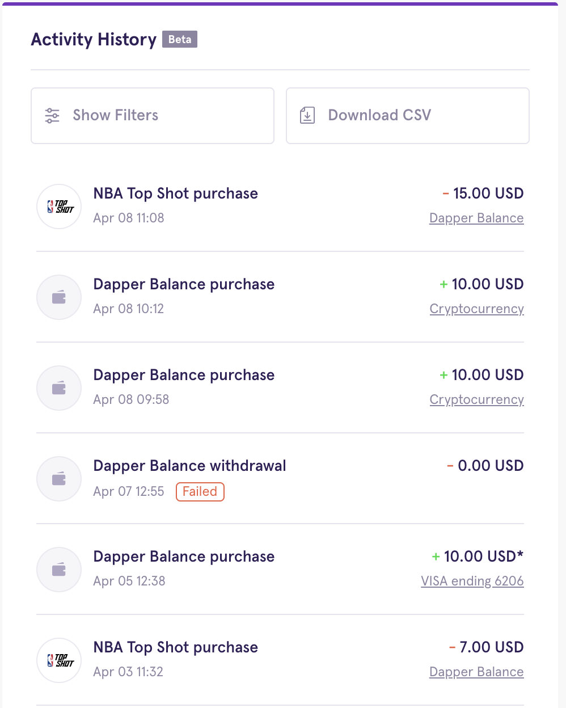

- 使用活动历史

	如果您想优化您的提要并仅查看活动历史记录的一个（或多个）子集，您可以使用不同的过滤器来实现。您可以按以下条件过滤：

	- 所有交易
	- Dapper Balance 购买
	- Dapper Balance 调整。这包括任何促销存款（例如，来自 Showcase 比赛的存款）。 
	- Dapper 余额提款
	- 打包购买
	- 市场购买
	- 市场销售
	- 待处理交易（包括任何仍处于“待处理”状态的付款或销售）

	只需选择“显示过滤器”即可查看您可以使用的所有过滤选项。您可能一次选择了多个过滤器。
- 请求 CSV 下载

	要请求导出活动历史记录的 CSV（逗号分隔值），请选择“请求 CSV 下载”以开始。需要注意的几点：

	- 每天只能下载一次 CSV。下载将在 24 小时内保持活动状态。
	- 可以在初始请求 24 小时后生成新的 CSV。 

	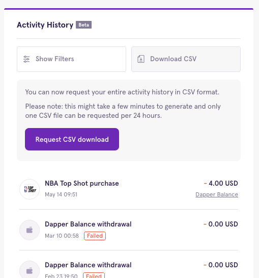
- 持续改进

	我们目前正在对活动历史记录功能进行一些改进，包括：

	- 每次活动后都会记录您的 Dapper Balance
	- 附加过滤功能
	- 所有活动项目的详细页面，不仅仅是购买

### 将您的帐户连接到 Google
您的 Dapper Flow 帐户现在可以使用 Google 登录！但是，如果您已经有一个现有的 Dapper 帐户，并且以后更喜欢使用 Google 登录，则需要先关联您的帐户。

	如果您的 Google 和 Dapper 帐户使用不同的电子邮件
您需要在 Dapper 帐户应用程序中更改您的电子邮件以匹配您所需的 Google 帐户。这可以通过导航到“帐户信息”并单击“更改登录电子邮件”来完成。 

成功更改后，退出并使用 Google 重新登录。然后系统会提示您关联您的帐户

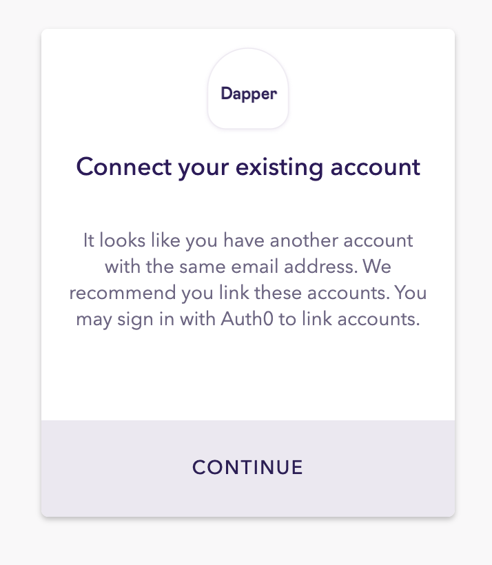

同意后，您将被带回登录页面，使用您的电子邮件和密码组合再次登录，您的帐户将链接到 Google

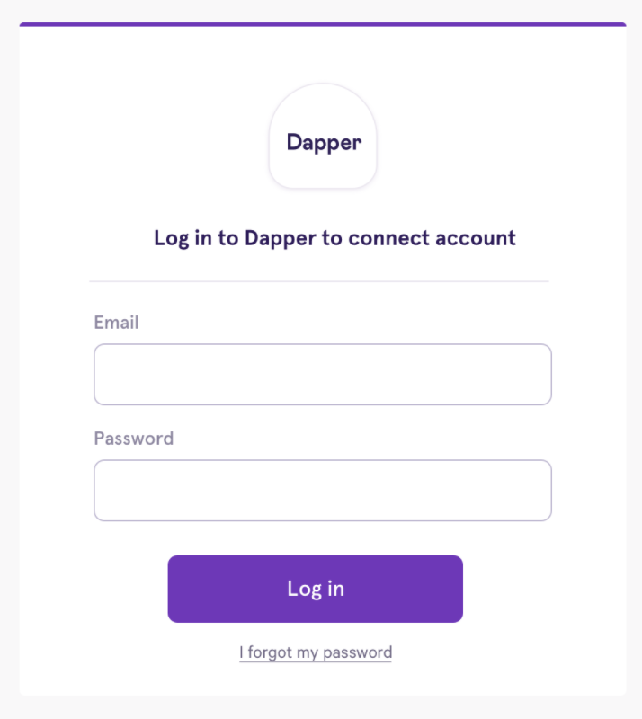

如果您已经为 Dapper 和 Google 使用相同的电子邮件

您可以通过先退出 Dapper 并注册 Google 来轻松连接您的帐户。此时将提示您连接您的帐户。同意后，您将被带回登录页面，使用您的电子邮件和密码组合再次登录，您的帐户将链接到谷歌。  

注意：只能在注册时关联您的帐户！如果您已经有一个现有帐户并使用不同的电子邮件通过 Google 进行注册，它将创建一个全新的单独帐户。 

### 什么是 Dapper Balance？
Dapper Balance 是在 Top Shot 市场上购买 Moments 的最简单快捷的方式。

除了购买 Moments 之外，当您在市场上进行销售时（恭喜！），该销售的资金也将添加到您的 Dapper 余额中。

- 向您的 Dapper Balance 添加资金

	您可以使用信用卡或加密货币直接通过您帐户的付款页面向您的 Dapper 余额添加资金，如下所示。

	为您的 Dapper 余额添加资金：

	- 打开您的 Dapper 帐户应用程序
	- 从左侧菜单中选择“付款和付款”
	- 在标题为“向您的余额中添加资金”的字段中输入您希望添加的金额
	- 点击“添加资金”
	- 选择是使用信用卡还是加密货币付款并确认购
 
 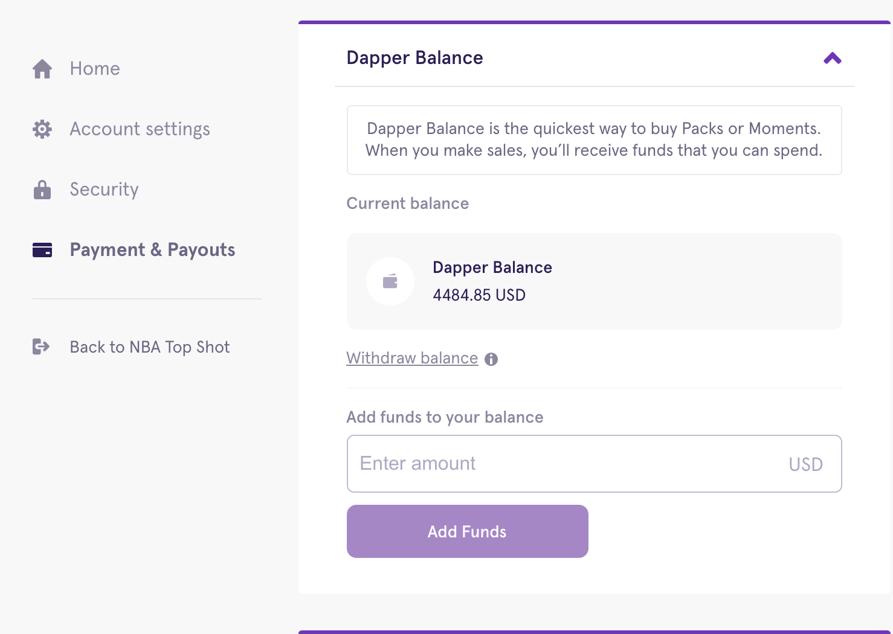
 
###  Dapper 支持哪些浏览器？
Dapper 目前支持以下浏览器：

- 铬合金
- 火狐
- 苹果浏览器
- 边缘

在不受支持的浏览器中使用 Dapper 可能会导致付款问题或错误。如果您确实收到错误消息，请首先切换到支持的浏览器。

## 付款
### Dapper 接受哪些付款方式？
Dapper 接受多种付款方式，包括信用卡和加密货币选项。 

- 您可以使用信用卡和借记卡（Visa、  Mastercard）购买。这是快速得分包的最佳选择。  
- 加密货币可与您首选的比特币 ( BTC )、以太 ( ETH )、比特币现金 ( BCH )、 DAI和 USDC 中的数字钱包一起使用。请注意，这些是 USDC 和DAI 的以太坊版本。我们不支持任何其他 USDC 或 DAI 代币变体。
- 您的 Dapper Balance 是 Flow 特有的信用系统，最适合用来捕捉 Top Shot 市场上最热门的交易。 

注意：预付信用卡或网上银行卡很可能会被拒绝。

### 我在哪里可以找到我的购买详情？
购买完成后，您可以在购买时收到的电子邮件收据中找到交易的详细信息。该电子邮件将包含您购买的商品、交易日期和时间以及您的付款 ID。

除了发送给您的收据外，您的银行对帐单还将显示您每次购买的“ PYMNTS DAPPER ONLINE ”。
### 我如何使用加密货币进行购买？
除了您的信用卡和 Dapper 余额之外，您还可以使用首选钱包中的加密货币完成购买。我们目前支持的货币有：

- 以太币 (ETH)
- 比特币 (BTC)
- 比特币现金 (BCH)
- DAI
- USDC

虽然交易是使用 Coinbase Commerce 完成的，但大多数加密钱包都可以使用（有些硬件钱包不行）。每笔交易都将收取标准网络费用，并且与信用卡交易类似，交易完成后您将通过电子邮件收到收据。

确认购买时，选择购买屏幕右上角的“使用加密货币支付”选项卡以开始购买加密货币：

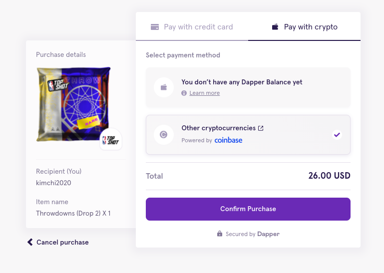
注意：在您选择的加密货币之前，所有加密费用都将以美元显示。强烈建议您通过输入完整的 ETH/BTC 金额来支付完整的加密货币金额，以避免出现任何错误（支付不足或多付）。 

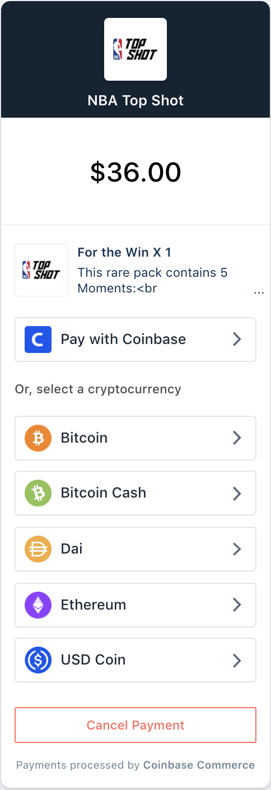

使用加密货币的市场购买

要使用加密货币在市场上购买个人时刻，您需要首先在您的 Dapper 帐户的付款页面中添加到您的 Dapper 余额。

- 在Payments 下，输入您要添加的 Dapper 余额金额
- 您将被定向到付款页面，您可以在其中选择使用加密货币付款选项卡下的 Coinbase 付款
- 通过 Coinbase Commerce 完成付款

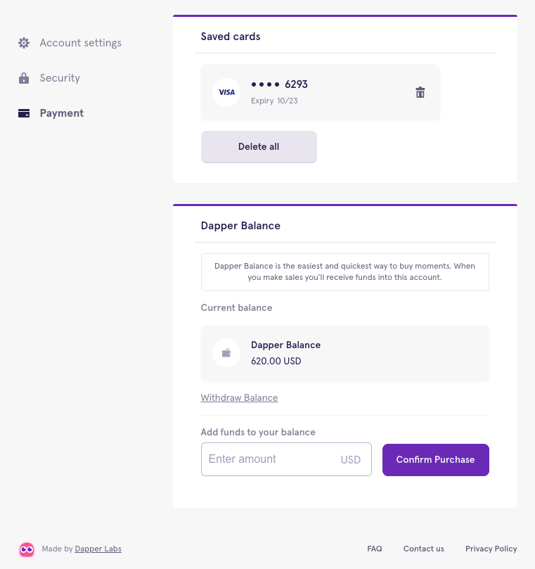

### 我可以用 FLOW 代币购买包吗？
Dapper 和 Top Shot 都运行在 Flow 区块链之上。如果您是 Flow 的早期支持者，现在可以使用您的 FLOW 代币购买 NBA Top Shot 礼包！

类似于在现有结账中使用您自己的钱包与 ETH 或 BTC 进行交易，您将能够使用 FLOW 与您的 Ledger 和 Blocto 钱包完成购买。

我怎样才能在我的 Dapper 中保持 FLOW？ 

目前，FLOW 代币只能保存在外部非托管 Flow 钱包中，例如 Ledger 或 Blocto。我们正在与监管机构积极合作，因此可以在 Dapper 中保存 FLOW，当这成为一种选择时，我们将提供进一步的更新。现在，请随时使用您的流量在 Top Shot 上购买礼包！

flow 相关

- [流程常见问题](https://www.onflow.org/faq) 
- [流代币经济学](https://www.onflow.org/flow-token-economics)
- [Flow 代币分配](https://www.onflow.org/token-distribution)
- [代币技术论文](https://docs.google.com/document/d/1HA8PpKTOLAUJFANqhz3mYB0_R50kN6FeX075lhI2s7U/edit#heading=h.yxgwcb39dny0)
- [Flow Coinlist 亮点](https://coinlist.co/flow) 

### 什么是少付、多付和延迟付款？
当使用加密货币购买时——无论是为了 Top Shot 包、市场上的时刻，还是为了更多的 Dapper 余额——Coinbase 都会让你知道你是否少付、多付或是否有延迟付款。

这些场景虽然都略有不同，但可能会导致购买体验延迟。 

#### 少付
顾名思义，少付意味着我们收到的资金少于试图购买的成本。另一方面，当向您的 Dapper 余额添加资金时，支付不足意味着我们从您的外部钱包收到的金额少于您尝试添加的金额。发生这种情况时，您的 Dapper 余额将更新为我们收到的金额。 

例如，购买一包时，少付意味着我们收到的金额低于该包的价格。发生这种情况时，我们的客户支持团队将联系您，并在您的 Dapper Balance 中偿还我们收到的加密货币数量。

在以下情况下可能会发生这种情况：

- 当您使用交易所时，购买总额将以美元而非加密货币计价。这可能会导致汇率关闭。
- 在发送交易之前不考虑任何平台费用（例如 Bitrex）。
- 不正确的金额是从您的钱包发送的。一个好的经验法则是确保您钱包中的总额与结账时的购买总额相符或高于购买总额。

以下是我们如何设置 Dapper Balance 购买以向用户提供他们支付的资金金额的示例。如果他们打开购买以添加 10 美元的 Dapper 余额，但他们向我们发送了 5 美元，我们将改为向他们的 Dapper 余额添加 5 美元。如果您寄出 15 美元，我们将改为添加 15 美元。只要您的付款按时到达并且地址正确，我们将始终能够确保用户立即获得他们的 Dapper 余额！

不幸的是，Dapper 无法控制 Coinbase 显示的错误。如果您认为这已经发生并供将来参考，您可以随时在 Dapper 发送到您的电子邮件的付款收据上进行确认。如果您有收据，那么您已成功上传到您的 Dapper Balance。
#### 多付
向您的 Dapper 余额添加资金时，多付意味着我们从您的外部钱包收到的金额超过您尝试添加的金额。请放心，您的 Dapper 余额将更新为我们收到的全部金额。 

如果您多付一包购买的费用，我们将退还您的 Dapper 余额差额。
#### 逾期付款
Coinbase 有一个标准的 60 分钟付款窗口。如果在这个长达一小时的窗口关闭后收到付款，我们将无法自动完成相关订单。但是，只要资金已发送到正确的地址，我们就会收到。 

如果包裹购买延迟付款，我们可能无法交付您最初尝试购买的物品。相反，我们将在您的 Dapper Balance 中补偿您的购买金额。如果 Dapper Balance 存款延迟付款，我们也会将资金添加到您的帐户中。

任何货币都可能发生延迟付款，但由于网络速度的原因，比特币和比特币现金尤其常见。如果您的交易没有发送足够的天然气，您也可能会遇到以太坊的延迟付款。

为避免延迟付款，我们建议使用不同的加密货币或使用您的信用卡付款。对于以太坊购买，如果您有选择，请通过发送足够的气体来支付交易来加快您的付款。 

请注意：我们的团队正在努力确保我们可以手动检测这些付款，这将使我们能够尽快将所需的 Dapper 余额存入您的帐户。我们还积极寻找少付和多付（对于包装购买）和延迟付款（对于所有情况），以便尽快将您的帐户记入贷方。

有关 Dapper 付款的更多信息，请查看此帮助中心条目和有关如何使用 Coinbase 向您的 Dapper 帐户充值的简短教程视频。

最后，有关 Coinbase 支付的更多信息，请查看他们的帮助中心。
#### 为什么我的付款失败？
在 Top Shot 市场上购买 Moments 或向您的 Dapper 余额添加资金时，有时付款会失败。

最常见的是，市场上的付款失败是另一个收藏家购买了您之前尝试购买的同一个 Moment 的结果。在尝试购买 Dapper Balance 时，付款通常会因 Coinbase 支付不足或多付而失败。 

请注意：当任何类型的付款失败时，您都不会被收取费用，尽管不同的付款方式需要不同的时间来协调。

- 尝试在市场上购买时：
	- 如果您尝试使用 Dapper Balance 付款，通常情况下您的退款将立即存入您的帐户。在网站上的高流量期间，您的退款可能需要几个小时才能显示。
	- 如果您尝试使用信用卡购物，您的银行需要 12-72 小时来相应地更新您的对帐单。
- 尝试向您的 Dapper Balance 添加资金时：
	- 如果您尝试使用加密货币支付，Coinbase 会通知您是否支付过少、多付或延迟付款。
	
	请注意：您仍会收到一封包含我们收到的正确金额的电子邮件，并且您的 Dapper 余额将根据发送的加密货币数量进行更新。此更新通常需要几个小时才能显示在您的帐户中，但在高流量期间最多可能需要 48 小时。 
	
	- 如果您尝试使用信用卡购买 Dapper Balance，您的银行需要 12-72 小时来相应地更新您的对帐单。
- 已知卡问题

	除了上面列出的支付失败情况外，我们还与我们的支付提供商合作解决了花旗银行、萨顿 和 Bancorp 银行卡有时拒绝我们收费的问题。这是因为我们收取 0 美元的授权费来确认一张卡，但该费用经常被 Chase 的欺诈团队阻止。如果您遇到这种情况，您需要直接联系 Chase 并让他们批准 0 美元的费用。

### 是否有任何需要注意的临时信用卡费用（现金预付款）？
通过信用卡购物时，您的银行可能会收取额外费用。Dapper 不收取这些费用 ——它们由银行直接收取。

已知的费用是：

- 国外交易费用。
- 现金预付费用。

如果收取，这些费用将在您的信用卡对帐单上显示为单独的行时间。已知的收取额外费用的银行有花旗银行、萨顿银行、Bancorp、美国银行和公民银行。如果未列出的银行也收取这些费用，请告知我们。 

使用加密货币进行的购买不会产生任何额外费用。

如果您使用美国卡支付了国外交易费或您认为不应支付的费用，请在此处提交支持票与我们的团队联系。 请在机票中附上您的收费屏幕截图。

## 存款和转账
### 如何向我的 Dapper Balance 添加资金？
您可以使用借记卡、信用卡或加密货币直接通过账户支付页面向您的 Dapper 余额添加资金。

- 您可以使用信用卡和借记卡（Visa 或 Mastercard）购买。这是快速得分包的最佳选择。
- 加密货币可与您首选的比特币 (BTC)、以太 (ETH)、比特币现金 (BCH)、DAI 和 USDC 中的数字钱包一起使用。请注意，这些是 USDC 和 DAI 的以太坊版本。我们不支持任何其他 USDC 或 DAI 代币变体。

最大化您的 Dapper 体验的最佳方式是使用 Dapper Balance 购买。这是在 Top Shot 市场上购买 Moments 的最简单快捷的方式。除了购买 Moments 之外，当您在市场上进行销售时（恭喜！），该销售的资金将添加到您的 Dapper 余额中。

为您的 Dapper Balance 添加资金：

- 打开您的 Dapper 帐户应用程序。
- 从左侧菜单中选择“付款和付款”。
- 在标题为“向您的余额中添加资金”的字段中输入您希望添加的金额。
- 点击“添加资金”。
- 选择是使用信用卡还是加密货币付款并确认购买。

## 身份验证
### 处理我的验证需要多长时间？
在大多数情况下，验证几乎会立即通过。完成后，您将在用于注册 Dapper 帐户的电子邮件帐户中收到确认。如果您的第一次尝试不成功，您将有几次机会上传您的 ID。  

如果您的验证失败，我们将需要进行人工审核。我们通常会在两天内与您联系，以获取完成验证所需的任何其他信息。我们收到您要求的文件后，可能需要几天时间来审核您提供的所有身份证明。在我们要求之前，请不要向我们发送文件。 

以下是一些可帮助您完成验证过程的提示：

- 如果您要提交驾照，请在光线充足的地方拍摄身份证正面和背面的照片，不要有任何眩光
- 确保您的身份证在照片中清晰可见且完全可见
- 自拍时，保持静止，直到您的照片被捕获并显示在屏幕上，相机读取您的脸部和捕获您的图像之间会有轻微的延迟。如果你移动，照片会变得模糊
- 如果您使用移动选项，请注意在 iOS 上仅支持 Safari 浏览器。如果您使用的是 Android，大多数浏览器（Chrome、Firefox、Brave）都可以使用
- 如果您的照片经常模糊，请尝试使用不同的设备（不同的手机、笔记本电脑或台式机可能有更好的相机）
- 确保您使用的 ID 有效且未过期
- 提醒：为了您的安全，请不要向我们发送个人信息，除非被要求这样做。我们绝不会要求您将个人信息发送到任何其他电子邮件地址。

### 身份验证故障排除
作为我们保证用户安全的承诺的一部分，身份检查只能通过您的 Dapper 帐户执行。所有身份证明文件必须通过我们的平台提交——我们不接受您的身份证明文件的电子邮件副本进行验证。如果以下所有步骤都准确完成，用户往往会自动获得批准。

以下是一些可帮助您完成验证过程的提示：

- 如果您要提交驾照，请在光线充足的地方拍摄身份证正面和背面的照片，不要有任何眩光
- 确保您的身份证在照片中清晰可见且完全可见
- 自拍时，保持静止，直到您的照片被捕获并显示在屏幕上，相机读取您的脸部和捕获您的图像之间会有轻微的延迟。如果你移动，照片会变得模糊
- 如果您使用移动选项，请注意在 iOS 上仅支持 Safari 浏览器。如果您使用的是 Android，大多数浏览器（Chrome、Firefox、Brave）都可以使用
- 如果您的照片经常模糊，请尝试使用不同的设备（不同的手机、笔记本电脑或台式机可能有更好的相机）
- 确保您使用的 ID 有效且未过期
- 提醒：为了您的安全，请不要向我们发送个人信息，除非被要求这样做。我们绝不会要求您将个人信息发送到任何其他电子邮件地址。

### 验证我的身份的过程是什么
为了保护我们的用户免受任何潜在的欺诈活动并真正拥有出色的体验，我们必须采取必要措施确保遵守金融业。身份检查过程是其中的重要组成部分。与其他在线支付服务类似，您总是被要求不时验证您的身份。这在 Dapper 上也是一样的。

完成身份检查分为三个步骤：

- 拍摄您提交的身份证件的照片（需要政府颁发的有效身份证件，但您使用的身份证件类型取决于您所在的地区。例如，如果您在北美，您可以选择使用您的司机的身份证件执照。其他地区需要护照）
- 自拍
- 填写包含详细信息的表格，例如您的住址

作为我们保证用户安全的承诺的一部分，身份检查只能通过您的 Dapper 帐户执行。所有身份证明文件必须通过我们的平台提交——我们不接受您的身份证明文件的电子邮件副本进行验证。如果以下所有步骤都准确完成，用户通常会自动获得批准。

### 为什么要验证我的身份？
这真的是关于社区的，我们让每个 Dapper 用户在他们与我们的体验早期的某个时候完成。为了保护我们的用户免受任何潜在的欺诈活动的侵害并真正获得出色的体验，我们必须采取必要措施确保遵守金融行业的规定。身份检查过程是其中的重要组成部分。与其他在线支付服务类似，您总是被要求不时验证您的身份。这在 Dapper 上也是一样的。

完成身份检查分为三个步骤：

- 拍摄您提交的身份证件的照片（需要政府颁发的有效身份证件，但您使用的身份证件类型取决于您所在的地区。例如，如果您在北美，您可以选择使用您的司机的身份证件执照。其他地区需要护照。）
- 自拍
- 填写包含详细信息的表格，例如您的住址

作为我们保证用户安全的承诺的一部分，身份检查只能通过您的 Dapper 帐户执行。所有身份证明文件必须通过我们的平台提交——我们不接受您的身份证明文件的电子邮件副本进行验证。如果以下所有步骤都准确完成，用户往往会自动获得批准。

## 提款
### Dapper 可以提供税务信息吗？
Dapper Labs 不报告账户收入活动，因此，所有用户独立负责所有会计需求。您应该始终就您的个人税款咨询您自己的税务或会计顾问。此信息无意提供或依赖于税务或会计建议。
### Dapper 提款限额如何运作？
Dapper 的所有提款，无论是以电汇到银行账户的形式还是提款到 USDC，都受到限制，以保护社区并遵守金融法规。

初始提款限额为每次 USDC 提款 2,500 美元和每次电汇 9,999 美元。

随着时间的推移，Dapper 提款限额会根据用户活动而变化。例如，提款的初始限额设置为较低的金额，但可以根据良好的财务行为逐步增加，就像信用卡限额增加一样。

有关一般 Dapper 提款流程的更多信息，请查看此[帮助中心指南](https://support.meetdapper.com/hc/en-us/articles/1500002320402-The-Dapper-Balance-withdrawal-process)。

您还可以找到如何撤回到地区法院的具体细节 在[这里](https://support.meetdapper.com/hc/en-us/articles/360059124673-Withdrawing-your-Dapper-Balance-in-USDC)，并撤销银行账户[这里](https://support.meetdapper.com/hc/en-us/articles/360058160093-Withdrawing-your-Dapper-Balance-to-a-bank-account)。

#### 电汇提款
- 提款基础
	- 要确认您的帐户是否已被授予提款权限，请导航到 Dapper 钱包中的“付款和付款”选项卡，然后单击“提款余额”链接。然后，您将看到以下通知之一： 
		- “提款 Dapper Balance ”弹出窗口突出显示您的提款选项。
		- 一条消息表明您的提款权限仍在审核中。
	- 目前，我们只能向符合以下条件的银行账户发出电汇提款：
		- 在美国、英国或加拿大的银行注册
		- 该帐户必须在您的名下
	- 电汇提款的最低金额为 30 美元。
	- 我们对每次转账收取 25 美元的手续费。即使银行拒绝转账，此费用也适用。此外，您的银行可能会收取自己的手续费。 
	- 电汇提款请求需要人工审核。在提交提款请求和将资金存入您的银行账户之间，请留出一些处理时间。 
	- 您的银行不需要在您居住的国家/地区，但必须在符合条件的国家/地区，并且银行账户上的姓名必须与您的 Dapper 身份证明上的姓名一致。 
	- 电汇到达银行账户时会转换为当地货币。银行设定汇率
- 添加银行账户

	向 Dapper 添加银行账户（美国、英国或加拿大）：
	
	- 导航到Dapper 钱包中的“付款和付款”选项卡。
	- 向下滚动到“保存您的银行详细信息”，然后选择您所在的国家/地区。

	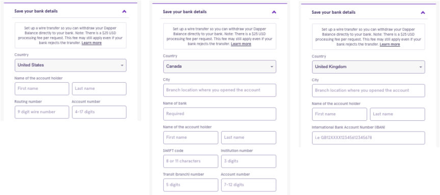
	
	最后，添加以下信息：

	- 账户持有人姓名：该姓名必须与您银行账户上指定的姓名一致。
	- 帐号：这是您在银行的唯一标识符。它通常是支票底部的中间数字，长度通常为 4-17 位。 
	- 帐单地址：此帐单地址必须与您提供给银行的帐单地址一致。
	- Routing / IBAN / Swift 号码：此号码基于您的银行帐户所在的位置。如果您的银行提供多个路由号码，请使用一个用于国内电汇。 
- 附加信息
	- 要详细了解其他可能的延迟或任何潜在问题，请参阅此帮助中心指南：[为什么我没有收到电汇？](https://support.meetdapper.com/hc/en-us/articles/1500007549842-Why-haven-t-I-received-my-wire-transfer-)
	- 如果您在美国、英国或加拿大没有可以接收电汇的银行账户，您可以将您的 Dapper 余额转换为 USDC，并将代币发送到任何可以接受 USDC 的以太坊钱包地址。
		- 请注意：纽约、 夏威夷、 明尼苏达和 阿拉斯加尚不提供 USDC 提款 。有关 USDC 提款的更多信息，[请点击此处](https://support.meetdapper.com/hc/en-us/articles/360059124673-Withdrawing-your-Dapper-Balance-in-USDC)。
	- 为避免延误或您的银行拒绝电汇，我们建议您提供以下信息：
		- 用于完成 Dapper 身份检查的名称
		- 您的银行存档的名称
		- 完成提款请求时输入的姓名
	- 这意味着在完成提款请求时输入的姓名必须与您银行账户上的姓名一致。对联名银行账户的提款可能会延迟或退回。
		- 请注意：如果您有常用的首选名称，请确保输入您的银行存档的完整法定名称。请参阅下表以进行说明。
 
	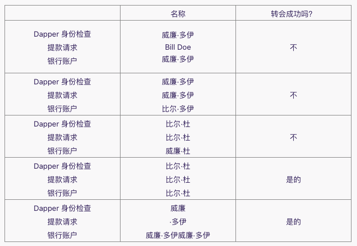

### 如何将我的 Dapper 余额提取到 USDC？
有两种方法可以从您的 [Dapper Balance](https://support.meetdapper.com/hc/en-us/articles/360047162113) 中提取 ：

- 通过将您的 Dapper 余额转换为 USDC 并将代币发送到任何接受 USDC 的以太坊钱包地址。
	- 请注意：纽约、夏威夷、明尼苏达州和阿拉斯加州尚不提供 USDC 提款。
- 通过直接电汇 至位于美国、英国和加拿大的银行账户。目前，这些是唯一可以进行电汇的国家。

将您的 Dapper 余额转换为 USDC

要开始此过程，请前往您的 Dapper 帐户并选择 [Payments & Payouts](https://accounts.meetdapper.com/payment)。然后：

- 选择提取余额。
- 选择您的提款选项——在本例中为USDC
- 输入您要提取的金额。请注意：您必须至少提取30 美元， 并且需要支付少量的取款费来支付汽油费用
- 输入以太坊钱包地址。这将是您的 USDC 代币的目的地，因此请在确认提款前仔细检查地址
- 如果这是您的第一次提款请求，请保存您的恢复代码并选择一种验证方法
- 然后系统会提示您通过短信或电子邮件（您选择交付方式）接收验证码
- 收到后，输入您的验证码。如果您愿意，您还可以使用您的恢复代码验证您的提款请求
- 最后，一旦请求获得批准，USDC 将被发送到您选择用于存款的以太坊钱包

常问问题

- 提款请求由人工审核。请在提交提款请求和将资金存入您的数字钱包之间留出一些处理时间。
- 如果您尚未完成身份检查，您将被要求在第一次提款前完成。有关此过程的更多信息，请单击[此处](https://support.meetdapper.com/hc/en-us/articles/360047221453-Getting-started-with-your-KYC-check)。
- USDC 可以发送到 Coinbase USDC 钱包或任何其他以太坊钱包。
- 提醒：纽约、夏威夷、明尼苏达州和阿拉斯加州尚不支持 USDC 提款。我们正在努力提供此选项，并将在该服务可用时立即更新社区。

### 为什么我没有收到我的电汇？
所有提款都经过审查过程。一旦获得批准，电汇到您的银行通常只需几个工作日即可完成。但是，有时电汇可能会很慢到达。您的银行也可能会持有您从 Dapper 提取的资金一段时间，然后再将其发放给您。这种延迟很难预测，具体取决于您的银行。

有时，电汇可能会失败。大多数情况下，这是由于在提出提款请求时输入了不正确或不完整的银行信息。例如：

- 您的路由号码可能有误。如果您的银行提供多个路由号码，请确保您使用的是一个进行电汇而不是自动清算所 (ACH)、直接存款、电子转账或其他任何方式。使用电汇以外的任何路由号码都会导致您的转账失败。 
-  您的帐号可能有误或不完整。
-  您的姓名可能不匹配。电汇只能发送到您名下的银行账户。请确保您使用的是您的个人银行账户，因为可能会退回到企业账户的电汇。对联名银行账户的提款也可能被延迟或退回。如果电汇失败，我们会与您联系。但是，我们还建议仔细检查您输入的信息，并让您的银行知道您正在尝试进行国内电汇。他们将能够帮助您验证任何详细信息。如果需要的话，

按照以下说明更新您的 Dapper 帐户上的银行详细信息：

- 打开您的 Dapper 帐户的付款和付款页面。
- 单击垃圾桶图标删除您保存的银行帐户。
- 添加您的银行信息，并提交。

保存您的银行帐户详细信息可能需要一分钟的时间，因此请稍等片刻，让信息处理完毕，然后再完成您的提款请求。  

已知银行问题

最后，如果您的银行不接受来自 Dapper 的电汇，电汇也可能失败。位于美国、英国和加拿大的绝大多数银行确实可以毫无问题地接受电汇。但是，有一小部分金融机构和路由号码在接收电汇时遇到了问题。他们是：

- 大步银行 - 103100195
-  富国银行 - 121000248
-  加拿大皇家银行（美国账户）- 63216608
-  Alloya 企业联邦信用合作社 - 271987635
-  Woodforest National Bank - 所有路由号码
-  Catalyst Corporate Federal Credit Union - 311990511
-  Go2Bank，绿点银行部门 - 124303120
-  Central Bancompany - 所有路由号码

注意：一些较小的银行可能需要额外的信息，例如“进一步贷记到”或“受益人账户”才能完成电汇。目前，我们不支持这些细节，但我们正在努力在未来添加两者。

有关一般 Dapper 提款流程的更多信息，请查看 [这篇文章](https://support.meetdapper.com/hc/en-us/articles/1500002320402-The-Dapper-Balance-withdrawal-process)。

您还可以找到如何撤回到地区法院更具体的细节在[这里](https://support.meetdapper.com/hc/en-us/articles/360059124673-Withdrawing-your-Dapper-Balance-in-USDC)，以及如何撤出银行账户，在美国，英国和加拿大在[这里](https://support.meetdapper.com/hc/en-us/articles/360058160093-Withdrawing-your-Dapper-Balance-to-a-bank-account)。

## 客户安全
### 我可以使用什么类型的身份证明进行身份检查？
在进行身份检查时，您将被要求提供有效的、最新的政府颁发的身份证明文件以完成该过程。但是，根据您所在的位置，您需要提供不同的身份证明文件。

- 美国、加拿大和西欧

	如果您位于这些地区，身份检查将要求您提交：

	- 州颁发的身份证件，例如驾驶执照或身份证
	- 政府签发的护照
- 美国、加拿大和西欧以外的

	所有其他地区，身份检查将要求您提交：

	- 政府签发的国际护照
- 不会被接受的身份证明文件

	无论您身在何处，在进行身份检查时，这些身份证明文件都不会被接受：

	- 学校 ID
	- 医疗 ID
	- 临时（纸质）身份证（例如临时许可证）
	- 居留许可
	- 公共服务卡
	- 军人身份证
	- 全球入境卡	

### 为什么我不能使用我的电子邮件地址登录我的 Dapper 帐户？
最常见的是，Dapper 帐户所有者无法使用他们的电子邮件地址登录他们的帐户，因为他们实际上是使用我们的 “使用 Google 注册” 选项注册了 Dapper。

因此，在登录 Dapper 时，请确保您在登录页面（而不是注册页面）上并继续使用 Google 登录。

- 如果使用我的电子邮件地址注册 Dapper 会怎样？

	一些 Dapper 帐户所有者最初使用他们的电子邮件地址注册并选择了密码。如果他们愿意，这些帐户所有者可以选择将 Google 登录添加到他们的帐户。 

	添加谷歌登录： 

	- 确保您已退出 Dapper 帐户
	- 进入 Dapper 登录屏幕
	- 选择“Continue with Google”并按照步骤操作
- 如果我添加了电子邮件和 Google 登录选项但仍然无法访问我的帐户怎么办？

	在极少数情况下，Dapper 帐户持有人可能已添加了两个登录选项，但他们的帐户未正确链接并且已创建两个 Dapper 帐户。

	在这种情况下，只需给我们发送电子邮件，让我们知道您希望继续使用哪个帐户，我们将与您合作以确保您的所有资产都转移到该帐户中。请注意：禁止拥有多个 Dapper 帐户，因此如果您发现自己处于这种情况，请尽快通知我们。   
	
### 设置两因素身份验证
请注意：自 2021 年 5 月 14 日起，所有帐户都需要双因素身份验证 (2FA)，作为对您的信息、数据和数字资产的额外保护。
#### 设置过程
- 在 Dapper 平台上，转到[安全部分](https://accounts.meetdapper.com/security)并选择“两步验证”。
- 输入您要使用的电话号码，然后单击“通过短信发送验证码”

	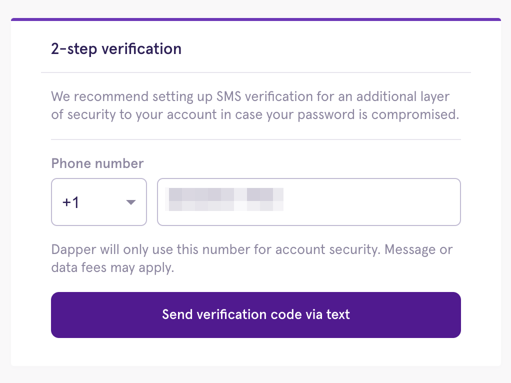
- 您应该会在 10 分钟内收到六位数的验证。输入代码并单击“验证”

	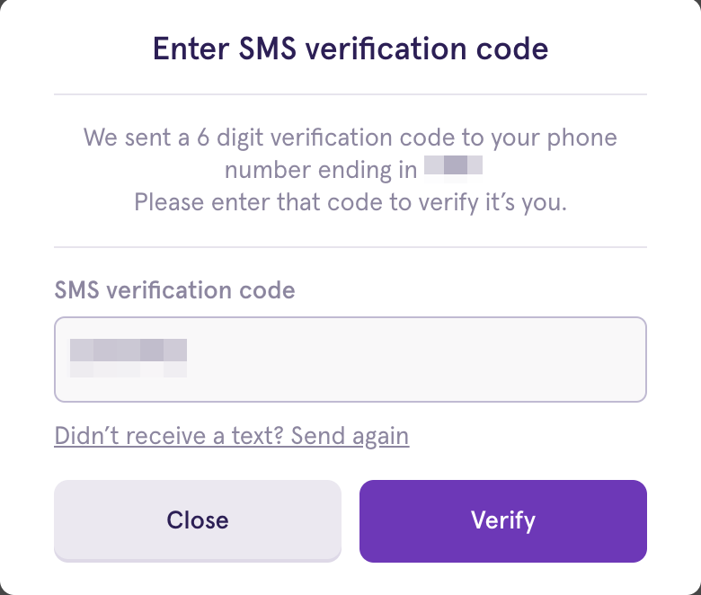
- 一经确认，一切就绪！下次尝试登录时，系统会向您发送一个新代码并提示您输入该代码以授权登录。

	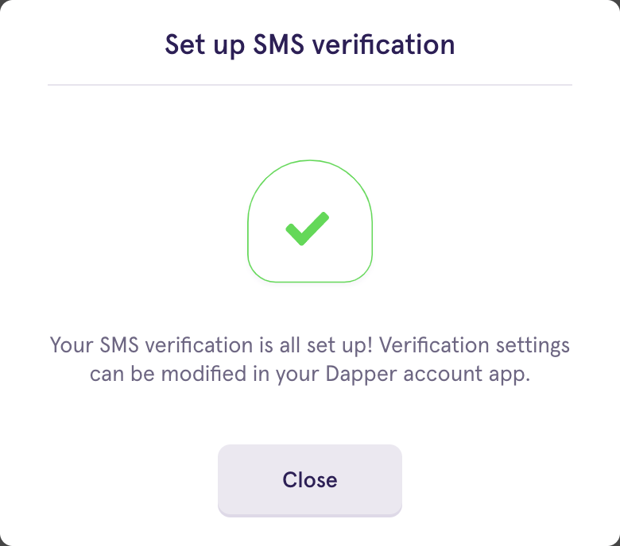
	
#### 故障排除步骤
如果您在接收短信时遇到问题，请尝试以下操作： 

- 仔细检查您输入的电话号码是否正确。
- 如果您的设备信号不强，您可以尝试重启。关闭手机，等待 30 秒，重新打开，然后重新发送 SMS 请求。 
- 如果您的设备当前设置为“漫游”，请切换回提供商的主网络。
- 对于来自印度的号码，如果您的号码在“请勿拨打”(DNC) 登记处，您将不会收到我们的短信验证，而需要使用电子邮件方式。

注意：如果您需要使用“重新发送我的验证码”功能，请间隔 5-10 分钟重试，否则可能会导致短信挂断。 

#### 通过电子邮件接收您的验证码	
- 点击“尝试其他方法”

	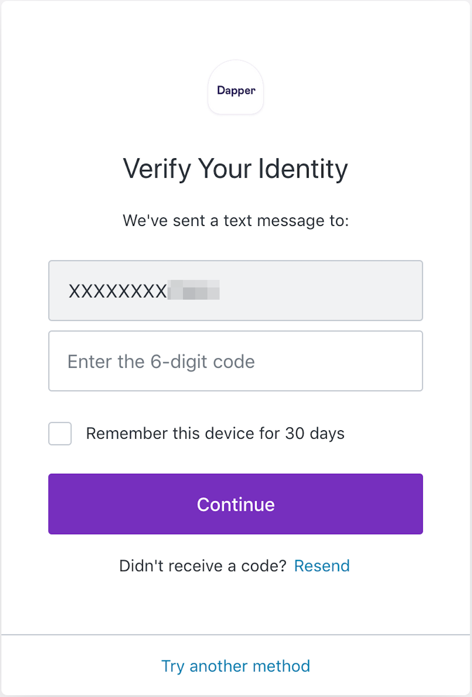
- 选择“电子邮件”

	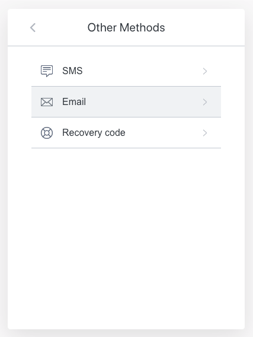
- 输入您的电子邮件地址，然后单击“继续”

	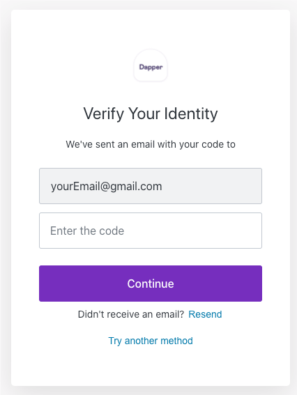
- 您应该会在 10 分钟内收到六位数的验证。输入代码并单击“验证”。
- 一经确认，一切就绪！下次尝试登录时，系统会向您发送一个新代码并提示您输入该代码以授权登录

### 了解身份检查
与其他在线支付服务类似，您将被要求验证您的身份以遵守金融法规、防止欺诈和保护社区。

作为我们对安全承诺的一部分，必须通过您的 Dapper 帐户执行身份检查。所有身份证明文件必须通过我们的在线平台提交。不接受验证您的身份证明文件的复印件通过电子邮件发送。

- 我什么时候会被要求验证我的身份？

	自 2021 年 5 月 14 日起，所有新用户都将被要求在帐户注册过程中验证其身份。如果您在该日期之前开设了账户，您可以随时启动身份检查。只需单击Dapper 帐户中的[“安全”选项卡](http://accounts.meetdapper.com/security)，然后导航到“身份检查”部分。

	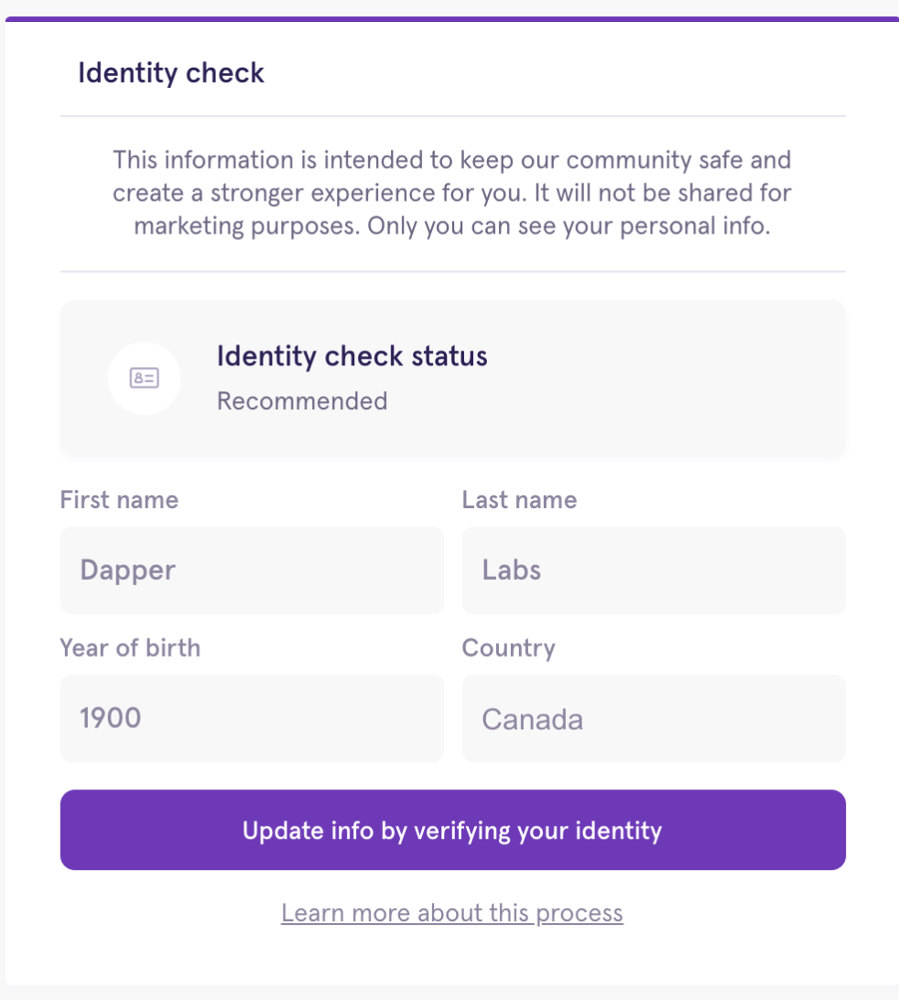

	虽然可以在任何时候启动身份检查，但在某些情况下需要进行检查：
	
	- 当您的帐户达到购买和销售财务活动的阈值时。  
	- 当您提交第一个提款 Dapper Balance 的请求时。
- 我可以使用什么类型的身份证明？

	需要政府颁发的有效身份证件，但您使用的身份证件类型取决于您所在的地区。例如，如果您在北美，您可以选择使用您的驾照。其他地区需要护照。

	有关哪些身份证明文件可以在哪些地区使用的列表，请查看此帮助中心条目。
- 身份查验流程

	完成身份检查分为三个步骤：

	- 拍摄您提交的身份证件（驾照、护照等）的照片 
	- 自拍
	- 填写包含详细信息的表格，例如您的住址 
- 为什么我的身份检查失败？

	虽然不常见，但一旦您完成该过程并提交您的信息，身份检查可能会失败。提交失败的一些原因是：

	- 过期的身份证
	- 损坏的 ID（裂缝或撕裂）
	- 黑暗或模糊的照片
	- 照片太刺眼
	- 地址不匹配（例如，如果您在生成 ID 后就搬家了）

	请注意：如果您在第一次尝试身份检查时未成功，请不要担心。您在此过程中有 7 次尝试。
- 身份检查疑难解答

	以下是一些重要提示，可帮助确保您的身份检查得到处理和验证：

	- 如果您要提交驾照，请在光线充足的地方拍摄身份证正面和背面的照片，不要有任何眩光
	- 确保您的身份证在照片中清晰可见且完全可见
	- 自拍时，保持静止，直到您的照片被捕获并显示在屏幕上 相机读取您的脸部和捕获您的图像之间存在轻微的延迟。如果你移动，照片会变得模糊
	- 如果您使用移动选项，请注意在 iOS 上仅支持 Safari 浏览器。如果您使用的是 Android，大多数浏览器（Chrome、Firefox、Brave）都可以使用 
	- 如果您的照片经常模糊不清，请尝试使用不同的设备（不同的手机、笔记本电脑或台式机，可能有更好的相机）
	- 确保您使用的 ID 有效且未过期

	提醒：为了您的安全，请不要向我们发送个人信息，除非被要求这样做。我们绝不会要求您将个人信息发送到任何其他电子邮件地址。
	
	
## 参考
[dapper help](https://support.meetdapper.com/hc/en-us)	
		