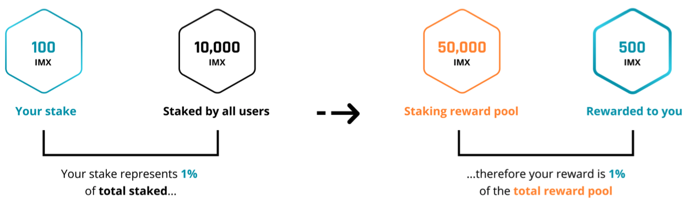
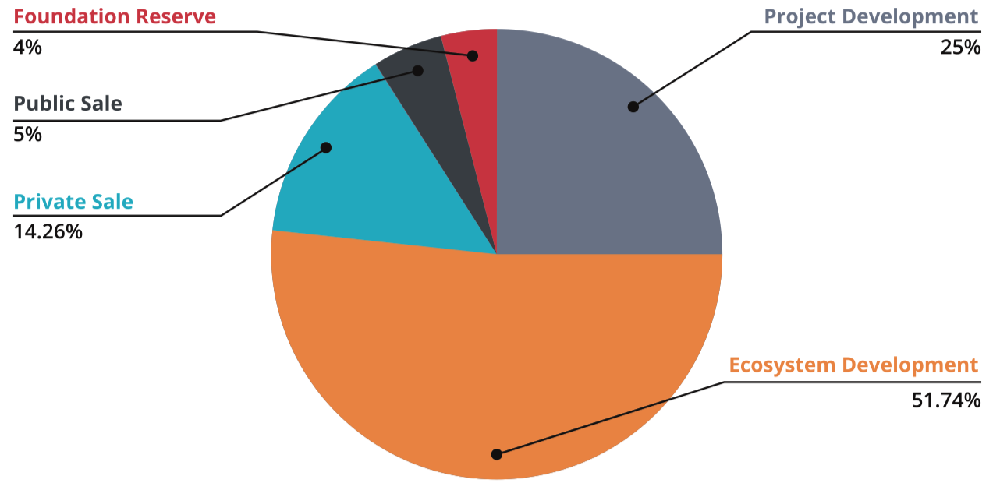
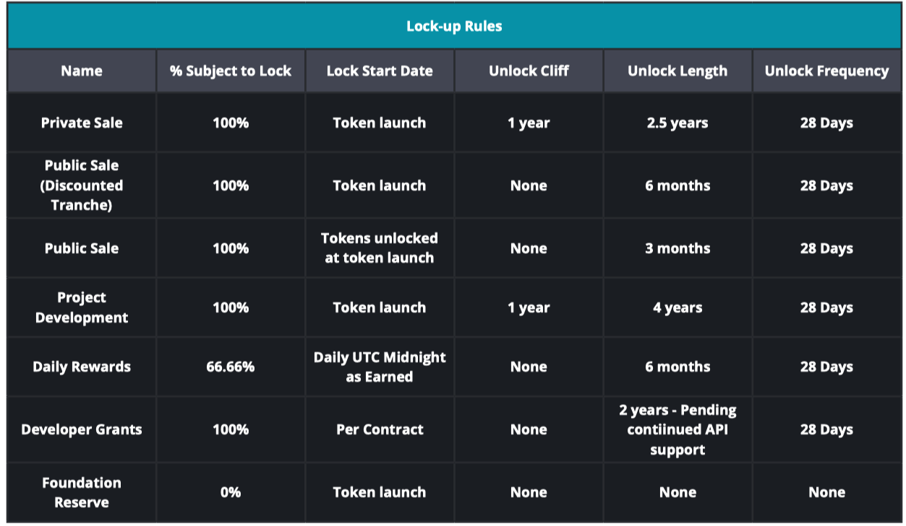
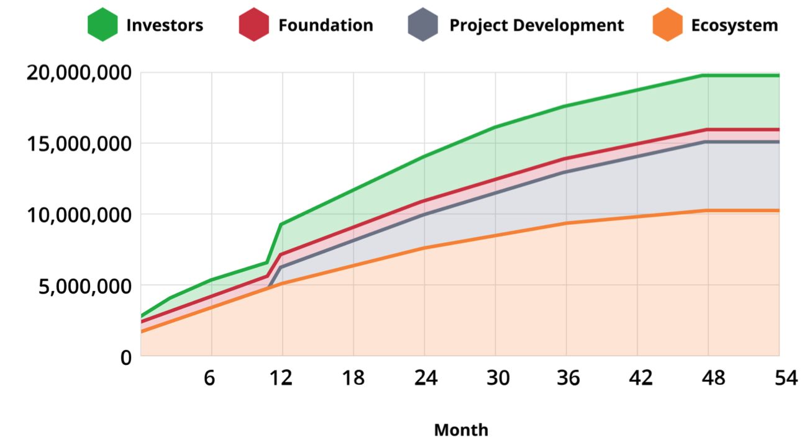
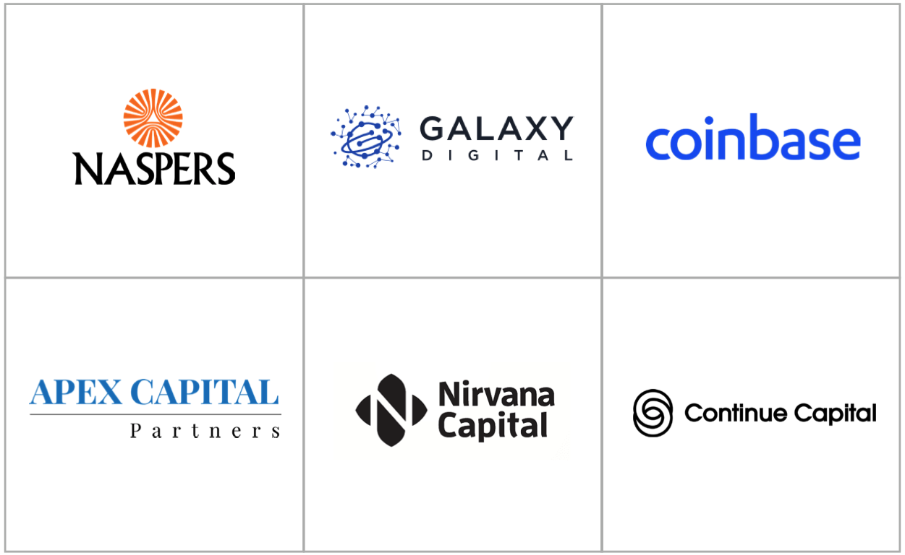

# Immutable X Whitepaper
## 1. 概述
Immutable X 是以太坊上不可替代代币(NFTs)的第二层(L2)扩展解决方案，具有

- 即时交易
- 大规模可扩展性
- 零天然气费用的造币和交易

所有这些都不会损害用户或资产安全。

Immutable X 是迄今为止技术上最先进的 NFT 扩展解决方案，使用 StarkWare 强大的 STARK 验证器和 rollup 技术开发。IMX 令牌是 Immutable X 协议的原生 ERC20 实用令牌，用户可以通过进行亲网络活动(如交易)来获得该令牌，并可用于支付费用、执行治理或对协议持有股份。
## 2. 数字资产所有权的未来
NFTs 是数字资产所有权的未来。非金融产品交易量从2020年上半年的1370万美元增长到2021年上半年的25亿美元(注解1)，而我们只是触及了非金融产品潜在深度和表面。我们已经看到主流艺术家推出非功能性测试项目，主要品牌进入该领域，现有的去中心化融资(DeFi)项目(如Uniswap)将非功能性测试作为其产品的核心部分——而我们才刚刚开始。

与此同时，以太坊正在经历历史上任何网络中最陡峭的增长曲线。以太坊现在的市值超过3000亿美元，而一年前还不到500亿美元。数以百万计的用户现在使用以太坊去中心化应用程序(DApps)，每天在网络上处理的交易额达数十亿美元。以太坊是占主导地位的 NFT 区块链，拥有绝大多数的主卷、次级卷和成功的应用。重要的是，几乎所有区块链和非功能性创新都发生在以太坊上:其他网络已经降级到复制以太坊的应用生态系统。这个生态系统正在大规模增长——仅在2021年就启动了数百个非功能性测试项目，所有这些项目都试图从历史上最大的数字转型中分一杯羹。

举个例子来说明非功能性测试项目的市场规模，游戏目前是非功能性测试开发者的主要目标之一，这是有充分理由的:

玩家是精通技术的早期使用者，而游戏是一项大业务。游戏目前是一个价值3000亿美元的产业，预计在 2021 年至 2025 年期间将以每年 10% 的速度增长，(注解2)超过体育、电影和音乐产业的总和。(注解3)自2018年以来，玩家在游戏内部资产上的花费超过1000亿美元，包括独特的角色皮肤、道具和独家解锁内容。这些内容是令牌化的绝佳机会:如果用非功能性语言来表示，这些资产中的每一个都会对用户更有价值。

所有独特且可交易的东西，包括美术作品、游戏资产和实体商品的所有权，最终都可以被表示为公共区块链 NFTs。数字内容，如视频、歌曲或图像，可以被标记为确实稀缺的数字收藏品，从而实现一种新型的创造者-观众关系。独特的实物商品，如钻石、稀有金属和房地产或运动鞋等财产也可以代币化为 NFTs。作为NFTs，这些资产将在全球流动性市场上交易，并能够插入为交易 NFTs 而构建的所有工具(例如租赁、衍生品、交易所、钱包)。

多年来，数字商品一直不如实体商品:没有稀缺性，没有真正的所有权，而且受到严格限制。随着我们越来越多的生活变得数字化，NFTs 显然是所有权的未来:数字商品不仅等同于实体商品，而且更好。

那么，为什么不是每个独特的数字资产都是以太坊非功能性产品?
## 3 Ethereum非功能性测试的局限性
尽管以太坊在整体上占据主导地位，对 NFTs 的需求也很明显，但要想成为将 NFTs 扩展到全球受众的底层平台，以太坊仍有很多障碍需要克服。越来越多的其他区块链，在没有以太坊网络效应的情况下，正在竞争赢得非功能性金融市场，通常是通过牺牲以太坊的安全，以提高其可扩展性和改善其用户体验。以太坊面临的主要挑战是
### 3.1 低可伸缩性
以太坊为了保持其安全性和去中心化，与传统数据库相比，其吞吐量很低:每秒5到15个交易(TPS)。因此，以太坊活动的大规模增长导致了网络拥堵和交易时间变慢。它还提高了天然气价格(注解4)，导致许多用户的交易变得不经济，让开发商和交易商望而却步。即使在以太坊 2.0 迁移完成后，交易吞吐量也会受到限制，主流游戏微交易的交易成本也会令人望而却步。
### 3.2 用户体验差
目前，以太坊非金融交易的用户体验还没有准备好被主流采用。交易需要几分钟或几小时的时间来确认，而且往往无法成功或提前完成，这极大地影响了用户满意度、价格发现和整体流动性。现有的解决方案或替代区块链只能通过牺牲用户资产安全或网络去中心化来改善这种用户体验。此外，非功能性钱包体验往往缺乏——它们令人困惑，回收机制差，不显示必要的信息来帮助用户做出明智的购买决定。
### 3.3 开发慢
目前，非功能性测试应用程序或市场开发人员将大部分开发时间花在构建和配置项目的区块链组件上。这让他们忽略了真正重要的事情:围绕真正的资产所有权为用户创造奇妙而独特的体验。开发人员需要学习新的编程语言和范例，然后立即使用它们来编写安全关键型应用程序。

- 他们没有用于创建传统应用程序的工具
- 没有简单的 api
- 没有特定于平台的sdk
- 没有预先构建的基础设施。

这为新项目的进入创造了一个巨大的障碍，并阻止了许多奇妙的非功能性测试体验的启动。
### 3.4 流动性不足
由于其异质性，NFT 本质上比其可替代的 ERC-20 对应物的流动性更低。每个 NFT 都必须根据其唯一 ID 进行买卖。 这意味着要为每个 “金龙” NFT 提供 1 ETH，您可能需要打开数百个买单——而这些订单甚至不会涵盖新铸造的“金龙”。 这个问题存在一些解决方案，但它们显着增加了铸造和交易的成本。 个别市场在改进这一发现过程方面投入了大量资金，但这些实施通常会进一步分散流动性，对价格发现产生负面影响。 最终，这不仅会影响个人用户，还会影响整个 NFT 市场，因为交易者无法快速出售其资产，也无法获得最佳价格。
## 4 Immutable X：以太坊 NFT 的下一代协议
Immutable 认为 NFT 用户和开发人员不应该在以太坊的安全性和网络效应之间做出选择，并为其用户创造世界一流的体验。 Immutable X 是 NFT 的尖端协议，它使项目能够在第 2 层以太坊上构建，并具有出色的开发人员和用户体验。这是通过几个核心组件实现的
### 4.1 ZK-Rollup 缩放引擎
用以太坊联合创始人 Vitalik Buterin 的话来说，“以太坊生态系统可能会全力以赴作为近期和中期未来的扩展策略”。 (注解5) Immutable X 将特定于 NFT 的交换和证明逻辑与 StarkWare 开发的尖端汇总技术相结合，创建了有史以来最先进的 NFT 交易工具。汇总允许世界一流的可扩展性和用户体验，同时保留以太坊的底层安全性。他们通过批处理大量交易，为这些交易生成“有效性证明”，然后将该证明提交给 L1 智能合约来做到这一点。 Immutable X 的 rollup 允许每秒超过 9,000 次 NFT 传输、交易和造币，达到并超过主流 NFT 项目所需的规模。有关 Immutable 的 rollup 实现的详细信息，请参阅第 5 节。
### 4.2 API 抽象层
为了更轻松地构建 NFT 应用程序，Immutable X 将这个扩展引擎封装在一组强大的 REST API 中。在 Immutable X 上，每一次交互，从铸造到交易再到转移，都像 API 调用一样简单。将复杂的异步区块链交互（可能需要几分钟或几小时）转换为同步 REST API 调用，是对现有区块链开发范式的强大升级。无需直接与智能合约交互，该领域的新进入者（例如成熟的游戏和内容公司）可以更快地启动更好的项目。
### 4.3 支持 NFT 的钱包
与其他区块链或侧链不同，Immutable X 目前支持所有桌面以太坊钱包，无需强制用户切换网络。该协议提供了一个中间层（“链接”），可实现世界一流质量的 NFT 特定钱包体验。这也让 Immutable X 能够支持蓬勃发展的第三方市场生态系统，而不会带来安全风险：用户可以依靠 Immutable X Link 来确保他们购买的资产不会被欺骗。
### 4.4 平台 SDK
平台和编程语言特定的软件开发工具包 (SDK) 允许合作伙伴更轻松地与 Immutable X 集成。目前，一个 Typescript SDK 实现可用，可用于将协议轻松集成到网站中。无论平台如何，SDK 都允许对 Immutable X API 和钱包进行类型化访问。未来，SDK 将提供所有常见编程语言以及 Android、iOS、Unity 和 Unreal 等开发平台。与 API 相结合，Immutable X SDK 将允许合作伙伴在数小时而不是数周内构建 NFT 项目。
### 4.5 共享流动性和订单簿
与其他 NFT 扩展解决方案不同，Immutable X 提供共享的全球订单簿以促进协议流动性。这意味着在一个市场上创建的订单可以在另一个市场上执行，从而促进更有效的市场引导和价格发现。这也意味着 NFT 市场可以建立在没有后端的 Immutable X 上。 Immutable 认为，最大化 NFT 流动性的一个关键方法是允许这些 NFT 在针对不同客户的不同市场上进行交易——我们很乐意看到在 Immutable X 上发展出一个蓬勃发展的第三方市场生态系统！
### 4.6 对世界级合作伙伴的合规性和支持
目前，世界上一些最大的公司正在探索 NFT。然而，他们经常担心 NFT 的监管影响，包括版权保护和 AML/KYC 立法。 Immutable X 将提供一个完全合法合规的平台，能够成为这些大型项目的可信赖合作伙伴，以便将它们保留在以太坊上。我们认为，购买 NFT 应该像在传统电子商务中购物一样简单，而不会牺牲用户的监护权。
### 4.7 默认市场和交易历史浏览器
合法性是 NFT 价值的主要贡献者。 Immutable X Marketplace 的存在是为了提供在协议上交易 NFT 的默认家，让用户和开发人员相信总会有一个交易场所。 Immutable X Marketplace 还降低了内容创建者和没有资源来创建自己的交易体验的小型开发者的进入门槛。验证您的交易历史对于促进区块链生态系统中的信任和合法性非常重要，Immutable X 也不例外，任何人都可以在这里验证交易和查看历史状态。
## 5 协议架构和特性
### 5.1 汇总设计
Immutable X 的核心是 zk-rollup 扩展引擎，它是与 StarkWare 合作开发的，使用他们的 StarkEx 证明者和验证者。首先，让我们大体讨论一下 rollup：

在 zk-rollup 中，

- 首先用户将资产锁定在链上智能合约中：这些资产被“存入-deposited”到 L2 中。
- 然后这些资产可以使用 L2 交易进行交易，这些交易由“运营商-operator”实体排序为一致的历史序列。
- 然后将交易分组为“batch-批”或“block-块”，并生成该批有效性的证明。
- 最后将该证明发布到链上并通过更新链上状态的智能合约进行验证。

使用这种链上状态，用户可以解锁他们的资产（从汇总中“退出”）。

为了更好地支持下一代 NFT 的需求，已经做出了几个重要的设计决策：

#### 5.1.1 Vault Merkle 树
Immutable X 的“资产状态-asset state”表示为一棵巨大的 Merkle 树，其中每个叶节点都是一个包含资产的保险库，每个其他节点都是其两个子节点的哈希值。管理这棵树的逻辑在两个地方编码：

- 首先，在管理存款、取款和状态更新的链上智能合约验证器中。该合约存储默克尔树的根，并确保该根只能在存在有效证明的情况下更新，因此金库默克尔树不可能转变为无效状态。目前，该合约可通过时间锁定升级 (目的是最终使合约逻辑不可变)。
- 其次，在 L2 证明逻辑中，用 StarkWare 的 Cairo 开罗语言编写，它确定了有效状态转换的要求（例如，验证用户转移资产是否实际控制了该资产）。

#### 5.1.2 SNARKS 上的 STARK
Immutable X 使用 STARK 证明而不是更常见的 SNARK 证明。 STARK 证明是证明技术的最新进展，旨在解决 SNARK-rollup 的关键问题，即：

- SNARK 需要可信的设置仪式
- SNARK 不是后量子安全的
- SNARK 依赖极其复杂的密码学，容易出现实施错误

STARK 证明在链上发布时更大且成本更高：我们认为这是为了提高用户安全性的可接受权衡。

#### 5.1.3 数据可用性
如果 Immutable 变得完全没有响应并且协议开发停止，用户将需要他们的交易数据可用才能提取他们的资产。 Immutable X 支持两种数据可用性模式：

- 在 rollup 模式下，每批之间的状态变化发布到 L1，保留 L1 安全性，但为每笔交易增加了一个小的线性成本。
- 在 validium 模式下，数据可用性委员会 (DAC) 对每个批次进行签名，以表明他们保留了一份数据副本。如果一个委员会成员是诚实的，用户将能够成功退出协议。目前，Immutable 的 DAC 包括：
	- Immutable
	- StarkWare
	- Deversifi
	- Consensys
	- Nethermind
	- Iqlusion
	- Infura
	- Cephalopod。

在这两种情况下，系统都是去中心化的：即使 Immutable 消失、被黑客攻击或被恶意攻击，协议也能恢复，用户资产是安全的。

### 5.2 资产铸造
Immutable X 的主要优势之一是资产可以完全在 L2 中铸造，同时保留 L1 的安全性。每个资产都可以使用不可变的元数据进行铸造，也称为“铸造 blob-minting blob”或“蓝图-blueprint”，这些元数据将在资产提取时传递给 L1 智能合约。该技术已被用于在 Immutable X 上铸造超过 1000 万个 NFT（超过 L1 上的所有 ERC721 NFT）。

资产也可以有 “可变元数据”，它将定期从铸造应用程序的服务器轮询，每个应用程序可以选择提供一个“元数据模式”，它将通知应用程序每个资产的可变元数据属性的理想表示。这种不可变元数据和可变元数据支持的组合允许使用 NFT 来表示每种类型的数字资产——从具有不断变化的体验级别的游戏资产到基于不可变种子和可变用户输入的生成艺术品 NFT。
### 5.3 签署交易
为了在 Immutable X 上进行交易，用户需要从自定义派生一个密钥对， STARK-友好的椭圆曲线派生的密钥对。为了解决这个问题，我们建立了“链接-Link”，作为任何以太坊钱包和 Immutable X 之间的中间层。 用户签署安全消息，该消息用作生成 STARK 密钥对的种子。这将钱包安全和恢复“委托”给用户的底层以太坊钱包，因为即使 STARK 密钥对丢失，用户也可以使用新的以太坊签名重新生成它。在 Link 内部，这个 STARK 密钥对随后用于签署交易，每个签名的精确编码由交易类型决定。
### 5.4 费用
费用是 Immutable X 协议的主要收入来源。目前，Immutable X 对所有主要资产的销售收取 2% 的费用，并对每笔 NFT 交易（以购买货币计价）收取 2% 的费用。由于我们对 Immutable X 费用的目标是在应用程序开发人员、市场和交易者之间调整激励措施，因此其他生态系统参与者也将能够设置费用：

1. 市场也可以为每个订单添加自己的费用。由于 Immutable X 提供了一个可供所有市场访问的共享订单簿，在一个市场（“制造商-maker”）上创建的订单可以在另一个市场（“接受者-taker”）上填写，两者都收取费用。
2. 资产发起人可以对他们铸造的每个 NFT 收取版税，以从该资产的每次后续购买中收取费用。版税是资产销售价格的固定百分比，在 NFT 铸造后无法调整。

资产发起者和市场之间的这种激励措施为游戏等企业或艺术家等个人创作者开辟了全新的收入来源。他们以前从未能够从对其创作的持续欣赏中受益。这个系统给了他们巨大的动力，让他们继续让这些资产对目前持有它们的人有价值。

## 6. IMX 代币
IMX 是一种 ERC-20 实用型代币，旨在奖励 Immutable X 上的亲网络活动，例如交易、流动性提供和构建应用程序。该代币将交易者、创作者和市场之间的激励措施保持一致，以便所有参与者都能从协议活动中受益。 Immutable 已与代币发行商 Digital Worlds Ltd. NFTS（“基金会”）合作，分发 IMX 以用于 Immutable X 协议。 Immutable 是开发 Immutable X 协议和代币的独家服务提供商，将由基金会管理。 Immutable 的董事或员工以及基金会董事都不会直接获得任何代币作为其服务或参与项目的报酬。
### 6.1 代币效用
目前 IMX 有三个核心用途
#### 6.1.1 费用
Immutable 协议费用的 20% 必须以 IMX 代币支付。这笔费用可以直接在 IMX 中支付或者 Immutable 会在公开市场上自动将实际购买货币（例如 ETH）换成 IMX。这意味着用户无需明确持有 IMX 代币即可在协议上进行交易。请注意，不存在纯粹基于 IMX 代币所有权的 Immutable X 协议收入的权利、分配或权利。
#### 6.1.2 质押
作为 6.1 中描述的费用捕获机制的一部分收到的 IMX 代币将被发送到“staking 奖励池”。每月定期，该池将按比例分配给所有在 Immutable X 上积极质押其 IMX 代币的用户。 相对于所有其他活跃质押者，用户的奖励将与他们在当月质押的 IMX 数量成正比。 Staking 将在token 发布几个月后激活。

为了让您的 IMX 被视为抵押，您必须：

- 在 L1 或 L2 上持有 IMX
- 在过去 30 天内对治理提案进行过投票，并且
- 任何一个：
	- 在 Immutable X 上持有 NFT； 或者
	- 在过去 30 天内完成交易。 

由于奖励是在 L2 上分配的，因此用户需要将 L2 钱包与其 L1 钱包相关联，才有资格获得 Staking 奖励。请注意，质押奖励条款可能会通过协议治理或类似过程进行更改。一旦将其添加到协议中，Staking 将开始。

#### 6.1.3 去中心化治理
代币持有者将能够通过去中心化治理对代币相关提案进行投票。提案将包括诸如如何分配代币储备、对开发者赠款进行投票、激活每日奖励和代币供应变化等主题。可以通过适当的分散治理流程添加其他提案类别。我们的目标是通过用户投票不断增加代币的效用和去中心化。

为了提交投票提案，个人需要拥有一定的代币门槛，这将在以后确定。基金会有权提出对整个生态系统有利的项目进行投票，并将在所有代币持有者投票的提案的策划中发挥促进作用。考虑到商业和技术实施限制，所有成功通过的投票将相应地并尽快执行。协议治理在 L1 上执行，钱包余额来自 L1 和 L2。用户持有的代币越多，他们的投票权就越大(pos?)。
### 6.2 代币供应与分配
将有 20,000,000 个 IMX 代币，临时分配给以下领域：

目的|配额|目标
---|---|---
生态系统开发|51.74%|分配部分用于用户奖励、开发者赠款、流动性提供和营销目的。 请参阅 6.3 中的完整细分。 
项目开发|25%|分配给 Immutable X 协议的开发。 由服务提供商进行开发，Immutable。 私人有限公司
私人销售|14.26%|分配给机构和个人的私人销售投资者。
公共销售|5%|分配给 IMX 公开发售。
基金会储备基金|4%|分配给与生态系统发展相关的举措，主要是为交易所（集中和分散场所）提供流动性。

注意：这些细分是目前的基本指标，以后可能会发生变化。

### 6.3 生态系统发展细分
生态系统开发分配将奖励给那些在 Immutable X 上进行亲网络活动的人。这些奖励旨在增加活动、扩大使用应用程序并激励第三方开发人员使用我们的技术开发他们的项目。它包括两个主要举措：
#### 6.3.1 每日奖励
每一天，用户都有机会通过进行亲网络活动来赚取积分，例如交易、存入或铸造资产。积分的确切计算将在稍后概述，并可能在倡议开始后进行调整。每 24 小时，每日 IMX 奖励池将根据用户在所有用户获得的总积分中所占的比例分配给用户。这些每日奖励代币中的三分之二 (66.6%) 需要进行六个月的线性解锁，以确保使用和奖励与长期协议用户保持一致。用户奖励将在稍后通过协议治理机制激活。
#### 6.3.2 开发者资助
可能会向有兴趣在 Immutable X 上进行开发的各方提供开发人员补助金，并设置里程碑以确保开发人员为协议贡献价值。一些资金将由基金会直接分配，一些将由协议的去中心化治理分配。
### 6.4 代币解锁
特定用户组的代币将逐步解锁。这些代币可以处于以下三种状态之一

1. 锁定：不可交易、质押或提现
2. 等待Cliff：不可交易或提现，但有资格进行质押和投票
3. 解锁：可交易、质押和提现

如果不是因为Cliff，它们会被解锁，那么代币正在等待Cliff。

例如，如果一方分配了 10,000 个代币，解锁时间为 2 年（定义如下），

- 1 年 Cliff，30 天解锁频率，而 1 个月后没有代币解锁，他们将解锁 1/24 如果没有 Cliff。
- 因此，1/24 是 “等待Cliff”。 2 个月后，没有任何代币被解锁，但 2/24 现在是 “等待Cliff”。

定义

类型|可交易|可用于支付交易|可提现|可质押|可投票
---|---|---|---|---|---
锁定|0|0|0|0|0
等待|0|0|0|1|1
解锁|1|1|1|1|!

不同段的代币锁仓规则见下表。 该表中使用的术语定义为：

1. Percentage Subject to Lock：被锁仓的代币占比
2. Lock Start Date：从悬崖和解锁时间开始计算
3. Unlock Cliff：不解锁代币的时期
4. Unlock Frequency：解锁数量多久更新一次

### 6.5 代币供应时间表
IMX 的循环供应旨在激励长期增长和可持续性。 预计的流通供应时间表如下图所示（基于解锁日期的预测）

## 7. 关于 Immutable
Immutable 是一家行业领先的 NFT 技术公司，拥有 100 多名成员，背景涵盖区块链、FAANG、金融、金融科技和管理咨询。 Immutable 是 Immutable X 协议的开发商，也是流行的 NFT 项目 Gods Unchained 和 Guild of Guardians 的开发商和发行商。

Immutable 于 2018 年获得了种子轮融资，并于 2019 年 9 月获得了 1500 万美元的 A 轮融资，投资者包括：

## 8. 法律免责声明

## 参考
1. 2021年上半年，非功能性产品的销售额激增至25亿美元, https://www.reuters.com/technology/nft-sales-volume-surges-25-bln-2021-first-half-2021-07-05/
2. 2020-2025年全球视频游戏市场价值, https://www.statista.com/statistics/292056/video-game-market-value-worldwide/
3. 全球游戏产业价值超过3000亿美元… https://newsroom.accenture.com/news/global-gaming-industry-value-now-exceeds-300-billion-new-accenture-report-finds.html
4. 鲸鱼获利作为高以太坊天然气费用副业零售 DeFi 投资者，https://cointelegraph.com/news/whales-profit-as-high-ethereum-gas-fees-sideline-retail-defi-investors
5. 不完整的汇总指南，https://vitalik.ca/general/2021/01/05/rollup.html