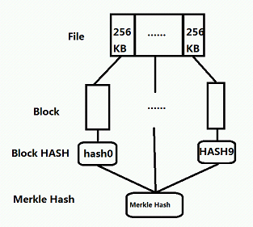
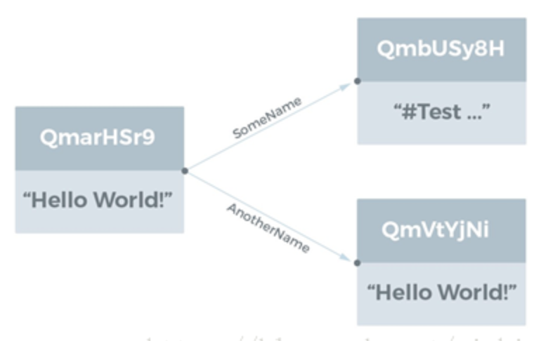
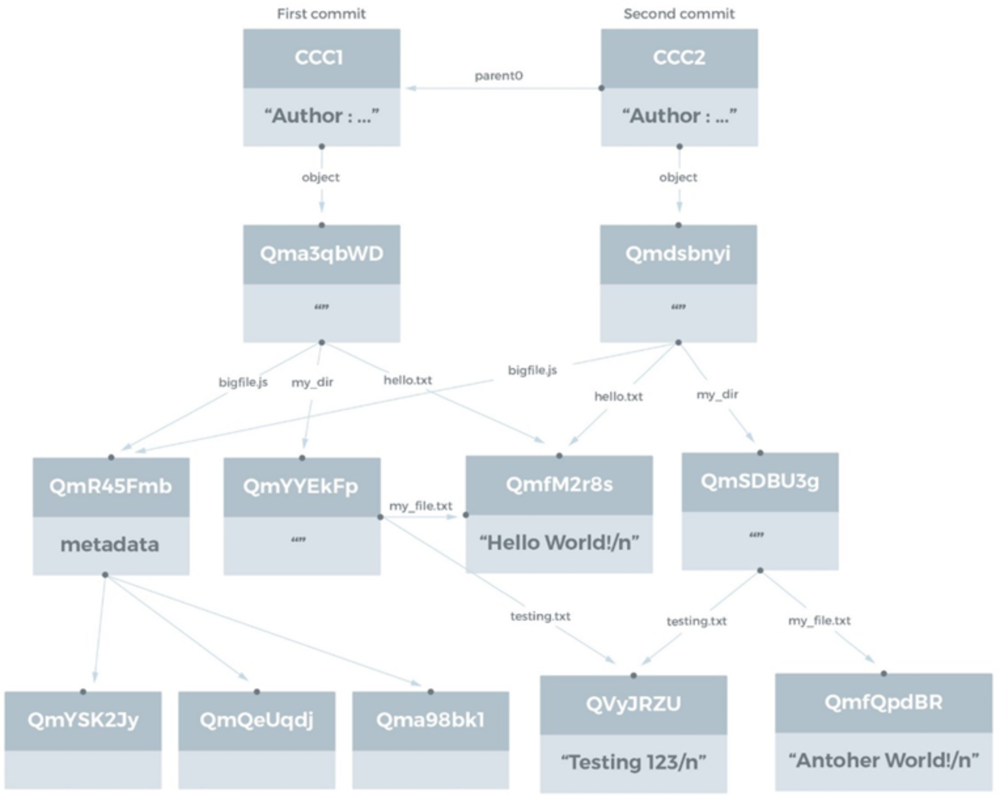

# IPFS 原理分析
## 文件存储结构
### 文件写入

- 步骤
	- 将单个文件拆分成若干个 256KB 大小的块；
	- 计算出全部 block 的 hash
		
			hashn = hash (blockn)；
	- 把所有的 block hash 拼凑成一个数组，再计算一次 hash，便得到了文件最终的 hash
	
			hash (file) = hash(hash1……n)，；
	- 将这个 hash（file）和 block hash 数组“捆绑”起来，组成一个对象，把这个对象当做一个索引结构
	
			{"Links":[{"Name":"51","Hash":"QmUNLLsPACCz1vLxQVkXqqLX5R1X345qqfHbsf67hvA3Nn","Size":4}],"Data":"\u0008\u0001"}		
- 把 block、索引结构全部上传给 IPFS 节点，文件便同步到了IPFS网络了；
- 把 Hash（file）打印出来，读的时候用；

### 空间节省问题
1G 的大文件 File1，已经同步到 IPFS，后面在这个文件 File1 后面追加了 1K 的内容，现在需要重新同步这个文件，因为文件是分块（block）存储，hash 相同的block，只会存储一次。前面 1G 的内容没有发生改变，其实 IPFS 并不会为这些数据分配新的空间，只会为最后1K 的数据分配一个新的 block，再重新上传 hash，实际占用的空间是:1G + 1K 

这样一来就可能会有很多文件的索引指向同一个block，这里就构成了前面提到的一个数据结构——Merkle DAG（Merkle 有向无环图）

Merkle DAG具有以下特点

- 内容可寻址

	所有内容都是被多重 hash 校验和来唯一识别的，包括 links
- 无法篡改

	所有的内容都用它的校验和来验证。如果数据被篡改或损坏，IPFS 会检测到。
- 重复数据删除

	重复内容并只存储一次

### 文件读取
1. 根据 hash 搜索该 hash 的索引结构，即找到该文件 hash 的 block hash 数组（这一步由 IPFS 网络完成，然后下载；
- 得到了 block 的索引，根据 block hash，搜索block 所在的节点位置，然后下载；
- 根据 block hash 数组的顺序，客户端把文件拼凑好

## 目录存储
### 创建目录
1. 先把目录下所有的文件同步到 IPFS 网络中去，为所有的文件 hash 建立一个别名（本地文件名），把 hash 和别名 “捆绑” 在一起组建成一个名为 IPFSLink 的对象；
- 把该目录下所有的 IPFSLink 对象组成一个数组，对该数组计算一个目录 hash，并将数组和目录 hash 拼成一个结构体(文件？)，同步到 IPFS 网络；
- 如果上层还有目录结构，则为目录 hash 建立一个别名（就是目录名），把目录 hash 和别名“捆绑”在一起组建成一个 IPFSLink 的对象，然后重复从步骤2开始执行；
- 把目录hash打印出来，读取的时候用；

### 目录读取
1. 根据 hash 搜索该 hash 的索引结构，找到该目录的 IPFSLink 对象数组，即目录下的子列表；
- 遍历数组，如果 IPFSLink 对象是文件，则取出文件的 hash 下载该文件；
- 如果 IPFSLink 对象有目录，取出目录 hash，重新从步骤1开始执行；
	
## 内容寻址（Content Addressing ）
IPFS 不是引用存储在特定服务器上的对象(图片、文章、视频)，而是通过文件内容对应 hash 值引用文件。在浏览器中访问一个特定的页面，IPFS 转译成查询文件hash，有节点返回文件后，就可以访问到它。

IPFS 在 HTTP 层使用内容寻址，以代替位置标识符寻址文件的实践，通过文件内容本身的特征来定位它。也就是说内容将决定地址(类似于 NDN)。它的机制是用加密算法计算文件的 hash 值，这样就可以安全地将文件用很小数据量进行表示，这个 hash 值作为文件的地址，不会发生地址相同文件数据不同的情况。 IPFS 中，文件的地址通常以一个散列开头，该散列标识某个根对象，然后沿着一条路径向下走（注：类似目录层次）。不同于传统服务器上的文件寻址操作，IPFS 是先获得特定的对象，然后查看的是这个对象记录的路径。

获取文件步骤

- 通过内容寻址识别文件
- 哈希可以向接入的网络询问 “谁有这个哈希”，然后连接到相应的节点并下载它

## IPFS 对象和 DAG
IPFS(星际文件系统)是一种经过良好测试和技术检验的互联网技术的综合体，包含了如 DHTs、Git 版本控制系统和Bittorrent 等技术。它创建了一个允许交换 IPFS 对象的P2P 集群。IPFS 对象的总体构成了一个被称为 Merkle DAG 的密码验证数据结构，这个数据结构可以用来建模许多其他数据结构。本文中介绍 IPFS 对象和 Merkle DAG，并给出可以使用IPFS建模的结构示例。
### IPFS对象（IPFS Objects）
IPFS 本质上是一个用于检索和共享 IPFS 对象的 P2P 系统。一个 IPFS 对象是一个具有两个字段的数据结构

- Data

	小于 256 kB 的非结构化数据块（blob）
- Links

	一个 Link 结构体的数组。其中包含的 Link 指向其他 IPFS 对象。

Link结构有三个数据字段:

- Name

	Link 的名字
- Hash

	Link 指向的 IPFS 对象的 hash
- Size

	Link 指向对象的累计大小，计算 Link 指向的对象大小，需要计入这个被指对象所指向所有对象的大小（注：除了被指向对象自身的 size，如果它里面有 link，那么还要把 link 中的 size 加进来）。用途是优化 P2P 网络，因为它不影响逻辑结构的概念表达我们将在这里忽略它。

### 观察对象
IPFS 对象通常采用经 Base58 编码的散列引用，

	ipfs object get QmarHSr9aSNaPSR6G9KFPbuLV9aEqJfTk1y9B8pdwqK4Rq
	
	{“Links”: [
	
	{“Name”:“AnotherName”,
	“Hash”:“QmVtYjNij3KeyGmcgg7yVXWskLaBtov3UYL9pgcGK3MCWu”,
	“Size”: 18},
	
	{“Name”:“SomeName”,
	“Hash”:“QmbUSy8HCn8J4TMDRRdxCbK2uCCtkQyZtY6XYv3y7kLgDC”,
	“Size”: 58}],
	“Data”: “Hello World!”}

上面的示例可视化表示如下:

所有的散列都是以“Qm”开头的。它是一个 multihash，前两个字节用于指定哈希函数和哈希长度。在上面的例子中，前两个字节的十六进制是 1220，其中12表示这是 SHA256 哈希函数，20 代表哈希函数选择 32 字节长度计算。

数据和命名链接构成的 IPFS 对象的集合即是 Merkle DAG 结构，DAG 表明了这一种有向无环图，而 Merkle 说明这是一个密码验证的数据结构，使用加密哈希来寻址内容。

为了直观显示结构关系，将通过图表示 IPFS 对象关系，图的节点代表数据对象中的数据，图的边表示指向其他 IPFS 对象的链接，链接的名称是图的一条边上的标签。

- 文件系统（Filesystems）

	IPFS 可以很容易地表示由文件和目录组成的文件系统。
	
	- 小文件（Small Files）
	
		IPFS 对象表示一个小文件(< 256 kB)时，对象结构中的 data 是该文件内容(还需要在文件数据的开始和结尾处还要分别附加一小段 header 数据和一个 footer 数据)，对象中不含链接，即 Links 数组是空的。注意，文件名称不是 IPFS 对象的一部分，因此两个具有不同名称但文件内容相同的文件将具有相同的 IPFS 对象，具有相同的 hash 值。
	
	- 查看对象
	
			$ ipfs object get QmWS6jyGwEMQou9cFdEkDJJ7VpGDuQ5hHGwxKc8DjS6Kwa
			{"Links":[],"Data":"\u0008\u0002\u0012\n测试abc\n\u0018\n"}
	- 查看文件
	
			$ ipfs cat QmWS6jyGwEMQou9cFdEkDJJ7VpGDuQ5hHGwxKc8DjS6Kwa
			测试abc
	- 大文件对象
		
		大文件(> 256kb)是由一个链接（Link）列表来表示的，列表中每个链接分别指向的是小于 256 kB 的文件块，于是只需用包含了很小的数据量的对象就能代表一个大文件。指向文件块的链接的 name 字段为空字符串。
	
	
			$ ipfs object get QmWBbKvLhVnkryKG6F5YdkcnoVahwD7Qi3CeJeZgM6Tq68
			{"Links":[
			{"Name":"",
			"Hash":"QmbmtXF9hZ6hLEubdLFP78MSPTWxUe78sYwjpCyiEJat3m",
			"Size":45623854},
			{"Name":"",
			"Hash":"Qmas5qsCZBgizXePhcydxGMCGABnKFvyL4huiTxPK9Qv86",
			"Size":45623854},
			{"Name":"",
			"Hash":"QmZP4MnbC7beCCUST7FYharBSzqcfQw5DQmieDbrYkZ7Zt",
			"Size":45623854},
			{"Name":"",
			"Hash":"QmUtoniv6EMkWjDTG4uvGAZcWn1BptBgupfjkEiX7VcpFv",
			"Size":45623854},
			...
			{"Name":"",
			"Hash":"QmXEqLu1hXe3MfDngRdV1yWmtFQbpVz1WyDHY17r6BbsYj",
			"Size":31327573}],
			"Data":"\u0008\u0002\u0018����\u0005 ���\u0015 ���\u0015 ���\u0015 ���\u0015 ���\u0015 ���\u0015 ���\u0015 ���\u0015 ���\u0015 ���\u0015 ���\u0015 ���\u0015 ���\u0015 ���\u0015 ���\u0015 ���\u0015 ���\u0015 ���\u0015 ���\u0015 ���\u0015 ���\u0015 ���\u0015 ���\u0015 ���\u0015 ���\u0015 ���\u0015 ���\u0015 ���\u0015 ���\u0015 ���\u0015 ���\u0015 ���\u0015 ���\u0015 ���\u000e"}
- 目录对象

	目录由指向表示文件或其他目录的 IPFS 对象的链接（Link）列表来表示。链接的 name 字段是文件和目录的名称。

		$ ipfs object get QmQtmk99Nb6VxYKyqVpb8GZLXceCGtxqWyL2T9e76iLZgu
		{"Links":[
		{"Name":"index.html","Hash":"QmeWquPFAUNWoRmYrd3mTZVCsrub6teApChHDrgATwt3ic","Size":555},
		{"Name":"style.css","Hash":"QmfUcVBJseiTvr2BHeCRE4aTmwYt1tBBRxsvrs22uipUXh","Size":29}],
		"Data":"\u0008\u0001"}	

	注意如果有文件内容相同，但是不明名字的目录，我们将上面的目录增加一个目录和一个文件，注意新增目录文件 text.txt 和 文件 aaa.txt 相同
	
		$ ipfs object get Qmb3PB7PZN4ia4wpFvJZyPFjnBsymQeRjrkc5s94yoDb6g
		{"Links"[
		{"Name":"aaa.txt",
		"Hash":"QmWS6jyGwEMQou9cFdEkDJJ7VpGDuQ5hHGwxKc8DjS6Kwa",
		"Size":18},{"Name":"dir",
		"Hash":"QmTDidnAVRWccp4wuMfEyiHhpDoRNjSHicZ3G6F4w7LHjC",
		"Size":72},{"Name":"index.html",
		"Hash":"QmeWquPFAUNWoRmYrd3mTZVCsrub6teApChHDrgATwt3ic",
		"Size":555},{"Name":"style.css",
		"Hash":"QmfUcVBJseiTvr2BHeCRE4aTmwYt1tBBRxsvrs22uipUXh",
		"Size":29}],"Data":"\u0008\u0001"}

	再查看子目录对象

		$ ipfs object get QmTDidnAVRWccp4wuMfEyiHhpDoRNjSHicZ3G6F4w7LHjC
		{"Links":[
		{"Name":"test.txt",
		"Hash":"QmWS6jyGwEMQou9cFdEkDJJ7VpGDuQ5hHGwxKc8DjS6Kwa",
		"Size":18}],"Data":"\u0008\u0001"}
	在访问原来的目录

		$ ipfs object get QmQtmk99Nb6VxYKyqVpb8GZLXceCGtxqWyL2T9e76iLZgu
				{"Links":[
				{"Name":"index.html","Hash":"QmeWquPFAUNWoRmYrd3mTZVCsrub6teApChHDrgATwt3ic","Size":555},
				{"Name":"style.css","Hash":"QmfUcVBJseiTvr2BHeCRE4aTmwYt1tBBRxsvrs22uipUXh","Size":29}],
				"Data":"\u0008\u0001"}		
	
	实验证明
	
	1. root 目录的 id 根据目录结构的变化而变化
	- 原先的目录 id 依然保存
	- `test.txt`\ `aaa.txt` 引用的是相同的对象，所以文件在保存时候被去重了
	

## 版本化文件系统（Versioned File Systems）
IPFS 可以表示 Git 所使用的数据结构，以支持版本化的文件系统。Git 的提交对象（commit objects）在 Git 手册中被描述。IPFS 提交对象的结构在撰写本文时没有完全指定，讨论仍在进行中。

IPFS 提交对象的主要属性是，它包含一个或多个名称为 parent0、parent1 等链接，这些链接指向先前的提交；另外，还包含一个名字为 object 的链接(Git中称为树)，指向该提交引用的文件系统结构。

以前面的文件系统目录结构为例，这里显示了两个提交（commit）:

- 第一个提交是原始结构
- 第二个提交中，更新了文件 `my_file.txt`，内容改成了 `Another World!` 而不是`Hello World!`。

注意这里也发生了自动去重，因此第二个提交中的新对象只有主目录、新目录 my_dir (译注：目录下的文件有变化，hash 重新计算)和更新后的文件 my_file.txt。		
					

## 参考
- [IPFS内部原理入门](https://blog.csdn.net/yichigo/article/details/79655922)
- [浅析IPFS文件存储与读取](https://www.jianshu.com/p/ea5087f9bd20)