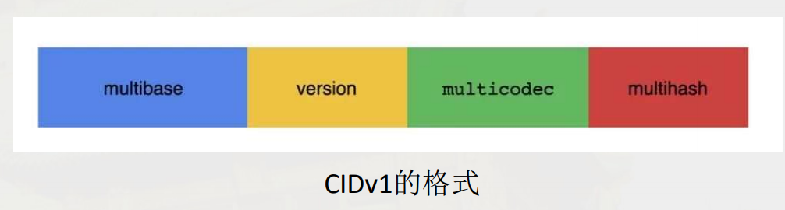
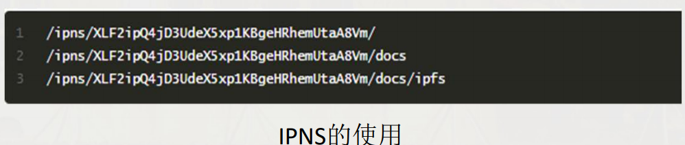
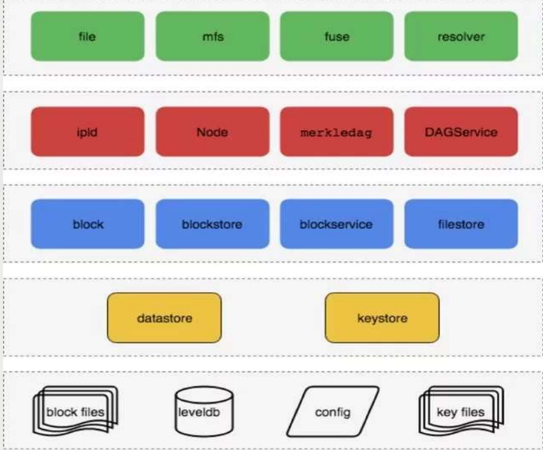
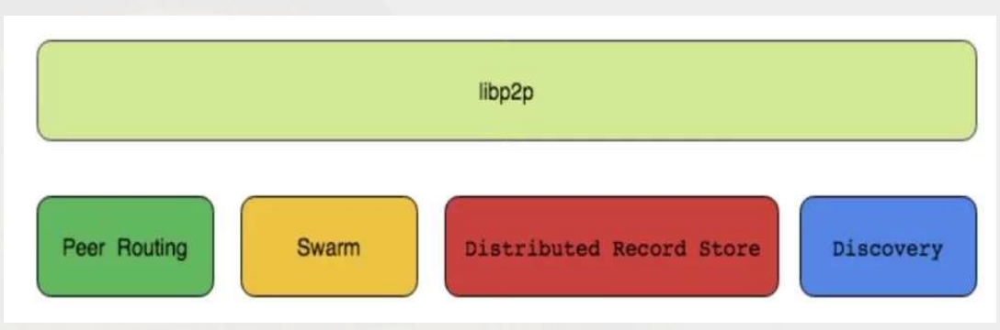
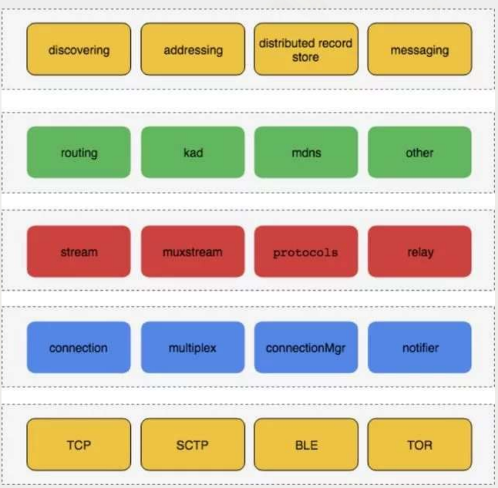
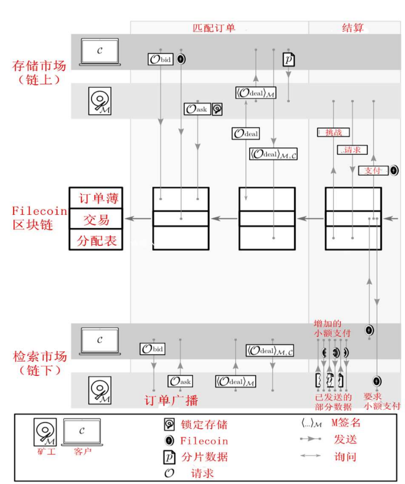

# IPFS 技术架构
## 解决的 http 问题
- 脆弱
- 中心化
- 效率低
- 过度依赖主干网络

## 分布式文件系统发展
- 分布式服务器和 cdn
	- 文件分散在多个服务器存储
	- 网络各处放置节点服务器构成一层智能虚拟网络
- 工具发展
	- BITSYNC
	- 迅雷
	
## IPFS 协议
IPFS协议分为以下七个子协议：

- 认证

	管理节点的指纹生成，以及对节点进行认证
- 网络

	管理节点之间的连接
- 路由

	保持节点和对象的位置信息，是分布式路由表
- 交换

	一种创新的数据块交换协议，是文件交换市场、数据交易所
- 对象

	基于 MerkleDAG 数据结构保存的文件对象
- 文件

	受到 Git 启发的版本化的文件系统
- 命名

	自我认证的可变命名系统

## IPFS 架构

IPFS 有一个模块化的技术协议栈。每一层都有多个实现。IPFS架构对上述七个协议进行了组织封装，整个架构分为以下5层，从上到下以此为

1. 命名层

	基于 PKI 的一个命名空间(IPNS)
- merkledag 层

	核心的数据结构，其中包含了上述协议中的对象和文件协议
- 交换层

	节点之间数据块的交换协议，主要是 bitswap，用来解决数据块的交换和复制
- 网络层

	解决寻址问题，通过路由协议(DHT)
- 网络层

	封装了 p2p 通讯的链接和传输部分,解决节点之间链接。包括协议的网络和认证部分。			   

1.2 层是 IPNS\IPLD ，主要解决定义数据问题。而 3.4.5 层 libp2p ,主要解决数据移动问题

用树形结构表示

- 命名层
	- naming协议
- MerkleDAG 数据结构层
	- 文件协议
	- 对象协议
- 交换层
	- 交换协议
- 路由层
	- 路由协议
- 网络层
	- 认证协议
	- 网络协议

## 命名层
IPFS 主要关注内容寻址，是不可变的。 改变一个文件也会改变它的 hash 值，也就是改变了其地址，使它成为一个完全不同的对象。 IPFS 命名层或者叫 IPNS

- 指向对象的可变指针
- 人类可读的名称

IPNS 是基于 SFS 。它是一个 PKI 命名空间。 名称只是公钥的 hash 值。掌控私钥的人掌控名称。记录被私钥签名并且分发(通过路由系统)。 这是在互联网上实现的一种基于平均主义的分配方式。 既没有中心化的机构，也不存在证书颁发部门。

- CID（self-describing content-addressed identifiers for distributed systems）基于内容寻址的自我描述表示，内容ID,注意它是不可变的。

	CID 是 IPFS 分布式文件系统中标准的文件寻址格式，它集合了内容寻址、加密散列算法和自我描述的格式, 是 IPLD 内部核心的识别符。目前有2个版本，CIDv0 和CIDv1。
	
		
- IPNS（InterPlanetary的命名空间）

	在可变和不可变(CID)的路径之间建立一个很容易辨认的区别，为了程序和人类阅读的提供便利。

	

## MerkleDag 层
Merkle directed acyclic graph（默克有向无环图），是 IPFS 核心的数据结构。 它是边为 hash 值的有向无环图。另一个名称叫 MerkleWeb， 是计算机高级数据结构图的一种变形。

数据结构:

	message MDagLink{
	    bytes Hash = 1;  //  目标对象的hash
	    string Name = 2;  // utf 字符串名称，每个对象应该是唯一的
	    uint64 Tsize = 3 ; // 目标对象的累积大小
	}
	message MDagNode {
	    MDagLink  Links = 2;  //引用其他的对象
	    bytes Data = 1;    //不透明的用户数据
	}

1. file、mfs、fuse、resolver 是顶层高级接口，
将各种异构数据转换成 MerkleDag 的 DAGNode。
2. MerkleDag，Node 管理所有 DAGNode 之间
的增删改和建立连接 Link
3. Blockservice 将 DAGNode 和 CID 包装成文件块
block，以适配底层的数据交换和本地存储
4. Datastore 和 keystore 管理本地的文件块，公
私钥的存储，以及内存上的节点信息
5. Leveldb，block files 是本地数据库

MerkleDag 路径

	/ipfs/QmdpMvUptHuGysVn6mj69K53EhitFd2LzeHCmHrHasHjVX/test/foo
解析过程

- (a) 首先会获取+解析QmdpMvUptHuGysVn6mj69K53EhitFd2LzeHCmHrHasHjVX
- (b) 然后查询(a)的链接，找到test的哈希，并解析
- (c) 然后查询(b)的链接，找到foo的哈希，并解析

## 块交换
IPFS 数据块交换负责批量数据的传输。 一旦节点之间相互连接并且认证之后，交换协议就开始传输数据。

块交换是满足以下实现的接口。比如：

- BitSwap

	IPFS 中主要的交换协议
- HTTP

	一个简单的通过 HTTP 客户端和服务端实现的交易

IPFS 中对于数据块的交易，核心是BitSwap

### Bitswap 协议
易货系统的概念意味着可以创建虚拟货币，Bitswap 是一个跟踪货币的所有权和转移的全局分类账本，目前作为节点之间交换文件块的账本，Filecoin 的设计来源。

- BITSWAP 信用
	1. 对等节点间会追踪他们的平衡（通过字节认证的方式）
	2. 随着债务人债务增加而降低对等者向债务人发送块的概率
- BITSWAP 的策略
	1. 为整个交易和节点最大化交易能力
	2. 为了防止空负载节点利用和损害交易
	3. 对可信任的对等节点更宽容
- BITSWAP 账本
	1. 每个节点都拥有自己的账本
	2. 在交换文件块数据前对比账本内容
	3. 恶意空账本没有获取文件的权利
	
## 路由
IPFS 路由层有两个重要的目的

- 节点路由，找出其他的节点
- 内容寻址， 查找分发到IPFS上的数据

路由系统是满足各种实现的结构，比如：

- DHTs
- mdns
- snr
- dns

路由的核心其实就是分布式 Hash 表。

## IPFS网络
网络提供在两个或者多个节点(可信或不可信)节点之间的内容传输，主要处理：

- NAT 遍历

	打孔、端口映射和中继
- 支持多种传输协议

	TCP、SCTP、UTP
- 支持加密

	签名或清除通信
- 多路复用

	连接复用、协议复用、peer复用

网络层的核心也就是P2P对等网络。
	
## Libp2p

- Peer Routing 路由协议

	主要包括 KAD routing 和 MDNS routing。
- Swarm 传输和连接。有以下接口
	1. transport 网络传输层的接口
	2. connection 处理网络连接的接口
	3. stream multiplex 同一 connection 复用多个stream 的接口
- Distributed Record Store 

	分布式节点的记录存储。包括内存中的 datastore 和 LRU Cache
- Discovery 节点发现协议。3种方式
1. bootstrap 通过配置的启动节点发现其他的节点
2. Wsstr 通过查询随机生成的 peerID， 从而发现新的节点
3. mdns 通过 multicast 广播发现局域网内的节点

总图
		
	
## filecoin 流程

- 每个新区块
	1. 检查交易、订单等是否处于有效格式并打包，即将订单进行分类，分别为 Odeal、Obid 和 Oask，然后添加到数据库中
	2. 对数据库中每个订单进行检查是否过期
	3. 验证打包存储提供商提供的存储证明
- 客户
	1. 提交新的存储 Obid 订单或检索 Obid 订单
	2. 从存储矿工接收 Odeal 并签署，然后提交
- 存储提供商（矿工）
	1. 质押 filecoin 以保证自己能提供相应的存储量
	2. 提交 Oask 订单，选取合适的存储 Obid 订单并签署发给客户
- 检索提供商（矿工）
	1. 提交 Oask 订单，选取合适的检索 Obid 订单并签署发给客户

## IPFS 用户接口
IPFS 不仅仅是一个协议。它是一个工具集。IPFS 实现包括处理 Merkle 的各种工具，如何部署、如何命名等等。这些接口可能对实现或整个项目的生存至关重要。这些接口控制人们如何使用IPFS。因此必须特别注意其设计和实现。比如：

- IPFS api - 一个HTTP服务
- IPFS cli - 一个unix 命令
- IPFS libs - 各种语言的实现
- The IPFS gateways - 互联网中通过 IPFS 提供的 HTTP 节点

	
## 总结
- LibP2P 是 IPFS 核心中的核心，面对各式各样的传输层协议以及复杂的网络设备，它可以帮助开发者迅速建立一个可用 P2P 网络层，快速且节约成本。
- 整个系统由非常多的模块组成，而且是可拔插的，耦合性很低，方便新协议的开发和新功能的加入
- 解决了当前 HTTP 存在的缺陷，为大型区块链项目提供底层基础。
- 设计 Filecoin 作为激励层的 token，构建了一个可信的去中心化存储网络及市场

## 参考
- [星际文件系统IPFS 技术架构](http://wislab.cn/blockchain/resource/4.IPFS-by%E5%88%98%E6%96%87%E5%8D%B020180913.pdf)
- [IPFS 架构解析](https://xiaozhuanlan.com/topic/4165372098)