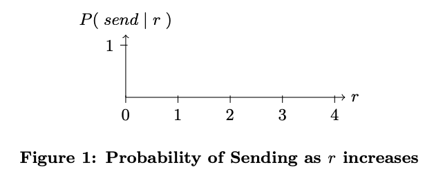
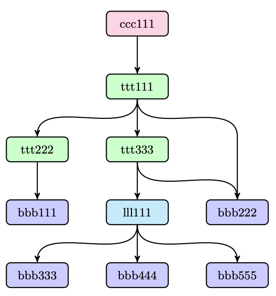

# IPFS 设计哲学
## 摘要
星际文件系统(IPFS）是一个 p2p 分布式文件系统， 其将所有具有相同文件的计算机设备连接到一起。 换句话说，IPFS 跟 Web 非常相似，IPFS 可以被看成是一个单集群的 BitTorrent 系统，对象之间通过一个 git 仓库来相互访问。 另外 IPFS 提供了基于内容寻址的块存储模型。通过形成一个序列化的 MerKleDAG (一种计算机数据结构)来构建带版本的文件系统，区块链甚至一个永久存在的 web 服务。IPFS 结合了分布式 hash 表、块交换的激励机制以及自证的命名空间。不同于传统的分布式系统，IPFS 不存在单节点失效问题，节点之间也不需要彼此互信。
## 入门
在 IPFS 之前，人们尝试了各种方式来构建一个全球化的分布式文件系统。有些系统目前已经取得了极大的成功，当然难免有一些走向了失败的命运。在这些学术性的尝试中，AFS 取得了广泛的成功，甚至今天仍然在被人们所使用。 相比于此，其他的项目就没那么幸运了。在学术界以外，最成功的分布式系统已经实现了文件与音视频资料的分享。比如：Napster、KaZaA 以及 BitTorrent。

BitTorrent已经是一个相当大的分布式系统，支撑着上亿的用户。截止目前，BitTorrent 保持着巨大的部署量，每天有数千万个节点的变动。这些应用的用户数量和使用频次都要远远超过学术文件系统。但是这些应用设计并不能作为一个底层的基础设施。虽然部分系统可以被重用，但尚未出现提供全球化的、低延迟的、分散式的通用文件系统。

或许因为人们满足于 HTTP 协议的“完美”。目前为止，HTTP 是最成功的”分布式文件系统“。HTTP 与浏览器双剑合璧之后，具有广泛的科技与社会影响力，几乎是无敌的存在。它已经成为互联网文件传输的标准。尽管如此，它也有自己的弱项，最近这些年发展起来的很多优秀的分布式技术它都没有利用。一方面，不断发展的 web 基础架构几乎不可能存在，当下的模型主要受限于向后的兼容性以及对其他各方的依赖。另一方面，HTTP 出现之后，很多新的协议相继出现，有些协议已经获得了广泛的应用。在这些协议中，缺少对于服务升级的设计，比如：增强当前的 HTTP Web，在不影响用户体验的情况下影响新的功能。

由于移动小文件相对廉价，在行业内已经很少使用 HTTP 了，即使对于那些拥有很多流量的小型组织也是如此。同时对于数据的分发又面临着新的挑战

- 托管和分发 petabyte 数据集
- 跨组织的计算大数据
- 高容量、高清的实时流媒体传输
- 大规模数据集的版权和链接
- 防止重要文件的丢失

等等。

以上种种可以大概归结为: "海量数据的任意地点访问"。 在关键功能和贷款问题的推动下，我们已经为不同的数据分发协议放弃了 HTTP。下一步，我们的目的是让它们成为 Web 本身的一部分。

在解决高效的数据分发与版本控制方面，已经有非常成功的数据协作工作流系统被开发出来了。

Git，分布式的源代码版本控制系统，其开发了许多有用的方法来建模以及实现分布式数据操作。

Git 工具链提供了多种版本控制的功能，这些都是目前其他大型文件分发系统严重缺失的。

受 Git 启发的新的解决方案正在兴起，比如 Camlistore（个人的文件存储系统)，Dat(数据协作工具链和数据集包管理器)。Git 影响了分布式文件系统的设计，因为其内容寻址 MerkleDAG 数据模型提供了强大的文件分发策略。当然，这种数据结构如何影响高吞吐量定向文件系统的设计，以及它如何升级 Web 自身值得我们去进一步探索。

本篇内容主要介绍 IPFS，一种新颖的点对点版本控制文件系统，旨在协调这些问题。IPFS 借鉴了许多过去成功的学习经验，集成了过去许多优秀的设计理念。IPFS 的核心理念是将所有的数据模型都是 MerkleDAG 的一部分。

## 背景
此部分回顾了 IPFS 借鉴的那些成功的点对点系统的重要特性。
### Distributed Hash Tables
分布式 Hash 表广泛应用于协调和维护有关 P2P 系统的元数据。
### Kademlia DHT
Kademlia 是一种流行的 DHT，它提供以下功能

- 通过大规模网络进行高效查询
- 低协调开销，它优化了发送到其他节点的控制消息的数量
- 通过选择长寿命节点来抵抗各种攻击
- 广泛应用于 P2P 应用，包括 Gnutella 和 BitTorrent，形成超过 2000 万个节点的网络

### Coral DSHT
虽然在一些 P2P 系统中，直接在 DHT 中存储数据块，但这会浪浪费存储和带宽，因为数据必须存储在不需要它的节点。 Coral DSHT 以三种特别重要的方式扩展了 Kademlia

- Kademlia 将值存储在 id 为”最近“（使用 XOR 距离）的节点中。它不考虑应用程序数据的位置，忽略可能已经拥有数据的“远”节点，并强制“最近”节点存储它，无论它们是否需要它。这浪费了大量的存储和带宽。相反，Coral 将地址存储给可以提供数据块的 Peers。
- Coral 将 DHT API 从 get_value(key) 放宽到 get_any_value(key) （DSHT 中的 “sloppy” ）这仍然有效，因为 Coral 用户只需要一个工作 Peer，而不是完整的列表。作为回报，Coral 只能将值的子集分发到“最近”的节点，从而避免热点（当密钥变得流行时，所有最近的节点都会过载）
- Coral 根据区域和大小组织生成一个单独的 DSHT 层次结构，称为簇。这使节点能够首先查询其他区域中的 peers，在不查询远程节点的情况下查找附近的数据，并大大减少了查询的延迟。

### S/Kademlia DHT
S/Kademlia 以两种特别重要的方式扩展 Kademlia，以防止恶意攻击

- S/Kademlia 提供了保护 NodeId 生产的方案，并防止了 Sybill 攻击。它需要节点创建 PKI 密钥对，从中获取它们的身份，并相互签署它们的消息。一个方案包括工作证明加密拼图，以使生产的 Sybills 是昂贵。
- S/Kademlia 节点通过不相交的路径查找值，以确保诚实的节点可以在网络中存在大部分攻击者的情况下彼此连接。S/Kademlia 实现了0.85的成功率，即使对等部分大到一半的节点也是如此。

### 块交换 —— Bitorrent
BitTorrent 是一个非常成功的 P2P 文件管理系统，它成功协调了互不信任的对等网络，以便相互协作分发文件。BitTorrent 及其生态系统的主要功能可为 IPFS 设计提供信息，包括：

- BitTorrent 的数据交换协议采用准滴定策略，奖励相互贡献的节点，并惩罚只吸引他人资源的节点。
- BitTorrent peers 跟踪文件的可用性，优先发送最稀有的碎片。这可以减轻种子负担，使非种子 peers 可以相互交易。
- BitTorrent 的标准相对容易受到一些剥削性带宽共享策略的影响。PropShare 是一种不同的对等带宽分配策略，可以更好地抵制剥削策略，并提高群体的性能。

### 版本控制系统 —— Git
版本控制系统提供了模拟文件的工具，可以随时间变化并有效地分发不同版本。流行的版本控制系统 Git 提供了一个强大的 Merkle DAG 对象模型，它以分布式友好的方式捕获文件系统树的变化。

- 不可变对象表示（blob），目录（树）和变更（commit）
- 对象通过其内容的加密 hash 进行内容寻址
- 嵌入其他对象的链接，形成 Merkle DAG。 这提供了许多有用的完整性和工作流属性。
- 大多数版本控制元数据（分支、标签等）只是指针引用，因此创建和更新成本低廉。
- 版本更新仅更新引用或添加对象
- 将版本更改分发给其他用户只是传输对象和更新远程引用

### Self-Certified 文件系统 —— SFS
SFS 提出了分布式信任链和平等主义共享全局命名空间的引人注目的实现。SFS 引入了一种用于构建自认证文件系统的技术：使用以下方案寻址远程文件系统。

	/sfs/<Location>:<HostID>
其中 Location 是服务器网络地址，并且：

	HostID =  hash(public_key || Location)
因此，SFS 文件系统的名称对其服务器进行认证。用户可以验证服务器提供的公钥，协商共享密钥以及保护所有流量。所有 SFS 实例共享一个全局命名空间，其中名称分配是加密的，而不是由任何集中式主体控制。
## IPFS 设计
IPFS 是一个分布式的文件系统，它集合了以前点对点对等网络的成功思想，包括 DHTs，BitTorrent，Git，以及 SFS。IPFS 的贡献在于将经过验证的技术进行简化、发展和链接，将它们整合到了一个系统中，来达到 1+1>2 的效果。IPFS 不仅提供了一个用于编写和部署应用程序的新平台，而且是一个用于内容分发和版本管理的大数据新系统。IPFS 是一个自进化的 web 系统。IPFS 是基于点对点对等网络。节点之间相互平台，不存在特权节点。IPFS 节点将 IPFS 对象存储在本地。节点之间相互连接来进行数据传输。数据可以是文件也可以是其他任意的数据结构。IPFS 协议可以分为一系列的子协议，它们分别负责不同的功能

- Identities —— 管理节点标识和验证
- NetWork —— 管理与其他节点的连接，使用各种底层网络协议。可配置
- Routing —— 路由信息维护，主要用来进行节点查询以及数据文件定位。默认采用DHT, 但也可以替换。
- Exchange —— 一种新颖的块交换协议(BitSwap), 用于管理有效的块分配。 模仿市场，弱激励数据复制。交易策略可更换。
- Objects —— 基于MerkleDAG的内容寻址不可变对象
- Files —— 受Git启发的版本化分层文件系统
- Naming —— 自我认证的可变命名系统

以上子系统并不是独立的。 它们是集成在一起的，可以混合来使用。之所以分开描述，是为了让从下到上构建协议栈的过程更加清晰易懂。

提示： 以下的数据结构和函数用Go语言语法表示。

### Identities
节点由 NodeId 标识，NodeId 是采用 S/Kademlia 的静态加密模块创建的公钥加密的 Hash 值。节点存储其公钥和私钥(使用密码学加密) 用户可以在每次运行节点时自由的设置节点标识，但这样会损失积累的网络优势。用激励机制来保持节点不变。

	type NodeID Multihash
	type Multihash []byte
	// 自描述加密 hash 摘要
	type PublicKey []byte
	type PrivateKey []byte
	// 自描述 keys
	type Node struct{
	    NodeId NodeID
	    PubKey PublicKey
	    PriKey PrivateKey
	}
基于 S/Kademlia 的身份生成

	difficulty = <integer parameter>
	n = Node{}
	do {
	    n.PubKey, n.PrivKey = PKI.genKeyPair()
	    n.NodeId = hash(n.PubKey)
	    p = count_preceding_zero_bits(hash(n.NodeId))
	} while (p < difficulty)
在初次连接时，节点间会相互验证 `hash(other.PublicKey)` 是否跟 other.NodeId 相等，如果不相等，则连接中断。
#### 加密函数注意事项
IPFS 不会限制系统功能的选择到特定的取值范围，它支持自定义的值。Hash 值被存储在 multihash 格式中，其中包括指定了 hash 函数使用的短头标以及字节长度。例

	<function code><digest length><digest bytes>
这些措施使得系统可以实现如下功能

- 为用例选择最佳的函数(更高的安全性 vs 更快的性能)
- 随着函数选择的不同进行自我进化

自定义值兼容不同的参数选择。	

### Network
IPFS 节点会跟网络中其他的成千上万个节点进行通信，这些节点可能跨越广泛的互联网。 IPFS 网络的特征如下

- 传输

	IPFS 可以使用任意的交换协议，最适合 WebRTC DataChannels（用于浏览器连接） 或者 uTP
- 可靠性

	如果底层网络不提供 IPFS，IPFS 可以使用 uTP 或 SCTP 来提供依赖
- 连通性

	IPFS 还使用了 ICE NAT 遍历技术
- 完整性

	可以选择使用 hash 的 checksum 值来校验消息的完整性
- 真实性

	可以选择使用具有发送者公钥的 HMAC 来校验消息的真实性

#### 有关对等寻址的注意事项
IPFS 可以使用任意网络; 其不依赖 IP 地址。 这种特性允许 IPFS 用于 overlay 网络。IPFS 将地址存储为 multiaddr 格式的字节字符串，供底层网络使用。multiaddr 提供了一种表达地址及其协议的方法，包括对封装的支持。例如：

	# 一个 SCTP/IPv4 链接
	/ip4/10.20.30.40/sctp/1234/
	
	# 一个 SCTP/IPv4 通过 TCP/IPv4 代理的链接
	/ip4/5.6.7.8/tcp/5678/ip4/1.2.3.4/stcp/1234/

### Routing
IPFS 节点需要一个路由系统，该路由可以找到其他对等网络节点的网络地址，同时可以为特定的对象提供服务。IPFS 通过一个基于S/Kademlia 和 Coral 的 DSHT 来实现此功能(特性讨论在2.1小节)。对象的大小和 IPFS 使用的模式跟 Coral 和 Mainline 非常类似，因此 IPFS DHT 根据它们的大小对存储的值进行区分。小值(等于或小于1KB)直接存储在 DHT 上。对于更大的值， DHT 存储引用，它们是包含此块信息的一系列节点 Id。DSHT的接口如下：

	type IPFSRouting interface {
	    // 获取特定对等方的网络地址
	    FindPeer(node NodeId)
	
	    // 在 DHT 中存储一个小的元数据
	    SetValue(key []bytes, value []bytes)
	
	    //从 DHT 中检索一个小元数据
	    GetValue(key []bytes)
	
	    // 宣布这个节点可以提供很大的价值
	    ProvideValue(key Multihash)
	
	    // 得到一些服务于大设置值 peer
	    FindValuePeers(key Multihash, min int)
	}
注意：实质上不同的用例要求不同的路由系统(比如广域网络中的 DHT、局域网中的静态 HT)。因此可以改变 IPFS 中的路由系统以满足用户的需求。只要满足上述中的接口，系统的其他部分将会持续运行。

### 块交换 —— BitSwap 协议
在 IPFS 中，通过受 BitTorrent 启发的协议 BitSwap 来进行对等节点之间的数据分发。与 BitTorrent 类似，在数据交换过程中，BitSwap 提供自己拥有的数据块并且从其他节点那里寻找自己想要的数据块。但跟 BitTorrent 不同的是，BitSwap 不仅仅局限于在一个 torrent 中。BitSwap 作为一个持久化运营的市场，节点可以获取自己所需的数据块，无论这些块属于哪些文件。这些数据块可能来自文件系统中完全不相关的文件。在这个交易市场中节点聚集在一起，进行数据的交换。

虽然交易系统的概念意味着可以创建虚拟货币，但这需要一个全球化的分类账本来跟踪货币的所有权和交易记录。这些都可以 BitSwap 策略来实现，并将在以后的论文中进行进一步的探讨。

一般情况下，BitSwap 节点必须直接以数据块的形式彼此提供数据。当跨节点的数据块分布是互补时，也就意味着它们相互具有对方想要的东西，此中情况下系统运行非常成功。但通常情况并非如此。在其他情况下，当节点上不存在其他节点所需要的数据块时，它需要在其他节点寻找这部分数据，当然这个优先级要比其他节点直接从本身取数据要低。这激励节点缓存和传播稀有的数据，即使他们本身对这些数据不感兴趣。

#### BitSwap 信用
协议需要具备激励机制，在节点本身不具备其他节点所需的数据时，对消息进行广播。因此为了偿还债务，BitSwap 会积极的给其他节点发送数据。但也必须防范吸血鬼(永远不免费共享数据的节点)。一个简单的信用系统解决了这个问题：

- 节点相互跟踪余额 (以字节验证)
- 按照一个根据随着债务增加而下降的函数，同概率地向债务人发送数据块。

注意: 如果一个 Node 不给 peer 发送数据，Node 随后会以 `ignore_cooldown` 超时规则来忽略 peer。这可以防止发送者来模拟无限尝试。默认 BitSwap 为10秒	

#### BitSwap 策略
不同的 BitSwap 策略会对整个网络的交换性能产生截然不同的影响。在 BitTorrent 中，虽然指定了标准策略，但已经实现了各种其他策略，从 BitTyrant 到 BitThief。 BitSwap 可以类似的实现一系列的策略。

那么，功能的选择应该旨在：

- 最大化节点和整个交易所得性能
- 防止吸血鬼造成交易下降
- 对其他未知战略有效并具有抵抗力
- 对受信任的节点宽容

对这些策略空间的探索是未来的工作。 实践过的一个奏效的选择是 sigmoid 函数，由债务比例进行缩放：

Node 与 Peer 之间的负债比率为

	r = bytes_sent / bytes_recv + 1
给定 r, 让发送给债务人的概率为

	P(send|r) = 1 - 1/(1+exp(6-3r))

如下图1所示

由于节点的负债率超过既定的信用额度的两倍，因此该功能函数迅速下降。债务比率是信任的衡量标准：对先前已经成功交换大量数据的节点之间采用债务宽松政策，对未知的、不受信任的节点采取紧缩政策。这可以

1. 抵抗大量创建新节点的攻击者(sybill攻击) 
2. 保护以前成功的贸易关系，即使其中的一个节点暂时无法提供价值。
3. 最终扼杀已经恶化的节点之间的关系，直到他们作出改善。

#### BitSwap 总帐
BitSwap 节点使用分类账本来记录与其他节点之间的交易。这允许节点跟踪历史记录并且防止数据篡改。当激活连接时，BitSwap 节点会同步账本信息。如果不是完全匹配，则从头开始重新初始化账本，从而丢失应计贷款或债务。恶意节点有可能故意“丢失” 账本， 希望消除债务。没法产生足够的的债务来担保的节点也会失去应计信托。但是，合作伙伴节点可以自由的将其视为不正当行为，并拒绝交易。

	type Ledger struct{
	    owner  NodeId
	    partner NodeId
	    bytes_sent int
	    bytes_recv int
	    timestamp Timestamp
	}
节点可以自由的保存账本的历史信息，尽管这不是一个必要的操作。只有当前的账本信息才有用。根据需要，节点也可以免费使用垃圾回收帐本，从较少有用的账本开始。

#### BitSwap 规格
BitSwap 节点遵循以下规则		

	// 保持附加状态
	type BitSwap struct {
	    // 该节点已知的分类账无效
	    ledgers map[NodeId]Ledger
	
	    //当前打开与其他节点的连接 
	    active map[NodeId] Peer
	
	    // 此节点需要的块效验和 
	    need_list []Multihash
	
	    // 此节点具有的块效验和
	    have_list []Multihash
	}
	
	type Peer struct {
	    nodeid NodeId
	
	    // 节点与此对等体之间的分类账
	    ledger Ledger
	
	    // 上次的时间戳
	    last_seen Timestamp
	
	    // 所有块需要的效验和
	    // 包括节点所需的块节点
	    want_list []Multihash
	
	    // 协议接口
	    interface Peer{
	        open (nodeid: NodeId, ledger: Ledger);
	        send_want_list (want_list: WantList);
	        send_block (block: Block) -> (complete: Bool);
	        close(final: Bool)
	    }
	}

节点连接的生命周期

- Open

	peer 发送账本信息，直到其他节点同意
- Sending

	peer 之间相交换想要的数据块
- Close

	peer 停用连接
- Ignored

	(特殊)如果节点的策略避免发送，则忽略 peer(在超时期间)

##### Peer.Open(NodeId, Ledger)
连接时，节点初始化一个与 Ledge 的连接或者从之前的连接中存储，或者将之前的连接归零。然后，将带有 Ledger 的 Open 消息发送给 peer。
	
收到 Open 消息后，peer 选择是否激活连接。如果——根据接受方的账本——发送方不是可信代理（传输低于零或大量未尝还债务），接收方可以选择忽略该请求。

这应该通过 `ignore_cooldown` 超时的方式来完成，以便纠正错误并阻止攻击者。
	
如果激活连接，接收器将使用本地版本的 Ledger 初始化 Peer 对象并设置 `last_seen` 时间戳。
##### Peer.send_want_list(WantList)
当连接打开时，节点将 want_list 通告给所有连接的 peers。这是在

- 打开链接后完成的
- 在随机化的定期超时以后 
- 在 `want_list` 的变化之后
- 在接收到新的数据块之后

收到 `wang_list` 后，节点会存储它。然后它检查它是否有任何想要的块。如果是这样，它会根据上面的 BitSwap 策略发送它们。

##### Peer.send_block(Block)
发送数据块很简单。该节点只是传输数据块。收到所有数据后，接收方计算 `Multihash` 的 `checksum` 值来验证是否与预期的校验匹配，并返回确认。

在最终确定块的正确传输时，接收器将块从 `need_list` 移动到 `hava_list`，并且接收器和发送器都更新它们的分类器以反映传输的附加字节。

如果传输验证失败，则发送方要么发生故障，要么攻击介绍方。接收方可以自由的拒绝进一步的交易。需注意，BitSwap 期望在可靠的传输通道上运行，因此传输错误——可能导致对正确发送的错误处罚——预计会将数据提供给 BitSwap 之前捕获。
##### Peer.Close(Bool)
关闭的最后一个参数表明关闭连接的意图是否是发送者。如果为 false，接收方可以选择立即重新打开链接。这避免了过早关闭。应在以下两种情况下关闭对等网络链接

- `slience_wait` 超时已过期，但还没有收到来自 peer 的任何消息（BitSwap 默认30s）。该节点发出`Peer.close(false)`
- 节点正在退出，BitSwap 正在关闭。在这种情况下，节点发出 `Peer.close(true)`.

收到消息后，接收方和发送方都会断开连接，清楚存储的所有状态。如果有用的话，可以存储账本信息以供未来使用。

注意：应忽略非活动连接上的非打开消息。在 `send_block` 消息的情况下，接收方可以检查该块以查看是否需要并且正确，如果是，则使用它。无论如何，所有这些无序消息都会触发来自接收器的紧密（错误）消息以强制重新初始化连接

### Object MerkleDAG
DHT 和 BitSwap 使得 IPFS 形成了一个庞大的 P2P 系统，用于快速、稳健地存储和分发数据块。在它们上层，IPFS 构建了一个 MerkerDAG 的有向无环图。其中对象之间是通过加密的 hash 值来链接。这正是 Git 数据结构的概括。 MerkleDAG 提供了 IPFS 许多有用的特性，包括：

- 内容寻址

	所有的内容被	multihash	的	checksum	值唯一认证，其中包括链接。
- 防篡改

	所有内容通过它的 checksum 值来校验。如果数据发生了篡改或者冲突，IPFS 都会检测到。
- 数据去重

	所有持有相同内容的对象都是等价的，并且只存储一次。这对于索引对象(git trees或commits)或数据的共有部分尤其适用。

IPFS对象格式如下：

	type IPFSLink struct{
	    // 链接的别名 
	    Name string
	
	    // 目标的加密 hash 
	    Hash Multihash
	
	    // 目标总大小
	    Size int
	}
	
	type IPFSObject struct{
	    // 链接阵列 
	    links []IPFSLink
	
	    // 不透明的内部数据
	    data []byte
	}

IPFS MerkleDAG 是一种非常灵活的数据存储方式。唯一的要求是对象引用是

- 内容寻址
- 按照上面的对象格式来编码

IPFS 授予应用对数据字段的完全控制权。应用程序可以选择的任意的数据格式，包括那些 IPFS 无法理解的数据格式。独立的对象链接表使得 IPFS 具有以下功能：

- 列出对象中的所有对象引用 例如	

		ipfs ls /XLZ1625Jjn7SubMDgEyeaynFuR84ginqvzb
		XLYkgq61DYaQ8NhkcqyU7rLcnSa7dSHQ16x 189458 less
		XLHBNmRQ5sJJrdMPuu48pzeyTtRo39tNDR5 19441 script
		XLF4hwVHsVuZ78FZK6fozf8Jj9WEURMbCX4 5286 template
	
		<object multihash> <object size> <link name>
- 解析字符串路径查找，例如：`foo/bar/baz`。给定一个对象，IPFS 将第一个路径解析为对象链接表中的哈希，然后获取第二个对象，依次重复。因此，无论数据格式是什么，字符串路径都可以便利 MerkleDAG
- 解析递归引用的所有对象

		ipfs refs --recursive \
		/XLZ1625Jjn7SubMDgEyeaynFuR84ginqvzb
		XLLxhdgJcXzLbtsLRL1twCHA2NrURp4H38s
		XLYkgq61DYaQ8NhkcqyU7rLcnSa7dSHQ16x
		XLHBNmRQ5sJJrdMPuu48pzeyTtRo39tNDR5
		XLWVQDqxo9Km9zLyquoC9gAP8CL1gWnHZ7z
		...			
	原始数据字段和公共链接结构是在 IPFS 上构造任意数据结构的必要组建。虽然很容易看出 Git 对象模型如何适应 DAG，但请考虑以下其他的潜在的数据结构：
	
	- 键-值存储
	- 传统的关系型数据库
	- 关联数据三份存储
	- 链接文档发布系统
	- 链接通信平台
	- 加密区块链

	以上都可以在 IPFS MerkleDAG 上建模，它允许任何系统使用 IPFS 作为更复杂的应用程序的传输协议。

#### Paths
可以使用字符串路径的 API 来遍历 IPFS 对象。路径的工作方式与传统的 unix 文件系统或者 web 相同。MerkleDAG 使其链接易于遍历。

注意： IPFS 中完整的路径具有以下形式：

	# 格式 
	/ipfs/<hash-of-object>/<name-path-to-object>
	
	# 例子 
	/ipfs/XLYkgq61DYaQ8NhkcqyU7rLcnSa7dSHQ16x/foo.txt
/ipfs 前缀允许在标准挂载点挂载到现有系统而不发生任何冲突（挂载点的名称可配置）。第二个路径组成是对象的 hash 值。因为没有全局的 root 路径，所以对于文件都是上面的格式。root 对象会遇到处理分布式环境中数百万个对象的一致性这样不可能完成的任务问题。相反，我们采用内容寻址来模拟 root。所有的对象总是可以通过 hash 值来访问。这意味着在路径 `/bar/baz` 中给出三个对象，所有人都可以访问最后一个对象：

	/ipfs//bar/baz
	/ipfs//baz
	/ipfs/

#### Local Objecs
IPFS 客户端需要一些本地存储，一个拓展系统，用于存储和检索 IPFS 管理的对象的本地原始数据。存储类型取决于节点的使用姿势。

在绝大多数情况下，这仅仅只是磁盘空间的一部分（由本机的文件系统管理，由键-值存储比如 leveldb 管理，或者直接由 IPFS 客户端管理）。极少数情况下，会使用 RAM 来存储比如非持久化的缓存数据。

最终，IPFS 中可用的所有块都在某个节点的本地存储中。当用户请求对象时，至少可以临时找到、下载和存储它们。这为我们提供了更快的查询，能够让我们在有限的生命中做更多有意义的事情。
#### Object Pinning
希望确保特定固定对象生存的节点可以通过固定对象来实现。这可以确保对象保留在节点的本地存储中。固定可以递归完成，也可以固定所有链接的后代对象。然后指向的所有对象都存储在本地。 这对于保存文件（包括引用）特别有用。这也使 IPFS 成为一个永久链接的 Web。
#### Publishing Objects
IPFS 是一个全球化的分布式系统。它旨在允许数百万用户的文件共享。基于以内容 Hash 寻址的 DHT，允许以公平、安全和完全分布式的方式分发对象。任何人都可以简单地将其键添加到 DHT 来分发对象，将它们添加到对等网络中，并向其他用户提供对象的路径。就像在 Git 中一样，对象基本上是不可变的。新的版本因为具有新的 hash 值所以是新的对象。版本跟踪是其他版本控制对象的工作。
#### Object-level Cryptography
IPFS 可以处理对象级的加密操作。加密或签名的对象包装在一个特殊的帧中，允许加密或验证原始字节。

	type EncryptedObject struct{
	    // 原始对象数据加密
	    Object []byte
	
	    // 加密组的可选 tag 
	    Tag []byte
	}
	
	type SignedObject struct{
	    // 原始对象数据签名
	    Object []byte
	    // hmac签名
	    Signature []byte
	
	    // multihash 识别密钥
	    PublicKey []multihash
	}
加密操作会更改对象的哈希值，从而定义不同的对象。IPFS 自动验证签名，并可以使用用户指定的密钥链解密数据。加密对象的链接也受到保护，没有解密秘钥就无法进行遍历。可以在一个密钥下加密父对象，在另一个密钥下加密子项，或者根本不加密。
#### 文件
IPFS 还定义了一组对象，用于在 MerkleDAG 之上对版本化文件系统进行建模，这个对象模型类似于 Git。

- block

	可变大小的数据块
- list

	数据块和其他列表的集合
- tree

	数据块、列表或其他树的集合
- commit

	树的版本历史记录中的快照，希望完全使用 Git 对象格式，但是不得不介绍一下在分布式系统中某些有用的功能
	
	- 快速查找大小（聚合已添加对象的字节大小）
	- 大文件去重
	- 提交嵌套到树中 
	
	但是 IPFS 文件对象与 Git 足够接近，可以实现两者之间的转换。此外，可以引入一组 Git 对象进行转换而不会丢失任何信息（unix 文件权限等）

注意：下面的文件对象使用 JSON，此结构实际上是使用 protobufs 进行二进制编码，单 IPFS 包含导入/导出到 JSON。

#### 文件对象 blob
blob 对象包含可寻址的数据单元，并表示文件。IPFS 块类似于 Git blob 或文件系统数据块。它们存储用户数据。IPFS 文件可以由列表和 blob 表示。Blobs 没有链接。

	{
	    // blobs 没有链接
	    "data": "some data here.",
	}
#### 文件对象 list
list 对象表示由链接在一起的多个 IPFS blob 组成的大型或去重文件。 列表包含有序的 blob 或列表对象序列。从某种意义上说，IPFS 列表的功能类似于具有直接块的文件系统。由于列表可以包含其他列表，因此可以使用包括链表和平衡树在内的拓扑。同一节点出现在多个位置的定向图允许文件内去重。当然，循环是不可能的，因为哈希寻址强制执行。

	 	{
	    // 列表有一个对象类型数组作为数据
	    "data": ["blob", "list", "blob"],
	    // 列表在链接中没有名称
	    "links": [
	        { "hash": "XLYkgq61DYaQ8NhkcqyU7rLcnSa7dSHQ16x",
	        "size": 189458 },
	        { "hash": "XLHBNmRQ5sJJrdMPuu48pzeyTtRo39tNDR5",
	        "size": 19441 },
	        { "hash": "XLWVQDqxo9Km9zLyquoC9gAP8CL1gWnHZ7z",
	        "size": 5286 }
	    ]
	    }
#### 文件对象 tree
IPFS 中的树对象也 Git 中类似：它代表一个目录，一个哈希名称的地图。哈希引用 lob、列表其他树或 commit。MerkleDAG 已经实现了传统的路径命名。

	{
	  // 树有一组对象类型作为数据
	  "data": ["blob", "list", "blob"],
	   // 树有名字
	  "links": [
	    { "hash": "XLYkgq61DYaQ8NhkcqyU7rLcnSa7dSHQ16x",
	      "name": "less", "size": 189458 },
	    { "hash": "XLHBNmRQ5sJJrdMPuu48pzeyTtRo39tNDR5",
	      "name": "script", "size": 19441 },
	    { "hash": "XLWVQDqxo9Km9zLyquoC9gAP8CL1gWnHZ7z",
	      "name": "template", "size": 5286 }
	  ]
	}
#### 文件对象 commit
IPFS 中 commit 对象表示任何对象的版本历史中的快照。 它类似于 Git，但可以引用任何类型的对象。它还链接到作者对象

	{
	    "data": {
	        "type": "tree",
	        "date": "2014-09-20 12:44:06Z",
	        "message": "This is a commit message."
	    },
	    "links": [
	        {"hash": "XLa1qMBKiSEEDhojb9FFZ4tEvLf7FEQdhdU", "name": "parent", "size": 25309},
	        { "hash": "XLGw74KAy9junbh28x7ccWov9inu1Vo7pnX",
	        "name": "object", "size": 5198 },
	        { "hash": "XLF2ipQ4jD3UdeX5xp1KBgeHRhemUtaA8Vm",
	        "name": "author", "size": 109 }
	    ]
	}
#### 版本控制
IPFS 中 commit 对象表示任何对象的版本历史中的快照。对比两个不同的 commit 对象，揭示了两个版本的文件之间的差异。只要单个 commit 和它引用的所有子对象可访问，那么所有先前版本都可以检索到，并且可以访问文件系统变更的完整历史记录。这些不输出 MerkleDAG 对象模型。

IPFS 用户可以使用 Git 版本控制工具的全部功能。 尽管对象模型不相同，但是它们是兼容的。可以

- 基于IPFS 对象图构建一个 Git 版本管理工具
- 构建一个用户文件系统，将 IPFS 树挂载为 Git 仓库，将 Git 文件系统的读/写转换为 IPFS 的格式。

#### 文件系统路径
正如我们在 MerkleDAG 部分看到的那样，可以使用字符串路径 API 遍历 IPFS 对象。IPFS 文件对象旨在使 UNIX 文件系统上的 IPFS 安装更简单。它们限制树没有数据，以便将它们表示为目录。commits 可以表示为目录，也可以完全隐藏在文件系统中。
#### 将文件拆分成列表和Blob
版本控制和分发大型文件的主要挑战之一是找到将它们拆分为独立块的正确方法。IPFS提供了以下备选方案，而不是假设它可以为每种文件作出正确的选择：

- 在 IPFS 中使用 Rabin 指纹来选择合适的块边界。
- 使用 rsync 滚动校验算法来检测版本之间已更改的块
- 允许用户指定针对特定文件进行高度调整的块分割功能

#### 路径查找性能
基于路径的访问遍历对象图。检索每个对象需要在 DHT 中查找其密钥，连接到对等端并检索其块。这是相当大的开销，特别是在查找包含许多组件的路径时。 这可以通过以下方式来提升性能：

- 树缓存

	由于所有对象都是哈希寻址的，因此可以无期限的缓存它们，此外，树的大小往往很小，因此 IPFS 优先考虑将它们缓存在 blob 上。
- 扁平化的树

	对于任何给定的树，可以构造一个特殊的扁平树来遍历对象。扁平树中的名称实际上是从原始树分开的路径，带有斜杠。
	
	
	例如，ttt111扁平树

		{ 
		"data":["tree", "blob", "tree", "list", "blob"],
		
		"links": [
		  { "hash": "<ttt222-hash>", "size": 1234,
		    "name": "ttt222-name" },
		  { "hash": "<bbb111-hash>", "size": 123,
		    "name": "ttt222-name/bbb111-name" },
		  { "hash": "<ttt333-hash>", "size": 3456,
		    "name": "ttt333-name" },
		  { "hash": "<lll111-hash>", "size": 587,
		    "name": "ttt333-name/lll111-name"},
		  { "hash": "<bbb222-hash>", "size": 22,
		    "name": "ttt333-name/lll111-name/bbb222-name" },
		  { "hash": "<bbb222-hash>", "size": 22,
		    "name": "bbb222-name" }
		]}

### IPNS 命名和可变状态
到目前为止，IPFS 堆栈形成了 P2P 块交换协议，构建了内容寻址的对象 DAG。它用于发布和检索不可变对象。它甚至可以跟踪这些对象的版本历史记录。但是，缺少一个关键组件：可变命名。没有它，新内容的所有通信必须通过发送 IPFS 连接，在带外发送。 所以需要一种方法，在同一路径上检索可变状态。

值得说明的是如果最终需要可变数据会努力建立一个不可变的 MerkleDAG。考虑掉落在 MerkleDAG 之外的 IPFS 的属性：对象可以

- 通过 hash 检索
- 完整性检查
- 与其他对象链接，并且无限期缓存。 

从某种意义上来说：对象是永久的。这些是高性能分布式系统的关键属性，其中跨越网络链路的数据成本很高。对象的内容寻址通过

- 显著的带宽优化来构建 web
- 不受信任的内容服务
- 永久链接
- 能够对任何对象及其引用进行完全永久备份

MerkleDAG 不可变的内容寻址对象，以及指向 MerkleDAG 的可变指针，实例化了许多成功的分布式系统中的二分法。包括 Git 版本控制系统，其不可变对象和可变引用；和 Plan9，UNIX 分布式继承者，具有可变的 Fossil 和不可变的 Venti 文件系统。LBFS 也适用可变索引和不可变块。

### 自我认证名称
使用 SFS 的命名方案为我们提供了一种和加密分配的全局命名空间中构造自变的自认证名称的方法。IPFS 的 scheme 如下

- 在 IPFS 中 Recall

		NodeId = hash(node.PubKey)
- 为每个用户分配一个可变命名空间

		/ipns/<NodeID>
- 用户可以将对象发布到由它的私钥签名的路径

		/ipns/XLF2ipQ4jD3UdeX5xp1KBgeHRhemUtaA8Vm/
当其他用户检索对象时，它们可以检查签名是否与公钥和 NodeId 匹配。这验证了用户发布 Object 的真实性，实现了可变的状态回溯。

请注意以下细节：

- IPNS（星际命名空间）单独的预定义是为程序和人类读者建立一个易于识别的可变和不可变路径之间的区别。
- 因为这不是内容寻址的对象，所以发布依赖于 IPFS 中唯一的可变的状态分发系统，即路由系统。该过程是
	- 将对象发布为常规不可变IPFS对象
	- 在路由系统上将其散列作为元数据值发布

			routing.setValue(NodeId, <ns-object-hash>)
	- 发布的Object中的任何链接都充当命名空间中的子名称

			/ipns/XLF2ipQ4jD3UdeX5xp1KBgeHRhemUtaA8Vm/
			/ipns/XLF2ipQ4jD3UdeX5xp1KBgeHRhemUtaA8Vm/docs
			/ipns/XLF2ipQ4jD3UdeX5xp1KBgeHRhemUtaA8Vm/docs/ipfs
	- 建议发布 commit 对象或具有版本历史记录的其他对象，以便客户端可以找到旧名称。这是留给用户的选项，因为并不总是需要它。请注意，当用户发布此 Objects 时，无法以相同的方式发布它。

#### 友好名称
虽然 IPNS 确实是一种分配和重新分配名称的方式，但它对于用户并不是非常友好。因为它将长 hash 值暴露为名称，这是难以记住的。这些适用于 URL，但不适用于多种离线传输。因此，IPFS 通过以下技术提高 IPNS 的用户友好性。

- Peer Links

	正如 SFS 推荐的一样，用户可以将其他用户的对象直接链接到自己的对象（命名空间、主页等）。这样做的好处是还可以创建一个信任网络（并支持旧的证书颁发机构模型）。
	
		// alice 链接到 bon Bob
		ipfs link /<alice-pk-hash>/friends/bob/<bob-pk-hash>
		
		// eve 链接到 Alice
		ipfs link /<eve-pk-hash>/friends/alice/<alice-pk-hash>
		
		// eve 也可以访问 bob
		/<eve-pk-hash>/friends/alice/friends/bob
		
		# 访问 verisigh 认证域名
		/<verisigh-pk-hash>/foo.com

- DNS TXT IPNS Records

	如果 `/ipns/` 是有效的域名，IPFS 会在其 DNS TXT 记录中查找密钥 IPNS。 IPFS 将该值解释为对象哈希或另一个IPNS 路径。

		// 这个 DNS TXT 记录
		ipfs.benet.ai. TXT "ipfs=XLF2ipQ4jD3U ..."
		
		// 表现为符号链接
		ln -s /ipns/XLF2ipQ4jD3U /ipns/fs.benet.ai
- Proquint Pronounceable Identifiers

	一直有将二进制编码成可发音单词的方案。IPNS 支持 Proquint，从而

		// this proquint phrase 
		/ipns/dahih-dolij-sozuk-vosah-luvar-fuluh
		
		// will resolve to corresponding
		/ipns/KhAwNprxYVxKqpDZ
- Name Shortening Services

	必然会出现这样的服务，它将提供短名称服务，为用户提供名称空间。这类似于我们今天看到的DNS和Web URL。

		// User can get a link from 
		/ipns/shorten.er/footer
		
		// To her own namespace
		/ipns/XLF2ipQ4jD3UdeX5xp1KBgeHRhemUtaA8Vm

## Using IPFS
IPFS 旨在以多种不同的方式使用。 以下介绍的一些用例：

- 作为挂载的全局文件系统， 在 `/ipfs/` 和 `/ipns/` 下。
- 作为个人同步文件系统，对任何改动都自动打版本、发布、备份
- 作为加密文件或数据共享系统
- 作为所有软件的版本化包管理工具
- 作为虚拟机的文件系统
- 作为VM的启动文件系统（在虚拟机管理程序下）
- 作为数据库，应用程序可以直接写入 MerkleDAG 数据模型，并获得 IPFS 提供的所有版本控制、缓存和分发作为连接(和加密)交流的平台
- 作为完整性检查的 CDN，检查大文件（不使用SSL）
- 作为加密的 CDN
- 在网页上，作为网络的 CDN
- 作为一个新的永久网络，链接不会死亡

IPFS实现目标

- 要在自己的应用程序中导入IPFS库
- 命令行工具直接操作对象
- 挂载的文件系统，使用FUSE或者作为内核模块

## 参考
[IPFS - Content Addressed, Versioned, P2P File System
(DRAFT 3)](https://ipfs.io/ipfs/QmV9tSDx9UiPeWExXEeH6aoDvmihvx6jD5eLb4jbTaKGps)	
