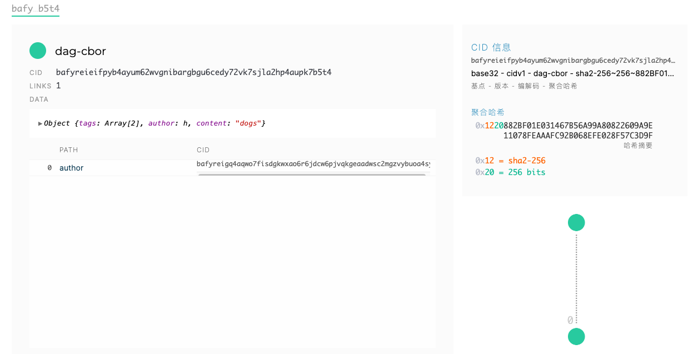
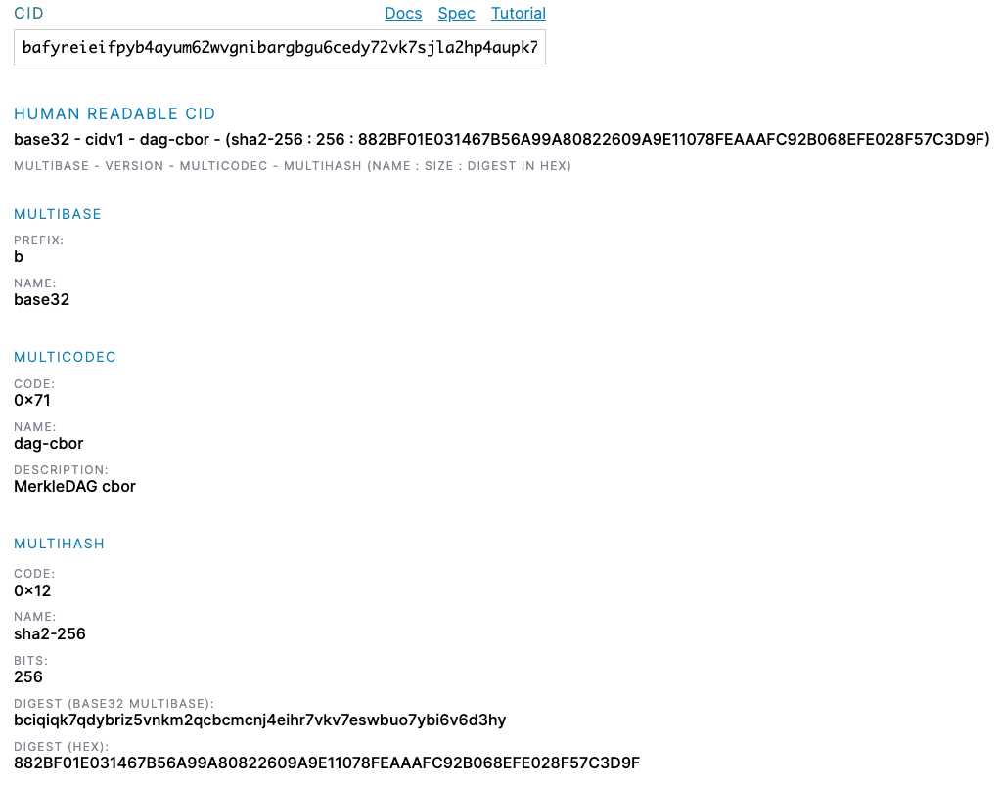

# 在去中心化网络上写博客
精彩内容地址不变。使用 IPFS DAG API 创建从一个 CID 到另一个 CID 的链接链。
## 使用作者的 CID 将作者链接到博客文章 1
在[基础-具有内容寻址的 P2P 数据链接 ](https://proto.school/basics/02)教程中，我们了解到 IPFS 中的链接表示为以下实例 CID：

	{
	  linkToAwesomeNode: awesomeCid
	}
当我们给一个字段一个名字并让它的值成为一个 CID 的链接时，我们称之为命名链接。

下面的挑战有一些准备好的代码让我们开始。数据结构类似于一个博客，它有两个作者，Nat 和 Sam，以及一些关于树木和计算机的博客文章。目前他们之间没有关系。让我们更新博客文章，以便它们链接到作者。

- [demo](https://proto.school/blog/01)

	通过添加链接到每篇博文作者的新字段 `author`  来修改现有的两篇博文。
	
	- 关于树木的帖子由 Sam 撰写
	- 而 Nat 撰写了关于计算机的帖子

	- 编码

			/* globals ipfs */
			
			const run = async () => {
			  // 创建作者为 Nat 的主题
			  const natCid = await ipfs.dag.put({ author: "Nat" })
			  const treePostCid = await ipfs.dag.put({
			    content: "trees",
			    author: samCid
			  })
			  
			   // 创建作者为 Sam 的主题
			  const samCid = await ipfs.dag.put({ author: "Sam" })
			  const computerPostCid = await ipfs.dag.put({
			    content: "computers",
			    author: natCid
			  })
			
			  return [treePostCid, computerPostCid]
			}
			
			return run

## 使用标签更新帖子并观察他们的 CID 变化 2
存储在 IPFS 中的所有内容都有一个关联的 CID。该 CID 是通过散列数据本身构建的。如果使用相同的散列和编码，则相同的数据将产生相同的 CID。但是，一旦您编辑数据并再次存储，它就会有一个新的 CID。旧数据不会被覆盖；它仍然和旧的 CID 一起存储在那里。

我们的博客还没有任何标签。让我们再次修改帖子以添加一些标签，观察每个帖子的 CID 在我们更改其内容时如何变化。

首先，提交当前状态的代码。您将看到博客文章的 CID。当您修改代码后再次提交时，您会看到 CID 已更改。

- [Demo](https://proto.school/blog/02)

	在每个帖子中，添加一个名为 `tags` 其值是标签数组的新字段。
	
	- 使用标签 `outdoor` 和 `hobby` 关于树的博客文章。
	- 为有关计算机的博客文章添加一个名为 `hobby`.

	- 编码

			/* globals ipfs */
			
			const run = async () => {
			  const natCid = await ipfs.dag.put({ author: "Nat" })
			  const samCid = await ipfs.dag.put({ author: "Sam" })
			
			  const treePostCid = await ipfs.dag.put({
			    content: "trees",
			    author: samCid,
			    tags: ["outdoor", "hobby"]
			  })
			  const computerPostCid = await ipfs.dag.put({
			    content: "computers",
			    author: natCid,
			    tags: ["hobby"]
			  })
			
			  return [treePostCid, computerPostCid]
			}
			
			return run
	- 检查结果

		这些是博客文章的 CID。请注意当基础数据发生变化时它们是如何变化的。
		
			{
			  "treePostCid": "bafyreic5ndfk2yj4vr7pdhk4n435hxr522faalcse2ls4ukzddr7d5qxhi",
			  "computerPostCid": "bafyreicmrzqpsebu5or7zjeffvnc3g76khmyzdo3q64i7ylvekxgcyqszq"
			}

## 使用链接数组构建标签云 3
单个对象可以有许多到其他节点的链接。为了说明这一点，让我们创建可用于标签云的新节点。

到目前为止，我们一直在使用命名链接，这意味着我们创建一个命名字段，其中包含一个链接作为其值，例如：

	{
	  author: samCid
	}
但是，我们也可以选择将链接收集到一个数组中，而无需单独命名每个链接。

	{
	  links: [natCid, samCid]
	}
这非常适合我们的用例，其中一个标签应该与许多帖子相关联，如下所示：

	{
	  tag: "name-of-the-tag",
	  posts: [/* links to the CIDs */]
	}
请注意，数组是依赖于顺序的。这意味着具有不同顺序的相同链接的两个阵列将获得不同的 CID。

- [Demo](https://proto.school/blog/03)

	按照上面所示的格式为标记 `outdoor` 和 `hobby` 创建新节点，使用数组链接到相关的博客文章。通过 [IPFS .dag.put](https://github.com/ipfs/js-ipfs/blob/master/docs/core-api/DAG.md#ipfsdagputdagnode-options) 将新的标记对象插入到 IPFS中，并将两个生成的 cid 作为数组返回。
	
	- 编码

			/* globals ipfs */
			
			const run = async () => {
			  // samCid & tree
			  const samCid = await ipfs.dag.put({ author: "Sam" })
			  const treePostCid = await ipfs.dag.put({
			    content: "trees",
			    author: samCid,
			    tags: ["outdoor", "hobby"]
			  })
			  const outdoorTagCid = await ipfs.dag.put({
			    tag: "outdoor",
			    posts: [treePostCid]
			  })
			  
			  // natCid & computer
			  const natCid = await ipfs.dag.put({ author: "Nat" })
			  const computerPostCid = await ipfs.dag.put({
			    content: "computers",
			    author: natCid,
			    tags: ["hobby"]
			  })
			  const hobbyTagCid = await ipfs.dag.put({
			    tag: "hobby",
			    posts: [treePostCid, computerPostCid]
			  })
			
			  return [outdoorTagCid, hobbyTagCid]
			}
			
			return run

## 添加链接到作者和标签的新博客文章 4
为了使 DAG（有向无环图）更有趣，我们将添加一篇新的博文。它遵循与现有结构相同的结构。

- [demo](https://proto.school/blog/040)

	创建一篇由 Sam 撰写、内容关于 `dogs` 且标记为 `funny` 和 `hobby ` 的新博客文章。返回该新博客文章的 CID。
	
	- 编码

			/* globals ipfs */
			
			const run = async () => {
			 
			  // nat & computer 
			  const natCid = await ipfs.dag.put({ author: "Nat" })
			   const computerPostCid = await ipfs.dag.put({
			    content: "computers",
			    author: natCid,
			    tags: ["hobby"]
			  })
			  
			  // sam & tree
			  const samCid = await ipfs.dag.put({ author: "Sam" })
			  const treePostCid = await ipfs.dag.put({
			    content: "trees",
			    author: samCid,
			    tags: ["outdoor", "hobby"]
			  })
			  
			  // sam & dog
			  const dogPostCid = await ipfs.dag.put({
			    content: "dogs",
			    author: samCid,
			    tags: ["funny", "hobby"]
			  })
			
			  // tag
			  const outdoorTagCid = await ipfs.dag.put({
			    tag: "outdoor",
			    posts: [treePostCid]
			  })
			  const hobbyTagCid = await ipfs.dag.put({
			    tag: "hobby",
			    posts: [treePostCid, computerPostCid]
			  })
			
			  return dogPostCid
			}
			
			return run
	- 检查
		- [在 IPLD 游览器查看 DAG 解析](https://explore.ipld.io/#/explore/bafyreieifpyb4ayum62wvgnibargbgu6cedy72vk7sjla2hp4aupk7b5t4)
	
		
	- [在 IPLD INSPECTOR 查看 CID 解析](https://cid.ipfs.io/#bafyreieifpyb4ayum62wvgnibargbgu6cedy72vk7sjla2hp4aupk7b5t4)
	
		 
		
## 添加链接到多篇博文的新标签 5
我们关于狗的新帖子与其他帖子完全脱节。让我们更新代表标签云的节点。

- [demo](https://proto.school/blog/05)

	首先，您需要从标签 hobby 的节点添加指向新博客的链接。

	我们还没有 `funny` 标签的节点。创建一个与其他标签节点格式匹配的新标签节点，并链接到关于狗的博客文章。

	将所有三个标签节点的 CID 作为数组返回。
	
	- 编码

			/* globals ipfs */
			
			const run = async () => {
			
			  // nat & computer
			  const natCid = await ipfs.dag.put({ author: "Nat" })
			   const computerPostCid = await ipfs.dag.put({
			    content: "computers",
			    author: natCid,
			    tags: ["hobby"]
			  })
			  
			  // sam && tree && dog
			  const samCid = await ipfs.dag.put({ author: "Sam" })
			  const treePostCid = await ipfs.dag.put({
			    content: "trees",
			    author: samCid,
			    tags: ["outdoor", "hobby"]
			  })
			  const dogPostCid = await ipfs.dag.put({
			    content: "dogs",
			    author: samCid,
			    tags: ["funny", "hobby"]
			  })
			  
			  // create tag
			  const outdoorTagCid = await ipfs.dag.put({
			    tag: "outdoor",
			    posts: [treePostCid]
			  })
			  const hobbyTagCid = await ipfs.dag.put({
			    tag: "hobby",
			    posts: [treePostCid, computerPostCid, dogPostCid]
			  })
			  const funnyTagCid = await ipfs.dag.put({
			    tag: "funny",
			    posts: [dogPostCid]
			  })
			
			  return [outdoorTagCid, hobbyTagCid, funnyTagCid]
			}

## 使用链接链按时间顺序列出帖子 6 
您想要创建一个按时间顺序列出您的博客文章的概览页面。

你可以像我们对标签那样做。但是每次添加新博客文章时都需要更新该页面（创建新节点）。每个小改动都创建一个新节点听起来很浪费。

有更好的方法！每当您创建新的博客文章时，您都可以直接链接到上一篇。这使您能够遍历这些链接以动态创建按时间顺序排列的概览页面，正如我们将在下一课中看到的那样。

一旦博客文章存储在 IPFS 中，我们就会知道它的 CID。我们可以使用该 CID 从较新的博文链接到较旧的博文。

- [demo](https://proto.school/blog/06)

	在下面的代码中，引入一个名为 `previn our blog posts `的新字段。此字段链接到上一篇博文。

	按时间顺序链接博客文章。
	
	- 最古老的是关于树的
	- 然后是关于计算机的
	- 最后关于的那个dogs是最新的

	更新它们后，返回关于 dogs 的博客文章的 CID

	- 编码

			/* globals ipfs */
			
			const run = async () => {
			  const natCid = await ipfs.dag.put({ author: "Nat" })
			  const samCid = await ipfs.dag.put({ author: "Sam" })
			  const treePostCid = await ipfs.dag.put({
			    content: "trees",
			    author: samCid,
			    tags: ["outdoor", "hobby"]
			  })
			  const computerPostCid = await ipfs.dag.put({
			    content: "computers",
			    author: natCid,
			    tags: ["hobby"],
			    prev: treePostCid
			  })
			  const dogPostCid = await ipfs.dag.put({
			    content: "dogs",
			    author: samCid,
			    tags: ["funny", "hobby"],
			    prev: computerPostCid
			  })
			
			  // 标签
			  const outdoorTagCid = await ipfs.dag.put({
			    tag: "outdoor",
			    posts: [treePostCid]
			  })
			  const hobbyTagCid = await ipfs.dag.put({
			    tag: "hobby",
			    posts: [treePostCid, computerPostCid, dogPostCid]
			  })
			  const funnyTagCid = await ipfs.dag.put({
			    tag: "funny",
			    posts: [dogPostCid]
			  })
			
			  return dogPostCid
			}
			
			return run
	- 检查
		- [在 IPLD 游览器查看 DAG 解析](https://explore.ipld.io/#/explore/bafyreifvq4aykfnxjgqqmjelphadwhzvc4mt6h3mwytj54oa3qakuis3ie)
	
			
		- [在 IPLD INSPECTOR 查看 CID 解析](https://cid.ipfs.io/#bafyreifvq4aykfnxjgqqmjelphadwhzvc4mt6h3mwytj54oa3qakuis3ie)
	
			 
	- 结构类似
		- dog
			- content: "dogs" 
			- author: samCid
				- author: "Sam"
			- prev: computerPostCid
				- content: "computers",
			    	- author: natCid
			    		- author: "Nat"  
			    	- prev: treePostCid 
			    		- content: "trees",
			    		- author: samCid,
			    			- author: "Sam"  
			    	
## 遍历所有帖子，从最近的开始 7
通过将每篇博文链接在一起，我们可以通过仅引用最后一篇的 CID 来返回所有博文。这种遍历可用于创建一个按时间顺序列出所有博客文章的概览页面。

该 `prev` 字段包含指向上一篇博文的链接。

- 您可以使用该 CID 和 `ipfs.dag.getAPI` 获取上一篇博客，
- 然后使用上篇的 `prev` 字段获取上上一篇。
- 然后 `while` 循环的完美用例！

请注意，`ipfs.dag.get()API` 返回一个具有 `value` 属性的对象，该属性是您想要的节点并包含您保存的原始字段。例如，我们可以这样找到关于狗的帖子的作者：

	const dogPostAuthor = (await ipfs.dag.get(dogPostCid)).value.author
请注意  `await ipfs.dag.get(dogPostCid)` 上面使用的括号，因为异步函数需要在具有属性的 CID 对象可用之前完成 `value`。当您在实践中使用此代码时，重要的是不要进行太多会产生滞后时间的异步调用。

- [demo](https://proto.school/blog/07)

	填写函数体 `traversePosts`。它以最新博客文章的 CID 对象作为输入。使用它从 IPFS 获取对象并点击链接 `prev`。该函数的返回值应该是一个数组，其中包含所有节点的 CID 对象（包括输入 CID），从最近的帖子开始到最旧的帖子结束。

	提示:你怎么知道什么时候你没有链接了? 尝试使用 [while循环](https://www.digitalocean.com/community/tutorials/using-while-and-do-while-loops-in-javascript)并检查当前对象中是否存在 `prev` 字段。
	
	- 如果它存在，则还没有完成，需要重置一个变量并再次运行循环。
	您需要 [使用数组推送](https://developer.mozilla.org/en-US/docs/Web/JavaScript/Reference/Global_Objects/Array/push) 方法将相关的 cid 添加到数组中。如上所述，要注意尽量减少可能产生延迟时间的异步调用的数量，并记住，在 `ipfs. daga .get` 函数返回结果之前，该值是不存在的。(参见上面的最后一个例子。)

	请不要编辑 `run` 函数，只编辑 `traversePosts` 函数。
	
	- 编码

			/* globals ipfs */
			
			const traversePosts = async (cid) => {
			  const result = []
			  while (cid) {
			    result.push(cid)
			    const current = await ipfs.dag.get(cid)
			    const prev = current.value.prev
			    if (prev) {
			      cid = prev
			    } else {
			      return result
			    }
			  }
			}
			
			const run = async () => {
			  const natCid = await ipfs.dag.put({ author: "Nat" })
			  const samCid = await ipfs.dag.put({ author: "Sam" })
			
			  const treePostCid = await ipfs.dag.put({
			    content: "trees",
			    author: samCid,
			    tags: ["outdoor", "hobby"]
			  })
			  const computerPostCid = await ipfs.dag.put({
			    content: "computers",
			    author: natCid,
			    tags: ["hobby"],
			    prev: treePostCid
			  })
			  const dogPostCid = await ipfs.dag.put({
			    content: "dogs",
			    author: samCid,
			    tags: ["funny", "hobby"],
			    prev: computerPostCid
			  })
			
			  const outdoorTagCid = await ipfs.dag.put({
			    tag: "outdoor",
			    posts: [treePostCid]
			  })
			  const hobbyTagCid = await ipfs.dag.put({
			    tag: "hobby",
			    posts: [treePostCid, computerPostCid, dogPostCid]
			  })
			  const funnyTagCid = await ipfs.dag.put({
			    tag: "funny",
			    posts: [dogPostCid]
			  })
			
			  return traversePosts(dogPostCid)
			}
			
			return run

			 	
		

		

	
	
