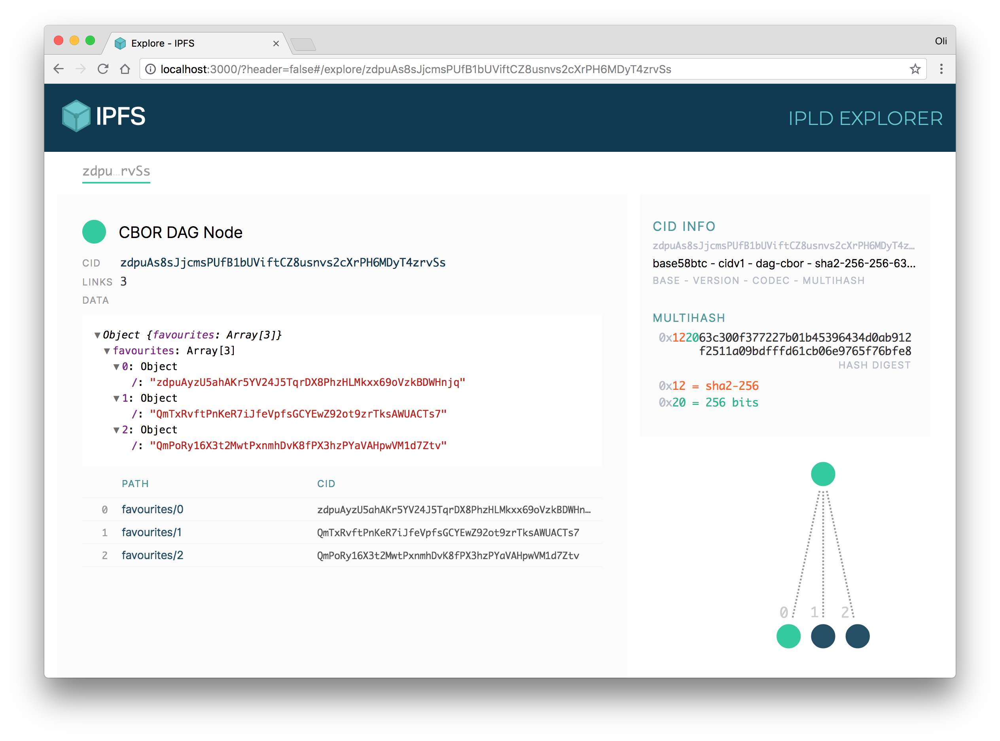

# explore.ipld.io 上的 IPLD 资源管理器
在您的浏览器中舒适地探索默克尔森林。

## 背景
这个 repo 负责位于 [https://explore.ipld.io](https://explore.ipld.io/) 的独立工具

组件代码位于 [ipld-explorer-components](https://github.com/ipfs/ipld-explorer-components)的单独 repo 中

该应用程序将通过本地运行的 IPFS 节点提供的 HTTP API  使用正确的 [ipfs-http-client](https://www.npmjs.com/package/ipfs-http-client) CORS 标头设置，否则回退到使用 [js-ipfs](https://github.com/ipfs/js-ipfs)。

该应用程序是用 [create-react-app](https://github.com/facebook/create-react-app). 请阅读[文档](https://github.com/facebook/create-react-app/blob/master/packages/react-scripts/template/README.md#table-of-contents)。

## 安装
安装 `node` > 10（但 < 12）和 `npm` @ 6+，运行

	npm install
## 用法
开发时，您可以运行[开发服务器](https://github.com/facebook/create-react-app/blob/master/packages/react-scripts/template/README.md#npm-start)、[单元测试](https://facebook.github.io/jest/)和[故事书](https://storybook.js.org/)组件查看器，并在保存文件时查看更改结果。

在单独的 shell 中运行以下命令：

	# Run the unit tests
	npm test
	
	# Run the dev server @ http://localhost:3000
	npm start
	
	# Run the UI component viewer @ http://localhost:9009
	npm run storybook

## 建造
要创建应用程序的优化静态构建，请输出到 `build` 目录：

	# Build out the html, css & jss to ./build
	npm run build
### 分析
要检查构建的捆绑包中的捆绑模块及其大小，首先是 `build` 应用程序，然后：

	# Run bundle
	npm run analyze
## 测试
以下命令将运行应用程序测试、观察源文件并在进行更改时重新运行测试：

	npm test
使用 Jest 来运行独立的单元测试。单元测试文件位于它们测试的组件旁边，并且具有相同的文件名，但扩展名为 `.test.js`

### Linting
以下命令将对 [standard](https://standardjs.com/) 代码执行 linting：

	npm run lint
### 覆盖范围
要执行单次测试并生成覆盖率报告，请运行以下命令：

	npm run test:coverage

### 翻译
翻译存储在 [./public/locales](https://github.com/ipld/explore.ipld.io/blob/master/public/locales)上，英文版本是真实的来源。我们使用 Transifex 来帮助我们将 WebUI 翻译成另一种语言。

如果您有兴趣贡献翻译，请访问我们在 [Transifex](https://www.transifex.com/ipfs/ipfs-webui/translate/) 上的页面，创建一个帐户，选择一种语言并开始翻译。

您可以在 [https://github.com/ipfs-shipyard/ipfs-webui/blob/master/docs/LOCALIZATION.md](https://github.com/ipfs-shipyard/ipfs-webui/blob/master/docs/LOCALIZATION.md)阅读更多关于我们如何在此应用程序中使用 Transifex 和 i18next 的信息

## 自增
### 配置跨域配置
ipfs api 访问需要配置跨域设置，否则报

	Access to fetch at 'http://127.0.0.1:5001/api/v0/id' from origin 'http://localhost:3000' has been blocked by CORS policy: No 'Access-Control-Allow-Origin' header is present on the requested resource. If an opaque response serves your needs, set the request's mode to 'no-cors' to fetch the resource with CORS disabled.
配置方法

	$ ipfs config --json API.HTTPHeaders.Access-Control-Allow-Methods '["PUT", "GET", "POST", "OPTIONS"]'
	或
	$ ipfs config  --json API.HTTPHeaders.Access-Control-Allow-Methods '["GET", "POST"]'
	$ ipfs config --json API.HTTPHeaders.Access-Control-Allow-Origin '["*"]'
	$ ipfs config --json API.HTTPHeaders.Access-Control-Allow-Credentials '["true"]'
	$ ipfs config --json API.HTTPHeaders.Access-Control-Allow-Headers '["Authorization"]'
	$ ipfs config --json API.HTTPHeaders.Access-Control-Expose-Headers '["Location"]'

## 参考
- [使用React前端框架结合js-ipfs-api实现IPFS的文本数据流传输](https://rectsuly.github.io/2018/02/%E4%BD%BF%E7%94%A8react%E5%89%8D%E7%AB%AF%E6%A1%86%E6%9E%B6%E7%BB%93%E5%90%88js-ipfs-api%E5%AE%9E%E7%8E%B0ipfs%E7%9A%84%E6%96%87%E6%9C%AC%E6%95%B0%E6%8D%AE%E6%B5%81%E4%BC%A0%E8%BE%93/)
- [IPLD Explorer at explore.ipld.io](https://github.com/ipld/explore.ipld.io)