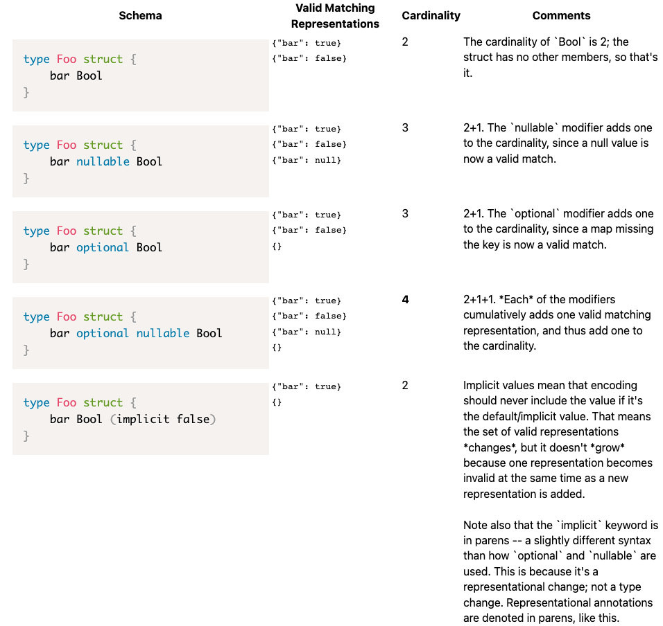

# IPLD 模式种类
## 扩展 IPLD 数据模型
### 数据模型种类
IPLD 模式定义了一组基于 IPLD [数据模型](https://github.com/ipld/specs/blob/master/data-model-layer/data-model.md#kinds) 构建的“种类”。数据模型定义了一组基本的数据类型（种类），这些数据类型可以很容易地用通用编程语言表示，并且可以通过 JSON 和 CBOR 等富有表现力的序列化格式来支持。数据模型将其类型列表定义为：

- Null
- Boolean
- Integer
- Float
- String
- Bytes
- List
- Map
- Link

### 模式种类
IPLD 模式虽然建立在数据模型之上，但可以定义为我们提供新的离散类型的数据结构，从而将数据模型类型扩展到新的模式类型列表中：

- 数据类型已有
	- Null
	- Boolean
	- Integer
	- Float
	- String
	- Bytes
	- List
	- Map
	- Link
- 扩展
	- `Union`
	- `Struct`
	- `Enum`
	- `Copy`

使用 `raw` 编解码器编码的块被认为是有效 `Bytes` 类型。您可以参考编解码器规范，了解其他类型在每个编解码器中是如何编码的。

我们将 `“递归类型”` 定义为由其他类型组成的类型：

- List
- Map
- Union
- Struct 
- Enum

这些类型提供了主要机制，通过该机制可以使用 IPLD 模式来描述非平凡的数据结构。

此外，我们将 `Copy` 定义为 “Meta Kind”，因为它有助于简化模式创作和/或增加模式的描述性以用于文档目的。它仅存在于模式工具中，不会暴露给面向用户的代码或数据。

#### List
作为一种模式种类，Lists 在它们可以包含的数据方面有更多的限制。

- 在数据模型中，列表被简单地定义为任意数据模型类型的列表，没有可能需要统一性的严格限制。
- 在模式中，列表被定义为一种特定模式类型的列表。比如 

		type Foo [String]
	定义了一个 `String` 列表，只匹配一个 `String` 列表。此限制并不像看起来那样限制，因为 `Union` 允许很大的灵活性，特别是在 kinded Union 的情况下。
	
#### map
与 List 类似，模式层的 Map 需要严格定义值类型。数据模型规定 IPLD 仅支持字符串键，因此在模式 map 中用作键的任何类型都必须表示为字符串。值类型具有与列表元素类型相同的限制。

例如， 匹配具有 Float 值且仅具有 Float 值的 map。 

	type Bar {String:Float}
但与 List 一样， `Union`  允许在可能显示为值的数据模型类型中提供额外的灵活性。
#### Union 
对于 `keyed, envelope` 和 `inline` 表示，Union 在数据模型中表示为 Map，而对于分类的 Union 则表示为不同的数据模型类型，如表示策略一页所述。
#### Struct
默认情况下，结构在数据模型中表示为 Map，但可用于描述 String 和 List 编码，如 [Representation Strategies](https://ipld.io/docs/schemas/features/representation-strategies/) 页面所述。
#### Enum
枚举在数据模型中表示为 `String` 或 `Int` ，如  [Representation Strategies](https://ipld.io/docs/schemas/features/representation-strategies/) 页面所述。
#### Copy
Copy 是一种 `Meta Kind`，它指示一种类型应该与另一种类型相同地实现和编码，但具有备用名称。这是一种简写，可以避免定义具有相同形状和编码但名称不同的多种类型。

## 值类型修饰符
递归类型中的值和字段可以有修饰符。这些修饰符是：

- `nullable` 

	用于 map 值、列表值和结构字段
- `optional` 

	对于结构字段
- `implicit` 

	对于结构字段——在某些表示中

### 可空值
修饰符 `nullable` 意味着被修饰的类型可能存在或者它的位置可能被空值占据。

修饰符 `nullable` 对 map 值、列表值和结构字段有效。

修饰符的存在将 `nullable` 字段有效成员的基数增加一个——请参阅下面的“基数示例”表。
### 可选字段
修饰符 `optional` 意味着修改后的类型可能存在， 也可能在数据中完全缺失。这与 null 不同：例如，在 map 中，可选性考虑是否缺少键，这与键存在但值为 null 形成对比。

修饰符 `optional` 仅在结构字段上有效（并且仅适用于某些表示策略；表示为 map 的结构和表示为列表的结构具有略微不同的可选语义（例如，基于列表的表示可能只允许列表开头和结尾的可选）） .

修饰符的存在将 `optional` 字段有效成员的基数增加一个——请参阅下面的“基数示例”表。

修饰符 `optional` 可以与修饰符 `nullable` 叠加。
### 具有隐式值的字段
修饰符 `implicit` 声明当发现数据中不存在某个字段时，它应该被视为域中的其他值。同时，如果应用程序将字段设置为该值，则在表示时将 map 为不存在该字段。

隐式值可能被认为类似于“默认值”——如果你正在寻找默认值，你应该看看隐式——但我们为隐式选择了一个独特的名称，因为“默认值”通常是一种单向转换；而我们设计的隐式值系统专门用于双向工作——在序列化和反序列化期间——都不会丢失信息。

值得注意的是，隐式是驻留在表示子句中而不是类型定义子句中的概念。之所以如此，是因为隐含不会更改类型的基数（请参阅本文档后面的[理解基数表](https://ipld.io/docs/schemas/features/typekinds/#understanding-cardinality)，了解更多示例，了解这意味着什么，以及它在语义上如何与其他修饰符进行比较）。作为一种表示而非类型定义功能，隐式声明的句法位置是在声明字段的行的末尾，并在括号中（与可以找到“重命名”和其他表示级指令的位置相同）。

隐式值的精确语义可能因表示策略而异；此处的讨论仅针对一般模式，您还应该[参考表示策略的参考文档](https://ipld.io/docs/schemas/features/representation-strategies/#representation-strategy-reference)， 以了解有关您使用的表示策略的更多详细信息。
### 组合 Nullable、Optional 和 Implicit
`optional ` 和 `nullable` 修饰符可以毫无问题地自由组合，就像 `nullable` 和 `implicit` 修饰符一样。

组合修饰符 `optional` 和 `implicit` 修饰符是无效的——因为当数据在串行形式中不存在时，两者都考虑结构字段周围的行为，所以只有在一个字段上单独使用一个或另一个才有意义。

根据结构具有何种表示策略，对于是否可以在结构字段上使用 `optional` 和 `implicit ` 修饰符可能会有额外的限制。例如，当表示为元组时，`optional`和 `implicit ` 不能用在结构中间的字段中，因为这可能会使解析产生歧义。[表示策略的参考文档应](https://ipld.io/docs/schemas/features/representation-strategies/#representation-strategy-reference) 提供更详细的信息。
### 在可选和隐式之间进行选择
`implicit` 当缺少值应被视为明确适合您的域的另一个值时使用；`optional` 当没有这样的域内值时使用。

例如，

- 如果您有一些整数字段，并且如果0与不存在的字段不同，请使用 `optional`. 
- 如果 0（或您选择的某些其他值，如-1）可以在您的应用程序逻辑中用作标记值，而不是这样序列化，那么您可能希望考虑使用 `implicit`.

需要特别注意的一种使用模式：想象一下编写一个用于定义用户可能提供的配置的模式，并且它具有一些 “默认值” 的概念。如果您的应用程序还需要能够记住某个值是默认值还是明确由用户提供（例如，重新发出配置而不更改它），您想要使用 `optional!` 在这种情况下，`implicit` 如果提供的值等于默认值，可能会导致在应用层丢失提供的值，而 `optional` 将公开并正确保留值的存在或不存在。
### 了解基数
有关基数的更多信息以及我们如何推理它的基础知识，请查看[设计概念文档](https://ipld.io/design/concepts/)中的[类型理论词汇表](https://ipld.io/design/concepts/type-theory-glossary/)。
#### 基数示例
这些示例显示了我们如何在存在`nullable` 和 `optional` 关键字的情况下计算 IPLD 模式中的基数：

