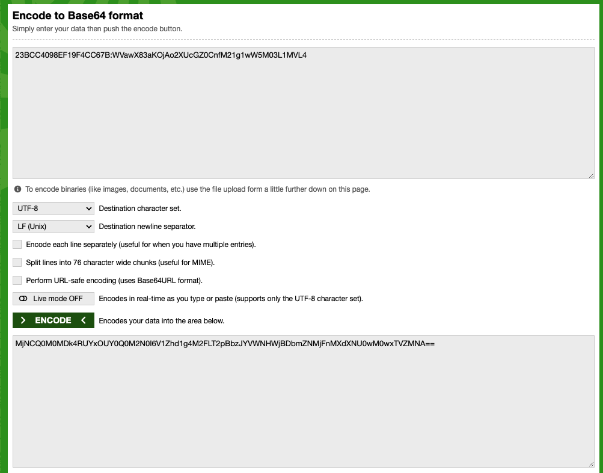

# IPFS 网关管理 API
了解如何使用 Filebase IPFS 网关管理 API。
## IPFS 网关管理 API
Filebase IPFS 网关管理 API 可用于在 Filebase 平台上查看、创建和删除 IPFS 网关。阅读下文以了解有关如何使用每个单独的 API 方法的更多信息。
### 授权
	Authorization: Bearer <access-token>
- 要生成 `access-token`
	- 首先检索您 [访问密钥和秘密访问密钥对](https://docs.filebase.com/getting-started/getting-started-guides/getting-started-guide#access-keys)。
	- 然后，导航 [base64encode](https://www.base64encode.org/) 到并输入以下信息：
	
			ACCESS-KEY:SECRET-KEY
	- 然后选择“编码”并复制结果

		

### 有效载荷
请求正文架构： application/json

- 列出网关  `Get https://api.filebase.io/v1/gateways`

	返回所有专用 IPFS 网关列表
	
	- 参数

		无
	- 响应
		- 200

				[
				    {
				        "name": "gateway123",
				        "domain": null,
				        "private": false,
				        "created_at": "2023-02-14T11:24:39.298-05:00",
				        "updated_at": "2023-02-14T11:24:39.298-05:00",
				        "enabled": true
				    },
				    {
				        "name": "gateway1234",
				        "domain": null,
				        "private": false,
				        "created_at": "2023-02-14T11:25:11.893-05:00",
				        "updated_at": "2023-02-14T11:25:11.893-05:00",
				        "enabled": true
				    },
				    {
				        "name": "gateway123223",
				        "domain": null,
				        "private": false,
				        "created_at": "2023-02-14T11:54:31.926-05:00",
				        "updated_at": "2023-02-14T11:54:31.926-05:00",
				        "enabled": true
				    }
				] 	
- 返回特定网关的详细信息 `GET https://api.filebase.io/v1/gateways/<gateway-name>`

	返回特定网关的详细信息
	
	- 参数

		无
	- 响应
		- 200

				{
				    "name": "test-josh555567778",
				    "private": false,
				    "enabled": true
				}
- 创建专用网关 `POST https://api.filebase.io/v1/gateways`

	运行用户创建专用网关
	
	JSON 正文负载
	
	- Body 参数

		参数名|类型|说名
		---|---|---
		name*|string|网关名称，这里的名称限制匹配桶名称，3-63个字符，必须全剧唯一。如果桶名已经占用，将返回 HTTP 409 冲突
		private|boolean|默认为 Flase.这控制网关的公共(可以获取任何 IPFS 内容)还是私有(只能获取你自己的固定内容)
		enabled|boolean|默认情况下为 true。可以控制网关是否开启，用户可以紧致网关防止提供内容消耗带宽
	- 返回

		200	
- 更新网关 `PUT https://api.filebase.io/v1/gateways/<gateway-name>`

	允许用户更新网关配置
	
	- Body 参数

		参数名|类型|说名
		---|---|---
		private|boolean|默认为 Flase.这控制网关的公共(可以获取任何 IPFS 内容)还是私有(只能获取你自己的固定内容)
		enabled|boolean|默认情况下为 true。可以控制网关是否开启，用户可以紧致网关防止提供内容消耗带宽
	- 返回

		200	
- 删除网关 `DELETE https://api.filebase.io/v1/gateways/<gateway-name>`

	允许使用删除专用网关，网关将不再起作用，停止提供内容
	
	- 参数

		无
	- 响应
		- 200

				{
				    // Response
				}
	
	