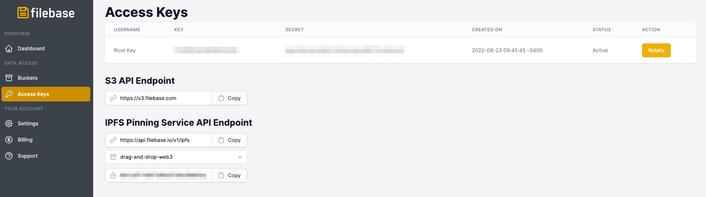

# S3 兼容 API
了解 Filebase 的 S3 兼容 API，以便与现有数据管理工具和框架无缝集成。

几个标准化的 S3 兼容框架、工具、客户端和 SDK 可以使用 Filebase 的 S3 兼容 API 来管理通过 Filebase 存储的数据。

Filebase [已认证了](https://docs.filebase.com/code-development-+-sdks)其中的几个工具与平台一起使用。Filebase 认证包括通过测试程序对软件工具进行测试，以验证与 Filebase S3 兼容 API 的一致性。

## API 端点
Filebase S3 兼容的 API 端点 URL 是：
	
	https://s3.filebase.com
## 访问密钥
要使用与 Filebase S3 兼容的 API，您需要拥有 Filebase Access 和 Secret 密钥对才能提交 API 请求。

要查看您的 Filebase 帐户的访问密钥，首先单击菜单中的“访问密钥”选项以打开访问密钥仪表板。

您可以在此处查看您帐户的访问密钥。每个访问密钥都有两部分，密钥和与密钥关联的秘密。访问密钥仪表板还将提供诸如创建访问密钥的时间和日期及其当前状态等信息。

要使用访问密钥，您需要同时拥有密钥和与该密钥关联的秘密。

### 验证
Filebase S3 兼容 API 仅支持 AWS v4 签名（AWS4-HMAC-SHA256）进行身份验证，目前不支持 AWS v2 签名。要了解有关 S3 身份验证的更多信息，请参阅 [本文](https://docs.aws.amazon.com/general/latest/gr/signature-version-4.html)。
### HTTPS协议
Filebase 维护严格的 HTTPS-only 标准。这意味着对象和 API 调用仅通过 HTTPS 提供。此连接的端口是 HTTPS 标准端口 443 。
目前无法禁用此功能。通过 HTTP 协议发送的请求将被重定向到 HTTPS。
### 速率限制
Filebase S3 API 的有效速率限制为 100 RPS（每秒请求数）。
### 支持的 API 方法
下面的列表记录了 Filebase 当前支持的 S3 API 方法。

- CopyObject（暂时禁用）

	用于创建现有对象的副本，当前暂停
- 桶相关
	- 创建桶
	
		创建一个新的存储桶。默认情况下，是 IPFS 网络创建
	- 删除桶
	
		从库中制定删除的桶。桶必须是空的才可以被清除
	- 头桶

		用于判断指定的桶是否存在
	- 列表桶

		列出账户中所有的桶
	- 策略
		- 桶 Cors 
			- GetBucketCors
	
				返回指定桶的当前 CORS 策略 	
			- 删除 BucketCors
			
				删除在指定存储桶上设置当前 CORS 策略
			- PutBucketCors

				用于在指定的桶上配置 CORS 策略	
		- 桶 Acl
			- 获取 BucketAcl
		
				返回指定桶的当前配置的访问控制列表
			- PutBucketAcl

				用于配制指定桶的访问控制列表权限
	- 生命周期
		- 获取桶生命周期

			返回指定桶的当前生命周期配置
		- 获取桶生命周期配置
		
			返回指定桶的当前生命周期配置
	- 获取桶位置
	
		返回指定桶的区域
	- 获取桶日志
	
		获取桶的当前日志记录状态
	- GetBucketVersioning
	
		返回指定存储桶的当前控制版本状态	 	
- 对象操作
	- 获取对象
	
		从桶中检索指定的对象				
	- Put对象

		用于上传一个对象到指定桶
	- 大文件(对象)上传
		- 创建分段上传
	
			启动分段上传，返回一个唯一的上传 ID，此 ID 用于表示分段上传的所有部分
		- 上传部分
	
			用于使用上传的唯一 ID 值，从分段上传中上传一个部分
		- 完整的多部分上传
		
			通过组装先前上传的部分来完成启动分段上传。
		- 中止多部分上传
		
			取消分段上传，中止后，上传将被取消，并且无法使用原始上传 ID 上传其他部分。在取消之前，上传的任何部分都将被删除
	- 删除对象
	
		从存储在桶中删除对象
	
	- 头部对象

		用于判断指定的对象是否存在
	- 列表对象
	
		列出指定存储桶中所有的对象，最多返回 1000 个
	- 列表对象V2
	
		列出指定存储桶中所有当前对象。最多1000个返回。新版本的列表对象，推荐用于新的工作流
	- 对象 ACL
		- 获取对象访问控制
	
			检索指定对象的当前访问控制列表配置
		- PutObjectAcl
		
			用于配制指定对象的访问控制列表权限

当存在响应负载时，所有响应都使用 UTF-8 编码的 XML 返回。

## 预签名 URL
Filebase S3 兼容 API 支持用于下载和上传对象的预签名 URL。可以通过多种方式生成预签名 URL，包括 AWS CLI 和 AWS 开发工具包。

有关预签名 URLS 的更多信息，请[这里](https://docs.filebase.com/api-documentation/pre-signed-urls)查看我们的指南。
## 访问控制列表 (ACL)
Filebase S3 兼容 API 对访问控制列表 (ACL) 提供有限支持。当前不支持对象级 ACL。

`GetBucketAcl` 和 `GetObjectAcl`方法将按预期工作，但响应将返回包含该对象 `GetObjectAcl` 的存储桶的 ACL。

这种设计消除了用户不小心将私有存储桶中的对象公开的可能性。如果您的工作流程需要混合使用私有和公共对象，您只需创建两个不同的存储桶即可。

有关如何创建 Filebase 存储桶的信息，请参阅[这里](https://docs.filebase.com/getting-started/getting-started-guide#creating-and-working-with-buckets)。
