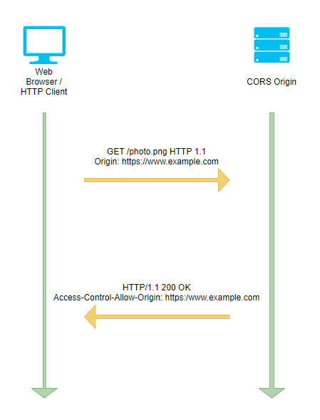
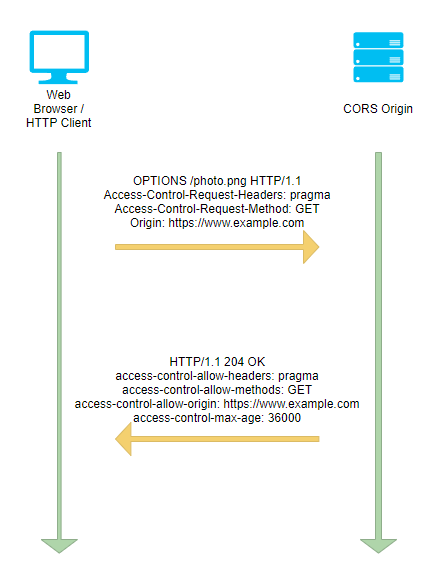

# 跨源资源共享 (CORS)
查看有关将跨源资源共享 (CORS) 与 Filebase 结合使用的文档和指南。
## 创建 CORS 规则并将其应用于Filebase存储桶
	了解如何配置用于 Filebase 存储桶的基本 CORS 规则。
跨源资源共享 (CORS) 为位于一个域的客户端 Web 应用程序创建了一种方式，使其能够与位于不同域的资源进行交互。借助 CORS，网站和应用程序可以访问存储在 Filebase 存储桶上的文件和资源。
### 为 Filebase 存储桶创建 CORS 规则
Filebase S3 兼容 API 支持存储桶的 CORS 配置。

支持以下 API 方法：

- GetBucketCors
- PutBucketCors
- DeleteBucketCors

要配置 Filebase 存储桶以允许跨域请求，您需要创建一个 CORS 规则。此规则标识您将允许访问您的存储桶的来源、每个来源将支持的 HTTP 方法以及其他特定于操作的信息。

此规则可以是 JSON 或 XML 文件，但如果使用 AWS CLI 应用此规则，则需要 .json 文件。

- 示例 #1 JSON：

	此示例是一个通配符规则，允许来自所有来源的跨域 GET 请求。

		{
		"CORSRules":[
		    {
		        "AllowedHeaders": [],
		        "AllowedMethods": [
		            "GET"
		        ],
		        "AllowedOrigins": [
		            "*"
		        ],
		        "ExposeHeaders": []
		    }
		    ]
		}
- 示例 #1 XML：

		<CORSConfiguration>
		    <CORSRule>
		        <AllowedOrigin>*</AllowedOrigin>
		        <AllowedMethod>GET</AllowedMethod>
		    </CORSRule>
		</CORSConfiguration>

CORS 还允许可选的配置参数，如以下 CORS 规则所示。

- MaxAgeSeconds 

	指定浏览器缓存对指定资源的预检 OPTIONS 请求的响应的时间量（以秒为单位）。
- ExposeHeader

	标识客户能够从其应用程序访问的响应标头。在此示例中，x-amz-server-side-encryption、x-amz-request-id 和 x-amz-id-2。
		
- 示例 #2 JSON：
	在第二个示例中，CORS规则
	
	- 允许来自 `http://www.example.com` 源的跨源 PUT、POST 和 DELETE 请求
	- `maxagesecseconds` 为3000
	- `x-amz-server-side-encryption、x-amz-request-id` 和 `x-amz-id-2` 的 `ExposeHeaders`。

			{
			"CORSRules": [
			    {
			        "AllowedHeaders": [
			            "*"
			        ],
			        "AllowedMethods": [
			            "PUT",
			            "POST",
			            "DELETE"
			        ],
			        "AllowedOrigins": [
			            "http://www.example.com"
			        ],
			        "ExposeHeaders": [
			            "x-amz-server-side-encryption",
			            "x-amz-request-id",
			            "x-amz-id-2"
			        ],
			        "MaxAgeSeconds": 3000
			    }
			    ]
			}
- 示例 #2XML：

		<CORSConfiguration>
		<CORSRule>
		<AllowedOrigin>http://www.example.com</AllowedOrigin>
		<AllowedMethod>PUT</AllowedMethod>
		<AllowedMethod>POST</AllowedMethod>
		<AllowedMethod>DELETE</AllowedMethod>
		<AllowedHeader>*</AllowedHeader>
		<MaxAgeSeconds>3000</MaxAgeSeconds>
		<ExposeHeader>x-amz-server-side-encryption</ExposeHeader>
		<ExposeHeader>x-amz-request-id</ExposeHeader>
		<ExposeHeader>x-amz-id-2</ExposeHeader>
		</CORSRule>
		</CORSConfiguration>

### 将 CORS 规则应用于 Filebase 存储桶
要应用 CORS 规则，您可以使用 AWS CLI 等工具来应用您创建的包含该规则的 .json 文件。有关如何配置 AWS CLI 的信息，请参阅[这里](https://docs.filebase.com/third-party-tools-and-clients/cli-tools/aws-cli)。

在命令行中，输入以下命令以将 CORS 规则应用于预期的 Filebase 存储桶：

	aws --endpoint https://s3.filebase.com s3api put-bucket-cors --bucket bucket-name --cors-configuration=file://corspolicy.json
### 测试 CORS 配置
您可以使用以下命令确认存储桶的 CORS 配置已成功应用：

	aws --endpoint https://s3.filebase.com s3api get-bucket-cors --bucket bucket-name
有关受支持的 S3 API 调用的完整列表，请参阅[这里](https://docs.filebase.com/api-documentation/s3-compatible-api#supported-api-methods)。

## 深入探讨：跨源资源共享 (CORS)
	关于什么是跨源资源共享 (CORS) 以及如何使用它的深入指南。
### 什么是 CORS？
跨源资源共享 (CORS) 是 Web 浏览器使用的一项技术，它允许一个 Web 地址的来源访问位于不同来源的资源。

要了解 CORS 及其目的，首先我们需要了解同源策略或 SOP。
### 什么是同源策略？
当网络浏览器加载网站时，它使用同源策略。此规则是一种安全机制，可确保网址只能从具有相同来源的其他网址请求数据。CORS 允许绕过 SOP，因此允许网址从不同来源请求数据。

同源规则在 2000 年代初期作为一种安全机制实施，旨在保护网站免受漏洞的侵害，该漏洞允许浏览器 cookie 被操纵并用于非法从一个网站向另一个网站发出请求。
### 什么是起源？
网站的来源由网址 URL 的协议、域和端口的组合定义。

该协议用于定义用于数据交换的方法。域或主机名是网址的唯一标识符。当通过 Web 浏览器访问时，通常在 URL 中不可见的端口定义了用于交换数据的连接端口。

简单来源规则要求网址具有相同的来源，这意味着协议、域和端口必须全部匹配才能交换数据。跨源规则允许在没有匹配协议、域或端口的网站之间交换数据。
### 什么是 HTTP 请求？
HTTP 请求是使用代码与服务器对话的方法。HTTP 请求包括请求标头、请求方法和消息（如果有）。有几种类型的请求方法，每种方法对服务器有不同的请求。

- get ：从服务器检索数据文件。
- head ：仅从服务器检索数据文件的标头。
- post ：上传或发送数据文件到服务器。
- put ：将数据文件上传或发送到服务器，覆盖服务器上的其他内容。
- delete：从服务器上删除一个数据文件。
- patch：更改服务器上的数据文件。
- options ：检查为服务器设置的选项。
- trace ：跟踪对服务器的请求和更改。

### 为什么使用 CORS？
有时，网站或应用程序需要访问来自不同来源的数据。CORS 充当网站之间共享资源的安全、既定方法。

Web 浏览器使用并允许 HTTP 请求，例如 `head,get` 并且 `post` 不需要任何 CORS 规则到位。例如，来自其他网站的嵌入图像使用获取请求从其他网站的来源提取数据。

某些数据或资产无法通过简单的 HTTP 请求访问，需要配置 CORS 规则以允许访问。
### CORS 是如何工作的？
CORS 通过规则工作，您可以自己配置和设置这些规则，以确定允许哪些来源绕过同源规则，以便可以在它们之间交换数据。

CORS 处理两种类型的请求，简单请求和更复杂的预先请求。

#### 简单请求
- 第一个请求 - 资源访问：

	

	通过 CORS 处理的简单请求是来自一个来源的网站的 GET 或 POST 请求，试图访问第二个来源的网址以访问存储在第二个来源的资源。

	在此请求期间，Web 浏览器会自动设置 CORS 请求标头。它通常包含一组特定的标准化 HTTP 标头。

	当服务器接收到 CORS 请求并对其进行处理时，它将发回一组 CORS 响应标头以及请求的资源。这些响应标头包含指定是否允许当前网站访问所请求资源的值。

	如果 Web 浏览器无法查看响应标头是否已满足 CORS 请求，则会阻止它访问请求的内容。

#### 预先飞行的请求
- 第一个请求 - 飞行前：

	
	
	飞行前请求用于 Web 浏览器和 CORS 来源之间更复杂的 CORS 通信。在授予对资源的访问权限之前，需要进行飞行前请求。不是 GET 或 POST 方法的 CORS 请求或使用非标准 HTTP 标头（即使使用 GET 或 POST 请求），也需要飞行前请求。
	
	当需要飞行前请求时，浏览器使用 HTTP 选项方法向具有预期 CORS 请求标头的服务器发送请求。服务器处理 CORS 请求标头并使用请求标头进行响应，但响应不包含任何实际内容数据。
- 第二个请求 - 资源访问：

	

	然后浏览器检查响应标头以确认允许 CORS 请求。如果浏览器确认资源请求已被服务器允许，它会使用相同的 CORS 请求标头使用预期的 HTTP 方法对实际内容数据发出第二个请求。

### CORS 规则
- Elements

	以下是所有 CORS 规则的必需元素：

	- `corsRuleName`

		CORS 规则的名称
	- `allowedOrigins element`

		在 allowedOrigins 元素中，您指定要允许跨域请求的来源，例如，`http://www.example.com`。原始字符串只能包含一个 `*` 通配符，例如 `http://*.example.com` . 您可以选择将 `*` 指定为源，以使所有源都可以发送跨域请求。您还可以指定 https 以仅启用安全来源。
	- `allowedMethod element`

		allowedMethod 元素是指您要允许的允许的 HTTP 请求方法。您可以为 allowedMethod 元素指定以下值。

		- get
		- put
		- post
		- delete
		- head
			
	以下是 CORS 规则的可选元素：

	- `allowedHeader element`

		allowedHeader 元素通过 Access-Control-Request-Headers 标头指定在 pref-light 请求中允许哪些标头。Access-Control-Request-Headers 标头中的每个标头名称必须与规则中的相应条目匹配。Amazon S3 将仅在请求的响应中发送允许的标头。
	- `exposeHeaders`

		exposeHeaders 元素允许向应用程序公开一个标头列表。
	- `maxAgeSections` 

		maxAgeSections 元素指的是 Web 浏览器可以保留对缓存的飞行前请求的响应的最大秒数。

### 创建 CORS 规则
CORS 规则可以是 JSON 或 XML 文件，但如果使用 AWS CLI 应用它，则需要 .json 文件。

- 示例 #1 JSON：

	此示例是一个通配符规则，允许来自所有来源的跨域 GET 请求。

		{
		"CORSRules":[
		    {
		        "AllowedHeaders": [],
		        "AllowedMethods": [
		            "GET"
		        ],
		        "AllowedOrigins": [
		            "*"
		        ],
		        "ExposeHeaders": []
		    }
		    ]
		}
- 示例 #1 XML：

		<CORSConfiguration>
		    <CORSRule>
		        <AllowedOrigin>*</AllowedOrigin>
		        <AllowedMethod>GET</AllowedMethod>
		    </CORSRule>
		</CORSConfiguration>
- 示例 #2 JSON：

	在第二个示例中，CORS 规则允许来自 `http://www.example.com` 源的跨源 PUT、POST 和 DELETE 请求，MaxAgeSeconds 为 3000，ExposeHeaders 为 x-amz-server-side-encryption、x-amz-request-id 和x-amz-id-2。

		{
		"CORSRules": [
		    {
		        "AllowedHeaders": [
		            "*"
		        ],
		        "AllowedMethods": [
		            "PUT",
		            "POST",
		            "DELETE"
		        ],
		        "AllowedOrigins": [
		            "http://www.example.com"
		        ],
		        "ExposeHeaders": [
		            "x-amz-server-side-encryption",
		            "x-amz-request-id",
		            "x-amz-id-2"
		        ],
		        "MaxAgeSeconds": 3000
		    }
		    ]
		}
- 示例 #2 XML：

		<CORSConfiguration>
		<CORSRule>
		<AllowedOrigin>http://www.example.com</AllowedOrigin>
		<AllowedMethod>PUT</AllowedMethod>
		<AllowedMethod>POST</AllowedMethod>
		<AllowedMethod>DELETE</AllowedMethod>
		<AllowedHeader>*</AllowedHeader>
		<MaxAgeSeconds>3000</MaxAgeSeconds>
		<ExposeHeader>x-amz-server-side-encryption</ExposeHeader>
		<ExposeHeader>x-amz-request-id</ExposeHeader>
		<ExposeHeader>x-amz-id-2</ExposeHeader>
		</CORSRule>
		</CORSConfiguration>

### 将 CORS 规则应用于存储桶
要应用 CORS 规则，您可以使用 AWS CLI 等工具来应用您创建的包含该规则的 .json 文件。有关如何配置 AWS CLI 的信息，请参阅 [这里](https://docs.filebase.com/client-configurations/aws-cli)。

在命令行中，输入以下命令以将 CORS 规则应用于预期的 Filebase 存储桶：

	aws --endpoint https://s3.filebase.com s3api put-bucket-cors --bucket bucket-name --cors-configuration=file://corspolicy.json
### 测试 CORS 配置
您可以使用以下命令确认存储桶的 CORS 配置已成功应用：

	aws --endpoint https://s3.filebase.com s3api get-bucket-cors --bucket bucket-name
