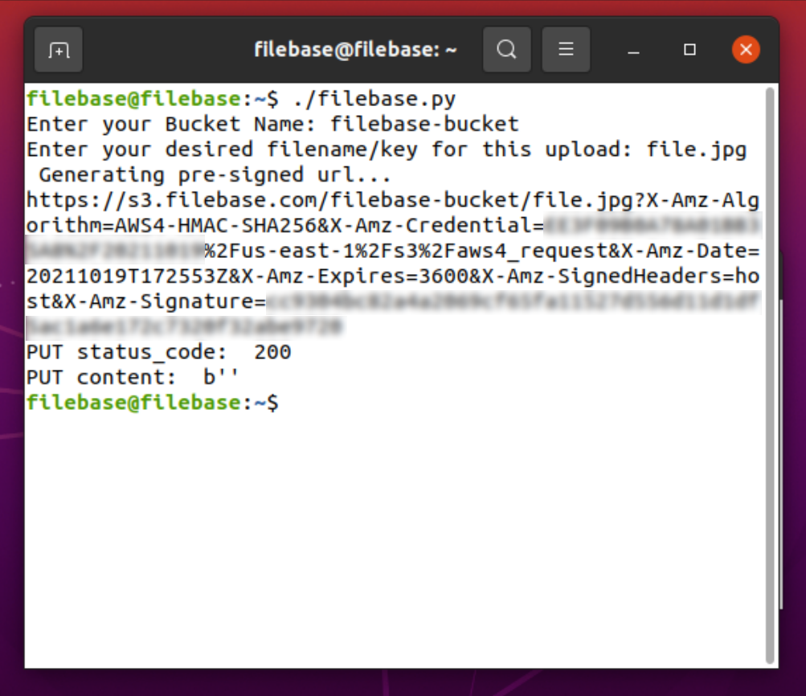
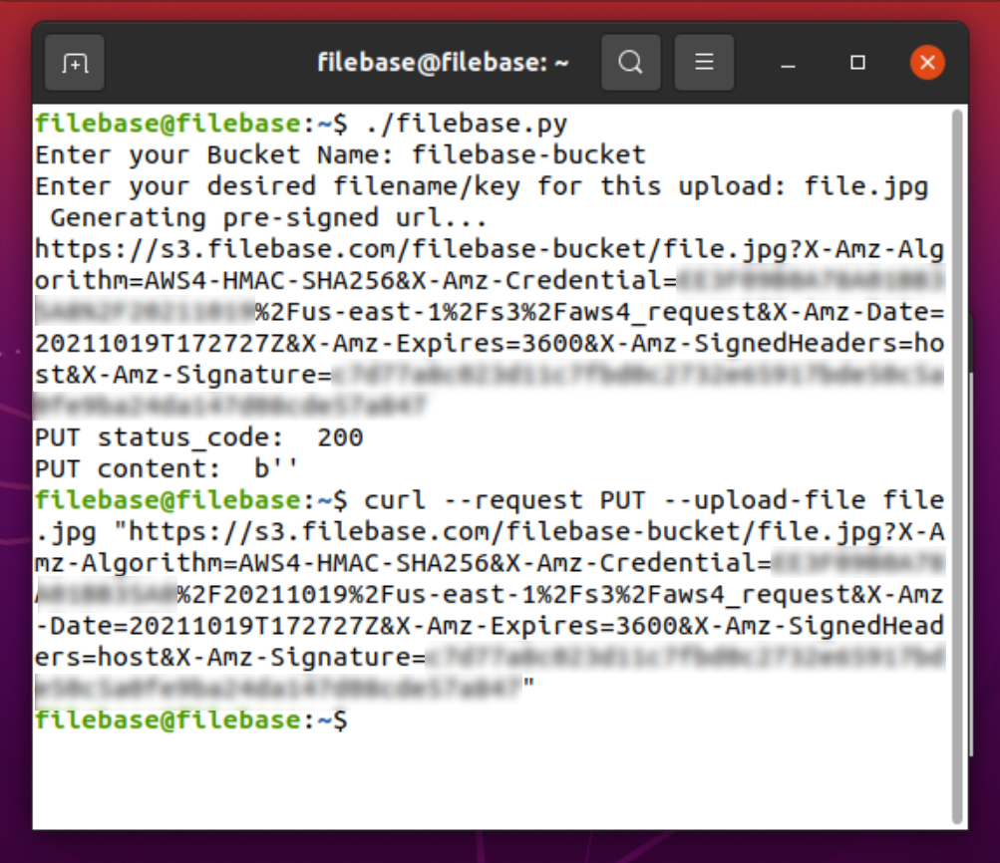
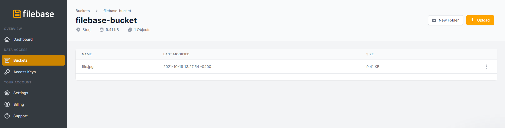

# 预签名 URL
	了解如何使用 Filebase 生成和使用预签名 URL。
## 预签名 URL
对于对象存储，URL 用于识别和访问特定对象。要对私有存储桶中的对象执行操作，必须计算并随请求提交身份验证签名，这需要拥有访问密钥和秘密访问密钥。但是，有时无法访问密钥。对于这些场景，还可以生成一个预签名 URL，它使您可以访问对对象执行操作，但无需拥有访问密钥。

例如，您可以生成预签名 URL 以从私有存储桶下载对象并与其他人共享该 URL。这将授予个人下载访问权限而无需与他们共享您的访问凭据。

用户和客户还可以使用预签名 URL 将特定对象上传到私有存储桶。

还应注意，预签名 URL 仅在指定的时间和日期之前有效。所有操作，如上传和下载对象，必须在到期时间和日期之前完成。预签名 URL 可以多次使用，只要它在到期时间和日期之前。
## 先决条件：
- [注册](https://filebase.com/signup)一个免费的 Filebase 帐户。
- 拥有您的文件库访问权限和密钥。[这里](https://docs.filebase.com/getting-started/getting-started-guide#working-with-access-keys)了解如何查看您的访问密钥。
- 创建文件库存储桶。[这里](https://docs.filebase.com/getting-started/getting-started-guide#creating-and-working-with-buckets)了解如何创建和管理存储桶。
- 对象键（文件名）
- 到期时间

## 使用 AWS CLI 生成预签名的 S3 URL
如果您之前没有使用过 AWS CLI，请参阅[这里](https://docs.filebase.com/third-party-tools-and-clients/cli-tools/aws-cli)了解我们关于配置和开始使用 AWS CLI 的指南。

要使用 AWS CLI 创建预签名 URL：

	aws s3 --endpoint https://s3.filebase.com presign s3://filebase-bucket-name/file.name
此命令应返回预签名 URL。默认情况下，到期时间为一小时。您可以通过添加标志 `--expires-in` 后跟分钟数来指定不同的到期时间。
## 使用 Python 和 Boto3 生成预​​签名的 S3 URL
此生成预签名 URL 的示例使用 Python。您还可以生成用于 Java、JavaScript、Ruby 和 .NET 框架的预签名 URL。

	其他 Python 和 Boto3 先决条件：
您需要为 Python 安装 [AWK SDK boto3](https://aws.amazon.com/sdk-for-python/)

1. 编辑下面的代码以包含您的 Filebase 访问密钥和密钥，然后将代码保存为 .py 文件。

		import boto3
		import requests
		import json
		
		from botocore.config import Config
		
		s3 = boto3.client('s3')
		
		boto_config = Config(
							region_name = 'us-east-1',
							signature_version = 's3v4')
		
		s3 = boto3.client(
							's3',
							endpoint_url = 'https://s3.filebase.com',
							aws_access_key_id='FilebaseAccess-Key',
							aws_secret_access_key='Filebase-Secret-Key',
							config=boto_config)
		
		bucket = input("Enter your Bucket Name: ")
		key= input("Enter your desired object for this upload: ")
		
		print (" Generating pre-signed url...")
		
		response = s3.generate_presigned_url('put_object', Params={'Bucket':bucket,'Key':key}, ExpiresIn=3600, HttpMethod='PUT')
		
		print (response)
		
		if response is None:
				exit(1)
		
		response = requests.put(response)
		
		print('PUT status_code: ', response.status_code)
		print('PUT content: ', response.content)

	此示例使用 3600 秒的过期时间。
2. 在终端窗口中，导航到保存 .py 文件夹的目录。执行 python 脚本。
3. 输入您的存储桶名称和要上传的对象名称。
4. 终端将返回一个预签名的 URL，如下所示。将此 URL 复制到剪贴板。

	
5. 在终端中，使用以下 curl 命令使用预签名 URL 将任何文件上传到 Filebase：

		curl --request PUT --upload-file "http://your-pre-signed-url"
		
	
6. 通过检查存储桶的 Filebase Web 控制台确认文件已上传

	