# IPFS pin 同步
	了解如何使用 IPFS Pin Sync 工具将 CID 从另一个固定服务同步到 Filebase。
## 什么是 IPFS pin 同步？
IPFS Pin Sync 是一种客户端工具，允许用户将 CID 从一个 IPFS pinning 服务同步到另一个。IPFS Pin Sync 可用作 HTTP 网页，或通过在 IPFS 上发布，允许它从任何 IPFS 节点运行。

默认情况下，IPFS Pin Sync 配置为将 CID 从 Pinata 同步到 Filebase。

阅读下文以了解如何使用 IPFS Pin 同步工具将 CID 从另一个固定服务同步到 Filebase。

- 先决条件：
	- 注册一个免费的 Filebase 帐户。
	- 拥有您的文件库访问权限和密钥。了解如何查看您的访问密钥。
	- 创建一个文件库 IPFS 桶。了解如何创建存储桶。

### 步骤
1. 导航到 [IPFS Pin Sync](https://filebase.github.io/ipfs-pin-sync/)，如果您希望在 IPFS 节点上运行它 ,从 [Github](https://github.com/filebase/ipfs-pin-sync)下载包。

	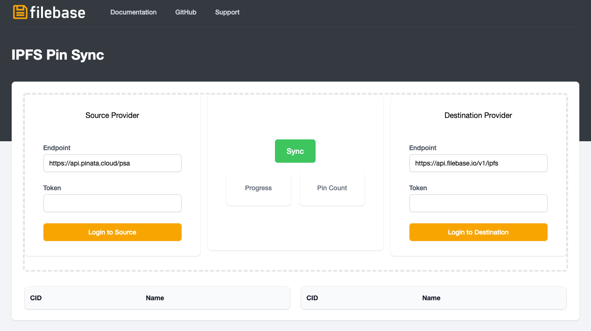
2. 首先，检索您的 Pinata API Token。导航到 [Pinata 仪表盘](https://app.pinata.cloud/pinmanager)。

	对于本例中的源提供者，我们使用 Pinata。源提供者可以是任何提供 API 的 IPFS 固定服务。
	
	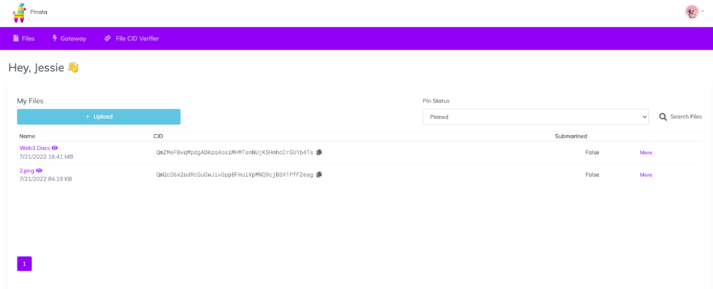
3. 选择右上角的用户配置文件图标，然后选择“API 密钥”

	
4. 选择“新密钥”：

	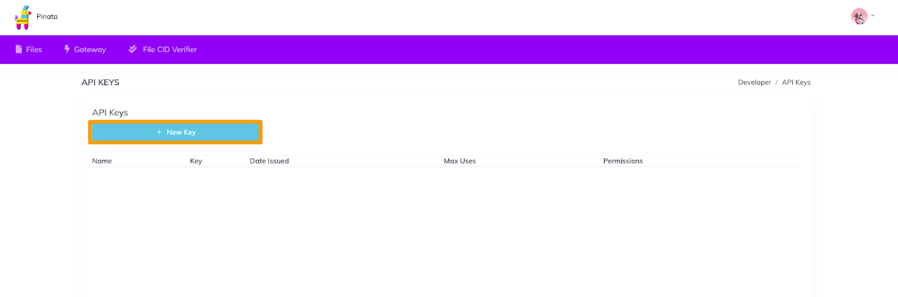
5. 创建一个具有管理员权限的新 API 密钥，然后选择“创建密钥”：

	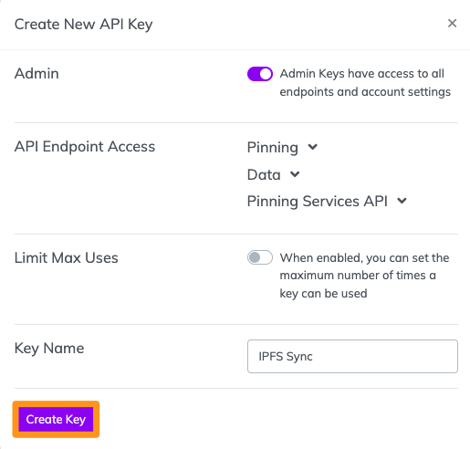
6. 复制显示的 API 密钥信息 - 它只会显示一次。

	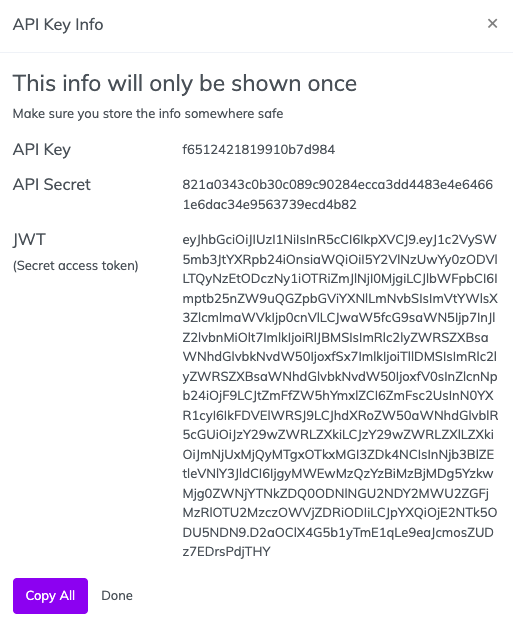
7. 返回 IPFS Pin 同步工具并将 JWT 秘密访问令牌粘贴到“源提供者”的令牌字段中，然后选择“登录到源”。

	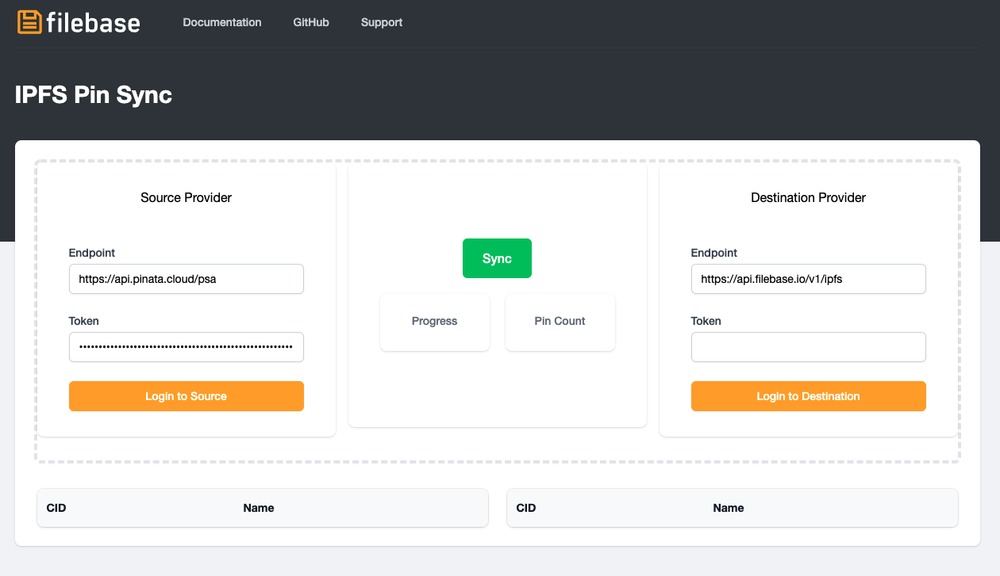
8. 现在将列出来自 Pinata 的所有 IPFS 固定 CID。

	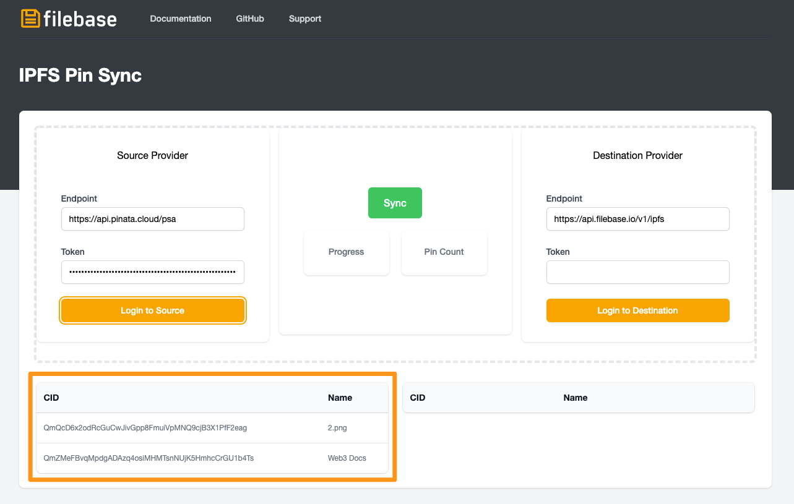
9. 接下来，我们需要为 Filebase IPFS Pinning API 生成一个 Token。
10. 导航到 Filebase 访问密钥页面，然后查看 IPFS PInning 服务 API 端点。
	
	 单击“选择存储桶以生成令牌”的下拉菜单，然后选择您要使用的 IPFS 文件库存储桶。
	
	
11. 然后复制生成的Secret Access Token：

	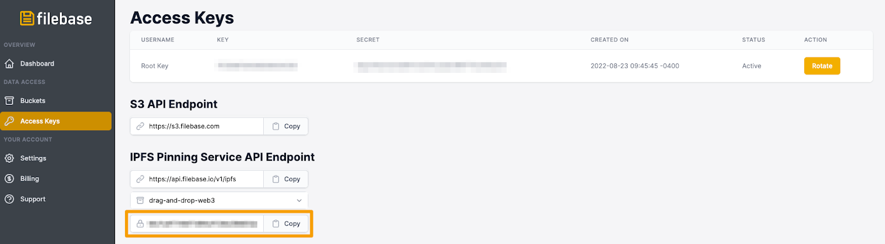
12. 在“目标提供商”的“Token”字段中输入此令牌，然后选择“登录到目标”。

	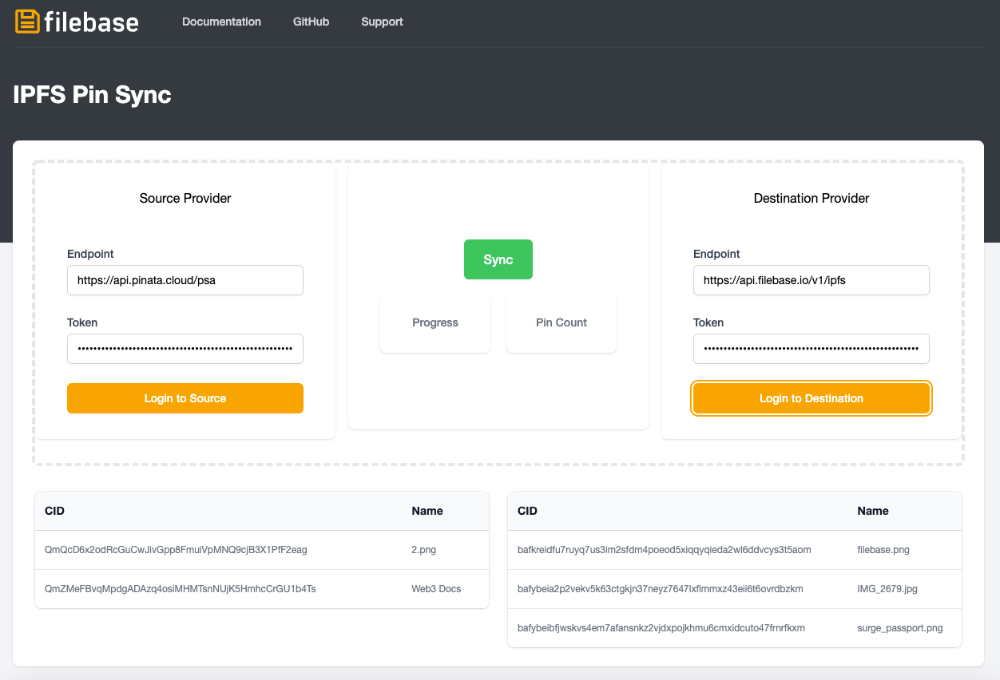
13. 将列出您的 Filebase 存储桶中所有固定的 IPFS CID

	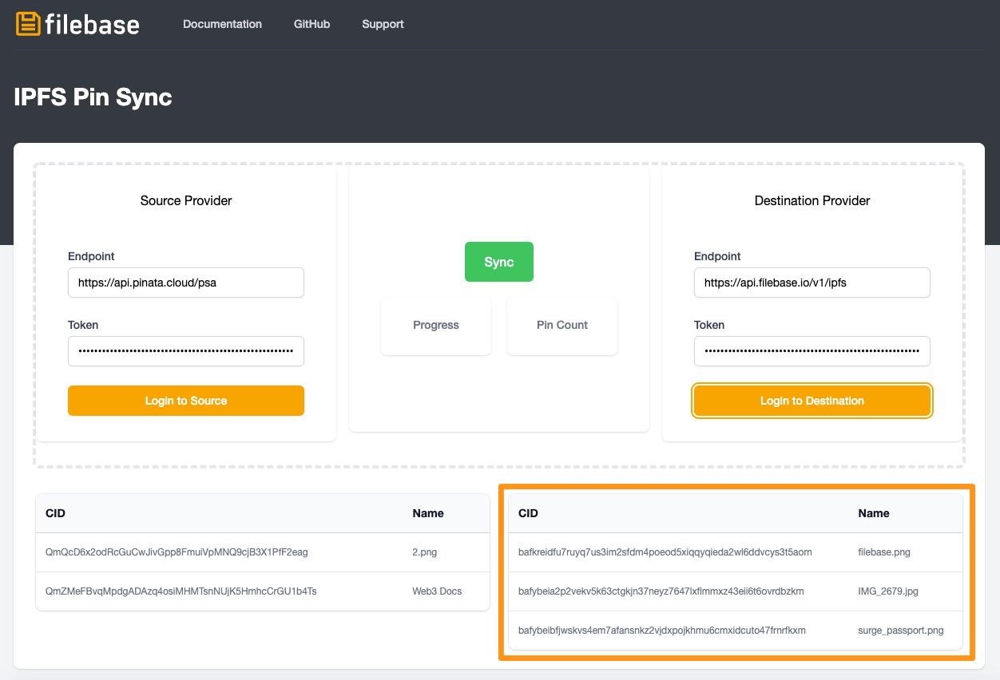
14. 然后选择“同步”将 IPFS CID 从源 (Pinata) 同步到目标 (Filebase)。

	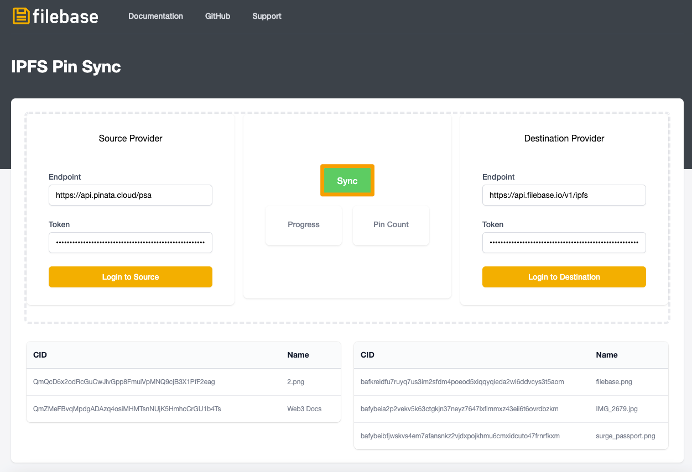
15. 进度和针数将显示您的同步状态。

	完成后，来自源的 CID 将与来自目标的 CID 一起列出。

	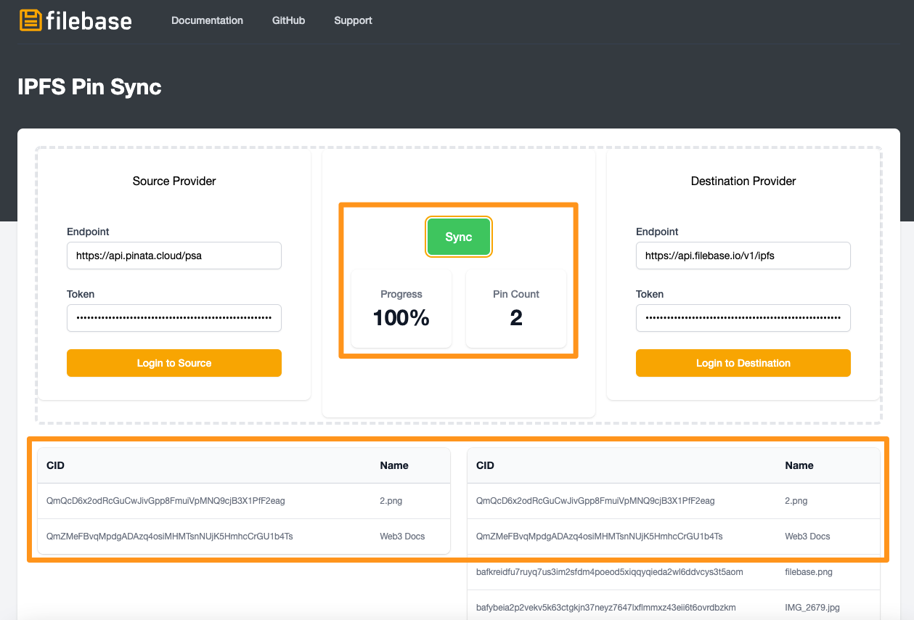
16. 在 Filebase 网络仪表板中，这些新图钉将列在您的存储桶中，状态为“固定”。

	一旦此状态更改为“已固定”，同步就已完成，并且可以从源提供程序中删除已固定的 CID
	
	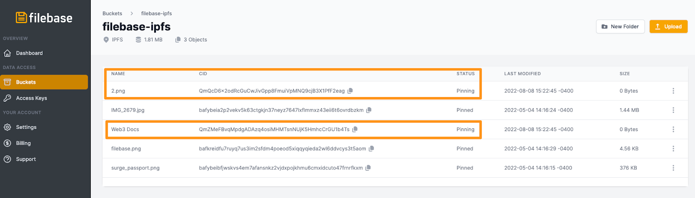