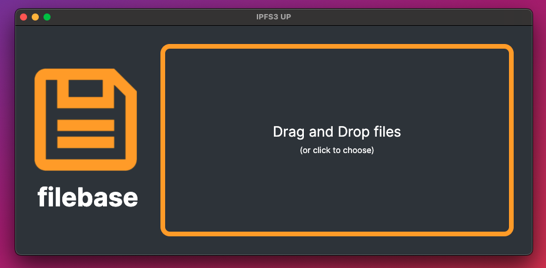
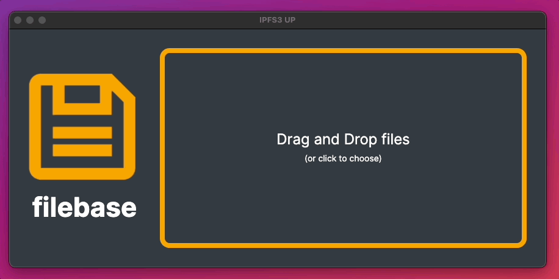
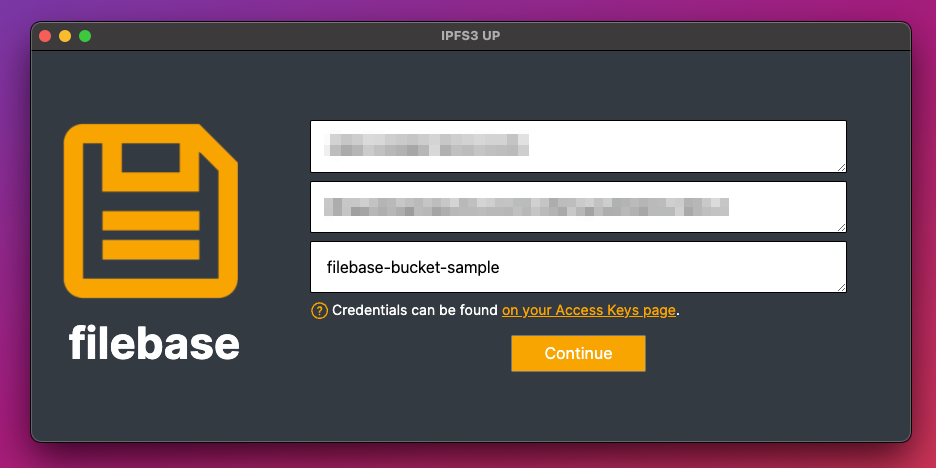
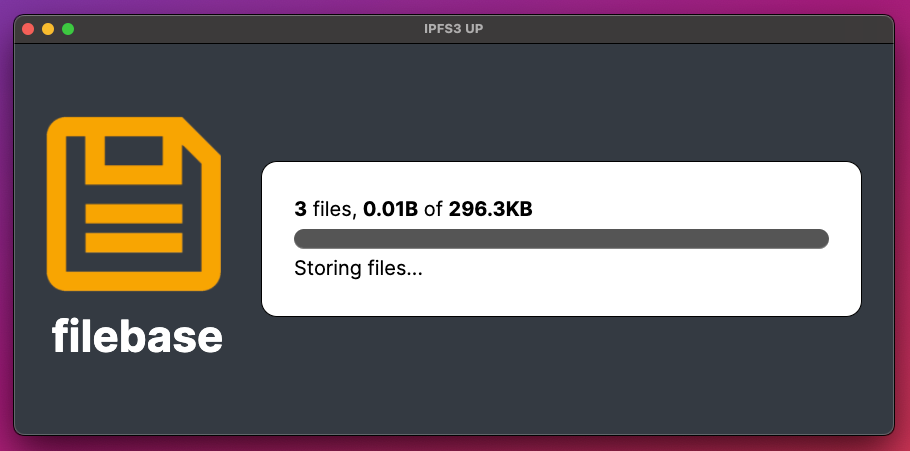
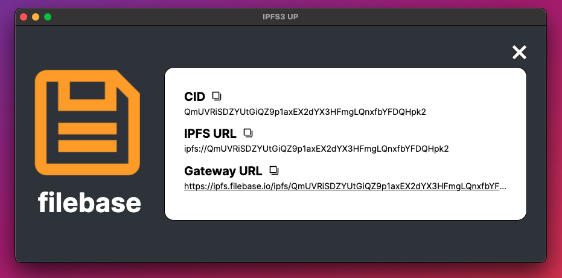

# IPFS3up
	了解如何配置 IPFS3up 以与 Filebase 一起使用。
## IPFS3up 是什么？
IPFS3up 是一款应用程序，可让您通过简单的拖放客户端界面轻松地将文件和文件夹上传到 Filebase。IPFS3up 具有上传进度、文件和大小指示器，将在失败时自动重试上传，并允许在上传后轻松复制和粘贴文件的 CID。IPFS3up 适用于 macOS、Linux 和 Windows 操作系统。

阅读下文以了解如何将 IPFS3up 与 Filebase 一起使用。

- 先决条件：
	- 注册一个免费的 Filebase 帐户。
	- 拥有您的文件库访问权限和密钥。了解如何查看您的访问密钥。
	- 创建一个文件库 IPFS 桶。了解如何创建存储桶。

步骤

1. 首先克隆 IPFS3up 工具的 GitHub 存储库：

		git clone https://github.com/filebase/ipfs3up
2. 在新下载的目录中导航：

		cd ipfs3up
3. 使用命令安装应用程序的依赖项：

		npm install
4. 使用以下命令启动应用程序：

		npm start
5. IPFS3up 应用程序将打开，如下所示：

	
6. 从这里，您可以将文件拖放到应用程序中，或者单击窗口并从计算机的文件资源管理器中选择文件。

	
7. 然后，输入您的文件库访问密钥、密钥和文件库存储桶名称。然后选择“继续”。

	
8. 将显示您的文件上传状态：

	
9. 完成后，您将获得文件夹的 CID，其中包含您拖到客户端中要上传的文件。

	
10. 您的文件将作为 IPFS 文件夹显示在 Filebase Web 控制台仪表板中：