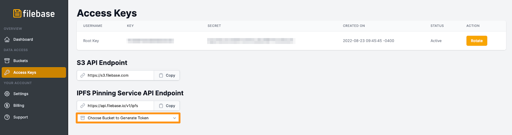
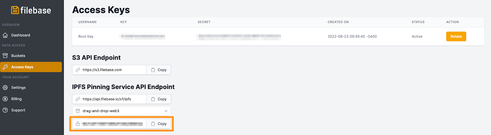

# IPFS命令行
	了解如何配置 IPFS CLI 以与 Filebase 一起使用。
## 什么是 IPFS CLI？
IPFS CLI 是一个命令行工具，可用于与 IPFS 交互。它可以配置为通过命令使用不同的 IPFS 固定服务，例如 Filebase 

	ipfs pin remote。
阅读下文以了解如何将 IPFS CLI 与 Filebase 一起使用。

- 先决条件：
	- 下载安装 [IPFS CLI](https://docs.ipfs.tech/install/command-line/)。
	- 注册一个免费的 Filebase 帐户。
	- 拥有您的 Filebase 访问权限和密钥。了解如何查看您的访问密钥。
	- 创建一个 Filebase IPFS 桶。了解如何创建存储桶。

### 将Filebase配置为固定服务
1. 要将 Filebase 添加为固定服务，请使用以下命令：

		ipfs pin remote service add filebase https://api.filebase.io/v1/ipfs access-token
2. 将访问 Token 替换为您的 Filebase IPFS 固定服务 Token。[通过密钥页面](https://console.filebase.com/keys)，然后查看 IPFS PInning 服务 API 端点来生成访问 Token 。单击“选择存储桶以生成令牌”的下拉菜单，然后选择您要使用的 IPFS Filebase 存储桶。

	
3. 然后复制生成的Secret Access Token：

	

### 将 CID 固定到您的 Filebase 桶中：
	ipfs pin remote add --service=filebase --name=test.png QmSp5z5RAgDhS38w7TmLMfyDXvY9i2hF6sJ4qm62SK5939
### 列出 Filebase 存储桶中的所有固定文件：
	ipfs pin remote ls --service=filebase
### 列出所有排队、正在固定或失败的引脚：
	ipfs pin remote ls --service=filebase --status=queued,pinning,failed
