# IPFS 固定
	了解有关 IPFS 固定以及如何将数据固定到 IPFS 的更多信息
## 什么是 IPFS 固定？
IPFS pinning 是指在一个或多个 IPFS 节点上指定要保留和持久化的数据的过程。固定确保数据可以无限期访问，并且不会在 IPFS 垃圾收集过程中被删除。
### 了解垃圾收集过程
当文件和数据存储在 IPFS 网络上时，网络上的节点会缓存它们下载的文件，并使这些文件可供网络上的其他节点使用。由于这些节点上的存储是有限的，因此必须定期清除每个节点的缓存，以便为要缓存的新文件腾出空间并使其可用。为 IPFS 节点清除缓存的过程称为 IPFS 垃圾收集过程。

垃圾收集是一个自动过程，用于管理资源，例如 IPFS 节点磁盘空间。该过程旨在删除它认为不再需要的缓存数据，但如果您的 IPFS CID 引用对您的工作流程或环境至关重要的文件，则删除此文件可能是有害的。那么如何防止您的文件在此过程中被删除呢？
### IPFS 固定
为了保护数据免受垃圾收集过程的影响，必须将数据固定在 IPFS 网络上。这可确保数据无限期保留并始终可访问。固定对于各种工作流程都很有用，例如在不管理共享权限的情况下访问来自世界各地的数据文件。默认情况下，上传到 IPFS 的所有数据都是公开的，因为访问它所需的只是文件的 CID。没有与 IPFS CID 相关的权限、用户帐户或其他安全设置。

现在使用 IPFS pinning 的最流行的工作流程之一是 NFT 集合。这些馆藏涉及多种文件，包括 NFT 图像文件及其相关元数据文件。如果这些文件没有固定在 IPFS 上，并且它们被 IPFS 垃圾收集过程删除，这可能会导致 “NFT Rug Pull”，这意味着 NFT 不复存在，并且不再可访问或转移。
### 固定服务
IPFS pinning 可以在本地托管的 IPFS 节点上配置，但对于外部的长期存储，这就是 Filebase 等 pinning 服务的用武之地。
## 如何使用 Filebase 在 IPFS 上固定新数据
默认情况下，上传到 Filebase 上的 IPFS 存储桶的文件会自动固定到 IPFS 并通过 `3 倍复制` 存储在 Filebase 基础设施中，您无需支付额外费用。这意味着您的数据在发生灾难或中断时可访问且可靠，并且不会受到 IPFS 垃圾收集过程的影响。 
### 通过 Filebase Web 仪表板将文件上传到 IPFS
1. 首先单击菜单中的 “Buckets” 选项以打开 Buckets 仪表板。
2. 选择您的 IPFS 存储桶。  
3. 单击存储桶名称后，您将看到任何以前上传的文件。要上传另一个文件，请选择“上传”，然后从选项中选择“文件”。
4. 选择要上传到IPFS的文件。
5. 上传后，您将能够从“CID”类别中查看和复制 IPFS CID，如下所示。

	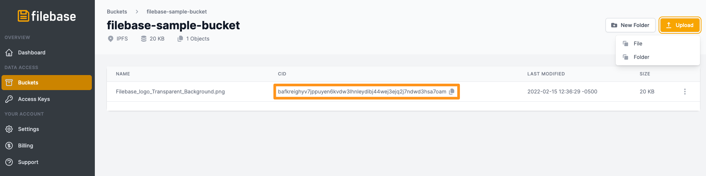
### 通过 Filebase Web 控制台将文件夹上传到 IPFS
1. 首先单击菜单中的“Buckets”选项以打开 Buckets 仪表板。
2. 选择您的 IPFS 存储桶。  
3. 单击存储桶名称后，您将看到任何以前上传的文件。要上传另一个文件，请选择“上传”，然后从选项中选择“文件夹”。
4. 选择您要上传到 IPFS 的文件夹。
5. 上传后，文件夹看起来类似于 IPFS 单个文件。

	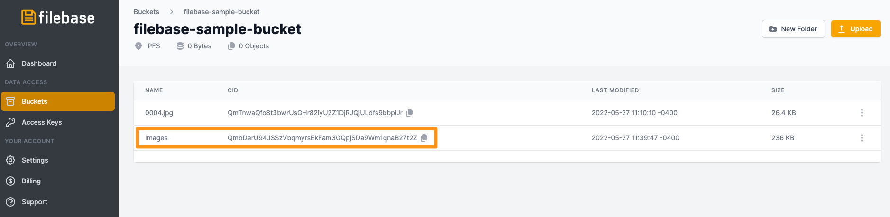
6. 复制文件夹的 IPFS CID，然后导航至 `https://ipfs.filebase.io/ipfs/[CID]`. 您的文件夹的内容将被列出。

	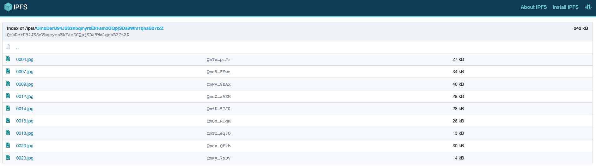

## 使用 IPFS 桌面将文件夹上传到 IPFS，然后使用 Filebase 将其固定
1. 首先下载安装 IPFS 桌面客户端，或导航到 IPFS webUI。
2. 从左侧栏菜单中选择“文件”。

	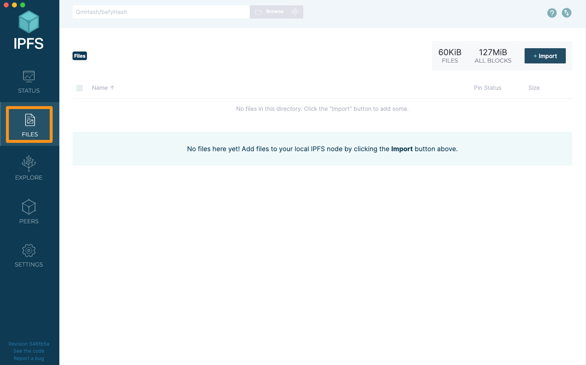
3. 选择“导入”
4. 从选项列表中选择“文件夹”。

	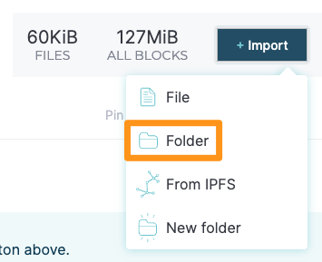
5. 选择您要上传的文件夹。将其导入 IPFS 桌面后，选择屏幕右侧的三个点。

	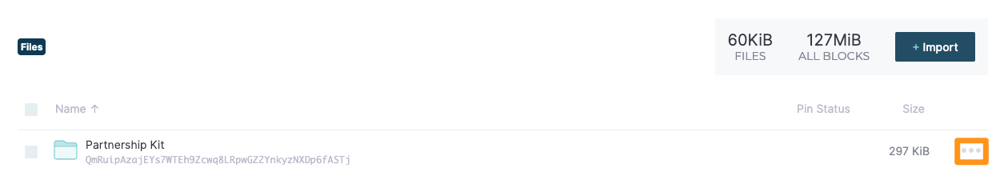
6. 从选项列表中，选择“复制 CID”。

	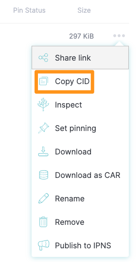
7. 接下来，导航到。单击菜单中的“存储桶”选项以打开存储桶仪表板。
8. 进入 Buckets 仪表板后，通过单击右上角的“Create Bucket”选项创建一个新的 IPFS bucket。

	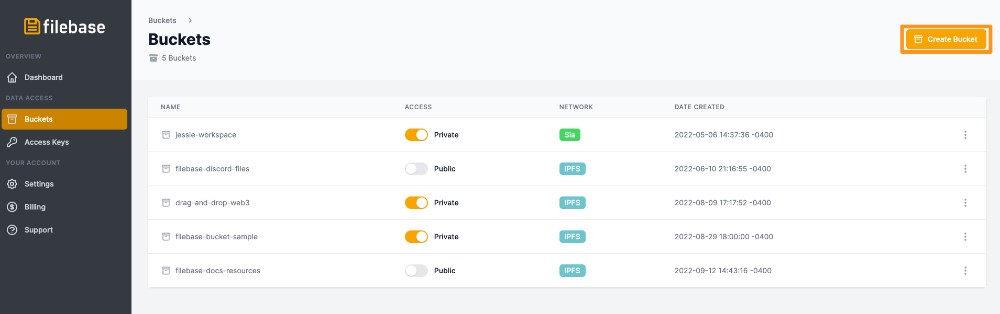
9. 输入存储桶名称并选择 IPFS 网络。
	
		存储桶名称在所有 Filebase 用户中必须是唯一的，长度在 3 到 63 个字符之间，并且只能包含小写字符、数字和破折号。
10. 然后选择新的 IPFS Bucket。  
11. 点击桶名后，从右上角选择“上传”，然后选择“CID”。

		Pin by CID 是一项付费功能，需要付费的 Filebase IPFS 订阅计划。
	
12. 然后输入您从 IPFS 桌面复制的 IPFS CID 和一个自定义的人类可读名称以与您的 CID 关联。

	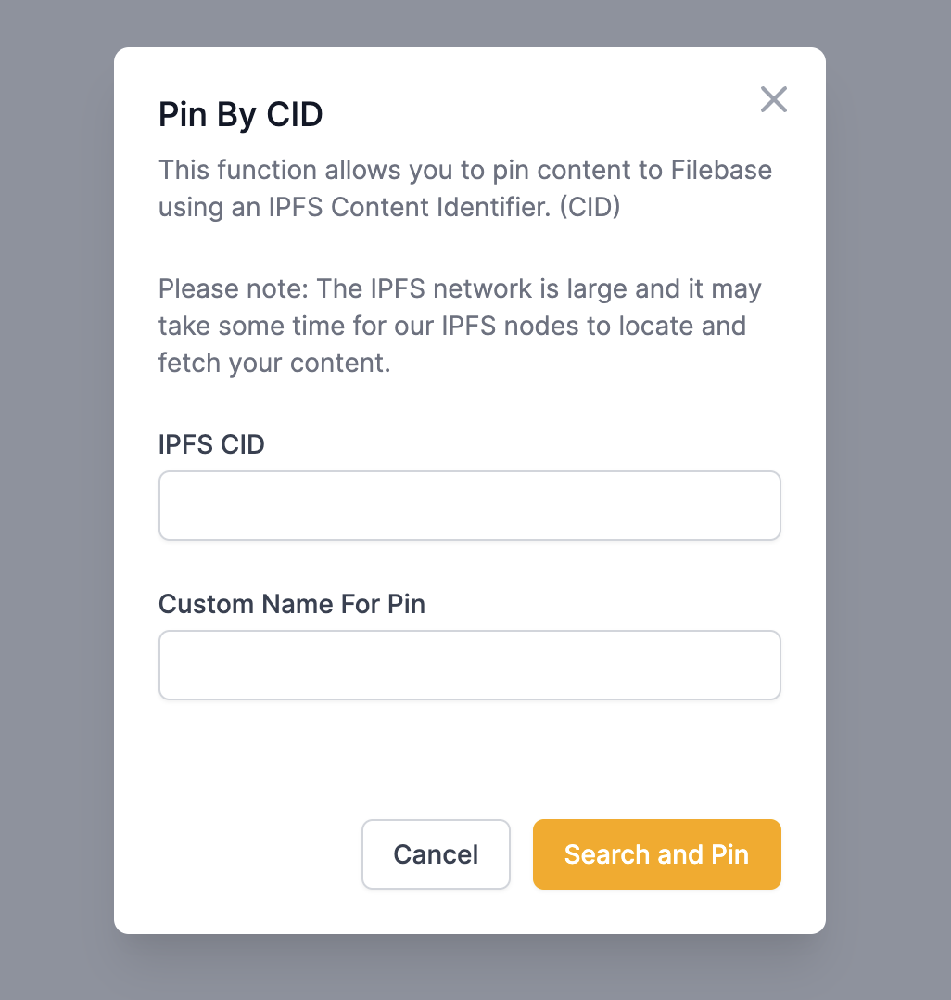
13. 选择“搜索并固定”以通过 Filebase 将您的 CID 固定到 IPFS。
	
		注意：IPFS 网络很大，Filebase 的 IPFS 节点定位和获取 CID 可能需要一些时间。

## 使用 S3 兼容 API 将文件上传到 IPFS
如果您使用的是 S3 兼容 API，则 CID 将在 PutObject 调用的响应中返回。

例如，如果我们运行以下 AWS CLI 命令：

	aws --endpoint https://s3.filebase.com s3 cp test-images/7FIMFhlMf6A.jpg s3://ipfs-test --debug
有关 AWS CLI 的更多信息，请参阅[这里](https://docs.filebase.com/third-party-tools-and-clients/cli-tools/aws-cli)。

响应如下所示。为了方便起见，我们突出显示了相应的响应标头：

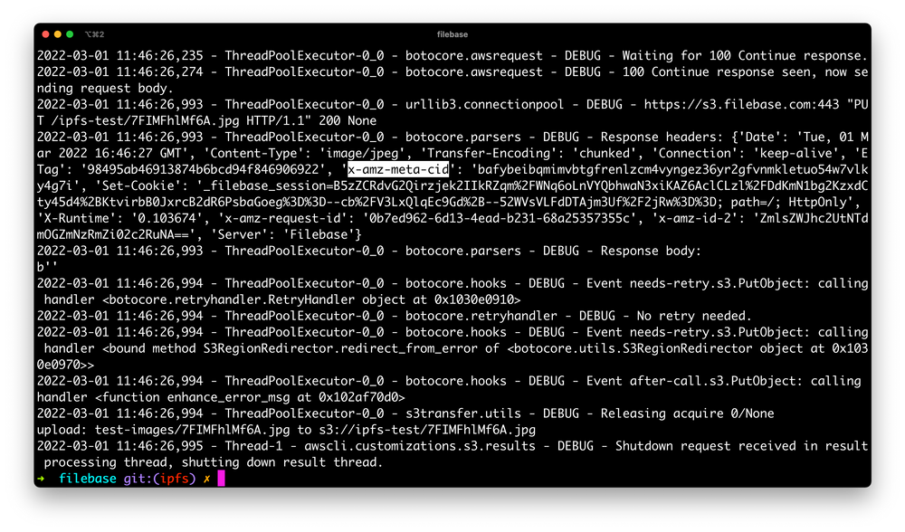
您也可以随时调用 HeadObject API 来获取 CID：

	aws --endpoint https://s3.filebase.com s3api head-object --bucket ipfs-test --key 7FIMFhlMf6A.jpg

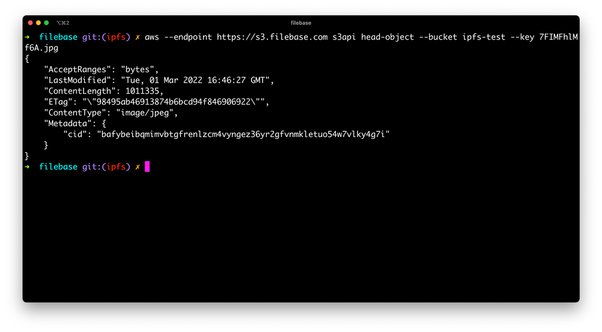

## 使用 S3 兼容 API 将文件夹上传到 IPFS
CAR 文件是一种包含多个文件的压缩存档文件，类似于 ZIP 文件。CAR 文件由 FileCoin 和 IPFS 网络使用，它们利用元数据字段将每个文件的 IPFS CID 包含在存档中。

Filebase 支持使用 S3 兼容 API 通过 PutObject 或 MultipartUpload 方法将 CAR 文件上传到 IPFS。

有关如何创建 CAR 文件的说明，请在此处查看我们的指南：

- [IPFS-CAR](https://docs.filebase.com/third-party-tools-and-clients/cli-tools/ipfs-car)

上传 CAR 文件时，您可以随请求一起传递  `x-amz-meta-import: car`   S3 元数据标头。Filebase 然后将文件作为 CAR 导入，并返回生成的 CID。

1. 下面是一个使用 AWS CLI 的示例，它会自动添加  `x-amz-meta` 前缀：

		aws --endpoint https://s3.filebase.com s3 cp pictures.car s3://ipfs-test --debug --metadata 'import=car'
2. 使用指定的 `–debug` 标志，显示响应标头，其中显示 CID：

		2022-06-14 19:51:41,400 - ThreadPoolExecutor-0_2 - botocore.parsers - DEBUG - Response headers: 
		{
		    'Date': 'Tue, 14 Jun 2022 23:51:41 GMT', 
		    'Content-Type': 'application/xml', 
		    'Transfer-Encoding': 'chunked', 
		    'Connection': 'keep-alive', 
		    'x-amz-meta-cid': 'bafybeieurpeyzighqrvwjqyj3szuvbqvrbijm7cdair5a422ipf2d5qnlq', 
		    'ETag': 'W/"d8cad258a3d9bbe03a26a13a3ec43b21"',
		    'x-amz-request-id': '144e0415-8162-45cd-b071-e51dada956ae', 
		    'x-amz-id-2': 'ZmlsZWJhc2UtNmQ3ZjQ5OGZmZC14ejk1Mg==',
		    'Server': 'Filebase'
		}

## 如何使用 Filebase 重新固定现有 IPFS CID
### 从 Filebase Web 控制台重新固定现有 IPFS CID
	Pin by CID 是一项付费功能，需要付费的 Filebase IPFS 订阅计划。
1. 首先单击菜单中的“Buckets”选项以打开 Buckets 仪表板。
2. 进入 Buckets 仪表板后，通过单击右上角的“Create Bucket”选项创建一个新的 IPFS bucket。
3. 输入存储桶名称并选择 IPFS 网络。
存储桶名称在所有 Filebase 用户中必须是唯一的，长度在 3 到 63 个字符之间，并且只能包含小写字符、数字和破折号。
4. 然后选择新的 IPFS Bucket。  
5. 单击存储桶名称后，从右上角选择“上传”，然后选择“CID”。

	
6. 然后输入您的 IPFS CID 和一个自定义的人类可读名称以与您的 CID 关联。

	
7. 选择“搜索并固定”以通过 Filebase 将您的 CID 固定到 IPFS。

		注意：IPFS 网络很大，Filebase 的 IPFS 节点定位和获取 CID 可能需要一些时间。

### 在 IPFS 桌面 GUI 或 IPFS Web UI 中将 Filebase 设置为固定服务并导入现有 CID
1. 首先下载 IPFS  桌面 GUI 客户端 ，或导航到 IPFS Web UI。
2. 从左侧栏菜单中，选择“设置”。

	
3. 选择“固定服务”下的“添加服务”。

	
4. 当提示选择固定服务提供商时，选择“Filebase”。

	
5. 输入以下配置信息以将 Filebase 添加为您的固定服务提供商：

	

	- Secret Access Token：导航到访问密钥页面，然后查看 IPFS 固定服务 API 端点。单击“选择存储桶以生成令牌”的下拉菜单，然后选择您要使用的 IPFS Filebase存储桶。

		
		
		然后复制生成的Secret Access Token：
		
		
6. 选择“保存”。您的Filebase固定服务配置现在将列在“固定服务”下。

	
7. 接下来，从左侧栏菜单中选择“文件”，然后选择“导入”。

	
8. 选择“来自 IPFS”。

	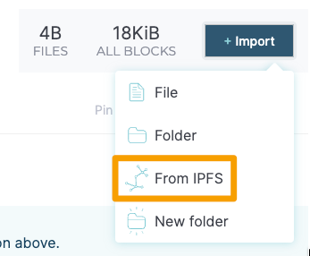
9. 输入您的 IPFS CID，附加 `/ipfs/` 并提供与您的 CID 关联的名称，然后选择“导入”。此 CID 可以用于单个文件或文件夹。

	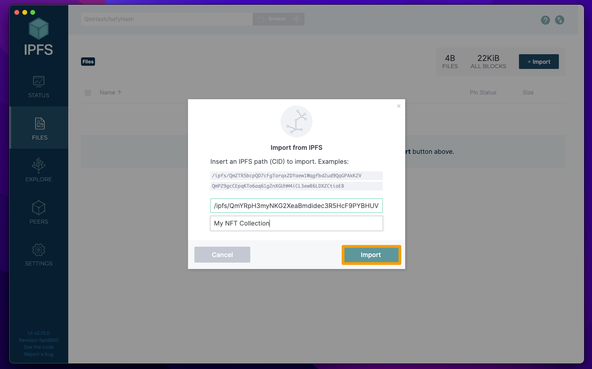
10. 导入后，您的 IPFS 资产将被列出。从右侧菜单中选择 3 个点以显示与您的 IPFS 资产交互的选项。

	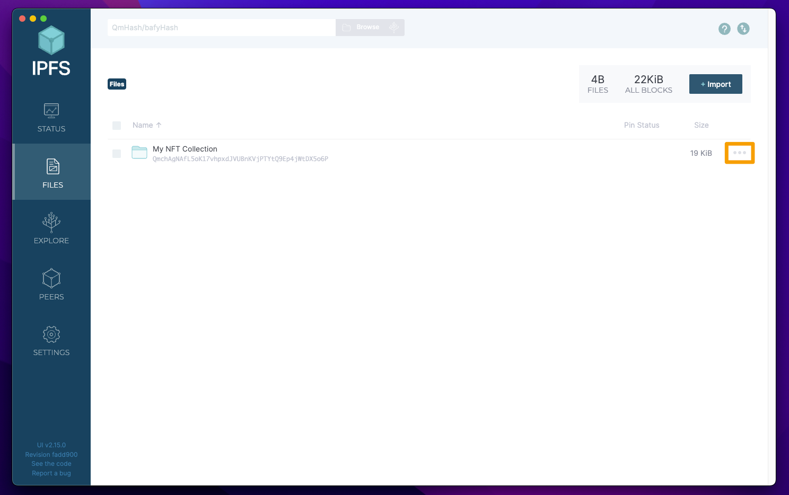
11. 选择“设置固定”。

	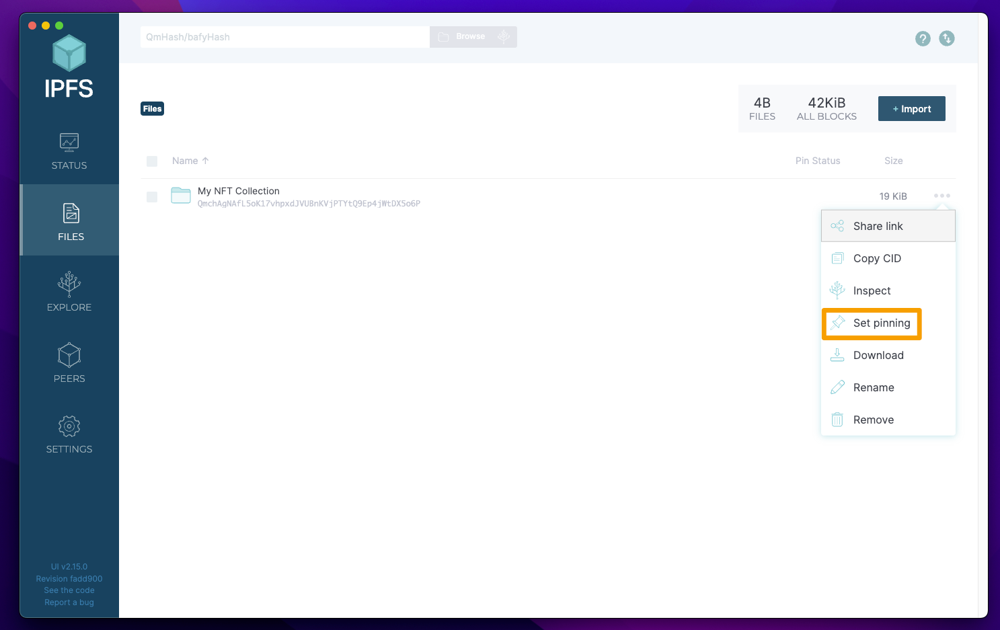
12. 选中“Filebase”旁边的复选框，然后选择“Apply”。

	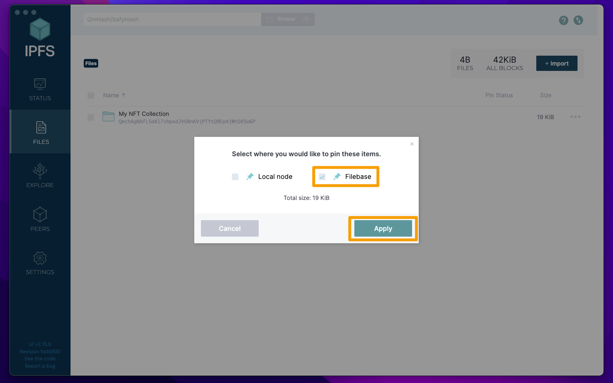
13. 此 IPFS 资产的“固定状态”现在将显示一个带有云和图钉的图标，表明它已固定到配置的固定服务。

	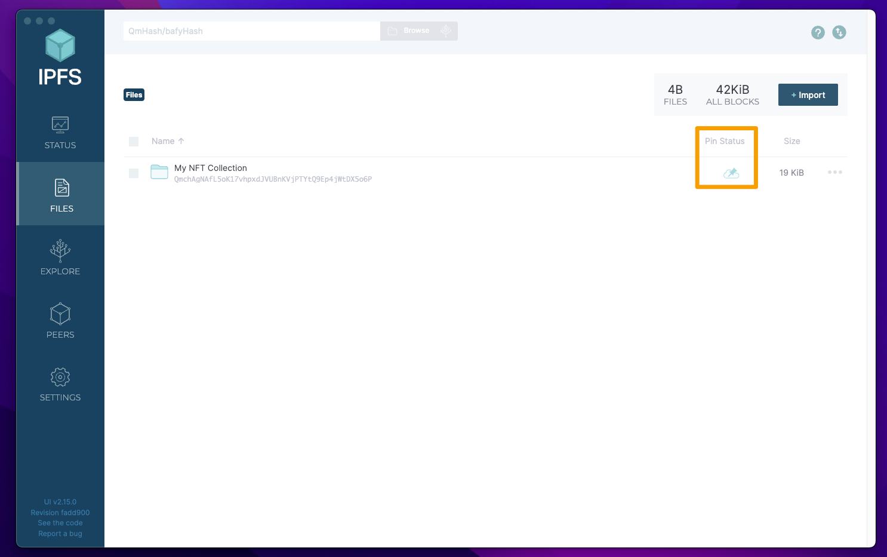
14. 导航到 Filebase 页面，然后选择您之前用于生成秘密访问令牌的存储桶，您将看到您固定的 IPFS 资产，它将显示状态“固定”，这意味着它正在被固定通过 Filebase 到 IPFS。完成后，这将显示为“已固定”。

	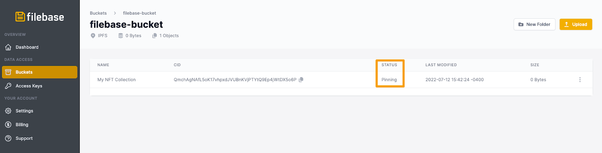
	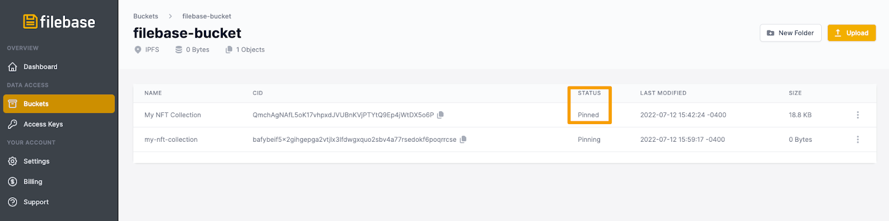

### 使用 IPFS CLI 将现有的 IPFS CIDs 与 Filebase 重新固定
1. 首先下载并安装 [go-ipfs cli](https://docs.ipfs.io/install/command-line/#official-distributions)工具。
2. 接下来，使用以下命令将 Filebase 添加为固定服务：

		ipfs pin remote service add Filebase https://api.filebase.io/v1/ipfs SECRET-ACCESS-TOKEN

	如果您打算使用多个存储桶，则需要使用每个存储桶的秘密访问 token 重复此命令。在此工作流程中，昵称应为 Filebase(Bucket-Name) 以标识不同的存储桶。

	替换以下值以匹配您的配置：

	- `SECRET-ACCESS-TOKEN`

		导航到 [访问密钥页面](https://console.filebase.com/keys)，然后查看 IPFS PInning 服务 API 端点。单击“选择存储桶以生成令牌”的下拉菜单，然后选择您要使用的 IPFS Filebase存储桶。
		
		
		
		然后复制生成的Secret Access Token：
		
		
		
3. 使用以下命令将现有 IPFS CID 固定到 Filebase：

		ipfs pin remote add --service=Filebase --name=ASSET-NAME IPFS-CID
	将 `ASSET-NAME` 替换为您希望与固定 CID 相关联的人类可读值，并将 IPFS-CID 替换为您的 IPFS 资产的 CID。这可以是文件或文件夹。
		
		ipfs pin remote add --service=Filebase --name=my-nft-collection bafybeif5x2gihgepga2vtjlx3lfdwgxquo2sbv4a77rsedokf6poqrrcse
4. 导航到 Filebase 页面，然后选择您之前用于生成秘密访问 Token 的存储桶，您将看到固定的 IPFS 资产，这将显示状态“固定”，这意味着它正在被固定通过 Filebase 到 IPFS。完成后，这将显示为“已固定”。

	
	
5. 您的终端还将返回以下输出：

		CID: bafybeif5x2gihgepga2vtjlx3lfdwgxquo2sbv4a77rsedokf6poqrrcse
		Name: my-nft-collection
		Status: pinned

### 如何使用适用于 JavaScript 的 AWS S3 开发工具包检索固定 CID
您还可以使用不同的 AWS S3 SDK 上传和检索 IPFS CID。以下示例使用 JavaScript SDK：

AWS SDK v2：

	const AWS = require('aws-sdk');
	const fs = require('fs');
	
	const s3 = new AWS.S3({
	    endpoint: 'https://s3.filebase.com',
	    region: 'us-east-1',
	    signatureVersion: 'v4',
	});
	
	fs.readFile('image.png', (err, data) => {
	    if (err) {
	        console.error(err);
	        return;
	    }
	    
	    const params = {
	        Bucket: 'my-ipfs-bucket',
	        Key: 'test/image.png',
	        ContentType: 'image/png',
	        Body: data,
	        Metadata: { import: "car" }
	    };
	    
	    const request = s3.putObject(params);
	    request.on('httpHeaders', (statusCode, headers) => {
	        console.log(`CID: ${headers['x-amz-meta-cid']}`);
	    });
	    request.send();
	});

AWS SDK v3：

	const command = new PutObjectCommand({...});
	
	command.middlewareStack.add(
	  (next) => async (args) => {
	    // Check if request is incoming as middleware works both ways
	    const response = await next(args);
	    if (!response.response.statusCode) return response;
	
	    // Get cid from headers
	    const cid = response.response.headers["x-amz-meta-cid"];
	    console.log(cid);
	    return response;
	  },
	  {
	    step: "build",
	    name: "addCidToOutput",
	  },
	);
	
	const res = await client.send(command);
