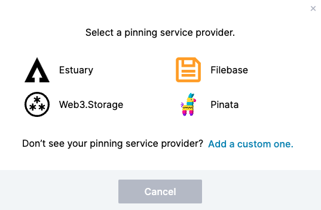
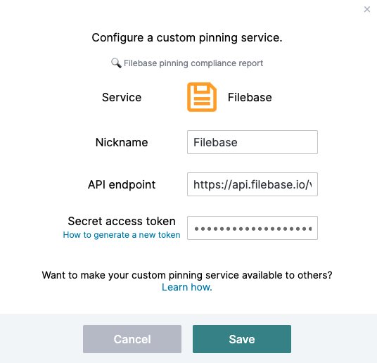
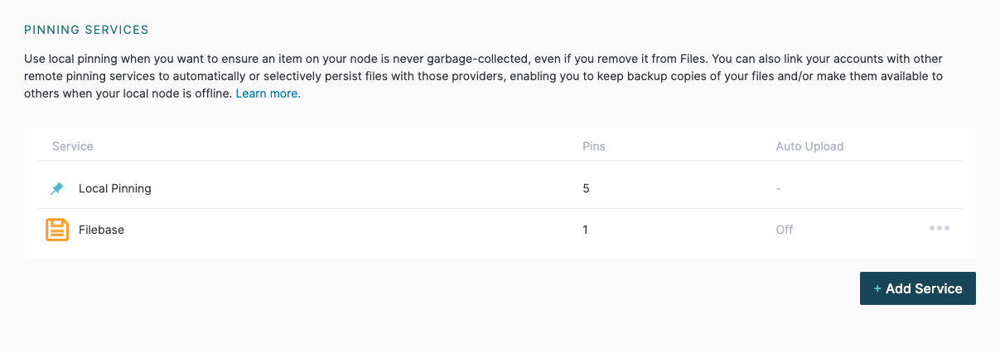

# IPFS 桌面
	了解如何配置 IPFS 桌面以与 Filebase 一起使用。
## 什么是 IPFS 桌面？
IPFS Desktop 是一个 GUI 客户端，用于运行本地 IPFS 节点并与 IPFS 网络交互。IPFS Desktop 可以配置为自动将 IPFS 文件固定到外部 IPFS 固定服务，例如 Filebase。

阅读下文以了解如何将 IPFS 桌面与 Filebase 一起使用。

- 先决条件：
	- 下载安装 [IPFS 桌面版](https://github.com/ipfs/ipfs-desktop/releases)。
	- 注册一个免费的 Filebase 帐户。
	- 创建一个文件库 IPFS 桶。了解如何创建存储桶。

步骤

1. 首先在本地计算机上打开 IPFS 桌面 GUI 客户端。
2. 从左侧边栏菜单中选择“设置”。

	
3. 选择“固定服务”下的“添加服务”。

	
4. 当提示选择固定服务提供商时，选择“Filebase”。

	
5. 输入以下配置信息以将 Filebase 添加为您的固定服务提供商：

	

	秘密访问 Token：导航到[访问密钥页面](https://console.filebase.com/keys)，然后查看 IPFS PInning 服务 API 端点。单击“选择存储桶以生成令牌”的下拉菜单，然后选择您要使用的 IPFS 文件库存储桶。
	
	
	然后复制生成的Secret Access Token：

	
6. 选择“保存”。您的文件库固定服务配置现在将列在“固定服务”下。

	

要了解如何使用此固定服务配置固定 CID，请参阅[这里](https://docs.filebase.com/ipfs/ipfs-pinning#re-pinning-existing-ipfs-cids-with-filebase-using-the-ipfs-desktop-gui-or-ipfs-web-ui)。
