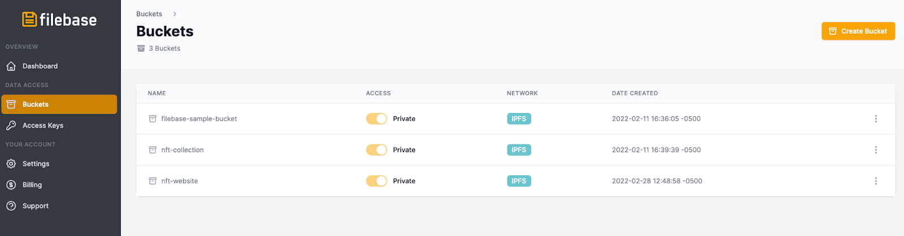
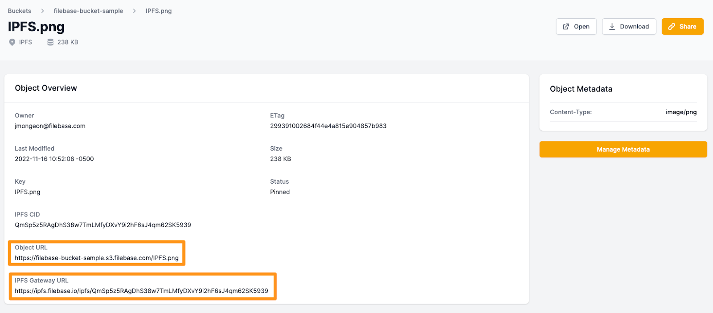

# 共享 IPFS 文件
	使用 Filebase 共享 IPFS 文件
使用 IPFS，文件共享变得非常容易，因为上传到 IPFS 的所有文件都可以通过其 CID 值公开访问。只要文件通过 Filebase 等 IPFS 固定服务固定，就可以访问它以进行长期文件共享。

1. 首先注册一个 Filebase 帐户，然后登陆 Filebase 仪表板。
2. 单击菜单中的“存储桶”选项以打开存储桶仪表板。

	
3. 选择您的 IPFS 存储桶。
4. 单击存储桶名称后，选择右上角的“上传”。您将有三个选择：
	- 文件：文件用于将单个文件上传到 IPFS。这可以是图像、视频、音频、文本或任何其他文件类型。
	- 文件夹：文件夹用于上传包含多个文件的文件夹，例如NFT收藏，或者静态网站的文件。
	- CID：CID 代表内容标识符，用于重新固定您可能从另一个固定提供商或本地 IPFS 节点获得的现有 IPFS CID。

	
4. 要上传单个文件，请选择“文件”，然后在出现提示时选择要上传到 IPFS 的文件。

	上传后，确认状态显示为“固定”。
	
	
	
	
5. 单击文件名以查看文件的详细信息。

	在此屏幕上，您将看到为您的文件列出的两个不同的 URL：它的文件库对象 URL 和它的 IPFS 网关 URL。
	
	
6. 如果文件位于公共存储桶中，则对象 URL 只能用于共享文件。否则，此 URL 将返回“拒绝访问”错误消息。

	IPFS 网关 URL 可用于使用其 IPFS CID 和文件库公共 IPFS 网关共享文件。世界上任何人都可以访问此 URL，无论存储桶是公共的还是私有的。
