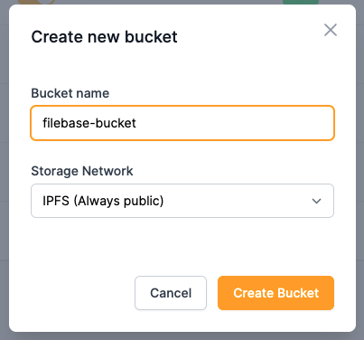
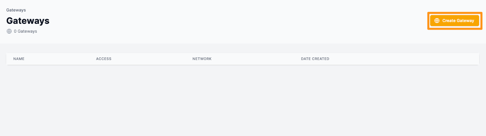
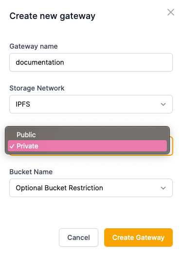

# IPFS 专用网关：优化图像
	了解 Filebase IPFS 专用网关图像优化功能。
Filebase IPFS 专用网关支持图像优化功能。本教程将介绍一些常见的图像优化工作流程，但有关支持的图像优化标签的完整列表，请在此处查看我们的文档：

- [IPFS 网关](https://docs.filebase.com/ipfs/ipfs-gateways#filebase-ipfs-image-optimization)

此示例使用 Filebase 徽标的图像文件进行演示。您可以使用您选择的任何图像文件进行操作。

1. 导航到 Filebase Web 仪表板。在 IPFS 网络上创建一个新的桶。

	
2. 选择您的存储桶，然后选择“上传”>“文件”。
3. 选择要上传的图像文件。复制返回的 CID。
4. 接下来，导航到 Filebase Web 控制台上的网关页面

		Filebase IPFS 专用网关是一项仅对付费用户可用的功能。免费套餐的用户无法使用它们。
5. 选择右上角的“创建网关”按钮。

	
6. 将打开一个新窗口，提示您提供网关名称并选择网关的访问级别。

		网关名称受与存储桶名称相同的命名限制。所有网关名称必须是小写字母，介于 3-63 个字符之间，并且必须是唯一的。
7. 选择“私人”

	
8. 接下来，使用您的 IPFS 专用网关按以下格式导航到您的映像的 IPFS CID：

		https://gateway-name.myfilebase.com/ipfs/IPFS_CID

	替换 `gateway-name` 为您的 IPFS 专用网关名称，以及 IPFS CID 您的映像的 IPFS CID。
	
	
9. 现在，让我们探索一些图像优化选项。要调整图像大小，我们可以使用选项 `img-width` 来更改图像的显示宽度：

		https://gateway-name.myfilebase.com/ipfs/IPFS_CID?img-width=300
10. 该 `img-height` 选项也可用于调整图像大小：

		https://gateway-name.myfilebase.com/ipfs/IPFS_CID?img-height=800

	当宽度改变时，高度将自动缩放以适应图像的分辨率。
11. 该 `img-fit=contain` 选项可用于根据图像的原始尺寸参数将图像调整为尽可能大。

		https://gateway-name.myfilebase.com/ipfs/IPFS_CID?img-fit=contain
12. 该 `img-quality=x` 选项可用于指定 JPEG 和 WebP 格式图像的质量。

		https://gateway-name.myfilebase.com/ipfs/IPFS_CID?img-quality=100
13. 该 `img-anim=false` 选项可用于减少动画图像的帧数，例如 GIF 文件。

		https://gateway-name.myfilebase.com/ipfs/IPFS_CID?img-anim=false
14. 该 `img-sharpen=x` 选项可用于指定锐化滤镜的强度。

	此过滤器的值是介于 0（表示不锐化）和 10（表示最大锐化）之间的浮点数。对于大多数图像，1 是推荐值。

		https://gateway-name.myfilebase.com/ipfs/IPFS_CID?img-sharpen=0.5

有关可能的图像优化选项的完整列表，请参阅此处的文档

- [IPFS 网关](https://docs.filebase.com/ipfs/ipfs-gateways#filebase-ipfs-image-optimization)