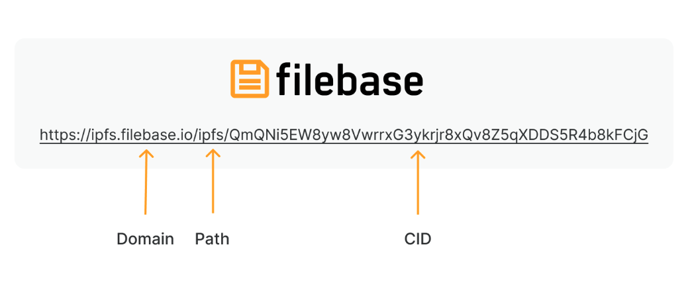
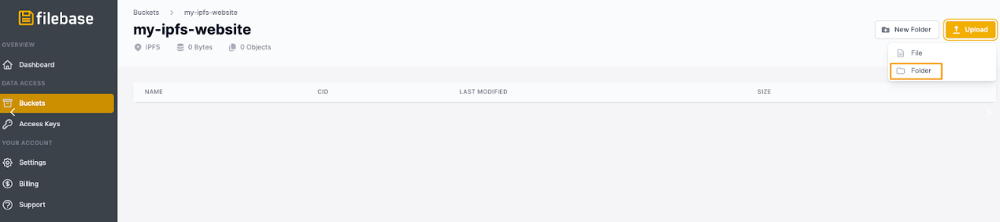
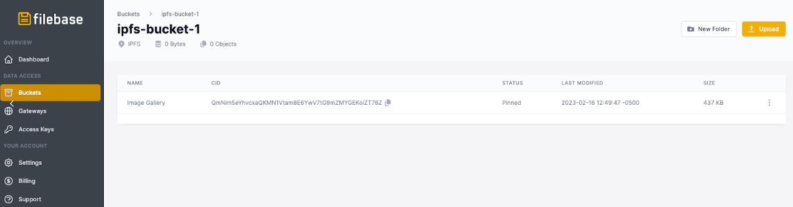
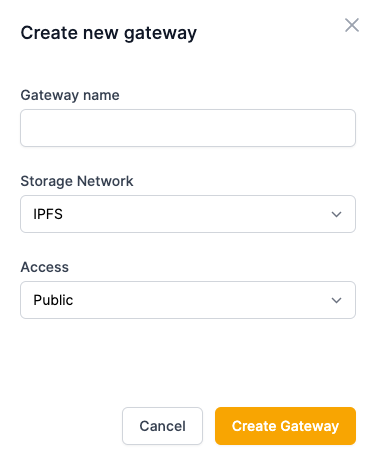
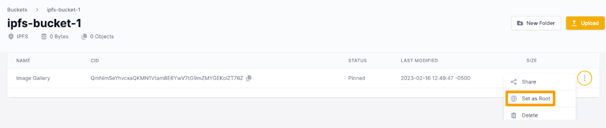
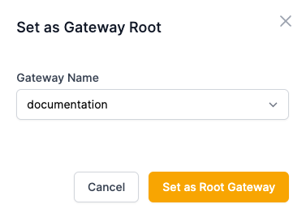
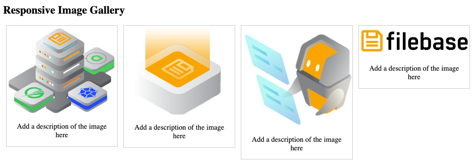

# IPFS 专用网关：托管图片库
	了解如何使用 IPFS 专用网关托管图片库。
Filebase IPFS 专用网关可以配置为在网关的根部为单个 IPFS CID 提供服务。这意味着不需要在网关 URL 中指定 IPFS CID，默认情况下 URL 将托管配置的 CID。

例如，当使用 IPFS 网关时，格式通常如下：

使用具有根 CID 的专用网关时，路径和 CID 字段不需要返回根 CID。通过 Filebase 的专用网关将使用以下域结构：

	https://gatewayname.myfilebase.com
如果设置了根 CID，则可以共享此单个 URL 以分发存储的 CID 的内容。

1. 首先创建一个名为 “Image Gallery” 的新文件夹并创建文件 index.html

	该文件是一个基本的 HTML 文件，用作您网站的主页。更改和编辑此文件以反映您网站的内容，并相应地设置样式。要了解有关 HTML 和 CSS 样式的更多信息，请参阅[这里](https://www.w3schools.com/html/html_css.asp)。

		<!DOCTYPE html>
		<html>
		<head>
		
		</head>
		<body>
		
		<h2>Responsive Image Gallery</h2>
		
		

		  

		    
		    
Add a description of the image here

		  

		

		
		

		  

		    
		    
Add a description of the image here

		  

		

		
		

		  

		    
		    
Add a description of the image here

		  

		

		
		

		  

		    
		    
Add a description of the image here

		  

		

		
		

		
		

		

		
		</body>
		</html>

2. 此示例使用 4 个图像文件，因此我们将它们保存在保存文件的同一文件夹中。`index.html`

	您希望与您的网站一起使用的任何文件，例如图像文件或脚本文件，都保存在此文件夹中。

	目前，该目录应如下所示：

	- Image Gallery
		- index.html
		- image1.jpg
		- image2.jpg
		- image3.jpgbu
		- image4.jpg
3. 然后，导航到 Filebase Web 仪表板。在 IPFS 网络上创建一个新的桶。

	
4. 选择您的存储桶，然后选择“上传”>“文件夹”。

	
5. 选择包含您的 index.html 文件和任何其他网站资产的网站文件夹，并将其上传到您的存储桶。

	
6. 接下来，导航网关页到 Filebase Web 控制台上的

	Filebase IPFS 专用网关是一项仅对付费用户可用的功能。免费套餐的用户无法使用它们。
7. 选择右上角的“创建网关”按钮。

	
8. 将打开一个新窗口，提示您提供网关名称并选择网关的访问级别。

		网关名称受与存储桶名称相同的命名限制。所有网关名称必须是小写字母，介于 3-63 个字符之间，并且必须是唯一的。

		
9. 选择“公共”，然后选择“创建网关”。
10. 接下来，单击菜单中的 “Buckets” 选项以打开 Buckets 仪表板。
11. 查看您将网站文件夹上传到的 IPFS Bucket。
12. 然后，选择文件夹的附加选项菜单。
13. 从选项列表中选择“设置为根目录”。

	
14. 然后选择您之前创建的专用网关，然后选择“设置为根网关”。

	
15. 现在，当您打开专用网关时，无需在 URL 中指定文件夹的 IPFS CID 即可查看您的网站：
如果您有任何问题，请加入我们的，或发送电子邮件至hello@filebase.com

	