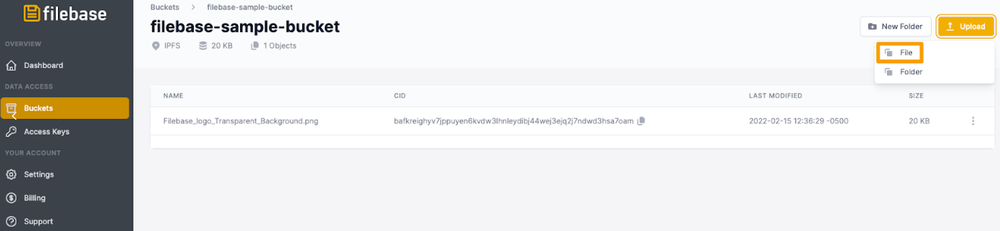
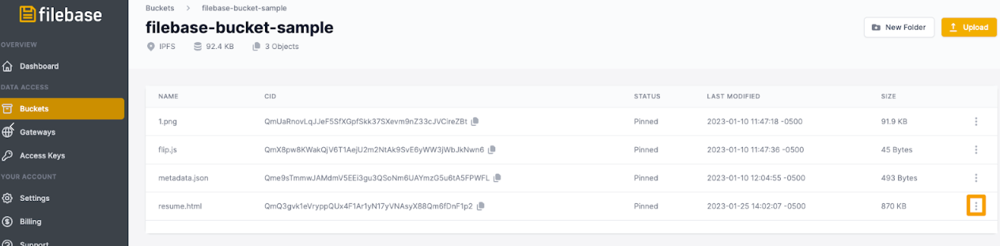
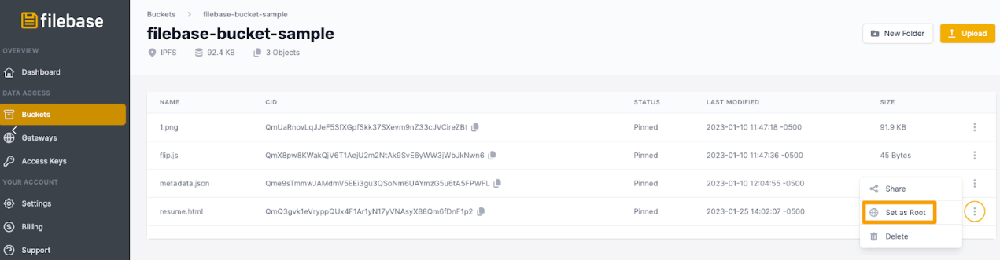

# IPFS 专用网关：托管简历或作品集
	了解如何使用 IPFS 专用网关托管静态网页，例如简历或作品集。
Filebase IPFS 专用网关可以配置为在网关的根部为单个 IPFS CID 提供服务。这意味着不需要在网关 URL 中指定 IPFS CID，默认情况下 URL 将托管配置的 CID。

例如，当使用 IPFS 网关时，格式通常如下：

使用具有根 CID 的专用网关时，路径和 CID 字段不需要返回根 CID。通过 Filebase 的专用网关将使用以下域结构：

	https://gatewayname.myfilebase.com
如果设置了根 CID，则可以共享此单个 URL 以分发存储的 CID 的内容。

在本教程中，我们将使用此功能来托管包含简历或投资组合信息的静态 HTML 文件。然后，可以分发此 URL 以使用人类可读、易于记忆的 URL 来分享您的简历。

1. 首先制作一个包含您的简历信息的 HTML 文件。可以在下面找到一个模板：

		<!DOCTYPE html>
		<html>
		<head>
		<title>
		[Name] - Resume</title>
		<meta name="viewport" content="width=device-width, initial-scale=1">
		
		</head>
		<body>
		<h1>[Name]</h1>
		<h3>[Email + Phone Number]</h3>
		<h3>[Address]<h3>
		

		<h2>[Most Recent Role Title and Company]: June 2022 - July 2023<h2>
		
[Role Description]

		
- Example of role responsibility. 

		
- Example of role responsibility. 

		
- Example of role responsibility. 

		
- Example of role responsibility. 

		

		<h2>[Previous Role Title and Company]: June 2021 - June 2022<h2>
		
[Role Description]

		
- Example of role responsibility. 

		
- Example of role responsibility. 

		
- Example of role responsibility. 

		
- Example of role responsibility. 

		

		<h2>Skills</h2>
		<h3>Skill 1</h3>
		
Description of Skill and length of experience with skill.

		<h3>Skill 2</h3>
		
Description of Skill and length of experience with skill.

		<h3>Skill 3</h3>
		
Description of Skill and length of experience with skill.

		</body>
		</html>

2. 编辑此 HTML 模板以反映您的信息或包含其他信息部分，然后将其保存为 “resume.html”。
3. 接下来，导航网关页到 Filebase Web 控制台上的

		Filebase IPFS 专用网关是一项仅对付费用户可用的功能。免费套餐的用户无法使用它们。
4. 选择右上角的“创建网关”按钮。

	
5. 将打开一个新窗口，提示您提供网关名称并选择网关的访问级别。

		网关名称受与存储桶名称相同的命名限制。所有网关名称必须是小写字母，介于 3-63 个字符之间，并且必须是唯一的。
	由于我们将使用此网关托管简历，因此选择能反映您的姓名或职称的内容可能是理想的选择。
	
	
6. 选择“公共”，然后选择“创建网关”。
7. 接下来，单击菜单中的 “Buckets” 选项以打开 Buckets 仪表板。

	您可以通过单击“创建桶”或选择现有桶来创建新的 IPFS 桶。
	
	
8. 选择您的 IPFS 存储桶。
9. 单击存储桶名称后，您将看到任何以前上传的文件。

	要上传文件，请选择“上传”，然后从选项中选择“文件”。
	
	
10. 选择您创建的包含简历信息的 HTML 文件。
11. 上传后，选择文件的附加选项菜单。

	
12. 从选项列表中选择“设置为根目录”。

	
13. 然后选择您之前创建的专用网关，然后选择“设置为根网关”。

	
14. 现在，当您打开专用网关时，无需在 URL 中指定文件的 IPFS CID 即可查看您的 HTML 简历

	