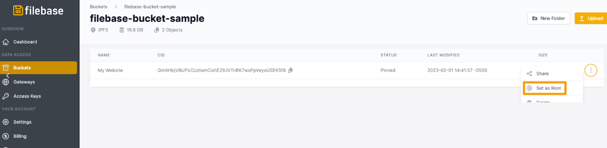
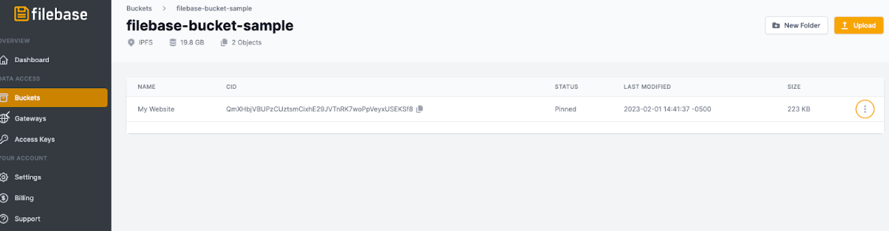
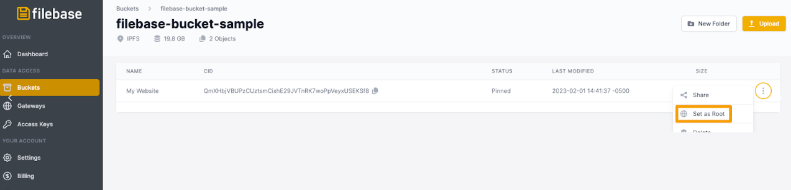
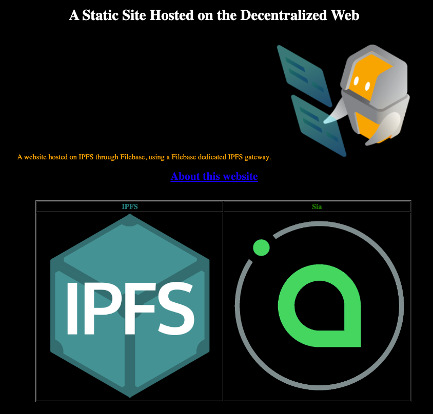

# IPFS 专用网关：托管静态网站
	了解如何使用 IPFS 专用网关托管静态网站。
Filebase IPFS 专用网关可以配置为在网关的根部为单个 IPFS CID 提供服务。这意味着不需要在网关 URL 中指定 IPFS CID，默认情况下 URL 将托管配置的 CID。

例如，当使用 IPFS 网关时，格式通常如下：

使用具有根 CID 的专用网关时，路径和 CID 字段不需要返回根 CID。通过 Filebase 的专用网关将使用以下域结构：

	https://gatewayname.myfilebase.com
如果设置了根 CID，则可以共享此单个 URL 以分发存储的 CID 的内容。

1. 首先创建一个名为“我的网站”的新文件夹并创建文件.index.html

	该文件是一个基本的 HTML 文件，用作您网站的主页。更改和编辑此文件以反映您网站的内容，并相应地设置样式。要了解有关 HTML 和 CSS 样式的更多信息，请参阅。

		<!DOCTYPE html>
		<html>
		<head>
		<title>A Static Site Hosted on the Decentralized Web</title>
		</head>
		<body style="background-color:black;">
		<h1 align="center" style="color:white;"> A Static Site Hosted on the Decentralized Web</h1>
		

		A website hosted on IPFS through Filebase, using a Filebase dedicated IPFS gateway.
		
		

		<ul align="center">
		<li>
		<li>
		<table border align="center">
		<tr> <th style="color:teal;">IPFS</th> <th style="color:green;">Sia</th>
		</tr>
		<tr><td>  </td> <td> </td></tr>
		</table>
		</body>
		</html>
2. 此示例使用 3 个图像文件，因此我们将它们保存在保存 index.html 文件的同一文件夹中。

	您希望与您的网站一起使用的任何文件，例如图像文件或脚本文件，都保存在此文件夹中。

	目前，该目录应如下所示：

	- My Website
		- index.html
		- image1.png
		- image2.png
		- image3.png
3. 然后，导航到 Filebase Web 仪表板。在 IPFS 网络上创建一个新的桶。

	
4. 选择您的存储桶，然后选择“上传”>“文件夹”。

	
5. 选择包含您的index.html文件和任何其他网站资产的网站文件夹，并将其上传到您的存储桶。

	
6. 接下来，导航到网关页 Filebase Web 控制台上的

	Filebase IPFS 专用网关是一项仅对付费用户可用的功能。免费套餐的用户无法使用它们。
7. 选择右上角的“创建网关”按钮。

	
8. 将打开一个新窗口，提示您提供网关名称并选择网关的访问级别。

		网关名称受与存储桶名称相同的命名限制。所有网关名称必须是小写字母，介于 3-63 个字符之间，并且必须是唯一的。
		
9. 选择“公共”，然后选择“创建网关”。
10. 接下来，单击菜单中的“Buckets”选项以打开 Buckets 仪表板。
11. 选择您将网站文件夹上传到的 IPFS 存储桶。
12. 选择文件夹的附加选项菜单。

	
13. 从选项列表中选择“设置为根目录”。

	
14. 然后选择您之前创建的专用网关，然后选择“设置为根网关”。

	
15. 现在，当您打开专用网关时，无需在 URL 中指定文件夹的 IPFS CID 即可查看您的网站

	